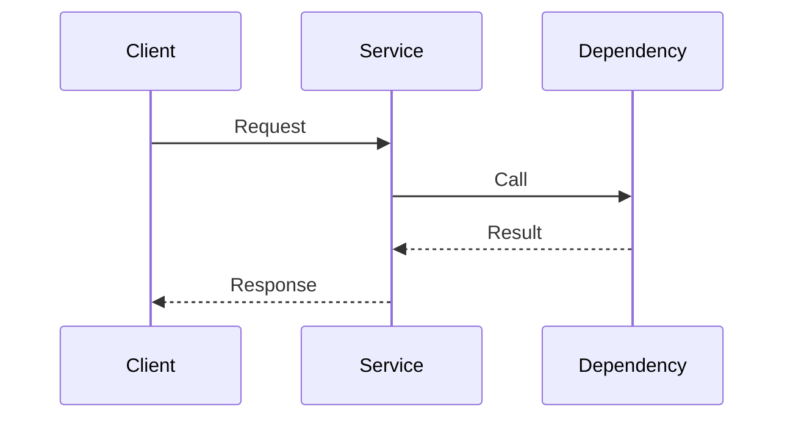

# SE Analysis Output Templates

## 使用说明

默认产出分两份：

- `analysis pack`：记录问题定义、研究证据、候选方案和开放问题
- `solution pack`：记录推荐方案和面向评审的结构化设计结果

建议保持：

- `analysis pack` 写到 `docs/analysis/`
- `solution pack` 写到 `docs/designs/`

## Analysis Pack Template

~~~markdown
# <主题> Analysis Pack

- 状态: 草稿
- 主题: <主题>
- 更新时间: <YYYY-MM-DD>

## 1. 问题陈述
- 当前要解决什么问题：
- 为什么现在要解决：

## 2. 当前范围
- 本轮必须覆盖：
- 本轮明确不做：

## 3. 参与者与系统边界
- 调用方：
- 服务方：
- 上下游：
- 边界说明：

## 4. 关键场景
- 场景 1：
- 场景 2：
- 失败 / 异常场景：

## 5. 约束与依赖
- 运行环境约束：
- 协议 / 接口约束：
- 资源 / 性能约束：
- 安全 / 合规约束：

## 6. 已确认事实
- F1:
- F2:

## 7. 假设
- A1:
- A2:

## 8. 开放问题
- O1:
- O2:

## 9. 研究问题
- RQ1:
- RQ2:

## 10. 仓库调研摘要
- 相关路径：
- 现有能力：
- 可复用组件：
- 仍未回答的问题：

## 11. 外部研究摘要
- 来源 1：
- 来源 2：
- 适用前提：

## 12. 候选方案

### Option A. <名称>
- 核心思路：
- 优点：
- 代价：
- 风险：

### Option B. <名称>
- 核心思路：
- 优点：
- 代价：
- 风险：

## 13. 方案矩阵
- 需求匹配度：
- 框架兼容度：
- 实现复杂度：
- DFX 风险：
- 参考代码量：

## 14. 推荐方向
- 推荐方案：
- 推荐理由：
- 仍依赖的假设：

## 15. 剩余风险与开放问题
- 风险 1：
- 风险 2：
~~~

## Solution Pack Template

~~~markdown
# <主题> Solution Pack

- 状态: 草稿
- 主题: <主题>
- 基于 Analysis Pack: <path>
- 更新时间: <YYYY-MM-DD>

## 1. 需求描述
- 目标：
- 成功标准：
- 本轮范围：
- 非目标：

## 2. 推荐方案
- 方案摘要：
- 为什么选它：
- 为什么不选其他方案：

## 3. 架构与模块划分
- 模块 1：
- 模块 2：
- 边界说明：

## 4. 接口设计
- 接口 / 协议：
- 调用方向：
- 关键语义：
- 异常处理：
- ownership：

## 5. 关键时序

## 6. DFX 设计

### 6.1 安全
- 风险：
- 设计应对：
- 残余风险：

### 6.2 性能
- 风险：
- 设计应对：
- 残余风险：

### 6.3 可靠性
- 风险：
- 设计应对：
- 残余风险：

### 6.4 可测试性
- 风险：
- 设计应对：
- 残余风险：

### 6.5 可维护性
- 风险：
- 设计应对：
- 残余风险：

### 6.6 可观测性
- 风险：
- 设计应对：
- 残余风险：

### 6.7 可部署性
- 风险：
- 设计应对：
- 残余风险：

## 7. AR 分解

### AR-001. <标题>
- 角色：
- 目标：
- 业务价值：
- 依赖：
- 验收要点：
- 风险 / 备注：
- 工作量级别：
- 参考代码量范围：
- 主要工作项：
- 关键不确定性：

## 8. AR 工作量汇总
- AR-001:
  - 工作量级别:
  - 参考代码量范围:
  - 主要驱动因素:
- AR-002:
  - 工作量级别:
  - 参考代码量范围:
  - 主要驱动因素:

## 9. 参考代码量估算
- 估算范围：
- 包含内容：
- 不包含内容：
- 主要不确定性：
- 置信度：

## 10. 剩余风险与开放问题
- 风险 1：
- 风险 2：
~~~

## 最小质量要求

- `analysis pack` 中要保留事实、假设和开放问题的边界
- `solution pack` 中要写清推荐理由，而不是只有结论
- 时序图至少表达关键交互，不必追求面面俱到
- DFX 至少覆盖当前最关键的 4 到 8 个维度
- AR 分解是需求切片，不是技术任务清单
- 每个 AR 应补充工作量分析，而不是只给总量估算
- 代码量估算必须带范围和置信度
