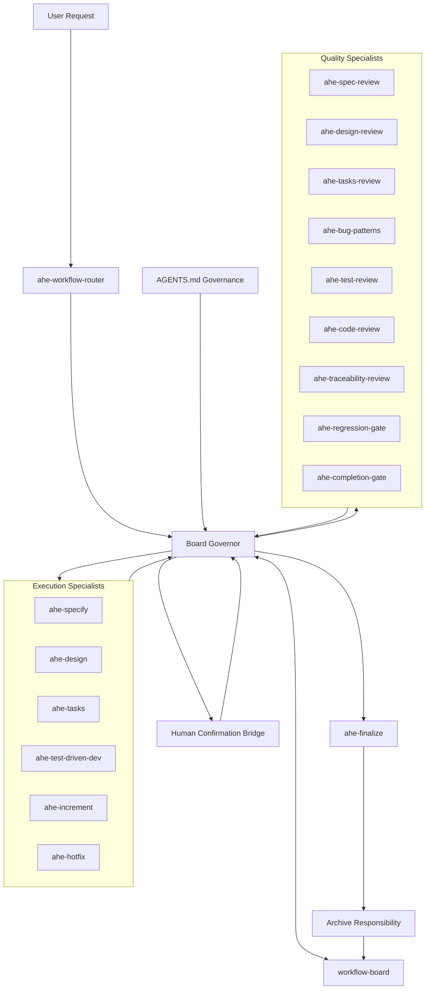

# AHE workflow 多 Agent 运行模型设计方案

- 状态: 草稿
- 日期: 2026-04-03
- 定位: 本文面向现有 `ahe-*` skill 家族，给出多 agent 运行模型的设计蓝图。
- 关联入口:
  - `README.md`
  - `skills/README.md`
  - `skills/ahe-skills-design.md`

## 概述

本设计的目标，不再是描述一个抽象的“多 agent workflow OS”，而是把真正会被 agent 主动领取的协调职责显式落成 `ahe-*` skills，让 AHE workflow 从以 **`ahe-workflow-router`**（runtime 恢复 / 编排；公开入口为 **`using-ahe-workflow`**）为中枢的强约束串行流程，演进为“协调层 skills + specialist skills + `workflow-board` 运行时对象”的板式运行模型。（Pre-split 时期曾由单一 **legacy 合并入口/router** skill 同时承担入口与 kernel，现已拆分；历史常用名见 `docs/ahe-workflow-shared-conventions.md`。）

这里有一个关键重构原则：

- `workflow-board`、lease、outcome、snapshot 仍然是**运行时对象**，不是 skill
- 任何需要由 agent 主动执行、写回结果、承担边界责任的角色，都应变成 `skills/ahe-*/SKILL.md`
- 已经存在且职责清晰的执行 / 质量节点，继续沿用现有 `ahe-*` 命名

换句话说，本方案的目标不是再维护一套平行命名体系，而是把“抽象角色图”收敛成一套真实可落地、路径真实存在、边界明确的 AHE workflow skills。

## 设计目标

1. 让多 agent 方案直接对齐现有 `skills/ahe-*` 家族，而不是再维护一套平行命名体系。
2. 让 coordination、execution、quality、human confirmation、archive 都有清晰职责边界。
3. 让 `workflow-board` 成为可恢复的运行时事实源，但在迁移期继续与工件视图 dual-read / dual-write。
4. 保留 AHE 当前最重要的纪律：先路由、再执行；profile 只调密度，不降门禁；fresh evidence 先于完成结论。
5. 让 `ahe-test-driven-dev` 继续作为唯一实现入口，而不是重新拆出第二个实现 skill。
6. 让 `ahe-finalize` 从“最终终点”回归为 closeout 节点，把归档冻结交给独立的 archive responsibility。

## 非目标

- 不把 AHE 设计成自由对话式 agent 群聊系统。
- 不允许 execution skill 自审、自批、自放行。
- 不在 `AGENTS.md` 之外复制一套平行治理源。
- 不追求一上来就让所有节点并行；主工件仍保持单写。
- 不要求第一批就重写全部已有 skill；先补协调层，再做 contract-first 对齐。

## 运行模型元素对应关系

| 当前组件 / 职责 | 形态 | 说明 |
| --- | --- | --- |
| `ahe-*` workflow family | workflow skills family | 整个 workflow 家族以扁平 `skills/ahe-*` 目录存在 |
| `skills/ahe-workflow-router/` | runtime router / 恢复编排 | canonical kernel；新请求识别与恢复入口（公开家族壳层见 `skills/using-ahe-workflow/`） |
| `Board Governor` | 协调层运行时角色 | 在本版文档中作为 runtime coordination responsibility 描述，不落成新的 skill 修改 |
| `Human Confirmation Bridge` | 协调层运行时角色 | 统一承接暂停点 / 审批证据桥接职责，但本次仅体现在文档设计中 |
| `archive responsibility` | 运行时 closeout / archive responsibility | 作为会话冻结与审计归档职责描述，不在本次改动中修改现有 skill |
| `workflow-board` | 运行时对象 | 逻辑对象，不直接等同于某个 skill 目录 |
| `skills/ahe-test-driven-dev/` | 实现入口 | 继续作为唯一实现入口 |
| `skills/ahe-increment/` | 变更支线 skill | 负责变更支线推进 |
| `skills/ahe-hotfix/` | 热修复支线 skill | 负责热修复支线推进 |
| `skills/ahe-finalize/` | closeout 节点 | 当前现有 closeout 节点 |
| `skills/ahe-bug-patterns/` / `skills/ahe-test-review/` / `skills/ahe-code-review/` | quality fan-out 首批并行节点 | 负责首批并行质量检查 |

## Skill 家族拆分

### 1. 协调层职责

这些职责负责会话编排、board 状态、暂停点与归档，不直接产出业务规格、设计或代码：

- `ahe-workflow-router`：识别新请求、恢复入口、决定是否进入 workflow、变更或热修复（`using-ahe-workflow` 仅分流到 router 或直接 leaf，不承担 transition machine）
- `Board Governor`：消费 `workflow-board`、治理注入和 outcome，重算 `readyNodes`、`blockedNodes`、lease 与唯一下一推荐步骤
- `Human Confirmation Bridge`：处理规格确认、设计确认、测试设计确认、可选 release approval 等显式暂停点
- `archive responsibility`：在 closeout 完成后冻结 session、汇总工件、写入归档索引

### 2. 执行层 skills

这些 skill 负责产出主工件或推进支线：

- `skills/ahe-specify/`
- `skills/ahe-design/`
- `skills/ahe-tasks/`
- `skills/ahe-test-driven-dev/`
- `skills/ahe-increment/`
- `skills/ahe-hotfix/`
- `skills/ahe-finalize/`

### 3. 质量层 skills

这些 skill 负责 review / gate / traceability：

- `skills/ahe-spec-review/`
- `skills/ahe-design-review/`
- `skills/ahe-tasks-review/`
- `skills/ahe-bug-patterns/`
- `skills/ahe-test-review/`
- `skills/ahe-code-review/`
- `skills/ahe-traceability-review/`
- `skills/ahe-regression-gate/`
- `skills/ahe-completion-gate/`

## 总体架构



这个结构刻意把旧稿中的角色图收敛成两类东西：

- **skills**：当前仓库真实存在、可被 agent 调用的 `skills/ahe-*/SKILL.md`
- **runtime objects / responsibilities**：`workflow-board`、lease、snapshot、outcome、change workspace、archive snapshot，以及本次尚未落成 skill 的协调职责

## 关键边界

### `ahe-workflow-router`（及公开入口 `using-ahe-workflow`）

`ahe-workflow-router` 不应再被视为“永远唯一的状态机”，而应被理解为：

- 新 session 的 runtime intake / router（用户常从 `using-ahe-workflow` 进入后再交给 router）
- 兼容模式下的恢复入口
- 当用户只说“继续”“推进”“开始做”且阶段不清时，由 router 做第一跳判断器

一旦 session 已建立，后续 `readyNodes`、lease、fan-out 收敛、profile 升级与冲突修正，应该由 runtime coordination layer 负责，而不是让 router 永远承担所有状态机逻辑。

### `Board Governor`

它是本次重构里新增的协调层核心职责，负责：

- 读 `AGENTS.md` 的治理注入结果
- 读 `workflow-board` 当前状态
- 基于最新 outcome 重算 `currentRecommendedStep`
- 维护 `readyNodes`、`blockedNodes`、`retryFromNode`
- 发放和回收 lease
- 在兼容期把 board 与 `task-progress.md` 做 dual-write

它**不直接写规格、设计、任务、代码、review 主体内容**。

### `Human Confirmation Bridge`

它把旧稿里分散的“真人确认”“审批等待”“外部审批证据接入”统一成一个运行时职责：

- 规格真人确认
- 设计真人确认
- 测试设计确认
- 可选 release approval
- 外部系统等价证据映射

它的职责是等待、记录、对齐状态，而不是替代 execution / quality 节点做判断。

### `ahe-finalize`

它负责写完 closeout record、release notes、evidence index、merge-back manifest 等收口工件。

在目标态设计里，它不应该被视为绝对终点；终态冻结与审计归档仍是独立职责。

### Archive Responsibility

它负责把本次 session 的最终采用工件、review / gate 摘要、verification 索引、board 快照和 merge-back 结果固化为可审计的 archive snapshot。

## 兼容模式与切换规则

迁移期不应假装已经完全 board-first。建议分两种模式：

### 兼容模式：`artifact-first + board-assisted`

在批次 1 到批次 3 中：

- `workflow-board` 与工件状态 dual-read / dual-write
- `task-progress.md` 仍然保留为用户可读 progress view
- gate 是否放行，仍必须与最新工件证据一致
- 如果 board 与 review / verification / progress 记录冲突，按更保守的工件证据处理
- runtime coordination layer 发现冲突后，应先阻止推进，再修正 board 投影

### 目标态：`board-first`

只有在以下条件满足后才切换：

- execution、review、gate 节点已有 machine-readable contract
- human confirmation 与 archive 的协调职责已纳入正式主链
- change / hotfix / finalize / merge-back 都已通过 board 协调
- 至少完成一轮 dual-run，确认 board 路由与 artifact-first 路由不分叉

## 运行时对象

### 1. `Workflow Session`

最小字段建议：

- `sessionId`
- `topic`
- `profile`
- `graphVersion`
- `governanceSnapshot`
- `baselineArtifacts`
- `changeWorkspace`
- `archiveTargets`
- `currentRecommendedStep`
- `readyNodes`
- `blockedNodes`

### 2. `Node Attempt`

- `attemptId`
- `nodeId`
- `nodeType`
- `leaseId`
- `dependsOn`
- `snapshotVersion`
- `ownerAgentType`
- `submittedOutcome`
- `retryFromNode`

### 3. `Artifact Snapshot`

- `artifactRole`
- `path`
- `version`
- `contentHash`
- `capturedAt`

### 4. `Lease`

- `leaseId`
- `nodeId`
- `ownerAgent`
- `requiredReads`
- `expectedWrites`
- `expiresAt`
- `heartbeatInterval`
- `retryPolicy`

### 5. `Outcome Record`

- `outcome`
- `findings`
- `evidence`
- `recommendedNextNode`
- `retryFromNode`
- `remainingRisks`

## 节点状态机

建议继续使用统一状态集合：

| 状态 | 含义 |
| --- | --- |
| `pending` | 前置条件未满足 |
| `ready` | 可领取，尚未分配 lease |
| `leased` | 已被某个 agent 领取 |
| `submitted` | 已提交结果，待 governor 校验 |
| `passed` | 节点完成，允许解锁下游 |
| `revise` | 需要修订，并回退到 `retryFromNode` |
| `blocked` | 缺少关键证据或外部条件 |
| `waiting_human` | 进入 human confirmation responsibility 等待人类输入 |
| `stale` | lease 超时或上下文过期 |
| `cancelled` | 因 profile 升级、支线切换或工作项失效而取消 |
| `archived` | 已完成冻结归档 |

## Node Contract 形式

目标态下，每个关键 `ahe-*` 节点都应具备 machine-readable contract。最小字段建议为：

- `nodeId`
- `nodeType`
- `profiles`
- `requiredReads`
- `expectedWrites`
- `allowedOutcomes`
- `retryFromNode`
- `parallelism`
- `pauseKind`
- `humanConfirmationRequired`

示例：

```yaml
nodeId: ahe-code-review
nodeType: quality
profiles: [full, standard]
requiredReads:
  - approvedDesign
  - codeChanges
  - testChanges
expectedWrites:
  - reviewRecords/code-review-<attemptId>.md
allowedOutcomes: [pass, revise, blocked]
retryFromNode: ahe-test-driven-dev
parallelism:
  mode: read_only_parallel
pauseKind: none
humanConfirmationRequired: false
```

## Profile 节点图

### Full Profile

```text
ahe-workflow-router
-> Board Governor
-> ahe-specify
-> ahe-spec-review
-> Human Confirmation Bridge(spec-approval)
-> ahe-design
-> ahe-design-review
-> Human Confirmation Bridge(design-approval)
-> ahe-tasks
-> ahe-tasks-review
-> Human Confirmation Bridge(test-design-confirm)
-> ahe-test-driven-dev
-> quality-fanout[ahe-bug-patterns | ahe-test-review | ahe-code-review]
-> ahe-traceability-review
-> ahe-regression-gate
-> ahe-completion-gate
-> Human Confirmation Bridge(release-approval?)
-> ahe-finalize
-> Archive Responsibility
```

说明：

- `ahe-test-driven-dev` 仍是唯一实现节点
- 测试设计确认不是新执行 skill，而是由 human confirmation responsibility 处理的暂停类型
- `quality-fanout` 是 board 上的合成批次步骤，不是单独 skill 目录
- `ahe-traceability-review` 是 quality fan-out 之后的 barrier + aggregator

### Standard Profile

```text
ahe-workflow-router
-> Board Governor
-> ahe-tasks
-> ahe-tasks-review
-> Human Confirmation Bridge(test-design-confirm)
-> ahe-test-driven-dev
-> quality-fanout[ahe-bug-patterns | ahe-test-review | ahe-code-review]
-> ahe-traceability-review
-> ahe-regression-gate
-> ahe-completion-gate
-> Human Confirmation Bridge(release-approval?)
-> ahe-finalize
-> Archive Responsibility
```

### Lightweight Profile

```text
ahe-workflow-router
-> Board Governor
-> ahe-tasks
-> ahe-tasks-review
-> Human Confirmation Bridge(test-design-confirm)
-> ahe-test-driven-dev
-> ahe-regression-gate
-> ahe-completion-gate
-> Human Confirmation Bridge(release-approval?)
-> ahe-finalize
-> Archive Responsibility
```

说明：

- lightweight 变短的是质量链，不是对测试设计确认或 fresh evidence 的降级
- 若在 lightweight / standard 中发现上游依据缺失，应由 runtime coordination layer 升级 profile，而不是继续向下游推进

## Quality Fan-out 收口规则

`quality-fanout` 只允许并行只读质量节点：

- `ahe-bug-patterns`
- `ahe-test-review`
- `ahe-code-review`

固定规则：

- 只有三个节点都提交 outcome，或任一节点进入 `blocked`，governor 才能关闭批次
- 聚合优先级固定为：`blocked` > `revise` > `pass`
- 任一节点 `blocked`，整批视为 `blocked`
- 没有 `blocked` 但任一节点 `revise`，整批回到 `ahe-test-driven-dev`
- 只有三个节点全部 `pass`，才允许进入 `ahe-traceability-review`
- 如果发现问题明确指向规格 / 设计 / 任务缺失，应由 coordination layer 升级 profile 或回退更上游节点，而不是卡在实现层死循环

## 支线工作流

### 变更支线

目标态下，`ahe-increment` 应从“影响分析 skill”演进为 change-session 工厂：

```text
change-request
-> ahe-workflow-router
-> Board Governor
-> ahe-increment
-> change-workspace-open
-> spec-delta?
-> design-delta?
-> tasks-delta?
-> reroute-to-main-graph
-> ahe-finalize
-> merge-back
-> Archive Responsibility
```

关键规则：

- 所有变更先进入独立 `change workspace`
- delta artifacts 在 merge-back 前都不是 baseline facts
- 只有实现、review、gate、finalize 全部通过后，才允许 merge-back
- merge-back 必须基于 fresh baseline snapshot 做 compare-and-set

### 热修复支线

```text
hotfix-request
-> ahe-workflow-router
-> Board Governor
-> ahe-hotfix
-> repro-confirm
-> hotfix-workspace-open
-> Human Confirmation Bridge(test-design-confirm)
-> ahe-test-driven-dev
-> targeted-quality
-> ahe-regression-gate
-> ahe-completion-gate
-> ahe-finalize
-> merge-back
-> Archive Responsibility
```

关键规则：

- 没有可靠复现，不得发修复 lease
- 热修实现仍然只通过 `ahe-test-driven-dev`
- targeted-quality 可以缩短，但不得完全跳过
- hotfix merge-back 同样需要 fresh baseline compare-and-set

## 暂停点与审批

暂停点不再散落在各个 skill 的 prose 里，而由 `pauseKind` + human confirmation responsibility 统一承接。

必须暂停的场景：

- `spec-approval`
- `design-approval`
- `test-design-confirm`
- 可选 `release-approval`
- 证据冲突且无法自动保守回退的人工仲裁点

自动推进的场景：

- 普通 execution 节点
- 普通 quality 节点
- gate 在 board 校验为 `pass` 后的下游迁移

## 并发与冲突控制

### 并发原则

- 主工件单写
- quality fan-out 只读并行
- gate、finalize、archive 串行
- review / verification 记录尽量 append-only

### 提交校验

提交结果时，governor 必须执行 compare-and-set：

- `snapshotVersion` 未变化时，允许接纳
- 若主工件已变化，不得直接覆盖
- 冲突时应进入 `revise`、`blocked` 或人工仲裁

### 租约规则

- lease 必须带 TTL 与 heartbeat
- 超时未续租时，节点回到 `ready` 或进入 `stale`
- agent 只能写 `expectedWrites` 中声明的范围
- 超范围写入视为违规提交

## 治理注入

本设计比单 agent 版本更依赖 `AGENTS.md`。coordination layer 必须从 `AGENTS.md` 读取：

- 工件角色到真实路径的映射
- approval / pass / revise / blocked 的状态别名
- 人类确认的等价证据来源
- spec / design / tasks / review / verification 模板覆盖
- coding / design / testing 规范
- profile 强制规则与高风险模块规则
- 哪些模块禁止并发或强制额外人工审批

禁止把这些规则复制到：

- 私有 board config
- 多个 skill 的重复硬编码 frontmatter
- 与 `AGENTS.md` 平行的映射文件

## 迁移路线图

### 批次 1：Board Runtime 最小落地

目标：

- 先把多 agent 概念稿收敛为 AHE 命名与职责拆分
- 把 `workflow-board` / lease / outcome / archive 作为明确运行时对象描述清楚
- 让现有 `ahe-workflow-router`（与 `using-ahe-workflow` 入口分层）、`ahe-test-driven-dev`、质量层和支线 skill 有一致的目标态对齐坐标

### 批次 2：Contract-first 对齐

目标：

- 让 `ahe-workflow-router`、`ahe-test-driven-dev`、质量层和支线 skill 拥有明确 contract
- 统一 pauseKind / retryFromNode / expectedWrites / requiredReads
- 明确 finalize、archive、human confirmation 的运行时边界

### 批次 3：Quality Fan-out 并发化

目标：

- 让 `ahe-bug-patterns`、`ahe-test-review`、`ahe-code-review` 获得受控并发
- 由 coordination layer 统一完成 fan-out 收口

### 批次 4：Board-first Session

目标：

- 把主链与支线切到 `board-first`
- 让 session 恢复、merge-back、archive 全部由 board 原生协调
- 让 `ahe-workflow-router` 收敛为 intake / runtime router，而不是继续承担全部状态机职责（公开入口由 `using-ahe-workflow` 承担）

## 首批建议落地范围

为了控制范围，第一轮建议只落下面这些内容：

1. 这份 AHE 版本的多 agent 设计文档
2. `workflow-board` / lease / outcome / archive 的最小 schema 说明
3. `ahe-workflow-router`、`ahe-finalize`、quality fan-out 与 human confirmation 的边界对齐方案
4. mixed-mode 下的 dual-read / dual-write 与 cutover 判定规则

## 风险与缓解

| 风险 | 说明 | 缓解策略 |
| --- | --- | --- |
| `Self-approval risk` | execution skill 既做又批 | execution / quality / human confirmation 强隔离 |
| `State drift risk` | 继续依赖聊天记忆推进 | 一切迁移以 board snapshot 与工件证据为准 |
| `Write conflict risk` | 多节点同时改主工件 | 主工件单写，质量层只读并行，提交 compare-and-set |
| `Infinite retry risk` | revise 死循环 | 设置重试阈值，超限回退更上游或人工仲裁 |
| `Governance fork risk` | 规则散落在 skill / board / 文档 | 治理只从 `AGENTS.md` 注入 |

## 成功标准

如果本设计落地成功，应看到：

- `ahe-*` workflow 家族能表达 full / standard / lightweight 三档 profile
- 从任意中断点恢复时，不再依赖聊天记忆猜阶段
- `ahe-test-driven-dev` 继续保持唯一实现入口
- quality fan-out 只缩短等待时间，不破坏门禁
- finalize、archive、human confirmation 的职责边界清晰
- `task-progress.md` 在兼容期保持 progress view 身份，而不是继续承担唯一事实源

## 开放问题

- `workflow-board` 的持久化形态优先选 YAML、JSON 还是目录化 records，仍待确认。
- human confirmation responsibility 如何最稳妥地接入不同宿主环境中的审批证据来源，仍需按平台能力细化。
- `quality-fanout` 的超时策略应是阻塞等待、自动重发一次，还是引入人工仲裁阈值，仍需在实现前定稿。

## 一句话总结

推荐把多 agent 运行方案收敛为一套以现有 `ahe-*` skill 家族为基础的运行模型：由 `ahe-workflow-router`（配合 `using-ahe-workflow` 公开入口）负责 runtime intake，由 `workflow-board` 承担运行时事实源，由 coordination layer 管理 lease、fan-out、pause 与 archive，并由既有 execution / quality skills 承担节点职责，从而把抽象角色图重构成可落地的 AHE workflow operating model。
