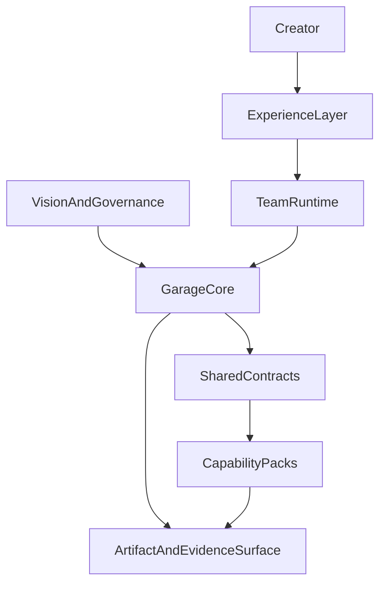

# A110: Garage Extensible Layered Architecture

- Architecture ID: `A110`
- 状态: 草稿
- 日期: 2026-04-11
- 定位: 定义 `Garage` 在 phase 1 应先冻结的可扩展分层架构，确保未来新增能力时以“扩展为主、修改最小”为默认方式推进。
- 当前阶段: phase 1
- 关联文档:
  - `docs/GARAGE.md`
  - `docs/architecture/A120-garage-core-subsystems-architecture.md`
  - `docs/features/F010-shared-contracts.md`
  - `docs/architecture/A130-garage-continuity-memory-skill-architecture.md`
  - `docs/features/F110-reference-packs.md`
  - `docs/wiki/W030-hermes-agent-harness-engineering-analysis.md`
  - `docs/wiki/W010-clowder-ai-harness-engineering-analysis.md`
  - `docs/wiki/W140-ahe-platform-first-multi-agent-architecture.md`

## 1. 这篇文档要解决什么

`Garage` 不是一个只服务当前能力集合的项目。

它今天虽然从 `coding` 和 `product insights` 起步，未来却需要能承接更多能力，例如：

- `writing`
- `video`
- `research`
- `course`
- 其他尚未定义但具有明确创作产出的 pack

因此，`Garage` 的架构起点不能是“先把这几个能力做完”，而必须是：

**先定义一个稳定、分层、可扩展的系统骨架，再让不同能力以 pack 形式接入。**

这篇文档只做一件事：

- 先冻结顶层架构边界

这篇文档暂时不做：

- 具体服务实现
- 具体 schema 字段全集
- 具体目录迁移细节
- 具体角色列表和节点图

也就是说，当前阶段我们先回答“系统应该怎么长”，而不是立刻回答“每个零件怎么写”。

## 2. 设计目标

`Garage` 的架构在 phase 1 需要同时满足 6 个目标：

1. 未来新增能力时，主要通过新增 pack，而不是修改核心。
2. 平台层保持中立，不被 `coding`、`writing`、`video` 等任何单一领域锁死。
3. AI 团队可以持续扩展，但角色不由平台硬编码，而由 pack 注册。
4. 系统先支持 `Markdown-first`、`file-backed` 的轻量工作方式，不依赖数据库才能成立。
5. 不同入口未来可以接入同一核心，而不是各自长出一套流程语义。
6. 架构拆解应按“总 -> 分”推进，先冻结分层与 contract，再逐步冻结内部细节。

## 3. 外部参考如何吸收

`Garage` 不从零发明架构，而是吸收两类已经被验证过的结构思想。

### 3.1 从 Hermes 吸收的部分

主要吸收：

- 长期主体视角：系统不只是一次性对话器，而是长期存在的创作系统
- 多入口统一核心：不同入口不应复制一套核心逻辑
- `memory / session / skill` 分层：长期事实、会话过程状态、可复用方法必须拆开，`evidence` 另行作为可追溯记录层独立存在
- 扩展 seam 先定义边界：开放能力时必须先约束写入面和作用范围

不直接照抄：

- 单体 monolith 形态
- 过深的运行时实现细节
- 对个人 runtime 的具体产品形态复刻

### 3.2 从 Clowder 吸收的部分

主要吸收：

- `Model / Agent CLI / Platform` 三层边界
- 平台作为控制面，而不是 workflow 外壳
- 共享契约独立成层
- 治理工件化：愿景、规则、门禁和架构都先写成工件
- adapter 吃掉宿主差异，避免 workflow 分叉

不直接照抄：

- 团队级复杂控制面
- 重型本地脚本和多进程环境的具体形态
- 宽边界平台的全部复杂度

## 4. 总体架构

从顶层看，`Garage` 应被定义成：

**一个 `Markdown-first Creator OS Core`，上面挂载多个 `Capability Packs`，下面通过统一的 `Artifact And Evidence Surface` 管理创作结果与运行痕迹。**

这张图表达的不是实现顺序，而是责任顺序：

- 用户从入口层进入
- 用户感知到的是 AI 团队运行时
- 真正稳定的系统能力收敛在 `Garage Core`
- pack 通过 shared contracts 接入
- 所有结果最终沉淀到 artifact 和 evidence surface

## 5. 第一层拆解：6 个顶层分层

### 5.1 Vision And Governance

这一层负责编写、维护和冻结：

- 项目愿景
- 术语
- 规则
- 门禁
- 审批语义
- 归档语义

这一层的作用，是先把系统原则写成工件，再让平台和 pack 去读取、注入和执行这些原则。

### 5.2 Experience Layer

这一层是用户接触系统的地方，例如未来的：

- IDE 入口
- CLI 入口
- 聊天入口
- 轻 UI

这一层只负责接入与展示，不负责领域逻辑，不承载创作流程本体。

### 5.3 Team Runtime

这是用户看到的“AI 创作团队”。

但这一层不是写死的角色集合，而是团队协作语义层。它负责：

- 角色协作
- 任务交接
- 上下文衔接
- review 与补位
- 与人类判断点对齐

这里的平台只定义团队协作 contract，不预置全部角色。  
具体角色由各个 pack 注册。

phase 1 中，`Team Runtime` 仍然是一个独立的概念层，但不需要先落成单独的重型平台服务。

它在当前阶段主要由下面这些稳定部件共同实现：

- `Session`：提供统一会话边界与 handoff 状态
- `RoleContract`：声明谁能参与什么协作
- `WorkflowNodeContract`：声明协作节点与流转边界
- `Governance`：约束 review、审批与人类判断点
- pack-local handoff patterns：决定各领域内部的具体协作节奏

也就是说，phase 1 的 `Team Runtime` 是一个由 core 与 shared contracts 共同承载的协作层，而不是额外再造一套并行控制面。

### 5.4 Garage Core

这是整个系统的稳定核心。

它只理解中立对象：

- `session`
- `pack`
- `role`
- `node`
- `artifact`
- `evidence`
- `approval`
- `archive`

它不直接理解：

- `spec`
- `outline`
- `article`
- `shotlist`
- `prompt draft`

这些都属于 pack 层术语。

### 5.5 Shared Contracts

这一层是扩展能力的关键。

它定义：

- pack 如何接入
- role 如何注册
- node 如何声明输入输出
- artifact 如何落盘与回读
- evidence 如何记录
- host 如何适配

如果这一层设计正确，未来新增能力就应主要表现为“新增 contract 实现”，而不是“回头修改 core”。

### 5.6 Artifact And Evidence Surface

这是 phase 1 的主事实层。

这里坚持：

- Markdown 作为主工件
- 轻量 metadata / sidecar 承载机器可读状态
- 所有 pack 使用统一的工件角色和证据语义

这样系统即使还没有服务化，也能先具备可读、可追溯、可扩展的基本形态。

## 6. 第二层拆解：稳定核心 vs 可变能力

从“扩展开放，修改关闭”的角度看，`Garage` 必须明确什么是稳定核心，什么是可变能力。

### 6.1 稳定核心

这些部分应该尽量长期保持稳定：

- `Session Router`
- `Pack Registry`
- `Role Registry`
- `Governance Injection`
- `Artifact Routing`
- `Evidence / Review / Approval / Archive`
- `Host Adapter Contract`

稳定核心的目标是：

- 编排
- 约束
- 路由
- 追溯
- 统一入口语义

### 6.2 可变能力

这些部分应该允许不断增长和替换：

- pack 内部角色
- pack 内部节点图
- pack 的术语
- pack 的模板和 prompts
- pack 的 artifact 映射
- pack 的 review checklist
- pack 的 publish / completion 规则

可变能力的目标是：

- 适应不同创作领域
- 容纳新的产物形态
- 让新能力进入时不破坏平台层

## 7. 开闭原则在 Garage 里的落法

`Garage` 的开闭原则可以压缩成一句话：

**核心只负责“怎么协作、怎么编排、怎么落盘、怎么追溯”，pack 才负责“写什么、做什么、产出什么”。**

为了真正做到这一点，平台必须遵守 4 条硬规则。

### 7.1 新能力通过新增 pack 扩展

新增 `Writing Pack`、`Video Pack`、未来其他 pack 时，默认动作应该是：

- 注册新 pack
- 提供 pack manifest
- 声明自己的角色、节点和 artifact mapping

而不是在核心里添加新的领域条件分支。

### 7.2 新角色通过 role contract 扩展

平台只定义角色 contract，不直接写死一整套组织结构。

这意味着：

- `coding` pack 可以注册自己的角色
- `product insights` pack 可以注册自己的角色
- 未来 `writing`、`video` 也可以注册自己的角色

平台本身不为某个单一领域承担角色语义。

### 7.3 新工件通过 artifact contract 扩展

平台不直接理解具体领域文件名和术语，而是理解中立的 `artifactRole`。

不同 pack 再把自己的工件映射到这个中立层。

### 7.4 新入口通过 host adapter 扩展

未来无论是 IDE、CLI、聊天还是 UI，都应通过 adapter 接入同一个 core。

不能让不同入口各自生长出独立流程。

## 8. phase 1 先冻结哪些 contract

当前阶段，不需要一次性冻结所有实现细节，但应该先冻结 6 类最小 contract。

### 8.1 PackManifest

定义一个 pack 的最小身份：

- `packId`
- 入口节点
- 角色声明
- 支持的 artifact roles
- 依赖的模板 / 规则面

### 8.2 RoleContract

定义一个角色如何进入系统：

- `roleId`
- 角色职责
- 可读工件
- 可写工件
- 可触发节点

### 8.3 WorkflowNodeContract

定义一个节点的协作边界：

- 输入
- 输出
- 允许流转
- 是否需要人工确认
- 是否允许并行

### 8.4 ArtifactContract

定义工件的稳定接口：

- `artifactRole`
- 权威路径规则
- 文件类型
- metadata / sidecar 约定

### 8.5 EvidenceContract

定义 review、decision、verification、archive 的记录方式：

- 最小记录结构
- lineage 关联
- 归档最小语义

### 8.6 HostAdapterContract

定义外部入口如何和 core 说话：

- 如何创建 session
- 如何恢复 session
- 如何提交步骤
- 如何触发审批
- 如何请求发布 / closeout

## 9. phase 1 参考 pack

当前阶段，`Garage` 不急着一次性把所有能力做成完整 pack。

phase 1 只需要先用两个 reference packs 验证平台 contract：

- `Coding Pack`
- `Product Insights Pack`

同时为后续能力预留接入面：

- `Writing Pack`
- `Video Pack`

这代表我们当前的重点是：

- 验证平台中立边界
- 验证 contract 是否足以支撑不同领域
- 验证角色注册和 artifact mapping 的可扩展性

而不是先追求能力广度。

## 10. 当前不做什么

为了避免架构过早失控，phase 1 明确不做下面这些事：

- 不先做成重型数据库平台
- 不先做成完整多用户 SaaS
- 不先冻结所有角色和节点
- 不先把 `writing`、`video` 做成完整实现
- 不把平台和具体 pack 语义混写在一起

当前阶段的成功标准是：

- 顶层层次稳定
- 核心 contract 明确
- 新能力可以按注册方式进入
- 当前资产能逐步转译成 `Garage` 下的 reference packs

## 11. 后续拆解顺序

这一版文档只完成“总”的部分。

接下来应按“总 -> 分”的顺序继续拆：

1. 先拆 `Garage Core`
   - 当前拆解文档见 `docs/architecture/A120-garage-core-subsystems-architecture.md`
   - 其中包括 `Session`、`Registry`、`Governance`、`Artifact Routing`、`Evidence`
2. 再拆 `Shared Contracts`
   - 当前拆解文档见 `docs/features/F010-shared-contracts.md`
   - 其中包括 `PackManifest`、`RoleContract`、`WorkflowNodeContract`、`ArtifactContract`、`EvidenceContract`、`HostAdapterContract`
3. 再拆 continuity layers
   - 当前拆解文档见 `docs/architecture/A130-garage-continuity-memory-skill-architecture.md`
   - 其中包括 `memory`、`session`、`skill`、`evidence` 的持续性分层
4. 再拆 phase 1 的 reference packs
   - 当前拆解文档见 `docs/features/F110-reference-packs.md`
   - 其中包括 `Coding Pack` 与 `Product Insights Pack`
5. 最后再考虑是否需要把部分 contract 服务化

这个顺序的意义是：

- 先确定稳定骨架
- 再确定扩展接口
- 再定义具体能力

而不是一上来把细节做死。

## 12. 一句话结论

`Garage` 的正确起点，不是先堆出很多 AI 能力，而是先定义一个稳定的 Creator OS 骨架：平台只负责团队协作、编排、治理、工件和证据契约；具体的 `coding`、`product insights`、`writing`、`video` 等能力都通过 pack 接入，角色也由 pack 注册，从而让未来扩展主要表现为新增，而不是重写。

## 13. 遵循的设计原则

- 平台中立：平台层只理解中立对象，不理解具体领域名词。
- 分层优先：先稳定层次和边界，再下沉到具体实现。
- Open for extension, closed for modification：新增能力优先通过 pack、contract 和 mapping 扩展，而不是修改核心。
- `Markdown-first`：主工件与主证据优先保持人类可读。
- `File-backed`：phase 1 默认以文件为主事实源，不以数据库为前提。
- `Contract-first`：先冻结 pack、role、node、artifact、evidence 的协作接口，再谈服务化。
- Team Runtime 由稳定部件承载：团队协作层先由 `Session`、contracts、治理与 pack handoff 共同实现，不提前长成重型平台。
- phase 1 克制：先用少量异质能力验证架构成立，再扩大能力面。
