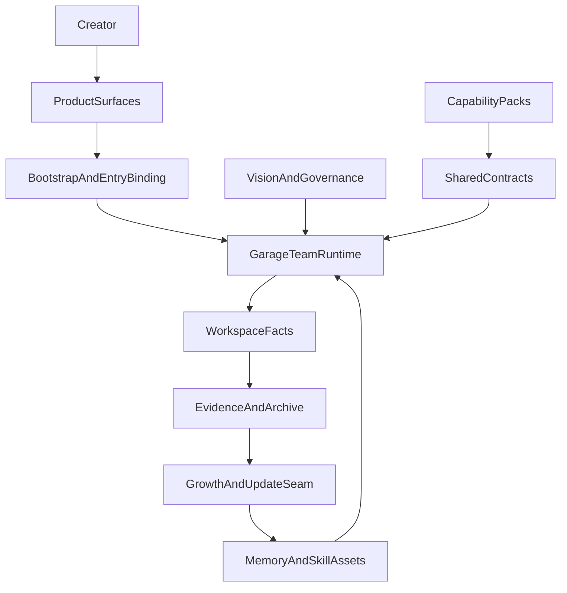

# A110: Garage Platform Boundaries, Extension, And Growth Seams

- Architecture ID: `A110`
- 状态: 草稿
- 日期: 2026-04-11
- 定位: 在 `A105` 已冻结 `Garage Team` 作为一等产品对象、`A115` 已冻结产品入口与宿主能力注入关系之后，继续定义 `Garage` 的顶层平台边界，明确哪些层负责承接产品本体，哪些 seam 负责扩展新能力，哪些 seam 负责让团队持续成长。
- 当前阶段: 完整架构主线，实施将按切片推进
- 关联文档:
  - `docs/VISION.md`
  - `docs/GARAGE.md`
  - `docs/architecture/A105-garage-team-workspace-and-first-class-objects.md`
  - `docs/architecture/A115-product-surfaces-and-host-capability-injection.md`
  - `docs/architecture/A120-garage-core-subsystems-architecture.md`
  - `docs/architecture/A130-garage-continuity-memory-skill-architecture.md`
  - `docs/architecture/A140-garage-system-architecture.md`
  - `docs/features/F010-shared-contracts.md`
  - `docs/features/F080-garage-self-evolving-learning-loop.md`
  - `docs/features/F210-runtime-home-and-workspace-topology.md`
  - `docs/features/F220-runtime-bootstrap-and-entrypoints.md`
  - `docs/features/F230-runtime-provider-and-tool-execution.md`

## 1. 文档目标与范围

这篇文档只回答一个问题：

**如果 `Garage` 首先是一个 `Agent Teams` 工作环境，那么它的顶层平台边界应该怎样切，才能既支撑产品本体，又允许能力持续扩展、团队持续成长，而不让入口、宿主或单一能力面反向定义系统。**

本文覆盖：

- 平台顶层层次与责任边界
- 能力扩展 seam
- 团队成长 seam
- 哪些东西绝不能被入口、宿主或单一 pack 复制

本文不覆盖：

- 具体 runtime 子系统图
- 具体 schema 字段全集
- 具体 pack 角色树和节点图
- 具体执行协议或任务拆解

## 2. 顶层设计目标

`Garage` 的顶层平台边界需要同时满足下面 8 个目标：

1. 用户面对的是 `Garage Team`，而不是模型或工具开关。
2. `CLIEntry` 和 `WebEntry` 能直接成立为独立工作环境。
3. `HostBridgeEntry` 只作为能力注入层存在，不能反向成为系统真相源。
4. 新能力优先通过 packs、contracts 与 registration 进入系统，而不是回头修改 core。
5. 团队做过的事情要能沉淀成长期资产，而不是永远停留在一次性 session 里。
6. `memory / session / skill / evidence` 必须长期分层，不能混成一个历史桶。
7. 主动成长必须存在，但必须受 evidence 与治理约束。
8. workspace-first facts 必须继续成为长期团队状态的可读锚点。

## 3. 这组目标背后的 5 条设计公理

这组目标不是从“今天先做哪些功能”倒推出来的，而是从 `docs/VISION.md` 里的 5 条设计公理推出来的。

| 设计公理 | 对顶层边界的直接要求 |
| --- | --- |
| 团队先于工具 | 产品第一语言必须是 team / agent / role / handoff / review / memory / skill，而不是 model/tool shell。 |
| 人定方向，AI 在治理中放大 | 执行与成长都必须被治理工件和 runtime 判定约束。 |
| 扩展与成长并列 | 顶层必须同时存在能力扩展 seam 与团队成长 seam。 |
| 长期连续性先于单轮聪明 | runtime 必须高于单次入口长期存在，continuity 资产必须分层。 |
| `evidence-first`、`workspace-first`、`governance-bounded` | workspace facts 是长期锚点，成长必须从 evidence 出发并经过显式治理。 |

## 4. 顶层骨架与边界原则

从顶层看，`Garage` 应被定义成：

**一个 `workspace-first`、`multi-entry` 的 `Agent Teams` 工作环境，以及支撑它的可扩展、可持续成长的 `Garage Team runtime`。**

`A110` 在这里只回答 4 个边界问题：

1. 谁负责承载产品表面与团队对象。
2. 谁负责把不同入口翻译成统一 runtime 动作。
3. 谁负责持有长期稳定的平台语义。
4. 系统通过什么 seam 扩展能力，又通过什么 seam 成长自己。

这张图表达的是顶层骨架，而不是实现顺序：

- `ProductSurfaces` 承载产品入口，但不拥有 runtime 真相。
- `BootstrapAndEntryBinding` 把不同入口翻译成统一 runtime 动作。
- `GarageTeamRuntime` 持有长期稳定的团队协作语义。
- `SharedContracts + CapabilityPacks` 是能力扩展 seam。
- `WorkspaceFacts + EvidenceAndArchive + GrowthAndUpdateSeam + MemoryAndSkillAssets` 是团队成长 seam。

## 5. 顶层分层

### 5.1 Product Surfaces

负责：

- 承载 `CLIEntry` 与 `WebEntry` 这两个独立工作环境
- 承载 `HostBridgeEntry` 作为能力注入表面
- 承载用户与 `Garage Team` 的直接交互

不负责：

- 持有 runtime 真相
- 私有化 session / execution 语义
- 定义 pack 或 provider 语义

### 5.2 Bootstrap And Entry Binding

负责：

- 解析启动意图
- 绑定 profile、workspace 与 host adapter
- 把不同入口表面翻译成统一 runtime 动作

不负责：

- pack 业务语义
- 长期成长判断
- provider/tool 的实现细节

### 5.3 Garage Team Runtime

负责：

- 承载 team / agent / role / handoff / review 的长期协作语义
- 让不同入口 family 进入同一套 team runtime
- 让 memory、skill 和当前 session 在同一条团队主线里被激活

不负责：

- 持有宿主私有状态
- 退化成某一个 pack 的私有协作层
- 直接替代 workspace facts

### 5.4 Shared Contracts

负责：

- 冻结 capability 接入共同语言
- 保证 core 继续只理解中立对象
- 让 packs 通过注册和映射扩展团队能力

不负责：

- 代替 pack 设计
- 代替 session 激活当前上下文
- 代替治理或执行本身

### 5.5 Capability Packs

负责：

- 承载不同领域的 team capability family
- 承载各自的 roles、nodes、artifact mapping 与 pack-local overlay
- 把领域语义映射到平台共同语言上

不负责：

- 改写平台中立词汇表
- 让单一能力面上升为平台核心
- 持有 runtime authority 真相

### 5.6 Workspace Facts

负责：

- 承载 artifacts、evidence、sessions、archives 与 `.garage/`
- 作为团队长期状态和结果的主事实面
- 保证系统可读、可追溯、可恢复

不负责：

- 替代 runtime home
- 吞并 install-scoped 配置和缓存
- 变成任意全局状态桶

### 5.7 Growth And Update Seam

负责：

- 从 evidence 中形成成长候选
- 把成长候选送入治理与长期资产路径
- 承接 memory / skill / runtime update 的晋升语义

不负责：

- 绕开治理直接更新长期资产
- 退化成黑箱自动学习
- 代替当前 session 的执行主线

## 6. 三类稳定对象

### 6.1 平台稳定对象

这些对象应尽量长期保持稳定：

- bootstrap 语义
- team runtime 的中立对象
- shared contracts
- workspace authority 规则
- growth proposal lifecycle

### 6.2 可扩展能力对象

这些对象应允许不断增长和替换：

- packs
- roles
- nodes
- artifact mapping
- runtime capabilities
- host adapters

### 6.3 可成长长期对象

这些对象应允许因为真实工作不断晋升和更新：

- memory
- skill
- policy refinement
- runtime update proposals

## 7. 边界上的 6 条红线

1. `Garage Team` 不能退化成 model/tool shell。
2. `CLIEntry`、`WebEntry` 与 `HostBridgeEntry` 不能各自长私有 runtime 语义。
3. packs 只能扩展团队能力，不能反向定义平台核心。
4. workspace facts 不能被 runtime home 或宿主缓存吞并。
5. provider / vendor 语义不能上浮到 team runtime 或 pack 主体层。
6. 主动成长不能绕开 evidence 和治理直接固化。

## 8. 这篇文档与其他文档的关系

这篇文档负责：

- 冻结 `Garage` 的顶层平台边界
- 明确产品表面、统一 runtime、能力扩展 seam 与团队成长 seam 之间的关系
- 说明哪些层不该被入口、宿主或单一能力面复制

后续由不同文档继续展开：

- `A120`：解释 `Garage Team runtime` 的子系统图
- `A130`：解释 continuity、memory、skill、evidence 和 growth proposals
- `A140`：把这些层次串成完整系统主链与 ADR
- `A150`：继续展开治理层内部架构
- `A160`：继续展开 pack platform
- `A170`：继续展开 cross-pack bridge

## 9. 一句话总结

`A110` 的作用，是把 `Garage` 从“一个可能不断贴补术语的 runtime 项目”收成一套清晰的平台边界：产品表面在前，统一 team runtime 在中，扩展 seam 和成长 seam 在后，而且任何入口、宿主或单一能力面都不能再反向定义系统本体。
- pack-specific review checklist

### 6.3 可成长长期资产

这些对象应允许在治理下持续增长和更新：

- `memory`
- `skill`
- 协作纪律
- runtime 更新建议
- prompt / rule / policy patch 候选

## 7. 为什么要同时设计“扩展”与“成长”

如果只设计扩展，不设计成长，`Garage` 会退化成：

- 一个越来越大的 capability marketplace
- 一个越来越会接能力、却不会因为经验而变强的静态平台

如果只设计成长，不设计扩展，`Garage` 会退化成：

- 一个越来越会记东西的黑箱助手
- 一个长期资产越来越多、但能力边界越来越混乱的不可维护系统

因此，`Garage` 的正确起点不是二选一，而是同时冻结下面这两件事：

- **扩展如何进入系统**
- **成长如何留在系统**

## 8. 完整架构下的收敛边界

为了让上面的长期架构成立，当前主线应优先坚持下面这些判断：

- `Garage Core` 只理解中立对象
- pack 一律通过 shared contracts 接入
- 不同入口共享同一 runtime 语义
- workspace 先于 database 成为主事实面
- evidence 先于隐式 history
- growth 先经过 proposal 和 governance，再晋升长期资产
- 主动成长允许存在，但不能绕开 review、approval、archive 和 lineage

## 9. 这篇文档与后续文档的关系

这篇文档负责：

- 冻结顶层分层架构
- 冻结层与层之间的责任边界
- 作为其他架构文档的边界优先级来源

后续由不同文档继续展开：

- `A120`：继续展开完整 runtime 的子系统
- `A130`：冻结 continuity 分层与 proposal-driven growth 的边界
- `A140`：给出端到端系统设计与关键架构决策
- `F010`：冻结共享 contracts
- `F080`：冻结 self-evolving learning loop 的稳定 capability cut

如果后续文档中的具体系统图、主链或 ADR 与 `A110` 的边界定义冲突，应以 `A110` 为准，再回头修正后续文档。

## 10. 一句话总结

`Garage` 的正确起点，不是先定义一批当前功能，而是先定义一个平台中立、分层明确、对扩展开放、对成长有边界、对治理有要求的长期 runtime 骨架，再让不同创作能力和不同成长路径在这个骨架上持续演化。
