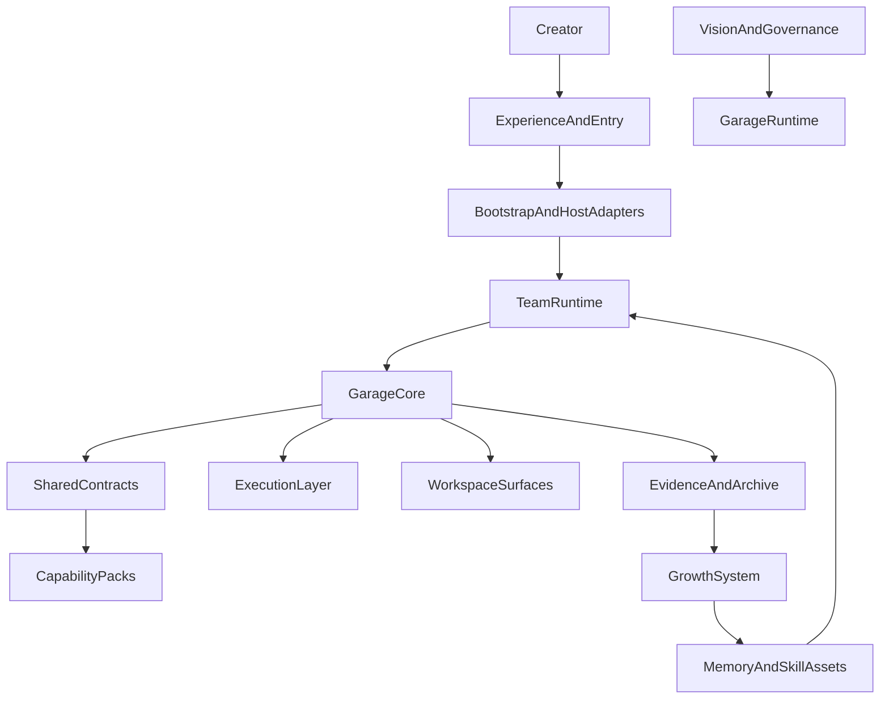

# A110: Garage Extensible And Self-Evolving Architecture

- Architecture ID: `A110`
- 状态: 草稿
- 日期: 2026-04-11
- 定位: 定义 `Garage` 的顶层分层架构，明确一个长期 agent runtime 如何同时满足两条主线：对新能力开放的可扩展性，以及从工作经验中持续变强的可成长性。
- 当前阶段: 完整架构主线，实施将按切片推进
- 关联文档:
  - `docs/GARAGE.md`
  - `docs/architecture/A120-garage-core-subsystems-architecture.md`
  - `docs/architecture/A130-garage-continuity-memory-skill-architecture.md`
  - `docs/architecture/A140-garage-system-architecture.md`
  - `docs/features/F010-shared-contracts.md`
  - `docs/features/F070-continuity-mapping-and-promotion.md`
  - `docs/features/F080-garage-self-evolving-learning-loop.md`
  - `docs/features/F110-reference-packs.md`
  - `docs/wiki/W030-hermes-agent-harness-engineering-analysis.md`
  - `docs/wiki/W040-hermes-agent-core-design-ideas.md`
  - `docs/wiki/W010-clowder-ai-harness-engineering-analysis.md`
  - `docs/wiki/W140-ahe-platform-first-multi-agent-architecture.md`

## 1. 这篇文档要解决什么

`Garage` 不是一个只服务当前能力集合的项目，也不是一个“先做几个 workflow，再慢慢拼起来”的临时工作台。

它需要同时回答两个长期问题：

1. 当未来新增 `writing`、`video`、`research`、`course` 或其他能力时，系统怎样在不推翻核心的前提下持续扩展。
2. 当团队不断做事时，系统怎样把经验沉淀成长期资产、方法和运行时改进，让团队本身持续成长。

因此，这篇文档只做一件事：

- 冻结 `Garage` 的顶层架构边界

这篇文档不负责：

- 具体 schema 字段全集
- 具体 pack 的角色清单和节点图
- 具体工具实现或 provider 协议
- 具体实施顺序与交付拆解

也就是说，这里先回答“系统作为长期 runtime 应该怎么长”，而不是立刻回答“每个零件具体怎么写”。

## 2. 顶层设计目标

`Garage` 的顶层架构需要同时满足下面 8 个目标：

1. 新增能力时，主要通过新增 pack、role、node 和 runtime capability 进入系统，而不是修改核心。
2. 平台层保持中立，不被 `coding`、`writing`、`video` 等任何单一领域锁死。
3. 不同入口共享同一套 runtime 语义，而不是各自长出一套私有 workflow。
4. 团队协作既能承接当前工作，也能把经验持续转化成长期资产。
5. `memory / session / skill / evidence` 必须分层，成长路径必须有边界。
6. 主动成长必须存在，但不能绕开 governance、review、approval 和 evidence。
7. 主事实面优先落在 `workspace`，让系统保持可读、可追溯、可恢复。
8. 架构拆解应按“总 -> 分”推进：先冻结层次与责任，再展开内部对象与 capability cuts。

## 3. 外部参考如何吸收

`Garage` 不从零发明架构，而是吸收两类已经被验证过的结构思想。

### 3.1 从 Hermes 吸收的部分

主要吸收：

- 长期主体视角：系统不是一次性对话器，而是长期存在的 agent runtime
- 多入口统一核心：不同入口不应复制一套核心逻辑
- `memory / session / skill` 分层：长期事实、会话过程状态、可复用方法必须拆开，`evidence` 另行作为可追溯记录层独立存在
- 主动成长：系统不仅记住过去，还应从经验中主动提出成长候选
- seam 先定义边界：开放能力和开放成长都必须先约束写入面与治理面

不直接照抄：

- 单体 monolith 形态
- 过深的实现细节
- 对个人 runtime 的具体产品外形复刻
- 无边界的自动学习想象

### 3.2 从 Clowder / platform-first 思路吸收的部分

主要吸收：

- 平台作为控制面，而不是 workflow 外壳
- `model / runtime / platform` 边界分离
- 共享契约独立成层
- 治理工件化：愿景、规则、门禁和架构都先写成工件
- adapter 吃掉宿主差异，避免 workflow 分叉

不直接照抄：

- 团队级复杂控制面
- 宽边界平台的全部复杂度
- 先做重型服务控制面再反推产品

## 4. 总体架构判断

从顶层看，`Garage` 应被定义成：

**一个 `workspace-first`、`multi-entry`、`self-evolving` 的 `Creator OS Runtime`：它通过统一核心承接团队协作，通过 shared contracts 承接可扩展能力面，通过 growth system 承接从经验到长期资产的主动成长。**

这张图表达的不是实现顺序，而是责任顺序：

- 用户总是先通过某个入口接触系统。
- 入口先经过 bootstrap 与 host adapter 被翻译成统一 runtime 动作。
- 用户感知到的是 team runtime，但真正稳定的系统语义收敛在 `Garage Core`。
- packs 通过 shared contracts 进入系统，而不是直接改写 core。
- execution layer 承担工具与 provider 的真实执行。
- workspace、evidence 和 archive 形成主事实面。
- growth system 从 evidence 中产生提案，并把长期有效的结果晋升到 `memory`、`skill` 或运行时更新。

## 5. 第一层拆解：8 个顶层分层

### 5.1 Vision And Governance

这一层负责编写、维护和冻结：

- 项目愿景
- 术语
- 规则
- 门禁
- 审批语义
- 归档语义
- 自主成长的治理边界

它的作用，是先把系统原则写成工件，再让 runtime 和 packs 去读取、注入和执行这些原则。

### 5.2 Experience And Entry

这一层是用户接触系统的地方，例如未来的：

- IDE 入口
- CLI 入口
- 聊天入口
- 轻 UI
- 其他宿主表面

这一层只负责接入、展示和交互承接，不负责领域逻辑，不拥有 runtime 真相。

### 5.3 Bootstrap And Host Adapters

这一层负责：

- 解析启动意图
- 绑定 profile、workspace 和 host adapter
- 把不同入口翻译成统一 runtime 启动动作

它不负责：

- pack 业务语义
- 长期连续性判断
- 工具或模型厂商协议细节

### 5.4 Team Runtime

这是用户看到的“AI 创作团队”。

但这一层不是写死的角色集合，而是团队协作语义层。它负责：

- 角色协作
- 任务交接
- 上下文衔接
- review 与补位
- 人类判断点对齐
- 已有 `memory` / `skill` 对当前工作的激活

角色本身由各个 pack 注册，而不是由平台硬编码。

### 5.5 Garage Core

这是整个系统的稳定核心。

它只理解中立对象：

- `session`
- `pack`
- `role`
- `node`
- `artifact`
- `evidence`
- `approval`
- `archive`
- `growthProposal`

它不直接理解：

- `spec`
- `article`
- `shotlist`
- `insight memo`
- `prompt draft`

这些都属于 pack 或 runtime update 层语义。

### 5.6 Shared Contracts

这一层是扩展能力的关键。

它定义：

- pack 如何接入
- role 如何注册
- node 如何声明输入输出
- artifact 如何落盘与回读
- evidence 如何记录与关联
- host 如何适配
- pack 能如何声明成长候选来源与更新边界

如果这一层设计正确，未来新增能力主要表现为“新增 contract 实现”，而不是“回头修改 core”。

### 5.7 Execution Layer

这一层负责：

- provider adapters
- tool registry
- execution request / response
- execution trace

它是真正去“做事”的运行面，但不决定：

- 哪个动作在治理上是否允许
- 哪个结果是否值得进入长期资产

### 5.8 Workspace Surfaces And Growth System

这一层承接两类事情：

1. `workspace` 主事实面
2. 从工作经验到长期成长的主动循环

它包括：

- artifacts
- evidence
- sessions
- archives
- sidecars / indexes
- `memory`
- `skill`
- growth proposals
- runtime updates

这里的关键判断是：

- 系统既要留下事实，也要从事实中成长
- 成长默认从 `workspace` 内部开始，而不是一上来就走全局黑箱升级

## 6. 第二层拆解：三类稳定对象

从长期演化的角度看，`Garage` 至少需要区分三类稳定对象：

### 6.1 平台稳定对象

这些对象应尽量长期保持稳定：

- bootstrap 语义
- core 中立对象
- shared contracts
- governance hooks
- workspace authority 规则
- growth proposal lifecycle

### 6.2 可扩展能力对象

这些对象应允许不断增长和替换：

- packs
- pack 内部角色
- pack 内部节点图
- pack 术语
- pack 模板、prompts、artifact mapping
- pack-specific review checklist

### 6.3 可成长长期资产

这些对象应允许在治理下持续增长和更新：

- `memory`
- `skill`
- 协作纪律
- runtime 更新建议
- prompt / rule / policy patch 候选

## 7. 为什么要同时设计“扩展”与“成长”

如果只设计扩展，不设计成长，`Garage` 会退化成：

- 一个越来越大的 capability marketplace
- 一个越来越会接能力、却不会因为经验而变强的静态平台

如果只设计成长，不设计扩展，`Garage` 会退化成：

- 一个越来越会记东西的黑箱助手
- 一个长期资产越来越多、但能力边界越来越混乱的不可维护系统

因此，`Garage` 的正确起点不是二选一，而是同时冻结下面这两件事：

- **扩展如何进入系统**
- **成长如何留在系统**

## 8. 完整架构下的收敛边界

为了让上面的长期架构成立，当前主线应优先坚持下面这些判断：

- `Garage Core` 只理解中立对象
- pack 一律通过 shared contracts 接入
- 不同入口共享同一 runtime 语义
- workspace 先于 database 成为主事实面
- evidence 先于隐式 history
- growth 先经过 proposal 和 governance，再晋升长期资产
- 主动成长允许存在，但不能绕开 review、approval、archive 和 lineage

## 9. 这篇文档与后续文档的关系

这篇文档负责：

- 冻结顶层分层架构

后续由不同文档继续展开：

- `A120`：继续展开完整 runtime 的子系统
- `A130`：冻结 continuity 分层与 proposal-driven growth 的边界
- `A140`：给出端到端系统设计与关键架构决策
- `F010`：冻结共享 contracts
- `F080`：冻结 self-evolving learning loop 的稳定 capability cut

## 10. 一句话总结

`Garage` 的正确起点，不是先定义一批当前功能，而是先定义一个平台中立、分层明确、对扩展开放、对成长有边界、对治理有要求的长期 runtime 骨架，再让不同创作能力和不同成长路径在这个骨架上持续演化。
