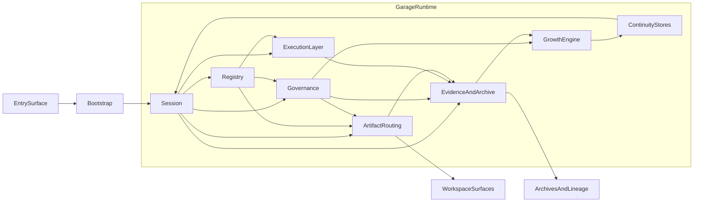

# A120: Garage Runtime Subsystems Architecture

- Architecture ID: `A120`
- 状态: 草稿
- 日期: 2026-04-11
- 定位: 在 `A110` 已冻结顶层分层架构之后，进一步定义 `Garage` 完整 runtime 的稳定子系统，明确哪些子系统负责启动、协调、执行、追溯与成长，以及它们之间如何协作。
- 当前阶段: 完整架构主线，实施将按切片推进
- 关联文档:
  - `docs/GARAGE.md`
  - `docs/architecture/A110-garage-extensible-architecture.md`
  - `docs/architecture/A130-garage-continuity-memory-skill-architecture.md`
  - `docs/architecture/A140-garage-system-architecture.md`
  - `docs/features/F010-shared-contracts.md`
  - `docs/features/F030-core-runtime-records.md`
  - `docs/features/F050-governance-model.md`
  - `docs/features/F060-artifact-and-evidence-surface.md`
  - `docs/features/F080-garage-self-evolving-learning-loop.md`
  - `docs/features/F210-runtime-home-and-workspace-topology.md`
  - `docs/features/F220-runtime-bootstrap-and-entrypoints.md`
  - `docs/features/F230-runtime-provider-and-tool-execution.md`

## 1. 文档目标与范围

这篇文档只回答一个问题：

**当 `Garage` 被视为一个完整的长期 runtime 时，它内部应拆成哪些稳定子系统，才能同时支撑多入口、一致执行、workspace-first 真相面，以及 evidence 驱动的主动成长。**

本文覆盖：

- 完整 runtime 的子系统边界
- 子系统之间的主链交互
- 关键稳定对象
- 哪些职责属于 core，哪些职责属于 execution、growth 或 workspace 层

本文不覆盖：

- 具体 pack 的内部流程图
- 具体 provider 协议
- 具体 tool 实现代码
- 具体实施任务顺序

## 2. 为什么需要 runtime 子系统图

如果只停留在顶层分层而没有稳定子系统图，`Garage` 很容易出现三类混乱：

- 入口、bootstrap、session 恢复和 provider 调用混在一起
- `memory / skill / evidence / archive` 这些长期对象没有明确宿主
- “主动成长”被写成一个口号，却没有稳定的 runtime 位置

因此，在完整架构里，需要把 `Garage` 明确拆成可以长期维护的子系统，而不是让每个入口、每个 pack 或每次新能力扩展都重新发明控制流。

## 3. 子系统总览

建议把 `Garage` runtime 稳定拆成下面 10 个子系统：

| 子系统 | 主要作用 |
| --- | --- |
| `EntrySurface` | 接住用户交互与外部宿主入口 |
| `Bootstrap` | 统一启动、恢复、profile 解析与 host 绑定 |
| `Session` | 统一当前工作主线、上下文和 handoff 边界 |
| `Registry` | 统一发现 pack、role、node、artifact role 与 capability 声明 |
| `Governance` | 执行 review、approval、gate、archive 与成长治理 |
| `ArtifactRouting` | 把中立工件意图映射到权威 workspace surfaces |
| `EvidenceAndArchive` | 记录决策、验证、审计、archive 与 lineage |
| `ExecutionLayer` | 统一 provider 调用、tool 调用与 execution trace |
| `GrowthEngine` | 从 evidence 形成 proposal，并驱动 `memory / skill / runtime update` 的晋升流程 |
| `ContinuityStores` | 承载 `memory`、`skill` 等长期资产及其回读语义 |

## 4. 完整 runtime 结构图

这张图表示的是责任方向，而不是实现顺序：

- 所有入口都先进入 `Bootstrap`
- `Session` 是所有工作推进的统一边界
- `Registry`、`Governance`、`ArtifactRouting`、`ExecutionLayer` 与 `EvidenceAndArchive` 围绕 `Session` 协作
- `GrowthEngine` 不直接替代 `Session` 或 `Governance`，而是消费 evidence 并提出更新路径
- `ContinuityStores` 通过回读影响未来的 session，但不能直接篡改当前证据

## 5. 建议先冻结的稳定对象

为避免后续不同子系统各自发明名字，建议先冻结下面这组最小稳定对象：

- `RuntimeProfile`
- `WorkspaceBinding`
- `HostAdapterBinding`
- `SessionIntent`
- `SessionState`
- `SessionSnapshot`
- `PackManifest`
- `RoleDefinition`
- `NodeDefinition`
- `ArtifactIntent`
- `ArtifactDescriptor`
- `ExecutionRequest`
- `ExecutionContext`
- `ExecutionTrace`
- `PolicySet`
- `EvidenceRecord`
- `GrowthProposal`
- `MemoryEntry`
- `SkillAsset`
- `LineageLink`

这些对象不等于最终 schema，但它们应成为不同子系统之间的共同语言。

## 6. 各子系统职责

### 6.1 EntrySurface

负责：

- 接住 CLI、IDE、聊天入口、轻 UI 等外部交互
- 收集启动意图和外部上下文

不负责：

- pack 业务语义
- session 真相
- provider 或 tool 协议

### 6.2 Bootstrap

负责：

- 解析 `RuntimeProfile`
- 绑定 `WorkspaceBinding`
- 绑定 `HostAdapterBinding`
- 创建或恢复 runtime services
- 创建或恢复 `Session`

不负责：

- 领域工作流
- memory / skill 晋升判断
- provider 调用细节

### 6.3 Session

负责：

- 创建、恢复、暂停和关闭工作主线
- 维护当前 `pack / role / node / handoff / context`
- 作为所有动作的统一会话边界

不负责：

- role / node 的注册定义
- evidence 的长期判定
- skill 的长期沉淀

### 6.4 Registry

负责：

- 发现 packs、roles、nodes、artifact role 和 capability 声明
- 为 session、governance、routing 和 execution 提供统一查询入口

不负责：

- 执行工作流
- 保存当前会话状态
- 持久化长期资产

### 6.5 Governance

负责：

- 注入全局、runtime、pack、node 级规则
- 决定哪些动作允许、阻塞、待确认或需要补证据
- 约束 archive 与 growth proposal 的审批路径

不负责：

- 实际执行模型或工具
- 直接生成领域内容
- 直接编写规则原文

### 6.6 ArtifactRouting

负责：

- 把 `ArtifactIntent` 映射到权威 workspace surfaces
- 维护 artifact authority、path、descriptor 与 readback 语义

不负责：

- 判断内容是否可信
- 决定是否进入长期资产
- 承担 archive 或 evidence 的审计语义

### 6.7 EvidenceAndArchive

负责：

- 记录 decision、review、verification、approval、exception、archive
- 维护 execution trace 的可追溯关联
- 提供 lineage、history 与后续 growth 的观察面

不负责：

- 直接决定 memory / skill 晋升
- 替代 session 本身
- 变成通用历史垃圾桶

### 6.8 ExecutionLayer

负责：

- provider adapters
- tool registry
- execution request / response
- tool call / result envelopes
- 流式 execution trace

不负责：

- 决定当前动作是否被治理允许
- 决定当前结果是否值得长期保存
- 定义 pack 术语

### 6.9 GrowthEngine

负责：

- 识别 evidence 中值得晋升的候选
- 形成 `GrowthProposal`
- 把 proposal 路由到 `memory`、`skill` 或 runtime update 的治理路径
- 跟踪 proposal 状态、来源与结果

不负责：

- 直接绕过 governance 写入长期资产
- 把所有 observed pattern 都自动固化
- 直接替代 pack 或人类判断

### 6.10 ContinuityStores

负责：

- 保存 `memory`
- 保存 `skill`
- 为未来 session 提供回读语义
- 保存与长期资产相关的 lineage 与版本关系

不负责：

- 保存所有瞬时上下文
- 替代 evidence
- 直接接收未经治理的自动晋升

## 7. 四条关键交互主链

### 7.1 启动与恢复主链

`EntrySurface -> Bootstrap -> Session`

这条主链确保所有入口都通过同一套 profile / workspace / host 绑定逻辑进入系统。

### 7.2 工作执行主链

`Session -> Registry / Governance / ExecutionLayer -> ArtifactRouting -> EvidenceAndArchive`

这条主链确保系统先有会话边界，再解析能力、执行工作、留下结果和证据。

### 7.3 成长主链

`EvidenceAndArchive -> GrowthEngine -> Governance -> ContinuityStores`

这条主链确保主动成长默认从 evidence 出发，而不是从原始 session 或无门槛自动观察直接固化。

### 7.4 长期资产回流主链

`ContinuityStores -> Session`

这条主链确保过去形成的 `memory / skill` 能回流到新的工作，但不能倒置为“长期资产反向替代当前证据”。

## 8. 子系统边界上的三条红线

为了避免 runtime 逐渐失控，至少要守住下面三条红线：

1. `EntrySurface` 不能拥有自己的私有 runtime 语义。
2. `ExecutionLayer` 不能替代 `Governance` 决定是否允许某个动作。
3. `GrowthEngine` 不能绕开 `EvidenceAndArchive` 与 `Governance` 直接写长期资产。

## 9. 这篇文档与其他文档的关系

这篇文档负责：

- 冻结完整 runtime 的子系统地图

后续由不同文档继续展开：

- `A130`：解释 continuity 与 growth proposal 的边界
- `A140`：解释端到端系统设计与关键 ADR
- `F220`：解释 bootstrap 与 entrypoints
- `F230`：解释 execution layer
- `F080`：解释主动成长 loop 的稳定 capability cut

## 10. 一句话总结

`Garage` 想成为一个真正的长期 runtime，就必须先把启动、协调、执行、追溯、成长和长期资产这几类职责稳定拆开；否则入口会反向定义系统，执行会污染核心，成长会失去边界。
