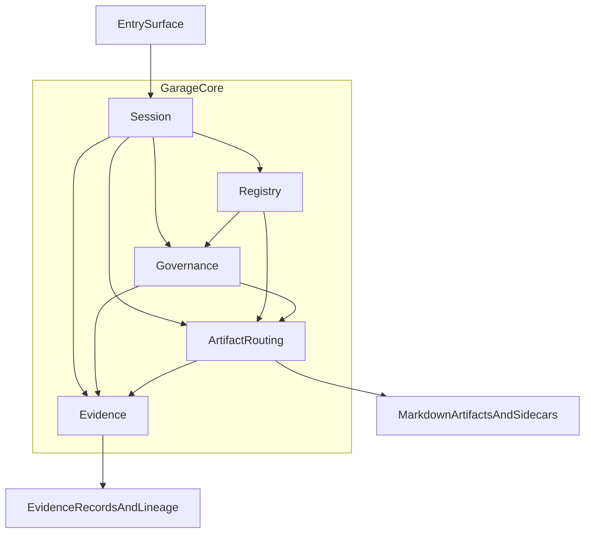

# A120: Garage Core Subsystems Architecture

- Architecture ID: `A120`
- 状态: 草稿
- 日期: 2026-04-11
- 定位: 定义 `Garage Core` 在 phase 1 应先冻结的分层子系统边界，确保未来新增能力时可以通过注册和映射扩展，而不是回头修改核心。
- 当前阶段: phase 1
- 关联文档:
  - `docs/GARAGE.md`
  - `docs/architecture/A110-garage-extensible-architecture.md`
  - `docs/features/F030-core-runtime-records.md`
  - `docs/features/F010-shared-contracts.md`
  - `docs/architecture/A130-garage-continuity-memory-skill-architecture.md`
  - `docs/features/F110-reference-packs.md`
  - `docs/wiki/W030-hermes-agent-harness-engineering-analysis.md`
  - `docs/wiki/W010-clowder-ai-harness-engineering-analysis.md`
  - `docs/wiki/W140-ahe-platform-first-multi-agent-architecture.md`

## 1. 文档目标与范围

这篇文档只回答一个问题：

**当 `Garage` 已经确定为一个可扩展的 `Creator OS` 之后，平台中立的 `Garage Core` 应该怎样继续拆成高质量的稳定子系统。**

本文覆盖的范围只有 `Garage Core` 自身，不展开完整实现，也不展开具体 pack 的内部流程。

本文覆盖：

- `Session`
- `Registry`
- `Governance`
- `Artifact Routing`
- `Evidence`

本文暂不覆盖：

- 具体 host 入口实现
- 具体 pack 的角色清单与节点图
- 完整 schema 字段全集
- 数据库化或服务化实现
- `memory` 与 `skill` 的完整子系统设计

当前阶段，我们先冻结子系统边界与交互关系，而不是立刻冻结所有实现细节。

## 2. 设计输入与吸收来源

`Garage Core` 不是从零发明，而是在现有参考基础上做收敛。

### 2.1 从 Hermes 吸收的部分

我们吸收的是结构思想，而不是产品形态：

- 把 `session` 视为长期连续工作的第一等对象，而不是一次性对话容器
- 强调高于入口的统一核心，避免不同入口各长一套流程语义
- 坚持 `memory / session / skill` 分层，因此本设计明确把 `session` 与 `evidence` 分开
- 扩展 seam 先定义边界，避免平台在增长中不断失控

不直接照抄的部分：

- 单体 monolith 形态
- 过深的运行时实现细节
- 对个人 runtime 的具体产品壳层复刻

### 2.2 从 Clowder 吸收的部分

我们吸收的是平台化判断：

- 平台是控制面，而不是 workflow 外壳
- `registry`、共享契约和治理规则应独立成层
- 治理应工件化，不能只藏在 prompt 或聊天历史里
- adapter 吃掉宿主差异，避免 workflow 因入口变化而分叉

不直接照抄的部分：

- 团队级重型控制面
- 多进程、多环境脚本体系的具体形态
- 宽边界平台的全部复杂度

## 3. Garage Core 的平台定位

`Garage Core` 是 `Garage` 的平台中立稳定内核。

它只理解中立对象，不理解具体创作领域术语。

`Garage Core` 理解的对象：

- `session`
- `pack`
- `role`
- `node`
- `artifact`
- `evidence`
- `approval`
- `archive`

`Garage Core` 不直接理解的对象：

- `spec`
- `insight memo`
- `article`
- `script`
- `shotlist`
- `release note`

这些对象都应由各个 pack 自己映射到 core 的中立对象，而不是让 core 反过来理解具体领域名词。

## 4. Garage Core 的内部总体结构

建议把 `Garage Core` 明确拆成四层职责：

| 层次 | 子系统 | 主要作用 |
| --- | --- | --- |
| 协调层 | `Session` | 统一会话生命周期、当前工作上下文与 handoff 边界 |
| 能力与约束层 | `Registry`、`Governance` | 提供可发现能力与可执行规则 |
| 落盘层 | `Artifact Routing` | 把中立工件意图映射到权威文件目标 |
| 追溯层 | `Evidence` | 记录决策、验证、审批、归档与 lineage |

这张图表示的是责任方向，而不是实现顺序：

- 所有入口先进入 `Session`
- `Session` 通过 `Registry` 识别当前能力面
- `Governance` 判断哪些动作被允许、阻塞或需要确认
- `Artifact Routing` 把输出意图落到稳定文件面
- `Evidence` 把关键过程沉淀为可追溯记录

## 5. 先冻结的核心对象

在继续展开子系统之前，建议先冻结一组最小中立对象，后文所有设计都围绕这些对象展开：

- `SessionIntent`
- `SessionState`
- `SessionSnapshot`
- `PackManifest`
- `RoleDefinition`
- `NodeDefinition`
- `ArtifactIntent`
- `ArtifactDescriptor`
- `PolicySet`
- `EvidenceRecord`
- `LineageLink`

这些对象不等于最终 schema，但它们是整个 core 能持续拆解的共同语言。

在后续文档中，`RoleContract`、`WorkflowNodeContract` 等名称代表平台边界上的共享契约；而这里出现的 `RoleDefinition`、`NodeDefinition`，可以理解为这些 contract 被 `Garage Core` 装配之后的内部视图。

## 6. Session 子系统

### 6.1 职责

- 作为所有入口共享的统一会话边界
- 负责创建、恢复、暂停、结束 `session`
- 维护当前 `pack`、当前 `node`、当前 handoff 与当前上下文指针
- 把外部入口动作统一翻译成 core 可理解的会话动作

### 6.2 不负责

- 不声明 pack、role、node 本身
- 不定义治理规则
- 不解释具体领域工件语义
- 不替代长期 `memory` 或 `skill` 子系统

### 6.3 关键对象

- `SessionId`
- `SessionIntent`
- `SessionState`
- `SessionSnapshot`
- `ContextPointer`
- `HandoffRecord`

### 6.4 关键交互

- 启动或恢复时向 `Registry` 解析当前可用 `pack / role / node`
- 在状态转移前向 `Governance` 请求适用规则与 gate
- 形成输出意图时把 `ArtifactIntent` 交给 `Artifact Routing`
- 在关键节点切换、审批、收尾时向 `Evidence` 写入记录

### 6.5 Phase 1 边界

- 会话状态以文件为真相源
- 面向机器的状态可使用轻量 sidecar，不要求全部写成 Markdown
- 默认单创作者、单主线工作模式
- 不处理实时多人协作、跨设备强同步或分布式锁

## 7. Registry 子系统

### 7.1 职责

- 作为 `pack`、`role`、`node`、`artifact role` 的统一注册面
- 让平台通过声明式注册发现能力，而不是通过核心分支硬编码能力
- 为 `Session`、`Governance`、`Artifact Routing` 提供稳定查询入口

### 7.2 不负责

- 不执行工作流
- 不存储会话过程状态
- 不生成内容
- 不替代治理裁决

### 7.3 关键对象

- `PackManifest`
- `RoleDefinition`
- `NodeDefinition`
- `ArtifactRoleMapping`
- `RegistryIndex`
- `RegistryVersion`

### 7.4 关键交互

- 为 `Session` 提供 pack 入口、角色和节点解析
- 为 `Governance` 提供 pack 级或 node 级规则挂载点
- 为 `Artifact Routing` 提供工件角色映射和权威目标声明

### 7.5 Phase 1 边界

- 注册信息以文件化 manifest 为主
- 支持本地加载与显式版本化
- 不做远程市场、在线发现或动态热插拔生态
- phase 1 只需验证 `Coding Pack` 与 `Product Insights Pack` 两个 reference packs

## 8. Governance 子系统

### 8.1 职责

- 读取并注入全局、core 级、pack 级、node 级规则工件
- 在运行时执行 `approval`、`review`、`gate`、`archive` 的触发语义
- 在状态转移、工件写入和收尾动作前给出允许、阻塞、待确认或需补证据的判断

### 8.2 不负责

- 不直接生成领域内容
- 不负责角色注册
- 不负责工件路径落盘
- 不负责创作愿景、术语和治理规则原文的编写
- 不替代人的最终判断，只提供规则框架与 gate 语义

### 8.3 关键对象

- `PolicySet`
- `ApprovalRequirement`
- `ReviewRequirement`
- `GateDecision`
- `ArchiveRule`
- `ExceptionRecord`

### 8.4 关键交互

- 从 `Registry` 获取当前 `pack / node` 的适用范围
- 为 `Session` 提供状态转移约束
- 为 `Artifact Routing` 提供写入权限与阶段限制
- 把决策结果交给 `Evidence` 沉淀为可追溯记录

### 8.5 Phase 1 边界

- 治理规则以 Markdown 文档加轻量规则 sidecar 为主
- 规则评估以确定性判断为主，不引入重型策略引擎
- 审批默认显式化，关键点由人确认
- 不做复杂组织权限系统或多租户治理模型

## 9. Artifact Routing 子系统

### 9.1 职责

- 把中立的 `ArtifactIntent` 映射到权威文件目标
- 维护 `artifact role -> path rule -> file type -> sidecar` 的一致关系
- 确保不同 pack 的输出可以落到统一、可读、可回溯的文件面

### 9.2 不负责

- 不生成工件内容
- 不判定内容质量
- 不制定治理策略
- 不管理重型媒体资产系统

### 9.3 关键对象

- `ArtifactIntent`
- `ArtifactRole`
- `RouteRule`
- `MaterializationTarget`
- `ArtifactDescriptor`
- `AuthorityMarker`

### 9.4 关键交互

- 从 `Session` 接收当前节点的输出意图
- 从 `Registry` 读取 pack 的工件映射规则
- 从 `Governance` 读取当前会话是否允许创建、覆盖、归档或发布
- 把最终产出的工件描述和写入结果交给 `Evidence`

### 9.5 Phase 1 边界

- 主工件以 Markdown 为主
- 机器可读状态通过 YAML 或 JSON sidecar 承载即可
- 默认本地文件系统落盘
- 对二进制或富媒体内容只保留引用位，不在 phase 1 做完整媒体资产管理

## 10. Evidence 子系统

### 10.1 职责

- 沉淀关键决策、验证、审批、评审、归档记录
- 建立 `session -> node -> artifact -> evidence -> archive` 的 lineage
- 支持后续恢复、复查、审计和 closeout

### 10.2 不负责

- 不替代会话上下文本身
- 不保存所有瞬时聊天细节
- 不充当长期偏好记忆
- 不演化成通用分析平台或遥测平台

### 10.3 关键对象

- `EvidenceRecord`
- `DecisionRecord`
- `ReviewVerdict`
- `VerificationRecord`
- `ApprovalRecord`
- `ArchiveRecord`
- `LineageLink`
- `SourcePointer`

### 10.4 关键交互

- 从 `Session` 接收状态转移和 handoff 记录
- 从 `Governance` 接收 gate 与审批结果
- 从 `Artifact Routing` 接收工件物化结果
- 为后续 resume、review、archive 提供可引用证据面

### 10.5 Phase 1 边界

- 证据记录以 Markdown 为主，辅以轻量索引 sidecar
- 采用追加式、可追溯的记录方式
- 不做图数据库、事件总线或自动置信度评分系统
- 优先保证“人能读、系统能指向、后续能恢复”

## 11. 五个子系统如何串成主链

`Garage Core` 的主链建议固定为下面这条责任链：

1. 外部入口提交 `SessionIntent`，由 `Session` 创建或恢复工作上下文。
2. `Session` 向 `Registry` 解析当前适用的 `pack`、入口 `node`、可参与 `role` 与工件映射。
3. `Governance` 根据全局与 pack 规则，为当前动作注入 gate、审批要求和例外条件。
4. 工作推进过程中，`Session` 形成一个或多个 `ArtifactIntent`，交由 `Artifact Routing` 路由到权威文件目标。
5. 每次状态转移、工件落盘、评审、审批、验证和归档，都由 `Evidence` 形成可追溯记录。
6. 后续任何 resume、review、archive，都优先基于 `session + artifact + evidence` 的组合恢复，而不是依赖隐式聊天上下文。

这条主链的目的，是让每个子系统都只承担自己的稳定职责，而不是互相吞并边界。

## 12. Phase 1 的收敛范围

phase 1 需要非常克制。

当前阶段只做这些事：

- 让 `Garage Core` 形成稳定的中立子系统边界
- 用 `Coding Pack` 与 `Product Insights Pack` 两个 reference packs 验证 core contract
- 让新增能力默认通过 `manifest + role + node + artifact mapping + governance overlay` 接入
- 以文件化控制面支撑主流程，而不是先做服务化控制面

当前阶段不做这些事：

- 不先做重型数据库平台
- 不先做完整多用户 SaaS
- 不先冻结所有角色和节点
- 不先把 `writing`、`video` 做成完整实现
- 不把平台和具体 pack 语义混写在一起

phase 1 的目标不是复杂，而是稳定。

## 13. 后续拆解顺序

在这篇文档之后，建议继续按“总 -> 分”的顺序往下拆：

1. 先拆 `Shared Contracts`
   - 当前拆解文档见 `docs/features/F010-shared-contracts.md`
   - 其中包括 `PackManifest`、`RoleContract`、`WorkflowNodeContract`、`ArtifactContract`、`EvidenceContract`、`HostAdapterContract`
2. 再拆 continuity layers
   - 当前拆解文档见 `docs/architecture/A130-garage-continuity-memory-skill-architecture.md`
   - 其中包括 `memory`、`session`、`skill`、`evidence` 的持续性分层
3. 再拆 phase 1 的 reference packs
   - 当前拆解文档见 `docs/features/F110-reference-packs.md`
   - 其中包括 `Coding Pack` 与 `Product Insights Pack`
4. 最后再决定是否需要把部分 contract 服务化

这个顺序的意义是：

- 先稳定 core
- 再稳定接口
- 最后扩展能力

而不是一开始就把 pack 细节写死进平台。

## 14. 遵循的设计原则

- 平台中立：core 只理解中立对象，不理解具体领域名词。
- 开闭原则：新增能力以注册和映射扩展为主，而不是修改核心分支。
- Markdown-first：面向人的主工件默认是 Markdown。
- File-backed：phase 1 以文件为主事实源，sidecar 只承担轻量机器状态。
- Contract-first：先冻结对象和子系统边界，再谈实现细节。
- Session 与 Evidence 分离：会话上下文不等于证据记录，避免状态混桶。
- Governance as artifacts：治理规则、门禁、审批和归档先写成工件。
- Host-neutral core：不同入口共享同一 core 语义，差异留在边缘适配层。
- Traceability by default：任何关键推进都应留下可恢复、可复查、可归档的 lineage。
- Phase-first restraint：先做小而稳的 phase 1 骨架，不提前长成重型平台。
