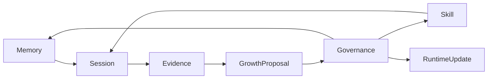

# A130: Garage Continuity Memory Skill Architecture

- Architecture ID: `A130`
- 状态: 草稿
- 日期: 2026-04-11
- 定位: 定义 `Garage` 的 continuity 架构，明确 `memory`、`session`、`skill`、`evidence` 四类长期对象如何分层，以及 agent 主动成长时 `GrowthProposal` 应处于什么位置、如何在治理下推动长期资产与运行时更新。
- 当前阶段: 完整架构主线，实施将按切片推进
- 关联文档:
  - `docs/GARAGE.md`
  - `docs/architecture/A110-garage-extensible-architecture.md`
  - `docs/architecture/A120-garage-core-subsystems-architecture.md`
  - `docs/architecture/A140-garage-system-architecture.md`
  - `docs/features/F050-governance-model.md`
  - `docs/features/F060-artifact-and-evidence-surface.md`
  - `docs/features/F070-continuity-mapping-and-promotion.md`
  - `docs/features/F080-garage-self-evolving-learning-loop.md`
  - `docs/wiki/W030-hermes-agent-harness-engineering-analysis.md`
  - `docs/wiki/W040-hermes-agent-core-design-ideas.md`

## 1. 文档目标与范围

这篇文档只回答一个问题：

**如果 `Garage` 想成为一个会主动成长的长期 runtime，那么 `memory`、`session`、`skill`、`evidence` 应该如何分层，而 agent 主动提出的成长提案又应该如何插入这条 continuity 主链。**

本文覆盖：

- `memory / session / skill / evidence` 的边界
- `GrowthProposal` 在 continuity 中的位置
- continuity 对象之间的激活、沉淀、提案与晋升路径
- workspace-first 的默认成长范围
- 哪些路径默认允许，哪些路径必须经过治理，哪些路径默认禁止

本文不覆盖：

- 具体 UI 交互
- 具体 schema 字段全集
- 向量检索或 embedding 方案
- 具体 skill 文件格式
- 具体 proposal 工作流实现细节

## 2. 为什么 continuity 需要单独设计

如果没有 continuity 分层，`Garage` 很容易退化成一个“看起来有长期记忆，实际上只是把上下文、证据、经验和方法越堆越乱”的系统。

最常见的问题是：

- 把稳定偏好、当前过程、可复用方法和审计记录混成一个桶
- 让 `session` 偷偷承担长期记忆
- 让 `evidence` 被误用成通用知识仓
- 让 `skill` 退化成单次任务的备份文本
- 让“主动成长”直接跳过治理，变成不可解释的黑箱固化

因此，continuity 的目标不是“多存一点”，而是：

- 先把不同类型的长期对象分开
- 再把成长路径中的治理对象单独定义出来

## 3. Hermes 对这条主线的启发

`Garage` 在 continuity 设计上吸收的是 `Hermes` 的结构判断，而不是复刻它的产品外形：

- 稳定事实和过程历史不能混放
- 可复用方法应独立于当前任务状态
- 高于入口的统一 core 才能真正承接长期连续性
- agent 应能从经验中提出成长候选，而不仅是被动记住历史

因此，在 `Garage` 里，continuity 不是“保存更多聊天记录”，而是：

- 有分层
- 有边界
- 有 evidence
- 有 proposal
- 有治理后的晋升路径

## 4. continuity 对象总览

| 对象 | 回答的问题 | 典型内容 | 不应包含什么 |
| --- | --- | --- | --- |
| `memory` | 长期成立的事实是什么 | 用户偏好、稳定约束、长期环境信息、长期方向偏好 | 临时任务状态、未确认判断 |
| `session` | 当前这次工作正在发生什么 | 当前目标、上下文、handoff、进行中状态 | 长期事实、最终 evidence 归档 |
| `skill` | 哪些方法以后还值得复用 | 工作流、模板、套路、协作方法、复查方法 | 单次任务噪音、未经验证的偶然成功 |
| `evidence` | 我们为什么这样判断、做过什么验证 | decision、review、approval、verification、archive 记录 | 长期偏好本身、任意原始上下文堆积 |
| `growthProposal` | 哪些经验值得被考虑为长期更新 | `memory` 候选、`skill` 候选、runtime update 候选 | 已经被接受的长期资产本身 |

这里要强调：

- `growthProposal` 不是第五种长期资产。
- 它是 continuity 主链中的治理对象。
- 它的作用是把“看见了什么经验”变成“应该考虑什么更新”，而不是直接替代 `memory` 或 `skill`。

## 5. continuity 主链

这张图表达的是：

- `memory` 与 `skill` 为当前 `session` 提供长期支持
- `session` 在关键节点产生 `evidence`
- `evidence` 是主动成长的默认观察面
- `growthProposal` 把 evidence 中值得长期化的候选显式化
- `Governance` 决定 proposal 是否能晋升为 `memory`、`skill` 或 runtime update

## 6. 各对象在系统里的位置

### 6.1 `Session`

`session` 位于 `Garage Core` 的协调层。

它负责：

- 当前目标
- 当前 pack / node
- 当前 handoff 状态
- 当前上下文边界

它不负责：

- 存长期事实
- 存可复用方法
- 替代证据记录

### 6.2 `Evidence`

`evidence` 位于 `Garage Core` 的追溯层。

它负责：

- 记录做过什么
- 记录为什么这样做
- 记录验证、审批、review 与 archive 结果

它不负责：

- 直接晋升长期资产
- 替代 session
- 变成无门槛的知识桶

### 6.3 `Memory`

`memory` 是围绕 runtime 的长期事实层。

它负责：

- 承接稳定偏好
- 承接跨 session 仍然成立的背景事实
- 承接长期方向约束

它不负责：

- 保存当前任务进度
- 保存任意历史片段
- 替代 skill 仓库

### 6.4 `Skill`

`skill` 是围绕 runtime 与 packs 的可复用方法层。

它负责：

- 承接可重用工作流
- 承接稳定模板和方法
- 承接复查、closeout、研究、实现等可重复协作方式

它不负责：

- 保存当前任务状态
- 保存长期个人偏好
- 无门槛接收一次性 workaround

### 6.5 `GrowthProposal`

`growthProposal` 位于 evidence 与长期资产之间。

它负责：

- 把 evidence 中的成长候选显式化
- 说明候选来源、候选类型、候选理由与需要的治理动作
- 承接到 `memory`、`skill` 或 runtime update 的路由

它不负责：

- 自己变成最终长期资产
- 绕过 governance
- 直接执行更新

## 7. 主动成长时到底能更新什么

`Garage` 的主动成长不只指向 `memory` 或 `skill`。

在完整架构里，至少存在 3 类长期更新结果：

1. `MemoryUpdate`
   - 新增或修正长期事实、偏好、约束
2. `SkillUpdate`
   - 新增 skill、patch 旧 skill、拆分 skill、合并 skill
3. `RuntimeUpdate`
   - 对协作纪律、policy、prompt 模块、review checklist 或运行策略的更新建议

这意味着：

- continuity 不只是“记住什么”
- continuity 还应覆盖“团队以后应该怎么做得更好”

## 8. workspace-first 的默认成长范围

`Garage` 的完整架构默认采用：

- `workspace-first growth`

这意味着：

- 观察面默认来自当前 workspace 中的 artifacts、evidence、sessions 和 archives
- proposal 默认先服务当前 workspace 的长期工作质量
- 跨 workspace 的全局化共享不是默认行为，而是更高层级的显式晋升

这样做的好处是：

- 更容易保证上下文相关性
- 更容易控制污染范围
- 更容易把成长与真实 evidence 绑定起来

## 9. 允许路径、治理路径与禁止路径

### 9.1 默认允许路径

- `Memory -> Session`
- `Skill -> Session`
- `Session -> Evidence`
- `Evidence -> GrowthProposal`

### 9.2 允许但必须经过治理的路径

- `GrowthProposal -> Memory`
- `GrowthProposal -> Skill`
- `GrowthProposal -> RuntimeUpdate`
- 少量 `Evidence -> Memory` 或 `Evidence -> Skill` 的直达简化路径，但仍必须带治理语义

### 9.3 默认禁止路径

- `Session -> Memory` 自动晋升
- `Session -> Skill` 自动晋升
- `Evidence -> Memory` 无门槛自动晋升
- `Evidence -> Skill` 无门槛自动晋升
- `GrowthProposal -> Memory / Skill / RuntimeUpdate` 绕过治理直接落盘
- `Memory <-> Skill` 自动互转

## 10. 哪些内容绝不能直接成长成长期资产

下面这些内容即使在运行中出现，也不应因为“被看见”就直接进入 `memory`、`skill` 或 runtime update：

- 全量聊天记录或原始思维过程
- 未经确认的假设、方向猜测或临时计划
- 一次性 workaround、repo 特例或宿主特定操作步骤
- 只在单个 pack 内偶然成立的私有 heuristics
- 缺少 review、verification 或明确接受动作的结论
- 带有强时效性的临时上下文
- 失败样本、争议记录和审批痕迹本身

`Garage` 必须坚持一个保守判断：

**长期成长宁可慢而准，也不要快而混。**

## 11. continuity 对团队成长的真正意义

continuity 的价值不只是“下次记得更多”，而是：

- 让团队逐步形成稳定偏好
- 让团队逐步形成可靠方法
- 让团队逐步形成协作纪律
- 让 runtime 自身因为 evidence 而获得可解释的改进方向

如果没有这条 continuity 主链，所谓“主动成长”最终只会退化成两种坏形态：

- 把一切都塞进 memory
- 把一切都留在 evidence，永远无法变成真正的长期资产

## 12. 这篇文档与后续文档的关系

这篇文档负责：

- 冻结 continuity 分层与 `growthProposal` 的架构位置

后续由不同文档继续展开：

- `F070`：解释不同 packs 的 continuity 映射与 promotion 规则
- `F080`：解释 self-evolving learning loop 的稳定 capability cut
- `A140`：把 continuity 主链放回完整系统设计图里

## 13. 一句话总结

`Garage` 的 continuity 不是“把更多历史保存下来”，而是把当前工作、可追溯证据、长期事实、可复用方法和成长提案严格分层，再让 agent 在治理之下把经验变成真正有价值的长期资产与运行时更新。
