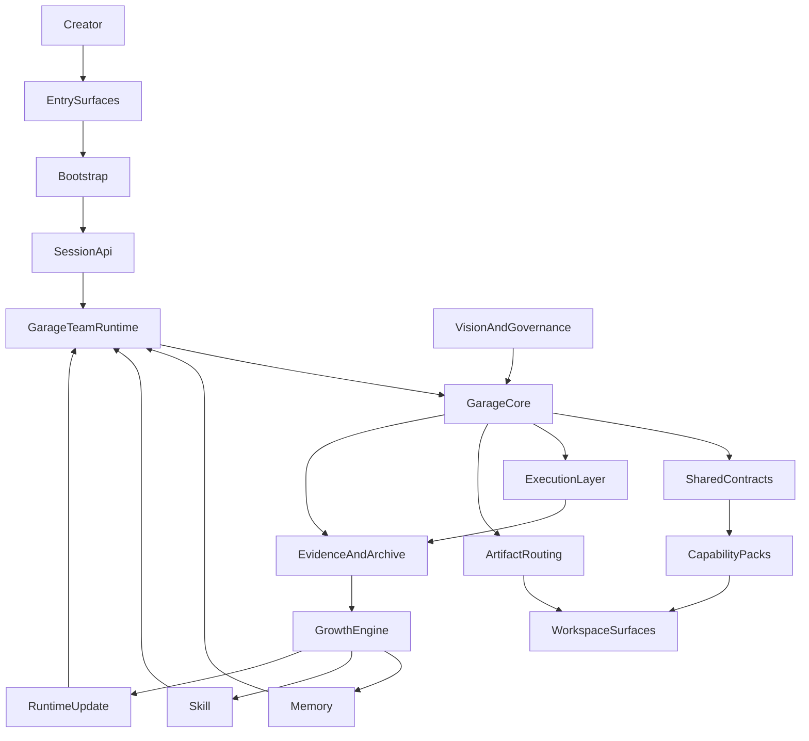

# A140: Garage System Architecture

- Architecture ID: `A140`
- 状态: 草稿
- 日期: 2026-04-11
- 定位: 在 `VISION`、`GARAGE`、`A105`、`A110`、`A115`、`A120`、`A130` 已分别冻结产品愿景、产品定义、团队对象、平台边界、产品 surfaces、runtime 子系统与 continuity 主链之后，给出 `Garage` 的完整端到端系统架构视图，统一回答“系统如何运行、为什么这样取舍、关键 ADR 是什么”。
- 当前阶段: 完整架构主线，实施将按切片推进
- 关联文档:
  - `docs/VISION.md`
  - `docs/GARAGE.md`
  - `docs/architecture/A105-garage-team-workspace-and-first-class-objects.md`
  - `docs/architecture/A110-garage-extensible-architecture.md`
  - `docs/architecture/A115-product-surfaces-and-host-capability-injection.md`
  - `docs/architecture/A120-garage-core-subsystems-architecture.md`
  - `docs/architecture/A130-garage-continuity-memory-skill-architecture.md`
  - `docs/features/F010-shared-contracts.md`
  - `docs/features/F050-governance-model.md`
  - `docs/features/F060-artifact-and-evidence-surface.md`
  - `docs/features/F070-continuity-mapping-and-promotion.md`
  - `docs/features/F080-garage-self-evolving-learning-loop.md`
  - `docs/features/F210-runtime-home-and-workspace-topology.md`
  - `docs/features/F220-runtime-bootstrap-and-entrypoints.md`
  - `docs/features/F230-runtime-provider-and-tool-execution.md`

## 1. 文档目标与范围

这篇文档只回答一个问题：

**在把 `Garage` 视为一个辅助创作者的 `Agent Teams` 工作环境，以及支撑它的 `Garage Team runtime` 之后，它的端到端系统设计到底是什么，主要架构决策又是什么。**

本文覆盖：

- 完整系统的功能需求、非功能需求与约束
- 总体架构样式选择
- 从入口到执行、从 evidence 到成长的端到端主链
- 关键架构决策与取舍摘要
- 主要风险与缓解思路

本文不替代：

- `A110` 对顶层分层架构的冻结
- `A120` 对 runtime 子系统地图的冻结
- `A130` 对 continuity 主链和 `GrowthProposal` 的冻结
- `F070/F080` 对成长 mapping 和 learning loop 的 feature-level 细化

### 1.1 这份系统设计由什么设计公理驱动

这篇系统设计文不是从“先支持哪些功能”倒推出来的，而是从 `docs/VISION.md`、`docs/GARAGE.md` 以及前置 architecture owner docs 中已经冻结的产品判断推出来的。

这里最关键的 5 个输入判断是：

- 团队先于工具：系统必须先把 AI 团队协作当成一等对象，而不是退化成 model/tool shell。
- 人定方向，AI 在治理中放大：系统必须允许主动执行和主动成长，但不允许绕开审批、review 和治理边界。
- 扩展与成长并列：系统既要能持续接入新 pack，也要能让团队因为做过的事情而变强。
- 长期连续性先于单轮聪明：`memory / session / skill / evidence` 必须分层，runtime 必须高于单次入口存在。
- 成长必须 `evidence-first`、`workspace-first`、`governance-bounded`：任何长期更新都必须先有证据、先有 proposal，再进入长期资产和 runtime update。

再额外加上两条前置输入：

- `Garage Team` 是一等产品对象，`Garage` 首先是工作环境，不是开发者集成框架。
- `CLI / Web` 是独立产品 surfaces，`HostBridge` 是能力注入层，而不是产品本体来源。

因此，`A140` 的目标不是再讲一遍愿景或产品定义，而是把这些判断翻译成完整系统在需求、分层、主链和 ADR 上的具体取舍。

## 2. 需求摘要

### 2.1 功能需求

`Garage` 至少需要满足下面这些功能要求：

- 让个人创作者在同一个系统里持续推进从洞察、设计、实现到表达的长期主线。
- 让创作者进入的是一个 `Agent Teams` 工作环境，而不是一堆模型和工具开关。
- 让不同入口 family，例如 `CLIEntry`、`WebEntry`、`HostBridgeEntry`，都进入同一套 runtime 语义。
- 让 `CLIEntry` 与 `WebEntry` 可以独立成立为工作环境，而 `HostBridgeEntry` 可以把底层能力注入已有工具。
- 让 AI 团队协作以 `session` 为主线，通过角色、节点、handoff、review 与 approval 共同推进工作。
- 让不同能力以 pack 形式接入，并通过 shared contracts 与 core 协作。
- 让 artifacts、evidence、sessions、archives 构成 workspace-first 的主事实面。
- 让 system 不只执行当前任务，还能从 evidence 中主动形成成长候选。
- 让成长结果可以进入 `memory`、`skill` 或 runtime update，但必须受到治理约束。

### 2.2 非功能需求

| 类别 | 要求 |
| --- | --- |
| 可扩展性 | 新能力应主要通过新增 packs、roles、nodes 与 runtime capability 进入系统。 |
| 一致性 | 不同入口必须共享同一套 bootstrap、session、governance、execution 与 growth 语义。 |
| 可追溯性 | 关键决策、review、verification、approval 和 update proposal 必须有 evidence 与 lineage。 |
| 可恢复性 | 当前工作必须能通过 workspace surfaces 恢复，而不是依赖宿主隐式状态。 |
| 可成长性 | 系统应能主动提出长期更新候选，而不是只能被动等待用户重新教学。 |
| 可治理性 | 任何长期更新都必须处于明确的 policy、review、approval 与 archive 边界内。 |
| 可维护性 | core 只理解中立对象；领域名词与 vendor 细节不能反向污染 core。 |
| 可移植性 | 主事实面保持文件化、可迁移、可人工检查，不要求依赖某个固定宿主。 |

### 2.3 当前约束

完整架构仍需服从下面这些现实约束：

- 第一位用户仍是 `solo creator`
- 当前已知 reference packs 是 `coding` 与 `product insights`
- 当前仓库同时承担 source root 与默认 dogfooding workspace 的角色
- 人负责方向、判断与审批，AI 团队负责执行、复查、沉淀与主动成长

## 3. 架构样式选择

从 system design 角度，`Garage` 最适合被定义成：

**一个 local-first、workspace-first、multi-entry 的 `Agent Teams` 工作环境，以及支撑它的 self-evolving `Garage Team runtime`。**

关键样式选择如下：

| 设计问题 | 备选模式 | 当前选择 | 原因 |
| --- | --- | --- | --- |
| 平台形态 | 微服务平台 / 重型控制面 / 本地 Agent Teams 工作环境 | 本地 Agent Teams 工作环境 + 共享 runtime | 当前更需要先把创作者可直接进入的工作环境做对，再用统一 runtime 承接长期成长能力，而不是先做分布式部署。 |
| 能力扩展方式 | 核心硬编码能力 / pack 接入 | `Shared Contracts + Capability Packs` | 需要长期承接新能力面，同时保持 core 中立。 |
| 主事实面 | 数据库优先 / 文件优先 | `workspace-first` 文件面 | 需要可读、可追溯、可恢复、可迁移。 |
| 成长方式 | 被动记忆 / 无治理自动学习 / 证据驱动成长 | `Evidence -> Proposal -> Governance -> Update` | 需要让成长主动发生，但不能失控。 |
| 入口策略 | 各入口各自实现 runtime / 统一 bootstrap + runtime | 统一 bootstrap + runtime | 避免 `CLIEntry`、`WebEntry`、`HostBridgeEntry` 语义分叉。 |

## 4. 总体架构

本节不是重新定义 `A105`、`A110`、`A115`、`A120` 的 owner question，而是在这些 owner docs 已冻结的边界之内，给出一个完整系统的端到端视图。

换句话说：

- `A105` 负责回答“用户真正拥有的对象是什么，workspace 如何锚定它”
- `A110` 负责回答“系统有哪些顶层层次，以及每层不该越界到哪里”
- `A115` 负责回答“独立工作环境和宿主能力注入层如何分工”
- `A120` 负责回答“支撑 `Garage Team` 的 runtime 子系统图是什么”
- `A140` 负责回答“这些层次在一次真实系统运行里怎样被串起来”

这张图表达的是责任方向，而不是实现先后顺序：

- 用户从入口进入，但入口不拥有系统真相。
- `CLIEntry` 与 `WebEntry` 是独立工作环境表面，`HostBridgeEntry` 是能力注入表面。
- bootstrap 把这些表面翻译成统一的 runtime 启动动作，让不同产品入口仍然进入同一个 `Garage Team runtime`。
- 所有入口 family 都先汇入 `SessionApi`，再进入统一会话边界。
- team runtime 是用户感知到的 `Agent Teams` 工作环境，真正稳定的语义收敛在 core。
- packs 通过 contracts 接入，execution layer 负责真正执行。
- evidence 和 workspace surfaces 共同形成主事实与追溯面。
- growth engine 消费 evidence，并在治理下把经验转成长期更新。

## 5. 端到端 canonical lifecycle

把总体架构落到一次真实运行上，`Garage` 建议固定下面这条主链：

1. 用户从 `CLIEntry`、`WebEntry` 或 `HostBridgeEntry` 发起工作意图。
2. `Bootstrap` 解析 `RuntimeProfile`、`WorkspaceBinding` 与 `HostAdapterBinding`。
3. 系统暴露统一的 `SessionApi`，并通过它创建或恢复 `Session`，让当前工作进入统一会话边界。
4. `Registry` 解析当前 pack、role、node、artifact role 与 capability 声明。
5. `Governance` 在关键动作前判断是否允许、是否需要审批、是否缺少证据。
6. `ExecutionLayer` 在当前 `session / role / node / policy` 边界下执行 provider 与 tool 调用。
7. `ArtifactRouting` 把结果写入权威 workspace surfaces，`EvidenceAndArchive` 记录决策、验证、审批与 execution trace。
8. `GrowthEngine` 持续观察 evidence，并在合适时形成 `GrowthProposal`。
9. `Governance` 审查 proposal 是否可进入 `memory`、`skill` 或 `runtime update`。
10. 被接受的长期更新在后续 session 中回流，成为团队新的工作能力。

这条主链最关键的价值，是把“执行任务”和“让团队因为任务而成长”放进同一个可治理的 runtime 里。

## 6. 关键 ADR 摘要

下面这些 ADR 不是从局部实现偏好出发的，而是对上面那组设计公理在系统层的固定化表达。

### ADR-001: 统一 runtime，高于所有入口

#### 背景

如果 `CLIEntry`、`WebEntry` 与 `HostBridgeEntry` 都各自维护一套恢复逻辑、工具语义和状态边界，`Garage` 很快会退化成多个互不兼容的产品壳层和宿主壳层。

#### 决策

所有入口都必须先经过统一 `Bootstrap` 与 `SessionApi`，再进入同一个 `Garage Team runtime`。

#### 影响

- 正向影响:
  - 多入口共享一致的 session、governance、execution 与 growth 语义。
  - 宿主差异被限制在 adapter 边界内。
- 负向影响:
  - bootstrap 与 host adapter 需要额外设计与维护。

### ADR-002: 采用 `workspace-first` 作为主事实面

#### 背景

`Garage` 需要一个可读、可追溯、可恢复、可迁移的主事实面，不能把真相藏在宿主进程或会话缓存里。

#### 决策

把 artifacts、evidence、sessions、archives 与 sidecars 统一放到 workspace-first 的权威 surfaces 上。

#### 影响

- 正向影响:
  - 工作过程和结果都可被直接检查与归档。
  - 不依赖特定宿主即可理解当前工作区发生了什么。
- 负向影响:
  - 文件面需要更严格的 authority、descriptor 与 schema discipline。

### ADR-003: core 只理解中立对象，能力通过 contracts 与 packs 接入

#### 背景

如果 core 开始理解 `spec`、`article`、`shotlist` 等领域名词，平台迟早会被某个能力面锁死。

#### 决策

让 `Garage Core` 只理解中立对象；具体能力由 shared contracts 与 capability packs 声明并接入。

#### 影响

- 正向影响:
  - 新能力主要通过新增声明进入系统。
  - 平台可以长期保持中立。
- 负向影响:
  - 需要维护显式 contracts、registry 和 capability 装配逻辑。

### ADR-004: execution layer 与 core 分离

#### 背景

如果 provider 协议、tool 细节和 execution trace 直接进入 core，核心语义会很快被底层执行细节污染。

#### 决策

把 provider adapters、tool registry、execution request / response 与 trace 统一收敛到独立的 `ExecutionLayer`。

#### 影响

- 正向影响:
  - core 保持稳定，执行后端可以独立演化。
  - execution trace 更容易统一进入 evidence。
- 负向影响:
  - 需要定义清晰的 core/execution 边界对象。

### ADR-005: 成长以 `Evidence -> GrowthProposal -> Governance -> Update` 为 canonical loop

#### 背景

如果系统只有 evidence，没有成长，它永远停留在“记住了发生过什么”；如果系统直接自动写 memory/skill，它又会迅速失控。

#### 决策

把 evidence 设为成长观察面，把 `GrowthProposal` 设为治理对象，再通过 governance 决定是否进入 `memory`、`skill` 或 `runtime update`。

#### 影响

- 正向影响:
  - 主动成长与可解释性可以同时成立。
  - 每个长期更新都能回指来源 evidence。
- 负向影响:
  - 成长路径会更慢，更依赖治理设计。

### ADR-006: 默认采用 workspace-first growth

#### 背景

如果成长一开始就做成全局自动共享，污染范围会非常大，而且很难判断某个经验是否真的跨 workspace 成立。

#### 决策

默认先让成长服务当前 workspace，再通过更高层级的治理决定是否允许更广泛共享。

#### 影响

- 正向影响:
  - 更容易控制风险和上下文相关性。
  - 更适合以真实 evidence 为基础做成长。
- 负向影响:
  - 全局复用能力需要额外的晋升设计。

### ADR-007: autonomy 受 governance 约束，而不是与 governance 对立

#### 背景

`Garage` 需要主动成长，但不能把自主性理解成“无门槛自动固化一切”。

#### 决策

任何长期更新都必须处于 review、approval、archive 与 lineage 可追溯边界之内。

#### 影响

- 正向影响:
  - 团队成长不会破坏系统可信度。
  - 用户仍然能理解系统为什么这样变化。
- 负向影响:
  - 某些低价值自动化会被主动放弃。

## 7. 主要风险与缓解

| 风险 | 可能表现 | 缓解思路 |
| --- | --- | --- |
| runtime 分叉 | 不同入口逐渐拥有私有 session / tool 语义 | 强制所有入口先经过统一 bootstrap，再进入同一个 runtime。 |
| core 被 execution 污染 | core 开始直接理解 provider、tool backend 和宿主细节 | 维持 execution layer 独立，core 只消费归一化对象。 |
| 成长资产污染 | 临时上下文、一次性 workaround、未验证判断进入 memory/skill | 坚持 evidence-first、proposal-first、governance-first。 |
| pack 反向污染平台 | core 开始吸收领域术语与 pack 私有 heuristics | 持续坚持中立对象词汇表与 contract boundary。 |
| workspace / runtime home 混写 | 用户级配置与 workspace 真相面互相污染 | 维持 `runtime home` 与 `workspace` 的显式分层。 |

## 8. 这篇文档与其他文档的关系

这篇文档负责：

- 给出完整端到端系统架构和关键 ADR 收束
- 在 `A110` 已冻结的边界之内，实例化一份系统级设计视图

后续由不同文档继续展开：

- `A105`：`Garage Team` 与 workspace-first 产品对象
- `A110`：顶层平台边界与扩展 / 成长 seams
- `A115`：产品 surfaces 与宿主能力注入
- `A120`：`Garage Team runtime` 子系统地图
- `A130`：continuity 与 proposal-driven growth 主链
- `F070`：pack-specific 的 continuity 映射与晋升规则
- `F080`：active self-evolving learning loop 的稳定 capability cut

如果本篇中的具体主链、系统图或 ADR 表达与 `A110` 的顶层边界发生冲突，应以 `A110` 为准，再回头修正 `A140`。

## 9. 一句话总结

`Garage` 的完整系统设计，不是“一个更强的聊天壳”，也不是“一个提前服务化的平台”，而是一个以 workspace 为真相源、以 session 为主线、以 contracts 为扩展 seam、以 evidence 为追溯面、以 `GrowthProposal` 为成长治理对象、以 `memory / skill / runtime update` 为长期演化结果的 self-evolving runtime。
