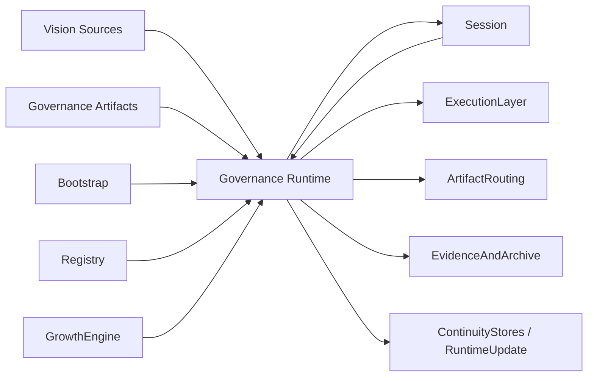

# A150: Garage Vision And Governance Architecture

- Architecture ID: `A150`
- 状态: 草稿
- 日期: 2026-04-11
- 定位: 在 `A105`、`A110`、`A115`、`A120`、`A140` 已分别冻结产品对象、平台边界、产品 surfaces、`Garage Team runtime` 与完整系统主链之后，继续冻结 `VisionAndGovernance` 这一层本身的内部架构，明确愿景工件、治理工件、运行时治理执行与成长治理之间的关系。
- 当前阶段: 完整架构主线，实施将按切片推进
- 关联文档:
  - `docs/VISION.md`
  - `docs/GARAGE.md`
  - `docs/architecture/A105-garage-team-workspace-and-first-class-objects.md`
  - `docs/architecture/A110-garage-extensible-architecture.md`
  - `docs/architecture/A115-product-surfaces-and-host-capability-injection.md`
  - `docs/architecture/A120-garage-core-subsystems-architecture.md`
  - `docs/architecture/A130-garage-continuity-memory-skill-architecture.md`
  - `docs/architecture/A140-garage-system-architecture.md`
  - `docs/features/F050-governance-model.md`
  - `docs/features/F060-artifact-and-evidence-surface.md`
  - `docs/features/F080-garage-self-evolving-learning-loop.md`
  - `docs/wiki/W010-clowder-ai-harness-engineering-analysis.md`
  - `docs/wiki/W020-clowder-ai-core-design-ideas.md`
  - `docs/wiki/W030-hermes-agent-harness-engineering-analysis.md`
  - `docs/wiki/W040-hermes-agent-core-design-ideas.md`

## 1. 文档目标与范围

这篇文档只回答一个问题：

**当 `Garage` 把“辅助创作者的 Agent Teams 工作环境”与“人定方向，AI 在治理中放大”都当成非谈判前提时，`VisionAndGovernance` 这一层本身应该怎样被设计，才能既是长期架构的上游约束，又是真正参与 `Garage Team runtime` 的稳定子系统。**

本文覆盖：

- `VisionAndGovernance` 的内部拆解
- 愿景工件、治理工件与运行时治理之间的关系
- 治理如何绑定 `session`、artifact 写入、archive、`GrowthProposal` 与 runtime update
- 这一层与 `Session`、`Registry`、`ExecutionLayer`、`ArtifactRouting`、`EvidenceAndArchive`、`GrowthEngine` 的接口边界

本文不覆盖：

- `gate` 类型、结果语义和字段细节全集
- 某个 pack 的 review checklist 或审批话术
- 具体 approval UI、通知方式或策略 DSL
- 具体任务拆解与交付顺序

换句话说，`A150` 先冻结“治理层自己是什么”，而不是直接把所有操作语义都塞进 `F050` 或 pack design。

## 2. 为什么 `VisionAndGovernance` 必须单独冻结

如果没有这篇文档，`Garage` 很容易出现三类偏差：

- 愿景只停留在 `VISION.md` 的表述层，无法变成 runtime 可读取、可执行的上游约束。
- 治理被挤压到 feature 文档里，导致 `F050` 既要解释语义，又被迫承担子系统架构职责。
- 成长治理、规则演化和审批边界没有稳定宿主，最终退化成 prompt 习惯或聊天约定。

因此，这一层必须被明确看成 `Garage` 的 **policy plane / decision plane**：

- `Vision` 负责回答系统为什么这样设计、什么不能被破坏。
- `Governance` 负责回答当前动作能不能发生、还缺什么、谁需要确认。

这也是当前主线对外部参考的吸收方式：

- 从 `Clowder` 吸收“先把治理写成工件，再让系统读取治理”的判断。
- 从 `Hermes` 吸收“approval / safety 是运行时协议，而不是 UI 提醒”的判断。

## 3. 在总体架构中的位置

`A110` 在顶层把这一层命名为 `VisionAndGovernance`；`A120` 在 runtime 子系统图里把它运行时的一半命名为 `Governance`。

为了避免两边看起来像两套东西，当前主线明确采用下面这个关系：

`VisionAndGovernance = Vision Sources + Governance Artifacts + Governance Runtime`

其中：

- `Vision Sources` 是长期不轻易变化的上游方向工件。
- `Governance Artifacts` 是可以被 version、review、overlay 和装配的规则工件。
- `Governance Runtime` 是 `A120` 中那个真正参与 session 推进、gate 判定、approval 和 update 审查的运行时子系统。

这张图表达的是责任关系，而不是实现顺序：

- `Vision` 和规则工件不直接执行工作，但会持续约束 runtime。
- `Governance Runtime` 不拥有 pack 注册、artifact 路径或 evidence 存储本身。
- `EvidenceAndArchive` 负责保存决策记录，`Governance Runtime` 负责产生和解释这些决策。
- `GrowthEngine` 负责形成候选，`Governance Runtime` 负责决定这些候选能否继续晋升。

## 4. 第一层拆解：5 个稳定部件

### 4.1 Vision Sources

负责：

- 冻结设计公理、平台愿景、术语与长期边界
- 说明哪些成长方向被允许、哪些红线不能被突破
- 为后续治理工件提供上游解释框架

不负责：

- 实时判定某一步动作是否放行
- 编写 pack 级细则
- 直接保存 review / approval 记录

### 4.2 Governance Artifacts

负责：

- 表达 `global / core / pack / node` 各层规则与 overlay
- 表达 gate、review、approval、archive、exception 的稳定工件化语义
- 让规则可以被 version、review、diff、回滚与引用

不负责：

- 代替 runtime 执行判定
- 生成领域内容
- 替代 evidence 存储

### 4.3 Governance Runtime

负责：

- 在当前 `workspace / session / pack / role / node / artifact / proposal` 上下文里解析有效 `PolicySet`
- 对动作、转移、写入、交接、归档和长期更新给出治理 verdict
- 判断当前动作是否需要补证据、review、approval 或 exception

不负责：

- 直接调用模型或工具
- 决定 artifact 的最终物理路径
- 静默改写规则源文本

### 4.4 Review, Approval And Exception Control

负责：

- 把不可逆、高风险、跨阶段或长期影响动作提升为显式的人类判断点
- 记录谁审过、谁批过、为什么豁免、豁免到什么时候
- 让“人负责最终裁决”成为运行时协议，而不是口头习惯

不负责：

- 代替整体规则分层
- 变成随手口头放行
- 脱离 evidence 与 lineage 独立存在

### 4.5 Governance Change Control

负责：

- 治理规则本身的增删改
- 治理 `GrowthProposal`、`memory / skill / runtime update` 的晋升边界
- 保证治理系统自己也通过显式工件和审查路径演化，而不是靠 prompt 漂移偷偷改变

不负责：

- 让治理变成“无门槛自动学习系统”
- 绕过 review / approval 直接固化长期变化
- 把一次临时 workaround 永久升格为平台规则

## 5. 稳定输入、输出与绑定对象

为了让这一层可以长期被不同入口、不同 pack 和不同实现复用，建议先冻结下面这组最小接口对象。

### 5.1 关键输入

- `Vision Sources`
  - 来自 `VISION.md`、`GARAGE.md`、`A110` 等上游文档冻结的非谈判边界
- `Policy Artifacts`
  - 来自 `F050`、pack overlay、node 规则与未来治理工件的可执行约束
- `Runtime Context`
  - 至少包括 `RuntimeProfile`、`WorkspaceBinding`、`SessionState`、`RoleDefinition`、`NodeDefinition`
- `Work Subjects`
  - 至少包括 `ArtifactIntent`、handoff、archive 请求、`GrowthProposal`、runtime update 候选

### 5.2 关键输出

- `PolicySet`
  - 当前上下文下真正生效的一组治理约束
- `GateDecision`
  - 当前动作的 verdict、理由、缺失项与下一步要求
- `ReviewRecord`
  - 对输出质量、完整性、风险与适配性的复查记录
- `ApprovalRecord`
  - 对推进、归档或长期更新的显式放行记录
- `ExceptionRecord`
  - 对规则豁免的范围、原因、批准者与失效条件
- `ArchiveDecision`
  - 哪个结果被正式冻结为权威历史快照

这里要特别注意：

- `GrowthProposal` 的定义与生命周期位置仍由 `A130` 优先拥有。
- `gate` 分类、结果枚举与 feature-level 语义由 `F050` 继续展开。
- `A150` 只冻结这些对象为什么存在、它们之间怎样绑定，以及它们属于哪一层。

## 6. 三条关键治理主链

### 6.1 运行中动作治理主链

`Bootstrap / Session -> Registry -> Governance Runtime -> ExecutionLayer / ArtifactRouting -> EvidenceAndArchive`

这条主链确保：

- 当前动作先落到统一 runtime 上下文
- 治理先于执行与写入发生
- 判定结果与后续 evidence 能被持续回指

### 6.2 成长与长期更新治理主链

`EvidenceAndArchive -> GrowthEngine -> Governance Runtime -> Review / Approval -> ContinuityStores / RuntimeUpdate`

这条主链确保：

- 主动成长从 evidence 出发，而不是从模糊观察直接固化
- `GrowthProposal` 是显式治理对象，而不是“模型自己觉得应该记住”
- `memory / skill / runtime update` 的进入路径与普通执行动作一样受到治理

### 6.3 治理自身演化主链

`Vision / Policy Artifact Change -> Review / Approval -> Governance Runtime Reload -> Future Sessions`

这条主链确保：

- 治理系统可以成长，但成长方式仍然是工件化、可 review、可 diff
- 规则变化优先影响未来 session，而不是静默篡改当前已经形成的证据
- 治理变更本身也必须留下可追溯 lineage

## 7. 子系统边界上的 5 条红线

1. `Governance Runtime` 不能直接替代 `ExecutionLayer`、`ArtifactRouting` 或 `EvidenceAndArchive`。
2. `pack / node` overlay 默认只能细化或收紧上层规则，不能静默削弱 `global / core` 约束。
3. `GrowthEngine` 不能绕开治理直接把候选写进 `memory`、`skill` 或 runtime update。
4. 任何规则变更都不能只存在于 prompt、聊天习惯或宿主缓存里，必须回到工件面。
5. evidence 再完整，也不能自动替代 review、approval 和 exception 这些显式治理动作。

## 8. 这篇文档与其他文档的关系

这篇文档负责：

- 冻结 `VisionAndGovernance` 这一层的内部架构与边界
- 解释 `Vision Sources`、`Governance Artifacts` 与 `Governance Runtime` 之间的关系
- 说明治理如何与执行、artifact、evidence、growth 和长期更新对接

后续由不同文档继续展开：

- `A110`：继续作为所有顶层分层边界的优先级来源
- `A120`：继续定义 runtime 内部 `Governance` 子系统在整体子系统图中的位置
- `A130`：继续定义 `GrowthProposal` 与 continuity 主链
- `A140`：继续把治理放回完整系统主链与 ADR 中讨论
- `F050`：继续定义治理分层、gate 类型、结果语义与稳定 capability cut
- `D110 / D120`：继续定义 reference packs 的治理 overlay 和 pack-specific 细则

如果后续 `feature / design / task` 文档让 `Governance` 越界承担 `ExecutionLayer`、`ArtifactRouting`、`EvidenceAndArchive` 或 `GrowthEngine` 的职责，应以 `A150` 为准回头修正。

如果 `A150` 自身与 `A110` 的顶层边界冲突，则仍应以 `A110` 为准，再修正 `A150`。

## 9. 一句话总结

`Garage` 的 `VisionAndGovernance` 不是“写几条规则给 agent 看”，而是把长期方向、规则工件、运行时判定、人类裁决和成长治理收束成同一个稳定 policy plane，让系统既能主动执行和主动成长，又始终留在可解释、可审查、可追溯的边界内。
