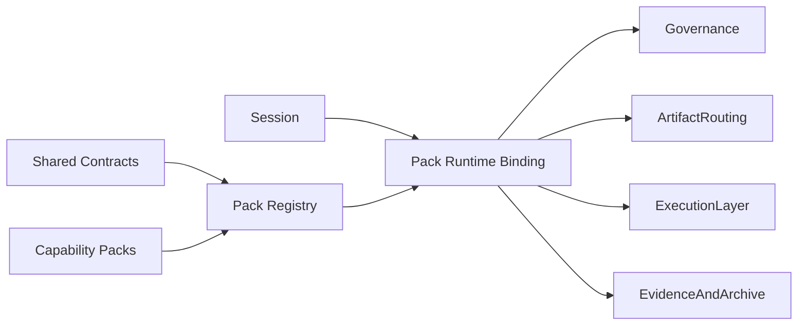

# A160: Garage Pack Platform Architecture

- Architecture ID: `A160`
- 状态: 草稿
- 日期: 2026-04-11
- 定位: 在 `A105` 已冻结 `Garage Team` 是一等产品对象、`A110` 已冻结能力扩展 seam、`A120` 已冻结 `Registry` 作为 `Garage Team runtime` 子系统之后，继续冻结 `Garage` 的 pack platform 架构，明确共享契约、pack 注册、pack 激活与 reference pack 校准之间的关系。
- 当前阶段: 完整架构主线，实施将按切片推进
- 关联文档:
  - `docs/GARAGE.md`
  - `docs/architecture/A105-garage-team-workspace-and-first-class-objects.md`
  - `docs/architecture/A110-garage-extensible-architecture.md`
  - `docs/architecture/A120-garage-core-subsystems-architecture.md`
  - `docs/architecture/A140-garage-system-architecture.md`
  - `docs/features/F010-shared-contracts.md`
  - `docs/features/F110-reference-packs.md`
  - `docs/design/D110-garage-product-insights-pack-design.md`
  - `docs/design/D120-garage-coding-pack-design.md`
  - `docs/wiki/W010-clowder-ai-harness-engineering-analysis.md`
  - `docs/wiki/W030-hermes-agent-harness-engineering-analysis.md`
  - `docs/wiki/W140-ahe-platform-first-multi-agent-architecture.md`

## 1. 文档目标与范围

这篇文档只回答一个问题：

**当 `Garage` 希望让 `Garage Team` 持续吸收 `coding`、`product insights`、`writing`、`video` 等不同能力时，平台中的 pack 扩展面应该如何被架构化，才能让新能力主要通过声明、注册和绑定进入系统，而不是反向修改 core。**

本文覆盖：

- `Shared Contracts`、`Pack Registry`、`Capability Packs` 与 pack runtime binding 的关系
- pack 如何注册、被发现、被装配并进入当前 `session`
- 当前 `reference packs` 在 pack platform 里承担什么校准作用
- pack platform 与 `Session`、`Governance`、`ArtifactRouting`、`ExecutionLayer` 的接口边界

本文不覆盖：

- 某个 pack 的完整角色树、节点图和 prompts 细节
- pack 之间的 bridge 语义与 handoff 细则
- marketplace、远程安装、在线发现或动态热插拔生态
- 具体 schema 字段全集和实现任务顺序

换句话说，`A160` 先冻结“平台怎样承接 pack”，而不是重复某个 pack 自己怎么工作。

## 2. 为什么 pack platform 必须单独冻结

如果只写 `F010` 而没有这篇文档，当前主线仍然容易退回两种坏形态：

- contract 只是几个分散定义的接口名词，系统里却没有一个清晰的 pack 接入平面。
- 新能力每来一个都临时改一次 core、session 或 routing，最后把平台拖回“每个能力各接一套私有接入方式”。

因此，`Garage` 需要明确承认：

- `Shared Contracts` 解决的是共同语言问题。
- `Pack Platform` 解决的是这些共同语言如何变成真正的扩展机制问题。

当前主线对外部参考的吸收方式也很明确：

- 从 `Clowder` 吸收“共享协议、registry 和平台能力应收束成独立层”的判断。
- 从 `W140` 吸收“先有平台中立边界，再让 reference pack 挂上去”的判断。
- 从 `Hermes` 吸收“多入口共享同一能力面，而不是每个入口维护一套私有工具或 pack 语义”的判断。

## 3. 在总体架构中的位置

`A110` 把能力扩展 seam 定义成 `SharedContracts + CapabilityPacks`；`A120` 则在 runtime 里给出了 `Registry` 子系统。

为了避免这三块内容继续分散，当前主线明确采用下面这个关系：

`Pack Platform = Shared Contracts + Pack Registry + Capability Packs + Pack Runtime Binding`

其中：

- `Shared Contracts` 负责定义 pack 进入系统的共同语言。
- `Pack Registry` 负责发现、校验、索引和暴露这些声明。
- `Capability Packs` 负责携带领域语义、roles、nodes、artifact mapping 与 pack overlay。
- `Pack Runtime Binding` 负责把当前 `session` 绑定到具体 pack、role、node 与 capability 上。

这张图表达的是责任关系，而不是实现顺序：

- `Shared Contracts` 不直接执行 pack，也不直接保存 session。
- `Registry` 不拥有领域语义，只拥有标准化后的发现与查询视图。
- `Capability Packs` 负责声明自己的语义，但不能绕开 registry 和 contract 直接注入 core。
- `Pack Runtime Binding` 只负责当前上下文绑定，不负责跨 pack bridge 编排；那部分应由后续 `A170` 继续展开。

## 4. 第一层拆解：5 个稳定部件

### 4.1 Shared Contracts

负责：

- 冻结 `PackManifest`、`RoleContract`、`WorkflowNodeContract`、`ArtifactContract`、`EvidenceContract` 等共同语言
- 让 `Session`、`Governance`、`ArtifactRouting`、`ExecutionLayer` 围绕同一组中立对象协作
- 限制 core 只理解稳定平台语义，而不是 pack 私有语言

不负责：

- 编写 pack 的领域术语
- 决定当前 session 激活哪个 pack
- 替代 pack 设计文档

### 4.2 Pack Registry

负责：

- 发现并索引可用 packs、roles、nodes、artifact roles 与 capability 声明
- 把 pack-local 声明归一化成 runtime 可查询的标准视图
- 为 `Session`、`Governance`、`ArtifactRouting` 与 `ExecutionLayer` 提供统一查询入口

不负责：

- 保存当前 session 状态
- 执行 pack 内部 workflow
- 直接生成领域内容

### 4.3 Capability Pack Surface

负责：

- 承载 pack identity、入口节点、roles、nodes、artifact mapping、evidence shape 与治理 overlay
- 保留 pack 私有术语和内部组织方式
- 把领域能力映射到平台 contract 上，而不是把领域语言抬升进 core

不负责：

- 替代平台治理
- 直接改写 core 的中立词汇表
- 让 pack 私有 heuristics 成为平台默认规则

### 4.4 Pack Runtime Binding

负责：

- 在当前 `session / workspace / role / node / policy` 上下文中解析“现在激活的是哪个 pack、哪个节点、哪组能力”
- 把 pack 声明投影到 `Governance`、`ArtifactRouting`、`ExecutionLayer` 的实际运行边界
- 保证 pack 切换、resume 和后续回流仍然走统一 runtime 语义

不负责：

- 代替 `Session` 成为主线真相
- 代替 `Registry` 发现和注册 pack
- 代替 `A170` 定义跨 pack bridge 协议

### 4.5 Reference Pack Calibration

负责：

- 使用当前 `coding` 与 `product insights` 两个 reference packs 验证 platform-neutral 的 contract 和 registry 是否成立
- 暴露 pack platform 中仍然隐含的领域偏置
- 为未来 `writing`、`video` 等 pack 提供对照样板

不负责：

- 赋予 reference packs 平台特权
- 把当前两个 pack 冻结成未来唯一合法形态
- 代替每个 pack 自己的详细设计

## 5. 稳定输入、输出与绑定对象

为了让 pack platform 能长期承接新能力，建议先冻结下面这组最小接口对象。

### 5.1 关键输入

- `PackManifest`
  - pack 的稳定身份、版本、入口与导出声明
- `RoleContract` / `WorkflowNodeContract`
  - pack 团队形状与协作边界
- `ArtifactContract` / `EvidenceContract`
  - pack 如何把领域输出映射到平台 artifact 与 evidence 面
- `SessionIntent` / `SessionState`
  - 当前工作到底需要激活哪个 pack、哪个 role、哪个 node
- `PolicySet`
  - 当前上下文下允许哪些 pack / node / handoff / write 行为继续发生

### 5.2 关键输出

- `RegistryEntry`
  - runtime 可查询的 pack 标准视图
- `PackBinding`
  - 当前 session 与具体 pack 版本、overlay 和 entry node 的绑定结果
- `RoleActivation`
  - 当前上下文下被激活的 role 及其读写边界
- `NodeActivation`
  - 当前节点的输入、输出、允许流转与治理要求
- `ArtifactMapping`
  - 当前 pack 领域工件到中立 artifact roles 的映射结果
- `CapabilityBinding`
  - 当前 node / role 可以实际调用的能力面

这里要特别注意：

- `F010` 优先拥有 contract 家族本身的 feature-level 语义。
- `D110 / D120` 优先拥有各自 pack 内部的详细角色图、节点图和 artifact taxonomy。
- `A160` 只冻结这些对象为什么存在、它们之间怎样连接，以及它们属于哪一层。

## 6. 三条关键主链

### 6.1 pack 注册主链

`Pack Artifacts -> Shared Contracts -> Pack Registry`

这条主链确保：

- pack 先以声明式资产进入系统
- 平台先看 contract 是否成立，再决定如何发现和装配
- 新能力优先表现为“新增声明”，而不是“修改 core”

### 6.2 pack 激活主链

`Session -> Pack Registry -> Pack Runtime Binding -> Governance / ArtifactRouting / ExecutionLayer`

这条主链确保：

- 当前工作先落到统一 session 上下文
- pack 选择、role 激活、node 激活和 capability 暴露来自统一绑定过程
- downstream 子系统消费的是绑定结果，而不是各自临时猜测 pack 语义

### 6.3 新能力接入主链

`New Pack Design -> Contract Mapping -> Reference Pack Calibration -> Registry Entry -> Runtime Activation`

这条主链确保：

- 新 pack 先对齐共同形状，再进入系统
- reference packs 作为校准样板存在，但不构成平台硬编码
- 扩展顺序是“先 contract，对齐平台，再接运行时”，而不是先写一堆领域逻辑再倒逼平台适配

## 7. 子系统边界上的 5 条红线

1. `Garage Core` 不能吸收 pack 私有术语、heuristics 或节点顺序，必须继续只理解中立对象。
2. 任何 pack 都不能绕开 `Shared Contracts + Pack Registry` 直接把私有语义注入 runtime。
3. `Pack Registry` 只能发现和暴露声明，不能替代 `Session`、`ExecutionLayer` 或具体 pack workflow。
4. pack overlay 只能在平台边界内细化能力和治理，不能重写 core 语义或 artifact authority。
5. 跨 pack 协作不能依赖隐式聊天上下文直连，必须通过显式 bridge seam 进入后续 `A170` 定义的边界。

## 8. 这篇文档与其他文档的关系

这篇文档负责：

- 冻结 `Garage` 的 pack platform 架构与边界
- 解释 `Shared Contracts`、`Pack Registry`、`Capability Packs` 与 pack runtime binding 的关系
- 说明 reference packs 在平台演化中承担的校准作用

后续由不同文档继续展开：

- `A110`：继续作为顶层扩展 seam 的边界优先级来源
- `A120`：继续定义 `Registry` 在完整 runtime 子系统图中的位置
- `A140`：继续把 pack platform 放回完整系统主链与 ADR 中讨论
- `F010`：继续定义 shared contracts 的稳定 capability cut
- `F110`：继续定义 reference packs 的选择理由、映射关系与共同形状
- `A170`：继续定义 cross-pack bridge 语义与协作边界
- `D110 / D120`：继续定义各自 pack 的详细设计

如果后续 `feature / design / task` 文档让 core 直接拥有 pack 私有术语、pack 内部节点顺序或 pack 专属 heuristics，应以 `A160` 为准回头修正。

如果 `A160` 自身与 `A110` 的顶层扩展边界冲突，则仍应以 `A110` 为准，再修正 `A160`。

## 9. 一句话总结

`Garage` 的 pack platform 不是“给 core 留几个插件口”，而是把共享契约、pack 注册、pack 声明与运行时绑定收束成同一个稳定扩展面，让新能力主要通过新增 pack 进入系统，同时持续守住平台中立边界。
