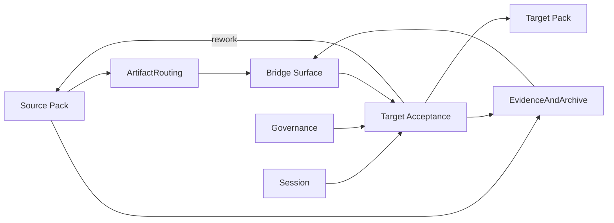

# A170: Garage Cross-Pack Bridge Architecture

- Architecture ID: `A170`
- 状态: 草稿
- 日期: 2026-04-11
- 定位: 在 `A160` 已冻结 pack platform 之后，继续冻结 `Garage` 的 cross-pack bridge 架构，明确一个能力面如何把工作结果、判断依据与 handoff 状态稳定交给另一个能力面，同时保持 artifact-first、evidence-first 与 governance-bounded 的边界。
- 当前阶段: 完整架构主线，实施将按切片推进
- 关联文档:
  - `docs/architecture/A110-garage-extensible-architecture.md`
  - `docs/architecture/A120-garage-core-subsystems-architecture.md`
  - `docs/architecture/A140-garage-system-architecture.md`
  - `docs/architecture/A160-garage-pack-platform-architecture.md`
  - `docs/architecture/A105-garage-team-workspace-and-first-class-objects.md`
  - `docs/features/F010-shared-contracts.md`
  - `docs/features/F040-session-lifecycle-and-handoffs.md`
  - `docs/features/F050-governance-model.md`
  - `docs/features/F120-cross-pack-bridge.md`
  - `docs/design/D110-garage-product-insights-pack-design.md`
  - `docs/design/D120-garage-coding-pack-design.md`
  - `docs/wiki/W030-hermes-agent-harness-engineering-analysis.md`
  - `docs/wiki/W040-hermes-agent-core-design-ideas.md`

## 1. 文档目标与范围

这篇文档只回答一个问题：

**当 `Garage Team` 允许多个能力面协作时，一个 pack 应该如何把结果稳定交给另一个 pack，而不是依赖隐式聊天上下文、宿主缓存或“大家心里都懂”的 handoff 习惯。**

本文覆盖：

- cross-pack bridge 作为平台级 seam 的内部结构
- `bridge artifact`、`bridge evidence`、acceptance、rework 与 lineage 的关系
- bridge 如何与 `Session`、`Governance`、`ArtifactRouting`、`EvidenceAndArchive` 对接
- 当前 `product-insights -> coding` 这条 bridge 在总体架构中的校准意义

本文不覆盖：

- 某一条具体 bridge payload 的完整字段模板
- pack 内部节点如何产生这些 artifact 的详细流程
- 多 pack 自动编排引擎或复杂路由系统
- UI 呈现、通知方式或实现级调度细节

换句话说，`A170` 先冻结“跨 pack 交接这件事本身怎样成立”，而不是只描述当前第一条具体桥怎么写模板。

## 2. 为什么 cross-pack bridge 必须单独冻结

如果只有 `A160` 而没有这篇文档，系统依然会缺一块关键边界：

- 我们知道 pack 如何进入平台，但还不知道 pack 之间如何退出和接续。
- 我们知道 artifact、evidence、governance 各自存在，但还不知道它们怎样共同组成一次跨 pack handoff。

这会直接导致两种坏形态：

- 上游以为“已经做完了”，下游却无法判断输入是否真的可消费。
- 下游被迫吃下不完整输入，结果把上游的模糊性带进自己 pack 内部，再反向污染平台边界。

因此，`Garage` 需要明确承认：

- `Pack Platform` 解决的是 pack 怎样接入平台。
- `Cross-Pack Bridge` 解决的是 pack 之间怎样在平台边界内交接工作。

## 3. 在总体架构中的位置

`A160` 已经明确：bridge 不是第七个特权 contract，也不应该由 `Pack Runtime Binding` 偷偷承担。

当前主线采用下面这个关系：

`Cross-Pack Bridge = Bridge Surface + Acceptance Protocol + Rework Loop + Lineage`

其中：

- `Bridge Surface` 是 artifact 与 evidence 的组合交接面。
- `Acceptance Protocol` 是目标 pack 对输入是否成立的显式判断。
- `Rework Loop` 是交接失败或部分失败时的受控回流路径。
- `Lineage` 负责把桥前、桥中、桥后的状态连成一条可回看的主线。

这张图表达的是责任关系，而不是服务部署：

- bridge 不是一个独立服务，而是 runtime 中多类能力共同形成的交接面。
- `ArtifactRouting` 与 `EvidenceAndArchive` 负责 materialize bridge；它们不替代 acceptance。
- 目标 pack 有权显式接受、带缺口接受、要求澄清或回流。
- `Session` 和 `Governance` 负责让 pack 切换成为受控状态转移，而不是临时改 prompt。

## 4. 第一层拆解：5 个稳定部件

### 4.1 Bridge Surface

负责：

- 组合 `bridge artifact`、`bridge evidence` 与相关工件指针
- 提供一个目标 pack 可读取、可讨论、可回指的正式交接面
- 让 cross-pack handoff 优先通过显式 workspace surfaces 发生

不负责：

- 成为新的特权 shared contract
- 替代 source pack 的内部设计
- 代替 target pack 做 acceptance 结论

### 4.2 Source Pack Exit Control

负责：

- 判断上游是否达到 `bridge-ready` 的最小退出条件
- 在交接前整理问题边界、关键判断、已知风险与未关闭假设
- 保证交给下游的是正式 artifact 与 evidence，而不是聊天摘要

不负责：

- 决定下游必须接受
- 把自己的 pack 语义直接扩散到目标 pack
- 跳过治理检查点直接发起 pack 切换

### 4.3 Target Pack Acceptance Control

负责：

- 判断当前 bridge 是否足以进入目标 pack 的 intake 或主链
- 形成显式 acceptance verdict，并把 verdict 写回 evidence
- 把“不接受”或“需要补足”的原因变成正式回流输入

不负责：

- 假装输入已经足够，只为维持流程表面连续
- 直接改写上游工件当成自己已经接受
- 把 acceptance 结果藏在聊天上下文里

### 4.4 Rework Return Loop

负责：

- 在 bridge 不成立或部分成立时，把缺失项、风险与建议补足方向显式回给上游
- 把回流视为正常的边界保护动作，而不是异常失败
- 让 source pack 能根据明确缺口继续产出新的 bridge surface

不负责：

- 无限在两个 pack 之间模糊来回
- 用口头说明代替正式 rework 输入
- 让目标 pack 在未接受前隐式承担上游工作

### 4.5 Bridge Lineage And Session Alignment

负责：

- 把 source pack 输出、bridge surface、acceptance verdict、target pack 激活与 rework 记录串成一条 lineage
- 让 cross-pack bridge 对齐 `session lifecycle` 与 handoff 状态
- 保证后续 growth、archive 与 review 能回指这次交接为什么成立或为什么失败

不负责：

- 替代 `Session` 维护全部运行状态
- 替代 `EvidenceAndArchive` 保存所有记录
- 抹平 source pack 与 target pack 的边界差异

## 5. 稳定输入、输出与绑定对象

为了让 bridge 能被不同 pack 组合复用，建议先冻结下面这组最小接口对象。

### 5.1 关键输入

- `Source Pack Outputs`
  - 当前 pack 已形成的主工件、边界说明与关键结果
- `Evidence Records`
  - 为什么这些输出成立、哪些地方仍未关闭
- `Accepted Input Shape`
  - 目标 pack 明确允许接收的最小输入面
- `SessionState`
  - 当前是否处于可 handoff、待 acceptance、rework 或新主线激活的状态
- `PolicySet`
  - 当前上下文下 bridge、acceptance、rework 与 pack switch 是否允许继续发生

### 5.2 关键输出

- `BridgeArtifact`
  - 面向目标 pack 的正式交接工件
- `BridgeEvidence`
  - 解释 bridge 为什么成立、哪些部分仍不稳定
- `AcceptanceVerdict`
  - 目标 pack 对输入的显式判断结果
- `ReworkRequest`
  - 回流原因、缺失项与建议补足方向
- `HandoffRecord`
  - 记录这次 pack 切换或切换失败的正式状态变更
- `BridgeLineageLink`
  - 连接 source outputs、bridge surface、acceptance 与后续 target pack 工作的可追溯链路

这里要特别注意：

- `F120` 优先拥有当前第一条 reference bridge 的 feature-level 语义和具体 verdict 集合。
- `D110 / D120` 优先拥有 source / target 两侧各自的最小 bridge 面与消费方式。
- `A170` 只冻结 bridge 作为平台级 seam 为什么存在、怎样连接 runtime，以及它不该越界到哪里。

## 6. 三条关键主链

### 6.1 bridge 组装主链

`Source Pack -> ArtifactRouting / EvidenceAndArchive -> Bridge Surface`

这条主链确保：

- 交给下游的不是隐式上下文，而是正式交接面
- artifact 与 evidence 一起进入 handoff，而不是只交“结论”
- cross-pack bridge 优先发生在 workspace-first 的可读真相面上

### 6.2 acceptance 主链

`Bridge Surface -> Governance / Session -> Target Acceptance -> Target Pack`

这条主链确保：

- 目标 pack 的 intake 是显式判断，不是默认继续
- pack 切换先经过生命周期与治理检查
- 一旦接受，目标 pack 的后续主线有清晰起点

### 6.3 rework 回流主链

`Target Acceptance -> Rework Request -> Source Pack -> New Bridge Surface`

这条主链确保：

- 回流具有正式输入，而不是模糊抱怨
- 上游可以基于明确缺口重新工作
- bridge 失败不会污染目标 pack 的内部主链

## 7. 子系统边界上的 5 条红线

1. cross-pack handoff 不能依赖隐式聊天上下文、宿主缓存或“上一个窗口里已经说过”的状态。
2. bridge 不是新的特权 contract；它必须继续由既有 artifact、evidence、session 与 governance 语义组合表达。
3. 目标 pack 永远有权显式拒绝或回流，不得因为流程方便而被迫吞下输入。
4. rework 必须是显式、可回指的正式动作，不能只是一句口头“你再补一下”。
5. 任何 pack switch 都必须留下 lineage；不能让交接发生后切断 source pack 与 target pack 之间的证据链。

## 8. 这篇文档与其他文档的关系

这篇文档负责：

- 冻结 cross-pack bridge 作为平台级 seam 的内部架构与边界
- 解释 bridge surface、acceptance、rework 与 lineage 怎样共同形成受控 handoff
- 说明 bridge 如何与 `Session`、`Governance`、`ArtifactRouting`、`EvidenceAndArchive` 对接

后续由不同文档继续展开：

- `A160`：继续定义 pack platform、本地 pack 绑定与 reference pack 校准
- `A140`：继续把 cross-pack bridge 放回完整系统主链与 ADR 中讨论
- `F120`：继续定义当前 reference bridge 的具体 feature-level 语义
- `D110`：继续定义 `Product Insights Pack` 如何产出 bridge
- `D120`：继续定义 `Coding Pack` 如何消费 bridge 并给出 acceptance
- `F040`：继续定义与 session lifecycle、handoff state 相关的 feature-level 细化

如果后续 `feature / design / task` 文档把 bridge 写成隐式上下文传球、独立特权 contract，或让 target pack 在没有 acceptance 的情况下默认继续，应以 `A170` 为准回头修正。

如果 `A170` 与 `A160` 或 `A110` 的更高层边界冲突，则仍应以上游架构文档为准，再修正 `A170`。

## 9. 一句话总结

`Garage` 的 cross-pack bridge 不是“把一个 pack 的结论丢给另一个 pack”，而是把 artifact、evidence、acceptance、rework 和 lineage 组织成一个受治理的正式 handoff seam，让多个 packs 能真正协作而不互相污染边界。
