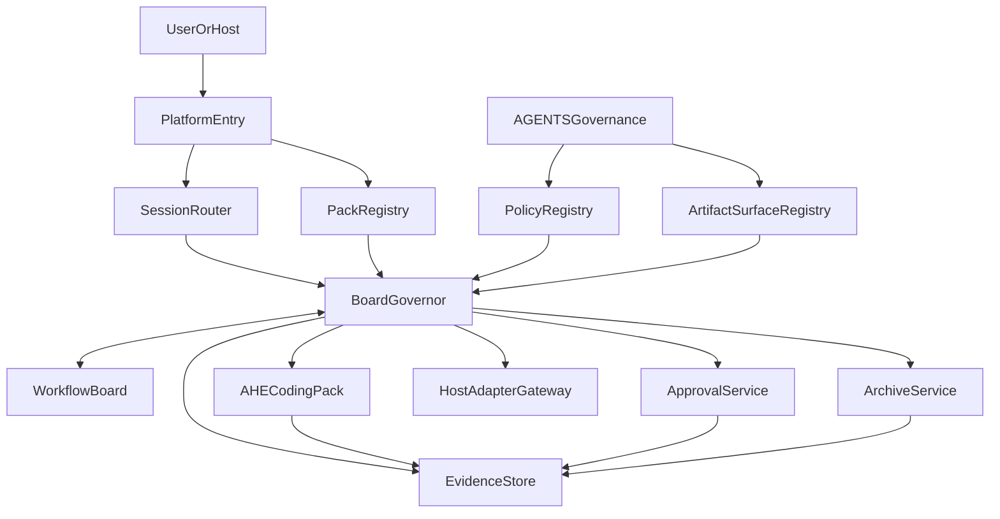

# AHE Agent Platform Control Plane And Shared Contract Architecture

- 状态: 草稿
- 日期: 2026-04-09
- 定位: 定义当前主架构文档所采用的平台优先控制面与共享契约架构，其中 `ahe-coding-skills/` 收缩为首个 coding skill pack，而不是继续承担平台层职责。
- 使用说明: 长期能力建设顺序与 ADR 清单见 `docs/plans/ahe-agent-platform-roadmap-and-adr-backlog.md`。
- 关联文档:
  - `README.md`
  - `AGENTS.md`
  - `docs/plans/ahe-agent-platform-roadmap-and-adr-backlog.md`
  - `docs/architecture/ahe-workflow-skill-anatomy.md`
  - `docs/guides/ahe-workflow-externalization-guide.md`
  - `docs/guides/ahe-path-mapping-guide.md`
  - `docs/analysis/clowder-ai-harness-engineering-analysis.md`

## 1. 概述

当前仓库已经有一份 `ahe-*` 家族导向的多 agent 运行模型草稿，但它仍然主要从 **AHE workflow 如何多 agent 化** 的角度出发。  
本文解决的是当前主架构问题：

- 如何先定义一个 `pack-neutral` 的 multi-agent platform runtime
- 如何把 `ahe-coding-skills/` 重新定义为这个平台上的首个 `Coding Skill Pack`
- 如何避免平台层继续继承 AHE 私有语言、AHE 节点命名和 AHE 特定工件语义

一句话总结：

**先有平台控制面与共享契约，再有 pack；AHE 是第一个 pack，而不是平台本体。**

本文明确不覆盖：

- 完整 working system 的产品面与操作面
- 体验面、部署拓扑和长期服务拓扑
- 多用户、多环境、多 pack 的系统级运行模型

这些能力的长期建设顺序与待冻结 ADR，统一收敛到 `docs/plans/ahe-agent-platform-roadmap-and-adr-backlog.md`。

---

## 2. 设计目标

1. 让平台层承担会话入口、路由、运行时协调、审批暂停、归档和宿主适配。
2. 让 `ahe-coding-skills/` 只承担 coding workflow 节点、coding review / gate 和 coding closeout。
3. 移除平台 shared contract 中的 AHE 私有语言，只保留 pack-local 命名映射。
4. 保持当前 Markdown-first、repo-local、evidence-first 的工作方式，不把系统设计成需要数据库和常驻服务才能成立。
5. 保留 `AGENTS.md` 作为治理注入根，不复制出新的平行真相源。
6. 为未来第二个、第三个非 coding pack 预留可接入的统一 contract。

## 3. 非目标

- 不在这一版里实现完整控制面服务、Web UI、数据库或多用户系统。
- 不把仓库直接演化成类似 Clowder 那样的长期运行平台。
- 不要求第一阶段就切换到 `board-first`。
- 不把现有 `ahe-*` skill 全部重写一遍。
- 不让平台层直接理解或硬编码 `ahe-specify`、`ahe-test-driven-dev`、`full`、`lightweight` 等 AHE 专属语义。

---

## 4. 设计驱动因素

### 4.1 当前问题

当前 AHE 的运行模型已经暴露出几个结构性问题：

- `using-ahe-workflow` 和 `ahe-workflow-router` 同时承担了较多 family 级、甚至接近平台级的语义
- `workflow-board`、lease、outcome、approval、archive 这些对象已经被提出，但尚未脱离 AHE 语境
- review / gate / progress / approval 的约束大量写在 AHE docs 中，未来第二个 pack 很难直接复用
- `contracts/` 与 `schemas/` 当前为空，说明平台级 machine-readable contract 还没有真实挂载面

### 4.2 外部参考启发

基于对 `references/clowder-ai/` 的分析，可以吸收两条最关键经验：

1. 平台层应负责身份、协作、纪律、审计和适配，而不是把这些责任塞进单个 skill family。
2. 宿主与模型差异应通过 adapter 消化，而不是让 workflow 因宿主差异分叉。

### 4.3 本仓约束

本仓不是应用代码仓，而是 Markdown-first 的 harness engineering 工作台，因此第一阶段必须接受：

- 运行时对象以文档和文件化 contract 为主
- progress view 仍需要人类可读
- 兼容模式下会存在 dual-read / dual-write
- 架构设计优先于实现

---

## 5. 备选方案

### 方案 A：继续以 AHE 为中心扩展

做法：

- 继续把多 agent 协调职责挂在 `ahe-workflow-router` 和 AHE family docs 上
- 让其他 future packs 后续再去适配 AHE 的术语和节奏

优点：

- 与现有文档和 skill 家族最连续
- 改动最小

缺点：

- 平台与 pack 边界继续混淆
- 第二个 pack 会被迫继承 AHE 私有语言
- 共享 contract 难以真正中立化

### 方案 B：直接先做完整通用平台

做法：

- 先定义一个完全通用的多 pack runtime 和 machine-readable contract
- AHE 只是其中一个示例 pack

优点：

- 长期结构最干净
- 最容易支持多 pack

缺点：

- 对当前仓库来说过于超前
- 容易产生抽象很漂亮、落地很空的控制面
- 第一阶段实现和维护成本过高

### 方案 C：平台优先，但从单 pack 启动

做法：

- 先定义平台中立边界和 shared contract
- 第一阶段只接一个 pack：`ahe-coding-skills/`
- 以 AHE 作为 reference pack 验证平台 contract 是否成立

优点：

- 长期边界正确
- 近期可落地
- 不需要立刻实现完整平台

缺点：

- 兼容期内会同时存在平台术语和 AHE pack-local 命名
- 需要额外维护一层映射

### 选定方案

选择 **方案 C：平台优先，但从单 pack 启动**。

原因：

- 它能把平台层从 AHE 中抽出来
- 同时又不会脱离当前仓库的真实成熟度
- 适合先完成架构设计、contract 设计和目录挂载，再逐步推进实现

---

## 6. 核心原则

1. `Platform-neutral first`
   平台只理解中立对象和 contract，不理解 AHE 私有语义。

2. `Pack-local naming allowed`
   pack 内部可以保留自己的命名、graph variant 和节点 ID。

3. `Evidence over chat memory`
   运行状态优先由 board、record 和 artifact surface 决定，而不是由聊天记忆决定。

4. `Single-writer for primary artifacts`
   主工件单写；质量检查可只读并行；gate、closeout、archive 串行。

5. `Governance injected, not copied`
   治理规则通过 `AGENTS.md` 注入，不复制出第二份平行治理源。

6. `Artifact-first before board-first`
   第一阶段 board 是运行时辅助事实源，不抢占工件的保守性。

---

## 7. 平台术语去私有化规则

平台层禁止把 AHE 家族术语升格为保留字。

### 7.1 平台保留的中立术语

| 平台术语 | 含义 |
| --- | --- |
| `pack` | 一组可注册、可调度的 skill family |
| `session` | 一次可恢复的多节点工作会话 |
| `graphVariantId` | pack 声明的 graph 变体标识 |
| `nodeId` | pack-local 节点标识 |
| `artifactRole` | 逻辑工件角色 |
| `progressView` | 人类可读的状态投影视图 |
| `reviewRecord` | 评审记录 |
| `verificationRecord` | 验证记录 |
| `approvalCheckpoint` | 需要显式审批证据的暂停点 |
| `attempt` | 某节点的一次执行尝试 |
| `lease` | 节点执行租约 |
| `outcome` | 节点执行结果 |
| `archiveSnapshot` | session 的冻结归档快照 |

### 7.2 AHE 只保留为 pack-local 命名

| AHE 命名 | 平台视角 |
| --- | --- |
| `ahe-coding-skills/` | `packId = ahe-coding` 的 pack 根 |
| `ahe-workflow-router` | AHE pack 的入口/路由节点之一 |
| `ahe-test-driven-dev` | AHE pack 的实现节点之一 |
| `full` / `standard` / `lightweight` | AHE pack 自己声明的 `graphVariantId` |
| `task-progress.md` | AHE pack 的 `progressView` 投影文件 |

### 7.3 约束

- 平台 schema 不出现 `ahe-*` 字段名。
- 平台目录不以 `ahe-` 作为命名前缀。
- 平台不硬编码 AHE 的节点顺序、variant 名称和审批别名。
- AHE 可以通过 registry 和 mapping 把这些私有命名映射回平台 contract。

---

## 8. 顶层架构

## 9. 分层职责

### 9.1 入口层

职责：

- 接收来自用户、命令壳层或宿主环境的请求
- 判断应该进入哪个 pack
- 创建或恢复 session

不负责：

- 直接展开 AHE 节点逻辑
- 直接决定 review / gate 结论

### 9.2 治理注入层

职责：

- 从 `AGENTS.md` 读取路径映射、审批等价证据、policy、禁并发规则
- 向运行时提供 repo-local 约束

不负责：

- 直接变成第二套 pack 配置文件

### 9.3 协调运行时层

职责：

- 管理 board、lease、attempt、pause、archive
- 重算下一个推荐节点
- 收口 fan-out 和节点回退

不负责：

- 产出 spec / design / tasks / code
- 自己充当 reviewer

### 9.4 Shared contract 层

职责：

- 定义 platform-neutral 的对象、记录和 schema
- 为 pack registry 提供统一装配面

建议未来挂载位置：

- `contracts/`
- `schemas/`

当前状态：

- 两个目录均为空，说明这是后续落地的重要缺口

### 9.5 Skill pack 层

职责：

- 提供 domain-specific 节点能力
- 声明 graph variants、node contracts、pack-local templates 和 docs

首个 pack：

- `ahe-coding-skills/`

### 9.6 宿主适配层

职责：

- 屏蔽 Cursor、CLI、subagent、shell、MCP 等宿主差异
- 为 pack 暴露统一执行边界

原则：

- 宿主差异通过 adapter 吃掉，不让 workflow 分叉

### 9.7 证据与归档层

职责：

- 存储 review、verification、approval、outcome 和 archive snapshot
- 供恢复、gate 和 closeout 回读

---

## 10. 核心运行时对象

### 10.1 `PackDefinition`

最小字段建议：

- `packId`
- `displayName`
- `graphVariants`
- `entryNodes`
- `nodeRegistryRef`
- `artifactRoleMappings`

### 10.2 `WorkflowSession`

最小字段建议：

- `sessionId`
- `packId`
- `topic`
- `graphVariantId`
- `executionMode`
- `governanceSnapshot`
- `scope`
- `baselineArtifacts`
- `currentBoardVersion`

### 10.3 `WorkflowBoard`

最小字段建议：

- `boardVersion`
- `currentRecommendedNode`
- `readyNodes`
- `blockedNodes`
- `activeLeases`
- `pendingApprovals`
- `lastAcceptedOutcome`

### 10.4 `NodeDefinition`

最小字段建议：

- `nodeId`
- `nodeKind`
- `requiredReads`
- `expectedWrites`
- `allowedOutcomes`
- `retryFromNode`
- `parallelismMode`
- `approvalCheckpoint`

### 10.5 `NodeAttempt`

最小字段建议：

- `attemptId`
- `sessionId`
- `nodeId`
- `leaseId`
- `snapshotVersion`
- `ownerAgentType`
- `submittedOutcome`

### 10.6 `Lease`

最小字段建议：

- `leaseId`
- `nodeId`
- `expiresAt`
- `heartbeatInterval`
- `requiredReads`
- `expectedWrites`

### 10.7 `ArtifactSurface`

最小字段建议：

- `artifactRole`
- `authoritativePath`
- `writable`
- `readerNodes`
- `writerNodes`

### 10.8 `EvidenceRecord`

最小字段建议：

- `recordId`
- `recordClass`
- `sessionId`
- `nodeId`
- `artifactRefs`
- `summary`
- `hash`
- `capturedAt`

### 10.9 `ArchiveSnapshot`

最小字段建议：

- `archiveId`
- `sessionId`
- `adoptedArtifacts`
- `evidenceIndex`
- `boardSnapshot`
- `closedAt`

---

## 11. AHE Coding Pack 的边界

### 11.1 保留在 AHE 内的内容

- producers:
  - `ahe-specify`
  - `ahe-design`
  - `ahe-tasks`
  - `ahe-test-driven-dev`
  - `ahe-hotfix`
  - `ahe-increment`
  - `ahe-finalize`
- coding review / gate:
  - `ahe-spec-review`
  - `ahe-design-review`
  - `ahe-tasks-review`
  - `ahe-bug-patterns`
  - `ahe-test-review`
  - `ahe-code-review`
  - `ahe-traceability-review`
  - `ahe-regression-gate`
  - `ahe-completion-gate`
- pack-local docs 与 templates：
  - `ahe-coding-skills/docs/`
  - `ahe-coding-skills/templates/`

### 11.2 从 AHE 中抽离到平台的内容

- 公共入口壳层
- pack-neutral runtime router
- board / lease / attempt / archive / approval
- host adapter
- evidence store
- shared contract schema

### 11.3 `ahe-finalize` 的重新定位

`ahe-finalize` 仍然保留，但它只负责：

- coding closeout payload
- release / closeout 摘要
- evidence index 汇总

它不再承担：

- session 最终冻结
- archive snapshot 固化
- 平台级审计索引

这些职责应归平台 archive 责任。

---

## 12. 当前仓库的挂载点与缺口

### 12.1 可直接复用的挂载点

| 当前路径 | 未来角色 |
| --- | --- |
| `ahe-coding-skills/` | 首个 coding pack |
| `ahe-coding-skills/docs/` | pack-local 协议与说明 |
| `ahe-coding-skills/templates/` | pack-local artifact 模板 |
| `docs/architecture/` | 平台级架构文档 |
| `docs/designs/` | pack-specific 目标态设计 |
| `docs/guides/` | 外部化与映射指南 |
| `agents/` | 未来 agent role specs 挂载点 |
| `rules/` | 未来平台 policy fragments 挂载点 |
| `hooks/` | 未来 lifecycle hooks 说明或脚本挂载点 |

### 12.2 当前缺口

| 缺口 | 当前状态 |
| --- | --- |
| `contracts/` | 存在但为空 |
| `schemas/` | 存在但为空 |
| platform-neutral entry docs | 尚无单独挂载点 |
| runtime artifact store | 尚无统一目录或 schema |
| policy registry | 目前主要隐含在 `AGENTS.md` 和 AHE docs 中 |

结论：

- 新架构应优先把 `contracts/` 和 `schemas/` 变成真实挂载面
- 而不是继续把共享 contract 只写在 AHE 文档里

---

## 13. Phase 1 设计范围

### 13.1 本阶段做什么

- 只完成平台优先架构和 contract 设计
- 只接入一个 pack：`ahe-coding-skills/`
- 只定义 repo-local、file-backed runtime 形态
- 只覆盖主链闭环，优先以 AHE 的 `standard` 变体做参考
- 只允许 quality fan-out 做只读并行

### 13.2 本阶段不做什么

- 不实现常驻服务、数据库和 Web UI
- 不实现多用户、多仓 federation
- 不把 `workflow-board` 立即提升为唯一事实源
- 不支持多个 pack 同时执行
- 不修改 AHE 的 coding 质量门禁

---

## 14. 兼容与切换策略

### 14.1 兼容模式

第一阶段采用：

- `artifact-first + board-assisted`

规则：

- 工件证据优先于 board 推断
- board 负责协调和恢复，但不能越过已落盘证据
- `task-progress.md` 继续保留为 AHE pack 的 `progressView`
- 若 board 与 review / verification / progress 冲突，以更保守的工件证据处理

### 14.2 切到 `board-first` 的前提

只有以下条件全部满足，才建议切换：

- `contracts/` 中已存在稳定的 machine-readable node contracts
- `schemas/` 中已存在稳定的 board / attempt / lease / archive schemas
- AHE pack 的 graph variant、artifact role、approval checkpoint 已可被 registry 正常装配
- 至少一轮 dual-run 证明 board 路由与 artifact-first 路由不会分叉

---

## 15. 风险与缓解

| 风险 | 说明 | 缓解 |
| --- | --- | --- |
| 平台与 AHE 边界重新混淆 | pack-neutral 能力继续被写回 AHE docs | 平台 contract 只放中立术语，并在 `contracts/` / `schemas/` 落点 |
| 术语抽象过头 | 平台中立术语太空泛，pack 作者难理解 | 同时维护清晰的 pack-local mapping 表 |
| 状态漂移 | board 与 Markdown 工件不同步 | 兼容期坚持 artifact-first，冲突时保守回退 |
| 自审风险 | execution、quality、approval、archive 边界混用 | 强制把这些职责拆到不同节点或服务 |
| 过早平台化 | 在只有一个 pack 时设计过厚的平台 | 第一阶段只做单 pack bootstrap，不实现完整控制面 |

---

## 16. 建议的后续落地顺序

1. 先完成这份平台优先架构文档，并明确旧的 AHE-centric 运行模型文档只作为 pack-specific 基线。
2. 再在 `contracts/` 与 `schemas/` 中定义 platform-neutral shared contracts 的目标清单。
3. 再补 `PackRegistry`、`ArtifactSurfaceRegistry` 和 `NodeDefinition` 的 machine-readable 设计。
4. 然后才考虑把 `using-ahe-workflow` / `ahe-workflow-router` 的公共职责提炼成平台入口与 router。
5. 最后再决定是否引入第二个非 coding pack。

---

## 17. 一句话结论

推荐把 AHE 向 multi-agent 演进的下一阶段，定义为一个 **平台优先、术语中立、单 pack 启动** 的架构：平台层负责 session、board、approval、archive、adapter 和 shared contract，`ahe-coding-skills/` 仅作为首个 coding skill pack 挂载其上，从而避免 AHE 继续扮演平台本体。
