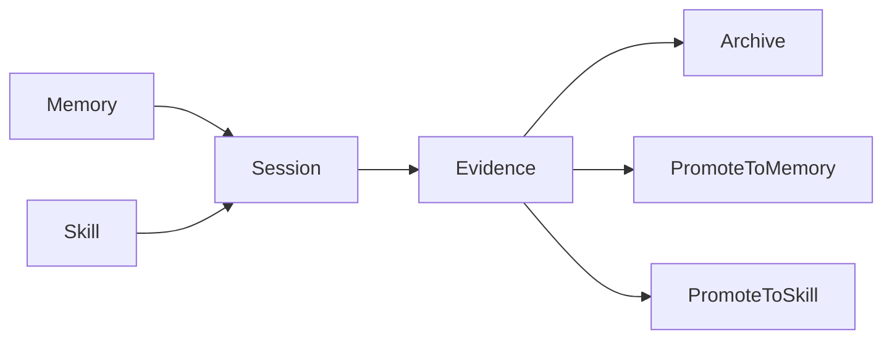

# Garage Continuity Memory Skill Architecture

- 状态: 草稿
- 日期: 2026-04-11
- 定位: 定义 `Garage` 在 phase 1 的连续性架构，明确 `memory`、`session`、`skill`、`evidence` 四类长期资产如何分层、如何交互，以及什么可以晋升、什么不能自动晋升。
- 当前阶段: phase 1
- 关联文档:
  - `docs/garage/README.md`
  - `docs/garage/garage-extensible-architecture.md`
  - `docs/garage/garage-core-subsystems-architecture.md`
  - `docs/garage/garage-shared-contracts.md`
  - `docs/garage/garage-phase1-reference-packs.md`
  - `docs/garage/garage-phase1-continuity-mapping-and-promotion.md`
  - `docs/analysis/hermes-agent-harness-engineering-analysis.md`

## 1. 文档目标与范围

这篇文档只回答一个问题：

**如果 `Garage` 想成为一个越用越顺手的 `Creator OS`，那么 `memory`、`session`、`skill`、`evidence` 这四类长期资产应该如何分层。**

本文覆盖：

- 为什么 continuity 需要独立设计
- `memory`、`session`、`skill`、`evidence` 的边界
- 四者在 `Garage` 架构中的位置
- 它们之间的激活与晋升路径
- 哪些内容绝不能自动晋升
- phase 1 的收敛范围

本文不覆盖：

- 具体存储引擎
- 向量检索或 embedding 方案
- 自动学习流水线
- 各个 pack 的具体 skill 编写细节

## 2. 为什么 continuity 需要独立设计

如果没有 continuity 分层，`Garage` 很容易退化成一个“看起来有长期记忆，实际上只是把上下文越堆越乱”的系统。

最常见的问题是：

- 把稳定偏好、当前过程、可复用方法和审计记录混成一个桶
- 让 `session` 偷偷承担长期记忆
- 让 `evidence` 被误用成通用记忆仓
- 让 `skill` 退化成单次任务的备份文本

因此，continuity 的目标不是“多存一点”，而是先把不同类型的长期资产分开，避免互相污染。

## 3. Hermes 对这条主线的启发

`Garage` 在连续性设计上吸收的是 `Hermes` 的结构判断，而不是复刻它的产品外形：

- 稳定事实和过程历史不能混放
- 可复用方法应独立于当前任务状态
- 高于入口的统一 core 才能真正承接长期连续性

因此，在 `Garage` 里，连续性不是“保存更多聊天记录”，而是：

- 有分层
- 有边界
- 有晋升规则
- 有回读语义

## 4. 四类长期资产总览

| 资产 | 回答的问题 | 典型内容 | 不应包含什么 |
| --- | --- | --- | --- |
| `memory` | 长期成立的事实是什么 | 用户偏好、稳定约束、长期环境信息 | 临时任务状态、未验证判断 |
| `session` | 当前这次工作正在发生什么 | 当前目标、上下文、handoff、进行中状态 | 长期事实、最终证据归档 |
| `skill` | 哪些方法以后还值得复用 | 工作流、模板、套路、方法面 | 单次任务噪音、未沉淀结论 |
| `evidence` | 我们为什么这样判断、做过什么验证 | 决策、审批、review、verification、archive 记录 | 全量聊天噪音、长期偏好本身 |

这张图表达的是：

- `memory` 与 `skill` 为当前 `session` 提供长期支持
- `session` 在关键节点产生 `evidence`
- `memory` 与 `skill` 的晋升优先经过 `evidence` 或显式治理，而不是从原始对话直接自动长出来

## 5. 四者在 `Garage` 中的位置

continuity axis 不是一个额外替代 `Garage Core` 的“大系统”，而是一条贯穿平台的正交设计视角：

- `session` 位于 `Garage Core` 的协调层
- `evidence` 位于 `Garage Core` 的追溯层
- `memory` 是围绕 core 的长期事实层
- `skill` 是围绕 pack 的可复用方法层

这意味着：

- `session` 与 `evidence` 是 core 的稳定对象
- `memory` 与 `skill` 也必须在架构上被显式定义
- 但 phase 1 不要求先把 `memory` 与 `skill` 做成重型独立平台

## 6. `Memory`

### 6.1 它负责什么

`memory` 负责存放对未来多个 session 仍然成立的信息，例如：

- 创作者偏好
- 长期环境约束
- 已被确认的工作习惯
- 跨会话仍然成立的背景事实

### 6.2 它不负责什么

- 不记录当前任务进度
- 不保存所有历史聊天
- 不直接承载 review 或 verification 结果
- 不充当 skill 仓库

## 7. `Session`

### 7.1 它负责什么

`session` 负责表示当前这次工作正在发生什么：

- 当前目标
- 当前 pack / node
- 当前上下文
- 当前 handoff 状态
- 当前进行中的主线

### 7.2 它不负责什么

- 不承担长期事实存储
- 不承担方法沉淀
- 不替代证据记录
- 不演化成无限增长的历史桶

## 8. `Skill`

### 8.1 它负责什么

`skill` 负责沉淀那些值得在未来反复复用的方法：

- 工作流
- 模板
- 稳定套路
- 可重用的协作方法

### 8.2 它不负责什么

- 不存当前任务状态
- 不存长期个人偏好
- 不保存未经验证的单次灵感
- 不把单次成功路径直接升级为长期方法

## 9. `Evidence`

### 9.1 它负责什么

`evidence` 负责记录那些需要被追溯、复查、解释和归档的关键事实：

- decision
- approval
- review verdict
- verification result
- archive record

### 9.2 它不负责什么

- 不替代当前 session
- 不等于 memory
- 不等于 skill
- 不保存所有瞬时对话细节

## 10. 激活、晋升与禁止自动晋升

这条 continuity axis 最重要的，不只是“四层分开”，而是明确哪些路径默认发生、哪些路径必须显式确认、哪些路径默认禁止。

| 类型 | 路径 | phase 1 语义 |
| --- | --- | --- |
| 激活 | `Memory -> Session` | 允许，按需激活长期事实、偏好和约束 |
| 激活 | `Skill -> Session` | 允许，按需调用可复用方法 |
| 晋升 | `Session -> Evidence` | 允许，关键决策、验证、审批、closeout 应形成记录 |
| 晋升 | `Evidence -> Memory` | 允许，但必须满足“稳定、长期有价值、经过确认” |
| 晋升 | `Evidence -> Skill` | 允许，但必须满足“可重复复用、方法边界清楚、经过确认” |
| 非默认直接晋升 | `Session -> Memory` | 不作为默认自动路径；只允许在显式治理动作下保守晋升 |
| 非默认直接晋升 | `Session -> Skill` | 不作为默认自动路径；只允许在显式提炼和确认后晋升 |
| 禁止自动晋升 | `Memory <-> Skill` 自动互转 | 默认禁止 |
| 禁止自动晋升 | `Evidence -> Memory / Skill` 无门槛自动化 | 默认禁止 |

## 11. 哪些内容绝不能自动晋升

下面这些内容即使在运行中出现，也不应因为“被看见”就自动进入 `memory` 或 `skill`：

- 全量聊天记录或原始思维过程
- 未经确认的假设、方向猜测或临时计划
- 一次性 workaround、repo 特例或宿主特定操作步骤
- 只在单个 pack 内偶然成立的私有 heuristics
- 缺少 review、verification 或明确接受动作的结论
- 带有强时效性的临时上下文
- 应保留为 evidence 的失败样本、争议记录和审批痕迹

phase 1 应坚持一个保守判断：

**连续性资产宁可少而准，也不要多而混。**

## 12. 这条 axis 对 phase 1 reference packs 的意义

这条 continuity 设计对 `Coding Pack` 和 `Product Insights Pack` 都是基础约束。

对 `Product Insights Pack` 来说：

- `session` 承接 framing、research、probe、bridge 前的状态切换
- `evidence` 沉淀判断依据、信号来源、bridge lineage
- `memory` 更适合承接长期问题域偏好、创作者目标、稳定方向约束
- `skill` 更适合承接研究套路、分析方法和洞察工作流模式

对 `Coding Pack` 来说：

- `session` 承接规格推进、实现上下文、review 与 closeout 状态
- `evidence` 沉淀设计取舍、review verdict、verification 结果与收尾依据
- `memory` 更适合承接长期工程约束、仓库偏好、质量偏向
- `skill` 更适合承接可重复调用的实现、复查和收尾方法

对两个 pack 的共同要求是：

- 跨 pack handoff 优先通过 `artifact + evidence`
- 长期偏好进入 `memory`
- 可复用方法进入 `skill`
- 任何单次 session 的上下文都不能越级替代这些显式层

## 13. Phase 1 收敛范围

phase 1 在 continuity 上需要非常克制。

当前阶段只做这些事：

- 先把四类 continuity 对象的边界说清楚
- 让 `session` 与 `evidence` 在 core 中保持稳定对象地位
- 让 `memory` 与 `skill` 先以文件化、显式、可人工治理的方式存在
- 先验证 `coding` 与 `product insights` 两个 reference packs 能否沿着这条 axis 协作

当前阶段不做这些事：

- 不做自动学习系统
- 不做向量数据库或复杂检索层
- 不做自动生成和自动发布 skill
- 不做大规模偏好推断系统
- 不做完整 personalization engine

## 14. 后续拆解顺序

这篇文档先冻结 continuity 的高层边界。

如果继续往下拆，建议顺序是：

1. 再拆 `memory` 的候选来源与治理边界
2. 再拆 `skill` 的沉淀与复用面
3. 再拆 continuity 与 reference packs 的实际映射规则

当前阶段不急着把这些都做成完整系统。

## 15. 遵循的设计原则

- 分层连续性：`memory`、`session`、`skill`、`evidence` 必须分层，而不是混成一个桶。
- 长期事实保守化：只有真正跨 session 成立的信息才进入 `memory`。
- 过程状态显式化：`session` 只表示当前工作边界，不承担长期沉淀。
- 方法沉淀克制化：`skill` 只接纳真正值得复用的方法，不接纳单次噪音。
- 证据优先追溯：关键决策、审批、验证默认进入 `evidence`，保证后续可恢复、可复查。
- 晋升显式化：从 `session` 或 `evidence` 晋升到 `memory` 或 `skill` 必须是显式动作。
- `Markdown-first`：phase 1 的连续性资产优先保持人类可读。
- `File-backed`：phase 1 以文件和轻量 sidecar 为主，不提前引入重型存储系统。
- phase 1 克制：先冻结语义边界和晋升规则，再讨论自动学习与复杂个性化。
