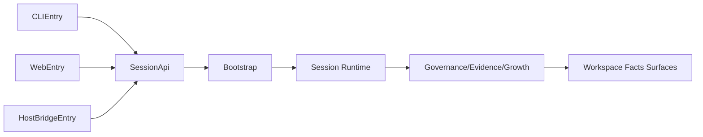
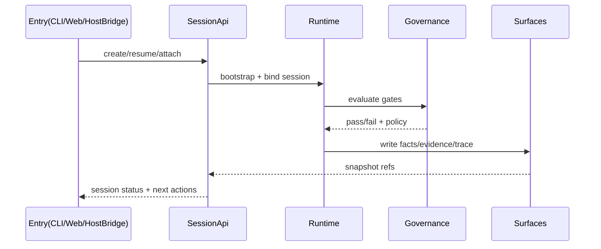

# D10: Agent Team Workspace Designs

- Design ID: `D10`
- 状态: 草稿
- 日期: 2026-04-11
- 定位: 收口 `Garage Team` 工作环境的具体产品表面设计，说明 CLI / Web / HostBridge 三类入口怎样在产品层展开。
- 关联文档:
  - `docs/GARAGE.md`
  - `docs/architecture/10-entry-and-host-injection-layer.md`
  - `docs/features/F10-agent-teams-product-surface.md`
  - `docs/features/F11-runtime-topology-and-entry-bootstrap.md`
  - `docs/features/F102-independent-workspace-entries.md`
  - `docs/features/F103-host-bridge-capability-injection.md`
  - `docs/features/F113-session-api-and-shared-entry-binding.md`

## 1. 这份文档回答什么

在产品层，`Garage Team` 工作环境如何通过 `CLIEntry`、`WebEntry`、`HostBridgeEntry` 三类入口统一接入同一条 runtime truth，并且保持可恢复、可治理、可验证。

## 2. 设计驱动因素（来自已确认 specs）

- `F10` / `F11`: 入口体验可以不同，但 runtime truth 必须唯一。
- `F102`: CLI 和 Web 都是一等入口，不能退化为“主入口 + 从入口”。
- `F103`: HostBridge 只能注入能力，不能抢占 authority。
- `F113`: 所有入口必须通过共享 `SessionApi` 绑定 `Bootstrap -> Session` 主链。
- 约束: local-first、可恢复、可观察、支持治理 gate。

## 3. 备选方案与决策

### 3.1 方案 A：每个入口自带 orchestration（不选）

- 描述: CLI/Web/HostBridge 各自封装自己的编排和状态恢复。
- 优点: 入口迭代快，局部实现简单。
- 缺点: 容易形成多份 runtime truth，跨入口一致性不可控。
- 风险: review/evidence/growth 语义漂移，后续治理成本高。

### 3.2 方案 B：共享 `SessionApi` + 入口适配层（选定）

- 描述: 入口只负责交互适配，状态和编排统一落在共享主链。
- 优点: 真相唯一，跨入口切换成本低，治理和证据语义统一。
- 缺点: 初期接口设计要求更高，前期需要明确契约。
- 风险缓解: 在 `D101/D102/D103` 中明确每个入口的输入输出和失败映射。

### 3.3 方案 C：HostBridge 升级成主入口（不选）

- 描述: 把宿主当中心，CLI/Web 作为宿主插件。
- 缺点: 与产品定位冲突，且会把 authority 外移。

## 4. 共同产品对象与边界

所有入口都应围绕同一组产品对象组织，而不是围绕工具开关组织：

- `Garage Team`
- workspace
- session
- handoff
- review
- evidence
- long-term team assets such as memory and skill

边界约束：

- 入口层负责 UX、输入采集、结果呈现，不持有生命周期 authority。
- runtime 层负责 session 状态机、治理 gate、证据链写入。
- HostBridge 仅注入上下文和能力提示，不覆盖 provider/model authority。

## 5. 入口分工

### 5.1 `CLIEntry`

- 面向直接、连续、低摩擦的团队工作
- 强调 session progression、命令式推进和可恢复的工作流

### 5.2 `WebEntry`

- 面向可视化的团队工作环境
- 强调 session、workspace facts、review、observability 与多面板查看

### 5.3 `HostBridgeEntry`

- 面向能力注入
- 让已有工具借用 Garage 的 agents、skills、治理和长期能力
- 不成为新的系统真相源

## 6. 共享架构视图

## 7. 关键接口与契约（总表）

| 接口 | 输入 | 输出 | 失败语义 |
| --- | --- | --- | --- |
| `CreateSession` | `team_id`, `workspace_id`, `profile`, `entry_type` | `session_id`, `session_status=active` | `workspace_not_found`, `profile_denied`, `entry_not_allowed` |
| `ResumeSession` | `session_id`, `entry_type` | `session_snapshot`, `pending_gates` | `session_missing`, `session_incompatible`, `session_closed` |
| `AttachWorkspace` | `workspace_id`, `session_id` | `workspace_binding`, `facts_projection` | `workspace_bind_failed`, `facts_unavailable` |
| `SubmitStep` | `session_id`, `step_payload`, `entry_context` | `step_result`, `trace_ref`, `evidence_ref` | `governance_gate_failed`, `runtime_rejected` |
| `InterruptSession` | `session_id`, `reason` | `session_status=interrupted`, `resume_hint` | `interrupt_not_allowed` |
| `GetSessionStatus` | `session_id` | `status`, `host_binding`, `next_actions` | `session_missing` |

## 8. 关键控制流

## 9. 失败语义与恢复策略

- `workspace_not_found` / `workspace_bind_failed`: 入口显示绑定失败并引导重新选择 workspace。
- `profile_denied`: 显示可用 profile 与当前限制，不允许入口绕过。
- `governance_gate_failed`: 返回可读 gate 原因和下一动作，禁止“静默成功”。
- `session_missing` / `session_incompatible`: 提供 `create new` 与 `attach valid session` 两种恢复路径。
- `facts_unavailable`: 保留 session 主链状态，允许重试 facts 投影，不中断生命周期真相。

## 10. 非功能需求落地

- 一致性: 所有入口都通过 `SessionApi`，禁止直连 runtime internals。
- 可恢复性: 每次状态变更都回写 `session_snapshot` 与 `resume_hint`。
- 可观测性: `SubmitStep` 返回 `trace_ref` 与 `evidence_ref`。
- 可治理性: 所有关键动作都必须经过 governance gate。
- 可扩展性: 新入口只扩展 entry adapter，不修改 runtime authority 归属。

## 11. 测试策略与验收锚点

- 契约测试: 验证六个核心接口的输入输出和错误码稳定。
- 入口一致性测试: 同一 session 在 CLI/Web 间切换后状态一致。
- HostBridge 约束测试: 宿主无法写入 provider/model authority。
- 故障恢复测试: 在 `governance_gate_failed` 和 `facts_unavailable` 下可恢复。
- 可观测性测试: 每次 `SubmitStep` 都产生可追溯 `trace_ref/evidence_ref`。

验收锚点：

- `A1`: 三入口共用主链且能互相恢复 session。
- `A2`: 失败语义一致，入口不发明独立错误真相。
- `A3`: HostBridge 注入不突破 authority 边界。

## 12. 非目标

- 不在这里定义具体实现代码结构
- 不把 Web 设计成 remote SaaS
- 不把 HostBridge 设计成主产品入口
- 不让 CLI 退化成内部调试壳

## 13. 下游设计拆分

- `D101`：CLI workspace design
- `D102`：Web workspace design
- `D103`：HostBridge integration design
