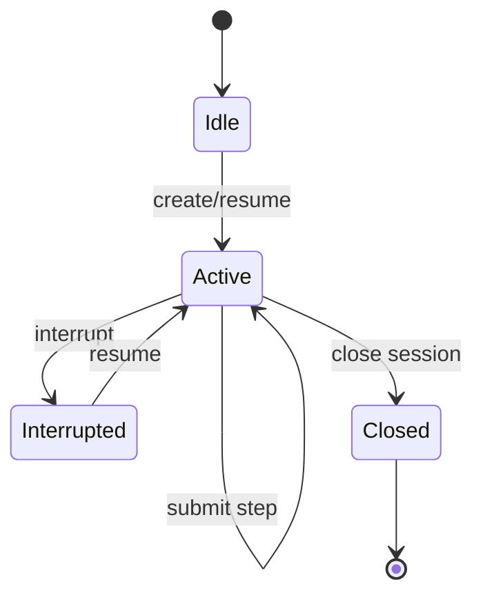

# D101: CLI Workspace Design

- Design ID: `D101`
- 状态: 草稿
- 日期: 2026-04-11
- 定位: 展开 `CLIEntry` 作为独立工作环境入口的产品与交互设计。
- 关联文档:
  - `docs/design/D10-agent-team-workspace-designs.md`
  - `docs/features/F102-independent-workspace-entries.md`
  - `docs/features/F113-session-api-and-shared-entry-binding.md`
  - `docs/features/F121-neutral-runtime-records.md`

## 1. 设计目标

- 让 CLI 成为独立可用的 `Garage Team` 入口
- 暴露 create / resume / attach / step progression 的最小交互面
- 不把 CLI 设计成私有 runtime 壳层

## 2. 用户进入时看到什么

CLI 入口首先应该让用户明确：

- 当前自己进入的是哪个 `Garage Team`
- 当前绑定的是哪个 workspace / profile / session
- 当前操作会沿着哪条 session 主链推进

## 3. 最小交互面

最小 CLI 应至少承接：

- create
- resume
- attach
- submit step
- interrupt
- status / summary

这些动作都必须通过共享 `SessionApi` 发起，而不是自己直连 runtime internals。

## 4. CLI -> SessionApi 契约

| CLI 动作 | SessionApi 调用 | 请求字段 | 成功返回 | 错误返回 |
| --- | --- | --- | --- | --- |
| `garage create` | `CreateSession` | `team_id`, `workspace_id`, `profile` | `session_id`, `session_status=active` | `workspace_not_found`, `profile_denied` |
| `garage resume` | `ResumeSession` | `session_id` | `session_snapshot`, `pending_gates` | `session_missing`, `session_closed` |
| `garage attach` | `AttachWorkspace` | `workspace_id`, `session_id` | `workspace_binding`, `facts_projection` | `workspace_bind_failed`, `facts_unavailable` |
| `garage step` | `SubmitStep` | `session_id`, `step_payload` | `step_result`, `trace_ref`, `evidence_ref` | `governance_gate_failed`, `runtime_rejected` |
| `garage interrupt` | `InterruptSession` | `session_id`, `reason` | `session_status=interrupted`, `resume_hint` | `interrupt_not_allowed` |
| `garage status` | `GetSessionStatus` | `session_id` | `status`, `next_actions` | `session_missing` |

## 5. 状态反馈与状态机

CLI 至少应稳定展示：

- session identity
- workspace identity
- host binding summary
- session status
- 关键失败信息，例如 workspace/profile/session/entry gate 失败

推荐最小状态机：

## 6. 错误模型与恢复

CLI 不应自己发明错误真相，而应消费共享 entry/runtime 失败：

- workspace binding errors
- profile authority errors
- missing session
- governance gate failures
- unsupported host/entry binding

恢复策略：

- `workspace_bind_failed`: 提示重新 attach 或切换 workspace。
- `profile_denied`: 输出 policy 约束，不允许降级绕过。
- `session_missing`: 提供 `create` 或 `resume <valid-id>`。
- `governance_gate_failed`: 输出 gate 名称、失败原因、建议 next action。

## 7. 测试策略与验收锚点

- 契约测试: 六个 CLI 动作与 SessionApi 返回模型一致。
- 状态恢复测试: `interrupt -> resume` 后上下文与 pending gates 保持一致。
- 错误显示测试: 错误码映射到可读提示，不隐藏失败。
- 证据联动测试: `garage step` 成功后必须输出 `trace_ref/evidence_ref`。

验收锚点：

- `CLI-A1`: CLI 可在不中断主链的前提下 create/resume/attach。
- `CLI-A2`: 错误语义与共享 runtime 一致。
- `CLI-A3`: CLI 不持有 provider authority 或 session lifecycle authority。

## 8. 非目标

- 不在本设计中定义完整命令大全
- 不在本设计中引入 TUI-first 重型交互
- 不让 CLI 成为 provider authority owner

## 9. 设计完成标准

- CLI 被清楚定义为独立工作环境入口
- CLI 的最小交互面与错误面足以驱动实现任务分解
- 下游 task 不需要再猜 CLI 和 SessionApi 的关系
