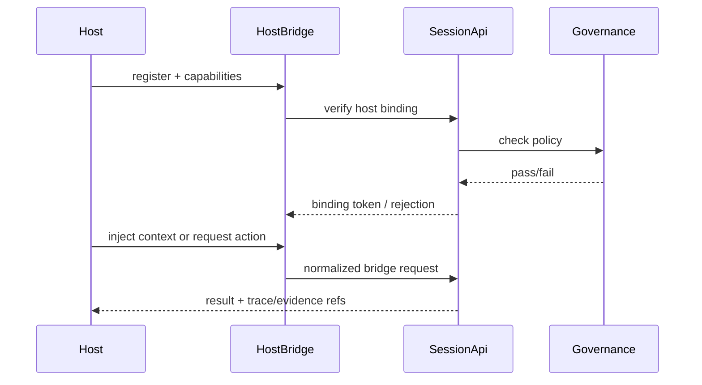

# D103: Host Bridge Integration Design

- Design ID: `D103`
- 状态: 草稿
- 日期: 2026-04-11
- 定位: 展开 `HostBridgeEntry` 作为 capability injection 层的集成设计。
- 关联文档:
  - `docs/design/D10-agent-team-workspace-designs.md`
  - `docs/features/F103-host-bridge-capability-injection.md`
  - `docs/features/F161-provider-authority-placement.md`
  - `docs/features/F154-cross-pack-bridge.md`

## 1. 设计目标

- 让现有工具可以注入 Garage 能力
- 保证 host 只扩展工作方式，不抢系统真相
- 维持 shared runtime、shared authority、shared governance

## 2. 设计问题

这份文档要解决的是：

- 已有工具如何接入 `Garage Team`
- 宿主层到底能注入什么
- 什么必须留在共享 runtime 真相内

## 3. 注入模型与边界

### 3.1 宿主可注入的内容

- 局部上下文
- 本地 UX affordances
- capability hints
- 与宿主工作流相关的触发入口

### 3.2 宿主不能拥有的内容

- provider / model authority
- pack truth
- session lifecycle truth
- growth / continuity truth
- workspace-first fact ownership

## 4. HostBridge 契约

| 接口 | 输入 | 输出 | 拒绝条件 |
| --- | --- | --- | --- |
| `RegisterHost` | `host_id`, `host_capabilities`, `bridge_version` | `host_binding_token`, `allowed_capabilities` | `unsupported_host`, `version_mismatch` |
| `InjectContext` | `session_id`, `context_payload`, `scope` | `context_ref`, `applied_fields` | `scope_violation`, `schema_invalid` |
| `RequestAction` | `session_id`, `action_hint`, `constraints` | `action_result`, `trace_ref` | `authority_violation`, `governance_gate_failed` |
| `GetBridgeStatus` | `host_binding_token` | `binding_status`, `policy_snapshot` | `binding_missing` |

## 5. 典型注入模式

这份设计默认承接三类宿主：

- `Claude`
- `OpenCode`
- `Cursor`

它们都应通过 shared host bridge seam 工作，而不是各自复制一套 runtime。

最小交互序列：

## 6. 失败与回退

宿主设计必须显式考虑：

- host hint 与 authority 冲突
- host 请求越过允许边界
- host 本地上下文无法映射到共享 runtime

这些都应回到共享错误语义，而不是在宿主内私自吞掉。

错误语义映射：

- `authority_violation`: 明确拒绝并返回可读 policy 原因。
- `schema_invalid`: 提供字段级错误，允许宿主修正后重试。
- `governance_gate_failed`: 返回 gate 名称和建议下一步，不允许宿主绕过。
- `binding_missing`: 要求宿主重新注册，禁止匿名注入。

## 7. 测试策略与验收锚点

- 边界测试: 宿主无法提交 authority 修改请求。
- 契约测试: `RegisterHost/InjectContext/RequestAction` 输入输出稳定。
- 兼容测试: Claude/OpenCode/Cursor 三类宿主均可绑定并调用。
- 失败测试: `schema_invalid`、`authority_violation`、`binding_missing` 可正确回传。
- 可追溯测试: 每次 `RequestAction` 都有 `trace_ref`。

验收锚点：

- `HB-A1`: HostBridge 仅注入能力，不持有 authority。
- `HB-A2`: 宿主失败路径可恢复，不吞错误。
- `HB-A3`: 三类宿主接入共享同一 runtime seam。

## 8. 非目标

- 不在本设计中定义某一宿主的全部 UX 细节
- 不把 HostBridge 设计成新的主产品入口
- 不让宿主注入演化成宿主真相

## 9. 设计完成标准

- HostBridge 作为 capability injection 的边界清楚
- `Claude/OpenCode/Cursor` 级别的接入模式清楚
- 下游 task 不需要再猜“宿主能做什么、不能做什么”
