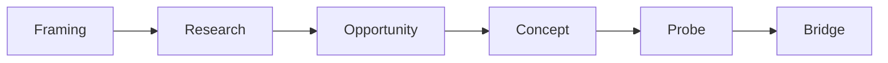
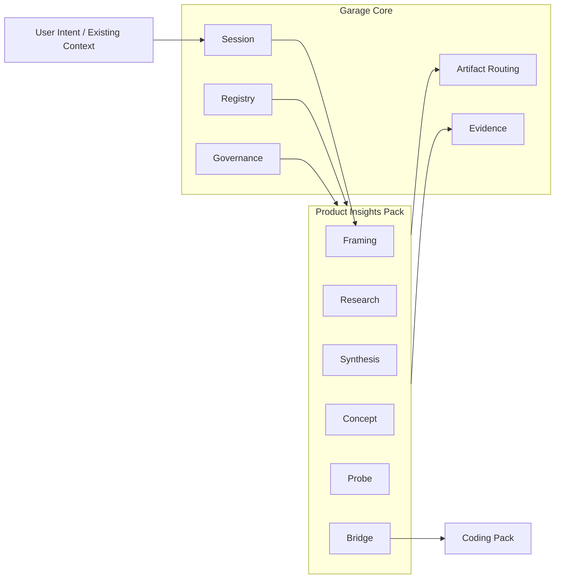
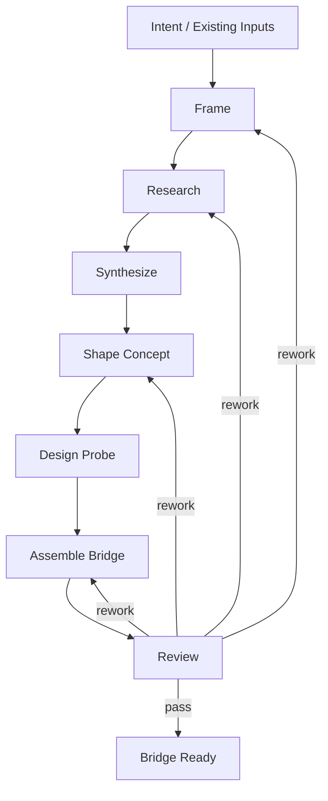

# D110: Garage Product Insights Pack Design

- Design ID: `D110`
- 状态: 草稿
- 日期: 2026-04-11
- 定位: 定义 `Garage` 在 phase 1 的 `Product Insights Pack` 设计，说明它为什么是 `reference pack`、它拥有哪些能力边界，以及它如何通过 `Garage Core` 与 shared contracts 参与平台协作。
- 当前阶段: phase 1
- 关联文档:
  - `docs/GARAGE.md`
  - `docs/features/F110-reference-packs.md`
  - `docs/features/F010-shared-contracts.md`
  - `docs/features/F050-governance-model.md`
  - `docs/features/F120-cross-pack-bridge.md`
  - `docs/features/F070-continuity-mapping-and-promotion.md`
  - `packs/product-insights/skills/README.md`

## 1. 文档目标与范围

这篇文档只回答一个问题：

**在 `Garage` phase 1 中，`Product Insights Pack` 应作为怎样的 `reference pack` 接入平台，既能保持自己的领域语义，又不把这些语义泄漏到 `Garage Core`。**

本文覆盖：

- pack mission
- 它为何是 reference pack
- `packId` / `displayName`
- 角色带宽
- 高层 node graph
- artifact taxonomy
- evidence model
- governance overlay
- 与 `Coding Pack` 的 bridge 出口

本文不覆盖：

- 具体 prompt
- 具体模板正文
- 详细 schema
- 具体实现脚本

## 2. Pack 身份

phase 1 建议先冻结：

- `packId = product-insights`
- `displayName = Product Insights Pack`

它是 `Garage` 上游认知型工作的 reference pack，负责把模糊方向收敛成可被后续 pack 消费的清晰问题、机会、概念、验证与 bridge 输出。

## 3. 为什么它是 reference pack

`Product Insights Pack` 被放进 phase 1，不是因为它只是“产品前置附件”，而是因为它能验证 `Garage` 是否真的能承接和 coding 非常不同的一类工作。

它的异质性体现在：

- 更偏判断与研究，而不是实现
- 更偏 framing、research、opportunity、concept、probe，而不是 spec / design / code
- 更依赖信号来源、假设质量与 bridge 完整性，而不是 verification 与 closeout

如果 `Garage` 能稳定承接这类 pack，再承接后续 `writing`、`video` 才有意义。

## 4. Pack mission

`Product Insights Pack` 的使命是：

- 把模糊方向重写成清晰问题
- 组织上游研究与信号整理
- 收敛优先机会与 concept direction
- 暴露关键假设并转成 probe
- 产出可交给下游 `Coding Pack` 的 bridge artifact

它回答的不是“怎么实现”，而是：

- 这件事值不值得做
- 应该先打哪个机会
- 为什么这么定义问题
- 当前有哪些关键未知项

## 5. 角色带宽

phase 1 不需要先冻结完整角色树，但建议先冻结角色带宽，也就是这个 pack 至少需要哪几类角色能力：

- `Framer`
  - 负责问题重写、目标对象、desired outcome、非目标
- `Researcher`
  - 负责信号收集、来源整理、替代品与模式观察
- `Mapper`
  - 负责 opportunity 收敛、concept 比较与 wedge 选择
- `Probe Designer`
  - 负责把危险未知项变成低成本验证计划
- `Bridge Synthesizer`
  - 负责把上游结果压缩为下游可消费输入

这些是 pack 内部角色语义，不应进入 `Garage Core`。

## 6. 高层 node graph

phase 1 的关键不是把图做复杂，而是冻结这条上游主链的大致形状。

每个节点都必须通过：

- artifact
- evidence
- governance overlay

与平台协作。

## 7. Artifact taxonomy

`Product Insights Pack` 的主要 artifact 应保持显式、可 handoff、可被下游消费。

phase 1 建议先冻结这些 artifact roles 的 pack-local 典型实例：

- `framing-brief`
- `insight-pack`
- `opportunity-map`
- `concept-brief`
- `probe-plan`
- `bridge-artifact`

这些对象在 pack 内部有领域语义，但对平台而言仍应通过中立 `artifactRole` 被路由和追踪。

## 8. Evidence model

`Product Insights Pack` 的 evidence 应优先记录：

- 来源与信号引用
- 判断依据
- 机会取舍原因
- 假设与 probe 结果
- bridge 形成过程与边界说明

phase 1 中，这个 pack 最关键的 evidence 不是“所有研究过程都保存”，而是：

- 让后续能够解释为什么当前方向被选中

## 9. Governance overlay

这个 pack 的治理重点应不同于 coding。

phase 1 建议先冻结下面这组 overlay 关注点：

- 来源可追溯性
- 假设是否显式
- 是否区分证据与推断
- bridge 是否足够完整
- 是否有未决关键未知项

换句话说，`Product Insights Pack` 的治理重点在于：

- 判断质量
- 输入质量
- handoff 质量

而不是实现质量本身。

## 10. 输入与输出边界

### 10.1 输入

它可接收的典型输入包括：

- 模糊想法
- 现有问题定义
- 外部材料
- 既有研究片段
- 创作者长期偏好与方向约束

### 10.2 输出

它最重要的输出不是“研究文档越多越好”，而是：

- 能形成明确的 bridge artifact
- 能带出关键 evidence
- 能把不确定性说清楚

## 11. 与 `Coding Pack` 的 bridge

`Product Insights Pack` 的下游出口，默认不是直接进入实现，而是先形成：

- `bridge artifact`
- `bridge evidence`

phase 1 中，这个 pack 的完成标准之一不是“已经想明白了一切”，而是：

**已经把下一步交给 `Coding Pack` 所需的清晰输入说清楚。**

bridge 之后如果 `Coding Pack` 认为：

- 输入不足
- 假设仍不清
- scope 边界不稳

就应允许回流，而不是强行继续实现。

## 12. 不应泄漏到 `Garage Core` 的内容

下面这些都属于 `Product Insights Pack` 自己拥有的领域语义，不应进入 `Garage Core`：

- `insight`
- `opportunity`
- `concept`
- `probe`
- 研究 heuristics
- 判断模板
- pack 内部角色组织方式
- pack 专属的 completion 语义

平台只理解：

- `pack`
- `role`
- `node`
- `artifact`
- `evidence`

## 13. Phase 1 边界

phase 1 里，这个 pack 只需要做到：

- 作为一个完整的上游 reference pack 接入 `Garage`
- 拥有稳定的 node graph 大形状
- 拥有可 handoff 的 artifact 与 evidence 面
- 能通过 bridge 把结果交给 `Coding Pack`

phase 1 不要求：

- 冻结全部角色树
- 做复杂市场系统
- 做自治研究系统
- 对所有内容领域都适配

## 14. 遵循的设计原则

- Pack 拥有领域语义：`Product Insights Pack` 自己解释上游研究与判断语言，不把这些词汇推回 core。
- 上游不等于附件：它是独立的 reference pack，不只是 coding 的前置材料收集器。
- Handoff by artifacts and evidence：交给下游的不是隐式上下文，而是显式 bridge artifact 与 bridge evidence。
- `Markdown-first`：上游判断结果与关键证据优先保持人类可读。
- `Contract-first`：先冻结 pack shape，再讨论 prompt 与模板细节。
- 判断与证据分离：研究结论不能脱离 evidence 独立存在。
- phase 1 克制：先证明 pack 能稳定接入平台，再扩展更复杂的研究自动化。
# Garage Product Insights Pack 设计

- 状态: 草稿
- 日期: 2026-04-11
- 定位: 定义 `Product Insights Pack` 在 `Garage` phase 1 中作为 `reference pack` 的架构级设计边界，说明它的使命、角色面、节点形状、工件面、证据面、治理覆盖层，以及它如何把上游洞察工作显式桥接到 `Coding Pack`。
- 当前阶段: phase 1
- 关联文档:
  - `docs/GARAGE.md`
  - `docs/architecture/A110-garage-extensible-architecture.md`
  - `docs/architecture/A120-garage-core-subsystems-architecture.md`
  - `docs/features/F010-shared-contracts.md`
  - `docs/features/F110-reference-packs.md`
  - `docs/features/F040-session-lifecycle-and-handoffs.md`
  - `docs/features/F050-governance-model.md`
  - `docs/features/F060-artifact-and-evidence-surface.md`
  - `docs/features/F020-shared-contract-schemas.md`

## 1. 文档目标与范围

这篇文档只回答一个问题：

**当 `Garage` 已经决定在 phase 1 先用两个 `reference packs` 验证平台中立性时，`Product Insights Pack` 应该以什么样的架构形状进入系统。**

本文覆盖：

- `Product Insights Pack` 的使命与平台位置
- 它为什么是 phase 1 的 `reference pack`
- `packId`、`displayName` 与稳定身份边界
- 它拥有的角色面与职责边界
- 它的高层 `node graph`
- 它的输入、输出与到 `Coding Pack` 的 `bridge`
- 它的 `artifact taxonomy`
- 它的 `evidence model`
- 它的 `governance overlay`
- 哪些内容必须留在 pack 内，不能泄漏到 `Garage Core`
- phase 1 应冻结什么，不做什么

本文不覆盖：

- prompt、模板和角色文案原文
- 精确目录结构、文件命名与最终 schema 字段全集
- 研究方法论细则、打分公式或完整评估 rubric
- 具体实现引擎、自动化调度器或服务化方案

这篇文档的目标，是先把 pack 级架构边界冻结下来，而不是提前展开实现细节。

## 2. `Product Insights Pack` 在 `Garage` 中的位置

`Garage Core` 只理解中立对象：

- `session`
- `pack`
- `role`
- `node`
- `artifact`
- `evidence`

`Product Insights Pack` 的职责，不是扩展一个新的核心子系统，而是在这组中立对象之上，承接一类上游认知型工作：

- 把模糊方向变成可讨论的问题
- 把分散信号变成可解释的洞察
- 把判断过程变成可追溯的工件和证据
- 把上游结果整理成可交给下游 `Coding Pack` 的 `bridge surface`

它在总体架构中的位置可以压缩成下面这张图：

这张图表达的是：

- `Product Insights Pack` 通过同一套 shared contracts 接入 `Garage Core`
- 它拥有自己的领域语义，但不改写 core 的中立语义
- 它的主要系统价值，在于为跨 pack 推进提供上游洞察和显式 `bridge`

## 3. Pack 使命

`Product Insights Pack` 的 pack 使命应先冻结为：

**把模糊问题、机会线索和外部信号，收敛成可解释、可验证、可交接的产品洞察资产，并输出能让下游 pack 继续推进的显式 `bridge artifact`。**

这个使命有 4 层含义：

### 3.1 它负责的是“问题与方向的收敛”

它面向的是：

- framing
- signal gathering
- synthesis
- opportunity judgment
- concept shaping
- probe planning

它不直接负责：

- 最终实现
- 仓库级代码改动
- 构建验证
- release closeout

### 3.2 它负责的是“可交接的洞察”，不是“泛研究附件”

`Product Insights Pack` 不是给 `Coding Pack` 提供一堆散乱背景材料。  
它必须形成：

- 结构化问题定义
- 关键判断依据
- 明确假设与未知项
- 可消费的 bridge 输出

### 3.3 它负责的是“架构级 bridge seam”

它的退出条件不只是“写完一篇研究文档”，而是：

- 下游 pack 可以读懂
- 下游 pack 可以继续推进
- 交接后不依赖隐式聊天上下文

### 3.4 它负责的是“洞察过程的可追溯性”

对于 phase 1，`Product Insights Pack` 不需要先成为重型研究平台，但它必须证明：

- 关键判断有来源
- 关键收敛有理由
- 关键交接有证据链

## 4. 为什么它是 phase 1 的 `reference pack`

`Product Insights Pack` 被选为 phase 1 的 `reference pack`，不是因为它只是 `Coding Pack` 的前置附件，而是因为它能验证一组 `Garage` 的核心判断。

### 4.1 它与 `Coding Pack` 足够不同

`Coding Pack` 更偏向下游构建型工作。  
`Product Insights Pack` 更偏向上游认知型工作。

两者差异体现在：

- 节点语义不同
- 工件形状不同
- 治理重点不同
- 证据类型不同

如果同一个 core contract 能同时承接这两类 pack，就更能证明平台中立成立。

### 4.2 它能验证“跨 pack handoff 依赖 artifact + evidence”

phase 1 最重要的一条跨 pack 主线就是：

- `product-insights -> coding`

这条主线是否成立，决定 `Garage` 是否真的能把“上游思考”变成“下游构建”，而不是继续依赖聊天记忆和人工转述。

### 4.3 它能证明 pack 不需要进入 core 才能拥有完整语义

`Product Insights Pack` 有自己的：

- 角色面
- 节点图
- artifact taxonomy
- evidence emphasis
- governance overlay

如果这些内容都能停留在 pack 层，而不反向污染 `Garage Core`，就说明 `open for extension, closed for modification` 在 phase 1 是可落的。

## 5. Pack 身份与稳定边界

为避免后续文档和 contract 漂移，建议先冻结下面这组身份：

| 字段 | 建议值 | 说明 |
| --- | --- | --- |
| `packId` | `product-insights` | 面向机器的稳定身份 |
| `displayName` | `Product Insights Pack` | 面向文档和界面的可读名称 |
| `primaryDirection` | `upstream-cognitive` | 说明它主要承接上游认知收敛 |
| `primaryDownstreamTarget` | `coding` | 默认桥接目标 pack |
| `primaryExit` | `bridge-ready` | pack 级主要退出状态 |

这一层只冻结稳定身份，不冻结所有未来字段。

还应同步冻结它的边界：

- 它拥有产品洞察语义
- 它拥有上游收敛节点
- 它拥有桥接下游的责任
- 它不拥有下游实现语义
- 它不改写 core 的中立 contract

## 6. 它拥有的角色面

phase 1 不要求立即冻结完整角色树，但应先冻结一组稳定的角色面，保证 `RoleContract` 可以落地。

建议的拥有角色如下：

| 角色面 | 主要职责 | 不负责什么 |
| --- | --- | --- |
| `framer` | 把模糊目标改写成可推进的问题、范围与约束 | 不负责最终方案实现 |
| `researcher` | 收集外部信号、来源、案例、对标和上下文 | 不负责直接做机会结论 |
| `synthesizer` | 从信号中提炼模式、洞察、冲突与假设 | 不负责最终桥接包装 |
| `concept-shaper` | 把洞察收敛成机会方向、概念与取舍 | 不负责下游 coding 设计 |
| `probe-designer` | 设计轻量验证路径、风险探针和待证伪问题 | 不负责真实实验执行平台 |
| `bridge-editor` | 把上游结果整理成下游可消费的 bridge artifact | 不负责下游实现拆解 |
| `insights-reviewer` | 复查问题定义、证据充分性和 bridge 完整性 | 不替代人的最终决策 |

这里冻结的是角色边界，而不是角色数量或 prompt 人设。

phase 1 可以允许：

- 一个 agent 承担多个角色面
- 同一个角色在不同节点重复参与
- pack 在后续文档里继续细化角色细节

但不应允许：

- 把这些角色边界直接写进 `Garage Core`
- 把 pack 角色误当成全平台固定组织架构

## 7. 高层 `node graph`

`Product Insights Pack` 需要有自己稳定的高层节点图，但 phase 1 只冻结主链和关键回路，不冻结完整编排实现。

建议先冻结下面这条高层主链：

这条图表示的是协作边界，而不是调度引擎。

每个节点大致承担：

- `Frame`：明确问题、目标、范围、约束和目标用户语境
- `Research`：整理外部信号、来源和相关背景
- `Synthesize`：提炼关键模式、假设、张力和洞察
- `Shape Concept`：形成方向、机会判断和概念收敛
- `Design Probe`：明确最关键的验证点、风险和待证伪问题
- `Assemble Bridge`：把上游结果包装成下游可消费的交接面
- `Review`：判断是否达到 `bridge-ready`

phase 1 关键点不是节点很多，而是：

- 节点意图清楚
- 输入输出清楚
- 回退语义清楚
- 交接语义清楚

## 8. 输入、输出与到 `Coding Pack` 的 `bridge`

### 8.1 主要输入

`Product Insights Pack` 的输入应主要来自 4 个面：

| 输入面 | 典型内容 | 说明 |
| --- | --- | --- |
| 用户意图面 | 模糊想法、目标、问题、抱怨、方向感 | pack 的原始入口 |
| 现有上下文面 | 已有 `artifact`、历史 `evidence`、相关 `session` 摘要 | 避免从零重做 |
| 长期连续性面 | 已知事实、长期偏好、约束、已有 `skill` | 由 continuity 相关文档约束 |
| 外部信号面 | 研究来源、案例、对标、观察、市场线索 | 作为判断的基础材料 |

### 8.2 主要输出

`Product Insights Pack` 的输出不应只是一篇泛文档，而应至少形成这几类可引用结果：

- 当前有效的洞察类主工件
- 关键判断对应的证据记录
- 未决问题与风险说明
- 面向下游 `Coding Pack` 的 `bridge artifact`

### 8.3 到 `Coding Pack` 的 bridge 最小责任面

根据 `session lifecycle` 文档，跨 pack handoff 必须优先通过显式 `artifact + evidence` 完成。  
因此 `Product Insights Pack` 输出给 `Coding Pack` 的 `bridge surface` 至少应包含：

- 问题定义与目标边界
- 目标用户或场景语境
- 关键洞察与判断依据
- 已选择的概念方向或机会取舍
- 假设、未知项与风险
- 建议的 probe 或后续验证重点
- 范围说明与 acceptance hints
- 相关主工件与关键证据指针

`Coding Pack` 不直接消费上游 pack 的内部节点状态，而是消费这个 `bridge surface`，再通过自己的 `PackManifest`、`WorkflowNodeContract` 和 `ArtifactContract` 重新映射成构建语义。

## 9. `artifact taxonomy`

`Product Insights Pack` 需要有自己的工件分类，但这些工件都应通过 shared contracts 映射到 core 可理解的中立 `artifactRole`，而不是让 core 理解 pack 术语。

phase 1 建议先冻结下面 6 类工件面：

| 工件类 | 主要作用 | 对下游的价值 |
| --- | --- | --- |
| `framing artifacts` | 固化问题、目标、范围、约束和语境 | 让后续工作有稳定问题边界 |
| `signal artifacts` | 汇总来源、案例、样本、对标和观察 | 提供外部信号基础 |
| `synthesis artifacts` | 表达模式、洞察、假设、冲突和解释 | 让判断过程可追溯 |
| `decision artifacts` | 固化机会判断、概念收敛和取舍说明 | 让方向选择可讨论 |
| `probe artifacts` | 表达验证路径、关键疑问和高风险假设 | 让下游知道哪些点不能被误当确定事实 |
| `bridge artifacts` | 作为跨 pack handoff 的正式交接面 | 让 `Coding Pack` 可以启动自己的入口节点 |

这 6 类工件面表达的是 pack 级 taxonomy，而不是最终文件名或 schema 字段。

对 phase 1，更重要的是冻结下面几条判断：

- `bridge artifact` 是正式工件，不是聊天摘要
- `signal artifacts` 与 `evidence` 相关，但不等于 `evidence`
- `decision artifacts` 应保留为什么做出该判断
- pack 工件仍然落在 `Garage` 的 canonical surface 上，而不是自造顶层目录宇宙

## 10. `evidence model`

`Product Insights Pack` 的证据重点，和 `Coding Pack` 不同。

它更强调回答下面这些问题：

- 这个判断基于哪些来源
- 为什么从这些信号中得出这个洞察
- 哪些地方仍然是推测，不是事实
- 为什么这个 bridge 已足够交给下游继续推进

phase 1 建议把它的证据面先压缩成 5 类：

| 证据类 | 主要回答的问题 | 典型关联对象 |
| --- | --- | --- |
| `source evidence` | 信号来自哪里、可信度如何 | 外部来源、研究输入 |
| `synthesis evidence` | 洞察如何从信号中被提炼出来 | `signal artifacts`、`synthesis artifacts` |
| `decision evidence` | 为什么选择这个方向而不是别的方向 | `decision artifacts` |
| `review evidence` | 当前输出是否达到继续推进条件 | `review` 节点、gate 结果 |
| `bridge evidence` | 为什么这个 handoff 对下游已经足够 | `bridge artifacts`、目标 pack |

`Product Insights Pack` 的 `evidence model` 应遵循 shared contract 的最小关系语义：

- 关联当前 `session`
- 关联当前 `node`
- 关联相关 `artifact`
- 记录 `verdict` 或 `outcome`
- 形成可追溯的 `lineage`

phase 1 不要求把它做成分析平台，只要求做到：

- 人能读
- 系统能指向
- 下游能理解
- 后续能复查

## 11. `governance overlay`

`Garage Core` 提供的是统一治理语汇。  
`Product Insights Pack` 需要在这个基础上叠加自己的治理重点，而不是另造一套治理系统。

它的治理 overlay 应主要回答：

- 问题是否已经足够清楚
- 研究信号是否足以支持当前判断
- 假设与事实是否被明确区分
- bridge 是否已经满足下游继续推进的最低条件

phase 1 建议先冻结 4 类 pack 级治理重点：

| 治理重点 | 关注的问题 | 典型作用点 |
| --- | --- | --- |
| `framing quality` | 问题、目标、范围和约束是否清楚 | `Frame` 节点前后 |
| `evidence sufficiency` | 当前信号是否足够支撑洞察和选择 | `Research`、`Synthesize`、`Concept` |
| `assumption labeling` | 哪些是事实，哪些是假设，哪些仍未知 | `Synthesize`、`Probe`、`Bridge` |
| `bridge completeness` | 下游继续推进所需的最小输入是否齐备 | `Bridge`、`Review` |

在表达方式上，它应遵守统一的：

- `global`
- `core`
- `pack`
- `node`

四层治理覆盖关系。

也就是说：

- 平台定义中立 gate 语汇
- pack 定义自己的质量重点
- 节点只补充该节点特有的通过条件

## 12. 哪些内容必须留在 pack 内，不能泄漏到 `Garage Core`

为了保证平台中立，下面这些东西必须明确停留在 `Product Insights Pack` 内部：

### 12.1 领域名词本身

例如：

- `insight`
- `opportunity`
- `concept`
- `probe`
- `bridge brief`

这些术语可以存在于 pack 文档和 pack 工件里，但不应成为 `Garage Core` 的原生对象。

### 12.2 pack 专属的方法论

例如：

- 信号筛选 heuristics
- 洞察打分方式
- 概念判断 rubric
- 假设优先级方法

这些属于 pack 级方法，不属于 core 级 contract。

### 12.3 pack 自己的角色组织方式

例如：

- 哪些角色必须存在
- 哪些角色可以合并
- 哪个角色主导哪个节点

这应由 `RoleContract` 和 pack 文档表达，而不是由 core 写死。

### 12.4 pack 专属的完成语义

例如：

- 什么叫“洞察足够好”
- 什么叫“bridge 足够完整”
- 什么叫“概念已经收敛”

这些都属于 pack 的治理 overlay，而不是 core 的普遍真理。

## 13. Phase 1 边界

phase 1 对 `Product Insights Pack` 应保持克制。

当前阶段先冻结这些东西：

- 稳定 `packId` 与 `displayName`
- 高层角色面与职责边界
- 高层节点主链与回退语义
- 输入 / 输出面与 `product-insights -> coding` 的 `bridge seam`
- pack 级 `artifact taxonomy`
- pack 级 `evidence model`
- pack 级 `governance overlay`

当前阶段不做这些事：

- 不做完整研究平台或数据采集平台
- 不做自动化市场分析流水线
- 不做复杂定量打分系统
- 不做多组织、多租户、多审批流模型
- 不做 pack marketplace 或远程动态发现
- 不做脱离文件面的重型服务化控制面
- 不把 `Product Insights Pack` 的术语写进 `Garage Core`

phase 1 的成功标准不是它能研究多少东西，而是：

- 它能以 pack 的形式稳定接入 `Garage`
- 它能产出结构化工件和证据
- 它能把结果显式桥接给 `Coding Pack`
- 它能证明上游认知型能力不需要污染 core 也能成立

## 14. 遵循的设计原则

- 平台中立：`Garage Core` 只理解中立对象，不理解 `Product Insights Pack` 的领域名词。
- Pack 拥有领域语义：上游洞察语义、方法论、评审重点和完成语义都留在 pack 内。
- `Contract-first`：先冻结身份、角色面、节点边界、工件面和证据面，再谈实现。
- Handoff by artifacts and evidence：跨 pack 推进优先依赖显式工件与证据，而不是隐式聊天上下文。
- `Bridge` 是正式输出：面向 `Coding Pack` 的 bridge 应被视为一等工件，而不是附带说明。
- Governance overlay 明确分层：核心治理只定义中立语汇，pack 负责叠加自己的质量要求。
- `Markdown-first` / `file-backed`：phase 1 优先保证人可读、可落盘、可追溯。
- Session 不越权：`session` 负责协调与恢复，不替代正式 `artifact`、`evidence` 或 pack 文档。
- 开闭原则：新增 pack 优先通过注册和映射扩展，而不是修改核心分支。
- phase 1 克制：先把 `Product Insights Pack` 的架构形状写稳，再决定是否需要更重实现。
