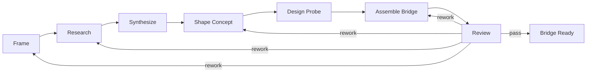

# D110: Garage Product Insights Pack Design

- Design ID: `D110`
- 状态: 草稿
- 日期: 2026-04-11
- 定位: 定义 `Product Insights Pack` 在 `Garage` 完整架构中的详细设计边界，说明它如何以 `reference pack` 身份接入平台，如何通过 artifacts、evidence 与 bridge 参与协作，以及它如何在治理下贡献 `memory / skill / runtime update` 候选。
- 当前阶段: 完整架构主线，当前实施仍使用第一组 reference-pack delivery slice
- 关联文档:
  - `docs/GARAGE.md`
  - `docs/architecture/A130-garage-continuity-memory-skill-architecture.md`
  - `docs/features/F010-shared-contracts.md`
  - `docs/features/F050-governance-model.md`
  - `docs/features/F070-continuity-mapping-and-promotion.md`
  - `docs/features/F080-garage-self-evolving-learning-loop.md`
  - `docs/features/F110-reference-packs.md`
  - `docs/features/F120-cross-pack-bridge.md`
  - `docs/design/D120-garage-coding-pack-design.md`
  - `packs/product-insights/skills/README.md`

## 1. 文档目标与范围

这篇文档只回答一个问题：

**`Product Insights Pack` 应该以什么样的设计形状进入 `Garage`，才能既保留自己的领域语义、桥接价值和成长价值，又不把这些语义泄漏到 `Garage Core`。**

本文覆盖：

- pack mission 与平台位置
- 稳定身份、角色带宽与高层节点图
- artifact taxonomy、evidence model 与 bridge 输出
- pack-specific governance overlay
- 它如何进入主动成长 loop

本文不覆盖：

- 具体 prompt 文案
- 具体模板正文
- 详细 schema 字段
- 自动化研究引擎实现细节

## 2. Pack 使命与平台位置

`Product Insights Pack` 是 `Garage` 中负责上游认知收敛的 `reference pack`。

它的核心使命是：

- 把模糊方向重写成清晰问题
- 把外部信号和内部判断收敛成可解释的洞察
- 把洞察结果组织成可 handoff 的 bridge 输出
- 把关键判断和关键未知项显式化，而不是留在聊天上下文里

它在平台中的作用不是“提供一堆研究材料”，而是：

**把上游思考变成下游 pack 可以继续消费的结构化工件、证据和交接面。**

## 3. 为什么它是 `reference pack`

`Product Insights Pack` 被放进当前主线，不是因为它只是 `Coding Pack` 的前置附件，而是因为它能验证 `Garage` 的三个关键判断：

1. 平台能否承接与 coding 明显不同的工作类型。
2. 上游认知型工作能否通过 artifacts、evidence 与 governance 显式运行。
3. 跨 pack handoff 能否依赖 `artifact + evidence`，而不是依赖隐式聊天上下文。

如果 `Garage` 只能承接 coding，就还不能证明自己是一个长期 `Creator OS Runtime`。

## 4. 稳定身份与边界

建议先冻结下面这组最小身份：

| 字段 | 值 | 说明 |
| --- | --- | --- |
| `packId` | `product-insights` | 机器稳定身份 |
| `displayName` | `Product Insights Pack` | 面向文档与界面的显示名 |
| `primaryDirection` | `upstream-cognitive` | 主要承接上游认知收敛 |
| `primaryExit` | `bridge-ready` | 主要退出状态是交接准备完成 |
| `primaryDownstreamTarget` | `coding` | 默认桥接目标 |

它的稳定边界应是：

- 它拥有上游洞察语义
- 它拥有研究、判断、probe 和 bridge 的 pack-local 语义
- 它不拥有下游实现语义
- 它不改写 core 的中立对象

## 5. 角色带宽

`Product Insights Pack` 不需要先冻结完整角色树，但应冻结一组稳定的角色带宽：

| 角色带宽 | 主要职责 | 不负责什么 |
| --- | --- | --- |
| `Framer` | 把模糊目标改写成可推进的问题、范围与约束 | 不负责最终实现 |
| `Researcher` | 收集外部信号、来源、样本、案例与背景 | 不负责最后方向拍板 |
| `Synthesizer` | 提炼模式、洞察、张力、假设与解释 | 不负责最终 bridge 包装 |
| `Concept Shaper` | 把洞察收敛成方向、机会与概念判断 | 不负责下游 coding 设计 |
| `Probe Designer` | 设计低成本验证路径和关键待证伪问题 | 不负责实验平台本身 |
| `Bridge Editor` | 把上游结果整理成下游可消费的交接面 | 不负责下游实现拆解 |
| `Insights Reviewer` | 复查问题定义、证据充分性和 bridge 完整性 | 不替代人的最终决策 |

这些是 pack-local 责任带宽，不应成为 `Garage Core` 的固定角色词表。

## 6. 高层节点图

这条主链表达的是协作边界，而不是调度引擎实现。

关键判断是：

- 每个节点都要有显式输入输出
- 每个节点都可以产出 evidence
- 每个节点都可能贡献成长候选
- `Review` 负责判断是否达到 `bridge-ready`

## 7. 输入、输出与 bridge

### 7.1 主要输入

`Product Insights Pack` 的输入应主要来自下面 4 个面：

- 用户意图与模糊问题
- 已有 artifacts、历史 evidence 与 session 摘要
- 长期 `memory` 与既有 `skill`
- 外部信号、来源和案例材料

### 7.2 主要输出

它的主要输出不应只是一篇泛研究文档，而应至少形成：

- 当前有效的洞察类主工件
- 关键判断对应的 evidence
- 未决问题与风险说明
- 面向下游 `Coding Pack` 的 `bridge artifact`

### 7.3 bridge 的最小责任面

面向 `Coding Pack` 的 `bridge surface` 至少应包含：

- 问题定义与目标边界
- 场景语境或目标对象
- 关键洞察与判断依据
- 已选择方向与取舍理由
- 假设、未知项与风险
- 推荐的 probe 或验证重点
- 相关主工件与关键 evidence 指针

如果这些内容不足，`Coding Pack` 应允许回流，而不是被迫继续实现。

## 8. Artifact Taxonomy

`Product Insights Pack` 需要有自己的 artifact taxonomy，但这些工件都应通过 shared contracts 映射到 core 可理解的中立 `artifactRole`。

建议先冻结下面 6 类 artifact family：

| artifact family | 主要作用 | 典型下游价值 |
| --- | --- | --- |
| `framing artifacts` | 固化问题、目标、范围、约束和语境 | 让后续工作有稳定问题边界 |
| `signal artifacts` | 汇总来源、案例、样本和观察 | 提供外部信号基础 |
| `synthesis artifacts` | 表达模式、洞察、假设、冲突和解释 | 让判断过程可追溯 |
| `decision artifacts` | 固化机会判断、概念收敛和取舍说明 | 让方向选择可讨论 |
| `probe artifacts` | 表达验证路径、关键疑问和高风险假设 | 让未知项显式化 |
| `bridge artifacts` | 作为跨 pack handoff 的正式交接面 | 让 `Coding Pack` 可以启动自己的主链 |

这里要特别冻结 3 个判断：

- `bridge artifact` 是正式工件，不是聊天摘要
- `signal artifacts` 与 `evidence` 相关，但不等于 `evidence`
- pack 工件仍然落在 `Garage` 的 canonical surfaces 上，而不是自造顶层目录宇宙

## 9. Evidence Model And Growth Semantics

### 9.1 evidence 重点

`Product Insights Pack` 的 evidence 更强调回答下面这些问题：

- 这个判断基于哪些来源
- 为什么从这些信号中得出这个洞察
- 哪些地方仍然是推测，而不是事实
- 为什么这个 bridge 已足够交给下游继续推进

建议先冻结下面几类 evidence：

- `source evidence`
- `synthesis evidence`
- `decision evidence`
- `review evidence`
- `bridge evidence`

### 9.2 它如何进入 growth loop

`Product Insights Pack` 是主动成长 loop 的参与者，而不是旁观者。

它可以贡献下面 3 类长期更新候选：

| 候选类型 | 典型内容 | 进入路径 |
| --- | --- | --- |
| `memory` 候选 | 长期问题域偏好、稳定目标约束、反复确认的判断标准 | `evidence -> GrowthProposal -> memory` |
| `skill` 候选 | framing 方法、研究套路、probe 设计方法、bridge 整理方法 | `evidence -> GrowthProposal -> skill` |
| `runtime update` 候选 | probe checklist、bridge completeness 规则、来源记录 discipline | `evidence -> GrowthProposal -> runtime update` |

### 9.3 高风险误晋升

下面这些内容默认不应被误固化为长期更新：

- 一次性市场观察
- 尚未验证的机会猜测
- 当前 session 才成立的临时 framing
- 缺少来源支撑的直觉判断

## 10. Governance Overlay

`Product Insights Pack` 的治理重点应明显不同于 `Coding Pack`。

它的治理 overlay 至少应回答：

- 问题是否已经足够清楚
- 研究信号是否足以支持当前判断
- 假设与事实是否被明确区分
- bridge 是否已经满足下游继续推进的最低条件

建议先冻结 4 类 pack 级治理重点：

- `framing quality`
- `evidence sufficiency`
- `assumption labeling`
- `bridge completeness`

## 11. 哪些内容必须留在 pack 内

为了保持平台中立，下面这些内容必须停留在 `Product Insights Pack` 内部：

- `insight`
- `opportunity`
- `concept`
- `probe`
- 研究 heuristics
- pack 专属判断模板
- pack 内部角色组织方式
- pack 专属 completion 语义

平台只理解中立对象，不理解这些领域词本身。

## 12. 当前实施切片的边界

当前 implementation slice 先冻结这些东西：

- 稳定 `packId` 与 `displayName`
- 角色带宽与职责边界
- 高层节点主链与回退语义
- 输入 / 输出面与 `product-insights -> coding` 的 bridge seam
- pack 级 artifact taxonomy
- pack 级 evidence model
- pack 级 governance overlay
- growth candidates 的候选类型与禁止误晋升边界

当前 implementation slice 不要求：

- 完整研究平台或数据采集平台
- 自动化市场分析流水线
- 复杂定量打分系统
- 多组织、多租户、多审批流模型
- 远程 pack marketplace

## 13. 遵循的设计原则

- Pack 拥有领域语义：上游洞察语义、方法论、评审重点和完成语义都留在 pack 内。
- Handoff by artifacts and evidence：交给下游的不是隐式上下文，而是显式 bridge artifact 与 bridge evidence。
- Evidence before growth：长期更新候选必须先经过 evidence 与 proposal，而不是从原始 session 直接固化。
- Workspace-first growth：成长候选默认先服务当前 workspace，而不是直接做全局共享。
- `Contract-first`：先冻结身份、角色面、节点边界、工件面和证据面，再谈实现。
- `Markdown-first` / `file-backed`：优先保证人可读、可落盘、可追溯。
- Open for extension, closed for modification：新增 pack 时优先通过注册和映射扩展，而不是修改 core。
