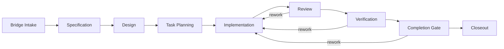

# D120: Garage Coding Pack Design

- Design ID: `D120`
- 状态: 草稿
- 日期: 2026-04-11
- 定位: 定义 `Coding Pack` 在 `Garage` 完整架构中的详细设计边界，说明它如何以 `reference pack` 身份接入平台，如何通过 review、verification、closeout 形成可追溯的构建链，以及它如何在治理下贡献 `memory / skill / runtime update` 候选。
- 当前阶段: 完整架构主线，当前实施仍使用第一组 reference-pack delivery slice
- 关联文档:
  - `docs/GARAGE.md`
  - `docs/architecture/A130-garage-continuity-memory-skill-architecture.md`
  - `docs/features/F010-shared-contracts.md`
  - `docs/features/F050-governance-model.md`
  - `docs/features/F070-continuity-mapping-and-promotion.md`
  - `docs/features/F080-garage-self-evolving-learning-loop.md`
  - `docs/features/F110-reference-packs.md`
  - `docs/features/F120-cross-pack-bridge.md`
  - `docs/design/D110-garage-product-insights-pack-design.md`
  - `packs/coding/skills/README.md`

## 1. 文档目标与范围

这篇文档只回答一个问题：

**`Coding Pack` 应该以什么样的设计形状进入 `Garage`，才能既承接真实的构建型工作、质量门禁和 closeout 语义，又不把这些语义泄漏到 `Garage Core`。**

本文覆盖：

- pack mission 与平台位置
- 稳定身份、角色带宽与高层节点图
- artifact taxonomy、evidence model 与 closeout 语义
- pack-specific governance overlay
- 它如何消费 bridge 输入并进入主动成长 loop

本文不覆盖：

- 具体 prompt 文案
- 具体模板正文
- 详细 schema 字段
- 某个具体仓库、语言或框架的实现策略

## 2. Pack 使命与平台位置

`Coding Pack` 是 `Garage` 中负责下游构建与交付的 `reference pack`。

它的核心使命是：

- 把显式输入或 bridge artifact 转成稳定的构建主链
- 把实现活动组织成 `spec -> design -> tasks -> implementation -> review -> verification -> closeout`
- 让 review、verification 和 closeout 成为显式主链，而不是隐式状态
- 把结果写成可追溯、可恢复、可归档的 artifacts 与 evidence

它的本体不是单纯“自动写代码”，而是：

**一个带显式质量门禁、显式证据链和显式收尾语义的构建型协作 pack。**

## 3. 为什么它是 `reference pack`

`Coding Pack` 被放进当前主线，是因为它能验证 `Garage` 是否具备下面这些能力：

1. 能否承接从上游 bridge 到下游交付的完整主链。
2. 能否在实现工作里保持 review、verification 与 closeout 的显式语义。
3. 能否在不让 core 理解语言、框架和仓库细节的前提下承接真实构建任务。

相对 `Product Insights Pack` 而言：

- `Product Insights Pack` 更偏上游认知收敛
- `Coding Pack` 更偏下游构建交付

两者共同证明的是：`Garage` 不只是能想清楚，也能真的把事情做出来并收尾。

## 4. 稳定身份与边界

建议先冻结下面这组最小身份：

| 字段 | 值 | 说明 |
| --- | --- | --- |
| `packId` | `coding` | 机器稳定身份 |
| `displayName` | `Coding Pack` | 面向文档与界面的显示名 |
| `packKind` | `build-oriented` | 表示它主要承接构建型工作 |
| `primaryOutcome` | `validated implementation outcomes` | 目标是形成经过验证的实现结果 |
| `entryPosture` | `bridge or scoped request in` | 入口是显式 bridge 或已收敛请求 |
| `exitPosture` | `closeout-ready package out` | 退出是可收尾、可归档、可恢复的结果包 |

它的稳定边界应是：

- 它拥有构建、review、verification、closeout 的 pack-local 语义
- 它不拥有上游问题定义语义
- 它不改写 core 的中立对象
- 它不要求 core 学会理解语言、框架和仓库术语

## 5. 角色带宽

`Coding Pack` 不需要先冻结完整角色树，但应冻结一组稳定的角色带宽：

| 角色带宽 | 主要职责 | 不负责什么 |
| --- | --- | --- |
| `Specifier` | 把问题、范围、约束和验收条件写成可评审规格 | 不负责最终实现 |
| `Designer` | 把规格转成方案、结构与关键取舍 | 不负责实际编码落地 |
| `Planner` | 把方案拆成可执行任务与推进顺序 | 不负责 review 或 verification 裁决 |
| `Implementer` | 推进实际变更，维护实现中的上下文和交接面 | 不负责最终质量裁决 |
| `Reviewer` | 复查正确性、风险、可维护性和回归风险 | 不替代人的最终审批 |
| `Verifier` | 形成测试、验证与回归判断 | 不定义业务方向本身 |
| `Closer` | 组织 closeout、剩余事项与归档交接 | 不负责重写实现历史 |

这些是 pack-local 责任带宽，不应成为平台固定角色词表。

## 6. 高层节点图

这条主链表达的是协作边界，而不是调度引擎实现。

关键判断是：

- `Review`、`Verification`、`Closeout` 不能隐藏在隐式状态里
- 每个节点都要有显式输入输出
- 每个节点都可以产出 evidence
- 实现失败、验证失败或 gate 不通过时，应允许显式回流

## 7. 接受的输入与 bridge 消费

### 7.1 accepted inputs

`Coding Pack` 不应接受“任意上下文碰巧还在”的隐式输入。

建议先冻结下面 4 类 accepted inputs：

- `spec bridge`
- scoped creator request
- maintenance / hotfix brief
- resumed in-pack handoff

### 7.2 它如何消费 `Product Insights Pack` 的 bridge

来自 `Product Insights Pack` 的 bridge 至少应提供：

- 问题定义与目标边界
- 场景语境或目标对象
- 已选择方向与取舍理由
- 假设、未知项与风险
- 相关主工件与关键 evidence 指针

如果这些内容不足，`Coding Pack` 应显式产出：

- `needs-clarification`
- `needs-rework-upstream`

而不是强行进入实现。

## 8. Artifact Taxonomy

`Coding Pack` 的 artifact taxonomy 不应只理解“代码文件”，而应覆盖从输入桥接到最终收尾的整个构建链。

建议先按 5 类 artifact family 理解它：

| artifact family | 主要作用 | 对 core 的中立视图 |
| --- | --- | --- |
| 输入桥接类 | 把外部需求转成可进入 coding 主链的输入 | input artifact |
| 方案定义类 | 承载“要做什么、怎么做、先做什么” | planning artifact |
| 交付实现类 | 承载实际实现结果 | delivery artifact |
| 质量控制类 | 承载复查、验证与完成性判断 | quality artifact |
| 收尾归档类 | 承载本轮工作如何离开 active 主链 | closeout artifact |

这里需要特别区分：

- 主控制面工件，例如 `spec`、`design`、`tasks`、`review record`、`verification record`、`closeout pack`
- 交付面工件，例如代码、测试、配置和脚本文改动

平台只需要知道它们的 artifact family、关系和 lineage，不需要理解编程语言本身。

## 9. Evidence Model And Growth Semantics

### 9.1 evidence 重点

`Coding Pack` 的 evidence 要回答的不是“系统做过什么”，而是：

- 为什么可以继续推进
- 为什么可以判定通过或失败
- 为什么可以 closeout
- 为什么某个结果仍需返工

建议先冻结下面几类 evidence：

- `bridge-lineage`
- `scope-decision`
- `review-verdict`
- `verification-result`
- `gate-decision`
- `closeout-record`
- `exception-record`

### 9.2 它如何进入 growth loop

`Coding Pack` 同样是主动成长 loop 的参与者。

它可以贡献下面 3 类长期更新候选：

| 候选类型 | 典型内容 | 进入路径 |
| --- | --- | --- |
| `memory` 候选 | 长期工程约束、仓库偏好、稳定环境事实、质量倾向 | `evidence -> GrowthProposal -> memory` |
| `skill` 候选 | review 方法、verification 模板、closeout 方法、实现流程套路 | `evidence -> GrowthProposal -> skill` |
| `runtime update` 候选 | review checklist、handoff discipline、closeout policy、prompt / rule patch 建议 | `evidence -> GrowthProposal -> runtime update` |

### 9.3 高风险误晋升

下面这些内容默认不应被误固化为长期更新：

- 单次修复中的临时绕路
- repo 状态特有的临时 workaround
- 未完成验证的实现路径
- 宿主偶然性的 debug 步骤

## 10. Governance Overlay

`Coding Pack` 的治理重点应明显不同于 `Product Insights Pack`。

它至少应回答：

- 输入是否足以进入 coding 主链
- 规格与实现边界是否一致
- 是否完成必要 review
- 是否已有足够 verification
- 是否满足 closeout 条件

建议先冻结 5 类 pack 级治理面：

- `input completeness`
- `authoring review`
- `implementation safety`
- `verification sufficiency`
- `closeout readiness`

## 11. Closeout 语义

在 `Coding Pack` 里，`closeout` 不等于“代码写完”，也不等于“已经发布”。

它表示的是：

**这轮构建型工作已经达到了可以离开 active coding 主链的状态，并且后续任何人或任何 pack 都能通过 artifacts 与 evidence 理解它为什么结束、结束在什么状态。**

建议至少区分 3 类高层 outcome：

- `accepted-complete`
- `accepted-with-followups`
- `returned-to-active-work`

这里最关键的判断是：

- `closeout` 是 pack-local 的完成语义
- `archive` 是 core 更中立的后续能力

## 12. 哪些内容必须留在 pack 内

为了保持平台中立，下面这些内容必须停留在 `Coding Pack` 内部：

- `spec`
- `design`
- `tasks`
- `code review`
- `verification`
- `completion gate`
- `closeout`
- 任意编程语言、框架、仓库结构、测试栈与 CI 工具假设
- 分支策略、worktree 策略、热修流程、TDD 偏好等 pack-local workflow 语义

平台只理解这些内容对应的：

- nodes
- artifact families
- evidence records
- gate / approval / archive 结果

## 13. 当前实施切片的边界

当前 implementation slice 先冻结这些东西：

- `packId` 与 `displayName`
- 角色带宽，而不是完整角色树
- 高层节点图，而不是完整执行引擎
- artifact families，而不是完整目录与文件清单
- evidence types，而不是完整 schema 字段全集
- governance overlay 的类别，而不是每个仓库的具体规则
- accepted bridge inputs 的边界
- `closeout` 的高层语义
- growth candidates 的候选类型与禁止误晋升边界

当前 implementation slice 不要求：

- 完整通用软件工厂
- 全语言 / 全框架支持
- 复杂自治编码体系
- 跨仓库、多项目、多执行器的重型编排系统
- 远程工具市场或 provider marketplace

## 14. 遵循的设计原则

- Pack 拥有领域语义：构建链、角色、工件和完成语义都留在 pack 内。
- Handoff by artifacts and evidence：跨 pack 交接优先通过显式工件与证据，而不是依赖聊天记忆。
- Evidence before growth：长期更新候选必须先经过 evidence 与 proposal，而不是从原始 session 直接固化。
- Workspace-first growth：成长候选默认先服务当前 workspace，而不是直接做全局共享。
- Review / verification / closeout 显式化：关键质量与完成节点必须进入显式主链。
- `Contract-first`：先冻结接入形状和边界，再讨论具体 skills、模板和实现工具。
- `Markdown-first` / `file-backed`：优先保证人可读、可落盘、可追溯。
- Open for extension, closed for modification：未来新增 pack 时，优先通过 pack 扩展，而不是修改 core 来适配 coding 语义。
