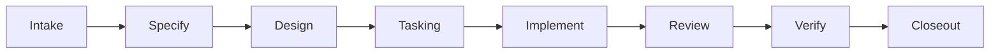

# D120: Garage Coding Pack Design

- Design ID: `D120`
- 状态: 草稿
- 日期: 2026-04-11
- 定位: 定义 `Garage` 在 phase 1 的 `Coding Pack` 设计，说明它为什么是 `reference pack`、它拥有哪些能力边界，以及它如何通过 `Garage Core` 与 shared contracts 参与平台协作。
- 当前阶段: phase 1
- 关联文档:
  - `docs/GARAGE.md`
  - `docs/features/F110-reference-packs.md`
  - `docs/features/F010-shared-contracts.md`
  - `docs/features/F050-governance-model.md`
  - `docs/features/F120-cross-pack-bridge.md`
  - `docs/features/F070-continuity-mapping-and-promotion.md`
  - `packs/coding/skills/README.md`

## 1. 文档目标与范围

这篇文档只回答一个问题：

**在 `Garage` phase 1 中，`Coding Pack` 应作为怎样的 `reference pack` 接入平台，既能保持自己的构建语义，又不把这些语义泄漏到 `Garage Core`。**

本文覆盖：

- pack mission
- 它为何是 reference pack
- `packId` / `displayName`
- 角色带宽
- 高层 node graph
- artifact taxonomy
- evidence model
- governance overlay
- 它如何消费来自 `Product Insights Pack` 的 bridge 输入
- closeout 语义

本文不覆盖：

- 具体 prompt
- 具体模板正文
- 详细 schema
- 具体实现脚本

## 2. Pack 身份

phase 1 建议先冻结：

- `packId = coding`
- `displayName = Coding Pack`

它是 `Garage` 下游构建型工作的 reference pack，负责把已经收敛的问题和 bridge 输入转成可推进、可验证、可收尾的构建链。

## 3. 为什么它是 reference pack

`Coding Pack` 被放进 phase 1，是为了验证平台是否能承接：

- 明确的实现主线
- 更强的 review / verification / completion 语义
- 更严格的质量门禁
- 从 bridge 输入到 closeout 的完整闭环

如果没有这类 pack，`Garage` 只能证明“能想清楚”，却还不能证明“能真正做出来并收尾”。

## 4. Pack mission

`Coding Pack` 的使命是：

- 把已收敛的问题或 bridge artifact 转成构建链
- 组织规格化、设计、任务化、实现、验证、复查与收尾
- 形成稳定的 review / verification / closeout 证据

它回答的不是：

- 应该先做哪个机会

而是：

- 这个方向如何被稳定实现
- 当前实现质量是否足够好
- 这个结果是否已经达到 closeout 条件

## 5. 角色带宽

phase 1 不需要先冻结完整角色树，但建议先冻结最低角色带宽：

- `Specifier`
  - 负责把输入压成更清晰的构建目标
- `Designer`
  - 负责方案、结构与边界
- `Builder`
  - 负责实现推进
- `Reviewer`
  - 负责结构化 review
- `Verifier`
  - 负责验证与回归确认
- `Closer`
  - 负责 closeout 与结果汇总

这些仍然是 pack 内部语义，不应进入 `Garage Core`。

## 6. 高层 node graph

这条主链的目标不是写死所有 coding 动作，而是先冻结：

- intake
- specification
- design
- implementation
- review
- verification
- closeout

这些阶段性的稳定 shape。

## 7. Artifact taxonomy

phase 1 建议先冻结这些 pack-local 典型工件：

- `spec`
- `design`
- `task-board`
- `implementation-delta`
- `review-record`
- `verification-record`
- `closeout-summary`

这些对象对平台而言仍应通过中立 `artifactRole` 被路由和追踪，而不是让平台直接学习 coding 术语。

## 8. Evidence model

`Coding Pack` 的 evidence 应优先记录：

- 设计取舍
- review verdict
- verification result
- 返工原因
- 完成边界
- closeout 依据

这个 pack 最关键的 evidence，不是“保存所有实现过程”，而是：

- 让后续能够解释为什么这个结果被视为已验证、已完成或仍需返工

## 9. Governance overlay

这个 pack 的治理重点应明显不同于 `Product Insights Pack`。

phase 1 建议先冻结下面这组 overlay 关注点：

- 规格与实现边界是否一致
- 是否完成必要 review
- 是否有足够 verification
- 是否满足 closeout 条件
- 未决风险是否已被显式记录

换句话说，`Coding Pack` 的治理重点在于：

- 结果质量
- 验证充分性
- 收尾完整性

## 10. 输入与输出边界

### 10.1 输入

它可接收的典型输入包括：

- 已存在的技术目标
- 已有 spec / design 片段
- 来自 `Product Insights Pack` 的 bridge artifact
- 与 bridge 对应的关键 evidence

### 10.2 输出

它最重要的输出不是“代码改了”，而是：

- 可追踪的实现结果
- 可验证的 review / verification 记录
- 清晰的 closeout 输出

## 11. 对 bridge 输入的消费方式

`Coding Pack` 默认通过下面这组显式输入消费上游结果：

- bridge artifact
- bridge evidence
- scope 边界
- 未决风险

它不应：

- 直接吃上游 pack 的隐式聊天上下文
- 直接继承上游 pack 的术语体系

如果 bridge 输入不足，`Coding Pack` 应允许产生：

- `needs-clarification`
- `needs-rework-upstream`

而不是强行进入实现。

## 12. Closeout 语义

`Coding Pack` 的完成不应等于“代码暂时能跑”，而应至少覆盖：

- 当前实现结果摘要
- review 结论
- verification 结果
- 已知风险
- 可交付说明

phase 1 里，`closeout` 是这个 pack 最关键的稳定语义之一，因为它决定：

- 什么叫当前主线已完成
- 什么叫还能进入 archive-ready

## 13. 不应泄漏到 `Garage Core` 的内容

下面这些都属于 `Coding Pack` 自己拥有的领域语义，不应进入 `Garage Core`：

- `spec`
- `design`
- `task`
- `code review`
- 语言、框架、仓库形态相关假设
- pack 内部角色组织方式
- pack 专属质量门禁细则

平台只理解：

- `pack`
- `role`
- `node`
- `artifact`
- `evidence`

## 14. Phase 1 边界

phase 1 中，这个 pack 只需要做到：

- 作为完整的下游 reference pack 接入 `Garage`
- 拥有稳定的构建主链 shape
- 拥有 review / verification / closeout 的清晰 evidence 面
- 能通过 bridge 输入与 `Product Insights Pack` 对接

phase 1 不要求：

- 冻结全部角色树
- 做全语言 / 全框架支持
- 做复杂自治编码体系
- 把所有 legacy coding assets 一次性迁成新 pack

## 15. 遵循的设计原则

- Pack 拥有领域语义：`Coding Pack` 自己解释构建语言，不把这些词汇推回 core。
- 构建不等于实现细节堆积：它是一个带 review、verification、closeout 的完整 reference pack。
- Handoff by artifacts and evidence：接收上游时优先消费 bridge artifact 与 bridge evidence。
- `Markdown-first`：关键说明、review、verification 与 closeout 结果优先保持人类可读。
- `Contract-first`：先冻结 pack shape，再讨论 prompt 与模板细节。
- 质量与证据绑定：完成状态不能脱离 verification 与 review evidence 独立存在。
- phase 1 克制：先证明 pack 能稳定接入平台，再扩展更复杂的自治实现能力。
# Garage Coding Pack Design

- 状态: 草稿
- 日期: 2026-04-11
- 定位: 定义 `Garage` 在 phase 1 作为 `reference pack` 的 `Coding Pack` 应如何组织构建型工作，把上游已收敛的问题转成可实现、可验证、可收尾的交付链，同时保持 `Garage Core` 的平台中立。
- 当前阶段: phase 1
- 关联文档:
  - `docs/GARAGE.md`
  - `docs/architecture/A110-garage-extensible-architecture.md`
  - `docs/architecture/A120-garage-core-subsystems-architecture.md`
  - `docs/features/F010-shared-contracts.md`
  - `docs/architecture/A130-garage-continuity-memory-skill-architecture.md`
  - `docs/features/F110-reference-packs.md`

## 1. 文档目标与范围

这篇文档只回答一个问题：

**作为 `Garage` 在 phase 1 的两个 `reference packs` 之一，`Coding Pack` 应该以什么样的架构形状进入系统，才能既承接真实的构建型工作，又不把核心平台拖成实现细节平台。**

本文覆盖：

- `Coding Pack` 的使命与定位
- 为什么它是 phase 1 的 `reference pack`
- `packId`、`displayName` 与最小身份
- pack 拥有的角色边界
- 高层节点图与主链语义
- pack 的 artifact taxonomy
- pack 的 evidence model
- pack 的 governance overlay
- pack 接受哪些 bridge 输入
- `closeout` 在这个 pack 里的语义
- 哪些内容绝不能泄漏到 `Garage Core`
- phase 1 的收敛范围

本文不覆盖：

- 具体 prompts、模板与 skill 文案
- 具体目录路径与文件命名细节
- 具体语言、框架、测试栈的实现策略
- 某个仓库上的 runtime 细部编排
- AHE 现有 workflow assets 的一一映射清单

当前阶段，这篇文档先冻结 `Coding Pack` 的架构边界与共同形状，而不是一次性冻结所有节点细节。

## 2. `Coding Pack` 的使命

`Coding Pack` 的使命不是“自动写代码”，而是把**已经收敛到可构建状态的问题**组织成一条可交接、可验证、可收尾的构建链。

对 `Garage` 来说，它主要负责：

- 把用户请求或上游 `bridge artifact` 收敛成稳定的构建目标
- 把构建目标展开成 `spec -> design -> tasks -> implementation -> review -> verification -> closeout` 主链
- 在主链的关键节点产生清晰的 artifact 与 evidence
- 把实现质量、验证状态和完成状态显式化，而不是藏在聊天上下文里

因此，`Coding Pack` 的本体不是一个“代码生成器”，而是一个**构建型协作 pack**。

它的核心输出也不是单一代码片段，而是：

- 可推进的构建计划
- 可审阅的实现变更
- 可追溯的质量与验证记录
- 可归档、可恢复的 closeout 结果

## 3. 为什么它是 phase 1 的 `reference pack`

`Coding Pack` 会被选为 phase 1 的 `reference pack`，不是因为平台要先做“编程工具”，而是因为它能最直接地检验 `Garage` 是否真的具备下面几类平台能力：

- 能否承接从上游问题收敛到下游交付的完整主链
- 能否在实现工作里保持明确的 review、verification 与 closeout 语义
- 能否让角色分工、节点流转、工件落盘和证据追溯同时成立
- 能否在不让 core 理解任何语言、框架、仓库细节的前提下承接真实构建任务

相对 `Product Insights Pack` 而言，`Coding Pack` 代表的是**下游构建型工作**：

- 它更强调产出约束
- 它更强调 review 和 verification
- 它更强调 closeout 与 lineage
- 它更容易暴露平台是否被具体仓库语义污染

也正因为如此，它和 `Product Insights Pack` 形成了一组异质样板：

- 前者验证“构建与交付”
- 后者验证“研究与判断”

两者共同证明的，是 `Garage` 能承接不同类型的创作工作，而不是只会服务单一工作流。

## 4. `Coding Pack` 的最小身份

为避免 phase 1 期间 pack 身份漂移，先冻结下面这组最小身份：

| 字段 | 值 | 说明 |
| --- | --- | --- |
| `packId` | `coding` | 机器稳定身份 |
| `displayName` | `Coding Pack` | 面向人类的显示名 |
| `packKind` | `build-oriented` | 表示它是构建型能力包，而不是研究型或表达型能力包 |
| `primaryOutcome` | `validated implementation outcomes` | 主要目标是形成经过验证的实现结果 |
| `entryPosture` | `bridge or scoped request in` | 入口是显式 bridge 或已收敛请求，而不是任意聊天片段 |
| `exitPosture` | `closeout-ready package out` | 退出是可收尾、可归档、可恢复的结果包 |

phase 1 中，`packId` 与 `displayName` 应视为稳定命名，不应随着具体 workflow 或某个现有 asset 家族而变动。

## 5. `Coding Pack` 拥有的角色边界

`Coding Pack` 应拥有自己的角色语义，但这些角色必须以 `RoleContract` 的方式注册进入系统，而不是让 `Garage Core` 直接理解“谁是 spec writer、谁是 reviewer”。

phase 1 建议先冻结一组**角色带宽**，而不是冻结完整角色树：

| 角色带宽 | 主要职责 | 典型产出面 |
| --- | --- | --- |
| `Specifier` | 把问题、范围、约束、验收条件写成可评审规格 | `spec` |
| `Designer` | 把规格转成方案、结构与关键取舍 | `design` |
| `Planner` | 把方案拆成可执行任务与推进顺序 | `tasks` / `task progress` |
| `Implementer` | 生成并推进实际变更，维护实现中的上下文和交接面 | implementation delta |
| `Reviewer` | 对正确性、风险、可维护性、回归风险进行复查 | `review record` |
| `Verifier` | 形成测试、验证、回归与完成性判断 | `verification record` / gate records |
| `Closer` | 组织收尾、发布说明、剩余事项与归档交接 | `closeout pack` |

这里要强调 3 件事：

- 这些是架构责任带宽，不等于 phase 1 就必须冻结所有具体 roleId。
- 同一个 runtime agent 可以在一个 session 中承担多个角色带宽，但 contract 语义不能因此消失。
- AHE 现有 `ahe-*` skill 家族可以视为当前仓库中的一种实现参考，但它们不是平台共享角色名。

## 6. 高层节点图

`Coding Pack` 的主链应显式化，而不是把大量状态切换藏在 prompt 或聊天恢复逻辑里。

phase 1 先冻结下面这条高层节点图：

```mermaid
flowchart LR
    intake[Bridge Intake]
    spec[Specification]
    specReview[Spec Review]
    design[Design]
    designReview[Design Review]
    tasks[Task Planning]
    tasksReview[Tasks Review]
    implement[Implementation]
    review[Code Review]
    verify[Verification]
    gate[Completion Gate]
    closeout[Closeout]

    intake --> spec
    spec --> specReview
    specReview -->|通过| design
    specReview -->|需修改| spec

    design --> designReview
    designReview -->|通过| tasks
    designReview -->|需修改| design

    tasks --> tasksReview
    tasksReview -->|通过| implement
    tasksReview -->|需修改| tasks

    implement --> review
    review -->|需修改| implement
    review -->|允许进入验证| verify

    verify -->|失败或缺证据| implement
    verify -->|通过| gate

    gate -->|允许收尾| closeout
    gate -->|回流补充| implement
```

这张图表达的是**完整参考主链**，不是说每次 session 都必须机械地走过所有节点。

phase 1 的核心约束是：

- 进入哪个节点必须可解释
- 为什么能从一个节点流向下一个节点必须可解释
- review / verification / closeout 不能是隐式状态，而必须是显式节点或显式 gate

对于输入完整度较高的会话，`Bridge Intake` 可以把入口直接解析到 `Specification`、`Design` 甚至 `Task Planning`，但不应直接跳过“是否具备足够前置”的判断。

## 7. Artifact Taxonomy

`Coding Pack` 的 artifact taxonomy 不应只理解“代码文件”，而应覆盖从上游输入到最终收尾的整个构建链。

phase 1 建议先按 5 类 artifact family 理解它：

| artifact family | 典型领域工件 | 作用 | 对 core 的中立视图 |
| --- | --- | --- | --- |
| 输入桥接类 | `spec bridge`、scoped request、bug brief | 把外部需求转成可进入 coding 主链的输入 | input artifact |
| 方案定义类 | `spec`、`design`、`tasks`、`task progress` | 承载“要做什么、怎么做、先做什么” | planning artifact |
| 交付实现类 | source changes、tests、configs、docs deltas | 承载实际实现结果 | delivery artifact |
| 质量控制类 | `review record`、`verification record`、gate records | 承载复查、验证与完成性判断 | quality artifact |
| 收尾归档类 | `closeout pack`、release note、follow-up summary | 承载本轮工作如何离开主链 | closeout artifact |

其中需要特别区分两件事：

### 7.1 主控制面工件

phase 1 中，`Markdown-first` 主要体现在这些工件上：

- `spec`
- `design`
- `tasks`
- `task progress`
- `review record`
- `verification record`
- `closeout pack`

这些工件是构建链的主控制面，既服务人类理解，也服务系统恢复与治理。

### 7.2 交付面工件

实际代码、测试、配置与脚本改动属于交付面工件。

它们当然是 `Coding Pack` 的一部分，但 `Garage Core` 不需要理解它们的语言和框架语义。  
平台只需要知道：

- 有一批 delivery artifacts 被声明、写入和更新
- 它们与哪些 planning artifacts、quality artifacts 和 evidence records 相关联

换句话说，phase 1 要保护的是**artifact family 的边界**，不是让 core 学会阅读具体编程语言。

## 8. Evidence Model

`Coding Pack` 的 `evidence model` 要回答的不是“系统做过什么”，而是“为什么可以继续推进、为什么可以判定完成、为什么还能在之后恢复或复查”。

phase 1 建议先冻结下面几类 evidence：

| evidence type | 主要产生节点 | 回答的问题 | 必须关联的对象 |
| --- | --- | --- | --- |
| `bridge-lineage` | `Bridge Intake` | 当前构建任务是从什么上游输入进入的 | 输入工件、session、入口节点 |
| `scope-decision` | `Specification` / `Design` | 为什么范围、约束、方案这样定义 | 规格/设计工件、相关决策 |
| `review-verdict` | review 节点 | 这次复查结论是什么，阻塞点和接受点是什么 | 实现产物、review record |
| `verification-result` | `Verification` | 做了哪些验证、结论如何、剩余风险是什么 | 验证工件、相关 delivery artifacts |
| `gate-decision` | `Completion Gate` | 为什么允许或拒绝进入收尾 | gate record、未决项、相关 evidence |
| `closeout-record` | `Closeout` | 为什么本轮工作可以离开 active 主链 | closeout artifact、archive/handoff 指针 |
| `exception-record` | 任意需要例外的节点 | 哪些规则被例外处理、为什么例外 | 相关节点、审批或治理依据 |

`Coding Pack` 的 evidence model 还应遵守下面几个约束：

- evidence 以追加式记录为主，不以覆盖式重写为主
- evidence 必须能指向具体 artifact，而不是只给摘要结论
- evidence 不等于 `task progress`；进度是协调面，evidence 是追溯面
- evidence 不等于聊天历史；只沉淀关键判断、验证、审批与 closeout 依据

## 9. Governance Overlay

`Garage Core` 提供的是中立的治理执行框架；`Coding Pack` 需要在其上叠加自己的治理语义。

phase 1 中，`Coding Pack` 的 governance overlay 至少应包含下面 5 类约束：

| 治理面 | 作用 | 典型判断 |
| --- | --- | --- |
| 输入完整性约束 | 判断输入是否足以进入 coding 主链 | 是否已有 bridge、范围、约束、验收条件 |
| authoring review 约束 | 规格、设计、任务是否已达到进入下游的质量门槛 | 是否需要先 review / 修改 |
| implementation safety 约束 | 实现行为是否符合当前 scope、风险和仓库约束 | 是否允许直接改动、是否需要显式审批 |
| verification 约束 | 是否已经形成足够的验证与回归证据 | 是否能进入 gate |
| closeout 约束 | 是否满足离开 active 主链并进入收尾的条件 | 是否允许 finalize / archive / handoff |

这层 overlay 要表达的不是“所有 coding 工作都必须一模一样”，而是：

- review 必须显式化
- verification 必须显式化
- closeout 必须显式化
- 高风险例外必须留下 evidence

同时，下面这些内容属于 pack-local governance，而不是 core 规则：

- 某个语言栈必须跑哪些命令
- 某个仓库必须遵守哪些 code style
- 某类改动是否必须走特定 test strategy
- 现有 AHE assets 使用什么 gate 名称或 reviewer 组合

## 10. 接受的 Bridge 输入

`Coding Pack` 不应接受“任意上文聊到哪里算哪里”的隐式输入。

phase 1 中，它应只接受**显式、可引用、可恢复**的 bridge 输入。

建议先冻结下面 4 类 accepted bridge inputs：

| 输入类型 | 来源 | 最小要求 | 进入方式 |
| --- | --- | --- | --- |
| `spec bridge` | `Product Insights Pack` | 有清晰问题、范围、约束、未知项与成功条件 | 作为标准上游 bridge 输入 |
| scoped creator request | 人类直接输入 | 目标、边界、约束、验收至少足够写出正式规格 | 由 `Bridge Intake` 归一化 |
| maintenance / hotfix brief | 人类或外部事件 | 缺陷描述、影响范围、复现线索或预期修复边界 | 进入缩短版 coding 主链 |
| resumed in-pack handoff | 当前或历史 session | 已存在经过 review / gate 的上游 artifact 与 evidence | 作为恢复输入继续推进 |

为了防止 pack 入口失控，下面这些内容不应被视为合法 bridge 输入：

- 原始 brainstorm 聊天片段
- 只有“继续做吧”但没有可引用上下文的请求
- 没有 scope、约束、验收条件的模糊命令
- 只依赖 agent 隐式记忆、无法形成 artifact 指针的 handoff

也就是说，`Coding Pack` 的入口一定要是**显式输入面**，而不是“上下文碰巧还在”。

## 11. `Closeout` 语义

在 `Coding Pack` 里，`closeout` 不等于“代码已经写完”，也不等于“已经正式发布”。

它表示的是：

**这轮构建型工作已经达到了可以离开 active coding 主链的状态，并且后续任何人或任何 pack 都能通过 artifact 与 evidence 理解它为什么结束、结束在什么状态。**

phase 1 中，`closeout` 至少应满足下面几类语义：

- 当前主要实现目标已经完成，或剩余项已被显式延期
- 关键 review 与 verification 结果已经有证据面
- 交付结果与控制面工件之间存在清晰 lineage
- 后续如果要恢复、扩展、发布或归档，不需要重新猜测“上次做到哪里”

建议把 `closeout` 结果分成 3 类高层 outcome：

| outcome | 含义 |
| --- | --- |
| `accepted-complete` | 当前范围内已经完成，可进入归档或下游消费 |
| `accepted-with-followups` | 当前主目标完成，但显式留下后续事项 |
| `returned-to-active-work` | 由于 gate 或验证不通过，不能真正 closeout，需回流主链 |

这里最关键的架构判断是：

- `closeout` 是 pack-local 的完成语义
- `archive` 是 core 更中立的后续能力

也就是说，`Coding Pack` 可以拥有自己的 `closeout` 概念，但它最终仍需通过 artifact、evidence 与可选 archive 动作与 core 对接。

## 12. 哪些内容绝不能泄漏到 `Garage Core`

为了保证平台中立，下面这些内容必须留在 `Coding Pack` 内部，而不能泄漏成 core 级概念：

- `spec`
- `design`
- `tasks`
- `code review`
- `verification`
- `completion gate`
- `closeout`
- 任意编程语言、框架、仓库结构、测试栈与 CI 工具假设
- 分支策略、worktree 策略、热修流程、TDD 偏好等 pack-local workflow 语义
- AHE 现有 `ahe-specify`、`ahe-design`、`ahe-tasks`、`ahe-finalize` 等节点命名

这些名词当然对 `Coding Pack` 非常重要，但对 `Garage Core` 来说，它们都只是：

- 某些 node
- 某些 artifact family
- 某些 evidence records
- 某些 gate / approval / archive 结果

如果 core 直接开始理解这些领域词，平台就会被 `coding` 反向锁死。

## 13. Phase 1 边界

phase 1 中，`Coding Pack` 需要非常克制。

当前阶段应先冻结这些内容：

- `packId` 与 `displayName`
- 角色带宽，而不是完整角色树
- 高层节点图，而不是完整执行引擎
- artifact family，而不是完整目录与文件清单
- evidence type，而不是完整 schema 字段全集
- governance overlay 的类别，而不是每个仓库的具体规则
- accepted bridge inputs 的边界
- `closeout` 的高层语义

当前阶段明确不做这些事：

- 不把 `Coding Pack` 做成完整通用软件工厂
- 不冻结所有语言、框架、仓库类型的细分流程
- 不做跨仓库、多项目、多执行器的重型编排系统
- 不把现有 AHE workflow assets 直接等同为平台 contract
- 不把 CI、发布、部署、媒体化报告等都提前塞进 pack 核心
- 不把 raw chat history 当成 bridge、artifact 或 evidence 的替代品

phase 1 里，`Coding Pack` 的成功标准不是“覆盖所有 coding 场景”，而是：

- 能作为真实 reference pack 接入 `Garage`
- 能和 `Product Insights Pack` 形成稳定 handoff
- 能让构建型工作沿显式 artifact 与 evidence 主链推进
- 能在不污染 core 的前提下表达 review、verification 与 closeout

## 14. 这份文档对后续拆解的意义

这份文档的作用，不是提前写死 `Coding Pack` 的所有实现细节，而是先把下面几件关键事冻结下来：

- `Coding Pack` 在平台中的职责是什么
- 它为什么是 `reference pack`
- 它拥有什么、不能泄漏什么
- 它的主链节点、artifact、evidence 和治理层各自如何分工
- 它如何接受上游 bridge，并如何把结果收尾到 closeout

只有这几个边界先稳定，后续再去写具体 pack manifest、role contracts、node contracts、artifact mappings 和治理工件时，才不会一边实现一边改平台语义。

## 15. 遵循的设计原则

- Pack 拥有领域语义：`Coding Pack` 自己负责构建链、角色、工件和完成语义，core 不承担这些领域词。
- 平台中立：`Garage Core` 只理解 `session`、`pack`、`role`、`node`、`artifact`、`evidence`、`approval`、`archive` 这类中立对象。
- `Contract-first`：先冻结 `Coding Pack` 的接入形状和边界，再讨论具体技能、模板和实现工具。
- Handoff by artifacts and evidence：跨 pack 交接优先通过显式工件与证据，而不是依赖聊天记忆。
- Review / verification / closeout 显式化：关键质量与完成节点必须进入显式主链，不藏在隐式状态转移里。
- `Markdown-first`：phase 1 的主控制面与主证据面优先保持人类可读。
- `File-backed`：phase 1 以文件和轻量 sidecar 为主事实源，不以前置服务化为成立条件。
- Open for extension, closed for modification：未来新增 `writing`、`video` 等 pack 时，应主要表现为新增 pack，而不是修改 core 来适配 `coding` 语义。
- Phase 1 克制：先冻结足以成立的参考形状，不提前长成重型构建平台。
