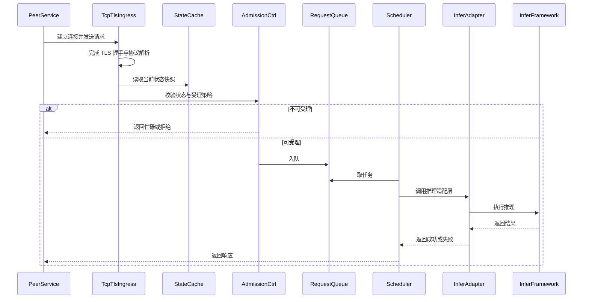

# 嵌入式 SOC AI 推理微服务 Solution Pack

- 状态: 首轮草稿
- 主题: 嵌入式 SOC 上新增 AI 推理微服务进程
- 基于 Analysis Pack: `docs/analysis/2026-04-09-embedded-ai-inference-analysis-pack.md`
- 更新时间: 2026-04-09

## 1. 需求描述

### 目标

在嵌入式 SOC 系统上新增一个独立微服务进程，为其他服务提供可控、可扩展、可受理策略约束的 AI 推理能力。

### 成功标准

- 外部服务可通过约定 TCP 通道发起推理请求
- 服务能在安全边界内受理和处理请求
- 服务可根据当前系统状态决定受理、排队、执行或拒绝
- 服务能调用下层推理框架并返回成功 / 失败结果
- 并发请求不会无限堆积导致资源失控

### 本轮范围

- 定义服务模块边界
- 明确 OpenSSL 封装职责
- 给出第一版推荐并发模型
- 定义关键接口和时序
- 给出 DFX、AR 和代码量估算

### 非目标

- 字段级协议定稿
- 真实框架 API 细节
- 真实代码仓复用确认
- 工时承诺

## 2. 推荐方案

### 方案摘要

推荐采用“单进程部署、事件驱动接入、有界队列、小执行池”的第一版架构。

核心思路：

- 用接入层处理 TCP / TLS 和协议解析
- 用统一的 OpenSSL 封装层承接 TLS 策略与连接安全生命周期
- 用状态订阅层维护最新系统状态快照
- 用有界队列和很小的执行池保护下层推理框架
- 用推理适配层隔离下层框架的调用细节和线程安全约束

### 为什么选它

- 更符合嵌入式设备的资源约束
- 并发接入和并发执行被清晰拆开
- 更容易做背压和过载控制
- 不要求下层框架天然支持大并发
- 若未来需要更强隔离，可以逐步演进到 gateway / engine 进一步分离

### 为什么不选其他方案

- 不选“宽 worker pool”作为起点，因为它假定下层框架和硬件都能平滑承受高并发
- 不选“先拆成多进程协同”作为起点，因为第一版代价太高，且没有足够证据表明必须这样做

## 3. 架构与模块划分

### 3.1 推荐模块

- `TcpIngress`
  - 负责连接建立、读取、写回和连接级限制
- `TlsSecurityWrapper`
  - 负责 `SSL_CTX` 生命周期、TLS 策略、证书校验、信任库、握手和错误归一化
- `ProtocolAdapter`
  - 负责请求 framing、schema 校验、大小限制和错误语义映射
- `SystemStateSubscriber`
  - 负责订阅系统状态并维护只读快照
- `AdmissionController`
  - 负责基于状态、连接数、队列深度和策略决定受理 / 拒绝 / 超时
- `RequestQueue`
  - 负责有界排队
- `InferenceScheduler`
  - 负责从队列中取任务，按受控并发调用下层框架
- `InferenceAdapter`
  - 负责封装下层推理框架接口和错误映射
- `MetricsAndHealth`
  - 负责日志、指标、健康检查和诊断信号

### 3.2 模块边界说明

- `TlsSecurityWrapper` 只负责传输安全和会话安全，不解释业务载荷
- `ProtocolAdapter` 负责请求语义校验，但不关心推理框架内部实现
- `InferenceScheduler` 负责队列和执行并发，不负责 TLS 和协议细节
- `InferenceAdapter` 负责下层框架调用和适配，不负责网络接入

## 4. 接口设计

### 4.1 北向请求接口

- 接口形态: TCP 连接上的请求-响应语义
- 安全形态: 建议 TLS，是否需要 mTLS 待确认
- 当前职责划分:
  - `TlsSecurityWrapper` 负责 TLS 策略和会话建立
  - `ProtocolAdapter` 负责解密后的请求 framing 和 payload 校验
- 关键控制点:
  - 最大连接数
  - 最大消息大小
  - 读取超时
  - 非法请求的统一错误响应

### 4.2 系统状态订阅接口

- 输入: 系统状态事件或状态快照
- 当前建议:
  - 使用单独订阅模块维护最新快照
  - 请求受理只读状态快照，不在请求路径中做重型状态查询
- 关键语义:
  - 状态新鲜度阈值
  - 状态不可用时的默认行为
  - 状态变化时对排队中请求的处理策略

### 4.3 下层推理框架适配接口

- 输入: 已校验的推理任务
- 输出: 推理结果或明确失败原因
- 建议边界:
  - `InferenceAdapter` 封装框架调用
  - `InferenceScheduler` 决定执行并发数和超时
- 关键语义:
  - 框架线程安全约束
  - 每次请求可占用的资源
  - 超时、取消和失败映射

### 4.4 为什么要封装 OpenSSL

基于 OpenSSL 官方 API 语义，上层封装主要应承担：

- `SSL_CTX` 级 TLS 策略初始化
- 每连接 `SSL` 对象生命周期管理
- 证书校验和信任库加载
- 客户端 hostname / SNI 策略
- session / resumption 策略
- 握手、关闭和错误归一化

这样做的价值是：

- 不把 TLS 细节散落在业务逻辑里
- 统一安全策略和证书管理
- 让协议层和推理层只处理自己的职责
- 提高可测试性与可审计性

## 5. 关键时序

## 6. DFX 设计

### 6.1 安全

- 风险:
  - TLS 配置散落各处导致证书校验不一致
  - 内部 TCP 被误认为天然可信
- 设计应对:
  - 使用 `TlsSecurityWrapper` 统一 TLS 策略、信任库和错误处理
  - 将 peer identity 与业务请求受理解耦但可组合
- 残余风险:
  - mTLS、证书轮换和密钥来源仍待确认

### 6.2 性能

- 风险:
  - 事件循环中混入阻塞调用
  - 无界队列导致排队时间失控
- 设计应对:
  - 事件驱动接入只处理非阻塞 I/O
  - 推理执行下沉到小执行池
  - 队列有上限并支持早拒绝
- 残余风险:
  - 具体执行池大小仍需基于框架能力和板端资源实测

### 6.3 可靠性

- 风险:
  - 推理框架异常拖垮整个服务
  - 状态变化时请求行为不确定
- 设计应对:
  - 明确框架调用边界和错误映射
  - 对排队、超时和取消建立策略
- 残余风险:
  - 如果框架不稳定，后续可能需要演进到更强隔离模型

### 6.4 可测试性

- 风险:
  - 下层框架和状态源难以模拟
  - TLS / 网络异常难以注入
- 设计应对:
  - 把 TLS、安全、状态、调度和推理适配分成可替换模块
  - 为状态变化、过载、超时和框架失败设计模拟点
- 残余风险:
  - 具体测试夹具仍需结合真实代码仓补齐

### 6.5 可维护性

- 风险:
  - 业务语义、安全语义和推理语义耦合
- 设计应对:
  - 坚持分层边界
  - 把 OpenSSL、协议、状态和推理解耦
- 残余风险:
  - 若团队 ownership 不清，边界仍可能回退为耦合实现

### 6.6 可观测性

- 风险:
  - 只能看到“推理失败”，看不到是接入、队列还是框架问题
- 设计应对:
  - 记录连接数、握手失败、队列深度、排队时间、执行耗时、拒绝数、框架错误数
- 残余风险:
  - 指标命名和采集链路仍待结合平台规范补齐

### 6.7 可部署性

- 风险:
  - OpenSSL、系统库和推理框架依赖耦合
  - 板端环境差异导致配置和证书路径不稳定
- 设计应对:
  - 将 TLS 策略和依赖路径集中配置
  - 减少第一版进程拆分复杂度
- 残余风险:
  - 真正的部署与回滚策略仍依赖平台现状

### 6.8 运行安全

- 风险:
  - 请求洪峰导致资源耗尽
  - 排队任务压垮推理资源
- 设计应对:
  - 显式限制连接数、队列深度和执行并发
  - 为高负载下的拒绝和超时定义清晰策略
- 残余风险:
  - 具体阈值仍需实测与平台约束共同决定

## 7. AR 分解

### AR-001. 外部服务可通过安全 TCP 通道提交推理请求

- 角色: 其他板端服务
- 目标: 通过受控通道发起推理请求并得到响应
- 业务价值: 让 AI 推理能力能被系统内其他服务稳定调用
- 依赖: TCP 契约、TLS 策略和错误语义完成对齐
- 验收要点:
  - 合法请求可建立连接并成功获得响应
  - 非法请求会被明确拒绝
- 风险 / 备注:
  - TLS 边界与协议边界若不清晰，会放大联调成本
- 工作量级别: 中到大
- 参考代码量范围: `220-380 LoC`
- 主要工作项:
  - TCP 连接接入与生命周期管理
  - OpenSSL / TLS 封装层
  - 请求 framing、基础协议解析与错误映射
  - 连接级限流、超时和非法请求拒绝
- 关键不确定性:
  - TLS / mTLS 的最终要求
  - TCP 协议 framing 和错误码 ownership
  - 是否已有可复用网络 / 安全适配组件

### AR-002. 服务能依据系统状态决定请求受理策略

- 角色: 推理微服务
- 目标: 根据系统状态选择受理、排队、拒绝或降级
- 业务价值: 避免在资源不足或状态异常时失控
- 依赖: 状态订阅源和状态语义已稳定
- 验收要点:
  - 状态正常时可受理
  - 状态异常时可按策略拒绝或降级
- 风险 / 备注:
  - 状态新鲜度和状态变化期间的语义仍需明确
- 工作量级别: 中
- 参考代码量范围: `120-220 LoC`
- 主要工作项:
  - 状态订阅接入与快照维护
  - 受理前状态检查
  - 状态不可用、状态过期和状态变化中的降级策略
  - 状态与请求路径之间的只读解耦
- 关键不确定性:
  - 状态源接口形态
  - 状态刷新频率和一致性要求
  - 排队中请求遇到状态变化时的处理语义

### AR-003. 服务能在有限资源下处理并发请求而不失控

- 角色: 推理微服务
- 目标: 在并发请求到来时维持资源可控和结果可预期
- 业务价值: 保证板端稳定性和服务可用性
- 依赖: 队列上限、执行池大小和过载策略完成定义
- 验收要点:
  - 超过阈值时有明确背压或拒绝行为
  - 系统不会因请求堆积出现明显失控
- 风险 / 备注:
  - 阈值选择与板端资源实测强相关
- 工作量级别: 中到大
- 参考代码量范围: `180-320 LoC`
- 主要工作项:
  - 有界队列与任务排队策略
  - 小执行池 / scheduler
  - 超时、取消、拒绝和背压机制
  - 框架调用并发限制与资源保护
- 关键不确定性:
  - 下层推理框架线程安全能力
  - 板端 CPU / NPU / 内存余量
  - 队列阈值、执行池大小和优先级策略

### AR-004. 服务具备基础诊断与观测能力

- 角色: 开发 / 测试 / 运维人员
- 目标: 能区分接入层、队列层和推理层问题
- 业务价值: 降低排障成本，支撑后续优化
- 依赖: 日志、指标和健康检查定义完成
- 验收要点:
  - 能看到握手失败、拒绝数、队列深度、执行耗时等核心信号
- 风险 / 备注:
  - 若观测点不足，系统问题会长期表现为“偶发推理失败”
- 工作量级别: 小到中
- 参考代码量范围: `80-160 LoC`
- 主要工作项:
  - 分层日志设计
  - 核心指标和健康检查
  - 接入层、队列层、推理层错误归类
  - 基础诊断字段和监控埋点
- 关键不确定性:
  - 平台已有日志 / 指标规范
  - 目标环境允许的观测采样粒度
  - 健康检查与状态订阅之间的边界

### 7.5 AR 工作量汇总

| AR | 工作量级别 | 参考代码量范围 | 主要驱动因素 |
| --- | --- | --- | --- |
| `AR-001` | 中到大 | `220-380 LoC` | TCP / TLS 接入、OpenSSL 封装、协议解析 |
| `AR-002` | 中 | `120-220 LoC` | 状态订阅、快照维护、受理策略 |
| `AR-003` | 中到大 | `180-320 LoC` | 队列、调度、执行池、背压 |
| `AR-004` | 小到中 | `80-160 LoC` | 日志、指标、健康检查、错误归类 |

说明：

- 这里的 AR 工作量是按“该 AR 主导的实现贡献”拆分，不是严格互斥的代码块
- `TlsSecurityWrapper`、`AdmissionController`、`RequestQueue` 和 `MetricsAndHealth` 等模块会同时支撑多个 AR
- 因此每个 AR 的估算适合用于相对排序、拆解优先级和工作量讨论，不应机械当作独立工单精确预算

## 8. 参考代码量估算

- 估算范围: `600-1100 LoC`
- 包含内容:
  - TCP / TLS 接入与 OpenSSL 封装
  - 请求解析、受理控制和错误映射
  - 状态订阅与状态快照
  - 有界队列与小执行池
  - 下层推理框架适配
  - 基础日志、指标和单元 / 集成测试
- 不包含内容:
  - 下层推理框架本身的大改
  - 跨团队协议标准化和联调成本
  - 部署平台的大规模改造
- 主要不确定性:
  - 真实代码仓中可复用组件的成熟度
  - 推理框架线程安全能力
  - TLS 封装边界是否已被下层部分承接
- 置信度: 中

## 9. 剩余风险与开放问题

- 当前没有真实业务代码仓证据，所有复用判断都只是方案级推断
- 需要团队确认 TLS / mTLS / 证书策略
- 需要团队确认 TCP 契约 ownership 和错误码策略
- 需要通过实测确认执行池大小和队列阈值
- 如果下层框架稳定性差，后续可能要演进到更强隔离方案
