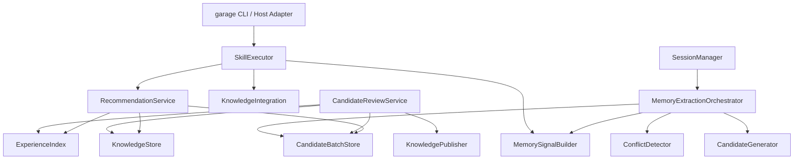
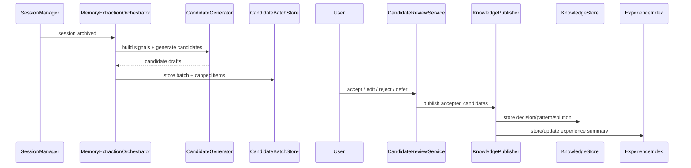

# D003: Garage Memory 自动知识提取与经验推荐设计

- 状态: 草稿
- 日期: 2026-04-18
- 关联规格: `docs/features/F003-garage-memory-auto-extraction.md`
- 关联批准记录: `docs/approvals/F003-spec-approval.md`
- 关联基础设计: `docs/designs/2026-04-15-garage-agent-os-design.md`

## 1. 概述

F003 要把 Garage 从“能存 knowledge / experience”推进到“能从一次真实 session 中提炼候选记忆，并在下一次任务开始时主动推荐”。设计的核心不是再造一套独立记忆系统，而是在现有 Garage OS 基础上补齐 4 条缺失链路：

1. session 完成后自动触发提取
2. 提取结果先进入候选层而不是直接入库
3. 用户确认动作成为显式治理工件
4. 已发布知识进入下一次任务的主动推荐闭环

这份设计保持 workspace-first、文件即契约、用户确认先于发布，不引入外部数据库、常驻服务或 Web UI。

## 2. 设计驱动因素

### 2.1 来自规格的核心驱动力

- `FR-301`: 自动提取必须在 session 完成后触发，并区分“非空候选”“无证据”“已评估但未形成候选”。
- `FR-302a` / `FR-302b`: 第一版必须支持四类候选，且候选要自描述、可追溯。
- `FR-303` / `FR-303a`: 知识发布前必须经过用户确认；单批次候选上限为 5，支持批量拒绝与延后处理。
- `FR-304`: 相似知识冲突必须显式处理，不能静默覆盖。
- `FR-305` / `FR-306`: 下一次相似任务开始时默认主动推荐，并解释为什么命中。
- `FR-307`: 自动提取失败不得阻塞主 session 完成。

### 2.2 现有系统约束

- 现有 `KnowledgeStore` 只支持 `decision / pattern / solution` 三类正式知识。
- 现有 `ExperienceIndex` 已支持经验持久化与多维搜索，但没有候选层和确认状态。
- 现有 `KnowledgeIntegration.extract_from_session()` 是“直接写 experience + knowledge”的同步路径，不符合 F003 的候选先行治理要求。
- 现有 `SkillExecutor` 在执行前做简单知识查询，但推荐触发仍是被动、基于 skill name 的浅匹配。

### 2.3 设计目标

- 尽量复用现有存储与索引能力
- 把新增复杂度限制在“候选批次 + 提取器 + 推荐服务 + 确认发布器”四个局部模块
- 保持后续可以演进到更强的模式识别，但第一版不依赖复杂模型

## 3. 需求覆盖与追溯

| 规格需求 | 设计承接 |
|----------|----------|
| `FR-301` 自动触发知识提取 | `MemoryExtractionOrchestrator` 在 session 归档后触发提取批次 |
| `FR-302a` 四类候选 | `CandidateType` + `CandidateDraft` schema |
| `FR-302b` 自描述与追溯 | 候选 front matter / JSON metadata 包含来源锚点与生成理由 |
| `FR-303` 用户确认门禁 | `CandidateReviewService` + approval-like confirm action record |
| `FR-303a` 确认负担控制 | `CandidateBatch` 上限裁剪、批量拒绝、defer 队列 |
| `FR-304` 相似知识冲突 | `ConflictDetector` 在发布前做相似项探测 |
| `FR-305` 主动推荐 | `RecommendationService` 在任务开始阶段默认触发 |
| `FR-306` 推荐原因解释 | 推荐结果返回 `match_reasons` |
| `FR-307` 失败降级 | 提取流水线错误与 session 结果解耦 |
| `NFR-301/302/304` | 全部动作写入 workspace 工件；确认先于发布；兼容现有 knowledge/experience |

## 4. 架构模式选择

本轮设计选择：

- **模块化单体**：继续在现有 `garage_os` 内扩展，不引入额外进程或分布式组件。
- **分阶段管道**：提取流程是“证据采集 → 候选生成 → 用户确认 → 发布/拒绝 → 推荐索引”的串行管道。
- **插件式扩展点**：候选生成策略、推荐打分策略通过内部策略接口扩展，而不是在核心类型里硬编码宿主行为。

天然限制：

- 所有步骤仍在单进程/单仓库内完成，吞吐与并发能力受限于文件系统和本地执行模型。
- 第一版推荐质量主要依赖启发式匹配，不追求复杂语义召回。

## 5. 候选方案总览

### 方案 A：直接在 `KnowledgeIntegration` 上叠加候选模式

- 做法：把现有 `extract_from_session()` 改成先写候选，再确认发布。
- 优点：改动面小，复用现有 integration 层。
- 缺点：`KnowledgeIntegration` 会同时承担提取、候选治理、冲突检测、发布和推荐，职责过载。

### 方案 B：引入独立 Memory Pipeline 模块，在现有 store/index 之上编排

- 做法：新增 `memory/` 子模块，负责编排提取、候选批次、确认发布与推荐；正式知识仍落到现有 `KnowledgeStore` / `ExperienceIndex`。
- 优点：职责分层清楚，候选层与正式知识层分离，便于后续演进。
- 缺点：新增类型与目录，前期文档与实现量更大。

### 方案 C：只做被动推荐，不做自动提取

- 做法：先增强 `ExperienceIndex.search()` 与执行前推荐，不引入候选层。
- 优点：实现最小。
- 缺点：无法满足 F003 的核心目标，仍停留在“用户自己搜”的半自动模式。

## 6. 候选方案对比与 trade-offs

| 维度 | 方案 A：Integration 叠加 | 方案 B：独立 Memory Pipeline | 方案 C：只做推荐 |
|------|--------------------------|------------------------------|------------------|
| 满足 F003 完整性 | 中 | 高 | 低 |
| 对现有代码侵入性 | 中 | 中 | 低 |
| 职责清晰度 | 低 | 高 | 中 |
| 后续演进空间 | 中 | 高 | 低 |
| 实现复杂度 | 中 | 中高 | 低 |
| 与愿景一致性 | 中 | 高 | 低 |

结论：选择 **方案 B**。F003 的关键不是“多几个函数”，而是把候选层、确认层和发布层从正式知识层分开。独立 Memory Pipeline 虽然新增模块，但更符合“证据 -> 草稿 -> 确认 -> 发布”的治理结构，也更贴合用户契约与成长策略。

## 7. 选定方案与关键决策

### ADR-001: 采用独立 Memory Pipeline，而不是把候选治理塞进现有 KnowledgeIntegration

### 状态
已接受

### 背景
F003 引入候选草稿、用户确认、批量拒绝、延后处理和相似知识冲突检测，这些都不是现有 `KnowledgeIntegration` 的职责。

### 决策
新增 `garage_os.memory` 模块，作为候选提取与推荐编排层；`KnowledgeStore` 和 `ExperienceIndex` 保持正式知识与正式经验的持久化职责。

### 被考虑的备选方案
- 继续扩展 `KnowledgeIntegration`
- 只做推荐，不做自动提取

### 后果
- 正面：职责边界清晰，便于测试与后续演进
- 负面：新增模块与 schema，需要补更多文档和测试
- 中性：现有 `KnowledgeIntegration` 仍保留给手动提取 / 跨模块查询使用

### 可逆性评估
中等成本

### ADR-002: 候选草稿与批次使用 workspace 内独立工件目录，而不是混入正式 knowledge 目录

### 状态
已接受

### 背景
候选草稿在确认前不属于正式知识，不能与 `knowledge/decisions|patterns|solutions` 混放，否则会污染查询与语义边界。

### 决策
在 `.garage/memory/` 下新增：

- `candidates/batches/<batch-id>.json`
- `candidates/items/<candidate-id>.md`
- `confirmations/<batch-id>.json`

正式发布后才写入 `.garage/knowledge/` 或 `.garage/experience/records/`。

### 被考虑的备选方案
- 把候选直接写入 `knowledge/` 并用 `status=draft`
- 把候选只留在 session 目录中

### 后果
- 正面：候选层与正式知识层分离，查询边界清晰
- 负面：多一套目录和 schema 要维护
- 中性：后续可以给候选批次增加 inbox/queue 视图而不影响正式知识

### 可逆性评估
容易回滚

### ADR-003: 第一版推荐采用启发式主动推荐，而不是复杂排序或手动触发

### 状态
已接受

### 背景
F003 明确要求下一次相似任务开始时默认主动推荐，但第一版又不能引入复杂模型系统。

### 决策
在执行开始阶段默认触发一次推荐查询，基于 skill、domain、problem_domain、key_patterns、artifact tags 的启发式加权匹配返回推荐，并附带 `match_reasons`。

### 被考虑的备选方案
- 只提供手动查询入口
- 直接引入 embedding / 复杂排序模型

### 后果
- 正面：符合成长策略中的“主动推荐”，实现成本可控
- 负面：相关性上限有限，需要后续优化
- 中性：推荐接口保留可调用能力，后续可替换打分器

### 可逆性评估
容易回滚

## 8. 架构视图

### 8.1 逻辑组件图



### 8.2 提取与确认时序



## 9. 模块职责与边界

### 9.1 `MemorySignalBuilder`

职责：

- 从 session、artifact、experience 组装提取信号
- 统一生成候选所需的输入结构
- 过滤无证据 session

不负责：

- 直接生成候选文本
- 决定是否发布

### 9.1A 输入证据最小契约

`MemorySignalBuilder` 不直接假设“session transcript 一定存在”。第一版证据面以当前代码现实为基础，定义为三层来源：

1. **Session metadata**：来自 `sessions/active|archived/<session-id>/session.json` 与 `archive.json`
2. **Artifact evidence**：来自 session metadata 中的 `artifacts[]` 路径，以及可读的目标文件内容
3. **Experience evidence**：来自 `experience/records/*.json` 中 `session_id == 当前 session` 的记录

第一版最小输入结构：

```json
{
  "session_id": "session-20260418-001",
  "topic": "Garage Memory design",
  "state": "completed",
  "current_node_id": "hf-design",
  "artifacts": [
    {
      "path": "docs/designs/2026-04-18-garage-memory-auto-extraction-design.md",
      "artifact_role": "design",
      "status": "draft"
    }
  ],
  "experience_records": [
    {
      "record_id": "exp-001",
      "task_type": "design",
      "skill_ids": ["hf-design"],
      "domain": "garage_os",
      "problem_domain": "memory_pipeline",
      "key_patterns": ["workspace-first", "candidate-review"]
    }
  ],
  "repository_state": {
    "branch": "cursor/f003-auto-knowledge-extraction-e0e5",
    "dirty": false
  }
}
```

判定规则：

- **no_evidence**：三层来源都不存在，或只有 session id 这类无法支撑候选的空壳 metadata
- **evaluated_no_candidate**：存在最小证据，但经去重、质量门槛过滤后未形成候选
- **evaluated_with_candidates**：存在最小证据，且至少形成 1 条候选

缺失记录策略：

- 缺 `artifacts`：记录 `missing_artifacts`
- 缺 `experience_records`：记录 `missing_experience`
- 缺 richer transcript：不视为错误，第一版显式降级为“metadata + artifacts + experience”模式

这一定义保证 `hf-tasks` 可以围绕稳定输入拆出证据读取器、过滤器和错误降级逻辑，而不需要在实现阶段重新发明“什么算证据”。

### 9.2 `CandidateGenerator`

职责：

- 把提取信号映射为四类候选：`decision`、`pattern`、`solution`、`experience_summary`
- 计算候选优先级与 `match_reasons`
- 对超过 5 条的结果做裁剪

不负责：

- 写入正式知识库
- 用户交互

### 9.3 `CandidateBatchStore`

职责：

- 保存候选批次与候选条目
- 维护状态：`pending_review / accepted / rejected / deferred / published`
- 记录“无证据”“已评估但未形成候选”“被截断”原因

### 9.4 `ConflictDetector`

职责：

- 在发布前利用 `KnowledgeStore.search()` 和标签/主题启发式检索相似正式知识
- 生成冲突建议：`coexist / supersede / abandon`

### 9.5 `CandidateReviewService`

职责：

- 接受用户确认动作
- 支持逐条接受、编辑后接受、逐条拒绝、整批拒绝、整批延后
- 生成确认记录工件

### 9.6 `KnowledgePublisher`

职责：

- 把已接受候选转换为正式 `KnowledgeEntry` 或 `ExperienceRecord`
- 更新 supersedes / source metadata / confirmation reference

### 9.7 `RecommendationService`

职责：

- 在任务开始时默认触发推荐查询
- 基于正式知识与正式经验返回排序结果和 `match_reasons`
- 尊重“推荐已关闭”的配置

### 9.8 canonical surface: CLI first, host-compatible

第一版把**CLI** 定义为候选确认与推荐展示的 canonical surface，宿主对话面只作为兼容入口而不是另起一套私有契约：

- `garage memory review <batch-id>`：展示待确认候选并执行 accept / edit_accept / reject / batch_reject / defer
- `garage run <skill>`：在真正执行前输出一次主动推荐摘要（若推荐功能开启）
- 宿主对话面若要承接相同能力，必须调用同一套 `CandidateReviewService` / `RecommendationService`，并复用同一批次与确认记录 schema

明确排除：

- 第一版不把文件 inbox 定义为 canonical surface
- 第一版不为宿主对话面单独定义不同 confirmation contract
- 第一版不要求推荐结果必须生成额外 artifact 文件才可展示

## 10. 数据流、控制流与关键交互

### 10.1 session 完成后的自动提取流程

1. `SessionManager.archive()` 完成 session 归档
2. `MemoryExtractionOrchestrator` 读取 session 上下文、artifacts、experience
3. `MemorySignalBuilder` 产出结构化提取信号
4. 若无证据：写批次记录为 `no_evidence`
5. `CandidateGenerator` 生成候选并按优先级裁剪到 5 条
6. `CandidateBatchStore` 写入批次和候选条目
7. 若 0 条候选但已评估：写 `evaluated_no_candidate`
8. 返回 extraction summary，但不影响主 session 成败

### 10.2 用户确认流程

1. CLI 或宿主入口读取待确认批次
2. 用户对候选执行 accept / edit_accept / reject / batch_reject / defer
3. `CandidateReviewService` 写确认记录
4. `KnowledgePublisher` 发布被接受的候选
5. `CandidateBatchStore` 更新候选状态为 `published` 或最终状态

### 10.3 任务开始时主动推荐流程

1. `SkillExecutor.execute_skill()` 在进入真正执行前构造任务上下文
2. `RecommendationService` 默认执行一次推荐查询
3. 返回推荐结果、匹配原因与来源锚点
4. 推荐结果附在 execution context 中交给 CLI / host 展示
5. 用户可忽略推荐，不阻塞主执行链路

### 10.4 推荐触发输入构造与降级

现有 `SkillExecutor` 现实只有 `skill_name + params` 的浅输入，因此第一版明确使用一个 `RecommendationContextBuilder` 在执行前按以下优先级构造 richer context：

1. `skill_name`
2. `params` 中显式传入的 `domain` / `problem_domain` / `tags`
3. 当前 session metadata 中的 `topic` / `constraints`
4. repository state（当前分支、是否 dirty）

最小推荐输入结构：

```json
{
  "skill_name": "hf-design",
  "domain": "garage_os",
  "problem_domain": "memory_pipeline",
  "tags": ["workspace-first", "candidate-review"],
  "session_topic": "F003 design",
  "artifact_paths": [
    "docs/features/F003-garage-memory-auto-extraction.md"
  ]
}
```

降级规则：

- 若只有 `skill_name`，仍执行推荐，但只按 `skill_name` 做低置信度匹配
- 若 `params` 与 session metadata 都缺 richer context，返回推荐结果时必须标记 `match_reasons=["skill_name_only"]`
- 若推荐功能关闭，直接跳过，不阻塞 skill 执行

## 11. 接口、契约与关键不变量

### 11.1 新增目录契约

```text
.garage/
└── memory/
    ├── candidates/
    │   ├── batches/
    │   │   └── batch-<id>.json
    │   └── items/
    │       └── candidate-<id>.md
    └── confirmations/
        └── batch-<id>.json
```

### 11.2 `CandidateBatch` 最小契约

```json
{
  "schema_version": "1",
  "batch_id": "batch-20260418-001",
  "session_id": "session-20260418-001",
  "status": "pending_review",
  "trigger": "session_archived",
  "candidate_ids": ["candidate-1", "candidate-2"],
  "truncated_count": 3,
  "evaluation_summary": "evaluated_with_candidates",
  "created_at": "2026-04-18T12:00:00"
}
```

### 11.3 `CandidateDraft` front matter 最小契约

```markdown
---
schema_version: "1"
candidate_id: candidate-1
candidate_type: decision
session_id: session-20260418-001
source_artifacts:
  - docs/designs/2026-04-18-garage-memory-auto-extraction-design.md
match_reasons:
  - repeated_pattern:data-flow
status: pending_review
priority_score: 0.92
---
```

### 11.4 发布后正式数据的 traceability / confirmation 契约

为了满足 `FR-302b`、`FR-303`、`NFR-301` 与 `CON-303`，正式发布后的数据必须新增以下可回读字段：

#### `KnowledgeEntry` 扩展字段

```yaml
source_session: session-20260418-001
source_artifact: docs/designs/2026-04-18-garage-memory-auto-extraction-design.md
source_evidence_anchor:
  kind: artifact_excerpt
  ref: docs/designs/2026-04-18-garage-memory-auto-extraction-design.md#ADR-001
confirmation_ref: .garage/memory/confirmations/batch-20260418-001.json
published_from_candidate: candidate-1
```

#### `ExperienceRecord` 扩展字段（含 `experience_summary` 发布态）

```json
{
  "record_id": "exp-001",
  "session_id": "session-20260418-001",
  "artifacts": [
    "docs/features/F003-garage-memory-auto-extraction.md"
  ],
  "source_evidence_anchors": [
    {
      "kind": "session_metadata",
      "ref": "sessions/archived/session-20260418-001/session.json"
    }
  ],
  "confirmation_ref": ".garage/memory/confirmations/batch-20260418-001.json",
  "published_from_candidate": "candidate-4"
}
```

`experience_summary` 的发布态在第一版**不新增新的 `KnowledgeType`**，而是落为扩展后的 `ExperienceRecord`，并通过上述 traceability 字段进入推荐与回溯链路。

### 11.5 `ConfirmationRecord` 最小契约

```json
{
  "schema_version": "1",
  "batch_id": "batch-20260418-001",
  "resolution": "mixed",
  "actions": [
    {
      "candidate_id": "candidate-1",
      "action": "accept",
      "published_path": "knowledge/decisions/decision-123.md"
    },
    {
      "candidate_id": "candidate-2",
      "action": "reject"
    }
  ],
  "resolved_at": "2026-04-18T12:30:00",
  "surface": "cli",
  "approver": "user"
}
```

### 11.6 关键不变量

- 候选未确认前不得写入正式 `knowledge/`。
- 每个候选必须且只能属于四类之一。
- 单批次进入待确认队列的候选数不得超过 5。
- 推荐只基于正式 knowledge/experience，不基于未确认候选。
- 自动提取失败不得改变主 session 的最终结果。
- 已发布正式数据必须包含 `confirmation_ref` 与至少一个 `source_evidence_anchor`。

## 12. 非功能需求与约束落地

| NFR 类别 | 规格中的要求 | 落到设计的哪个模块/机制 | 验证方法 |
|----------|-------------|----------------------|---------|
| 性能 | 候选生成 p90 < 60s；1000 条推荐查询 p90 < 5s | `CandidateGenerator` 线性扫描当前 session 信号；`RecommendationService` 复用现有 `KnowledgeStore` 索引 + `ExperienceIndex` 搜索 | 定向 benchmark：批量候选生成与推荐查询压测 |
| 可靠性 | 提取失败不影响 session 完成 | `MemoryExtractionOrchestrator` 与主 session 解耦；错误记录到 memory batch summary | 注入提取异常，验证 session 仍 archived |
| 安全性 | 用户确认先于发布 | `CandidateReviewService` + `KnowledgePublisher` gate | 尝试绕过确认直接发布，验证失败 |
| 可维护性 | 渐进演进、模块边界清晰 | 独立 `memory` 模块，不污染现有 store/index 职责 | 单元测试 + 设计评审 |
| 兼容性 | 与现有 knowledge / experience / CLI 兼容 | 正式知识仍沿用 `KnowledgeStore` / `ExperienceIndex`；推荐可关闭 | 现有 CLI 回归 + memory feature flag 测试 |

## 13. 测试与验证策略

### 13.1 最薄验证路径

1. 构造一个已归档 session
2. 自动生成 1-3 条候选草稿
3. 用户接受其中 1 条、拒绝其余
4. 验证正式知识成功入库
5. 新任务开始时默认返回相关推荐

### 13.2 建议测试层次

- 单元测试：
  - `CandidateGenerator` 的四类候选映射与裁剪逻辑
  - `ConflictDetector` 的相似项探测
  - `RecommendationService` 的启发式打分和 `match_reasons`
- 集成测试：
  - session archive -> candidate batch
  - confirm -> publish -> recommend
- 手工验证：
  - 用 CLI / host 展示候选并完成一轮确认

## 14. 失败模式与韧性策略

| 失败场景 | 影响范围 | 缓解策略 |
|---------|---------|---------|
| session 证据缺失 | 本次无法生成候选 | 记录 `no_evidence`，不阻塞主 session |
| 候选生成异常 | 本次提取失败 | 提取层记录错误摘要，主 session 保持完成 |
| 批次文件写入失败 | 本次候选不可恢复 | 原子写入 + 错误记录 + 允许下次手动重跑 |
| 用户确认中断 | 候选停留在 `pending_review` / `deferred` | 候选批次持久化，后续可恢复处理 |
| 正式知识发布失败 | 单条候选未发布 | 保留确认记录与失败日志，不回滚其他候选 |
| 推荐查询过慢 | 任务开始体验下降 | 保持可关闭开关；优先复用索引与限制上下文规模 |

## 15. 任务规划准备度

这份设计已经足以支撑后续 `hf-tasks`，因为以下边界已稳定：

- 候选层与正式知识层目录边界
- 四类候选的最小契约
- 提取、确认、发布、推荐四条主链模块职责
- 推荐默认主动触发，但仍通过接口实现
- 单批次 5 条候选上限与批处理规则

后续任务拆分可围绕：

- memory types + storage
- extraction pipeline
- review/publish CLI surface
- recommendation service
- targeted tests

## 16. 关键决策记录（ADR 摘要）

- `ADR-001`: 采用独立 Memory Pipeline
- `ADR-002`: 候选与正式知识分目录存储
- `ADR-003`: 第一版采用默认主动的启发式推荐

## 17. 明确排除与延后项

- 不在本轮实现 embedding / 向量检索
- 不在本轮实现夜间批处理
- 不在本轮实现 Web inbox
- 不在本轮实现自动 skill 生成
- `experience_summary` 候选是否也需要独立正式存储类型，当前先映射到 `ExperienceRecord` 扩展，不新增 `KnowledgeType`

## 18. 风险与开放问题（区分阻塞 / 非阻塞）

### 阻塞

当前无阻塞项。

### 非阻塞

1. 推荐结果在 CLI 的默认展示格式是否需要更细的 UX 规范，还可在实现前补充。
2. 候选优先级打分规则的具体权重，属于实现细节，可在测试驱动中迭代。
