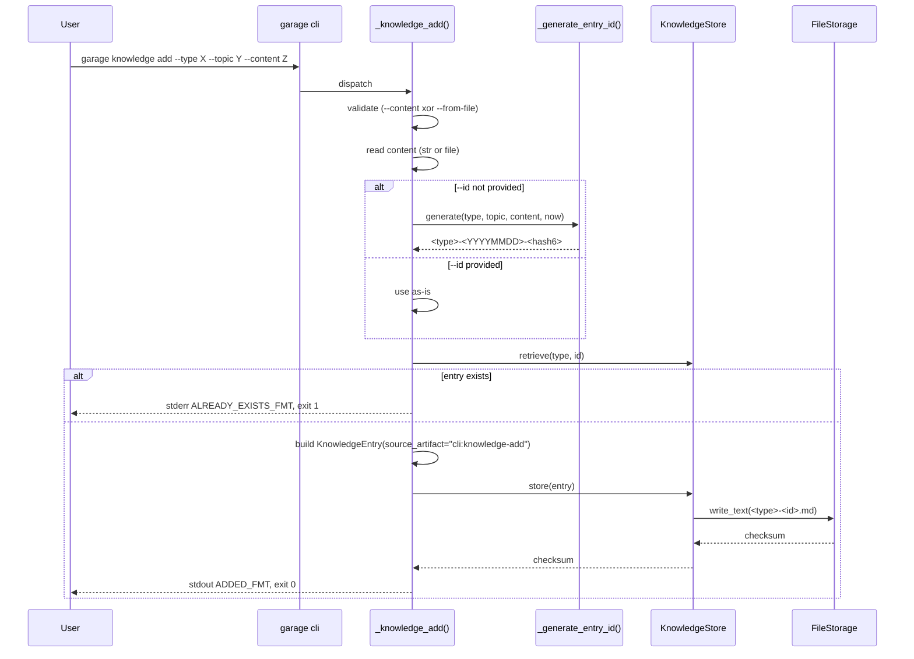
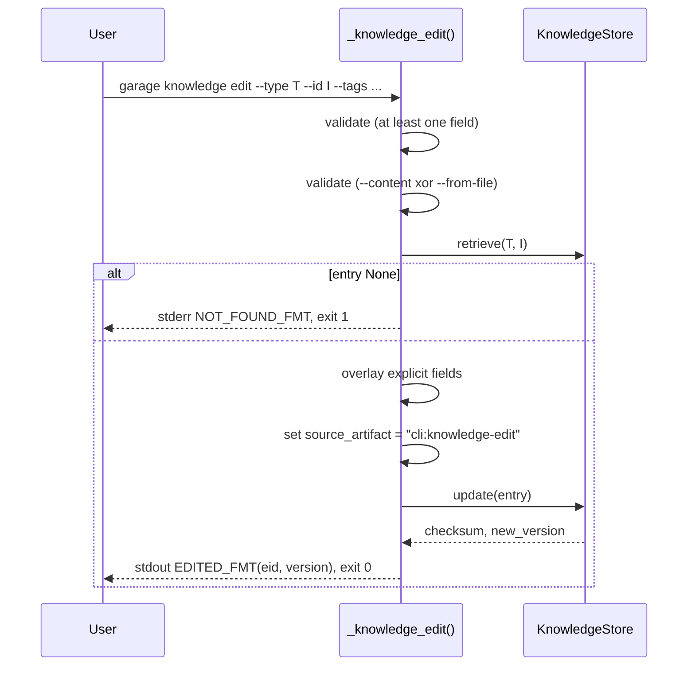
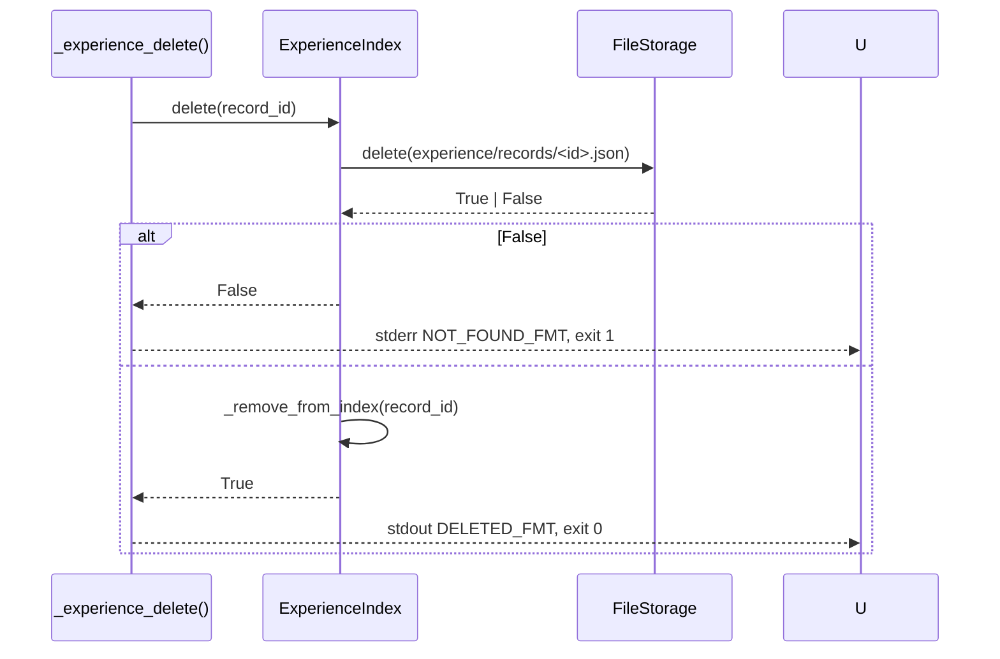

# D005: Garage Knowledge Authoring CLI 设计

- 状态: 草稿
- 日期: 2026-04-19
- 关联规格: `docs/features/F005-garage-knowledge-authoring-cli.md`（已批准）
- 关联批准记录: `docs/approvals/F005-spec-approval.md`
- 关联前序设计: `docs/designs/2026-04-19-garage-memory-v1-1-design.md`（D004）
- 关联前序代码: `src/garage_os/cli.py`、`src/garage_os/knowledge/knowledge_store.py`、`src/garage_os/knowledge/experience_index.py`

## 1. 概述

F005 引入手工知识 / 经验入库的 CLI surface（`garage knowledge add|edit|show|delete` + `garage experience add|show|delete`），让 Stage 2 飞轮在不依赖 session 归档与候选提取的前提下也能从终端起转。本设计**不改任何已批准 contract**：

- `KnowledgeEntry` / `ExperienceRecord` schema 不变
- `KnowledgeStore` / `ExperienceIndex` 公开 API 不变
- F003 candidate→publisher 路径完全独立
- F004 v1.1 重复发布 `version+=1` 不变量在 CLI `edit` 路径上自然延伸

设计原则保持不变：workspace-first、文件即契约、用户确认先于发布、不引入外部数据库 / 常驻服务 / Web UI。

## 2. 设计驱动因素

### 2.1 来自规格的核心驱动力

- **FR-501** `knowledge add` 必须能从 CLI 一行写入 → 在 `cli.py` 增子命令 + 内部 helper `_knowledge_add(...)` 调用 `KnowledgeStore.store()`
- **FR-502** `--from-file` 与 `--content` 互斥 → `argparse` 不易直接表达"二选一"，由 handler 内显式校验
- **FR-503** `knowledge edit` 仅按显式传入字段覆写 → handler 先 `retrieve()` → 仅替换显式传入字段 → `update()`
- **FR-504/505** `show` / `delete` 直接薄包装现有 `retrieve()` / `delete()`
- **FR-506** `experience add` 多个 `--skill` 需要 `argparse` `action="append"`
- **FR-507a/b** `experience show` / `delete` 直接薄包装 `ExperienceIndex.retrieve()` / `delete()`（后者已级联清理 `.garage/knowledge/.metadata/index.json`）
- **FR-508** ID 算法时间敏感 + 碰撞拒绝 → 集中实现于 `_generate_entry_id()` / `_generate_experience_id()` helper，timestamp 通过依赖注入便于测试
- **FR-509** 来源标记 `source_artifact = "cli:knowledge-add" | "cli:knowledge-edit"` → handler 在构造 `KnowledgeEntry` 前显式赋值；`experience add` 写 `artifacts = ["cli:experience-add"]`
- **FR-510** CLI help 自描述 → 通过 `argparse` 子命令树 + 每个 sub-parser 的 `help` / `description` 自然落地

### 2.2 来自规格的非功能驱动力

- **NFR-501** 零回归 → 不修改任何已存在 handler；新增代码在新 handler 函数 + 新 sub-parser
- **NFR-502** 默认零外部依赖 → 仅 stdlib + `garage_os.*`
- **NFR-503** 写路径 < 1.0s → `KnowledgeStore.store/update` 已 O(1)；CLI handler 不引入额外 IO
- **NFR-504** 错误输出语义化 → 模块顶层常量 `KNOWLEDGE_ADDED_FMT` 等，与 F004 `MEMORY_REVIEW_*` 同模式
- **NFR-505** 文档同步 → `docs/guides/garage-os-user-guide.md` + 双 README

### 2.3 现有系统约束

- **`KnowledgeStore.store(entry)`**：不递增 version；新增 entry 由该方法承担。
- **`KnowledgeStore.update(entry)`**：先从 index 移除 → `entry.version += 1` → 调 `store(entry)`，文件名格式 `<type>-<id>.md`。
- **`KnowledgeStore.retrieve(type, id)`**：返回 `Optional[KnowledgeEntry]`，不存在返回 None。
- **`KnowledgeStore.delete(type, id)`**：返回 `bool`（True = 删除成功，False = 不存在）。
- **`ExperienceIndex.store(record)` / `retrieve(id)` / `delete(id)`**：分别对应 add / show / delete；`delete` 同时移除 `.garage/knowledge/.metadata/index.json` 中的引用（见 `experience_index.py:139-158`）。
- **`KnowledgeEntry.front_matter`**：dict 字段；`source_artifact` 是 dataclass 顶层字段，序列化时已被 `_entry_to_front_matter` 写入 front matter（见 `knowledge_store.py:413`）。
- **`ExperienceRecord.artifacts`**：dataclass `List[str]` 字段，默认空。F003 publisher 路径不写入；CLI 路径写 `["cli:experience-add"]` 不会与 publisher 冲突。
- **现有 `_run` 内部已构造 `ExperienceRecord`**：见 `cli.py:300-316`，是 CLI 层调用 `ExperienceIndex.store()` 的既定先例。
- **`_find_garage_root()` + `--path`**：所有现有 CLI 子命令的标准入口模式；新子命令必须沿用，不发明新的 path 解析逻辑。

### 2.4 设计目标

- 把所有代码增量限制在 **`src/garage_os/cli.py`**（subparser + handler 函数）
- 不修改 `KnowledgeStore` / `ExperienceIndex` / `KnowledgeEntry` / `ExperienceRecord` 任何 dataclass 或方法签名
- 全部新逻辑可单元测试，不依赖 Claude Code / `MemoryExtractionOrchestrator` / `KnowledgePublisher`
- 测试新增量预期 ~25-35 个，集中在 `tests/test_cli.py` 新 test classes

## 3. 需求覆盖与追溯

| 规格需求 | 设计承接 | 主要落点 |
|----------|---------|---------|
| `FR-501` knowledge add | 新增 subparser `knowledge add` + handler `_knowledge_add(...)` 调 `KnowledgeStore.store()` | `cli.py` |
| `FR-502` `--from-file` / `--content` 互斥 | handler 入口校验 + ad-hoc error message | `cli.py` `_resolve_content()` |
| `FR-503` knowledge edit | 新增 subparser + handler `_knowledge_edit(...)` 调 `KnowledgeStore.retrieve()` → 字段覆写 → `KnowledgeStore.update()` | `cli.py` |
| `FR-504` knowledge show | subparser + handler `_knowledge_show(...)` 调 `retrieve()` → pretty print | `cli.py` |
| `FR-505` knowledge delete | subparser + handler `_knowledge_delete(...)` 调 `delete()` | `cli.py` |
| `FR-506` experience add | subparser + handler `_experience_add(...)` 构造 `ExperienceRecord` 调 `ExperienceIndex.store()` | `cli.py` |
| `FR-507a` experience show | subparser + handler `_experience_show(...)` 调 `ExperienceIndex.retrieve()` → JSON pretty print | `cli.py` |
| `FR-507b` experience delete | subparser + handler `_experience_delete(...)` 调 `ExperienceIndex.delete()`（级联清理索引） | `cli.py` |
| `FR-508` ID 算法 | helper `_generate_entry_id(type, topic, content, now)` + `_generate_experience_id(now)` + 在 add 路径检查碰撞 | `cli.py` |
| `FR-509` 来源标记 | handler 在 `KnowledgeEntry(source_artifact=...)` 与 `ExperienceRecord(artifacts=[...])` 构造时显式赋值 | `cli.py` |
| `FR-510` CLI help | `argparse` 每个 subparser 提供 `help` / `description` + 完整 `add_argument` `help` 字符串 | `cli.py` `build_parser()` |
| `NFR-501` 零回归 | 不修改既有 handler；新增 sub-parser 不影响 `init/status/run/knowledge search/list/memory review` 现有行为 | `cli.py` + `tests/test_cli.py` |
| `NFR-502` 零外部依赖 | 仅 stdlib（`hashlib`、`json`、`time`、`datetime`、`argparse`、`pathlib`、`typing`、`textwrap`、`sys`） + `garage_os.*` | `cli.py` |
| `NFR-503` 写路径 < 1.0s | 单次 `store/update` ≤ O(1) IO；引入 1 个 wall-clock smoke test | `tests/test_cli.py` |
| `NFR-504` stdout 常量 | 模块顶层 `KNOWLEDGE_*_FMT` / `EXPERIENCE_*_FMT` 常量 | `cli.py` |
| `NFR-505` 文档同步 | `docs/guides/garage-os-user-guide.md` 增 "Knowledge authoring (CLI)" 段；双 README CLI 命令表追加 | 用户指南 + README |
| `CON-501` 顶级命令复用 | 新子命令挂在现有 `knowledge` / `experience` 父 subparser 下；`experience` 父 subparser 是新引入但仍是二级，不破坏 CON-501 | `cli.py` |
| `CON-502` 不改 store/index API | 只调用现有公开方法 | `cli.py` |
| `CON-503` 保持 `version+=1` | `edit` 走 `update()`，复用现有递增链路 | `cli.py` |
| `CON-504` `source_artifact` 取值不冲突 | `cli:knowledge-add` / `cli:knowledge-edit` / `experience artifacts[0]="cli:experience-add"` 与 publisher 路径已用值不重叠 | `cli.py` |
| `CON-505` 不变形 markdown body | content 原样传入 `KnowledgeEntry.content`，由 `KnowledgeStore` 现有 render 路径承担 | `cli.py` |

## 4. 架构模式选择

继承 D003 / D004 的 "workspace-first 文件存储 + best-effort orchestration + user-driven publication gate" 模式，不引入新模式。本设计采用：

- **Thin CLI Handler Pattern**：每个新子命令对应一个 `_<command>(...)` 顶层函数，仅做 (1) 参数解析与校验、(2) 委托给 `KnowledgeStore` / `ExperienceIndex`、(3) 格式化输出。无业务逻辑沉积在 CLI 层。
- **Format Constant Pattern**（继承自 F004 § 11.5）：所有 stdout 文案由模块顶层 `*_FMT` 常量产出，`.format(...)` 填充变量；测试与 Agent 调用方做字符串断言时只需引用常量。
- **Deterministic-With-Salt ID Pattern**（FR-508）：默认 ID = `<type-prefix>-<YYYYMMDD>-<6 hex>`，hash 输入含 second-precision timestamp 作为 salt。`--id` 显式传入时跳过 hash 路径。
- **Two-Surface Source Tagging**（FR-509）：`source_artifact` for knowledge / `artifacts[0]` for experience；publisher 路径与 CLI 路径取值不重叠，可 grep 区分。

## 5. 候选方案对比

### 候选 A: 全部逻辑塞进 `cli.py`（采用）

- **核心思路**：在 `cli.py` 直接增 7 个 handler 函数 + subparser；helper（ID 生成、content 解析）也定义在同文件。
- **优点**：
  - 与现有 `_init` / `_status` / `_run` / `_memory_review` 风格一致
  - 调用栈最浅，便于定位
  - 测试只需扩展 `tests/test_cli.py`，不引入新测试文件
  - 零依赖新增、零模块新增
- **缺点**：
  - `cli.py` 文件长度从 ~728 行增至 ~1100+ 行（仍可读）
  - 共享 helper（如 ID 生成）若未来被 non-CLI 路径复用需要再抽出
- **NFR / 约束匹配**：NFR-501 ~ 505 全部满足；CON-501 ~ 505 全部满足。
- **对 task planning 的影响**：单一模块改动 → 任务粒度极细（按 FR 拆分即可）。

### 候选 B: 拆出 `garage_os/cli/knowledge_handlers.py` + `experience_handlers.py`

- **核心思路**：按域拆分，handler 函数移到子模块；`cli.py` 只剩 parser + dispatch。
- **优点**：
  - `cli.py` 短
  - 子模块单独可测
- **缺点**：
  - 当前 `cli.py` 内 `_init` / `_status` / `_run` / `_memory_review` 都还是单文件风格，先拆 knowledge / experience 会引入**前后不一致**
  - 引入新模块 + 新测试文件，与 NFR-501 "不动既有结构"的精神相悖
  - 拆分动机仅为"行数"，不是"耦合或职责扩散"
- **NFR / 约束匹配**：满足，但工程复杂度高
- **对 task planning 的影响**：需要额外拆"模块切分"任务，违反 YAGNI。

### 候选 C: 引入 `click` 或 `typer` 重写 CLI

- **核心思路**：用第三方库改写整个 CLI，享受声明式参数、自动 help、子命令树。
- **优点**：
  - 长期 CLI 维护更轻
  - 自动 help 美观
- **缺点**：
  - **直接违反 NFR-502** "不引入新 third-party 依赖"
  - F002 / F003 / F004 全部基于 `argparse`，重写涉及全文件回归
  - 工作量远超 F005 范围
- **NFR / 约束匹配**：违反 NFR-502，不可选。

### 选择决策

**采用候选 A**。Solo + 渐进复杂度原则下，"先做最简一致版本，未来真出现复用诉求再抽" 优于"先按假设拆"。F004 已经验证 `cli.py` 单文件 ~700 行的可读性 / 可测性都仍在阈值内。

## 6. ADR-501: 沿用 `cli.py` 单文件风格

```
状态: 决定
背景: F005 需新增 7 个子命令 handler。现有 cli.py ~728 行已有 _init/_status/_run/
      _memory_review 等同风格 handler。
决策: 不拆模块，所有新 handler 与 helper 直接加在 cli.py。
后果:
  + 与现有结构一致，认知成本低
  + 测试集中在 tests/test_cli.py 一处
  + 零新增模块、零新增第三方依赖
  - cli.py 增至 ~1100 行；若未来再加 5+ 子命令需 revisit
可逆性: 高（事后按域拆分仅是机械搬运）
触发 revisit 信号: cli.py > 1500 行 或 出现 non-CLI 路径需复用 ID 生成器
```

## 7. ADR-502: ID 算法时间戳精度选择秒（不选毫秒/纳秒/UUID）

```
状态: 决定
背景: FR-508 要求 ID 时间敏感（同一 topic+content 不同时间 add 应得不同 ID）+
      可在测试中复算（monkeypatch datetime.now 锁秒）。
决策: 时间戳取 ISO8601 second-precision，进 hash 输入。
候选:
  - 秒（采用）: 人类可读、可锁、碰撞窗口 1 秒（用户主动重复 add 会撞）
  - 毫秒/纳秒: 碰撞窗口窄但 monkeypatch 测试更脆、人类不可读
  - UUID v4: 完全不可复算，违反 FR-508 "可复算性"
后果:
  + 极端竞态测试可 monkeypatch datetime.now 锁秒，断言"第二次 add 失败"
  + 用户层面 1 秒内重复 add 同一 topic+content 会被 already-exists 拒绝（符合预期：他们想做的是 edit 而非 add）
  - 不适合"高并发自动 ingest"场景；若未来出现，可改为毫秒+随机后缀，向前兼容（仍是 6 hex 输出）
可逆性: 高（仅改 _generate_entry_id 实现；ID 字符串格式不变）
```

## 8. ADR-503: experience source tagging 复用 `artifacts[0]` 而不增字段

```
状态: 决定
背景: FR-509 要求 experience 路径也有"手工 vs 自动"标记。ExperienceRecord 的
      dataclass 没有 source_artifact 字段，但有 artifacts: List[str]（默认空）。
决策: CLI experience add 写 record.artifacts = ["cli:experience-add"]，与 publisher 路径
      留空或写其他来源不冲突。
候选:
  - artifacts[0] 约定（采用）: 零 schema 变更，向后兼容
  - 新增 source_artifact 字段: 违反 § 2.3 非目标 "不引入新字段"
  - 不打 source 标记: 失去手工 vs 自动可观察性，违反 FR-509
后果:
  + 零 schema 变更
  + grep "cli:experience-add" .garage/experience/records/ 可一键过滤
  - artifacts 语义被略微扩展（原本可能用于"产生的 artifact 路径列表"，现在头位用于 source）；通过开发者文档段澄清
可逆性: 中（事后若引入独立 source 字段，需要数据迁移：把 artifacts[0] 移到新字段）
```

## 9. CLI Surface 详述

### 9.1 子命令树

```
garage
├── init
├── status
├── run
├── knowledge
│   ├── search        (existing, unchanged)
│   ├── list          (existing, unchanged)
│   ├── add           (NEW, F005 FR-501/502/508/509)
│   ├── edit          (NEW, F005 FR-503/509)
│   ├── show          (NEW, F005 FR-504)
│   └── delete        (NEW, F005 FR-505)
├── memory
│   └── review        (existing, unchanged)
└── experience        (NEW parent)
    ├── add           (NEW, F005 FR-506/508/509)
    ├── show          (NEW, F005 FR-507a)
    └── delete        (NEW, F005 FR-507b)
```

### 9.2 `garage knowledge add` 参数表

| 参数 | 必需 | 类型 | 说明 |
|------|------|------|------|
| `--type` | ✅ | choice {decision, pattern, solution} | 知识类型 |
| `--topic` | ✅ | str (非空) | 主题 |
| `--content` | △ | str | content 字符串；与 `--from-file` 二选一 |
| `--from-file` | △ | path | content 来源文件；与 `--content` 二选一 |
| `--tags` | ✗ | str (逗号分隔) | tag 列表，写入时 split + strip |
| `--id` | ✗ | str | 显式 ID；不传则由 FR-508 算法生成 |
| `--path` | ✗ | path | 项目根（沿用现有 path_parser） |

### 9.3 `garage knowledge edit` 参数表

| 参数 | 必需 | 类型 | 说明 |
|------|------|------|------|
| `--type` | ✅ | choice | 定位 |
| `--id` | ✅ | str | 定位 |
| `--topic` | ✗ | str | 覆写 topic |
| `--content` | ✗ | str | 覆写 content；与 `--from-file` 互斥 |
| `--from-file` | ✗ | path | 覆写 content；与 `--content` 互斥 |
| `--tags` | ✗ | str | 覆写 tags |
| `--status` | ✗ | str | 覆写 status |
| `--path` | ✗ | path | 项目根 |

要求至少传一个可改字段（`--topic` / `--content` / `--from-file` / `--tags` / `--status`）。

### 9.4 `garage experience add` 参数表

| 参数 | 必需 | 类型 | 说明 |
|------|------|------|------|
| `--task-type` | ✅ | str | 任务类型 |
| `--skill` | ✅ | str (action="append") | 多次出现表多 skill |
| `--domain` | ✅ | str | 领域 |
| `--outcome` | ✅ | choice {success, failure, partial} | 结果 |
| `--duration` | ✅ | int | 秒数 |
| `--complexity` | ✅ | choice {low, medium, high} | 复杂度 |
| `--summary` | ✅ | str | 写入 lessons_learned[0] |
| `--id` | ✗ | str | 显式 ID；不传则 `exp-<YYYYMMDD>-<6 hex>` |
| `--problem-domain` | ✗ | str | 默认 = `--task-type` |
| `--tech` | ✗ | str (action="append") | 写入 tech_stack |
| `--tags` | ✗ | str (逗号分隔) | 写入 key_patterns |
| `--path` | ✗ | path | 项目根 |

### 9.5 stdout / stderr 文案常量

```python
# Module-level (cli.py) — F005 §6 / NFR-504
KNOWLEDGE_ADDED_FMT = "Knowledge entry '{eid}' added"
KNOWLEDGE_EDITED_FMT = "Knowledge entry '{eid}' edited (version {version})"
KNOWLEDGE_DELETED_FMT = "Knowledge entry '{eid}' deleted"
KNOWLEDGE_NOT_FOUND_FMT = "Knowledge entry '{eid}' not found"
KNOWLEDGE_ALREADY_EXISTS_FMT = (
    "Entry with id '{eid}' already exists; "
    "pass --id to override or change inputs"
)
EXPERIENCE_ADDED_FMT = "Experience record '{rid}' added"
EXPERIENCE_DELETED_FMT = "Experience record '{rid}' deleted"
EXPERIENCE_NOT_FOUND_FMT = "Experience record '{rid}' not found"
```

错误文案（write to `sys.stderr`）：

```python
ERR_NO_GARAGE = "No .garage/ directory found. Run 'garage init' first."
ERR_CONTENT_AND_FILE_MUTEX = "--content and --from-file are mutually exclusive"
ERR_ADD_REQUIRES_CONTENT = "add requires --content or --from-file"
ERR_FILE_NOT_FOUND_FMT = "File not found: {path}"
ERR_EDIT_REQUIRES_FIELD = (
    "edit requires at least one of --topic / --tags / --content / "
    "--from-file / --status"
)
```

### 9.6 退出码契约

| 路径 | 成功 | 业务失败 | 用法错误 |
|------|------|---------|---------|
| `knowledge add/edit/delete/show` / `experience add/delete/show` | 0 | 1 (含 not-found, already-exists, file-not-found, mutex 冲突, missing-field) | 2 (argparse 自身错误，如 `--type` 不在 choice 内) |

退出码 1 vs 2 的区分继承现有 `_memory_review` 模式（业务失败 vs 用法错误）。

## 10. 数据流详述

### 10.1 `knowledge add` 数据流



### 10.2 `knowledge edit` 数据流



### 10.3 `experience delete` 数据流



## 11. NFR Mapping

| NFR | 落点 | 验证方式 |
|-----|------|---------|
| NFR-501 零回归 | 不修改既有 handler；新增 sub-parser 与现有 sub-parser 并列 | 运行全套 414 测试，断言 ≥ 414 passed |
| NFR-502 零外部依赖 | 仅 stdlib + `garage_os.*` import | 评审时查 `cli.py` import 闭包 |
| NFR-503 写路径 < 1.0s | 单次 `store/update` ≤ O(1) IO | 1 个 `time.monotonic()` smoke test 在 `tests/test_cli.py` |
| NFR-504 stdout 常量化 | 模块顶层 `*_FMT` 常量 + 测试用 `assert FMT.format(...) in capsys.readouterr().out` | grep 断言 + 测试模式 |
| NFR-505 文档同步 | 用户指南新增段 + 双 README 更新 | `tests/test_documentation.py` 增 grep 断言（参照 F003/F004 模式） |

## 12. 失败模式分析

| 场景 | 触发 | 检测 | 缓解 |
|------|------|------|------|
| `--from-file` 文件不存在 | 用户输错路径 | `Path(...).read_text()` 抛 `FileNotFoundError` | handler 捕获 → 退 1 + `ERR_FILE_NOT_FOUND_FMT` |
| ID 碰撞（同秒同 topic+content） | 极端竞态或测试 monkeypatch | `KnowledgeStore.retrieve()` 返回非 None | handler 退 1 + `KNOWLEDGE_ALREADY_EXISTS_FMT`，磁盘不动 |
| `edit` 目标不存在 | typo / 已被删 | `retrieve()` 返回 None | handler 退 1 + `KNOWLEDGE_NOT_FOUND_FMT` |
| `delete` 目标不存在 | 同上 | `delete()` 返回 False | handler 退 1 + `KNOWLEDGE_NOT_FOUND_FMT` |
| `experience` 索引中央 JSON 损坏 | 用户手改 / 磁盘故障 | `ExperienceIndex._load_index()` 现有路径 | 沿用现有降级行为（继承 F003 NFR-303），不在 F005 内重发明 |
| 用户既不传 `--content` 也不传 `--from-file` | 误用 | handler 入口校验 | 退 1 + `ERR_ADD_REQUIRES_CONTENT` |
| 用户在 `edit` 时同时传 `--content` 和 `--from-file` | 误用 | handler 入口校验 | 退 1 + `ERR_CONTENT_AND_FILE_MUTEX` |
| `KnowledgeStore.update()` 在未来某 cycle 不再 `version+=1` | F004 不变量被打破 | 单元测试断言 `entry.version` 单调递增 | NFR-501 零回归 + edit 路径专项断言 |

## 13. 测试策略

### 13.1 测试金字塔

- **单元测试（绝大多数）**：在 `tests/test_cli.py` 新增 7 个 test class（每子命令一个）+ 1 个共享 helper test class（ID 生成、content 解析、collision）。
- **smoke test（1 个）**：`time.monotonic()` 包一次 `add` 调用，断言 < 1.0s。
- **文档断言（2-3 条）**：在 `tests/test_documentation.py` 增 grep 7 个新命令字符串。

### 13.2 关键 test cases（task plan 输入）

每条对应 1 个或多个 FR：

1. `knowledge add` happy path → FR-501
2. `knowledge add` with `--from-file` → FR-502 happy
3. `knowledge add` with both `--content` & `--from-file` → FR-502 mutex
4. `knowledge add` with neither → FR-502 missing
5. `knowledge add` with non-existent file → FR-502 not-found
6. `knowledge add` with `--id custom` → FR-501 + FR-508 explicit-id path
7. `knowledge add` collision (monkeypatch `datetime.now` to lock seconds) → FR-508 collision
8. `knowledge add` writes `source_artifact = "cli:knowledge-add"` → FR-509
9. `knowledge edit` overlays only specified fields → FR-503 selective
10. `knowledge edit` increments version → FR-503 + CON-503 v1.1 不变量延伸
11. `knowledge edit` requires at least one field → FR-503 missing-field
12. `knowledge edit` mutex on content/file → FR-503 mutex
13. `knowledge edit` not-found → FR-503 missing target
14. `knowledge edit` writes `source_artifact = "cli:knowledge-edit"` → FR-509
15. `knowledge show` happy → FR-504
16. `knowledge show` not-found → FR-504 not-found
17. `knowledge delete` happy → FR-505
18. `knowledge delete` not-found → FR-505 not-found
19. `experience add` happy with multi `--skill` → FR-506
20. `experience add` writes `artifacts[0] = "cli:experience-add"` → FR-509
21. `experience show` happy → FR-507a
22. `experience show` not-found → FR-507a not-found
23. `experience delete` happy + index pruned → FR-507b（关键断言：`.garage/knowledge/.metadata/index.json` 不再含该 record_id）
24. `experience delete` not-found → FR-507b not-found
25. `garage knowledge --help` lists all 6 subcommands → FR-510
26. `garage experience --help` lists all 3 subcommands → FR-510
27. `garage knowledge add --help` lists all params → FR-510
28. `_run` / `_init` / `_status` / `_memory_review` 行为不变（spot check 保留 F003/F004 现有断言）→ NFR-501
29. `add` write path < 1.0s → NFR-503
30. CRUD 闭环 add→show→edit→show→delete→show 全链路 → §2.2 SC-2

### 13.3 既有测试零回归保护

`tests/test_cli.py` / `tests/test_documentation.py` 中现有 414 个测试断言不修改；新增测试单独命名（`TestKnowledgeAdd*`、`TestExperienceAdd*` 等）。

## 14. Task Planning Readiness

设计已稳定到 `hf-tasks` 可拆。建议任务粒度（不在本设计内拆，仅给输入提示）：

- T1: `knowledge add` + `_generate_entry_id` + collision check（含 FR-501/502/508 happy + edge cases）
- T2: `knowledge edit` + selective overlay + `version+=1` 断言（含 FR-503）
- T3: `knowledge show` + `delete`（含 FR-504/505）
- T4: `experience add` + `_generate_experience_id`（含 FR-506/508 experience 分支）
- T5: `experience show` + `delete` + 索引摘除断言（含 FR-507a/b）
- T6: 文档同步（用户指南 + 双 README + `tests/test_documentation.py` grep）+ FR-509/510 跨命令断言 + smoke test

每个任务可独立通过 RED → GREEN → REFACTOR 闭环，且都不依赖未完成任务的 helper（ID 生成在 T1 引入后 T4 复用）。

## 15. 开放问题

| 编号 | 问题 | 阻塞 / 非阻塞 | 当前判断 |
|------|------|-------------|---------|
| OD-501 | ID 算法时间戳取本地时区还是 UTC？ | 非阻塞（不影响 task 拆分） | 取本地时区 `datetime.now()`，与现有 `_run` 中 `time.strftime` 一致；测试用 monkeypatch 固定即可。若未来需要跨时区重放再考虑。 |
| OD-502 | `experience add --tech` / `--tags` 是否需要 deduplication？ | 非阻塞 | 否。CLI 透传，让 `ExperienceIndex` 现有路径决定。 |
| OD-503 | `knowledge edit --tags` 是覆盖还是合并？ | 非阻塞 | 覆盖（与 spec FR-503 一致："仅按显式传入字段覆写"）。如未来要 merge 语义，独立立项。 |
| OD-504 | `knowledge show` 是否也应展示 derived 字段（如 `version`、`source_artifact`）？ | 非阻塞 | 是。`show` 直接 dump full front matter（人类可读 key: value），用户可一眼看到 version 与来源。 |

## 16. Glossary

| 术语 | 定义 |
|------|------|
| **CLI authoring path** | 通过 `garage knowledge add/edit/...` / `garage experience add/...` 直接写入的代码路径，与 F003 candidate→publisher 路径并列 |
| **source marker** | front matter `source_artifact` 或 `ExperienceRecord.artifacts[0]` 的取值，用于区分 CLI 与 publisher 路径 |
| **collision** | ID 已存在导致 `add` 失败的状态；`edit` 路径不触发 |
| **CRUD loop** | add → show → edit → show → delete → show 6 步全链路 |
