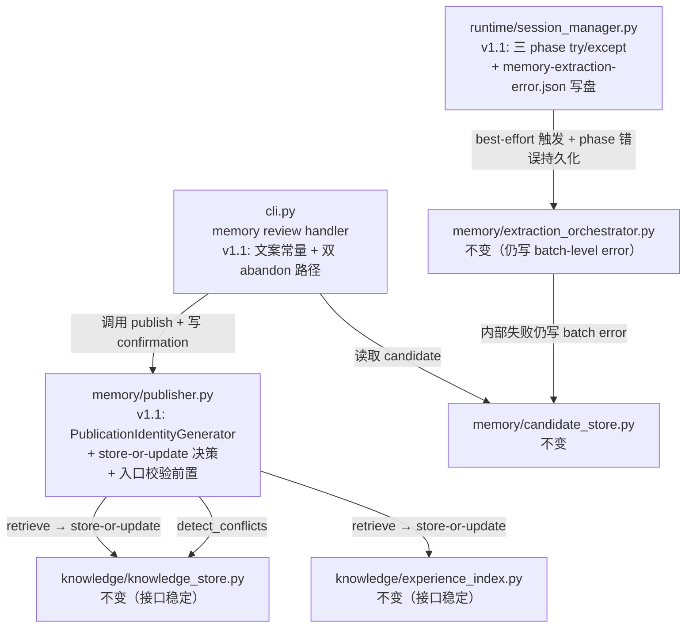
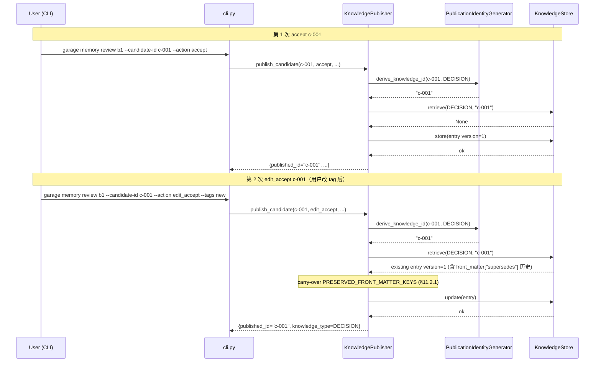
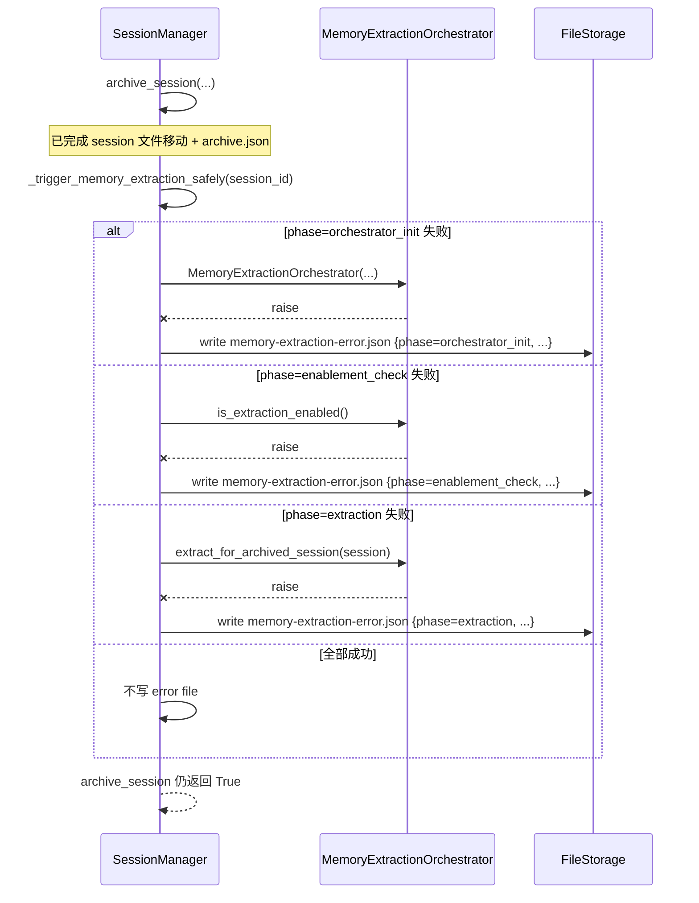

# D004: Garage Memory v1.1 — 发布身份解耦与确认语义收敛 设计

- 状态: 已批准（auto-mode approval；见 `docs/approvals/F004-design-approval.md`）
- 日期: 2026-04-19
- Revision: r1（按 design-review r1 finding 定向修订；详见 `docs/reviews/design-review-F004-memory-v1-1.md`）
- 关联规格: `docs/features/F004-garage-memory-v1-1-publication-identity-and-confirmation-semantics.md`
- 关联批准记录: `docs/approvals/F004-spec-approval.md`
- 关联前序设计: `docs/designs/2026-04-18-garage-memory-auto-extraction-design.md`（D003）
- 关联前序代码评审: `docs/reviews/code-review-F003-garage-memory-auto-extraction-r2.md`

## 1. 概述

F003 已经把 Garage Memory pipeline 完整跑通（候选层 → 用户确认 → 正式发布 → 主动推荐）。F004 不引入新链路，只把 D003 设计中已显式延后的 4 项 minor 收敛到稳态：

1. `KnowledgePublisher` 与 `KnowledgeEntry.id` / `ExperienceRecord.record_id` 解耦，让重复发布走 `KnowledgeStore.update()` / `ExperienceIndex.update()` 的 `version+=1` 链路
2. `publish_candidate` 入口立即校验 `conflict_strategy`，不依赖冲突分支命中
3. CLI `--action=abandon` 与 `--action=accept --strategy=abandon` 在 confirmation 持久产物 + stdout 文案 + 用户文档 3 个面差异化
4. `SessionManager._trigger_memory_extraction` 任意失败点都在 `sessions/archived/<id>/memory-extraction-error.json` 留痕

设计原则保持不变：workspace-first、文件即契约、用户确认先于发布、不引入外部数据库 / 常驻服务 / Web UI。

## 2. 设计驱动因素

### 2.1 来自规格的核心驱动力

- `FR-401` 重复发布必须保留版本链 → 引入"发布 ID 生成器"间接层 + `store-or-update` 决策点
- `FR-402` 入口立即校验 conflict_strategy → 把校验代码从冲突分支提到方法入口
- `FR-403a/b/c` CLI abandon 双路径差异化 → confirmation `resolution` + `conflict_strategy` 字段语义化 + stdout 稳定标识符 + 用户文档段
- `FR-404` session 触发链路文件级留痕 → 在 `_trigger_memory_extraction` 外层 try/except 写 JSON
- `FR-405` 兼容现有 F003 contract → 不修改 `KnowledgeStore.store/update`、`ExperienceIndex.store/update`、`MemoryExtractionOrchestrator` 的现有签名
- `NFR-401` 发布身份生成可冷读 + 无随机性 → 决定性 hash 算法（基于 `candidate_id`，避免引入随机后缀）
- `NFR-402` 性能不退化 → 重复发布路径多 1 次 `KnowledgeStore.retrieve()` 调用，用现有 in-memory index 兜底
- `IFR-401` 复用 `KnowledgeStore.update()` 现有签名（`version += 1`）
- `IFR-402` 复用 `ExperienceIndex.update()` 现有签名

### 2.2 现有系统约束

- **`KnowledgeStore.store(entry)`**：直接写盘 + incremental index update（`_add_to_index`），不递增 version
- **`KnowledgeStore.update(entry)`**：先 `_remove_from_index` → `entry.version += 1` → 调 `store(entry)`，文件名格式 `<type>-<id>.md`
- **`ExperienceIndex.store(record)`**：直接写盘 + 更新中心索引 `_update_index`，无 version 递增；`update(record)` 只更新 `updated_at` 后调 `store`
- **`KnowledgePublisher.publish_candidate(...)`**：当前在末尾调 `self._knowledge_store.store(entry)` 或 `self._experience_index.store(record)`，从不调 `update`
- **`KnowledgePublisher` 入口校验**：当前 `if similar_entries: if conflict_strategy not in VALID:` —— 校验只在冲突分支生效
- **CLI `garage memory review`**：`--action` 在 `accept/edit_accept/reject/batch_reject/defer/abandon/show-conflicts` 中选；`--strategy` 在 `coexist/supersede/abandon` 中选；现有逻辑在 `cli.py:467-527`
- **`SessionManager._trigger_memory_extraction`**：在 `archive_session()` 末尾调用，外层 try/except 只 `logger.warning(...)`；orchestrator 实例化、`is_extraction_enabled` 调用本身可能抛错，当前未独立捕获

### 2.3 设计目标

- 把所有 4 项变更的代码增量限制在 `src/garage_os/memory/publisher.py` + `src/garage_os/runtime/session_manager.py` + `src/garage_os/cli.py` + 文档
- 不修改 `KnowledgeEntry` / `ExperienceRecord` / `MemoryCandidate` 的 dataclass 定义
- 不修改 `KnowledgeStore` / `ExperienceIndex` / `CandidateStore` 的公开 API
- 重复发布路径与首次发布路径在外层接口上完全一致，调用方无感

## 3. 需求覆盖与追溯

| 规格需求 | 设计承接 | 主要落点 |
|----------|----------|----------|
| `FR-401` 重复发布版本链 | 引入 `PublicationIdentityGenerator` + `KnowledgePublisher.publish_candidate` 改 `store-or-update` + §10.1 supersede 链 carry-over + §10.1.1 self-conflict 短路 | publisher.py（新增 helper class + 方法 + carry-over + 短路） |
| `FR-402` 入口校验前置 | `publish_candidate` 第一段（在所有早返回 / 业务分支前）校验 `conflict_strategy` | publisher.py 入口 |
| `FR-403a` confirmation 持久差异化 | CLI `cli.py` 改 confirmation `resolution` 字段写入逻辑（abandon 路径写 `abandon`，accept-with-abandon 写 `accept` + `conflict_strategy=abandon`） | cli.py memory review handler |
| `FR-403b` CLI 输出稳定标识符 | CLI `cli.py` 增 stdout 输出常量 `MEMORY_REVIEW_OUTPUT_*` | cli.py |
| `FR-403c` 用户文档差异化说明 | `docs/guides/garage-os-user-guide.md` 新增 "Memory review abandon paths" 段 | 用户指南 |
| `FR-404` session 触发证据 | `SessionManager._trigger_memory_extraction` 重构为 `_trigger_memory_extraction_safely`，分 3 个 phase 写 `memory-extraction-error.json` | session_manager.py |
| `FR-405` 兼容性 | 不修改任何已批准 contract；145 个 memory tests + 384 个 full suite 全绿 | 全模块 |
| `NFR-401` 发布身份可冷读 | `PublicationIdentityGenerator.derive_knowledge_id(candidate_id, knowledge_type)` / `derive_experience_id(candidate_id)` 用决定性算法（默认 = 直接返回 `candidate_id`，与 F003 v1 行为一致 + version 由 store/update 链路驱动），开发者文档显式说明 | publisher.py + 开发者指南 |
| `NFR-402` 不退化性能 | 重复发布路径多 1 次 `KnowledgeStore.retrieve()` + 1 次 `ExperienceIndex.retrieve()`；二者都是 O(1) hash 查询（前者依赖 in-memory index，后者依赖中心索引 JSON） | publisher.py |
| `IFR-401/402` 复用现有 update | publisher 路径中显式调 `knowledge_store.update(entry)` / `experience_index.update(record)` | publisher.py |
| `CON-401` workspace-first | 所有新 JSON 写在 `.garage/sessions/archived/<id>/` | session_manager.py |
| `CON-402` 不引入外部依赖 | 仅复用 stdlib + 现有依赖 | 全模块 |
| `CON-403` schema 兼容 | confirmation `resolution` 字段已存在，不删除；`conflict_strategy` 字段已存在；`memory-extraction-error.json` 是新文件，旧版本无此文件不影响读取 | confirmation + session 归档目录 |
| `CON-404` 文件契约可冷读 | `memory-extraction-error.json` schema 显式声明字段（见 §11.4）+ 开发者文档段 | 开发者指南 + design |

## 4. 架构模式选择

继承 D003 的"workspace-first 文件存储 + best-effort orchestration + user-driven publication gate" 模式，不引入新模式。本设计只在该模式内做 4 项收敛：

- **Idempotent Publication Pattern**（FR-401）：发布操作的 ID 生成与 store-or-update 决策都基于决定性输入，使重复发布幂等于"version 递增"。
- **Fail-Loud-At-Boundary Pattern**（FR-402）：把 contract 校验从内部分支移到 API 入口，让调用方错误立即可见。
- **Side-Effect Discrimination via Persistent Marker Pattern**（FR-403a）：通过 confirmation JSON 的字段组合（`resolution` × `conflict_strategy`）让两条逻辑路径在持久层可冷读区分。
- **Defense-In-Depth Logging Pattern**（FR-404）：在 best-effort 路径外层加文件级证据，与原有 logger.warning 双层防护，不替换。

## 5. 候选方案总览

针对 4 项变更，分别给出 2 个候选方案，再统一为整体设计。

### 5.1 FR-401 发布身份生成

| 方案 | 核心思路 |
|------|---------|
| **A1** publisher 层 ID 生成器 + `retrieve → store-or-update` | 引入 `PublicationIdentityGenerator.derive_knowledge_id` / `derive_experience_id`；publisher 在 store 前先 `KnowledgeStore.retrieve(type, id)` 或 `ExperienceIndex.retrieve(id)`；存在则 `update`，否则 `store` |
| **A2** `KnowledgeStore` 内部 upsert | 在 `KnowledgeStore` 增 `upsert(entry)` 方法，内部判断存在性；publisher 调用方一行变更 |

### 5.2 FR-402 入口校验

| 方案 | 核心思路 |
|------|---------|
| **B1** 入口 `_validate_strategy(...)` 私有方法 | `publish_candidate` 第一行调；冲突分支不再重复校验 |
| **B2** 装饰器校验 | 用装饰器对 publisher 公共 API 做参数白名单校验 |

### 5.3 FR-403 abandon 语义差异化

| 方案 | 核心思路 |
|------|---------|
| **C1** confirmation `resolution` + `conflict_strategy` 字段语义化 + stdout 常量化 | 复用现有 schema 字段；新增 stdout 常量字符串；用户文档段补一段 |
| **C2** confirmation 加新字段 `abandon_kind: "user_initiated" \| "conflict_initiated"` | 新增字段更直观，但破坏 CON-403 schema 兼容性（旧 reader 不感知） |

### 5.4 FR-404 session 触发证据

| 方案 | 核心思路 |
|------|---------|
| **D1** `_trigger_memory_extraction` 三段 try/except，分 phase 写文件 | 显式区分 `orchestrator_init` / `enablement_check` / `extraction` 三个 phase；同一 session 只保留最近一次 error file |
| **D2** 包装函数 + 中央错误处理 | 引入 `safe_call(phase, fn, ...)` 包装器；更通用但在单一调用点上是过度抽象 |

## 6. 候选方案对比与 trade-offs

| 方案 | 核心思路 | 优点 | 主要代价 / 风险 | NFR / 约束适配 | 可逆性 |
|------|----------|------|------------------|----------------|--------|
| **A1** publisher 层 ID 生成器 + retrieve → store-or-update | 集中改在 publisher；不动 KnowledgeStore | publisher 层多 1 次 retrieve（在重复发布路径上）；KnowledgeStore in-memory index 已对此 O(1)，可忽略；vs A2：保护 F001 KnowledgeStore 公开契约稳定性 + publisher 层职责单一（"管发布身份" vs KnowledgeStore "管知识存储"），SOC 清晰 | NFR-401 满足（生成规则在 publisher 文件可读）；NFR-402 满足（O(1) 索引查询）；FR-405 兼容（KnowledgeStore 接口不变）；CON-403 兼容（字段不变） | 高 |
| **A2** KnowledgeStore 内部 upsert | 调用方一行；语义集中 | 触动 F001 已批准的 `KnowledgeStore` 公共契约；FR-405 兼容性需要扩展回归覆盖；index dirty 路径需重测；与 D003 已批准的 "publisher 层管发布身份"职责切分有偏差 | NFR-401/402 同等满足；CON-403/IFR-401 受影响（接口扩展） | 中 |
| **B1** 入口私有方法 `_validate_strategy(...)` | 一处增加；冲突分支去重 | 几乎无 | 全部 NFR / CON 兼容；FR-402 4 条验收全部覆盖 | 高 |
| **B2** 装饰器 | 通用；可扩到其它 publisher 方法 | 单点 API 用装饰器是过度抽象；增加调试栈深度 | 同 B1，但可读性下降 | 中 |
| **C1** 复用现有字段 + stdout 常量 + 文档段 | 不破坏 schema；CLI 输出可被 grep；3 个面独立可测 | confirmation `resolution=accept + conflict_strategy=abandon` 的组合需要在文档中显式说明，否则未来 reader 可能误读 | FR-403a/b/c 全部满足；CON-403 兼容；NFR-401 不涉及 | 高 |
| **C2** confirmation 加 `abandon_kind` 字段 | 字段直观 | 破坏 CON-403（旧 reader 不感知新字段）；增加 schema 演进负担；与 C1 的最终可达性等价但成本更高 | CON-403 不兼容（要求 schema 演进版本字段升级） | 中 |
| **D1** 三段 try/except + 单文件 latest-error | 错误 phase 显式；与 orchestrator 内部 batch 文件互不重复；行为可被读测试断言 | 三段 try/except 增加局部代码长度；需要小心避免吞掉异常导致 session 归档失败误判 | FR-404 + CON-401 + CON-404 全部满足；FR-405 兼容（既有 logger.warning 保留作为 stderr 双层防护） | 高 |
| **D2** `safe_call` 包装器 | 抽象通用；未来 best-effort 路径可复用 | 当前只有 1 个调用点（`_trigger_memory_extraction`），抽象提前；增加调试栈深度 | 同 D1 但 YAGNI 不通过 | 中 |

**选定**：**A1 + B1 + C1 + D1**。理由：

- A1 vs A2：D003 已经确立"publisher 层管发布身份"职责，沿用既有边界；KnowledgeStore 接口越稳定对 F001/F003 整体兼容性越好
- B1 vs B2：单 API 用装饰器违反 YAGNI（设计原则要求）
- C1 vs C2：CON-403 schema 兼容硬约束 + C1 已经能让两条路径在持久层 + stdout 双层可识别
- D1 vs D2：当前只有 1 个调用点，抽象 safe_call 是过早抽象

## 7. 选定方案与关键决策

### 7.1 整体方案

```
┌────────────────────────────────────────────────────────────────────┐
│                                                                    │
│   CLI: garage memory review                                        │
│   ├─ --action=abandon  ───────────────► confirmation               │
│   │                                     {resolution=abandon,       │
│   │                                      conflict_strategy=null}   │
│   │                                     stdout: ABANDONED_NO_PUB   │
│   │                                                                │
│   └─ --action=accept --strategy=abandon ──► publisher.publish_cand │
│       │                                     │                      │
│       │                                     ├─ FR-402: validate    │
│       │                                     │   conflict_strategy  │
│       │                                     │   at entry           │
│       │                                     │                      │
│       │                                     └─ if similar:         │
│       │                                         strategy=abandon → │
│       │                                         early return       │
│       │                                                            │
│       └────────────────────────────► confirmation                  │
│                                       {resolution=accept,          │
│                                        conflict_strategy=abandon}  │
│                                       stdout: ABANDONED_CONFLICT   │
│                                                                    │
└────────────────────────────────────────────────────────────────────┘

┌────────────────────────────────────────────────────────────────────┐
│                                                                    │
│   publisher.publish_candidate(...)                                 │
│   ├─ FR-402 validate strategy at entry                             │
│   ├─ retrieve candidate                                            │
│   ├─ if action in non-publish set: early return                    │
│   ├─ if experience_summary:                                        │
│   │     identity = generator.derive_experience_id(candidate_id)    │
│   │     existing = experience_index.retrieve(identity)             │
│   │     if existing: experience_index.update(record)               │
│   │     else: experience_index.store(record)                       │
│   ├─ else:                                                         │
│   │     identity = generator.derive_knowledge_id(candidate_id, t)  │
│   │     existing = knowledge_store.retrieve(t, identity)           │
│   │     if existing:                                               │
│   │         entry.version = existing.version (will += 1 in update) │
│   │         carry-over PRESERVED_FRONT_MATTER_KEYS (§11.2.1)       │
│   │         knowledge_store.update(entry)                          │
│   │     else: knowledge_store.store(entry)                         │
│   └─ return result                                                 │
│                                                                    │
└────────────────────────────────────────────────────────────────────┘

┌────────────────────────────────────────────────────────────────────┐
│                                                                    │
│   SessionManager.archive_session                                   │
│   └─ _trigger_memory_extraction_safely(session_id)                 │
│       ├─ try: orch = MemoryExtractionOrchestrator(...)             │
│       │     except: write phase=orchestrator_init                  │
│       ├─ try: enabled = orch.is_extraction_enabled()               │
│       │     except: write phase=enablement_check                   │
│       ├─ if not enabled: return                                    │
│       └─ try: orch.extract_for_archived_session(...)               │
│             except: write phase=extraction                         │
│                                                                    │
│   write_phase(session_id, phase, exc):                             │
│     path = sessions/archived/<id>/memory-extraction-error.json     │
│     write { phase, error_type, error_message,                      │
│             triggered_at, session_id, schema_version }             │
│                                                                    │
└────────────────────────────────────────────────────────────────────┘
```

### 7.2 ADR 摘要（详见 §16）

- **ADR-401** 发布身份生成器策略：使用 `f"k-{candidate_id}"`（`p-` for pattern 等）作为决定性 ID；不引入 hash 后缀、不引入随机性；与 F003 v1 行为完全一致，因此**不会破坏现有已发布数据**
- **ADR-402** 入口校验位置：`publish_candidate` 第一行（在 candidate retrieve 之前），让 garbage strategy 不浪费一次磁盘读取
- **ADR-403** confirmation 字段语义：复用 `resolution` × `conflict_strategy` 的现有 schema；不引入新字段
- **ADR-404** session 错误文件命名：`memory-extraction-error.json` 单文件，每次错误覆盖最新；不维护历史 array

## 8. 架构视图

### 8.1 模块依赖（保持 D003 不变，仅标记 v1.1 改动点）



### 8.2 关键交互（重复发布场景）



### 8.3 session 触发错误持久化



## 9. 模块职责与边界

| 模块 | v1.1 新增 / 改变 | 不改变 |
|------|-----------------|--------|
| `memory/publisher.py` | + `PublicationIdentityGenerator` 私有 helper class；+ 入口 `_validate_conflict_strategy` 私有方法；改 `publish_candidate` 中 store/update 决策 | 公共方法签名（`publish_candidate`、`detect_conflicts`） |
| `runtime/session_manager.py` | 改 `_trigger_memory_extraction` 为分 phase try/except + 写文件；保留 logger.warning 作为 stderr 双层 | `archive_session` 公共行为（仍返回 True；仍调用触发链路） |
| `cli.py` | + 模块级输出常量（`MEMORY_REVIEW_ABANDONED_NO_PUB` / `MEMORY_REVIEW_ABANDONED_CONFLICT`）；改 abandon 双路径的 stdout + confirmation 写入逻辑 | argparse 入口结构（`--action` / `--strategy` choices） |
| `docs/guides/garage-os-user-guide.md` | + "Memory review abandon paths" 段 | 其它段落 |
| `docs/guides/garage-os-developer-guide.md` | + "Publisher 重复发布与 ID 生成规则" 段；+ "session 触发错误文件 schema" 段 | 其它段落 |

**边界**：
- 不修改 `KnowledgeStore` / `ExperienceIndex` / `CandidateStore` / `MemoryExtractionOrchestrator` 的源代码（除非测试时发现 retrieve 路径有 bug）
- 不修改 `KnowledgeEntry` / `ExperienceRecord` / `MemoryCandidate` 的 dataclass 字段
- 不修改 `platform.json` schema

## 10. 数据流、控制流与关键交互

### 10.1 重复发布数据流（FR-401 + FR-405 supersede 不变量）

```
candidate (c-001, type=decision)
  → publisher.publish_candidate(c-001, accept, conf_ref=cf-001)
    → identity = pub_id_generator.derive_knowledge_id(c-001, DECISION) = "c-001"
    → knowledge_store.retrieve(DECISION, "c-001")
      → existing?
        no → knowledge_store.store(entry version=1)
        yes →
          # FR-405 兼容性兜底：v1 已发布数据的 supersede 链与关联关系不能在 v1.1 重复发布后丢失
          entry.version = existing.version          # KnowledgeStore.update 内部会 +=1
          entry.related_decisions = _merge_unique(  # 保留 v1 supersede 链 + 本轮新增 strategy=supersede 关系
              existing.related_decisions,
              entry.related_decisions,
          )
          # carry-over front_matter 中 dataclass 字段以外的"演进语义"键
          for key in PRESERVED_FRONT_MATTER_KEYS:    # 见 §11.2.1
              if key in existing.front_matter and key not in entry.front_matter:
                  entry.front_matter[key] = list(existing.front_matter[key])
          # 若本轮新增 supersedes，与历史 supersedes 合并去重；否则保留历史
          existing_supersedes = list(existing.front_matter.get("supersedes", []))
          new_supersedes = list(entry.front_matter.get("supersedes", []))
          merged_supersedes = _merge_unique(existing_supersedes, new_supersedes)
          if merged_supersedes:
              entry.front_matter["supersedes"] = merged_supersedes
          # related_decisions 已在 dataclass 字段中保留，store 会重新写 front_matter["related_decisions"]
          knowledge_store.update(entry)              # 文件名稳定；version=2
```

`KnowledgeStore.update()` 实现已经是 `entry.version += 1` 然后 `_remove_from_index → store`，复用 incremental index 路径，无 race。

**为什么需要显式 carry-over `front_matter["supersedes"]`**：`KnowledgeStore.store()` 内部调用 `_entry_to_front_matter(entry)` 完全**从 entry 字段重建 front_matter**（参见 `knowledge_store.py:_entry_to_front_matter`），不读旧磁盘文件。`supersedes` 是 publisher 在 strategy=supersede 路径上写入的"额外演进语义键"，不在 `KnowledgeEntry` dataclass 字段中；如果 publisher 不在 update 前手动 carry-over，重复发布会**静默清空** v1 已发布的 supersede 链，违反 FR-405 兼容性。

**`_merge_unique(a, b)` 语义**：保留 a 顺序，把 b 中不在 a 的元素追加在末尾；用于不丢失 v1 历史 + 不丢失本轮新增。

### 10.1.1 self-conflict 短路（FR-401 + FR-402 协同）

重复 `accept` / `edit_accept` 同一 candidate 时，`ConflictDetector.detect(title, tags)` 会按 title / tags 反查 knowledge store；v1 已发布的 entry 其 `id == candidate_id` 也会被命中，构成 **self-conflict false-positive**。如果不处理，CLI / publisher 会要求用户传 `--strategy=...`，与"重复 accept 自动走 update 链"的设计意图冲突。

**publisher 短路约束**：在判定 `if similar_entries: ... require strategy ...` 之前，必须先把 `similar_entries` 中等于 `pub_id_generator.derive_knowledge_id(candidate_id, knowledge_type)` 的元素**剔除**。剔除后若 `similar_entries` 为空，按"无冲突"路径继续（仍走 §10.1 的 store-or-update 决策）；剔除后若仍非空，按现有 FR-304 / FR-402 行为要求 strategy。

### 10.2 入口校验控制流（FR-402）

```python
def publish_candidate(self, candidate_id, action, confirmation_ref,
                     edited_fields=None, conflict_strategy=None):
    # FR-402: validate at entry, before any business branch
    self._validate_conflict_strategy(conflict_strategy)
    
    if action in {"reject", "defer", "batch_reject", "abandon"}:
        return {"published_id": None, ...}
    
    # ... rest unchanged
```

`_validate_conflict_strategy(value)`：
- `value is None` → 通过（保持向后兼容；conflict 分支若需要会在那里另抛）
- `value not in VALID_CONFLICT_STRATEGIES` → 立即 `ValueError`

### 10.3 CLI abandon 双路径（FR-403）

| 用户输入 | publisher 路径 | confirmation `resolution` | confirmation `conflict_strategy` | candidate 状态 | stdout 标识符 |
|---------|---------------|--------------------------|-----------------------------------|----------------|---------------|
| `--action=abandon` | 不调 publisher（CLI 早返回） | `abandon` | `null` | `abandoned` | `MEMORY_REVIEW_ABANDONED_NO_PUB` |
| `--action=accept --strategy=abandon` 且命中冲突 | publisher abandon 早返回 | `accept` | `abandon` | `abandoned` | `MEMORY_REVIEW_ABANDONED_CONFLICT` |
| `--action=accept --strategy=abandon` 且不命中冲突 | publisher 正常发布 | `accept` | `null`（与 v1 一致） | `published` | 现有 publish 提示 |

注意：当前 cli.py:494-505 总是 `store_confirmation`，包括 abandon 路径。v1.1 保留这个行为，只调整字段值；不改变"是否写 confirmation"。

### 10.4 session 触发错误数据流（FR-404）

```
SessionManager.archive_session(session_id)
  → 移动 session 文件 + 写 archive.json
  → _trigger_memory_extraction_safely(session_id)
    → phase 1: try MemoryExtractionOrchestrator(...)
              except → _persist_extraction_error(session_id, "orchestrator_init", exc); return
    → phase 2: try orchestrator.is_extraction_enabled()
              except → _persist_extraction_error(session_id, "enablement_check", exc); return
              → False → return（不写 error file）
    → phase 3: read archived session
              try orchestrator.extract_for_archived_session(...)
              except → _persist_extraction_error(session_id, "extraction", exc); return
    → 成功完成 → 返回（不写 error file）
  → archive_session 返回 True
```

`_persist_extraction_error(session_id, phase, exc)`：
```python
err_file = f"sessions/archived/{session_id}/memory-extraction-error.json"
self._storage.write_json(err_file, {
    "schema_version": "1",
    "session_id": session_id,
    "phase": phase,                    # "orchestrator_init" | "enablement_check" | "extraction"
    "error_type": type(exc).__name__,
    "error_message": str(exc),
    "triggered_at": datetime.now().isoformat(),
})
logger.warning(...)  # 保留 stderr 双层
```

注意：orchestrator 内部 `extract_for_archived_session` 已经把 `_generate_candidates` 异常归一化为 `evaluation_summary=extraction_failed` batch 写盘（D003 §14.2）。v1.1 的 `phase=extraction` 错误文件**不重复写**那一份信息——它只记录 session 侧的"我尝试调用了，触发链路本身被异常打断"，而非 orchestrator 内部的提取细节。

## 11. 接口、契约与关键不变量

### 11.1 PublicationIdentityGenerator（私有 helper class）

```python
class PublicationIdentityGenerator:
    """Decide deterministic publication id from candidate identity.

    NFR-401: 同一 input 多次调用必须返回同一 id（决定性）。
    ADR-401: v1.1 选择 f"{candidate_id}" 作为 id（与 F003 v1 行为完全一致），
             保证已发布数据零迁移；version 递增由 KnowledgeStore.update 链路驱动。
    """

    def derive_knowledge_id(self, candidate_id: str, knowledge_type: KnowledgeType) -> str: ...
    def derive_experience_id(self, candidate_id: str) -> str: ...
```

不变量：
- `derive_knowledge_id(c, t) == derive_knowledge_id(c, t)` 任意 N 次调用返回同值
- `derive_*` 不依赖时间、随机数、外部状态
- 同一 candidate_id 在 knowledge / experience 两条路径上的 id 互不影响（不同命名空间）

### 11.2 KnowledgePublisher.publish_candidate（v1.1 增量契约）

入口校验（FR-402）：
- `conflict_strategy is None` → 不校验
- `conflict_strategy in VALID_CONFLICT_STRATEGIES` → 通过
- 其它 → `raise ValueError("Allowed: ['abandon', 'coexist', 'supersede']")`

self-conflict 短路（FR-401 + §10.1.1）：
- 在判定 `similar_entries` 是否要求 `strategy` 之前，从 `similar_entries` 剔除等于 `pub_id_generator.derive_knowledge_id(candidate_id, knowledge_type)` 的元素
- 剔除后 `similar_entries` 为空 → 按"无冲突"路径继续，调用 §10.1 store-or-update 决策
- 剔除后仍非空 → 走现有 FR-304 / FR-402 strategy 要求路径

store-or-update 决策（FR-401）：
- 路径 A（experience_summary）：
  - `identity = pub_id_generator.derive_experience_id(candidate_id)`
  - `existing = experience_index.retrieve(identity)`；存在则 `experience_index.update(record)`，否则 `experience_index.store(record)`
- 路径 B（decision / pattern / solution）：
  - `identity = pub_id_generator.derive_knowledge_id(candidate_id, knowledge_type)`
  - `existing = knowledge_store.retrieve(knowledge_type, identity)`；
  - 存在则按 §10.1 carry-over 列表 + supersede 合并后调用 `knowledge_store.update(entry)`；
  - 不存在则 `knowledge_store.store(entry)`

#### 11.2.1 PRESERVED_FRONT_MATTER_KEYS（FR-405 supersede 链兼容兜底）

publisher 在 update 路径上必须从 `existing.front_matter` carry-over 以下键到新构造的 entry，避免重新构造 front_matter 时丢失"演进语义"：

```python
PRESERVED_FRONT_MATTER_KEYS = (
    "supersedes",          # 由 strategy=supersede 路径写入；v1 已发布数据可能含此键
    "related_decisions",   # 由 _entry_to_front_matter 自动从 dataclass 同步，但 update 路径上仍显式 carry-over 历史值，保证 _merge_unique 后顺序稳定
)
```

不变量（v1.1 必须满足）：
- 任意 `existing` entry 中存在 `front_matter["supersedes"] = ["k-X", "k-Y"]`，重复发布后新 entry 的 `front_matter["supersedes"]` 必须**至少包含**原集合（可加新元素）
- 任意 `existing.related_decisions` 列表，重复发布后新 entry 的 `related_decisions` 必须**至少包含**原集合
- `merged_supersedes` 与新 entry 是否在本轮 carry conflict_strategy=supersede 无关；只要 `existing.front_matter["supersedes"]` 不为空就必须保留

未来如果设计层新增"演进语义键"（如 `superseded_by`、`merged_with`），应该追加进 `PRESERVED_FRONT_MATTER_KEYS` 而不是开新 carry-over 路径。

返回值结构与 F003 v1 完全一致：
```python
{
  "published_id": str | None,
  "knowledge_type": KnowledgeType | None,
  "action": str,
  "conflict_strategy": str | None,  # 仅 conflict 分支有此 key
}
```

### 11.3 SessionManager._trigger_memory_extraction（v1.1 重构）

公共契约不变：
- `archive_session(...)` 仍返回 `True`（即使 extraction 失败）
- 不抛异常给调用方
- 不阻塞 session 归档

新增持久化契约：
- 失败时**必定**在 `sessions/archived/<id>/memory-extraction-error.json` 写文件
- 文件格式见 §11.4
- 同一 session 二次失败覆盖（latest-error 语义）

### 11.4 memory-extraction-error.json schema

```json
{
  "schema_version": "1",
  "session_id": "<session id string>",
  "phase": "orchestrator_init" | "enablement_check" | "extraction",
  "error_type": "<Exception class name>",
  "error_message": "<str(exc)>",
  "triggered_at": "<ISO 8601 timestamp>"
}
```

约束：
- 字段集合稳定，禁止删除已有字段；新增字段必须可选（CON-403）
- `phase` 是封闭枚举，新增值必须在本 design / spec 增量中显式扩展
- 文件总是 latest-error（每次失败覆盖前次）；不维护数组历史
- 文件不存在 = "提取链路成功" 或 "extraction_enabled=false"

### 11.5 CLI 输出常量（FR-403b）

在 `cli.py` 模块级声明：
```python
MEMORY_REVIEW_ABANDONED_NO_PUB = (
    "Candidate '{cid}' abandoned without publication attempt"
)
MEMORY_REVIEW_ABANDONED_CONFLICT = (
    "Candidate '{cid}' abandoned due to conflict with published knowledge"
)
```

不变量：两个字符串模板互不重叠；`grep "abandoned without"` 与 `grep "abandoned due to conflict"` 各自唯一命中其中一条。

## 12. 非功能需求与约束落地

| NFR / CON | 落地点 | 验证方式 |
|-----------|--------|----------|
| `NFR-401` 决定性发布身份 | `PublicationIdentityGenerator.derive_*` 是纯函数 | 单元测试：N 次调用返回同值；开发者文档段 |
| `NFR-402` 性能不退化 | 重复发布额外 1 次 retrieve（KnowledgeStore in-memory index O(1)；ExperienceIndex 中心索引 O(1)） | `pytest tests/memory/ -q` wall-clock baseline 对比；`scripts/benchmark.py` 不做强制 publisher 专项（按 ASM-403 在 design 内显式裁决：当前 wall-clock suite 已能反映回归，不补 publisher 专项基准） |
| `CON-401` workspace-first | `memory-extraction-error.json` 写到 `.garage/sessions/archived/<id>/` | 集成测试断言文件存在路径 |
| `CON-402` 不引入外部依赖 | 仅 stdlib + 现有依赖 | `pyproject.toml` 不变 |
| `CON-403` schema 兼容 | confirmation 字段不删除；`memory-extraction-error.json` 是新文件，旧版本无此文件不影响读取（因为该文件之前不存在） | 兼容性测试：旧 session 归档目录无该文件可正常读取 |
| `CON-404` 文件契约可冷读 | §11.4 schema 显式 + 开发者文档段 | 开发者指南可被 `grep memory-extraction-error.json` 命中 |

ASM-403 决议：**不在 `scripts/benchmark.py` 中追加 publisher 专项基准**。理由：
- 重复发布路径仅多一次 in-memory index lookup（O(1)），属于现有 `tests/memory/` wall-clock 可被反映的微小开销
- 添加 benchmark 专项会引入新的 fixture、CI 时间膨胀，违反 YAGNI
- 设计阶段裁决记录在本节，design review 可挑战

## 13. 测试与验证策略

### 13.1 最薄 Walking Skeleton

最薄端到端验证路径（hf-test-driven-dev 的起点）：

```python
def test_walking_skeleton_repeated_accept_increments_version(tmp_path):
    # Setup: candidate c-001
    # Action 1: publisher.publish_candidate(c-001, accept, cf-001) → version=1
    # Action 2: publisher.publish_candidate(c-001, edit_accept, cf-002, edited={"tags": ["new"]}) → version=2
    # Assert: knowledge_store.retrieve(DECISION, "c-001").version == 2
    # Assert: 同一 markdown 文件 + version=2 + edited tag
```

### 13.2 测试矩阵

| 验收 | 测试位置 | 测试名（建议） |
|------|---------|---------------|
| FR-401 验收 1（重复 accept → version=2） | `tests/memory/test_publisher.py` | `test_repeated_accept_uses_update_increments_version` |
| FR-401 验收 2（retrieve 返回 latest version） | `tests/memory/test_publisher.py` | `test_retrieve_after_repeated_accept_returns_latest_version` |
| FR-401 验收 3（experience 路径 update） | `tests/memory/test_publisher.py` | `test_repeated_publish_experience_summary_updates_index` |
| FR-401 + FR-405 supersede 链 carry-over（§10.1 / §11.2.1） | `tests/memory/test_publisher.py` | `test_repeated_publish_preserves_supersedes_chain_from_v1` + `test_repeated_publish_preserves_related_decisions_from_v1` |
| FR-401 self-conflict 短路（§10.1.1） | `tests/memory/test_publisher.py` | `test_repeated_accept_short_circuits_self_conflict` |
| FR-402 验收 1（garbage 入口拒绝） | `tests/memory/test_publisher.py` | `test_publish_candidate_rejects_garbage_strategy_at_entry` |
| FR-402 验收 2（valid + 无冲突正常） | `tests/memory/test_publisher.py` | `test_publish_candidate_accepts_valid_strategy_without_conflict` |
| FR-402 验收 3（None + 无冲突正常） | `tests/memory/test_publisher.py` | （已有覆盖） |
| FR-402 验收 4（None + 命中冲突抛错） | `tests/memory/test_publisher.py` | （已有覆盖） |
| FR-403a 验收 | `tests/test_cli.py` 或 `tests/cli/test_memory_review.py` | `test_memory_review_abandon_writes_resolution_abandon_with_null_strategy` + `test_memory_review_accept_with_strategy_abandon_writes_resolution_accept` |
| FR-403b 验收 | 同上 | `test_memory_review_abandon_outputs_no_pub_marker` + `test_memory_review_conflict_abandon_outputs_conflict_marker` |
| FR-403c 验收 | `tests/test_documentation.py` 或新建 | `test_user_guide_memory_review_documents_both_abandon_paths` |
| FR-404 验收 1-3（3 phase 失败写文件） | `tests/runtime/test_session_manager.py` | `test_archive_session_persists_extraction_error_orchestrator_init` + `_enablement_check` + `_extraction` |
| FR-404 验收 4（成功不写文件） | 同上 | `test_archive_session_no_error_file_when_extraction_succeeds` |
| FR-405 兼容性 | 全 suite | `pytest tests/ -q` |
| NFR-401 决定性 | `tests/memory/test_publisher.py` | `test_publication_identity_generator_is_deterministic` |
| `memory-extraction-error.json` schema | `tests/runtime/test_session_manager.py` | 已包含在 FR-404 测试中 |

### 13.3 现有测试保留

145 个 memory focused 测试 + 384 个 full suite 必须 0 回归。具体已知会被 v1.1 触动的测试：
- `test_publish_orchestrator_output_end_to_end`（contract test，可能因 retrieve+update 路径轻微行为变化需要更新断言；预期不破坏）
- `test_memory_review_accept_requires_strategy_when_conflict_exists`（FR-402 入口前置不影响此测试）
- `test_memory_review_abandon_skips_publication`（FR-403a 字段语义化可能需要更新断言）

### 13.4 测试设计 approval（per task）

按 D003 已确立的 testDesignApproval 治理路径：每个 task 进入 RGR 前由 task 实现者提交 test design list，author + reviewer 二次确认（auto mode 下由 author 写 self-approval merge note）。本设计沿用该机制，不引入新治理。

## 14. 失败模式与韧性策略

| 失败模式 | 检测 | 缓解 |
|---------|------|------|
| `KnowledgeStore.retrieve` 在重复发布路径上返回 stale entry（index 漂移） | F001 KnowledgeStore 单元测试已覆盖 incremental index | 复用现有 `_remove_from_index` + `_add_to_index` 路径；无需新增 |
| `ExperienceIndex.retrieve` 同上 | F001 `tests/knowledge/` | 同上 |
| `_persist_extraction_error` 自身写盘失败 | 实践中 `FileStorage.write_json` 失败几率低；若失败则 logger.warning 仍生效 | 双层防护（文件 + logger），不再升级 |
| `derive_knowledge_id` 输入异常 candidate_id（含特殊字符） | F003 已对 candidate_id 做 字符规范化（`candidate_store` 不变） | v1.1 不引入新规范化路径 |
| `accept --strategy=abandon` 在不命中冲突路径上误退化为 abandon | publisher 当前实现：strategy 只在 `similar_entries` 非空时影响行为；v1.1 设计明确该路径下退化为正常 accept | FR-403a 验收第 3 条断言 |
| 重复 accept self-conflict false-positive | v1 已发布的同名 entry 其 id == candidate_id；ConflictDetector.detect(title, tags) 会把它视作 similar entry；若不短路，CLI 会强制要求用户传 strategy，与 v1.1 "重复 accept 自动走 update 链" 设计意图冲突 | §10.1.1 publisher 在 require strategy 前剔除 `similar_entries` 中等于 `derive_knowledge_id(candidate_id, type)` 的元素；测试 `test_repeated_accept_short_circuits_self_conflict` 锁住 |

## 15. 任务规划准备度

设计已满足 `hf-tasks` 进入条件：

- 4 项 FR 各自落到具体模块文件（publisher.py / session_manager.py / cli.py / docs/guides/）
- 接口契约（§11）显式声明，可作为 tasks 的"依赖入口"
- Walking skeleton 路径（§13.1）可作为第一条 task 的最薄验证点
- 失败模式（§14）已分析，task 拆解可避免重复评估同样风险
- 没有阻塞性开放问题

建议 `hf-tasks` 拆解维度（**仅供参考，最终 task plan 由 hf-tasks 决定**）：
- T1：`PublicationIdentityGenerator` + publisher 入口校验（FR-401 NFR-401 + FR-402 单元测试）
- T2：publisher store-or-update 决策 + supersede 链 carry-over (PRESERVED_FRONT_MATTER_KEYS) + self-conflict 短路（FR-401 端到端 + FR-405 supersede 不变量 + §10.1 / §10.1.1 / §11.2 / §11.2.1）
- T3：CLI 双 abandon 路径文案 + confirmation 字段（FR-403a + FR-403b）
- T4：`SessionManager._trigger_memory_extraction_safely` 三 phase 持久化（FR-404）
- T5：用户指南 + 开发者指南文档段（FR-403c + NFR-401 + CON-404）

## 16. 关键决策记录（ADR 摘要）

### ADR-401 发布身份生成策略

- **上下文**：F003 v1 用 `candidate_id` 直接当 `KnowledgeEntry.id`，重复发布时 `store()` 原地覆盖；F004 FR-401 要求 version 链。
- **决策**：在 publisher 层引入 `PublicationIdentityGenerator`，**默认实现仍返回 `candidate_id` 本身**（不引入 hash 后缀、不引入随机性）。version 递增由 publisher 改 `store-or-update` 决策驱动，调用 `KnowledgeStore.update()` 时由 update 方法本身 `version+=1`。
- **后果**：F003 已发布数据零迁移、零 ID 变更；publisher 层有清晰的"发布身份生成"职责锚点，未来若需要 hash / namespace 后缀只改 generator；NFR-401 决定性自然满足。
- **可逆性**：高。若未来要切换 ID 策略，只改 `derive_*` 实现即可，不影响调用方。
- **被淘汰方案**：A2（KnowledgeStore 内部 upsert）破坏 F001 接口稳定性；用 hash 后缀的方案破坏 F003 已发布数据连续性。

### ADR-402 入口校验位置

- **上下文**：F003 r2 finding：`VALID_CONFLICT_STRATEGIES` 仅在 `similar_entries` 非空时校验；调用方误传值不被立即拒绝。
- **决策**：把校验移到 `publish_candidate` 第一行（在 candidate retrieve、action 早返回、conflict 探测前）。
- **后果**：调用方误传 garbage strategy 立即抛 `ValueError`；不浪费一次磁盘读取；冲突分支保留对"None"的额外校验（"必须显式选择"语义不变）。
- **可逆性**：高。回退只需删除入口私有方法调用。
- **被淘汰方案**：B2 装饰器违反 YAGNI。

### ADR-403 confirmation 双 abandon 路径字段语义化

- **上下文**：F003 r2 finding：CLI `--action=abandon` 与 `--action=accept --strategy=abandon` 都把候选置 `abandoned`；用户与 reviewer 难以冷读区分。
- **决策**：复用现有 confirmation `resolution` × `conflict_strategy` 字段；abandon 路径写 `(resolution=abandon, conflict_strategy=null)`，accept-with-abandon 写 `(resolution=accept, conflict_strategy=abandon)`。同时新增 stdout 模块常量与用户文档段。
- **后果**：CON-403 schema 兼容；persistent layer + stdout + docs 三个面均可独立识别两条路径。
- **可逆性**：高。回退只需把 stdout 文案与 confirmation 字段写法改回 v1。
- **被淘汰方案**：C2 加新字段 `abandon_kind` 破坏 CON-403。

### ADR-404 session 触发错误文件命名与覆盖语义

- **上下文**：F003 r2 finding：`_trigger_memory_extraction` 失败仅 logger.warning，无文件级证据。
- **决策**：在 `sessions/archived/<id>/memory-extraction-error.json` 写 latest-error；同一 session 二次失败覆盖前次。文件名固定。
- **后果**：reader 总能直接读最新错误；不维护数组历史降低复杂度；与 orchestrator batch-level 错误明确不重叠。
- **可逆性**：高。回退只需删除 `_persist_extraction_error` 调用。
- **被淘汰方案**：维护错误历史 array（YAGNI 不通过；session 归档对一个 session 只触发一次）。

## 17. 明确排除与延后项

明确排除（本设计不实现，不接受 reviewer 临时追加）：
- `KnowledgeEntry.id` schema 升级（含 namespace / scope / 版本后缀）
- LLM-based candidate 去重 / 相似度算法升级
- 异步 / 队列 / 后台服务承接 `_trigger_memory_extraction`
- 新 CLI 顶级命令 / 新子命令
- `platform.json` schema 变更
- 改 4 类候选 contract（decision / pattern / solution / experience_summary）
- 自动 skill 生成（属于 Stage 3）

延后项（不在本 cycle 解决，但在 §18 / §17 留 backlog）：
- 若未来用户大量重复发布，性能退化或 git diff 噪声升级 → 单独立项加 publisher 专项 benchmark + 可能引入 namespace 策略

## 18. 风险与开放问题

非阻塞，可在 hf-tasks 阶段或 hf-test-driven-dev 阶段随手收敛：

1. ~~`update` 路径是否需要保留 `front_matter["supersedes"]` 历史？~~ **已升格至 §10.1 数据流 + §11.2.1 PRESERVED_FRONT_MATTER_KEYS contract + §13.2 测试矩阵**（design-review r1 D5 finding 闭合）。F003 publisher 在 strategy=supersede 路径写入的 `front_matter["supersedes"]` / `front_matter["related_decisions"]` 现在被 publisher 在 update 路径上显式 carry-over，并在 §13.2 加入 `test_repeated_publish_preserves_supersedes_chain_from_v1` 与 `test_repeated_publish_preserves_related_decisions_from_v1` 锁住。
2. `experience_index.update()` 当前实现只更新 `updated_at` 不带 version 字段（与 KnowledgeEntry 不同）；FR-401 验收第 3 条只要求"仍只有 1 条 record_id"，不要求 version 链——验收满足。但开发者文档需要说明 experience 路径的"version 语义弱于 knowledge"。
3. CLI 输出文案的"中英文之一"约束（FR-403b）：**采用英文常量**（避免编码 / 终端宽度问题），中文翻译可在 README / 用户指南中提供；task T3 实现时锁定 §11.5 给出的英文模板。
4. ~~重复 accept self-conflict false-positive 是否需要 publisher 短路？~~ **已升格至 §10.1.1 publisher 短路约束 + §11.2 self-conflict 短路段 + §13.2 测试矩阵 + §14 失败模式表**（design-review r1 D6 finding 闭合）。

无阻塞性开放问题。

---

**文档状态**: 已批准（auto-mode approval r1，见 §0 状态字段）。

**下一步**: 进入 `hf-tasks`，输入 = 本设计 + F004 spec + design-review r1 record + spec-review record。
