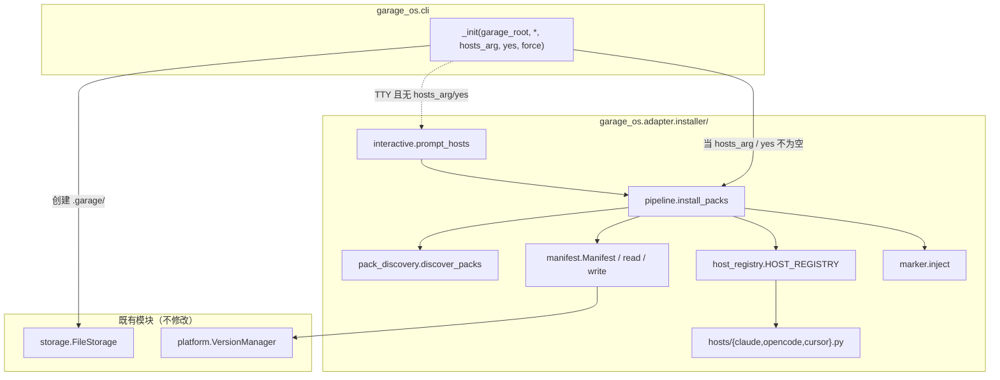
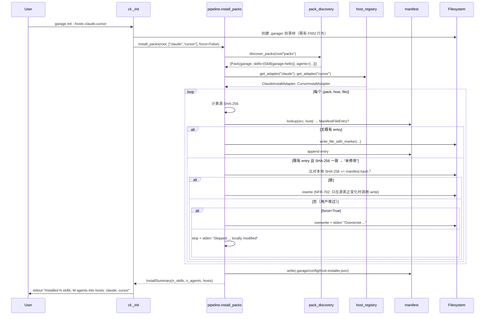

# D007: Garage Packs 与宿主安装器 设计

- 状态: 已批准（auto-mode approval；见 `docs/approvals/F007-design-approval.md`）
- 日期: 2026-04-19
- Revision: r2（按 design-review 7 项 finding 全部闭合后通过；详见 `docs/reviews/design-review-F007-garage-packs-and-host-installer.md`）
- 关联规格: `docs/features/F007-garage-packs-and-host-installer.md`（已批准）
- 关联批准记录: `docs/approvals/F007-spec-approval.md`
- 关联评审记录: `docs/reviews/spec-review-F007-garage-packs-and-host-installer.md`
- 关联前序代码: `src/garage_os/cli.py`、`src/garage_os/adapter/host_adapter.py`、`src/garage_os/adapter/claude_code_adapter.py`、`src/garage_os/platform/version_manager.py`
- 关联前序设计: `docs/designs/2026-04-15-garage-agent-os-design.md`、`docs/designs/2026-04-19-garage-knowledge-authoring-cli-design.md`

## 1. 概述

F007 把 "Garage 自带 skills/agents" 这件事拆成两层：

- **源**：仓库 `packs/<pack-id>/{skills,agents}/`，宿主无关；
- **动作**：`garage init` 在用户项目根（cwd）按用户选择的宿主子集，把源物化到该宿主的原生目录。

本设计**不修改任何已批准 contract**：

- F001 `HostAdapterProtocol`（`invoke_skill / read_file / write_file / get_repository_state`）零变更；
- F002 `garage init` 既有"只创建 `.garage/`"行为在缺省调用形态下完全保留（CON-702）；
- F003-F006 知识/经验/记忆/召回管道完全未触；
- 不引入新外部依赖（NFR-101 / 8 节"禁止新增 TUI 依赖"）。

设计原则保持不变：workspace-first、文件即契约、宿主无关、用户确认先于覆盖、第一天零配置可用。

## 2. 设计驱动因素

### 2.1 来自规格的核心驱动力（FR）

| FR | 设计承接要点 |
|---|---|
| FR-701 `packs/` 目录契约 | 新模块 `garage_os.adapter.installer.pack_discovery` 解析 `packs/<pack-id>/pack.json` + `skills/` + `agents/`；`packs/README.md` 与每个 `packs/<pack-id>/README.md` 落盘 |
| FR-702 `--hosts <list>` | `cli.py:build_parser()` 给 `init` subparser 加 `--hosts` / `--yes` / `--force`；解析逻辑复用 OpenSpec 风格 `all` / `none` / 逗号列表 |
| FR-703 交互式宿主选择 | 新模块 `garage_os.adapter.installer.interactive`：stdlib `input()` 循环，TTY 检测 `sys.stdin.isatty()`，non-TTY 退化为 `--hosts none` + stderr 提示 |
| FR-704 安装管道 | 新模块 `garage_os.adapter.installer.pipeline.install_packs()`：discover → 计算 (src,dst) 对 → 处理冲突 → 写入或追加；新增宿主时增量 `installed_hosts` |
| FR-705 安装清单 | 新模块 `garage_os.adapter.installer.manifest`：dataclass `InstallManifest` + 读写 `.garage/config/host-installer.json` |
| FR-706a 未修改幂等 | `pipeline.py` 计算目标内容 SHA-256，对比 manifest `content_hash`；相等且本地未改 → 仍按源覆盖（mtime 不刷新由 NFR-702 承接） |
| FR-706b 已修改保护 / `--force` | `pipeline.py` 在写入前检查 "本地 SHA-256 ≠ manifest hash"；默认跳过 + stderr `Skipped ... locally modified`；`--force` 时覆盖 + stderr `Overwrote locally modified file ...` |
| FR-707 host adapter 注册表 | 新模块 `garage_os.adapter.installer.host_registry`：`HostInstallAdapter` Protocol + `HOST_REGISTRY: dict[str, HostInstallAdapter]`；首批 3 个 adapter 在 `garage_os.adapter.installer.hosts.{claude,opencode,cursor}` |
| FR-708 安装标记块 | 选用 **YAML front matter 增字段** `installed_by: garage` + `installed_pack: <pack-id>` 方案（详见 §7 ADR-D7-2），不破坏宿主原生 SKILL.md / agent.md 解析 |
| FR-709 稳定 stdout/stderr 常量 | `cli.py` 顶部新增常量块 `INSTALLED_FMT` / `ERR_UNKNOWN_HOST_FMT` / `WARN_LOCALLY_MODIFIED_FMT` / `WARN_OVERWRITE_FORCED_FMT`，与 F005 `KNOWLEDGE_*_FMT` 同模式 |
| FR-710 文档 | `packs/README.md` + `docs/guides/garage-os-user-guide.md` 增 "Pack & Host Installer" 段 |

### 2.2 来自规格的非功能驱动力（NFR / CON）

| 驱动 | 设计承接 |
|---|---|
| NFR-701 宿主无关性（源） | adapter 是把 "中立 skill/agent + pack-id" 翻译为 "目标 (host, path)" 的唯一通道；`packs/` 内容与本设计正文均不出现 `.claude/` `.cursor/` `.opencode/` `claude-code` 等宿主关键字；CI 友好的 grep 测试见 §13 |
| NFR-702 性能 / 无写入 | 写入前先比 SHA-256；无变化时不调用 `Path.write_text`，从而不刷新 mtime |
| NFR-703 跨平台路径 | 全部使用 `pathlib.Path`；manifest 中 `src` / `dst` 通过 `as_posix()` 序列化 |
| NFR-704 零回归 | 新增模块在 `garage_os.adapter.installer.*`；`cli.py` 仅扩展 `_init()` 与 `build_parser()` 的 `init` 节点；现有 ≥496 个测试（F006 closeout 基线，与 spec NFR-704 一致）不动 |
| CON-701 adapter 模块位置 | 三个 first-class adapter 与 installer 子包整体放在 `src/garage_os/adapter/installer/`（位于既有 `src/garage_os/adapter/` 之下，与 `claude_code_adapter.py` 同包），与 F001 `HostAdapterProtocol` 命名空间共处但接口独立（不污染 protocol，详见 ADR-D7-1） |
| CON-702 不破坏 F002 行为 | 缺省 `garage init`（无 `--hosts` / `--yes` / 无 `packs/` / 无既有 manifest）输出**字节相同**于今天的 `Initialized Garage OS in <path>`；详见 §6.2 行为矩阵 |
| CON-703 schema_version 受 VersionManager 管控 | `host-installer.json` `schema_version: 1`；新模块 `manifest.py` 暴露 `MANIFEST_SCHEMA_VERSION = 1` 常量，`platform.VersionManager` 现有 schema 注册表追加一项 |
| CON-704 路径来源说明 | 用户指南显式说明 "`.claude/skills/...`" 等是宿主原生约定 |

### 2.3 现有系统约束

- `cli.py` 已是单文件 1759 行；本设计**不再扩**主 init 函数体量，新增逻辑全部进 `garage_os.adapter.installer.*`，`_init()` 只做"调用 installer + 打印 stdout marker"。
- `garage_os.adapter` 已含 `HostAdapterProtocol` 与 `ClaudeCodeAdapter`，是**运行时执行**适配器；本 cycle 的 `HostInstallAdapter` 是**安装期文件映射**适配器，**职责完全不同**，不能复用同一接口（详见 §7 ADR-D7-1）。
- `garage_os.platform.VersionManager` 已是契约 schema 版本管控的 home；本设计在该模块新增一条 `host-installer.json` 注册即可（向后兼容）。

### 2.4 设计目标

- 新增代码集中在新子包 `garage_os.adapter.installer/`，目录扁平、模块小且边界清晰；
- `cli.py` 增量 ≤ 80 行（仅 `init` subparser + 调用 + 文案常量）；
- 测试新增量预期 ~25-35 个，集中在 `tests/adapter/installer/` 新建子目录；
- 三个 first-class adapter 的目标路径参数化集中在一个 dataclass，**新增第 4 个宿主只需新增一个 adapter 子模块 + 注册表登记 1 行**。

## 3. 需求覆盖与追溯

| 规格需求 | 设计承接 | 主要落点 |
|---|---|---|
| FR-701 `packs/` 目录契约 | `pack_discovery.discover_packs(workspace_root) -> list[Pack]`；`Pack(id, version, schema_version, skills[], agents[])` dataclass | `adapter/installer/pack_discovery.py`、`packs/README.md`、`packs/<pack-id>/README.md`、`packs/garage/pack.json` |
| FR-702 `--hosts <list>` | `cli.build_parser()` 在 `init` subparser 加 `--hosts` / `--yes` / `--force`；`_resolve_hosts_arg(value, registry)` helper 复用 F005 风格 | `cli.py` |
| FR-703 交互式选择 + non-TTY 退化 | `interactive.prompt_hosts(registry, *, stdin, stderr)` 默认 `sys.stdin` / `sys.stderr`；`stdin.isatty()` False → 返回 `[]` + 写 stderr 提示 | `adapter/installer/interactive.py` |
| FR-704 安装管道 + 多次累加 | `install_packs(workspace_root, packs_root, hosts, *, force, manifest_io)` 主入口；返回 `InstallSummary` | `adapter/installer/pipeline.py` |
| FR-705 manifest schema | `Manifest(schema_version, installed_hosts, installed_packs, files[], installed_at)` + `ManifestFileEntry(src, dst, host, content_hash, pack_id)` | `adapter/installer/manifest.py` |
| FR-706a 未修改幂等 | `_decide_action(local_path, source_bytes, manifest_entry)` 返回 `WriteAction.UNCHANGED`/`UPDATE_FROM_SOURCE`/`SKIP_LOCALLY_MODIFIED`/`OVERWRITE_FORCED` | `adapter/installer/pipeline.py` |
| FR-706b `--force` 路径 | 同上 helper；`--force=True` 时把 `SKIP_LOCALLY_MODIFIED` 升级为 `OVERWRITE_FORCED` | `adapter/installer/pipeline.py` |
| FR-707 host adapter 注册表 | `HostInstallAdapter` Protocol；`HOST_REGISTRY: dict[str, HostInstallAdapter]` 字面声明 3 项；`get_adapter(host_id)` / `list_host_ids()` | `adapter/installer/host_registry.py`、`adapter/installer/hosts/{claude,opencode,cursor}.py` |
| FR-708 安装标记块 | YAML front matter 增 `installed_by: garage` / `installed_pack: <pack-id>` 字段；写入前由 `_inject_marker(content, pack_id)` 处理；agent.md 若**无** front matter 则按 §10.4 容错策略：仅记录 manifest content_hash、不抛错；只有 SKILL.md（按 anatomy 必有 front matter）解析失败才抛 `MalformedFrontmatterError` | `adapter/installer/marker.py`（新模块）+ adapter 默认 `render` |
| FR-709 stdout/stderr 常量 | `cli.py` 顶部 `INSTALLED_FMT = "Installed {n_skills} skills, {n_agents} agents into hosts: {hosts}"` 等 | `cli.py` |
| FR-710 文档 | `packs/README.md`、`docs/guides/garage-os-user-guide.md`（新增段落）、`packs/garage/pack.json` + 1 占位 skill | 仓库 `packs/`、`docs/guides/` |
| NFR-701 宿主无关性扫描 | `tests/adapter/installer/test_neutrality.py`：grep `packs/` 黑名单关键字 0 命中 | `tests/adapter/installer/` |
| NFR-702 无写入幂等 | `tests/adapter/installer/test_idempotent.py` 比 `Path.stat().st_mtime_ns` 不变 | `tests/adapter/installer/` |
| NFR-703 跨平台路径 | manifest 序列化用 `Path(...).as_posix()`；解析用 `PurePosixPath` | `adapter/installer/manifest.py` |
| NFR-704 零回归 | 新模块独立；现有 ≥496 个测试（F006 closeout 基线）不改 | `tests/` 整体 |
| CON-701 adapter 位置 | 子包路径 `src/garage_os/adapter/installer/hosts/`（位于既有 `src/garage_os/adapter/` 之下，符合 spec CON-701 字面要求） | `adapter/installer/hosts/` |
| CON-702 不破坏 F002 | `_init()` 在没有任何 `--hosts*` 参数 + 无 TTY 提示 + `packs/` 缺失 + 无既有 manifest 时**早返回**，输出唯一行 `Initialized Garage OS in <path>` | `cli.py:_init` |
| CON-703 schema_version | `MANIFEST_SCHEMA_VERSION = 1` + 在 `version_manager.py` 注册 entry | `adapter/installer/manifest.py`、`platform/version_manager.py` |
| CON-704 路径来源 | 用户指南文案 | `docs/guides/garage-os-user-guide.md` |

## 4. 架构模式选择

按 `references/architecture-patterns.md`：

- **Hexagonal / Ports & Adapters**：本 cycle 的 `HostInstallAdapter` Protocol 是 port，三个 host 实现是 adapter；与 F001 `HostAdapterProtocol` 模式同构（不同 port）。
- **Pipeline**：`install_packs()` 主流程是清晰的 `discover → resolve targets → decide actions → apply → write manifest` 五阶段，每阶段函数纯净、可独立测试。
- **YAGNI / Local-only**：Solo + 本地运行，不引入插件机制 / 服务发现 / 远程 pack 仓库（明确在 F007 § 5 deferred）。

排除：
- 不用插件/动态加载（YAGNI；3 个 first-class adapter 直接在注册表字面声明即可）；
- 不用模板引擎（adapter 默认 `render` 为透传 + 可选 marker 注入，无需 Jinja2 等额外依赖）。

## 5. 候选方案总览

讨论 3 个候选方案，最终选 A。后续 §6 给出对比矩阵，§7 ADR 记录决策。

### 5.1 方案 A — 在既有 `src/garage_os/adapter/` 之下新增 `installer/` 子包 + `HostInstallAdapter` Port（推荐）

- **核心**：在既有 `src/garage_os/adapter/` 包下新建 `installer/` 子包（与 `claude_code_adapter.py` 同包），把 pack 发现 / adapter 注册表 / 三个 host adapter / manifest / 主管道 / 交互式 prompt / marker 注入分别放到独立小模块；`cli.py` 仅薄包装。
- **CON-701 满足度**：位置位于 `src/garage_os/adapter/` 之下（spec CON-701 Must 的字面要求："如 design 阶段决定新增 `host_installer/` 子包，仍应位于 `src/garage_os/adapter/` 之下"）。
- **耦合面**：仅消费 `pathlib` / `hashlib` / `json` / `yaml`（已有依赖）和 `garage_os.platform.VersionManager`（注册 schema）。
- **测试**：每个小模块独立可测，预计 25-35 个用例。

### 5.2 方案 B — 复用 `garage_os.adapter/` + 在现有 `HostAdapterProtocol` 加方法

- **核心**：把 `target_skill_path` / `target_agent_path` 加到 F001 `HostAdapterProtocol`，三个 adapter 都长在 `garage_os.adapter/{claude_code,open_code,cursor}_adapter.py`。
- **问题**：F001 protocol 的语义是 *运行时执行*（`invoke_skill / read_file / ...`），混入 *安装期文件映射* 会让接口职责漂移；`ClaudeCodeAdapter` 还需要凭空实现 `target_*_path`，但它今天根本不关心这件事。
- **结论**：违反"模块职责单一"，CON-701 的"位置在 `src/garage_os/adapter/` 之下"可以通过 §5.1 的子包形态满足，无需污染 F001 protocol。

### 5.3 方案 C — `cli.py` 内联实现，所有逻辑写进 `_init()`

- **核心**：不新建模块，所有 pack 发现 / adapter 字面表 / 安装逻辑全堆进 `cli.py`，沿用 F005 `_knowledge_*` 全在 cli.py 内的传统。
- **问题**：F005 的 `_knowledge_*` 都是薄包装（5-30 行），本 cycle 安装管道有 5 个阶段、3 个 adapter、manifest 读写、marker 注入、TTY 交互，估算 ≥ 600 行；与 F005 设计原则 "把代码增量限制在 cli.py" 表面相似但**单元规模 20 倍以上**，会让 `cli.py` 突破 2300 行，可读性显著退化。
- **结论**：不可取。

## 6. 候选方案对比与 trade-offs

| 方案 | 核心思路 | 优点 | 主要代价 / 风险 | NFR / 约束适配 | 可逆性 |
|---|---|---|---|---|---|
| **A 独立子包**（推荐） | `src/garage_os/adapter/installer/` 子包 + 新 `HostInstallAdapter` Port | 模块小、职责清晰、单元可测；与 F001 运行时 adapter 解耦；新增宿主成本低 | 需要新子包目录 + 新增 6-7 个文件；初期文件数比 C 多 | NFR-704 零回归 ✓；CON-701 字面满足（位于 `src/garage_os/adapter/` 之下）✓；NFR-702 易实现 | **高**（不影响任何既有 contract，未来可以平移到独立 sdist） |
| B 复用 F001 adapter | 把 `target_*_path` 加到 `HostAdapterProtocol` | 看起来"adapter 集中一处" | 污染运行时 protocol 职责；`ClaudeCodeAdapter` 必须实现一个它根本不关心的方法；后续 adapter 必须同时实现运行时 + 安装两类方法 | NFR-101 宿主无关性可保；但接口职责漂移 | 中（一旦发布 protocol 变化，所有未来 adapter 必须遵守，回退成本高） |
| C cli.py 内联 | 所有逻辑塞进 `_init()` | 0 新模块、最少 import | `cli.py` 估增长 ≥ 600 行突破 2300 行；TTY/manifest/marker 各种关注点纠缠；adapter 注册表退化为 if/elif 链 | NFR-704 ✓ 但 NFR 测试组织混乱 | 低（重构成本会随测试堆积上升） |

`主要代价 / 风险` 列均显式给出，不允许空白。

## 7. 选定方案与关键决策（ADR 摘要）

### ADR-D7-1 — 安装期 adapter 与运行时 adapter 是不同 port，独立接口

- **上下文**：F001 `HostAdapterProtocol` 已稳定（4 方法：invoke / read / write / repo_state），其语义是 *runtime execution*。本 cycle 引入的 `target_skill_path` / `target_agent_path` / 可选 `render` 是 *install-time path mapping*。
- **决策**：在 `garage_os.adapter.installer.host_registry` 新建独立 Protocol `HostInstallAdapter`，与 `HostAdapterProtocol` 同名空间但不同 port。`ClaudeCodeAdapter`（F001）与 `ClaudeInstallAdapter`（F007）可以是不同类，分别处于 `src/garage_os/adapter/claude_code_adapter.py` 与 `src/garage_os/adapter/installer/hosts/claude.py`。
- **后果**：（+）职责单一、未来 adapter 类只需实现自己关心的接口；（−）"Claude" 这一概念在仓库中有两个类，需在文档说明命名分工。
- **可逆性**：高（两个 protocol 互不感知，未来可在 `garage_os.adapter` 下再加 facade 不影响现状）。

### ADR-D7-2 — 安装标记块用 YAML front matter 增字段，而非 HTML 注释

- **上下文**：F007 FR-708 允许两种实现：HTML 注释或 front matter 增字段。
- **决策**：用 YAML front matter 增 `installed_by: garage` + `installed_pack: <pack-id>` 两个字段。源 SKILL.md 已有 `name` / `description` 两字段，注入两个新字段不影响 Anthropic SKILL.md / Cursor / OpenCode 任一现有解析（皆为容忍未知 key 的 YAML）。HTML 注释方案在 SKILL.md 中也技术可行，但 (a) 多数宿主把首段视为 description 渲染 source，HTML 注释可能被原样显示；(b) front matter 字段更易于 grep 与机读。
- **后果**：（+）对宿主无副作用、可被 manifest content_hash 复算；（−）必须在写入前对源做轻量 YAML 头部解析与重写。
- **可逆性**：中（一旦开始注入字段，回退需要在 r2 升级时清理已安装文件）。

### ADR-D7-3 — 三宿主 first-class skill / agent path pattern 与来源依据

承接 spec ASM-701 缓解措施 ("design 阶段为每个 adapter 显式记录 path-pattern 来源")，对 3 个 first-class 宿主一次性固化路径并标注来源：

| 宿主 | skill 路径 | agent 路径 | 来源依据 |
|---|---|---|---|
| Claude Code (`claude`) | `.claude/skills/<name>/SKILL.md` | `.claude/agents/<name>.md` | OpenSpec `docs/supported-tools.md` 第 `claudeAdapter` 行；Anthropic Claude Code 官方 skills 文档约定 |
| OpenCode (`opencode`) | `.opencode/skills/<name>/SKILL.md` | `.opencode/agent/<name>.md` | OpenSpec `docs/supported-tools.md` 第 `opencodeAdapter` 行（注意：opencode 历史上 agent 目录为单数 `agent/`，与 skills 复数不同；以 OpenSpec 实测路径为准） |
| Cursor (`cursor`) | `.cursor/skills/<name>/SKILL.md` | （不支持，`target_agent_path` 返回 `None`） | OpenSpec `docs/supported-tools.md` 第 `cursorAdapter` 行（`.cursor/skills/openspec-*/SKILL.md` 已有先例）；Cursor 当前无原生 agent surface |

**Cursor surface 特别说明**（承接 F007 § 11 OQ-1）：Cursor 同时存在 `.cursor/rules/*.mdc`（始终加载的 context）与 `.cursor/skills/<name>/SKILL.md`（agent-invokable skill）两套机制。本设计选 `.cursor/skills/`，理由：(a) 与 Anthropic SKILL.md 规格同构、源文件零转换直装；(b) `.cursor/rules/*.mdc` 语义是"始终加载"，对 30+ 个 HF skills 一次性塞入会污染 context；(c) 已有 OpenSpec 先例。

- **后果**：（+）三个 first-class adapter 共享同一 SKILL.md 形态、源文件无需多版本；（−）Cursor 较旧版本可能不识别 skills 目录，可在用户指南显式提示（R2 风险条目）。
- **可逆性**：高（更换任一宿主路径只需改对应 `hosts/<host>.py` adapter 一行字面值）。

### ADR-D7-4 — 单一 `packs/garage/` 起步；多 pack 留给 F008+

- **上下文**：F001 `CON-002` 写过 `packs/coding/skills/` + `packs/product-insights/skills/`，但本 cycle 显式延后了 HF skills 真正搬迁（F007 § 5）。
- **决策**：本 cycle 仅新建一个占位 pack `packs/garage/`，含 1 个 sample skill `garage-hello` 与 1 个 sample agent `garage-sample-agent`。`packs/README.md` 显式说明"未来将拆分 `packs/coding/` 与 `packs/product-insights/`，本 cycle 暂以单 pack 起步"。
- **后果**：（+）安装管道、conflict 检测、多 pack 排序逻辑全部已具备，未来 F008 把 HF skills 搬到 `packs/coding/` 时代码 0 改动；（−）conflict 检测的"同名 skill 跨 pack 失败"路径在本 cycle 内无自然触发样本，靠测试 fixture 临时新建第 2 个 pack 来覆盖。
- **可逆性**：高。

### ADR-D7-5 — 交互式 prompt 用 stdlib `input()` + `[y/N]` 循环

- **上下文**：F007 § 8 禁止新增 TUI 依赖；§ 11 OQ-3 要求 design 选型。
- **决策**：每个已知宿主单独问一次 `Install Garage packs into <host-id>? [y/N]:`，按回车默认 N；额外支持 `a` / `n` 快捷键（all / none）跳过剩余问题。non-TTY 时根本不触发本路径（FR-703）。
- **后果**：（+）零依赖、简单可靠；（−）UX 比 checkbox 多选朴素。
- **可逆性**：高。

## 8. 架构视图

### 8.1 模块/组件关系



### 8.2 关键交互序列：`garage init --hosts claude,cursor`



### 8.3 数据视图：`InstallManifest`

```jsonc
{
  "schema_version": 1,
  "installed_hosts": ["claude", "cursor"],
  "installed_packs": ["garage"],
  "installed_at": "2026-04-19T11:42:00",
  "files": [
    {
      "src": "packs/garage/skills/garage-hello/SKILL.md",
      "dst": ".claude/skills/garage-hello/SKILL.md",
      "host": "claude",
      "pack_id": "garage",
      "content_hash": "<sha256-of-installed-bytes>"
    },
    {
      "src": "packs/garage/skills/garage-hello/SKILL.md",
      "dst": ".cursor/skills/garage-hello/SKILL.md",
      "host": "cursor",
      "pack_id": "garage",
      "content_hash": "<sha256-of-installed-bytes>"
    }
  ]
}
```

`content_hash` 是**安装到目标位置的最终字节** SHA-256（即包含 marker 注入后的内容），让幂等比对在"目标文件 vs manifest"层完成、不引入对源的二次哈希。

## 9. 模块职责与边界

| 模块 | 职责 | 不做 |
|---|---|---|
| `adapter/installer/__init__.py` | 暴露 `install_packs` / `HostInstallAdapter` / `MANIFEST_SCHEMA_VERSION` 三个公开 symbol，让 `cli.py` 与测试只需 `from garage_os.adapter.installer import ...` | 不放业务逻辑 |
| `adapter/installer/pack_discovery.py` | 扫描 `packs/` 目录、解析 `pack.json`、构造 `Pack(id, version, schema_version, skills[], agents[])` dataclass；解析 `packs/<pack-id>/README.md` 但只读取存在性（不强制结构） | 不读 SKILL.md 内容（推迟到 marker 注入步） |
| `adapter/installer/host_registry.py` | 定义 `HostInstallAdapter` Protocol；维护 `HOST_REGISTRY: dict[str, HostInstallAdapter]`；提供 `get_adapter(id)` / `list_host_ids()` / `resolve_hosts_arg(arg, registry)` | 不发现或动态加载 adapter |
| `adapter/installer/hosts/claude.py` | Claude Code adapter：`target_skill_path` 返回 `Path(".claude/skills") / skill_id / "SKILL.md"`；`target_agent_path` 返回 `Path(".claude/agents") / f"{agent_id}.md"`（来源：ADR-D7-3 表第 1 行） | 不调用 Claude Code API；不写文件 |
| `adapter/installer/hosts/opencode.py` | OpenCode adapter：`target_skill_path` 返回 `Path(".opencode/skills") / skill_id / "SKILL.md"`；`target_agent_path` 返回 `Path(".opencode/agent") / f"{agent_id}.md"`（来源：ADR-D7-3 表第 2 行） | 同上 |
| `adapter/installer/hosts/cursor.py` | Cursor adapter：`target_skill_path` 返回 `Path(".cursor/skills") / skill_id / "SKILL.md"`；`target_agent_path` 返回 `None`（来源：ADR-D7-3 表第 3 行；Cursor 当前无原生 agent surface，跳过物化） | 同上 |
| `adapter/installer/manifest.py` | `Manifest` / `ManifestFileEntry` dataclass；`read_manifest(garage_dir)` / `write_manifest(garage_dir, manifest)`；`MANIFEST_SCHEMA_VERSION = 1` | 不决定何时写、不做 hash 比较 |
| `adapter/installer/marker.py` | `inject(content: str, pack_id: str, source_kind: Literal["skill","agent"]) -> str`：见 §10.4 容错策略；`extract_marker(content) -> Optional[dict]` | 不重写源 |
| `adapter/installer/pipeline.py` | `install_packs(workspace_root, packs_root, hosts, *, force, manifest_io, fs_io)` 主入口；编排 discover → resolve → decide → write → manifest；返回 `InstallSummary` | 不做 TTY 提示 |
| `adapter/installer/interactive.py` | `prompt_hosts(registry, *, stdin, stderr) -> list[str]` stdlib 实现；TTY 检测；non-TTY 退化 | 不做安装 |
| `cli.py` (扩展) | 在 `_init()` 末尾增 host installer 调用；新增 stdout / stderr 文案常量；`build_parser()` 在 `init` subparser 加 `--hosts` / `--yes` / `--force` | 不实现安装逻辑 |
| `platform/version_manager.py` (微改) | 注册 `host-installer.json` schema | 不改既有 schema |

## 10. 数据流、控制流与关键交互

### 10.1 主控制流（`_init`）

```python
# 伪流程，仅用于设计沟通；不是任务实现的最终代码
def _init(garage_root, *, hosts_arg=None, yes=False, force=False, stdin=None, stderr=None):
    # 1. 既有 F002 行为：创建 .garage/ 目录、README、platform.json、host-adapter.json
    _create_garage_dirs(garage_root)        # 同今天行为，保持字节相同输出

    # 2. 解析 hosts 选择
    hosts = _resolve_init_hosts(
        hosts_arg=hosts_arg, yes=yes,
        registry=HOST_REGISTRY,
        stdin=stdin or sys.stdin, stderr=stderr or sys.stderr,
    )
    # _resolve_init_hosts:
    #   - 显式 --hosts 字符串 → resolve_hosts_arg(arg)
    #   - --yes 无 --hosts → 视为 --hosts none
    #   - 都没有 + TTY → interactive.prompt_hosts(registry)
    #   - 都没有 + non-TTY → 写 stderr 提示，返回 []

    if not hosts:
        # 与 F002 字节相同的早返回路径（CON-702）
        return 0

    # 3. 调用安装管道
    summary = install_packs(
        workspace_root=garage_root,
        packs_root=garage_root / "packs",
        hosts=hosts,
        force=force,
    )

    # 4. 打印 stable marker
    print(INSTALLED_FMT.format(
        n_skills=summary.n_skills, n_agents=summary.n_agents,
        hosts=", ".join(sorted(hosts)),
    ))
    return 0
```

### 10.2 写入决策表（`installer._decide_action`）

| 既有 manifest entry | 本地文件存在 | 本地 SHA-256 == manifest hash | force | 决策 | stderr |
|---|---|---|---|---|---|
| 无 | 无 | — | — | `WRITE_NEW` | — |
| 无 | 有 | — | False | `SKIP_LOCALLY_MODIFIED`（本地已有同路径手写） | `Skipped ...` |
| 无 | 有 | — | True | `OVERWRITE_FORCED` | `Overwrote ...` |
| 有 | 有 | True | — | `UPDATE_FROM_SOURCE`（按 NFR-702 仅在源 hash 与已写入 hash 不一致时实际触发 write） | — |
| 有 | 有 | False | False | `SKIP_LOCALLY_MODIFIED` | `Skipped ... locally modified` |
| 有 | 有 | False | True | `OVERWRITE_FORCED` | `Overwrote locally modified file ...` |
| 有 | 无 | — | — | `WRITE_NEW`（用户删过；按 manifest 重新拉回） | — |

### 10.3 同名 skill 跨 pack 冲突检测（FR-704 验收 #4）

`install_packs` 在 discover 完成、按 host 展开 `(src, dst)` 之前，对所有 `(host, dst)` 二元组做去重检测：

- 若两个不同 `src`（如 `packs/garage/skills/foo/SKILL.md` 与 `packs/coding/skills/foo/SKILL.md`）映射到同一 `dst`（如 `.claude/skills/foo/SKILL.md`），立即抛 `ConflictingSkillError`，cli 层捕获并以退出码 2 退出，stderr 列出 `pack_a / pack_b / dst`。
- 该路径在本 cycle 内无 production fixture，但有专门测试 fixture（临时新建第 2 个 pack）覆盖；ADR-D7-4 已说明。

### 10.4 marker.inject 容错策略（消化 §13 / §14 之前的歧义）

`marker.inject(content, pack_id, source_kind)` 按 `source_kind` 分两路处理：

| `source_kind` | 源是否必有 front matter | 缺失/解析失败时的行为 |
|---|---|---|
| `"skill"` | **必有**（`docs/principles/skill-anatomy.md` 已强制 SKILL.md 必含 `name` / `description` 两字段） | 抛 `MalformedFrontmatterError` → cli 退出码 1 + stderr 指明源文件；属于"作者写的 skill 不合 anatomy"的硬错 |
| `"agent"` | 不强制 | 容错：`inject` 在源前部插入一段最小 YAML front matter `installed_by: garage` + `installed_pack: <pack-id>`（用 `---` 包裹）；不抛错；目标文件首行起为新 front matter，原内容紧随其后 |

这条策略统一 §13 `test_marker.py` 的"agent.md 无 front matter 容错"用例与 §14 `MalformedFrontmatterError` 的"SKILL.md 解析失败硬错"。两者不冲突：前者是 agent.md 的合法路径，后者只针对 SKILL.md。`hf-tasks` 应据此在 T3 任务中明确 marker 模块只暴露 `inject(content, pack_id, source_kind: Literal["skill","agent"])` 与 `extract_marker(content)` 两个公开 symbol。

## 11. 接口、契约与关键不变量

### 11.1 `HostInstallAdapter` Protocol（`adapter/installer/host_registry.py`）

```python
@runtime_checkable
class HostInstallAdapter(Protocol):
    host_id: str       # "claude" / "opencode" / "cursor" / ...

    def target_skill_path(self, skill_id: str) -> Path: ...
    def target_agent_path(self, agent_id: str) -> Optional[Path]: ...
    def render(self, content: str) -> str: ...   # 默认 lambda c: c
```

不变量：

- `target_skill_path` 必须返回**相对于项目根**的相对 `Path`；
- `target_agent_path` 返回 `None` 表示该宿主不支持 agent surface（cursor adapter 默认就是 `None`）；
- `host_id` 必须等于在 `HOST_REGISTRY` 字典中的 key；
- `render` 默认透传；adapter 可重写以追加宿主特定元数据。

### 11.2 `Manifest` 不变量

- `schema_version` 固定为 `MANIFEST_SCHEMA_VERSION = 1`；
- `installed_hosts` 与 `installed_packs` 元素无重复且按 ASCII 升序排序；
- `files[]` 按 `(src, dst)` 字典序排序，让 `git diff` 稳定；
- `installed_at` 是写入 manifest 那一刻的 ISO-8601；
- `content_hash` 是 SHA-256 hex（`hashlib.sha256(bytes).hexdigest()`）。

### 11.3 `pack.json` 字段

```json
{
  "schema_version": 1,
  "pack_id": "garage",
  "version": "0.1.0",
  "description": "Garage 自带的占位 pack；后续将分流到 coding / product-insights",
  "skills": ["garage-hello"],
  "agents": ["garage-sample-agent"]
}
```

字段含义与不变量：

- `schema_version`：固定 `1`，接入 VersionManager 注册表（CON-703）。
- `pack_id`：必须等于目录名（如 `packs/garage/` → `pack_id: "garage"`），`pack_discovery` 不一致时抛 `InvalidPackError`。
- `version`：pack 自身版本（语义版本字符串），目前不参与安装决策，留作未来 `garage update` 使用。
- `description`：人类可读说明。
- `skills[]`：本 pack 包含的 skill id 清单（与 `packs/<pack-id>/skills/<skill-id>/SKILL.md` 的 `<skill-id>` 一一对应）；用于满足 **FR-701 验收 #1** 的"Agent 仅读 `pack.json` + `packs/README.md` 就能回答 '包含哪些 skill 名'"。`pack_discovery` 启动时校验 `skills[]` 与磁盘扫描结果一致，不一致抛 `PackManifestMismatchError`，提示作者更新 `pack.json`。
- `agents[]`：同上，针对 `agents/<agent-id>.md` 子目录；可为空数组。

此外，**每个 pack 必须有 `packs/<pack-id>/README.md`**（本 cycle 占位 pack `packs/garage/README.md` 由 T1 提供）：人类可读概述，最少包含 pack 用途 + skill / agent 清单链接。`packs/README.md`（顶层）说明全局目录约定；两层 README 共同构成自描述链，让任何 Agent 仅凭 `packs/README.md` + `packs/<pack-id>/README.md` + `pack.json` 三份文件就能完整理解 pack 内容（与 spec FR-701 验收 #1 + design-principles § 4 自描述原则一致）。

## 12. 非功能需求与约束落地

| NFR / CON | 落地点 | 验证方式 |
|---|---|---|
| NFR-701 宿主无关 | `packs/` 内容只走 adapter；`tests/adapter/installer/test_neutrality.py` grep 黑名单 | 自动化测试 |
| NFR-702 性能 / 无写入 | `_decide_action` 决策为 `UPDATE_FROM_SOURCE` 时仍比对 `Path.read_bytes()` 与 `inject(source, pack_id)` 的 SHA-256，相等则不调 `write_text`；`tests/adapter/installer/test_idempotent.py` 比 `st_mtime_ns` | 自动化测试 |
| NFR-703 跨平台路径 | `manifest.write` 使用 `Path(...).as_posix()`；`Manifest.from_dict` 使用 `PurePosixPath` | 自动化测试 |
| NFR-704 零回归 | 不修改任何既有模块的公开 API；只新增 `adapter/installer/` 子包 + cli.py extend；`pytest tests/ -q` 整体 ≥ F006 closeout 基线 (≥496) | 自动化测试 |
| CON-701 adapter 位置 | 子包路径在 `src/garage_os/adapter/installer/hosts/` | 代码组织 |
| CON-702 不破坏 F002 | `_init()` 缺省路径输出字节相同；`tests/test_cli.py::TestInitDefaultUnchanged` | 自动化测试 |
| CON-703 schema_version | `MANIFEST_SCHEMA_VERSION = 1` 注册到 `version_manager.py`；`test_version_manager.py` 增 1 用例 | 自动化测试 |
| CON-704 路径来源 | 用户指南文案 + `packs/README.md` | 文档 review |

## 13. 测试与验证策略

最薄端到端 walking skeleton（hf-test-driven-dev 第一个迭代要做的最小事）：

1. 临时仓库 `tmp_path/`，写入最小 `packs/garage/pack.json` + 1 个 SKILL.md；
2. 调用 `install_packs(tmp_path, tmp_path/"packs", ["claude"], force=False)`；
3. 断言 `(tmp_path / ".claude/skills/garage-hello/SKILL.md").read_text()` 含原 description + 注入的 `installed_by: garage`；
4. 断言 `.garage/config/host-installer.json` schema_version=1、files[] 含 1 entry。

此 walking skeleton 在 1 个测试函数内完成 end-to-end 路径验证。

新增测试矩阵（预计 25-35 个用例，按 FR/NFR 编号映射，集中在 `tests/adapter/installer/`）：

| 测试模块 | 覆盖范围 | 估计用例数 |
|---|---|---|
| `tests/adapter/installer/test_pack_discovery.py` | FR-701: 空目录 / 单 pack / 缺 pack.json / schema_version 错误 | 4-5 |
| `tests/adapter/installer/test_host_registry.py` | FR-707: `list_host_ids` 排序、`get_adapter("notarealtool")` 抛错、`resolve_hosts_arg("all"/"none"/"a,b")` | 5-6 |
| `tests/adapter/installer/test_hosts.py` | 三个 adapter 的 `target_skill_path` / `target_agent_path` 字面值 + `cursor.target_agent_path == None` | 4-5 |
| `tests/adapter/installer/test_manifest.py` | FR-705: schema_version、ISO-8601、SHA-256、排序、读写 round-trip、CON-703 VersionManager 注册 | 4-5 |
| `tests/adapter/installer/test_marker.py` | FR-708: SKILL.md front matter 注入、已存在字段不覆写、agent.md 无 front matter 时按 §10.4 容错（不抛错）、SKILL.md 解析失败抛 `MalformedFrontmatterError` | 4-5 |
| `tests/adapter/installer/test_pipeline.py` | FR-704 / FR-706a / FR-706b: WRITE_NEW、UPDATE_FROM_SOURCE、SKIP_LOCALLY_MODIFIED、OVERWRITE_FORCED、新增 host 追加、**同名 skill 跨 pack 冲突退出码 2**（**测试 fixture 临时构造 `packs_a/`、`packs_b/` 两个 pack 各含同名 `foo` skill**，详见 §10.3 / ADR-D7-4） | 6-8 |
| `tests/adapter/installer/test_interactive.py` | FR-703: TTY 走 prompt、non-TTY 退化、`a` / `n` 快捷键、用户回车默认 N | 4-5 |
| `tests/adapter/installer/test_neutrality.py` | NFR-701: grep 黑名单 0 命中 | 1 |
| `tests/adapter/installer/test_idempotent.py` | NFR-702: mtime 不刷新 | 1-2 |
| `tests/test_cli.py::TestInitWithHosts` | CLI 集成：`--hosts claude` / `--hosts unknownhost`（退出码 1 + .garage/ 仍创建）/ 缺省 init 字节相同（CON-702）/ stdout marker | 4-5 |

零回归保护：

- 既有 `tests/` 总数 ≥ 旧基线（F006 closeout 时 **≥496**，与 spec NFR-704 / task-progress 表述一致）；
- `pytest tests/ -q` 全绿；
- F005/F006 既有 stdout marker 字符串不变。

## 14. 失败模式与韧性策略

| 失败模式 | 触发条件 | 缓解 |
|---|---|---|
| `packs/` 不存在或为空 | 首次安装 / 无内容 | `discover_packs` 返回空列表；`install_packs` 直接写入空 manifest，stdout `No packs found under packs/` |
| `pack.json` 缺失或非法 JSON | 用户手写出错 | `pack_discovery` 抛 `InvalidPackError`，cli 退出码 1，stderr 指明 pack 目录 |
| 同名 skill 跨 pack 冲突 | 多 pack 场景 | `install_packs` 抛 `ConflictingSkillError`，cli 退出码 2，stderr 列出冲突 pack/dst |
| 目标宿主目录不可写 | 权限问题 | 让 `OSError` 自然冒泡到 `cli.main()`，捕获后**退出码 1**（与"未知 host" / "marker 解析失败"同属 input/environment 类硬错；区别于"同名 skill 冲突"的退出码 2 业务冲突）+ stderr 指明 dst 路径与底层 `OSError` 描述。manifest 写入是最后一步，部分写入可在下一次 init 自然 reconcile |
| YAML front matter 解析失败（marker 注入 SKILL.md） | 源 SKILL.md 不符合 anatomy（与 agent.md 无 front matter 不同，见 §10.4） | `marker.inject` 抛 `MalformedFrontmatterError`，cli **退出码 1**，stderr 指明源文件 |
| `--hosts` 含未知宿主 | 用户拼错 / 未支持 | `resolve_hosts_arg` 抛 `UnknownHostError`；`_init` 已先创建 `.garage/`（CON-702 兼容），再退出码 1 + stderr `Unknown host: <name>. Supported hosts: ...` |
| 用户中断（Ctrl-C）在交互 prompt | TTY 场景 | `KeyboardInterrupt` 直接冒泡，本 cycle 不做特殊处理；`.garage/` 已创建即视为部分成功 |
| Manifest schema_version 不被识别 | 未来升级回滚 | `read_manifest` 调 `VersionManager.check_compatibility`，不兼容时报错并提示 `garage init --force` 重置 |

## 15. 任务规划准备度

以下边界已稳定，可进入 `hf-tasks`：

- 模块拆分清晰（§9）；
- 接口契约明确（§11）；
- 测试矩阵已映射到 FR/NFR（§13）；
- 失败模式已覆盖（§14）；
- 4 条非阻塞 OQ 已通过 ADR 收敛（§7）；
- 与既有契约的不变量已校验（§2.3）。

`hf-tasks` 应能产出大致这样的任务列表（仅供示意，不替代任务计划）：

- T1：`packs/` 契约 + 占位 pack + `packs/README.md`
- T2：`adapter/installer/host_registry` + `adapter/installer/hosts/{claude,opencode,cursor}`
- T3：`adapter/installer/{pack_discovery, manifest, marker, pipeline}` + 测试矩阵
- T4：`cli.py` 集成 + `interactive.py` + 用户指南
- T5：CON-703 VersionManager 注册 + 文档收尾

## 16. 关键决策记录（ADR 摘要）

见 §7 ADR-D7-1 ~ ADR-D7-5。

## 17. 明确排除与延后项

复述 F007 § 5 deferred backlog（无新增）：

- HF skills 真正搬迁到 `packs/`（F008 候选）；
- `garage uninstall` / `garage update --hosts`（F008 候选）；
- 全局安装到 `~/.claude/skills/...`（OpenSpec issue #752 模式，单独候选）；
- 新增宿主（Codex / Gemini CLI / Windsurf / Copilot 等，F008+ 增量候选）；
- Pack 远程分发 / Marketplace / lockfile（Stage 3+）；
- 反向同步（用户改宿主目录回流到 `packs/`）（单独候选）；
- 安装时的 LLM 辅助选择（单独探索性候选）。

本设计也不引入：

- 任何 TUI 依赖（NFR-101）；
- 任何插件 / 动态加载机制（YAGNI）；
- 任何模板引擎（YAGNI）；
- 任何对宿主进程 / 配置文件的写入（FR-707 Statement 已限定）。

## 18. 风险与开放问题

### 阻塞性

无。

### 非阻塞性（hf-tasks 阶段或更晚处理）

- **R1**（informational）：F007 § 4.1 包含表与 § 12 术语表内 `target_skill_path / target_agent_path / render` 速记可在本设计落地后回填一次（与 ADR-D7-1 命名对齐）；不阻塞实现。
- **R2**：Cursor `.cursor/skills/` 在某些用户的 Cursor 版本可能不被识别（ADR-D7-3 已说明）；缓解为用户指南显式提示，未来 F008 可考虑 fallback 到 `.cursor/rules/`。
- **R3**：`_init` 现有签名 `def _init(garage_root: Path) -> None` 需扩展为接受 hosts/yes/force；调用方主要是 `cli.main()` 与单元测试，扩展点都明确，无阻塞。

