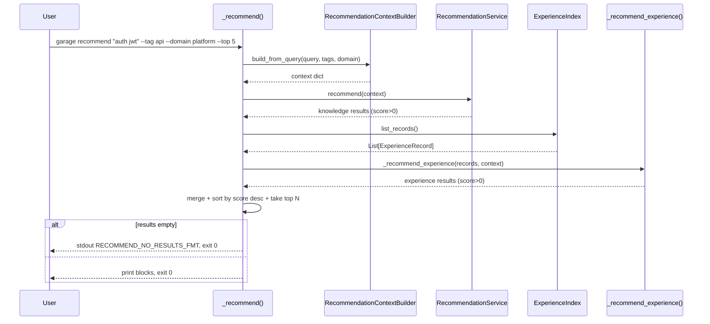
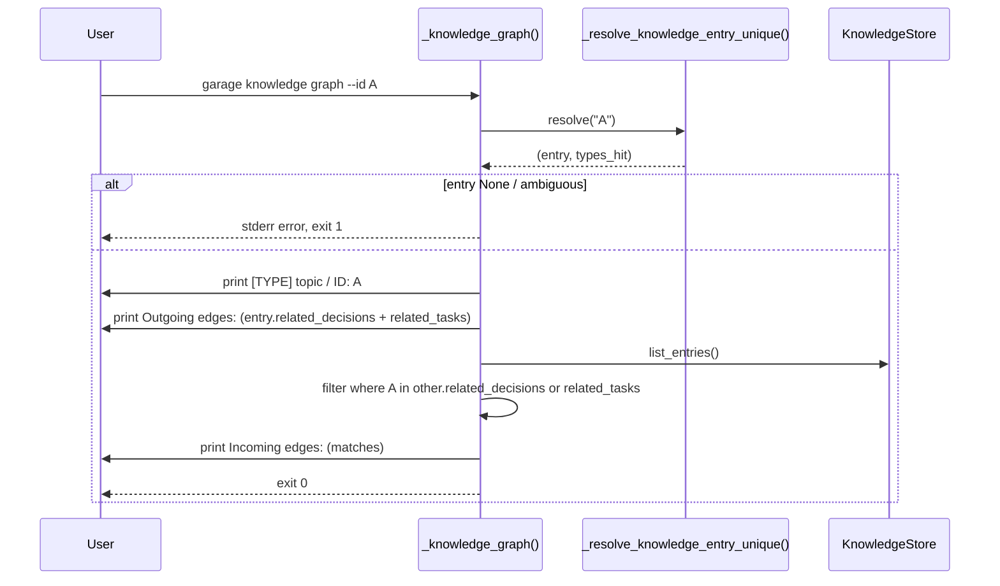

# D006: Garage Recall & Knowledge Graph 设计

- 状态: 草稿
- 日期: 2026-04-19
- 关联规格: `docs/features/F006-garage-recall-and-knowledge-graph.md`（已批准）
- 关联批准记录: `docs/approvals/F006-spec-approval.md`
- 关联前序设计: `docs/designs/2026-04-19-garage-knowledge-authoring-cli-design.md`（D005）
- 关联前序代码: `src/garage_os/cli.py`、`src/garage_os/memory/recommendation_service.py`、`src/garage_os/knowledge/{knowledge_store, experience_index}.py`

## 1. 概述

F006 引入 3 个新 CLI 子命令：

- `garage recommend <query>`（顶级新命令；read-only；mixed knowledge + experience 召回）
- `garage knowledge link --from --to [--kind ...]`（二级新子命令；唯一写命令）
- `garage knowledge graph --id`（二级新子命令；read-only；1 跳邻居视图）

设计原则：
- **零 schema 变更**：`KnowledgeEntry.related_decisions` / `related_tasks` 字段早在 F001 就存在，本 cycle 第一次接通使用
- **零模块新增**：所有新增量集中在 `src/garage_os/cli.py`（继承 F005 ADR-501 单文件风格）
- **零既有 API 变更**：`RecommendationService.recommend()` / `RecommendationContextBuilder.build()` 一字未动
- **零 third-party 依赖**：仅 stdlib + `garage_os.*`
- **零 F003 `garage run` 路径行为变化**：mixed recall 的 experience 半边由 `cli.py` 内的 `_recommend_experience()` helper 承担，不进 `RecommendationService`

## 2. 设计驱动因素

### 2.1 来自规格的核心驱动力

- **FR-601** knowledge 半边复用 `RecommendationService.recommend(context)` → CLI 调 `RecommendationContextBuilder.build_from_query()`（**新增 non-breaking 方法**）→ 调 `recommend()`
- **FR-602** experience 半边走 CLI-internal scorer → 新增 `_recommend_experience(records, context)` 函数，按 spec 列出的 6 条规则计算 score
- **FR-603** 零结果归口 → 在 `_recommend()` handler 层合并 knowledge + experience 后判断为空时输出 `RECOMMEND_NO_RESULTS_FMT`
- **FR-604** link 写入 → handler `_knowledge_link()` → `KnowledgeStore.retrieve()` → 字段 append + 去重 → set `source_artifact = "cli:knowledge-link"` → `KnowledgeStore.update()`
- **FR-605** link / graph 多 type 报错 → 公共 helper `_resolve_knowledge_entry_unique(eid)` 返回 `(entry, types_hit)`；types_hit 长度 > 1 时 handler 报 ambiguity
- **FR-606** graph → handler `_knowledge_graph()` → 用 `_resolve_knowledge_entry_unique()` 取节点 → 出边读 entry 字段 → 入边走 `KnowledgeStore.list_entries()` 全库扫描
- **FR-607** cli: 命名空间 → 新增模块常量 `CLI_SOURCE_KNOWLEDGE_LINK = "cli:knowledge-link"`，与 F005 同模式
- **FR-608** CLI help 自描述 + F005 子命令保留 → `argparse` 新增 sub-parsers，既有 sub-parsers 不动

### 2.2 来自规格的非功能驱动力

- **NFR-601** 零回归 → 不修改任何既有 handler；新增子命令并列加入
- **NFR-602** 零外部依赖 → 仅 stdlib（`argparse` / `json`）+ `garage_os.*`
- **NFR-603** 召回 < 1.5s → `RecommendationService.recommend()` + `_recommend_experience()` 在 ≤100 entry 下都是 O(N) in-memory 扫描，远低于阈值
- **NFR-604** stdout 常量化 → 新增 `RECOMMEND_*_FMT` / `KNOWLEDGE_LINKED_FMT` / `KNOWLEDGE_GRAPH_*_FMT` / `ERR_LINK_*` 模块常量
- **NFR-605** 文档同步 → user guide 新增 "Active recall and knowledge graph" 段；双 README 追加 3 个新子命令名

### 2.3 现有系统约束

- **`RecommendationService.recommend(context)`**：O(N) 扫 KnowledgeStore；返回 `[{entry_id, entry_type, title, score, match_reasons, source_session}]`
- **`RecommendationContextBuilder.build(...)`**：当前签名以 skill_name 为主轴，可被 F006 完整复用，**但**为了语义清晰，新增 `build_from_query(query, tags, domain)` 方法（non-breaking）
- **`KnowledgeStore.retrieve(type, id)`**：返回 `Optional[KnowledgeEntry]`；不存在返回 None
- **`KnowledgeStore.update(entry)`**：自动 `entry.version += 1`；写盘走 `_entry_to_front_matter` → `_storage.write_text`，**会持久化** `entry.related_decisions` / `entry.related_tasks`（这两字段在 `_DATACLASS_FRONT_MATTER_KEYS` 元组里）
- **`KnowledgeStore.list_entries()`**：`search(query=None, tags=None, knowledge_type=None)` 的薄包装；返回全库 entry 列表，触发 `_ensure_index()` lazy load
- **`ExperienceIndex.list_records()`**：返回全部 `ExperienceRecord` 列表（`experience_index.py:160-181`）；O(N) 全盘扫描
- **F005 cli.py 现有结构**：`_resolve_content` / `_generate_entry_id` / `_knowledge_add` / `_knowledge_edit` 等都是 module-level 函数 + `argparse` subparser；F006 沿用同模式

### 2.4 设计目标

- 把所有代码增量限制在 **`src/garage_os/cli.py`** + 1 个 non-breaking 新方法在 `recommendation_service.py`（`build_from_query`）
- 不修改 `KnowledgeEntry` / `ExperienceRecord` / `KnowledgeStore` / `ExperienceIndex` / `RecommendationService.recommend` 任何已有签名
- 测试新增量预期 ~25-35 个，集中在 `tests/test_cli.py` 新 test classes

## 3. 需求覆盖与追溯

| 规格需求 | 设计承接 | 主要落点 |
|----------|---------|---------|
| `FR-601` recommend knowledge 半边 | handler `_recommend(...)` 调 `RecommendationContextBuilder.build_from_query()` + `RecommendationService.recommend()` | `cli.py` + `recommendation_service.py`（新增 `build_from_query` 方法） |
| `FR-602` recommend experience 半边 | helper `_recommend_experience(records, context)` 按 spec 6 条规则计 score | `cli.py` |
| `FR-603` recommend 零结果归口 | `_recommend(...)` 合并后 `if not results: print RECOMMEND_NO_RESULTS_FMT` | `cli.py` |
| `FR-604` link happy path | handler `_knowledge_link(...)` → `_resolve_knowledge_entry_unique` → field append + 去重 → `update()` | `cli.py` |
| `FR-605` ambiguous --from | helper `_resolve_knowledge_entry_unique(eid) -> (entry, types_hit)`；types_hit > 1 → handler 报 `ERR_LINK_FROM_AMBIGUOUS_FMT` | `cli.py` |
| `FR-606` graph 节点 + 出 + 入边 | handler `_knowledge_graph(...)` → 用 `_resolve_knowledge_entry_unique` → entry 字段读出边 → `list_entries()` 扫入边 | `cli.py` |
| `FR-607` cli: 命名空间 | 模块常量 `CLI_SOURCE_KNOWLEDGE_LINK` + handler `_knowledge_link` 强制覆写 | `cli.py` |
| `FR-608` help 自描述 | `argparse` sub-parsers + `help`/`description` 字符串；既有 sub-parsers 不动 | `cli.py` `build_parser()` |
| `NFR-601` 零回归 | 不修改既有 handler；新 sub-parsers 与既有并列；测试新增类不动旧测试 | `cli.py` + `tests/test_cli.py` |
| `NFR-602` 零外部依赖 | `import` 闭包仅 stdlib + `garage_os.*` | `cli.py` |
| `NFR-603` 召回 < 1.5s | O(N) in-memory；smoke test 包一次 recommend 调用 | `tests/test_cli.py` |
| `NFR-604` stdout 常量化 | 模块顶层 `*_FMT` 常量；测试用 `assert FMT.format(...) in stdout` | `cli.py` + tests |
| `NFR-605` 文档同步 | user guide + README 双语 + `tests/test_documentation.py` grep | docs + tests |
| `CON-601` 不增顶级 / `recommend` 是有意偏离 | `recommend` 顶级；`link` / `graph` 挂 `knowledge` 父；ADR-602 解释偏离 | `cli.py` `build_parser()` |
| `CON-602` 不改既有公开 API | `RecommendationContextBuilder.build()` 不动；新增 `build_from_query()` | `recommendation_service.py` |
| `CON-603` 保持 `version+=1` | `link` 走 `update()` | `cli.py` |
| `CON-604` `cli:` 命名空间 | `CLI_SOURCE_KNOWLEDGE_LINK = "cli:knowledge-link"` | `cli.py` |
| `CON-605` 不改 `RecommendationService.recommend` 算法 | `recommendation_service.py` 仅新增 `RecommendationContextBuilder.build_from_query()`，**不动 `recommend()`** | `recommendation_service.py` |
| `CON-606` `recommend` / `graph` 是 read-only | handler 内只调 `retrieve` / `list_entries` / `list_records`，不调 `store` / `update` / `delete` | `cli.py` |

## 4. 架构模式选择

继承 D005 的 "Thin CLI Handler Pattern + Format Constant Pattern + Two-Surface Source Tagging" 模式，不引入新模式。本设计在该模式上加一个：

- **Composable Recall Pattern**（FR-601 + FR-602）：knowledge 半边走 `RecommendationService`（保留 `garage run` 路径），experience 半边走 CLI-internal scorer；二者通过 score 排序合并。模式优势：未来如果要加第 3 维度召回（如 candidate 层），只需在 handler 内新增第 3 个 helper，不污染任何已批准 contract。

## 5. 候选方案对比

### 候选 A: Composable Recall — knowledge 走 service / experience 走 cli-local helper（采用）

- **核心思路**：保留 `RecommendationService.recommend()` 签名与算法不动；在 `cli.py` 内新增 `_recommend_experience(records, context)` 与之同形输出（同 score / match_reasons 字段格式）；handler `_recommend(...)` 合并两边按 score 排序。
- **优点**：CON-602 / CON-605 / NFR-601 全部满足；F003 `garage run` 路径行为完全不变；future-proof（加第 3 维度只是新增 helper）
- **缺点**：experience scorer 与 knowledge scorer 是两份代码，未来若需要保持评分语义一致需要双向同步
- **NFR / 约束匹配**：全部满足

### 候选 B: 把 experience scorer 推进 `RecommendationService`

- **核心思路**：让 `RecommendationService.recommend()` 也扫 `ExperienceIndex`
- **优点**：单一召回入口，`garage run` 也能召回 experience
- **缺点**：直接违反 CON-605；改 `RecommendationService` 行为 = 触动 F003 `garage run` 路径，需要回归全部 F003 推荐相关测试 + 可能引发 score 权重重新校准
- **NFR / 约束匹配**：违反 CON-605

### 候选 C: 缩小 scope — knowledge-only recall

- **核心思路**：F006 只做 knowledge 召回，experience 不召回
- **优点**：最小代码量
- **缺点**：违反 spec FR-602 + § 2.1 核心目标；削弱 manifesto "记得 X" 承诺（experience 是用户工作历史的核心载体）
- **NFR / 约束匹配**：违反 spec

### 选择决策

**采用候选 A**。它是 spec round-1 USER-INPUT 裁决路径 B，完美兼容所有约束。

## 6. ADR-601: `recommend` 是顶级命令而非挂在 `knowledge` 子树

```
状态: 决定
背景: F005 CON-501 精神是"复用现有顶级命令，不增顶级"。但 `recommend` 跨
      knowledge + experience 两个域，挂在任一子树（如 garage knowledge recommend）
      都是误导：用户会以为"只召回 knowledge"。
决策: `recommend` 作为顶级新命令（与 init / status / run / knowledge / experience /
      memory 并列）。
候选:
  - 顶级 `garage recommend`（采用）：语义最清晰，符合"跨域召回"实际行为
  - `garage knowledge recommend`（拒绝）：误导用户、且未来加 candidate 召回时还是要再开顶级
  - `garage memory recommend`（拒绝）：与 `memory review` 子树概念混淆（review 是候选 → 发布流程，recommend 是召回，二者不同心智模型）
后果:
  + 语义清晰，命令名映射用户意图
  - 与 F005 CON-501 字面"不增顶级"有所偏离；spec CON-601 已显式说明这是有意偏离
可逆性: 中（事后若决定收纳到子树，需要保留顶级 alias 一段时间）
触发 revisit 信号: 顶级命令数 > 12 且出现命名混淆
```

## 7. ADR-602: experience scorer 复用 knowledge ranking 的字段格式但不共享代码

```
状态: 决定
背景: FR-602 要求 experience 半边输出与 knowledge 半边同形（entry_id / entry_type /
      title / score / match_reasons / source_session），便于合并排序。
决策: experience scorer (`_recommend_experience`) 在 cli.py 独立实现一份，
      不抽公共基类 / 不进 RecommendationService。
候选:
  - 独立函数（采用）：YAGNI；F006 cycle 只有这两份 scorer，过早抽象
  - 抽 `BaseRecallScorer` 基类：违反 YAGNI；F003 时代设计师没抽，本 cycle 也不抽
  - 推进 RecommendationService：违反 CON-605（拒绝）
后果:
  + 零既有 API 改动，零回归风险
  + 两份 scorer 的演化轨迹独立，不互相绑死
  - knowledge 与 experience 的 score 权重不严格对齐（spec 已声明：domain=0.8 / tag=0.6 / pattern=0.6 / lesson-text=0.4，与 RecommendationService 同量级）；未来若用户反馈"experience 排太前/太后"，可单独调本 cli.py 内的权重
可逆性: 高（事后若需统一，仍可抽象基类）
触发 revisit 信号: 出现第 3 个召回域（如 candidate 召回）
```

## 8. ADR-603: link 多 type 命中显式拒绝而非自动选 type 优先级

```
状态: 决定
背景: FR-605 / OQ-603 — 用户跨 type 重名 ID 时怎么办？
决策: 显式 error + stderr 列出所有 type，磁盘无变化；用户必须重命名或显式
      `--type` 消歧（本 cycle 不引入 `--type` 参数；未来按需）。
候选:
  - 显式拒绝（采用）：符合 design-principles 原则 5 "约定可发现"
  - 自动选 type 优先级（如 decision > pattern > solution）：隐式行为，违反原则 5
  - 默默 link 第一个找到的：最坏，破坏用户预期
后果:
  + 明确语义；任何"我以为它会 link 那条"的歧义被立即暴露
  - 用户必须重命名其中一个；F005 ID 生成器天然带 type 前缀，所以这只在用户显式 `--id custom` 跨 type 重名时才发生
可逆性: 高（事后加 `--type` 参数即可不破坏现有行为）
```

## 9. CLI Surface 详述

### 9.1 子命令树（F006 增量）

```
garage
├── init / status / run                          (existing, unchanged)
├── recommend                                    (NEW, F006 FR-601/602/603)
├── knowledge
│   ├── search / list                            (existing F002, unchanged)
│   ├── add / edit / show / delete               (existing F005, unchanged)
│   ├── link                                     (NEW, F006 FR-604/605/607)
│   └── graph                                    (NEW, F006 FR-606)
├── memory / review                              (existing F003, unchanged)
└── experience
    ├── add / show / delete                      (existing F005, unchanged)
```

### 9.2 `garage recommend` 参数表

| 参数 | 必需 | 类型 | 说明 |
|------|------|------|------|
| `query` | ✅ | str (positional) | 召回 query；按空白拆 tokens |
| `--tag` | ✗ | str (action="append") | 额外 tag 过滤；可重复 |
| `--domain` | ✗ | str | 单值 domain 过滤 |
| `--top` | ✗ | int (default=10) | 返回 top-N |
| `--path` | ✗ | path | 项目根（沿用 path_parser） |

### 9.3 `garage knowledge link` 参数表

| 参数 | 必需 | 类型 | 说明 |
|------|------|------|------|
| `--from` | ✅ | str | 源 entry id（自动嗅探 type） |
| `--to` | ✅ | str | 目标 ID（不校验存在性） |
| `--kind` | ✗ | choice {related-decision, related-task} | 默认 `related-decision` |
| `--path` | ✗ | path | 项目根 |

### 9.4 `garage knowledge graph` 参数表

| 参数 | 必需 | 类型 | 说明 |
|------|------|------|------|
| `--id` | ✅ | str | 节点 entry id（自动嗅探 type） |
| `--path` | ✗ | path | 项目根 |

### 9.5 stdout / stderr 文案常量

```python
# Module-level (cli.py) — F006 §6 / NFR-604
RECOMMEND_NO_RESULTS_FMT = "No matching knowledge or experience for query: '{query}'"
KNOWLEDGE_LINKED_FMT = "Linked '{src}' -> '{dst}' ({kind})"
KNOWLEDGE_LINK_ALREADY_FMT = "Already linked '{src}' -> '{dst}' ({kind})"
ERR_LINK_FROM_NOT_FOUND_FMT = "Knowledge entry '{eid}' not found"  # alias of KNOWLEDGE_NOT_FOUND_FMT
ERR_LINK_FROM_AMBIGUOUS_FMT = (
    "Knowledge entry id '{eid}' is ambiguous; found in types {types}. "
    "Rename one of the entries to disambiguate."
)
# (KNOWLEDGE_NOT_FOUND_FMT / ERR_NO_GARAGE reused from F005)

# Source markers
CLI_SOURCE_KNOWLEDGE_LINK = "cli:knowledge-link"
```

### 9.6 退出码契约

| 路径 | 成功 | 业务失败 | 用法错误 |
|------|------|---------|---------|
| `recommend` | 0 | (none — empty results 仍 exit 0) | 2 (argparse) |
| `knowledge link` | 0 | 1 (not-found / ambiguous) | 2 (argparse) |
| `knowledge graph` | 0 | 1 (not-found / ambiguous) | 2 (argparse) |

`recommend` 在 `--path` 但 `.garage/` 不存在时退 1（`ERR_NO_GARAGE`），与 F005 一致。

## 10. 数据流详述

### 10.1 `garage recommend` 数据流



### 10.2 `garage knowledge link` 数据流

```mermaid
sequenceDiagram
    participant U as User
    participant H as _knowledge_link()
    participant R as _resolve_knowledge_entry_unique()
    participant KS as KnowledgeStore
    U->>H: garage knowledge link --from A --to B [--kind related-decision]
    H->>R: resolve(eid="A")
    R->>KS: retrieve(decision, A) / retrieve(pattern, A) / retrieve(solution, A)
    R-->>H: (entry, types_hit)
    alt types_hit empty
        H-->>U: stderr KNOWLEDGE_NOT_FOUND_FMT, exit 1
    else types_hit > 1
        H-->>U: stderr ERR_LINK_FROM_AMBIGUOUS_FMT, exit 1
    else
        H->>H: target_field = related_decisions or related_tasks
        alt B already in target_field
            H->>KS: update(entry)  # source_artifact = "cli:knowledge-link"
            H-->>U: stdout KNOWLEDGE_LINK_ALREADY_FMT, exit 0
        else
            H->>H: target_field.append(B); set source_artifact
            H->>KS: update(entry)  # version+=1
            H-->>U: stdout KNOWLEDGE_LINKED_FMT, exit 0
        end
    end
```

### 10.3 `garage knowledge graph` 数据流



## 11. NFR Mapping

| NFR | 落点 | 验证方式 |
|-----|------|---------|
| NFR-601 零回归 | 不修改既有 handler；新 sub-parsers 并列 | `pytest tests/ -q` ≥ 451 passed |
| NFR-602 零外部依赖 | 仅 stdlib + `garage_os.*` | `git diff main..HEAD -- pyproject.toml` 空 |
| NFR-603 召回 < 1.5s | O(N) in-memory | wall-clock smoke test |
| NFR-604 stdout 常量 | 模块顶层 `*_FMT` | grep + 测试断言 |
| NFR-605 文档同步 | guide + 双 README | `tests/test_documentation.py` 增 grep |

## 12. 失败模式分析

| 场景 | 触发 | 检测 | 缓解 |
|------|------|------|------|
| `--from` 不存在 | typo | `_resolve_knowledge_entry_unique` 返回空 | exit 1 + `KNOWLEDGE_NOT_FOUND_FMT` |
| `--from` 多 type 命中 | 用户跨 type `--id custom` 重名 | resolve 返回多 type | exit 1 + `ERR_LINK_FROM_AMBIGUOUS_FMT` |
| `--to` 不存在 | 用户引用未来 ID 或外部 task ID | 不校验（FR-604 设计） | 接受；entry 字段如实写入 |
| `link` 重复调用 | 用户记不清是否已 link | 字段已含 target | stdout `KNOWLEDGE_LINK_ALREADY_FMT` + version 仍 +1（OQ-602 接受） |
| `recommend` 0 entry | 全新 `.garage/` | 两边 result 都空 | `RECOMMEND_NO_RESULTS_FMT` + exit 0 |
| `recommend` 全部 score=0 | query 完全不命中 | 同上 | 同上 |
| `RecommendationService.recommend()` 抛错 | (未观察到) | uncaught | F006 不引入新捕获；继承 stdlib 行为（exit 1 + traceback） |
| `KnowledgeStore.update()` 在未来 cycle 不再 `version+=1` | F004/F005 不变量被破坏 | 单元测试断言 `version=N+1` | NFR-601 + link 路径专项断言 |

## 13. 测试策略

### 13.1 测试金字塔

- **单元测试（绝大多数）**：`tests/test_cli.py` 新增 4 个 test class（每子命令 + 1 个 cross-cutting）
- **smoke test（1 个）**：wall-clock < 1.5s
- **文档断言（≥3 条）**：`tests/test_documentation.py` 增 grep 3 个新命令字符串

### 13.2 关键 test cases

每条对应 1 个或多个 FR（按 spec § 6 编号）：

1. `recommend` happy knowledge-only → FR-601
2. `recommend` happy experience-only（无 knowledge entry，仅 experience 命中）→ FR-602
3. `recommend` mixed knowledge + experience 同时命中 → FR-601 + FR-602
4. `recommend --tag` / `--domain` / `--top` 全部生效 → FR-601 / 602
5. `recommend` 零结果（empty `.garage/`）→ FR-603
6. `recommend` 5+5 entries 但 query 不命中任何 → FR-603
7. `recommend` 无 `.garage/` → exit 1 + `ERR_NO_GARAGE`
8. `link` happy → FR-604（version=2 / related_decisions=[B] / source_artifact=cli:knowledge-link）
9. `link` 重复 → FR-604（去重 + `KNOWLEDGE_LINK_ALREADY_FMT`）
10. `link --kind related-task` → FR-604（写 related_tasks）
11. `link --from missing` → FR-604（exit 1 + KNOWLEDGE_NOT_FOUND_FMT）
12. `link --to <外部 ID>` → FR-604（接受；`related_tasks` 含 T005）
13. `link` 多 type 命中 → FR-605（exit 1 + ERR_LINK_FROM_AMBIGUOUS_FMT，列出多 type）
14. `link` 不污染 publisher 元数据 → FR-607（`published_from_candidate` 保持）
15. `graph` 节点 + 出边 + 入边 → FR-606
16. `graph` 孤立节点 → FR-606 (none) / (none)
17. `graph --id missing` → FR-606
18. `graph --id` 多 type 命中 → FR-606（共用 ERR_LINK_FROM_AMBIGUOUS_FMT）
19. `recommend --help` 含全参数 → FR-608
20. `link --help` 含全参数 → FR-608
21. `graph --help` 含全参数 → FR-608
22. `garage --help` 含 `recommend` → FR-608
23. `garage knowledge --help` 含 `link` + `graph` + 6 个 F005 名 → FR-608（量化 8 名）
24. `recommend` smoke < 1.5s → NFR-603
25. CLI source markers 都以 `cli:` 开头（含 `cli:knowledge-link`）→ FR-607 + ADR-503 延伸
26. F005 `_knowledge_add` / `_knowledge_edit` 行为不变 → NFR-601（spot check）

### 13.3 既有测试零回归保护

`tests/test_cli.py` / `tests/test_documentation.py` 中现有 451 个测试不修改；新增测试单独命名（`TestRecommend` / `TestKnowledgeLink` / `TestKnowledgeGraph` / `TestRecallAndGraphCrossCutting`）。

## 14. Task Planning Readiness

设计已稳定到 `hf-tasks` 可拆。建议任务粒度（不在本设计内拆，仅给输入提示）：

- **T1**: `_resolve_knowledge_entry_unique` helper + `_recommend_experience` helper + 2 个 helper 单元测试
- **T2**: `garage recommend` handler + sub-parser + `RecommendationContextBuilder.build_from_query` + 测试（FR-601/602/603）
- **T3**: `garage knowledge link` handler + sub-parser + 测试（FR-604/605/607）
- **T4**: `garage knowledge graph` handler + sub-parser + 测试（FR-606）
- **T5**: 文档同步 + cross-cutting 断言 + smoke + 全 suite 回归门（FR-608 + NFR-603/605）

每个任务可独立通过 RED → GREEN → REFACTOR 闭环，T2-T4 都依赖 T1 的 2 个 helper。

## 15. 开放问题

| 编号 | 问题 | 阻塞 / 非阻塞 | 当前判断 |
|------|------|-------------|---------|
| OD-601 | `_recommend_experience` 的 score 权重是否要在 design 阶段精调？ | 非阻塞 | 否。spec FR-602 已经显式列出 6 条规则的权重（与 `RecommendationService` 同量级 0.4-0.8）；future calibration 可独立立项。 |
| OD-602 | `RecommendationContextBuilder.build_from_query()` 是否要单独写 builder unit test？ | 非阻塞 | 是（轻）。在 T2 内顺手加 1 个 test；不需独立 test class。 |
| OD-603 | `link` 是否要把 `--to` 也尝试 resolve 提示用户"未在仓库内找到"？ | 非阻塞 | 否。OQ-606 已明确决定接受任意字符串。如果未来用户高频 typo `--to`，可加 `--strict` 标志。 |
| OD-604 | `recommend` 是否需要在 stdout 末尾打印一行 "Found N results"？ | 非阻塞 | 否（保持简洁）。如果用户反馈"想知道总数"，可独立加（low cost）。 |
| OD-605 | `graph` 入边扫描是否要去重（如 A 同时把 B 列在 related_decisions 与 related_tasks）？ | 非阻塞 | 不去重；显示两次 + 不同 kind 标签更准确（用户能看到双重关系）。 |

## 16. Glossary

| 术语 | 定义 |
|------|------|
| **query-shaped context** | 由 `garage recommend` 命令行 query 构造的 dict，与 skill-shaped context 同形（含 skill_name/domain/problem_domain/tags/...）但 token 含义不同 |
| **knowledge half / experience half** | `recommend` 的两条召回路径：knowledge 半边走 `RecommendationService`，experience 半边走 cli.py 内 `_recommend_experience` |
| **outgoing edge / incoming edge** | 节点 A 的出边来自 `entry.related_decisions/related_tasks` 字段，入边来自全库扫描"哪些 entry 把 A 列为 related" |
| **link path** | `garage knowledge link` 的代码路径，写入 entry 时 `source_artifact = "cli:knowledge-link"` |
