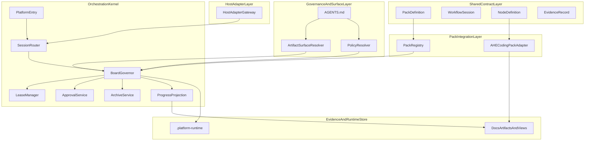
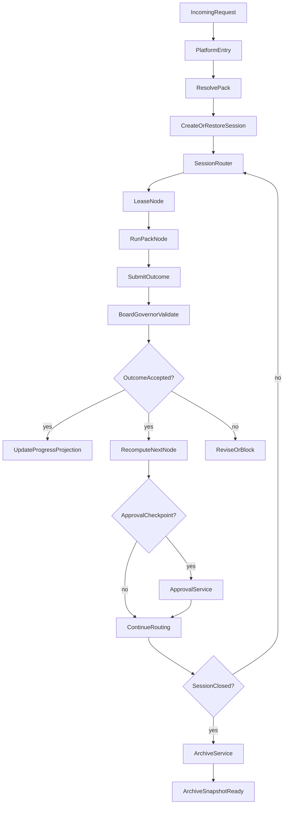

# AHE 平台优先 Multi-Agent 实现设计方案

- 状态: 草稿
- 日期: 2026-04-09
- 主题: 平台优先 multi-agent runtime 的实现设计
- 定位: 基于 `docs/architecture/ahe-platform-first-multi-agent-architecture.md`，给出可进入后续任务规划的实现设计方案。本文回答“平台优先架构将如何在当前仓库中落地”，而不是重复解释为什么要采用该架构。
- 关联文档:
  - `README.md`
  - `AGENTS.md`
  - `docs/architecture/ahe-platform-first-multi-agent-architecture.md`
  - `docs/architecture/ahe-workflow-skill-anatomy.md`
  - `docs/guides/ahe-workflow-externalization-guide.md`
  - `docs/guides/ahe-path-mapping-guide.md`
  - `docs/analysis/clowder-ai-harness-engineering-analysis.md`

## 1. 概述

当前仓库已经明确采用“平台优先 + AHE 仅为首个 coding pack”的总体方向。  
下一步需要解决的问题不是“是否要这么做”，而是：

- 平台层具体由哪些实现层组成
- 各层应落在哪些目录、对象和 contract 上
- `ahe-coding-skills/` 如何作为 pack 接入，而不是继续兼任平台
- 如何在不破坏当前 Markdown-first 工作方式的前提下，引入可恢复的 runtime state

本文给出的不是最终代码结构，而是一份 **可实施的实现设计**。  
目标是让后续任务规划能围绕稳定的边界、目录挂载、接口和运行时对象展开，而不再靠概念性草图推进。

---

## 2. 设计驱动因素

### 2.1 关键驱动

1. 平台 shared contract 必须摆脱 AHE 私有语言。
2. `ahe-coding-skills/` 只能是 pack，不能再承担 pack-neutral orchestration。
3. 当前仓库是 Markdown-first、无常驻服务、无数据库的资产仓，第一阶段必须 file-backed。
4. 运行时恢复不能继续主要依赖聊天记忆，必须逐步转向 board + evidence + artifact surface。
5. 兼容期内必须允许 `artifact-first + board-assisted`，避免过早切 `board-first`。
6. 未来必须允许第二个、第三个非 coding pack 接入，而无需继承 AHE 的命名或 graph 术语。

### 2.2 设计约束

- 不新增平台私有治理源；治理只从 `AGENTS.md` 注入。
- 不要求第一阶段改写全部 `ahe-*` skills。
- 不把平台实现成 Clowder 式完整应用。
- 不把设计写成任务清单或逐行实现说明。

### 2.3 设计输出目标

本设计至少要明确：

- 分层边界
- 目录挂载
- runtime 对象
- machine-readable contract 的组织方式
- AHE pack 接入方式
- 关键控制流
- 兼容和切换策略
- 验证与风险控制方式

---

## 3. 需求覆盖与追溯

下表把架构文档中的关键要求映射到本文的实现设计承接点。

| 架构要求 | 实现设计中的承接 |
| --- | --- |
| 平台只使用中立术语 | `决策 D5` 与 `第 10 节 接口与契约` |
| AHE 仅为首个 coding pack | `第 8.4 节 PackIntegrationLayer` 与 `第 12 节 AHE Coding Pack 接入设计` |
| board 先作为辅助事实源 | `第 13 节 兼容与切换策略` |
| 治理从 `AGENTS.md` 注入 | `第 8.1 节 GovernanceAndSurfaceLayer` |
| `contracts/` / `schemas/` 成为正式挂载点 | `第 7 节 目录与挂载设计` 与 `第 10.7 节 契约组织方式` |
| 主工件单写、质量节点只读并行 | `第 8.3 节 OrchestrationKernel` 与 `第 11.4 节 quality fan-out` |
| 未来支持多 pack | `第 10.1 节 PackDefinition` 与 `第 12 节 AHE Coding Pack 接入设计` |

---

## 4. 候选方案

### 方案 A：继续以文档为主，不引入正式 runtime contract

做法：

- 保留当前 docs 驱动方式
- 仅在 AHE 文档中继续补充 board、lease、approval 等描述

优点：

- 改动最小
- 没有新的目录与 schema 设计成本

缺点：

- 平台边界仍然隐含在 AHE docs 里
- 第二个 pack 无法真正复用
- 难以做稳定恢复与验证

### 方案 B：直接引入完整平台内核和常驻状态服务

做法：

- 立即设计数据库、服务进程、runtime API 和持久化引擎
- 让 docs 只保留说明，不再承担主要状态面

优点：

- 长期状态最清晰
- 结构上最接近完整平台

缺点：

- 脱离当前仓库形态
- 实现成本和风险明显偏高
- 容易先造出平台壳，再回头补 contract

### 方案 C：file-backed 平台内核 + pack registry + 双轨兼容

做法：

- 先设计 platform-neutral contract
- 通过 repo-local 文件承载 session / board / attempts / approvals / archive
- 让 `ahe-coding-skills/` 成为第一个通过 registry 接入的 pack

优点：

- 与当前仓库约束匹配
- 可以逐步脱离 AHE 私有语义
- 可验证、可恢复、可迁移

缺点：

- 兼容期需要维护双轨投影
- file-backed runtime 仍需要严格的目录和写入约束

### 选定方案

选择 **方案 C：file-backed 平台内核 + pack registry + 双轨兼容**。

结构化决策：

- 背景: 当前仓库没有服务进程和数据库，但已经需要平台层 contract。
- 被考虑的方案: 文档延续、完整平台、file-backed 内核。
- 选定方案: file-backed 内核。
- 主要收益: 边界清晰、与当前仓库兼容、可逐步迁移。
- 主要代价: 需要额外设计 runtime 目录、projection 与 CAS 规则。
- 风险缓解: 采用 `artifact-first + board-assisted`，在切换前保持保守策略。

---

## 5. 选定方案与关键决策

### 决策 D1：平台 contract 与 pack contract 分层存放

- 平台 contract 放在 `contracts/platform/` 与 `schemas/platform/`
- pack contract 放在 `contracts/packs/<packId>/` 与 `schemas/packs/<packId>/`

理由：

- 让 shared contract 不再被 AHE 反向绑死
- 为未来多 pack 接入留出自然位置

### 决策 D2：schema 用 JSON Schema，实例用 YAML

- 机器校验用 JSON Schema
- 人类编辑与运行态实例使用 YAML

理由：

- JSON Schema 的工具生态更稳定
- YAML 对当前 Markdown-first 仓库更友好

### 决策 D3：运行态落在隐藏目录 `.platform-runtime/`

- platform-neutral runtime 文件不写进 `docs/`
- 也不直接散落到 pack 目录

理由：

- `docs/` 适合长文和审计说明，不适合频繁变动的运行态
- runtime state 需要和 pack 文档、用户可读工件区分

### 决策 D4：`task-progress.md` 只作为 progressView 投影

- 它继续存在
- 但不再被设计为平台唯一事实源

理由：

- 兼顾当前用户阅读方式和未来 board-first 的切换需求

### 决策 D5：平台不硬编码 AHE graph 术语

- 平台识别 `graphVariantId`，不识别 `full` / `standard` / `lightweight` 的语义
- 这些语义由 AHE pack 自己声明

理由：

- 防止 pack-local naming 变成 platform keyword

### 决策 D6：`ahe-coding-skills/` 是 authoring source，`.cursor/skills/ahe-skills/` 是分发镜像

- `ahe-coding-skills/` 作为仓库内 canonical pack source
- `.cursor/skills/ahe-skills/` 视为运行时镜像 / 打包分发表面，不作为 pack registry 的 source of truth

理由：

- 当前仓库同时存在两棵 skill 树
- 若不先声明主从关系，pack mapping、迁移和任务规划都会混乱

### 决策 D7：`ahe-workflow-router` 降格为 pack-local entry resolver

- `PlatformEntry` 和 `SessionRouter` 是平台侧 router of record
- `ahe-workflow-router` 仅负责 AHE pack 内部的 entry ambiguity、graph variant 选择辅助与 pack-local reroute

理由：

- 平台优先架构不能保留两个同级 router of record
- 这能避免 platform / pack handoff 继续悬空

---

## 6. 架构视图

### 6.1 逻辑分层图



### 6.2 关键控制流图



---

## 7. 目录与挂载设计

### 7.1 顶层目录设计

建议目标态目录如下：

```text
contracts/
  platform/
    vocabulary.md
    pack-registry.md
    pack-definition.md
    workflow-session.md
    workflow-board.md
    node-definition.md
    node-attempt.md
    lease.md
    artifact-surface.md
    governance-snapshot.md
    outcome-submission.md
    approval-record.md
    evidence-record.md
    archive-snapshot.md
  packs/
    ahe-coding/
      pack-definition.yaml
      graph-variants.yaml
      node-definitions/
      artifact-role-mappings.yaml

schemas/
  platform/
    pack-registry.schema.json
    pack-definition.schema.json
    workflow-session.schema.json
    workflow-board.schema.json
    node-definition.schema.json
    node-attempt.schema.json
    lease.schema.json
    artifact-surface.schema.json
    governance-snapshot.schema.json
    outcome-submission.schema.json
    approval-record.schema.json
    evidence-record.schema.json
    archive-snapshot.schema.json
  packs/
    ahe-coding/
      pack-definition.schema.json
      graph-variant.schema.json
      node-definition.schema.json

agents/
  platform/
    platform-entry.md
    board-governor.md
    approval-service.md
    archive-service.md

rules/
  platform/
    naming-policy.md
    projection-policy.md
    concurrency-policy.md

hooks/
  platform/
    session-open.md
    lease-expired.md
    archive-completed.md

.platform-runtime/
  sessions/
    <sessionId>/
      session.yaml
      board.yaml
      governance.yaml
      attempts/
      leases/
      approvals/
      outcomes/
      snapshots/
      archive/
```

### 7.2 目录职责

| 路径 | 角色 |
| --- | --- |
| `contracts/platform/` | 平台中立语义定义 |
| `schemas/platform/` | 平台对象 machine-readable schema |
| `contracts/packs/ahe-coding/` | AHE pack 语义与映射 |
| `schemas/packs/ahe-coding/` | AHE pack-specific schema |
| `agents/platform/` | 未来平台角色说明或 agent role assets |
| `rules/platform/` | 平台 policy fragments |
| `hooks/platform/` | 生命周期 hook 设计 |
| `.platform-runtime/` | 运行态对象和快照 |

### 7.3 与现有目录的关系

- `docs/architecture/` 继续保存平台级架构和 contract 设计说明
- `docs/designs/` 保存 pack-specific 设计说明
- `ahe-coding-skills/` 保持为首个 pack 根
- `docs/guides/` 继续承载 externalization 和 path mapping
- `.cursor/skills/ahe-skills/` 视为分发镜像，不作为 pack registry 的 canonical source

---

## 8. 模块职责与边界

### 8.1 GovernanceAndSurfaceLayer

组件：

- `PolicyResolver`
- `ArtifactSurfaceResolver`
- `ApprovalAliasResolver`

职责：

- 从 `AGENTS.md` 读取 governance snapshot
- 把逻辑工件角色解析为实际路径
- 为 runtime 提供 policy 和命名映射

边界：

- 不直接保存 session state
- 不直接决定下游节点结论

### 8.2 SharedContractLayer

组件：

- `PackRegistryIndex`
- `VocabularyPolicy`
- `PackDefinition`
- `NodeDefinition`
- `NodeAttempt`
- `Lease`
- `ArtifactSurface`
- `GovernanceSnapshot`
- `OutcomeSubmission`
- `ApprovalRecord`
- `WorkflowSession`
- `WorkflowBoard`
- `EvidenceRecord`

职责：

- 提供平台可验证的 contract
- 允许多个 pack 在同一平台语义下接入

边界：

- 不包含 AHE 私有词作为平台字段
- 不包含 host-specific 行为细节

### 8.3 OrchestrationKernel

组件：

- `PlatformEntry`
- `SessionRouter`
- `BoardGovernor`
- `LeaseManager`
- `ApprovalService`
- `ArchiveService`
- `ProgressProjection`

职责：

- 创建或恢复 session
- 路由到 pack-local 节点
- 执行 CAS、lease、fan-out 收口、pause 与 archive
- 将 board 状态投影到人类可读文件

边界：

- 不直接生成 spec / design / tasks / code
- 不把自己写成某个 pack 的节点
- 不把 pack-local entry 逻辑重新塞回平台 schema

### 8.4 PackIntegrationLayer

组件：

- `PackRegistry`
- `PackAdapter`
- `GraphVariantResolver`

职责：

- 注册 pack
- 暴露 graph variants 和 node registry
- 连接 pack-local naming 与 platform-neutral contract
- 为 pack-local entry resolver 提供平台可接受的首跳输入

边界：

- 不越权接管 runtime 决策
- 不把 pack 文档直接当作平台对象

### 8.5 HostAdapterLayer

组件：

- `HostAdapterGateway`
- `SubagentDispatchAdapter`
- `LocalCommandAdapter`

职责：

- 适配宿主调用方式
- 统一把调用包装为 session / node / outcome 语义

边界：

- 不决定 workflow graph
- 不改写 pack contract

### 8.6 EvidenceAndRuntimeStore

组件：

- `RuntimeStore`
- `EvidenceIndex`
- `ArchiveSnapshotStore`

职责：

- 保存 runtime state
- 保存 append-only records
- 支持恢复、校验、归档和审计

边界：

- 不作为长文说明存放位置
- 不和 `docs/` 混用

### 8.7 控制权与写权限矩阵

| 组件 | 可读取 | 可写入 | 不可写入 |
| --- | --- | --- | --- |
| `PlatformEntry` | host request、registry index | 无 | pack 工件、runtime records |
| `SessionRouter` | session、governance、pack entry metadata | `session.yaml` 初始态 | pack 主工件、review/verification 记录 |
| `BoardGovernor` | board、outcome、approval、evidence refs | `board.yaml`、accepted outcome state、snapshot metadata | pack 主工件正文 |
| `LeaseManager` | board、node definitions | `leases/*.yaml` | pack 主工件、projection |
| `PackAdapter` | node definition、artifact surfaces、lease | 无直接平台写入；只分发执行 | board、approval、archive |
| pack-local node | requiredReads、artifact surfaces、lease | 仅限 lease 声明的 `expectedWrites` 对应 pack-owned 工件 | `.platform-runtime/`、board、其他节点工件 |
| `ProgressProjection` | board、accepted evidence、artifact surfaces | `task-progress.md` 或等价 progressView | review/verification 原始记录 |
| `ApprovalService` | board、policy、approval request | `approvals/*.yaml` 与映射 approval artifact | board 主状态、pack 主工件 |
| `ArchiveService` | adopted artifacts、evidence index、board final snapshot | `archive/*.yaml` 与 archive snapshot | 历史 review/verification 内容 |

---

## 9. 数据流、控制流与关键交互

### 9.1 新建 session

1. `PlatformEntry` 接收请求。
2. 根据显式 pack 偏好或默认策略选择 `packId`。
3. `PolicyResolver` 读取 `AGENTS.md` 并生成带 fingerprint 的 `governanceSnapshot`。
4. `SessionRouter` 创建 `WorkflowSession` 与 `WorkflowBoard` 初始实例。
5. `PackRegistry` 解析默认 `graphVariantId`，必要时调用 pack-local entry resolver（如 `ahe-workflow-router`）消解 pack 内部第一跳歧义。
6. `ProgressProjection` 写出首个 progressView。

### 9.2 恢复 session

1. `PlatformEntry` 发现已有 `sessionId` 或可恢复上下文。
2. `RuntimeStore` 读取 `session.yaml`、`board.yaml`、最近的 outcome / approvals。
3. `ArtifactSurfaceResolver` 校验工件仍可读取，`PolicyResolver` 校验 `governanceSnapshot` 与当前 `AGENTS.md` fingerprint 是否一致。
4. `BoardGovernor` 校验 board 与工件是否一致。
5. 若冲突，转入保守回退而不是继续向前推进。

### 9.3 普通节点执行

1. `BoardGovernor` 选出 `currentRecommendedNode`。
2. `LeaseManager` 发放 lease。
3. `PackAdapter` 将 nodeId 分发给 pack-local 执行边界。
4. 节点只在 lease 允许的 `expectedWrites` 范围内写入 pack-owned 工件，并提交 `OutcomeSubmission`、evidence refs、内容哈希和 `boardVersion`。
5. `BoardGovernor` 执行 compare-and-set，并校验 `expectedWrites`、artifact hash 和 board version。
6. 接纳后更新 board 和 projection；拒绝则转 `revise` / `blocked`。

### 9.4 quality fan-out

1. `BoardGovernor` 打开只读 quality batch。
2. 为多个 review node 分发只读 lease。
3. 收集所有 outcome。
4. 聚合优先级固定为 `blocked > revise > pass`。
5. 若全部 `pass`，解锁下游 barrier 节点；否则回退指定节点。

### 9.5 approval checkpoint

1. board 命中 `approvalCheckpoint`。
2. `ApprovalService` 写入等待或自动解决记录。
3. `interactive` 时进入 `waiting_human`。
4. `auto` 时按 policy 写 approval record，并由 governor 再次校验后放行。

### 9.6 archive

1. `ahe-finalize` 只负责产出 closeout payload。
2. `ArchiveService` 读取 adopted artifacts、board snapshot、evidence index。
3. 写入 archive snapshot。
4. session 状态转为 `archived`。

---

## 10. 接口与契约

### 10.1 `PackRegistryIndex`

语义：

- 平台可装配的 pack 清单
- 明确 pack 的 canonical source、分发镜像和 manifest 路径

最小字段：

```yaml
registryVersion: 1
packs:
  - packId: ahe-coding
    sourceRoot: ahe-coding-skills/
    mirrorRoot: .cursor/skills/ahe-skills/
    manifest: contracts/packs/ahe-coding/pack-definition.yaml
```

### 10.2 `PackDefinition`

语义：

- 定义一个 pack 的入口、variants、artifact roles、canonical source 与 node registry

最小字段：

```yaml
packId: ahe-coding
displayName: AHE Coding Pack
canonicalSourceRoot: ahe-coding-skills/
distributedMirrorRoot: .cursor/skills/ahe-skills/
entryResolverNode: ahe-workflow-router
defaultGraphVariantId: standard
graphVariantsRef: contracts/packs/ahe-coding/graph-variants.yaml
nodeDefinitionsRoot: contracts/packs/ahe-coding/node-definitions/
artifactRoleMappingsRef: contracts/packs/ahe-coding/artifact-role-mappings.yaml
```

### 10.3 `GovernanceSnapshot`

语义：

- 将当前 `AGENTS.md` 注入结果冻结为可恢复快照
- 为恢复提供可信绑定，而不是只记录路径

最小字段：

```yaml
snapshotId: gov-20260409-001
agentsMdPath: AGENTS.md
agentsMdFingerprint: sha256:...
resolverVersion: 1
capturedAt: 2026-04-09T10:00:00Z
policyRefs:
  - pathMapping
  - approvalAliases
  - concurrencyRules
```

### 10.4 `WorkflowSession`

语义：

- 一次可恢复工作会话的包络

最小字段：

```yaml
sessionId: sess-20260409-001
packId: ahe-coding
graphVariantId: standard
executionMode: interactive
topic: platform-first-multi-agent
governanceSnapshot: .platform-runtime/sessions/sess-20260409-001/governance.yaml
governanceFingerprint: sha256:...
scope:
  repoRoot: .
  surfaceScope: default
baselineArtifacts:
  - artifactRole: progressView
    path: task-progress.md
currentBoardVersion: 3
sessionEpoch: 1
```

### 10.5 `WorkflowBoard`

语义：

- 平台运行时事实源，表达节点状态、下一步推荐和待审批项

最小字段：

```yaml
boardVersion: 3
sessionEpoch: 1
currentRecommendedNode: ahe-design
readyNodes:
  - ahe-design
blockedNodes: []
activeLeases: []
pendingApprovals: []
nodeStates:
  ahe-design: ready
lastAcceptedOutcome:
  nodeId: ahe-spec-review
  outcome: pass
```

### 10.6 `NodeDefinition`

语义：

- pack-local 节点在平台中的 contract

最小字段：

```yaml
nodeId: ahe-design-review
nodeKind: reviewer
dependsOn:
  - ahe-design
requiredReads:
  - approvedSpec
  - designDraft
expectedWrites:
  - reviewRecord
allowedOutcomes:
  - pass
  - revise
  - blocked
outcomeRouting:
  pass: design-approval
  revise: ahe-design
  blocked: ahe-design
retryFromNode: ahe-design
parallelismMode: isolated-review
barrierGroup: none
approvalCheckpoint: none
```

### 10.7 `NodeAttempt`

语义：

- 节点的一次实际执行尝试

最小字段：

```yaml
attemptId: attempt-20260409-001
sessionId: sess-20260409-001
nodeId: ahe-design-review
leaseId: lease-20260409-001
boardVersion: 3
ownerAgentType: reviewer-subagent
submittedOutcomeRef: .platform-runtime/sessions/sess-20260409-001/outcomes/outcome-20260409-001.yaml
startedAt: 2026-04-09T10:10:00Z
endedAt: 2026-04-09T10:13:00Z
```

### 10.8 `Lease`

语义：

- platform 对节点执行范围的授权

最小字段：

```yaml
leaseId: lease-20260409-001
nodeId: ahe-design-review
sessionId: sess-20260409-001
boardVersion: 3
requiredReads:
  - approvedSpec
  - designDraft
expectedWrites:
  - reviewRecord
expiresAt: 2026-04-09T10:20:00Z
heartbeatInterval: 60
mode: isolated-review
```

### 10.9 `ArtifactSurface`

语义：

- 逻辑工件角色到真实路径的 authoritative mapping

最小字段：

```yaml
artifactRole: reviewRecord
authoritativePath: docs/reviews/
writable: true
sourceOfTruth: artifact
allowedWriters:
  - ahe-design-review
projection: false
```

### 10.10 `OutcomeSubmission`

语义：

- pack-local 节点提交给 governor 的结果包络
- 它不是最终被接纳的事实，而是待验收提交

最小字段：

```yaml
submissionId: outcome-20260409-001
sessionId: sess-20260409-001
nodeId: ahe-design-review
attemptId: attempt-20260409-001
boardVersion: 3
outcome: revise
artifactHashes:
  reviewRecord: sha256:...
expectedWrites:
  - reviewRecord
evidenceRefs:
  - docs/designs/ahe-platform-first-multi-agent-implementation-design.md
submittedAt: 2026-04-09T10:13:00Z
```

### 10.11 `ApprovalRecord`

语义：

- 平台统一的审批记录
- 支持 `interactive` 与 `auto` 两种模式，但必须绑定上下文

最小字段：

```yaml
approvalId: approval-20260409-001
sessionId: sess-20260409-001
boardVersion: 4
sessionEpoch: 1
checkpoint: design-approval
mode: auto
approverPrincipal: platform-policy
policyRuleId: design-approval-auto-v1
inputsHash: sha256:...
createdAt: 2026-04-09T10:20:00Z
```

### 10.12 `EvidenceRecord`

语义：

- append-only 的评审、验证、审批和 outcome 记录元数据

最小字段：

```yaml
recordId: review-ahe-design-001
recordClass: review
sessionId: sess-20260409-001
nodeId: ahe-design-review
artifactRefs:
  - docs/designs/ahe-platform-first-multi-agent-implementation-design.md
summary: design review pass with 2 important improvements
hash: sha256:...
capturedAt: 2026-04-09T12:00:00Z
```

### 10.13 `ArchiveSnapshot`

语义：

- 会话完成后的冻结包络

最小字段：

```yaml
archiveId: arch-20260409-001
sessionId: sess-20260409-001
adoptedArtifacts:
  - docs/designs/ahe-platform-first-multi-agent-implementation-design.md
evidenceIndex:
  - review-ahe-design-001
boardSnapshot: .platform-runtime/sessions/sess-20260409-001/archive/board-final.yaml
manifestRootHash: sha256:...
closedAt: 2026-04-09T13:00:00Z
```

### 10.14 契约组织方式

为避免 contract 漂移，采用四层表达：

1. 语义文档：`contracts/platform/*.md`
2. pack manifests：`contracts/packs/<packId>/*.yaml`
3. 校验 schema：`schemas/.../*.schema.json`
4. 运行态实例：`.platform-runtime/**/*.yaml`

这四层各自回答：

- contract 是什么
- pack 如何声明自己
- contract 如何校验
- contract 当前实例长什么样

---

## 11. 关键流程与实现边界

### 11.1 session bootstrap

实现重点：

- 优先从 `AGENTS.md` 恢复 surface mapping
- 用 `PackRegistry` 选定 pack 与 graph variant
- 生成初始 board 和 progressView

边界：

- 不在 bootstrap 阶段直接调用具体 pack node

### 11.2 router 与 governor 分工

`SessionRouter` 负责：

- intake
- create / resume
- 第一跳选择
- 决定是否调用 pack-local entry resolver

`BoardGovernor` 负责：

- 持续重算下一节点
- 校验 outcome
- 收口 fan-out
- 管理 CAS 与回退

pack-local resolver（AHE 中即 `ahe-workflow-router`）只负责：

- 消解 pack 内部的入口歧义
- 返回 pack-local 第一跳建议
- 在 pack 范围内提供 reroute 提示

它不负责：

- 创建平台 session
- 接管 board
- 直接写入 `.platform-runtime/`

这样做的原因是避免 router 继续膨胀成所有状态机逻辑的唯一宿主。

### 11.3 平台到 pack 的 handoff 合同

平台传入 pack 执行边界的最小上下文为：

- `sessionId`
- `nodeId`
- `boardVersion`
- `leaseId`
- `requiredReads`
- `expectedWrites`
- `artifactSurfaceRefs`

pack 返回平台的最小结果为：

- `OutcomeSubmission`
- `artifactHashes`
- `evidenceRefs`
- `outcome`

边界规则：

- pack-local 节点可以写入 lease 所声明的 pack-owned 工件
- pack-local 节点不能写 `.platform-runtime/`
- 是否接纳写入结果由 governor 决定，而不是由 pack 自行宣布通过

### 11.4 quality fan-out

本阶段只允许以下 pack-local 节点只读并行：

- `ahe-bug-patterns`
- `ahe-test-review`
- `ahe-code-review`

实现规则：

- 并行节点必须只读
- 主工件不得被多个并行节点写入
- 聚合结论由 governor 统一裁定

### 11.5 approval checkpoint

实现重点：

- 把 `spec-approval`、`design-approval`、`test-design-confirm` 统一为平台 `approvalCheckpoint`
- 由 `ApprovalService` 记录等待或自动解决状态

边界：

- approval service 不代替 reviewer 或 producer 给出专业结论

### 11.6 archive

实现重点：

- closeout payload 与 archive snapshot 分离
- AHE finalize 结束后，平台再进行冻结与审计收口

边界：

- archive 不写 pack-local 内容判断
- archive 只固化已经被接纳的结果

---

## 12. AHE Coding Pack 接入设计

### 12.1 AHE pack 的角色

`ahe-coding-skills/` 只承担：

- coding producers
- coding reviewers
- coding gates
- coding closeout

它不再承担：

- 平台入口层
- 平台 session object
- 平台 lease / archive / approval service

补充规则：

- `ahe-coding-skills/` 是 canonical authoring source
- `.cursor/skills/ahe-skills/` 是分发镜像，不参与平台 registry 判定

### 12.2 AHE 节点到平台 nodeKind 的映射

| AHE nodeId | platform nodeKind |
| --- | --- |
| `ahe-workflow-router` | `pack-entry-resolver` |
| `ahe-specify` | `producer` |
| `ahe-design` | `producer` |
| `ahe-tasks` | `producer` |
| `ahe-test-driven-dev` | `executor` |
| `ahe-spec-review` | `reviewer` |
| `ahe-design-review` | `reviewer` |
| `ahe-tasks-review` | `reviewer` |
| `ahe-bug-patterns` | `quality-analyzer` |
| `ahe-test-review` | `quality-reviewer` |
| `ahe-code-review` | `quality-reviewer` |
| `ahe-traceability-review` | `quality-barrier` |
| `ahe-regression-gate` | `gate` |
| `ahe-completion-gate` | `gate` |
| `ahe-finalize` | `closeout` |

### 12.3 AHE graph variant 接入方式

平台不理解 `full` / `standard` / `lightweight` 的业务含义，只要求 AHE pack 声明：

- variant id
- 节点图
- 必要 approval checkpoints
- quality fan-out 组合
- pack-local entry resolver 规则

### 12.4 AHE progressView 兼容

在 AHE pack 中：

- `task-progress.md` 继续存在
- 但它由 `ProgressProjection` 维护
- 当 board 与 progressView 冲突时，以 board + evidence 的保守判定为准，再回写 projection

---

## 13. 兼容与切换策略

### 13.1 兼容模式：`artifact-first + board-assisted`

第一阶段强制采用双轨策略：

- 设计文档、review 记录、verification 记录和 progressView 仍是人类可读主工件
- `.platform-runtime/` 中的 session / board / attempts / approvals 作为 runtime 辅助事实源
- governor 只能在不与已落盘工件冲突时推进
- 若 board 与工件冲突，以更保守的工件证据为准，并回写 projection 或触发 revise / blocked

### 13.2 冲突裁决矩阵

| 冲突对象 | authoritative source | 处理动作 |
| --- | --- | --- |
| `reviewRecord` vs `board` | `reviewRecord` | board 回退并重算 next node |
| `verificationRecord` vs `board` | `verificationRecord` | governor 进入保守阻塞或回退 |
| `approvalRecord` vs `board` | `approvalRecord` | 若 board 未反映审批，回写 board；若审批无效则拒绝放行 |
| `progressView` vs `board` | `board + accepted evidence` | `ProgressProjection` 重写 progressView |
| `governanceSnapshot` vs 当前 `AGENTS.md` | fingerprint 匹配结果 | 不匹配时直接 `blocked` 并要求人工 reconcile |
| `OutcomeSubmission` vs 当前 `boardVersion` | 当前 `boardVersion` | 版本不匹配则拒绝接纳，转 `revise` 或 `stale` |

### 13.3 `task-progress.md` 的保留语义

在兼容期内：

- `task-progress.md` 继续是用户可见状态面
- 但它不再承担唯一恢复职责
- 它由 `ProgressProjection` 派生生成，而不是由执行节点各自自由写入

### 13.4 file-backed 一致性合同

必须同时成立：

- `.platform-runtime/` 的所有写入使用 `tmp -> fsync -> rename` 的原子写策略
- `board.yaml`、`session.yaml`、`approvals/*.yaml`、`outcomes/*.yaml` 均为单文件单对象，不允许覆写式拼接
- `OutcomeSubmission` 必须带 `boardVersion`、`expectedWrites`、artifact hash
- `LeaseManager` 发放的 `expectedWrites` 必须与实际写入面进行对账
- `ArtifactSurfaceResolver` 必须做 repo-root realpath 校验，拒绝 `..`、绝对路径逃逸和 symlink 越界
- `.platform-runtime/` 默认视为平台内部状态面，应加入忽略规则，且人工手改视为不受支持行为

失效安全规则：

| 失效事件 | 默认处理 |
| --- | --- |
| `governanceSnapshot` fingerprint 不匹配 | `blocked` |
| lease 过期 | 节点转 `stale`，等待 governor 回收 |
| board 写入失败 | 保留旧 board，不做部分接纳 |
| `OutcomeSubmission` 版本过期 | 拒绝接纳并要求重试 |
| progress 投影失败 | board 保持不变，记录 projection error evidence |

### 13.5 迁移与切换合同

| Phase | 目标 | authoritative source | 允许写者 | 回滚条件 |
| --- | --- | --- | --- | --- |
| `P0` | 完成架构与实现设计 | 文档 | 人工维护 | 设计评审不通过 |
| `P1` | 建立 `contracts/`、`schemas/`、pack manifests | 文档 + contract files | 人工维护 | contract 命名与现有 pack 冲突 |
| `P2` | 建立 `.platform-runtime/` 与 session/board 基线 | artifact + runtime dual-read | 平台 runtime writer | board 与工件频繁分叉 |
| `P3` | 启用 projection、lease、outcome submission 与 quality fan-out 收口 | artifact-first | 平台 writer + lease 内 pack writer | projection 伪前进、CAS 频繁失败 |
| `P4` | 满足 board-first 准入条件并评估切换 | board + artifact 对照 | 平台 writer | dual-run 结果不一致 |

### 13.6 切换到 `board-first` 的前提

只有满足以下条件，才允许把 board 升格为主事实源：

- `contracts/platform/` 与 `schemas/platform/` 已稳定
- AHE pack 的 `PackDefinition`、`NodeDefinition`、artifact role 映射已完成
- 至少一条 `standard` 样例 session 已完成 dual-run 且未分叉
- approval / archive / fan-out 的回收逻辑已可通过 file-backed runtime 独立恢复

### 13.7 切换前禁止事项

- 不得让 board 状态单方面覆盖 review / verification 记录
- 不得在 projection 未稳定前移除 `task-progress.md`
- 不得在多个 pack 尚未有统一 contract 前把 AHE 术语写回平台 schema

---

## 14. 非功能需求与约束落地

### 14.1 可恢复性

通过以下方式保证：

- session / board / attempt / approval / archive 均落盘
- outcome 接纳必须基于 snapshot version
- progressView 仅作为投影，不作为唯一恢复源

### 14.2 可审计性

通过以下方式保证：

- evidence record append-only
- archive snapshot 固化 adopted artifacts 与 board 终态
- approval 记录与 outcome 记录分离

### 14.3 可扩展性

通过以下方式保证：

- pack-neutral vocabulary
- `contracts/platform/` 与 `contracts/packs/<packId>/` 分层
- graph variant 由 pack 声明，而不是平台写死

### 14.4 安全与治理

通过以下方式保证：

- 治理规则只从 `AGENTS.md` 注入
- `governanceSnapshot` 必须绑定 `AGENTS.md` fingerprint
- 主工件单写
- approval、review、archive 职责隔离
- host adapter 不改写 workflow 语义
- `ApprovalRecord` 必须绑定 `boardVersion` / `sessionEpoch` 与审批主体
- host adapter 必须对路径、返回结构和命令调用做 allowlist / schema 校验

### 14.5 与当前仓库兼容

通过以下方式保证：

- 第一阶段 file-backed
- 不要求常驻进程
- 不改写 AHE 质量纪律
- 保留文档主导工作方式

---

## 15. 测试策略

### 15.1 contract 验证

- 对 `schemas/platform/*.schema.json` 做样例校验
- 用 fixture YAML 验证 `PackRegistryIndex`、`WorkflowSession`、`WorkflowBoard`、`NodeDefinition`、`ApprovalRecord` 等实例

### 15.2 路由与恢复验证

- 构造至少一条 `standard` 变体样例 session
- 覆盖 create / resume / revise / blocked / archive 路径

### 15.3 fan-out 与冲突验证

- 模拟只读 quality batch
- 模拟 snapshot version 冲突
- 模拟 lease 过期与 stale 回收

### 15.4 projection 验证

- 验证 board 更新后 `task-progress.md` 投影可重建
- 验证冲突回退不会导致 progressView 伪前进

### 15.5 安全与治理验证

- 验证 `governanceSnapshot` 与 `AGENTS.md` fingerprint 失配时会 fail-closed
- 验证 `ApprovalRecord` 重放、越权主体和过期 boardVersion 会被拒绝
- 验证 host adapter 对越界路径、自由命令参数和 schema 不合法返回做拒绝处理

### 15.6 设计验证

在进入任务规划前，应至少满足：

- 目录挂载清楚
- shared contract 分层清楚
- AHE pack 接入方式清楚
- 关键流程无未决阻塞

---

## 16. 风险、待定问题与任务规划准备度

### 16.1 主要风险

| 风险 | 说明 | 缓解 |
| --- | --- | --- |
| 术语漂移 | 平台文档再次被 AHE 术语污染 | VocabularyPolicy + platform / pack contract 分层 |
| 双轨状态漂移 | board 与 `task-progress.md` 不一致 | 兼容期坚持 artifact-first，projection 只做回写 |
| pack 接口不稳 | AHE pack 无法稳定映射为 neutral node types | 先做 `PackDefinition` 和 `NodeDefinition` 基线 |
| 过度抽象 | 在单 pack 阶段把平台抽得过厚 | 第一阶段只做单 pack bootstrap |
| 角色越权 | router、governor、approval、archive 边界混用 | 明确分层职责和 expectedWrites |
| 运行态篡改 | `.platform-runtime/` 或 governance snapshot 被手改 | fingerprint 校验 + atomic write + fail-closed |

### 16.2 仍需在实现前定稿的问题

- `.platform-runtime/` 是否最终按 session 目录还是按 record class 分目录，仍可在 contract 细化时微调。
- `agents/platform/`、`rules/platform/`、`hooks/platform/` 是否第一阶段就需要实体文件，还是先只保留设计占位，仍可在任务规划时确定。
- progressView 投影字段是否完全复用 AHE 现有字段，还是增加平台诊断字段，仍需在兼容策略细化时收敛。

### 16.3 任务规划准备度判断

本文已具备进入后续任务规划的条件：

- 平台与 pack 边界清楚
- 目录与挂载清楚
- runtime 对象与 contract 已有最小闭环
- 关键流程清楚
- 非功能要求与验证路径清楚

但本文还没有下沉到：

- 逐个文件的实施步骤
- 具体 schema 字段的最终枚举值
- 逐节点改造顺序

这些内容应留给后续 `ahe-tasks` 风格的任务规划阶段，而不是在设计文档中提前写死。

---

## 17. 评审整合记录

本节用于记录后续独立 reviewer agent 的主要意见和整合结果。

- Review A（架构分层）:
  - 结论: `需修改`
  - 主要意见: runtime contract 不够闭合；平台 router 与 `ahe-workflow-router` handoff 悬空；写入所有权不够清楚；需要冲突裁决矩阵和 machine-readable registry。
- Review B（实现可落地性）:
  - 结论: `需修改`
  - 主要意见: 迁移阶段合同不够具体；`ahe-coding-skills/` 与 `.cursor/skills/ahe-skills/` 双树关系未定义；file-backed 一致性规则过薄；需要更明确的 repo mapping 和切换条件。
- Review C（治理与安全）:
  - 结论: `需修改`
  - 主要意见: `governanceSnapshot` 缺少 fingerprint 绑定；`ApprovalRecord` 缺少主体、版本和 policy 绑定；host adapter 缺少路径与返回结构校验；append-only 与 archive 需要更强的完整性定义。
- Integrated Changes:
  - 补齐 `PackRegistryIndex`、`GovernanceSnapshot`、`NodeAttempt`、`Lease`、`ArtifactSurface`、`OutcomeSubmission`、`ApprovalRecord` 等 runtime contract。
  - 明确 `PlatformEntry` / `SessionRouter` 是平台 router of record，`ahe-workflow-router` 仅保留为 pack-local entry resolver。
  - 新增控制权与写权限矩阵，明确 pack-local node、projection、approval、archive 与 governor 的写边界。
  - 新增冲突裁决矩阵、file-backed 一致性合同、迁移 phase 表和 fail-closed 规则。
  - 明确 `ahe-coding-skills/` 是 canonical authoring source，`.cursor/skills/ahe-skills/` 是分发镜像。

---

## 18. 一句话总结

推荐把当前仓库的下一步实现设计，收敛为一个 **file-backed、platform-neutral、pack-registry 驱动** 的多 agent runtime：平台层负责 session、board、approval、archive、adapter 和 shared contract，`ahe-coding-skills/` 作为首个 `ahe-coding` pack 通过 registry 接入，并在兼容期通过 `task-progress.md` 维持人类可读投影。
