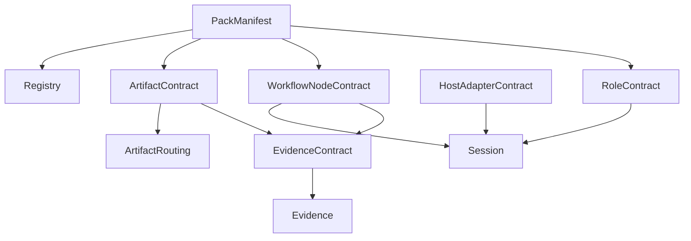

# F010: Garage Shared Contracts

- Feature ID: `F010`
- 状态: 草稿
- 日期: 2026-04-11
- 定位: 定义 `Garage` 在 phase 1 先冻结的共享契约层，让 `Garage Core` 能以平台中立方式承接多个 `Capability Pack`，并坚持 `Markdown-first`、`file-backed` 的主事实面。
- 当前阶段: phase 1
- 关联文档:
  - `docs/GARAGE.md`
  - `docs/architecture/A110-garage-extensible-architecture.md`
  - `docs/architecture/A120-garage-core-subsystems-architecture.md`
  - `docs/architecture/A130-garage-continuity-memory-skill-architecture.md`
  - `docs/features/F110-reference-packs.md`
  - `docs/features/F020-shared-contract-schemas.md`
  - `docs/wiki/W030-hermes-agent-harness-engineering-analysis.md`
  - `docs/wiki/W010-clowder-ai-harness-engineering-analysis.md`

## 1. 文档目标与范围

这篇文档要回答的问题是：

**在 `Garage Core` 与 `Capability Packs` 之间，哪些共享契约需要在 phase 1 先冻结，才能让新增能力主要通过“注册 + 映射”的方式进入系统。**

本文覆盖的共享契约：

- `PackManifest`
- `RoleContract`
- `WorkflowNodeContract`
- `ArtifactContract`
- `EvidenceContract`
- `HostAdapterContract`

本文暂不覆盖：

- 具体 pack 的完整角色清单与节点图
- 具体 prompts、templates、rules 原文
- 完整 schema 字段全集
- 数据库化、服务化或远程市场实现

当前阶段，我们先冻结 contract 的最小语义和交互关系，而不是立刻冻结完整字段全集。

## 2. 设计输入与吸收原则

`Garage` 的 shared contracts 不是凭空定义的，而是建立在已经收敛出的平台判断之上。

从 `Hermes` 吸收的主要原则是：

- `session` 是长期连续工作的第一等对象
- `memory / session / skill / evidence` 必须分层
- 扩展 seam 要先于实现细节被定义
- 不同入口应共享同一 core 语义

从 `Clowder` 吸收的主要原则是：

- 共享契约应独立成层
- 平台要作为控制面，而不是 workflow 外壳
- 治理规则应工件化，而不是只藏在聊天历史里
- 宿主差异应由适配层吸收

`Garage` 对这些原则的进一步约束是：

- 角色由 pack 注册，不由平台硬编码
- 主工件与主证据面保持 `Markdown-first`
- phase 1 以 `file-backed` 为主事实源
- 当前 reference packs 为 `coding` 与 `product insights`

## 3. 为什么需要 Shared Contracts

如果没有共享契约，`Garage` 很快就会退化成下面两种坏形态之一：

- 平台核心不断学习具体领域术语，最后被某个领域锁死
- 每新增一种能力，就新增一套私有接入方式，最后无法持续扩展

因此，shared contracts 的存在目的不是“多写一层抽象”，而是为了把下面这件事做稳：

- 让 `Garage Core` 只理解中立对象
- 让新能力主要表现为“新增 pack 声明”
- 让 `Session`、`Registry`、`Governance`、`Artifact Routing`、`Evidence` 使用同一套共同语言
- 让不同宿主通过同一组核心语义协作
- 让工件和证据默认具备可读、可追溯、可恢复的性质

## 4. Shared Contracts 层负责什么

这一层负责定义：

- pack 如何接入平台
- role 如何进入系统
- node 如何声明输入输出与协作边界
- artifact 如何映射到统一文件面
- evidence 如何被记录、关联和回读
- host 如何与 core 交互

这一层真正负责的不是“规定能力怎么实现”，而是“规定能力如何进入系统并与平台协作”。

## 5. Shared Contracts 层不负责什么

- 不负责具体领域内容生成
- 不负责 pack 内部 prompts、模板细节和术语写法
- 不负责运行时会话状态本身
- 不负责质量判断、审批裁决或路径写入执行
- 不负责把平台提前做成重型服务控制面

换句话说，这一层负责稳定接口，不负责业务细节。

## 6. 六类 Contract 总览

| Contract | 存在目的 | 主要被谁声明 | 主要被谁消费 |
| --- | --- | --- | --- |
| `PackManifest` | 定义 pack 最小身份与接入面 | pack | `Registry` / `Session` / `Governance` |
| `RoleContract` | 定义角色如何进入系统 | pack | `Session` / 团队协作层 / `Governance` |
| `WorkflowNodeContract` | 定义节点协作边界 | pack | `Session` / `Governance` |
| `ArtifactContract` | 定义中立工件接口 | pack 与 core 共享 | `Artifact Routing` / `Evidence` |
| `EvidenceContract` | 定义追溯记录接口 | core 与 pack 共享 | `Evidence` / `Governance` / `Session` |
| `HostAdapterContract` | 定义宿主如何与 core 交互 | 宿主适配层 | `Session` / `Governance` |

这张图表达的是 contract 之间的责任关系：

- `PackManifest` 负责装配
- `RoleContract` 与 `WorkflowNodeContract` 负责协作骨架
- `ArtifactContract` 与 `EvidenceContract` 负责主事实面
- `HostAdapterContract` 负责外部接入面

## 7. `PackManifest`

### 7.1 为什么存在

- 让一个 pack 以声明式方式进入系统
- 让平台知道“这是哪个能力包、从哪里进入、会暴露哪些角色、节点和工件面”

### 7.2 负责什么

- 声明 pack 的稳定身份
- 声明入口节点、导出角色、节点集合、支持的 `artifactRole`
- 声明该 pack 依赖的模板面、规则面和其他引用面

### 7.3 不负责什么

- 不承载节点内部逻辑
- 不承载 prompts 原文或模板内容本体
- 不保存会话运行状态
- 不替代完整的 pack 文档

### 7.4 最小字段或维度

- `packId`
- `packVersion` 或 `contractVersion`
- `entryNodes`
- `roleRefs`
- `nodeRefs`
- `supportedArtifactRoles`
- `policyRefs` / `templateRefs`

### 7.5 与其他 Contract 的关系

- 作为 `RoleContract`、`WorkflowNodeContract`、`ArtifactContract` 的聚合入口
- 被 `Registry` 读取并注册
- 被 `Session` 用来解析 pack 入口
- 被 `Governance` 用来定位 pack 级规则覆盖面

### 7.6 Phase 1 边界

- 以本地文件 manifest 为主
- 只需覆盖 `coding` 与 `product insights` 两个 reference packs
- 不做远程发现、在线安装、动态热插拔生态

## 8. `RoleContract`

### 8.1 为什么存在

- 让角色由 pack 注册，而不是由平台预置固定组织结构
- 让“谁能读什么、写什么、触发什么”有稳定边界

### 8.2 负责什么

- 声明角色身份与职责边界
- 声明可读工件面、可写工件面、可触发节点或可参与 handoff 的范围
- 为团队协作层提供角色语义，而不是让 core 硬编码领域角色

### 8.3 不负责什么

- 不定义角色的人设文案、prompt 风格或模型选择
- 不承担组织权限系统或复杂 RBAC
- 不声明节点内部执行步骤

### 8.4 最小字段或维度

- `roleId`
- `packId`
- `responsibility`
- `readableArtifactRoles`
- `writableArtifactRoles`
- `triggerableNodes`
- `handoffScope`

### 8.5 与其他 Contract 的关系

- 由 `PackManifest` 导出
- 与 `WorkflowNodeContract` 一起定义哪个角色可参与哪个节点
- 与 `ArtifactContract` 一起定义角色对哪些中立工件有读写边界

### 8.6 Phase 1 边界

- 默认服务单创作者工作流
- 只做协作语义边界，不做复杂组织权限模型
- 不冻结所有未来角色，只冻结注册方式

## 9. `WorkflowNodeContract`

### 9.1 为什么存在

- 让工作流节点成为稳定协作边界，而不是临时 prompt 片段
- 让 `Session`、`Governance`、`Artifact Routing` 能围绕统一节点语义协作

### 9.2 负责什么

- 定义节点的目的、输入、输出与允许流转
- 定义是否需要人工确认、是否允许并行、是否要求补证据后才能继续
- 定义节点与角色、工件之间的连接关系

### 9.3 不负责什么

- 不定义完整执行引擎或调度器
- 不约束宿主界面如何展示节点
- 不承载节点内部 prompts 与具体生成策略

### 9.4 最小字段或维度

- `nodeId`
- `packId`
- `intent`
- `inputArtifactRoles` / `inputContext`
- `outputArtifactRoles`
- `allowedTransitions`
- `humanConfirmationRequired`
- `parallelizable`

### 9.5 与其他 Contract 的关系

- 由 `PackManifest` 聚合
- 使用 `RoleContract` 约束参与角色
- 产出 `ArtifactContract` 所声明的工件角色
- 触发 `EvidenceContract` 所要求的状态转移记录、验证记录或审批记录

### 9.6 Phase 1 边界

- 以确定性主链和显式 handoff 为主
- 不做复杂编排图引擎、跨进程调度或实时多执行器协同
- 允许 pack 自定义节点图，但不要求平台先冻结完整全集

## 10. `ArtifactContract`

### 10.1 为什么存在

- 让平台理解中立的 `artifactRole`，而不是理解各领域文件名和术语
- 让不同 pack 的产物能落到统一、可读、可回溯的文件面

### 10.2 负责什么

- 定义工件角色、权威写入目标、文件类型与 sidecar 约定
- 定义哪些工件是主工件，哪些工件是补充描述或机器状态
- 为 `Artifact Routing` 提供稳定路由依据

### 10.3 不负责什么

- 不定义具体内容模板与文风
- 不充当重型媒体资产管理系统
- 不判定工件内容质量是否达标

### 10.4 最小字段或维度

- `artifactRole`
- `authorityRule` 或 `pathRule`
- `primaryFormat`
- `sidecarConvention`
- `readWriteSemantics`
- `lifecycleHint`

### 10.5 与其他 Contract 的关系

- 被 `PackManifest` 声明为 pack 支持的中立工件面
- 被 `WorkflowNodeContract` 作为输入输出边界引用
- 被 `EvidenceContract` 用于关联证据来源和产物 lineage

### 10.6 Phase 1 边界

- 主工件以 Markdown 为主
- 机器可读状态通过轻量 YAML / JSON sidecar 承载即可
- 默认本地文件系统落盘
- 二进制或富媒体资产只保留引用位，不做完整资产系统

## 11. `EvidenceContract`

### 11.1 为什么存在

- 让 `evidence` 与 `session` 分离，避免过程状态和追溯记录混桶
- 让 review、decision、verification、approval、archive 有统一记录面

### 11.2 负责什么

- 定义最小记录结构
- 定义证据与 `session`、`node`、`artifact`、`approval`、`archive` 的 lineage 关联方式
- 定义证据记录的追加式、可回溯语义

### 11.3 不负责什么

- 不替代会话上下文本身
- 不保存所有瞬时聊天细节
- 不演变成通用遥测或分析平台
- 不承担长期偏好记忆

### 11.4 最小字段或维度

- `evidenceType`
- `sourcePointer`
- `relatedSession`
- `relatedNode`
- `relatedArtifacts`
- `verdict` / `outcome`
- `lineageLinks`
- `archiveState`

### 11.5 与其他 Contract 的关系

- 接收 `WorkflowNodeContract` 的状态转移结果
- 接收 `ArtifactContract` 所对应的工件物化结果
- 接收治理相关的审批、验证、例外与归档结果
- 为后续 resume、review、archive 提供统一引用面

### 11.6 Phase 1 边界

- 证据记录以 Markdown 为主，辅以轻量索引 sidecar
- 采用追加式记录，不要求图数据库或事件总线
- 优先保证“人能读、系统能指向、后续能恢复”

## 12. `HostAdapterContract`

### 12.1 为什么存在

- 让不同宿主共享同一 core 语义，而不是各自长出一套流程
- 把入口差异收敛在边缘适配层，而不是污染 `Garage Core`

### 12.2 负责什么

- 定义如何创建 `session`、恢复 `session`、提交步骤、请求审批、请求发布、请求 closeout
- 定义宿主与 core 之间的最小输入输出封装
- 定义宿主可声明的能力边界，而不是默认假设所有宿主都具备相同交互能力

### 12.3 不负责什么

- 不定义 pack 内部逻辑
- 不绕过 `Session` 直接操作节点内部细节
- 不重写 artifact 或 evidence 语义
- 不为某个宿主创造专属 workflow 分支

### 12.4 最小字段或维度

- `adapterId` / `hostKind`
- `capabilities`
- `createSession`
- `resumeSession`
- `submitStep`
- `requestApproval`
- `requestPublish`
- `requestCloseout`
- `interruptOrHandoffHooks`

### 12.5 与其他 Contract 的关系

- 它是外部入口与 core 的边界，不直接替代 `PackManifest`、`RoleContract` 或 `WorkflowNodeContract`
- 它只通过稳定 contract 驱动 `Session`、`Governance` 和证据沉淀
- 宿主新增时，不应要求 pack 改写自己的内部语义

### 12.6 Phase 1 边界

- 只定义少量宿主都能共享的最小一致交互
- 不做复杂多端同步协议
- 不把宿主能力差异扩散成 core 内部条件分支

## 13. Contract 之间如何协作

### 13.1 `Team Runtime` 如何通过 contracts 落地

在 `Garage` 的顶层架构里，`Team Runtime` 是一层重要概念，但 phase 1 不需要把它实现成独立的重型服务。

当前阶段，它主要由下面这些 contract 和 core 能力共同承载：

- `RoleContract`：声明谁能参与协作
- `WorkflowNodeContract`：声明协作节点与 handoff 边界
- `ArtifactContract`：声明协作过程中的显式输入输出面
- `EvidenceContract`：声明 review、decision、approval、archive 的追溯记录面
- `Session` 与 `Governance`：分别负责运行时边界和规则执行

因此，phase 1 的 `Team Runtime` 可以理解为：

- 一个由 `Session + Governance + contracts + pack-local handoff patterns` 共同实现的协作层

而不是额外再建一套并行平台。

### 13.2 phase 1 的 `Bridge` seam 如何表达

phase 1 中，`Bridge` 很重要，但它**不是独立的第七个共享 contract**。

当前阶段，`Bridge` seam 由下面三类 contract 组合表达：

- `WorkflowNodeContract`
  - 声明哪些节点具备跨 pack handoff 能力
- `ArtifactContract`
  - 声明 handoff 依赖的中立工件角色
- `EvidenceContract`
  - 声明 handoff 发生时需要留下哪些判断、验证和 lineage 记录

必要时，`PackManifest` 可以额外挂载：

- `bridgeRefs`
- `handoffTargets`

但这仍然属于对现有 contract 的组合使用，而不是新增一层完全独立的共享 contract。

`Garage` 的 6 个 contract 不是并排摆放的独立说明，而是一条协作链：

1. 宿主通过 `HostAdapterContract` 提交创建或恢复请求。
2. `Session` 通过 `PackManifest` 识别当前 pack，并解析可用的 `RoleContract` 与 `WorkflowNodeContract`。
3. 节点推进时，角色在 `RoleContract` 边界内读取或写入 `ArtifactContract` 所声明的工件面。
4. 工件被物化后，相关结果进入 `EvidenceContract` 规定的记录面。
5. 审批、验证、例外、归档同样通过 `EvidenceContract` 挂接到统一 lineage。

因此：

- `PackManifest` 是装配入口
- `RoleContract` 与 `WorkflowNodeContract` 是协作骨架
- `ArtifactContract` 与 `EvidenceContract` 是主事实面
- `HostAdapterContract` 是外部接入面

## 14. Phase 1 收敛范围

当前阶段应非常克制。

phase 1 只做这些事：

- 冻结 contract 的最小语义和最小维度
- 只用 `coding` 与 `product insights` 两个 reference packs 验证 contract 是否成立
- 核心事实面坚持 `Markdown-first` 与 `file-backed`

phase 1 不做这些事：

- 不做远程 registry
- 不做在线市场
- 不做重型数据库控制面
- 不做复杂权限系统
- 不把 `writing`、`video` 的领域细节提前写死进 contract

## 15. 扩展策略

- 新能力通过新增 `PackManifest` 与对应 `RoleContract`、`WorkflowNodeContract`、`ArtifactContract` 接入
- 新角色通过注册扩展，不通过平台硬编码扩展
- 新工件通过新增 `artifactRole` 与映射规则扩展，不通过核心识别具体领域文件名扩展
- 新证据类型通过追加式 taxonomy 与 lineage 关系扩展，不破坏现有记录面
- 新宿主通过新增 `HostAdapterContract` 实现接入，不复制 core 语义

contract 演进应以向后兼容的增量扩展为主，新增字段优先作为可选维度或 sidecar 扩展。

## 16. 对 phase 1 reference packs 的意义

- `coding` pack 用来验证角色注册、节点协作与工件路由是否足以表达“研究 -> 规格 -> 实现 -> 验证”链路
- `product insights` pack 用来验证平台是否能承接不同于 coding 的领域术语、产物与证据面

两者共同证明的是：

**平台理解的是中立 contract，而不是某个单一领域。**

## 17. 遵循的设计原则

- 平台中立：core 只理解中立对象，不理解具体领域名词。
- `Pack-first` 扩展：新增能力优先通过 pack 接入，而不是修改 core。
- 角色注册化：角色由 pack 注册，不由平台写死。
- `Contract-first`：先冻结边界和对象，再讨论实现细节。
- `Markdown-first`：面向人的主工件与主证据默认是 Markdown。
- `File-backed`：phase 1 以文件为主事实源，sidecar 只承载轻量机器状态。
- `Session` 与 `Evidence` 分离：过程状态不等于追溯记录。
- `Governance as artifacts`：规则、门禁、审批与归档先写成工件。
- 宿主中立：不同宿主共享同一 core 语义，差异留在 adapter。
- 默认可追溯：关键推进默认留下可引用、可恢复、可归档的 lineage。
- phase 1 克制：先做小而稳的 contract 骨架，不提前长成重型平台。

