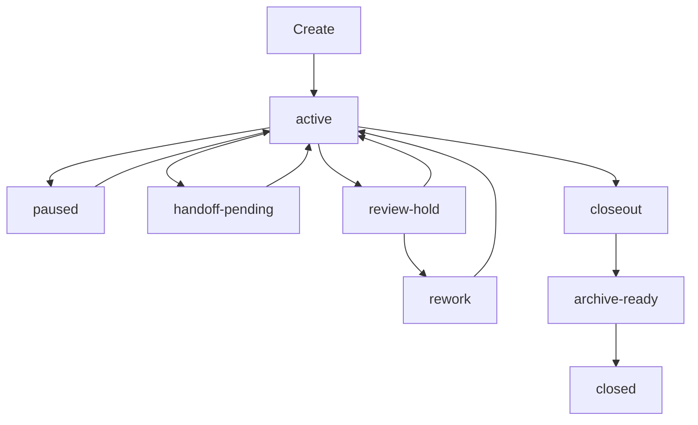

# F040: Garage Phase 1 Session Lifecycle And Handoffs

- Feature ID: `F040`
- 状态: 草稿
- 日期: 2026-04-11
- 定位: 定义 `Garage` 在 phase 1 的 `session lifecycle` 与 `handoff` 语义，确保不同 host、node、pack 在同一套 core 语义下推进、暂停、交接、评审、返工、收尾与归档准备。
- 当前阶段: phase 1
- 关联文档:
  - `docs/GARAGE.md`
  - `docs/architecture/A110-garage-extensible-architecture.md`
  - `docs/architecture/A120-garage-core-subsystems-architecture.md`
  - `docs/features/F010-shared-contracts.md`
  - `docs/architecture/A130-garage-continuity-memory-skill-architecture.md`
  - `docs/features/F110-reference-packs.md`
  - `docs/features/F050-governance-model.md`
  - `docs/features/F120-cross-pack-bridge.md`

## 1. 文档目标与范围

这篇文档只回答一个问题：

**`Garage` 在 phase 1 应先冻结怎样的 `session lifecycle` 和 `handoff semantics`，才能让 `Garage Core`、`Shared Contracts` 和 `reference packs` 共享同一套运行时边界。**

本文覆盖：

- `session` 的持久状态与生命周期动作
- `create / resume / pause / handoff / review-hold / rework / closeout / archive-ready / closed` 的语义边界
- 节点内、跨节点、跨 pack 的交接规则
- 它与 `Governance`、`Artifact Routing`、`Evidence` 的关系

本文不覆盖：

- 具体 schema 字段全集
- UI / CLI 交互细节
- 数据库化、调度器或服务化实现

## 2. 为什么需要这份文档

目前 `Garage` 的文档已经解释了愿景、总架构、core 子系统、contracts、continuity 和 reference packs，但“当前一次工作如何推进、何时停、怎样交接”还没有被单独冻结。

如果缺少这一层定义，很容易出现：

- 不同 host 各自发明自己的 `pause` 或 `resume`
- 不同 pack 对 `review-hold`、`closeout`、`archive-ready` 有不同理解
- 跨 pack handoff 继续依赖隐式聊天上下文

因此，这篇文档的价值，是把 `Session`、`WorkflowNodeContract`、`ArtifactContract`、`EvidenceContract`、`Governance` 之间的运行时 glue layer 说清楚。

## 3. Session 在总体架构中的位置

`Session` 是 `Garage Core` 的协调边界，负责承接“当前一次工作正在发生什么”。

它拥有的核心视图应包括：

- 当前 `pack`
- 当前 `node`
- 当前上下文指针
- 当前 handoff 状态
- 当前主线与未决 gate

它不承担：

- `memory` 的长期事实职责
- `skill` 的方法沉淀职责
- `evidence` 的追溯记录职责
- 具体领域术语的解释职责

## 4. Lifecycle 动作与持久状态

为了避免语义混写，phase 1 应明确区分：

- 生命周期动作
- 持久状态

### 4.1 生命周期动作

- `create`
- `resume`
- `pause`
- `handoff`
- `enter-review-hold`
- `enter-rework`
- `start-closeout`
- `mark-archive-ready`
- `close`

### 4.2 持久状态

- `active`
- `paused`
- `handoff-pending`
- `review-hold`
- `rework`
- `closeout`
- `archive-ready`
- `closed`

这里的关键点是：

- `create` 与 `resume` 是动作，不是长期状态
- `pause` 不等于 `review-hold`
- `closeout` 不等于 `archive-ready`
- `rework` 不等于普通 `resume`

## 5. 各状态的进入与退出条件

### 5.1 `active`

表示当前主线正在推进。

进入条件：

- 新建 session 完成初始化
- 从 `paused`、`review-hold`、`rework`、`handoff-pending` 恢复

退出条件：

- 进入 `paused`
- 进入 `handoff-pending`
- 进入 `review-hold`
- 进入 `closeout`

### 5.2 `paused`

表示临时停放，不表示质量结论。

必须留下：

- checkpoint
- 阻塞原因
- 建议 next step

### 5.3 `handoff-pending`

表示责任正在从源 `node / role / pack` 转移到目标。

它只有在目标侧显式接受后，才能回到 `active`。

### 5.4 `review-hold`

表示等待 review、approval 或 gate verdict。

它和普通 `paused` 的区别是：

- `paused` 只是中断
- `review-hold` 依赖外部裁决

### 5.5 `rework`

表示因 review 或 gate 结论而回流主线的受约束重开。

必须绑定：

- 缺口来源
- 返工范围
- 目标修复面

### 5.6 `closeout`

表示工作实质完成后进入收尾整理。

重点是：

- 结果汇总
- 未决风险
- lineage 整理
- 交付说明

### 5.7 `archive-ready`

表示已满足归档前条件，但不等于已归档。

phase 1 中，真正的 archive 动作仍可保持显式和保守。

### 5.8 `closed`

表示该 session 已完成主线关闭，不再作为活跃工作主线继续推进。

## 6. 节点内与跨节点 handoff

同 pack 内的 handoff 也必须是一等架构动作，而不是临时 prompt 跳转。

一个合法的 node-to-node handoff 至少应包含：

- 源状态摘要
- 输入 / 输出工件指针
- 关键 decision
- 未决问题
- 目标节点与责任说明

同 pack 跨节点 handoff 可以复用同一套 artifact taxonomy，但仍然必须形成显式 handoff 记录，不能只靠聊天上下文延续。

## 7. 跨 pack handoff 与 bridge seam

跨 pack handoff 不是简单的 node 切换，而是跨领域语义边界的显式 `bridge`。

源 pack 必须输出可被目标 pack 消费的 handoff surface：

- bridge artifact
- 关键 evidence
- 未决问题
- 范围说明
- acceptance hints

目标 pack 再通过自己的 `PackManifest`、`WorkflowNodeContract` 和 `ArtifactContract` 重新映射成自身入口语义。

phase 1 中，最关键的是把：

- `product-insights -> coding`

这条 bridge 说明白，用它验证“跨 pack 推进依赖 artifact + evidence，而不是隐式上下文”。

## 8. 与 Governance、Artifact、Evidence 的关系

`session lifecycle` 本身不独立存在，它依赖三条稳定关系：

### 8.1 与 `Governance`

`Governance` 决定：

- 哪些状态转移被允许
- 哪些需要审批
- 哪些需要 review 先完成
- 哪些暂时被阻塞

### 8.2 与 `Artifact Routing`

`Artifact Routing` 提供 handoff 的权威输入输出面。

一旦跨边界：

- 工件优先级应高于聊天上下文和临时解释

### 8.3 与 `Evidence`

`Evidence` 负责记录：

- 状态转移
- review verdict
- approval
- verification
- closeout
- archive lineage

可以把这段关系压缩成一句话：

**handoff = session 边界转移 + artifact surface + evidence lineage + governance gate**

## 9. 与 continuity 的关系

这篇文档必须和 continuity 设计保持一致：

- `session` 只负责当前工作边界
- `memory` 提供长期事实
- `skill` 提供可复用方法
- `evidence` 提供关键记录

跨 node 或跨 pack 的 handoff，优先走：

- `artifact + evidence`

而不是让 `session` 越权替代 `memory`、`skill` 或 archive record。

## 10. Phase 1 收敛范围

phase 1 在 lifecycle 上只做这些事：

- 冻结 `session` 的稳定状态语义
- 冻结 handoff 的最小责任面
- 保证 review / rework / closeout / archive-ready 的边界不混写
- 让两个 reference packs 共享同一套 session 语义

phase 1 不做这些事：

- 不做实时多人协作
- 不做复杂并发锁
- 不做分布式调度器
- 不做强同步多设备会话
- 不做自动 archive pipeline

## 11. 对 phase 1 reference packs 的意义

对 `Product Insights Pack`：

- 它定义了 bridge 前如何推进、暂停、review 与 handoff

对 `Coding Pack`：

- 它定义了实现主线中的 resume、review-hold、rework、closeout、archive-ready

对两个 pack 的共同意义：

- 证明 `Garage Core` 理解的是中立生命周期与交接 contract，而不是某个单一领域流程

## 12. 遵循的设计原则

- `Session` 是协调边界，不是万能状态桶。
- 生命周期动作与持久状态分离，避免语义混写。
- Handoff by artifacts and evidence：交接优先依赖显式工件与证据。
- Governance before transition：关键状态转移先经过规则、审批或 gate 判断。
- Pack-neutral core：core 只理解 `session / pack / node / artifact / evidence` 等中立对象。
- `Markdown-first` / `file-backed`：phase 1 优先保证人可读、系统可指向、后续可恢复。
- `Pause` 不等于 `review-hold`，`closeout` 不等于 `archive-ready`，`rework` 不等于普通 `resume`。
- phase 1 克制：先冻结小而稳的 session semantics，再扩展自动化和多 pack 编排复杂度。

