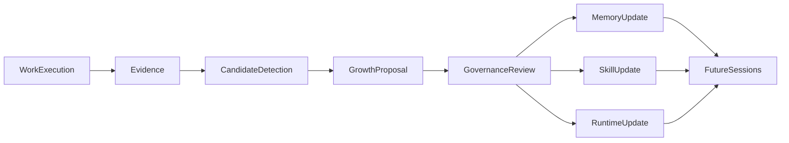

# F080: Garage Self-Evolving Learning Loop

- Feature ID: `F080`
- 状态: 草稿
- 日期: 2026-04-11
- 定位: 定义 `Garage` 的主动成长能力切面，明确系统如何从 evidence 中持续形成成长候选、生成 `GrowthProposal`、在治理下推进 `memory / skill / runtime update`，并以 workspace-first 方式持久化这一过程。
- 当前阶段: 完整架构主线，实施将按切片推进
- 关联文档:
  - `docs/GARAGE.md`
  - `docs/architecture/A110-garage-extensible-architecture.md`
  - `docs/architecture/A120-garage-core-subsystems-architecture.md`
  - `docs/architecture/A130-garage-continuity-memory-skill-architecture.md`
  - `docs/architecture/A140-garage-system-architecture.md`
  - `docs/features/F050-governance-model.md`
  - `docs/features/F060-artifact-and-evidence-surface.md`
  - `docs/features/F070-continuity-mapping-and-promotion.md`

## 1. 文档目标与范围

这篇文档只回答一个问题：

**如果 `Garage` 想成为一个会主动成长的 runtime，那么它的 learning loop 应该如何稳定地发生。**

本文覆盖：

- 从 `evidence` 到 `GrowthProposal` 的主动成长主链
- `memory`、`skill`、`runtime update` 三类更新结果
- 主动成长默认允许什么自动化、哪些动作必须经过治理
- workspace-first 的 proposal persistence 与 lineage 原则

本文不覆盖：

- 具体 pack 的候选来源细表
- 具体 skill 文件格式
- 具体 UI 审批界面
- 具体模型或工具实现细节

## 2. 为什么需要单独一篇 learning loop 文档

如果没有这篇文档，`Garage` 很容易退化成下面两种坏形态之一：

- **只有 continuity，没有成长**：系统会记录 evidence，但不会因为 evidence 而变强。
- **只有自动化，没有治理**：系统会把看到的模式直接固化成长期资产，最终产生 memory 污染、skill 漂移和行为不可解释。

因此，`Garage` 需要一条独立的 learning loop 主线，用来回答：

- 系统怎样主动发现经验
- 经验怎样变成 proposal
- proposal 怎样进入治理
- 哪些 proposal 最终能变成长期更新

## 3. learning loop 的总体判断

`Garage` 的主动成长不是“黑箱自动学习”，而是：

**基于 evidence 的、可追溯的、workspace-first 的、由 governance 约束的持续改进循环。**

这意味着：

- agent 可以主动发现经验
- agent 可以主动提出 proposal
- agent 可以主动建议 memory / skill / runtime update
- 但长期更新必须经过架构定义好的治理路径

## 4. canonical learning loop

这条 loop 表达的是：

1. 团队先做真实工作。
2. 工作先形成 evidence。
3. 系统再从 evidence 中识别值得长期化的模式。
4. 识别结果被显式写成 `GrowthProposal`。
5. proposal 进入治理路径。
6. 被接受的 proposal 才能进入未来 session 所消费的长期资产或 runtime update。

## 5. loop 的 6 个阶段

### 5.1 Evidence Capture

系统先留下足够 evidence，例如：

- decision
- review
- verification
- approval
- archive
- execution trace

没有 evidence，就不应谈长期成长。

### 5.2 Candidate Detection

agent 在 evidence 基础上主动识别：

- 哪些长期事实被反复确认
- 哪些方法被反复证明有效
- 哪些协作纪律、review checklist、prompt 模块或 policy 需要更新

这一阶段允许自动进行。

### 5.3 GrowthProposal Drafting

识别出的候选不应直接写入长期资产，而应先形成 `GrowthProposal`。

一个最小 proposal 至少应说明：

- proposal id
- 来源 evidence
- 候选类型
- 候选理由
- 风险等级
- 建议治理动作

### 5.4 Governance Review

proposal 进入治理路径后，系统要回答：

- 这是不是长期成立的事实
- 这是不是可重复复用的方法
- 这是不是只应停留在当前 workspace 的局部经验
- 这是不是影响 runtime 行为的更新，需要更严格审批

### 5.5 Update Application

被接受的 proposal 可以进入三类更新结果：

- `MemoryUpdate`
- `SkillUpdate`
- `RuntimeUpdate`

被拒绝的 proposal 应保留拒绝原因，而不是静默消失。

### 5.6 Future Reuse

被接受的更新必须真正回流到后续 session：

- `memory` 影响未来判断
- `skill` 影响未来执行方法
- `runtime update` 影响未来协作纪律与运行行为

否则所谓“成长”就只是一次性记录，而不是长期能力提升。

## 6. 三类更新结果

### 6.1 MemoryUpdate

适用于：

- 稳定偏好
- 长期约束
- 跨 session 仍成立的背景事实
- 被反复确认的长期方向判断

### 6.2 SkillUpdate

适用于：

- 新增可复用 workflow
- patch 旧 skill
- 拆分或合并 skill
- 稳定复查方法和 closeout 方法

### 6.3 RuntimeUpdate

适用于：

- prompt 模块调整建议
- review checklist 更新
- policy / rule 更新建议
- 协作纪律与 routing 策略更新建议

这里最关键的判断是：

- `memory` 解决“以后应该记住什么”
- `skill` 解决“以后应该怎么做”
- `runtime update` 解决“团队自身以后该怎样运行得更好”

## 7. 默认自动化边界

`Garage` 不是被动系统，因此 learning loop 默认允许一定程度的自动化。

### 7.1 默认允许自动化

- evidence 捕获
- candidate detection
- `GrowthProposal` 草案生成
- proposal 的来源链接与状态跟踪

### 7.2 允许自动推进，但必须有显式规则

- 低风险 `memory` 更新
- 低风险 skill patch
- 低风险 runtime hygiene update

这里的前提是：

- 架构已经定义了明确白名单
- governance 已明确允许该类自动化

### 7.3 默认必须经过更严格治理

- 新 skill 创建
- 影响团队协作方式的 runtime update
- 影响安全、审批、archive 语义的 policy update
- 跨 workspace 的长期共享

## 8. workspace-first persistence

完整架构默认坚持：

- `workspace-first persistence`

这意味着：

- proposal 的主观察面来自当前 workspace 的 evidence
- proposal 的状态应在当前 workspace 内可追踪
- proposal 不能只存在于模型上下文或临时缓存里

建议冻结下面这些原则：

- `GrowthProposal` 必须有稳定 ID
- proposal 必须能回指 source evidence
- proposal 状态必须可恢复、可审计
- proposal 的机器辅助状态可以进入 `.garage/`
- proposal 的关键决策结果必须在 evidence 或 archive 侧可回看

这里的关键判断是：

- proposal 可以是 machine-first 对象
- 但 proposal 的存在、来源和结论不能成为黑箱

## 9. 与 packs 的关系

packs 不直接拥有 learning loop 本身，但 packs 会贡献：

- evidence 候选来源
- skill 候选来源
- runtime update 候选来源
- pack-specific 的风险与治理要求

也就是说：

- `F080` 负责冻结成长 loop 本体
- `F070` 负责解释不同 packs 在这条 loop 上如何映射与晋升

## 10. learning loop 上的三条红线

为了避免“主动成长”退化成不可维护的自动化，至少要守住下面三条红线：

1. 没有 evidence 的观察，不得直接形成长期更新。
2. `GrowthProposal` 不得绕过 governance 直接写入 `memory`、`skill` 或 runtime update。
3. proposal 的结果必须可追溯，不能只留下最终结论而丢掉来源。

## 11. 一句话总结

`Garage` 的 learning loop，不是“让系统自己偷偷学习”，而是让 agent 团队基于 evidence 主动提出成长提案，再在治理之下把经验变成 `memory`、`skill` 和 runtime update，从而让团队随着工作持续变强。
