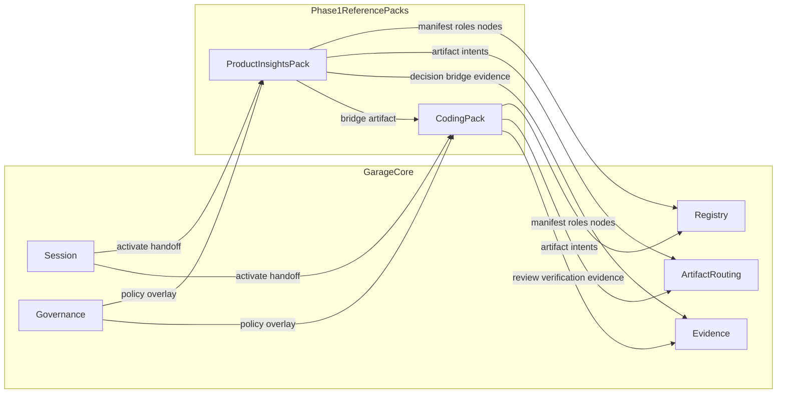

# F110: Garage Phase 1 Reference Packs

- Feature ID: `F110`
- 状态: 草稿
- 日期: 2026-04-11
- 定位: 定义 `Garage` 在 phase 1 用来验证共享 contract 的两个 `reference packs`，说明它们与 `Garage Core` 的映射关系、职责边界、共同形状与后续扩展路径。
- 当前阶段: phase 1
- 关联文档:
  - `docs/GARAGE.md`
  - `docs/architecture/A110-garage-extensible-architecture.md`
  - `docs/architecture/A120-garage-core-subsystems-architecture.md`
  - `docs/features/F010-shared-contracts.md`
  - `docs/architecture/A130-garage-continuity-memory-skill-architecture.md`
  - `docs/design/D110-garage-product-insights-pack-design.md`
  - `docs/design/D120-garage-coding-pack-design.md`
  - `docs/features/F120-cross-pack-bridge.md`

## 1. 文档目标与范围

这篇文档只回答一个问题：

**`Garage` 在 phase 1 为什么先冻结 `Coding Pack` 与 `Product Insights Pack` 作为两个 `reference packs`，以及它们应如何验证平台中立的 core 与 shared contracts。**

本文覆盖：

- 两个 `reference packs` 的选择理由
- 它们与 `Garage Core` / `Shared Contracts` 的映射关系
- 各自拥有的职责与不应泄漏到 core 的领域语义
- 所有未来 pack 应复用的共同形状
- `Writing Pack` 与 `Video Pack` 的扩展路径
- phase 1 的非目标与主要风险

本文不覆盖：

- pack 内部完整角色清单
- pack 内部完整节点图
- 具体 prompt、模板、目录和文件实现
- host 入口细节或服务化方案

## 2. 什么是 phase 1 的 `reference pack`

`reference pack` 不是写死在平台里的特权能力，也不是未来唯一合法的能力形态。

它的本质是：

- phase 1 用来验证平台 contract 的第一批标准样板
- 证明 `Garage` 可以在不改写 core 的前提下承接不同类型的创作能力

因此，`reference pack` 必须同时满足两点：

- 足够真实，能够代表一类稳定创作工作
- 足够不同，能够暴露 core contract 是否真正平台中立

## 3. 为什么是 `Coding Pack` 与 `Product Insights Pack`

phase 1 先选择这两个 pack，不是因为它们“最重要”，而是因为它们能形成一条最小但异质的创作闭环。

`Product Insights Pack` 覆盖的是上游认知型工作：

- framing
- research
- opportunity
- concept
- probe
- bridge

`Coding Pack` 覆盖的是下游构建型工作：

- 规格化
- 设计
- 任务化
- 实现
- 验证
- 收尾

两者组合起来，刚好能验证 `Garage` 的几个关键判断：

- core 是否只理解中立对象
- contract 是否足以承接不同 artifact shape
- handoff 是否能通过 artifact 与 evidence 完成
- pack 之间的协作是否能不依赖隐式聊天上下文

phase 1 先只选这两个 pack，是为了优先验证“少而异质”的架构正确性，而不是追求能力数量。

为避免后续任务命名漂移，当前建议先冻结这组区分：

- `packId = coding`
- `displayName = Coding Pack`
- `packId = product-insights`
- `displayName = Product Insights Pack`

未来 `writing`、`video` 等 pack 也遵循同样模式：

- 机器语义使用稳定 `packId`
- 面向人的文档可使用可读的显示名

## 4. `reference packs` 在总体架构中的位置

这张图表达的是：

- `Garage Core` 只理解 `session`、`pack`、`role`、`node`、`artifact`、`evidence`
- `reference packs` 负责把自己的领域语义映射到这些中立对象上
- 两个 pack 都通过同一组 contract 接入，而不是使用各自私有的接入方式

## 5. 两个 reference packs 如何映射到 core

| `Garage Core` / contract | `Product Insights Pack` 的映射 | `Coding Pack` 的映射 |
| --- | --- | --- |
| `Session` | 承接上游问题形成与洞察推进，支持 bridge 前的阶段切换与恢复 | 承接下游构建推进与收尾，支持实现中的 review / verification / resume |
| `Registry` | 注册洞察类 roles、nodes 和 artifact roles | 注册构建类 roles、nodes 和 artifact roles |
| `Governance` | 注入研究质量、假设验证、bridge 完整性等规则 | 注入 review、verification、completion 等规则 |
| `Artifact Routing` | 把 framing / insight / concept / probe / bridge 等工件映射到中立 artifact roles | 把 spec / design / tasks / implementation / review / closeout 等工件映射到中立 artifact roles |
| `Evidence` | 记录信号来源、判断依据、机会取舍和 bridge lineage | 记录设计取舍、验证结果、review verdict 和 closeout lineage |

这张映射表想说明的是：

平台只理解稳定 contract，不理解领域名词本身。  
每个 pack 都必须自己完成从领域语言到中立 contract 的映射。

## 6. `Product Insights Pack` 的职责与边界

### 6.1 它负责什么

- 把模糊方向收敛成更清晰的问题、机会、概念与待验证假设
- 组织上游研究与判断过程
- 形成可被下游 pack 消费的 `bridge artifact`
- 沉淀与方向选择有关的 evidence

### 6.2 它拥有的东西

- 自己的领域术语
- 自己的 roles、nodes 与 handoff 结构
- 自己的 artifact taxonomy 与 review 重点
- 与研究、判断、验证相关的治理 overlay

### 6.3 它不应泄漏到 `Garage Core`

- `insight`
- `opportunity`
- `concept`
- `probe`
- 研究 heuristics、信号打分方法、判断模板
- pack 内部角色组织方式
- pack 专属的评审标准和 completion 语义

## 7. `Coding Pack` 的职责与边界

### 7.1 它负责什么

- 把已收敛的问题或 `bridge artifact` 转成可推进的构建链
- 组织方案定义、实现推进、验证、复查与收尾
- 沉淀与实现质量、完成状态相关的 evidence

### 7.2 它拥有的东西

- 自己的构建语义与交付语义
- 自己的 roles、nodes 与 review loops
- 自己的 artifact taxonomy 与 quality gates
- 与 verification、review、closeout 相关的治理 overlay

### 7.3 它不应泄漏到 `Garage Core`

- `spec`
- `design`
- `task`
- `code review`
- 语言、框架、仓库形态相关的专属假设
- pack 内部的实现步骤与检查表
- pack 专属的质量门禁细则

## 8. 所有 pack 的共同形状

未来任何新 pack，都应先对齐同一套共同形状，再谈领域细节：

| 共同形状 | 说明 |
| --- | --- |
| `Pack identity` | pack 的定位、范围、入口、退出条件 |
| `Pack manifest` | pack 身份、入口节点、支持的 roles / nodes / artifact roles |
| `Team shape` | pack 自己的角色分工、节点关系和 handoff 方式 |
| `Artifact mapping` | 领域工件如何映射到中立 artifact roles |
| `Governance overlay` | pack 专属的 review / approval / gate / archive 规则 |
| `Evidence model` | pack 需要记录哪些判断、验证与 lineage |
| `Bridge seam` | 这个 pack 如何通过 artifact 与 evidence 把输出交给其他 pack 使用 |

只要一个新 pack 能自然落进这套共同形状，它就应该主要通过新增 pack 文档和 contract 声明接入，而不是修改 core。

phase 1 中，`Bridge seam` 不是独立的第七个共享 contract，而是通过：

- `WorkflowNodeContract`
- `ArtifactContract`
- `EvidenceContract`
- 必要时由 `PackManifest` 声明的 handoff 目标

共同表达出来。

## 9. `Writing Pack` 与 `Video Pack` 应如何接入

phase 1 不要求立刻把 `Writing Pack` 和 `Video Pack` 做出来，但它们的扩展路径应该已经清楚：

### 9.1 `Writing Pack`

应先定义：

- 它服务的创作结果类型
- 自己的 roles / nodes
- 写作类 artifact mapping
- 写作类 review / publish overlay
- 与其他 pack 的 bridge seam

### 9.2 `Video Pack`

应先定义：

- 它服务的视频结果类型
- 自己的 roles / nodes
- 脚本、镜头、素材引用等 artifact mapping
- 视频类 review / publish overlay
- 富媒体只先定义引用位，不把媒体资产管理提前塞进 core

## 10. phase 1 不要求的内容

为了保证架构收敛，phase 1 明确不要求：

- 立即做完整的 `Writing Pack` 或 `Video Pack`
- 冻结所有 pack 的完整角色树和节点图
- 引入数据库、服务化控制面或多租户系统
- 支持 pack marketplace、远程发现或动态热插拔生态
- 做完整富媒体资产管理
- 把跨 pack 自动编排一次性做全
- 把 host 入口差异写进 pack 语义

## 11. phase 1 的主要风险

### 11.1 core 被 `Coding Pack` 的语言拖成实现导向平台

控制点：

- core 与 shared contract 文档坚持中立对象表述
- 领域名词只留在 pack 层

### 11.2 `Product Insights Pack` 被降格为上游附件

控制点：

- 为它定义独立的入口、退出、artifact mapping 与 bridge seam

### 11.3 不同 pack 长出不同接入形状

控制点：

- 用统一的 pack shape 约束 `manifest + team shape + artifact mapping + governance + evidence + bridge`

### 11.4 pack 之间的交接继续依赖隐式上下文

控制点：

- 跨 pack handoff 必须优先通过 artifact 与 evidence，而不是依赖聊天记忆

### 11.5 富媒体 pack 过早冲击 phase 1 边界

控制点：

- phase 1 只验证扩展 seam 和引用位，不提前做完整媒体系统

## 12. 这份文档对后续开发的意义

这份文档的作用，不是提前写死 `coding` 与 `product insights` 的所有内部实现。

它真正要做的是先把这几个问题说清楚：

- 哪两个 pack 先作为样板进入系统
- 它们为什么足以验证平台中立性
- 它们各自拥有什么、不能泄漏什么
- 未来 `writing`、`video` 应该如何沿着同一模式进入系统

只有这些边界先稳定下来，后面拆开发任务时，才不会一边写代码一边改平台语义。

## 13. 遵循的设计原则

- 平台中立：core 只理解中立对象，不理解领域名词。
- Pack 拥有领域语义：pack 负责“做什么、产出什么、如何协作”，core 负责“怎么编排、怎么约束、怎么落盘、怎么追溯”。
- `Contract-first`：先冻结接入 shape，再讨论内部实现。
- Open for extension, closed for modification：新增能力优先表现为新增 pack，而不是修改 core。
- Handoff by artifacts and evidence：跨 pack 交接优先依赖显式工件与证据。
- `Markdown-first` / `file-backed`：phase 1 先保证可读、可落盘、可追溯。
- phase 1 克制：先用两个 `reference packs` 证明架构成立，再扩大能力面。

