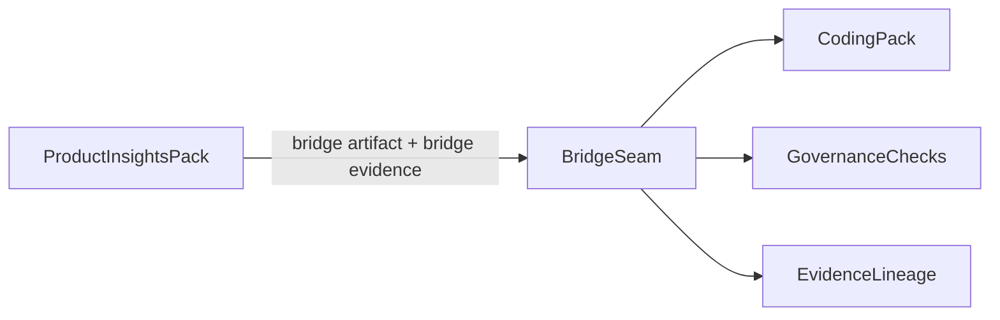

# F120: Garage Phase 1 Cross-Pack Bridge

- Feature ID: `F120`
- 状态: 草稿
- 日期: 2026-04-11
- 定位: 定义 `Garage` 在 phase 1 的跨 pack bridge，明确 `Product Insights Pack -> Coding Pack` 的 handoff seam、bridge artifact、bridge evidence、acceptance 语义、回流语义与治理检查点。
- 当前阶段: phase 1
- 关联文档:
  - `docs/GARAGE.md`
  - `docs/features/F110-reference-packs.md`
  - `docs/design/D110-garage-product-insights-pack-design.md`
  - `docs/design/D120-garage-coding-pack-design.md`
  - `docs/features/F010-shared-contracts.md`
  - `docs/features/F040-session-lifecycle-and-handoffs.md`
  - `docs/features/F050-governance-model.md`

## 1. 文档目标与范围

这篇文档只回答一个问题：

**phase 1 中，`Product Insights Pack` 如何把输出稳定地交给 `Coding Pack`，并且这条 handoff seam 不需要新增一个第七类 shared contract。**

本文覆盖：

- 为什么 bridge 需要单独文档
- `bridge seam` 与独立 contract 的边界
- `bridge artifact` 与 `bridge evidence` 的最小责任面
- acceptance 语义
- rework 回流语义
- 生命周期与治理检查点

本文不覆盖：

- 完整 schema
- 具体模板正文
- 实现级自动编排细节

## 2. 为什么 bridge 需要单独文档

`Product Insights Pack` 和 `Coding Pack` 之间不是普通 node handoff。

它们的差异在于：

- 上游更偏判断、机会、概念、验证
- 下游更偏规格、实现、验证、closeout

如果没有单独的 bridge 文档，很容易出现两种错误：

- 上游以为“我已经想清楚了”，下游却无法消费
- 下游强行实现，实际上输入边界还不稳定

所以，bridge 不应该被当成一句“交过去就行”，而应被当成 phase 1 的关键设计 seam。

## 3. `Bridge seam` 不等于第七个 contract

phase 1 中，`bridge seam` 很重要，但它不是独立的第七个 shared contract。

当前阶段，它由下面几类 contract 组合表达：

- `WorkflowNodeContract`
  - 声明哪些节点具备跨 pack handoff 能力
- `ArtifactContract`
  - 声明 handoff 依赖的中立工件角色
- `EvidenceContract`
  - 声明 handoff 时必须留下哪些判断、验证与 lineage
- `PackManifest`
  - 必要时声明 `handoffTargets` 与 bridge 相关 refs

这意味着：

- phase 1 不额外创造 `BridgeContract`
- 而是让 bridge 成为既有 contract 的组合应用

## 4. Bridge 在总体架构中的位置

这张图想表达的不是“bridge 是一个服务”，而是：

- 它是跨 pack handoff 的组合边界
- 它总是伴随 artifact、evidence、lifecycle 与 governance 一起出现

## 5. `bridge artifact` 的最小责任面

phase 1 中，一个可交给 `Coding Pack` 的最小 bridge artifact，至少应说明：

- 当前要解决的问题
- 目标用户或目标对象
- 预期结果
- 当前选中的机会或 wedge
- 当前 scope 边界
- 当前明确不做什么
- 关键未知项

bridge artifact 不是完整 spec，它的作用是：

- 把上游结果压成下游能理解和接住的输入

## 6. `bridge evidence` 的最小责任面

bridge 不能只交 artifact，不交 evidence。

phase 1 的 bridge evidence 至少应说明：

- 关键判断依据
- 主要来源或信号
- 已做过哪些 probe 或验证
- 哪些假设仍未关闭
- 为什么现在适合交给 `Coding Pack`

bridge evidence 的价值是：

- 让下游知道当前输入为什么成立
- 以及哪些部分其实还不稳定

## 7. acceptance 语义

bridge 被交出去，不等于下游必须接住。

phase 1 建议冻结下面这组 acceptance 结果：

- `accepted`
- `accepted-with-gaps`
- `needs-clarification`
- `rejected-return-upstream`

这里要明确：

- acceptance 是 verdict，不是新的共享 contract
- acceptance 结果应进入 evidence
- acceptance 结果会影响 session 的后续流转

## 8. rework 回流语义

bridge 不应是单向一次性动作。

如果 `Coding Pack` 判断：

- 问题边界仍不清楚
- 假设仍过于危险
- bridge artifact 缺少关键输入

就应允许回流。

phase 1 中，回流不应被视为失败，而是：

- 对 cross-pack boundary 的正常保护动作

回流至少应带回：

- 拒绝或待澄清原因
- 缺失项
- 建议补足方向

## 9. 生命周期与治理检查点

bridge 前后应至少经过这组检查点：

### 9.1 bridge-ready 检查点

由 `Product Insights Pack` 判断：

- 是否已有足够清晰的问题定义
- 是否有最小可消费 artifact
- 是否有关键 evidence

### 9.2 bridge-acceptance 检查点

由 `Coding Pack` 判断：

- 输入是否足够进入 intake / specify
- 哪些缺口仍需补足

### 9.3 rework 检查点

如果 acceptance 失败或部分失败，应明确：

- 是回到 `Product Insights Pack`
- 还是在 `Coding Pack` 内继续澄清

### 9.4 lineage 检查点

无论被接受还是回流，都应留下：

- bridge artifact 指针
- bridge evidence 指针
- acceptance verdict
- rework 或 handoff lineage

## 10. 与 session lifecycle 的关系

bridge 是跨 pack handoff，因此它必须和 `session lifecycle` 对齐。

phase 1 中可理解为：

- 上游在 `handoff-pending` 前准备 bridge
- 下游 intake 期间做 acceptance
- 接受后回到新主线 `active`
- 不接受则进入 `review-hold` 或 `rework` 回流

bridge 不应绕过 lifecycle，而应成为 lifecycle 的受控转移点。

## 11. Phase 1 收敛范围

phase 1 只需要证明：

- `Product Insights Pack` 能稳定交出 bridge artifact 与 bridge evidence
- `Coding Pack` 能显式给出 `accepted / accepted-with-gaps / needs-clarification / rejected-return-upstream`
- bridge 全程可追溯
- bridge 不依赖隐式聊天上下文

phase 1 不要求：

- 多 pack 自动编排引擎
- 复杂跨 pack routing 系统
- 所有 pack 之间都做 bridge
- 完整 bridge 模板库

## 12. 对后续开发的意义

这篇文档的作用，是把 phase 1 最关键的一次 cross-pack handoff 固定下来。

因为只要这条 seam 不稳定，后面的开发任务就会反复摇摆：

- 上游要产出什么
- 下游到底接什么
- 不足时如何回流
- 什么算“真的准备好进入实现”

所以它是任务拆分前必须冻结的桥梁文档。

## 13. 遵循的设计原则

- Bridge by composition：bridge 由既有 contract 组合表达，而不是新增一套特权 contract。
- Handoff by artifacts and evidence：跨 pack 交接优先依赖显式 artifact 与 evidence。
- Acceptance is explicit：是否接受必须形成明确 verdict，而不是默认继续。
- Rework is normal：回流是受控保护动作，不是异常失败。
- Governance before pack switch：跨 pack 转移先经过治理检查点。
- Lifecycle aligned：bridge 不绕过 `session lifecycle`，而是其一部分。
- phase 1 克制：先证明 `product-insights -> coding` 这条 bridge 成立，再谈更复杂多 pack 编排。

