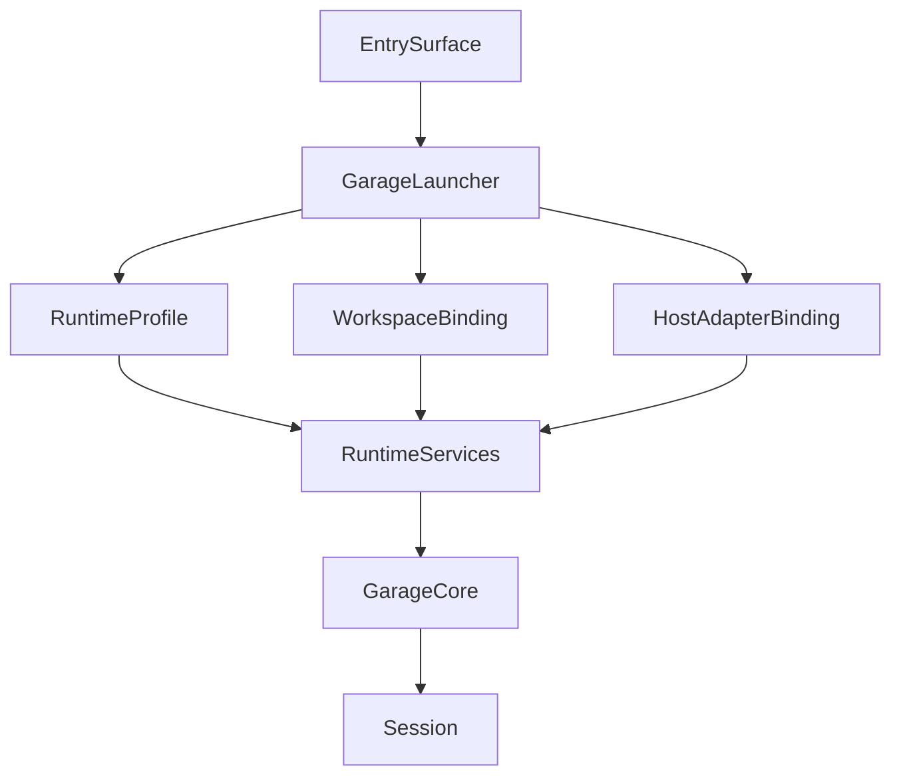

# F220: Garage Runtime Bootstrap And Entrypoints

- Feature ID: `F220`
- 状态: 草稿
- 日期: 2026-04-11
- 定位: 定义 `Garage` 作为独立可运行程序时的启动链与多入口统一模型，确保未来无论从 `CLI`、`IDE`、聊天入口还是轻 UI 进入，都进入同一个 runtime core，而不是各自长出独立流程。
- 当前阶段: 完整架构主线，实施将按切片推进
- 关联文档:
  - `docs/GARAGE.md`
  - `docs/architecture/A110-garage-extensible-architecture.md`
  - `docs/architecture/A120-garage-core-subsystems-architecture.md`
  - `docs/architecture/A140-garage-system-architecture.md`
  - `docs/features/F010-shared-contracts.md`
  - `docs/features/F080-garage-self-evolving-learning-loop.md`
  - `docs/features/F230-runtime-provider-and-tool-execution.md`
  - `docs/features/F210-runtime-home-and-workspace-topology.md`

## 1. 文档目标与范围

这篇文档只回答一个问题：

**如果 `Garage` 的目标不只是一个设计仓库，而是一个像 `clowder-ai` 或 `hermes-agent` 那样可独立运行的程序，那么它的启动链和入口模型应该如何先冻结。**

本文覆盖：

- `Garage` 作为独立程序的运行定位
- 启动链的最小分层
- 多入口如何汇入同一 runtime
- bootstrap 与 `Session / Registry / Governance / Artifact Routing / Evidence` 的关系

本文不覆盖：

- 具体命令行 flags
- 具体 UI 设计
- 具体 provider / tool backend 实现
- 多进程或分布式部署细节

## 2. 为什么需要这份文档

现有 `Garage` 设计已经清楚定义了：

- 平台中立的 `Garage Core`
- pack 如何通过 shared contracts 接入
- `session`、`governance`、`artifact`、`evidence` 的稳定语义

但如果目标是“可独立运行程序”，仅有这些还不够。

还必须回答：

- 程序从哪里启动
- 启动时先加载什么
- 多入口怎样共享同一个 core
- 谁负责把 runtime home、workspace、host adapter 和 session 恢复串起来

如果这层不冻结，后续很容易出现：

- `CLI` 入口一套逻辑，`IDE` 入口另一套逻辑
- 每个入口都自己加载 pack、自己恢复 session
- runtime 语义被 host 反向定义

## 3. `Garage` 作为独立程序的运行定位

如果沿着 `clowder-ai` 与 `hermes-agent` 的方向演进，`Garage` 不应只被理解为：

- 一组文档
- 一批 workflow 资产
- 一个 repo-local 文件约定

它还应被理解为：

**一个 local-first、multi-entry、session-aware 的 runtime control plane。**

这意味着：

- 用户可以从不同入口进入同一个 `Garage`
- 不同入口共享同一套 `Session`、`Registry`、`Governance` 与主事实面语义
- pack 不需要因为入口不同而重写内部语义

## 4. 启动链的最小分层

建议把独立程序的启动链先拆成 4 层：

| 层级 | 作用 | 典型对象 |
| --- | --- | --- |
| `Entry Surface` | 接住外部交互方式 | `CLI`、`IDE`、聊天入口、轻 UI |
| `Bootstrap Layer` | 把外部入口翻译成统一 runtime 启动动作 | `GarageLauncher`、`RuntimeProfile`、`WorkspaceBinding`、`HostAdapterBinding` |
| `Runtime Core` | 承接统一会话、治理、路由与追溯语义 | `Session`、`Registry`、`Governance`、`Artifact Routing`、`Evidence` |
| `Capability Layer` | 承接 pack、执行面与成长面 | `Capability Packs`、provider/tool execution layer、growth services |

这里最关键的判断是：

- entry surface 不是 runtime 本体
- bootstrap 不是 pack 逻辑
- host adapter 不是 core

## 5. 启动链中的最小稳定对象

为避免后续不同入口各自发明 bootstrap 逻辑，建议先冻结下面这组 runtime bootstrap 对象：

- `GarageLauncher`
  - 程序主入口，负责组织一次启动过程
- `RuntimeProfile`
  - 描述当前运行配置、默认 host、可用能力集与 profile 级偏好
- `WorkspaceBinding`
  - 描述当前 runtime 绑定的是哪个 workspace
- `HostAdapterBinding`
  - 描述本次启动选择了哪个 host adapter，以及该 adapter 的能力边界
- `BootstrapConfig`
  - 描述这次启动显式传入了哪些覆盖项
- `RuntimeServices`
  - 描述启动后需要统一可用的运行时服务集合

这些对象的作用不是替代 `Garage Core`，而是：

- 把启动面冻结为同一套语言

## 6. canonical bootstrap sequence

当前主线建议把启动链固定成下面这条责任顺序：

1. 解析 `GarageLauncher` 的启动意图。
2. 解析当前 `RuntimeProfile`。
3. 解析目标 `WorkspaceBinding`。
4. 选择并绑定 `HostAdapterBinding`。
5. 初始化 `RuntimeServices`。
6. 加载 shared contracts、packs、governance artifacts、continuity stores 与 workspace surfaces。
7. 创建或恢复 `Session`。
8. 把后续交互统一送入 `Garage Core`。

## 7. 多入口如何共享同一 runtime

未来 `Garage` 可以有很多入口：

- `CLI`
- `IDE`
- 聊天入口
- 轻 UI

但这些入口不应各自拥有一套启动和恢复逻辑。

统一规则应是：

- 所有入口都先走 `GarageLauncher`
- 都要显式绑定 `RuntimeProfile`
- 都要显式绑定 `WorkspaceBinding`
- 都要通过 `HostAdapterBinding` 暴露自己的能力差异
- 都要把真正的会话推进交给同一个 `Garage Core`

## 8. `HostAdapter` 在启动链中的位置

`HostAdapterContract` 解决的是：

- 外部入口如何和 core 说话

但它不等于整个 bootstrap layer。

bootstrap layer 还必须负责：

- profile 解析
- workspace 绑定
- runtime services 装配
- pack / policy / surface 的初始化

也就是说：

- `HostAdapter` 解决入口差异
- bootstrap layer 解决启动一致性

## 9. 与 `Garage Core` 的关系

启动链的职责到这里为止：

- 让程序启动
- 让 runtime 进入稳定状态
- 让 session 创建或恢复

从这一刻开始，真正稳定的 runtime 语义仍由 `Garage Core` 负责：

- `Session`
- `Registry`
- `Governance`
- `Artifact Routing`
- `Evidence`

bootstrap layer 不应越权：

- 不解释 pack 术语
- 不决定 artifact 语义
- 不替代 governance

## 10. 当前实现对启动链的收敛

当前实现阶段先只冻结这些判断：

- `Garage` 必须有统一 launcher 语义
- 不同入口共享同一 bootstrap chain
- bootstrap 必须显式解析 profile、workspace 与 host adapter
- session 创建 / 恢复不能散落在不同入口里

当前实现阶段还不需要先做：

- 多进程 supervisor
- 常驻 daemon
- 远程控制面 API
- 多租户入口调度器

## 11. 当前实现非目标

- 不先设计完整命令集
- 不先设计完整 GUI
- 不先冻结所有 host adapter 的具体实现
- 不先决定 `CLI-first` 还是 `IDE-first` 的最终产品姿态

当前实现阶段只需要先证明：

- 入口很多，但 runtime 只有一个

## 12. 遵循的设计原则

- One runtime, many entry surfaces：入口可以很多，但 runtime core 只能有一套。
- Bootstrap before interaction：先完成 profile、workspace、host 和 services 装配，再进入交互。
- Host-neutral core：入口差异留在 adapter 与 bootstrap 边缘，不扩散进 core。
- Session-first runtime：启动链必须服务 `Session` 的创建、恢复与稳定推进。
- Pack-independent bootstrap：bootstrap 不解释 pack 内部术语，不为某个 pack 定制启动逻辑。
- 当前主线克制：先冻结启动责任链，再考虑多进程、远程 API 与更重控制面。

