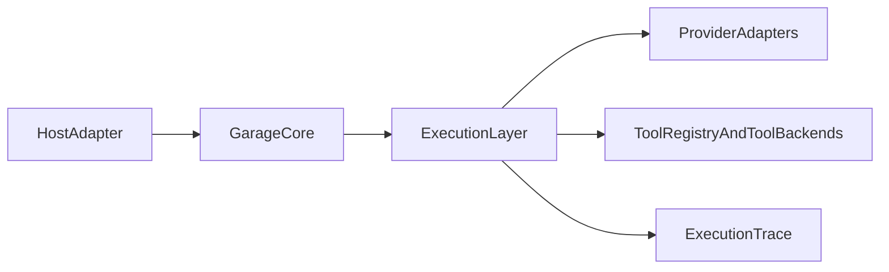

# F230: Garage Runtime Provider And Tool Execution

- Feature ID: `F230`
- 状态: 草稿
- 日期: 2026-04-11
- 定位: 定义 `Garage` 作为独立可运行程序时的 provider 与 tool execution 层，明确宿主入口、runtime core、模型适配与工具执行之间的责任边界。
- 当前阶段: 完整架构主线，实施将按切片推进
- 关联文档:
  - `docs/GARAGE.md`
  - `docs/architecture/A110-garage-extensible-architecture.md`
  - `docs/architecture/A120-garage-core-subsystems-architecture.md`
  - `docs/architecture/A140-garage-system-architecture.md`
  - `docs/features/F010-shared-contracts.md`
  - `docs/features/F080-garage-self-evolving-learning-loop.md`
  - `docs/features/F220-runtime-bootstrap-and-entrypoints.md`
  - `docs/features/F210-runtime-home-and-workspace-topology.md`

## 1. 文档目标与范围

这篇文档只回答一个问题：

**如果 `Garage` 要像 `clowder-ai` 或 `hermes-agent` 一样成为独立可运行程序，那么在 `HostAdapter` 和 `Garage Core` 之外，还需要怎样的 provider / tool execution 层。**

本文覆盖：

- provider 适配的责任边界
- tool execution 的统一运行层
- 这层与 `HostAdapter`、`Garage Core`、packs 的关系
- 当前主线先冻结哪些运行时对象

本文不覆盖：

- 某个具体模型厂商的接法
- 某个具体工具的实现代码
- 多进程 worker mesh
- 远程 agent marketplace

## 2. 为什么需要这份文档

当前 `Garage` 设计已经回答了：

- 用户如何进入系统
- pack 如何注册进系统
- `session` 如何推进
- artifact 与 evidence 如何落盘

但如果目标是“独立可运行程序”，还必须回答：

- 模型差异由谁吸收
- 工具能力由谁注册和裁剪
- 节点推进时，到底由谁去执行模型调用和工具调用

如果这一层缺失，`Garage` 就更像：

- workflow control plane

而不像：

- 真正能跑起来的 runtime

## 3. 这一层在总体结构中的位置

`HostAdapter` 负责把外部入口接进来。  
`Garage Core` 负责统一会话、治理、路由与追溯语义。  
provider / tool execution 层负责把：

- 模型调用
- 工具调用
- 执行结果归一化

接到同一个 runtime 语义里。

## 4. 三类边界不要混写

为了让 `Garage` 真正像独立程序一样可运行，必须明确区分 3 类边界：

| 边界 | 解决什么问题 | 不解决什么问题 |
| --- | --- | --- |
| `HostAdapter` | 用户从哪里进入系统 | 模型厂商差异 |
| `ExecutionLayer` | 模型和工具如何被统一执行 | pack 业务语义 |
| `Garage Core` | 会话、治理、路由、追溯 | 厂商协议和工具实现细节 |

这三层如果混写，最后会出现：

- host 直接知道模型协议
- pack 直接绑定某个厂商
- core 被工具调用细节污染

## 5. provider 适配层

### 5.1 存在目的

provider 适配层的目标是：

- 吸收模型厂商差异
- 统一执行请求和响应语义
- 让 pack 和 core 不必理解供应商协议

### 5.2 建议先冻结的运行时对象

- `ProviderAdapter`
  - 某类模型或执行后端的适配器
- `ExecutionRequest`
  - 一次执行请求的统一表达
- `ExecutionContext`
  - 当前执行时可用的 session、role、node、policy 与 tool 边界
- `ProviderResponse`
  - 归一化后的模型响应
- `ExecutionTrace`
  - 执行过程中的流式事件、tool 调用、错误与终止原因

### 5.3 关键判断

- `ProviderAdapter` 是 runtime 内部层，不是新的 pack-facing shared contract
- pack 不应直接绑定某个 provider name
- host 也不应直接决定 provider 协议细节

## 6. tool execution 层

### 6.1 存在目的

tool execution 层的目标是：

- 让工具能力成为统一运行面
- 让不同入口共享同一套核心工具语义
- 让工具执行受治理、证据和 session 语义约束

### 6.2 建议先冻结的运行时对象

- `ToolRegistry`
  - 工具能力的统一注册面
- `ToolCapability`
  - 某个工具或工具组对外暴露的能力边界
- `ToolCallEnvelope`
  - 一次工具调用的统一封装
- `ToolResult`
  - 一次工具调用的归一化结果
- `ApprovalCheckpoint`
  - 工具执行前后可能触发的审批或 gate 挂点

### 6.3 关键判断

- 工具能力是 runtime 能力面，不是某个 host 的附属物
- host 可以限制某些能力，但不能重写工具语义
- packs 可以声明需要什么能力边界，但不应自己实现 runtime tool registry

## 7. provider 与 tool execution 的统一语义

独立程序要稳定运行，关键不是“支持多少家厂商”，而是：

- 所有 provider 和 tool backends 最终都被归一化到同一组 runtime 事件

当前主线建议先冻结下面这组统一事件语义：

- execution started
- partial output streamed
- tool call requested
- tool result returned
- execution completed
- execution interrupted
- execution failed

不论底层是：

- SDK 直连
- CLI 包装
- 本地进程
- 远程服务

都应先被适配成同一套运行时事件。

## 8. 与 `HostAdapter` 的关系

`HostAdapterContract` 负责：

- 外部入口如何创建、恢复、提交步骤

但它不负责：

- 模型厂商适配
- 工具执行协议
- 流式事件归一化

也就是说：

- host adapter 是 ingress edge
- provider / tool execution 是 execution edge

## 9. 与 `Garage Core` 的关系

这层不替代 `Garage Core`，而是被 `Garage Core` 调用。

职责分界应是：

- `Session` 决定当前在哪个 pack / node / role 边界下推进
- `Governance` 决定当前动作是否允许、是否要审批、是否缺证据
- execution 层负责真正执行模型与工具
- `Artifact Routing` 与 `Evidence` 负责把结果物化和留痕

换句话说：

**core 决定“能不能做、为什么做、结果怎么留下”；execution 层决定“怎么真的去做”。**

execution layer 产生的 traces 会进入 `evidence`，并进一步成为 learning loop 的观察输入，但 execution layer 本身不决定任何长期更新是否成立。

## 10. 与 packs 的关系

packs 可以声明：

- 当前节点需要什么输入输出
- 当前节点允许哪些 tool capability
- 当前节点的 evidence requirements

但 packs 不应声明：

- 某个具体 provider 的私有协议
- 某个 host 独有的 tool 调度逻辑
- 某个执行后端的进程管理细节

pack 只描述：

- 需要什么能力

execution 层才负责：

- 用哪个 adapter 去满足这项能力

## 11. 当前实现收敛范围

当前实现阶段只需要先证明：

- `Garage` 有独立的 execution 层概念
- provider 差异被吸收到 adapter
- tool execution 有统一注册与结果归一化语义
- 这层能被 `Session`、`Governance`、`Evidence` 正确约束

当前实现阶段不要求：

- 多 provider 同轮并发编排
- 分布式 worker pool
- 远程工具市场
- 复杂工具沙箱系统

## 12. 当前实现非目标

- 不新增新的 pack-facing shared contract
- 不在当前阶段冻结全部工具 taxonomy
- 不把 CLI-first 或 SDK-first 提前写死成唯一实现路线
- 不先做 provider marketplace

## 13. 遵循的设计原则

- Execution layer 独立：模型适配和工具执行应是 runtime 内部稳定层，而不是散落在 host、core 或 pack 中。
- Provider differences stay below core：供应商差异应留在 adapter，不扩散进 core 和 packs。
- Tools are runtime capabilities：工具能力属于统一 runtime 能力面，而不是某个入口的临时附属品。
- Governance before execution：关键执行动作先经过 gate、approval 与 evidence 要求判断。
- Pack asks for capabilities, not vendors：packs 只声明需要什么能力，不绑定具体厂商或后端。
- No new shared contract by accident：这层是 runtime 内部层，不在当前主线中新增第七类 pack-facing shared contract。
- 当前主线克制：先冻结执行层边界和统一事件语义，再扩展 provider 数量与工具复杂度。

