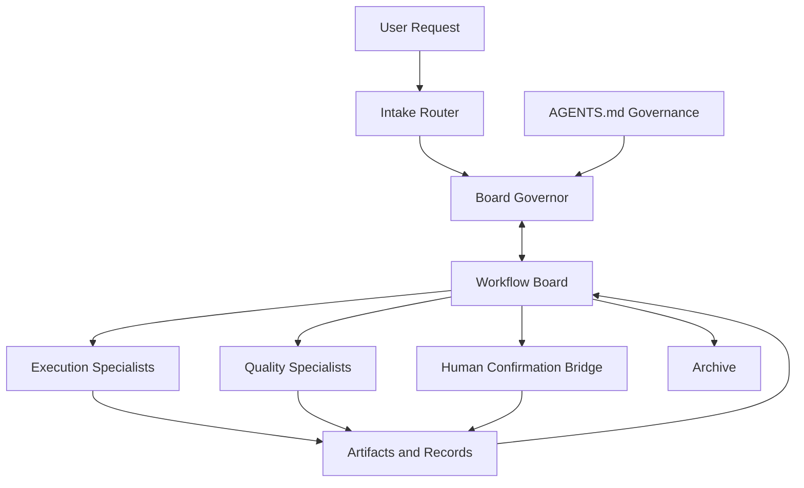
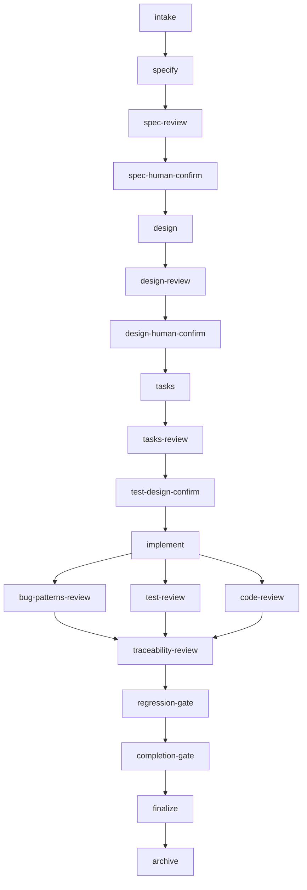

# `mdc-workflow` 多 Agent 工作模式设计方案

- 状态: 草稿
- 日期: 2026-04-02
- 关联背景:
  - `mdc-workflow/README.md`
  - `docs/mdc-workflow-skills-migration-audit.md`
  - `test_report/2026-04-01-mdc-workflow-e2e-test-summary.md`

## 概述

本设计的目标是把当前 `mdc-workflow` 从“单 agent 串行驱动的强约束 workflow”升级为“原生多 agent 的 Board + Specialists 工作操作系统”。

设计重点不是把现有 skill 简单包一层 subagent 调度，而是把以下能力提升为一等运行时模型：

- 目标态下以 `workflow-board` 作为唯一运行时事实源；迁移期实行兼容性的 dual-read / dual-write 协议
- specialist agents 作为节点执行者，而不是自由交谈的协作者
- `AGENTS.md` 继续作为唯一治理注入层
- `change workspace` 和 `archive` 作为 board 原生对象，而不是附属文档概念
- profile、review、gate、human confirmation 和恢复编排全部由运行时状态驱动

本方案保留 `mdc-workflow` 现有最重要的约束：

- 先路由，再执行
- profile 只调流程密度，不降低门禁
- review 通过不等于批准
- 完成必须基于 fresh evidence
- 工件和状态优先于聊天记忆

## 设计目标

1. 让 `full`、`standard`、`lightweight` 三种 profile 都能被 machine-readable runtime 原生执行。
2. 让 execution、review、gate 和 human confirmation 的职责边界在多 agent 模式下仍然清晰可控。
3. 让质量节点在不破坏主工件一致性的前提下获得受控并发能力。
4. 让 workflow 可以从任意中断点恢复，而不依赖单次会话记忆。
5. 让 `AGENTS.md` 继续作为路径映射、审批别名、团队规范和例外规则的唯一注入源。
6. 让现有 `SKILL.md` 从唯一执行定义，演进为“人类可读入口 + 约束解释 + runtime contract 对齐说明”。

## 非目标

- 不把 `mdc-workflow` 设计成自由聊天式 agent 群聊系统。
- 不允许 execution agent 自审、自批、自放行。
- 不在多个位置复制治理规则，避免 `AGENTS.md` 之外再出现平行配置源。
- 不追求所有节点都并发执行；主工件写入仍应保持单写模型。
- 不要求第一阶段就重写全部 skill；迁移应先 runtime，后 specialist，先兼容，后原生。

## 设计驱动因素

- 当前 `mdc-workflow-starter` 已经显式使用 `profile`、合法节点集合、迁移表和恢复编排规则，具备向 runtime 提升的基础。
- `docs/mdc-workflow-skills-migration-audit.md` 表明 starter 已显式吸收 `schema-first` 与 `contract-first` 方向，但大多数 skill 仍处于“部分迁移”。
- `test_report/2026-04-01-mdc-workflow-e2e-test-summary.md` 表明当前单 agent 主链已经可以完整试跑，因此新方案应优先复用既有 profile、节点语义和 gate，而不是推倒重来。
- 现有 README 把“不依赖 subagent 编排”作为边界；本设计是一个明确的下一代目标，需要在接受后同步修订 README、starter contract 和各节点 skill。
- 当前最真实的缺口不是“缺少更多 skill”，而是“缺少一个可以支撑多 agent 并发、租约、恢复和审计的统一 runtime”。

## 候选方案比较

## 候选方案 A：`Central Orchestrator`

### 它如何工作

由一个顶层 orchestrator agent 维护状态机、读取工件、分派任务并决定所有下一跳；其它 agent 只做执行。

### 优点

- 控制点最集中，规则最容易统一。
- 最容易从当前 `mdc-workflow-starter` 平滑演化。

### 缺点

- orchestrator 过重，容易成为单点瓶颈。
- specialist agent 的自治价值有限，本质仍接近单 agent 串行工作。
- 恢复、并发和冲突控制仍高度依赖中心 agent 的稳定性。

### 适配性判断

可行，但不适合作为“原生多 agent workflow OS”的目标形态。

## 候选方案 B：`Board + Specialists`

### 它如何工作

- 由 `workflow-board` 持有运行时状态、节点图、租约、快照、结果和下一跳规则。
- 各类 specialist agent 从 board 领取节点 lease，按 contract 执行后提交结构化 outcome。
- `Board Governor` 基于结果重新计算 `ready nodes`、`blocked nodes`、`retryFromNode` 和唯一下一推荐步骤。

### 优点

- 最符合原生多 agent 协作，但又保留 `mdc-workflow` 强门禁和工件驱动特性。
- 并发可以被限制在只读质量节点上，收益清晰、风险可控。
- 运行时状态和工件证据可以显式持久化，恢复和审计能力强。
- 能直接承接现有 starter 中已经存在的 `profile / next node / retry from node / requiredReads / expectedWrites` 思路。

### 缺点

- 需要设计清晰的 board schema、lease 机制和冲突恢复协议。
- 相比单 agent 串行流程，运行时复杂度明显上升。

### 适配性判断

最符合本次“激进重构为原生多 agent workflow OS”的方向，推荐采用。

## 候选方案 C：`Conversation Relay Network`

### 它如何工作

每个阶段 agent 直接将结果交给下一个 agent，例如 `spec -> design -> tasks -> implement -> review`，几乎不保留中央状态。

### 优点

- 表面上最轻，通信方式自然。
- 原型验证时可快速做出演示效果。

### 缺点

- 最容易出现阶段漂移、门禁绕过和状态分叉。
- 无法可靠支撑 profile、human confirmation、恢复编排和审计。
- 与 `mdc-workflow` 的“证据优先、顺序受控、工件驱动”原则冲突最大。

### 适配性判断

不适合作为 `mdc-workflow` 的正式演进方向。

## 选定方案

选择 **候选方案 B：`Board + Specialists`**。

选择理由：

- 它满足“原生多 agent”而不是“单 agent 加壳”的目标。
- 它可以最大化复用现有主链、支线、profile、review/gate 和 `AGENTS.md` 治理资产。
- 它允许并发只发生在只读 review 扇出，而不是让主工件进入无序多写。
- 它把“流程控制”从某个大脑 agent 的会话能力，升级为可恢复、可审计的 runtime 协议。

## 总体架构



该架构分成四层：

### 1. Governance Layer

- `AGENTS.md` 提供路径映射、审批别名、真人确认等价证据、模板覆盖、测试规范、profile 规则和例外约束。
- board runtime 不直接硬编码团队规则，而是消费治理注入结果。

### 2. Runtime Layer

- 目标态下，`workflow-board` 是系统唯一运行时事实源。
- `Board Governor` 根据 schema、治理规则和最新 outcome 计算 `ready nodes`、`blocked nodes`、`retryFromNode` 和唯一下一推荐步骤。

### 3. Agent Layer

- `Intake Router` 负责识别新需求、继续推进、增量变更、热修复或 review-only 场景。
- `Execution Specialists` 负责产出规格、设计、任务、实现、变更、热修和收尾。
- `Quality Specialists` 负责 review 和 gate。
- `Human Confirmation Bridge` 负责等待、收集和归档人类确认痕迹。

### 4. Artifact Layer

- 主工件、review 记录、verification 记录、progress view、change workspace 和 archive 都以文件或结构化记录方式存在。
- board 通过 snapshot 和 contract 管理这些工件的读写，而不是通过自然语言传递隐含状态。

## 兼容期权威规则

由于当前 `mdc-workflow` 仍以 starter + repo artifacts 作为实际恢复依据，多 agent 方案必须定义安全的 mixed-mode 迁移合同：

- 在批次 1 到批次 3 中，系统处于 `artifact-first + board-assisted` 兼容模式。
- 兼容模式下，board 与基线工件必须 dual-read / dual-write。
- board 可以计算 `ready nodes` 和 lease，但任何 gate 放行结论都必须与最新工件证据一致。
- 若 board 状态与 `task-progress.md`、review 记录、verification 记录或已批准工件冲突，按更保守的工件证据处理，并立即触发同步修正，不得自动向下游推进。
- 在兼容模式下，`task-progress.md` 仍是必需的用户可见状态视图，也是冲突时的核对入口之一。
- 只有在以下条件全部满足后，才允许硬切换到 `board-first`：
  - 主链 execution、review、gate 节点已全部拥有 machine-readable contract
  - `increment`、`hotfix`、`finalize`、human confirmation 和 archive 已接入 board
  - 至少完成一轮 dual-run 验证，确认 board 路由与现有 artifact-first 路由无分歧

这意味着 `workflow-board` 的“唯一事实源”地位是目标态，而不是迁移开始当天立即生效。

## Agent 角色矩阵

| Agent Role | 主要职责 | 允许写入 | 不得做的事 |
|---|---|---|---|
| `Intake Router` | 接收用户请求，识别 workflow session 类型，创建或恢复 session | session intake record、初始 routing metadata | 直接宣布进入实现、跳过 profile 判定 |
| `Board Governor` | 计算 profile、ready nodes、blocked nodes、lease 分配和下一跳 | board state、lease record、node state、retry policy | 伪造执行结果、代替 specialist 完成节点内容 |
| `Execution Specialists` | 完成 `specify / design / tasks / implement / increment / hotfix / finalize` 节点 | lease 授权范围内的工件和状态更新 | 自行改 profile、自行通过 review、自行推进下游 |
| `Quality Specialists` | 完成 review/gate，输出结构化 outcome | review/verification records | 顺手改代码或修改主工件 |
| `Human Confirmation Bridge` | 把人类确认和外部审批证据转成 board 可消费记录 | approval evidence records | 伪造确认、越过等待节点 |

## 核心运行时对象

### 1. `Workflow Session`

一个 session 表示一条完整交付流，至少包含：

- `sessionId`
- `topic`
- `profile`
- `graphVersion`
- `governanceSnapshot`
- `baselineArtifacts`
- `changeWorkspace`
- `archiveTargets`
- `currentRecommendedStep`
- `readyNodes`
- `blockedNodes`

其中：

- `currentRecommendedStep` 始终只表示一个当前步骤，可以是普通单节点，也可以是合成批次节点，例如 `quality-fanout`
- `readyNodes` 表示该步骤下当前可领取的实际节点集合；例如当 `currentRecommendedStep = quality-fanout` 时，`readyNodes` 可能同时包含 `mdc-bug-patterns`、`mdc-test-review`、`mdc-code-review`

### 2. `Node Attempt`

一个节点的单次执行尝试，至少包含：

- `attemptId`
- `nodeId`
- `nodeType`
- `leaseId`
- `dependsOn`
- `snapshotVersion`
- `ownerAgentType`
- `submittedOutcome`
- `retryFromNode`

### 3. `Artifact Snapshot`

board 不直接信任“当前文件看起来差不多”，而是发给 agent 明确快照：

- `artifactRole`
- `path`
- `version`
- `contentHash`
- `capturedAt`

### 4. `Lease`

lease 表示节点在一段时间内的执行权，至少包含：

- `leaseId`
- `nodeId`
- `ownerAgent`
- `requiredReads`
- `expectedWrites`
- `expiresAt`
- `heartbeatInterval`
- `retryPolicy`

### 5. `Outcome Record`

所有 execution、review、gate、approval 都必须提交结构化结果：

- `outcome`
- `findings`
- `evidence`
- `recommendedNextNode`
- `retryFromNode`
- `remainingRisks`

## 节点状态机

建议每个节点只在以下状态间迁移：

| 状态 | 含义 |
|---|---|
| `pending` | 前置条件未满足，不可领取 |
| `ready` | 可领取，但尚未分配 lease |
| `leased` | 已被某个 agent 领取 |
| `submitted` | agent 已提交结果，待 board 校验 |
| `passed` | 节点完成，允许解锁下游 |
| `revise` | 节点给出修订要求，需要回到 `retryFromNode` |
| `blocked` | 缺少关键证据、外部条件或上游工件 |
| `waiting_human` | 必须等待人类确认或审批 |
| `stale` | lease 失效或执行上下文过期，需由 board 重新对齐后再决定回到 `ready`、`blocked` 或人工仲裁 |
| `cancelled` | 因 profile 升级、支线切换或工作项失效而取消 |
| `archived` | 已进入归档，只用于审计和恢复 |

## Node Contract 形式

每个 `mdc-*` 节点最终都应拥有一份 machine-readable contract，而不仅是 prose 说明。建议最小字段集合为：

- `nodeId`
- `nodeType`
- `profiles`
- `requiredReads`
- `expectedWrites`
- `allowedOutcomes`
- `retryFromNode`
- `parallelism`
- `pauseKind`
- `humanConfirmationRequired`

示例：

```yaml
nodeId: mdc-code-review
nodeType: quality
profiles: [full, standard]
requiredReads:
  - approvedDesign
  - codeChanges
  - testChanges
expectedWrites:
  - reviewRecords/code-review-<attemptId>.md
allowedOutcomes: [pass, revise, blocked]
retryFromNode: mdc-test-driven-dev
parallelism:
  mode: read_only_parallel
pauseKind: none
humanConfirmationRequired: false
```

## Profile 节点图

### Full Profile

`full` profile 使用“串行主轴 + 受控并行 review 扇出”：



说明：

- `bug-patterns-review`、`test-review`、`code-review` 共享同一冻结候选快照，可并行执行。
- `traceability-review` 同时承担 quality fan-out 的 barrier 和 aggregator 角色，在 fan-out 之后汇总工件链路与 review 结果，避免过早放行。
- `regression-gate -> completion-gate -> release-approval? -> finalize -> archive` 在主链上保持串行。

quality fan-out 的收口语义必须固定，不允许靠会话印象决定：

- 只有在 `bug-patterns-review`、`test-review`、`code-review` 三个节点都已提交 outcome，或其中任一节点进入 `blocked`，board 才能关闭本轮 fan-out 批次并计算聚合结果。
- 汇总优先级固定为：`blocked` > `revise` > `pass`。
- 若任一节点为 `blocked`，整个 fan-out 批次视为 `blocked`，不得进入 `traceability-review`。
- 若不存在 `blocked`，但任一节点为 `revise`，整个 fan-out 批次视为 `revise`，统一回到 `mdc-test-driven-dev`；若发现明确指向上游工件缺失，`Board Governor` 必须升级 profile 或改回更上游节点，而不是继续停留在实现层。
- 只有三个节点全部 `pass`，才允许进入 `traceability-review`。

### Standard Profile

`standard` 不再从规格和设计起步，但仍使用相同的 board 协议：

```text
intake
-> tasks
-> tasks-review
-> test-design-confirm
-> implement
-> quality-fanout
-> traceability-review
-> regression-gate
-> completion-gate
-> finalize
-> archive
```

### Lightweight Profile

`lightweight` 保留短链，但不是跳步，而是更短的受控节点图。为保持当前 hard gate，不得省略测试/验证设计确认：

```text
intake
-> test-design-confirm
-> implement
-> regression-gate
-> completion-gate
-> finalize
-> archive
```

前置条件仍然成立：

- 必须能识别唯一工作项
- 必须能识别验证方式
- 必须能写回 fresh evidence
- 若边界或验证方式不清楚，board 必须升级 profile，而不是直接继续

说明：

- 若为了兼容现有 `mdc-test-driven-dev` 把 `test-design-confirm` 实现为节点内部暂停点，runtime 也必须把它视为显式 gate，而不是可省略的提示。
- `lightweight` 变短的只是 review 链，不是对测试设计确认或 fresh evidence 的降级。

## 统一收口顺序

为避免主链、增量支线和热修支线各自解释 closeout 顺序，统一规定如下：

### 普通主链 session

```text
completion-gate
-> release-approval? 
-> finalize
-> archive
```

### change / hotfix session

```text
completion-gate
-> release-approval?
-> finalize
-> merge-back
-> archive
```

规则说明：

- `release-approval?` 仅在 `AGENTS.md` 或节点 contract 要求发布审批时出现，否则直接进入 `finalize`
- `finalize` 的职责是写完 closeout record、release notes、evidence index 和 merge-back manifest，而不是直接把候选变更晋升为 baseline
- `merge-back` 只适用于 `change workspace` 和 `hotfix workspace`，并且必须基于 fresh baseline snapshot 执行 compare-and-set 校验
- `archive` 永远在最后执行，以确保归档内容包含 finalize 产物以及 merge-back 结果
- 前面的图为了突出主执行链，省略了可选的 `release-approval` 和 branch-only 的 `merge-back`；实际 runtime 以本节顺序为准

## 支线工作流

### 增量变更支线

`mdc-increment` 应升级为 change-session 工厂，而不是“顺手改一下任务和进度”的单节点逻辑：

```text
change-request
-> impact-analysis
-> change-workspace-open
-> spec-delta?
-> design-delta?
-> tasks-delta?
-> reroute-to-main-graph
```

关键规则：

- 所有增量变更都先进入独立 `change workspace`
- 支线目标是生成结构化影响分析和回流目标
- `reroute-to-main-graph` 的含义是“在同一 `change workspace` 内回到主链节点语义”，而不是直接跳回 baseline 主线
- 只有当必需的 `spec-delta`、`design-delta`、`tasks-delta` 已在当前变更工作区内完成 review / approval 后，board 才能把下一推荐节点设为 `implement`
- delta artifacts 在 merge-back 前都只是候选变更，不得自动视为 baseline artifacts
- 只有在变更工作区中的实现、review、gate 和 finalize 全部通过后，才允许执行 merge-back，把已批准 delta 合入 baseline artifacts
- merge-back 本身必须再做一次 fresh baseline snapshot compare-and-set 校验；若 baseline 已变化，则不得直接合入，必须重新对齐或转人工仲裁

### 热修复支线

`mdc-hotfix` 也应成为独立节点图，而不是紧急模式例外：

```text
hotfix-request
-> repro-confirm
-> hotfix-workspace-open
-> minimal-fix-plan
-> test-design-confirm
-> implement-fix
-> targeted-quality
-> regression-gate
-> completion-gate
-> finalize
-> merge-back
-> archive
```

关键规则：

- 没有 `repro-confirm` 就不得发修复 lease
- `targeted-quality` 可以按风险缩短，但不得彻底跳过
- 热修中的实现与验证同样发生在 `hotfix workspace` 内，而不是直接覆盖 baseline
- hotfix 中的候选修复在 merge-back 前同样不视为 baseline 事实
- 只有当 `minimal-fix-plan`、必要的上游 delta、targeted-quality、regression-gate、completion-gate 和 finalize 全部满足后，才允许 merge-back 到 baseline
- hotfix merge-back 也必须执行 fresh baseline snapshot compare-and-set 校验；若 baseline 已变化，则不得直接覆盖
- 热修完成后仍须回到 archive 和 release 记录链路

## 暂停点与自动推进

多 agent 模式下，暂停与否不由 agent 自行决定，而由 graph 中的 `pauseKind` 声明：

### 必须暂停的节点

- `spec-human-confirm`
- `design-human-confirm`
- `test-design-confirm`
- 可选的 `release-approval`
- 证据冲突且无法自动保守回退的仲裁点

### 自动推进的节点

- 普通 execution 节点
- 普通 quality 节点
- gate 节点在 board 校验 `pass` 后的下游迁移

这保证多 agent 模式不会因“先问一句用户再说”而把路由步骤误用成用户交互。

## 并发模型与冲突控制

### 并发原则

- 主工件默认单写。
- 只读 quality fan-out 可并行。
- gate 和 finalize 维持串行放行。
- review 和 verification 记录应尽量 append-only，避免多个 agent 共同编辑同一正文。

### 提交校验

agent 提交结果时，board 必须做 compare-and-set 校验：

- 若 `snapshotVersion` 未变化，可正常接收
- 若主工件在执行期间已被更新，提交不能直接覆盖 baseline
- 发生冲突时，节点进入 `revise`、`blocked` 或人工仲裁，而不是靠 agent 私自合并

### 租约规则

- lease 必须带 TTL 和 heartbeat
- 超时未续租时，节点回到 `ready` 或进入 `stale` 恢复流程
- agent 只能写 `expectedWrites` 中声明的范围
- 超范围写入视为违规提交，由 board 拒绝接纳

## 治理注入与 `AGENTS.md`

多 agent 方案不改变 `AGENTS.md` 的角色，反而更依赖它。

board runtime 必须从 `AGENTS.md` 注入以下信息：

- 工件角色到实际路径的映射
- approval、pass、revise、blocked 等状态别名
- 人类确认的等价证据来源
- spec、design、tasks、review、verification 模板覆盖
- coding、design、testing 规范
- profile 强制规则与轻量化例外
- 禁止并发或强制人工审批的高风险模块规则

禁止把这些规则复制到：

- board 私有配置
- 各个 skill 的重复硬编码 frontmatter
- 与 `AGENTS.md` 平行的独立映射文件

## 工件模型

建议把工件分成四类：

### 1. `Baseline Artifacts`

当前主线认可的规格、设计、任务、review、verification、release 和状态视图。

### 2. `Change Workspace`

用于增量变更和热修复的隔离工作区，承载：

- impact analysis
- delta artifacts
- targeted review records
- reroute decision

### 3. `Archive`

一次 workflow session 完成后的冻结快照，至少包含：

- 最终采用的 artifacts
- review / gate outcome 摘要
- 关键 verification evidence 索引
- release / finalize 记录

### 4. `Progress View`

`task-progress.md` 在新模型中不应继续充当唯一状态源，而应降级为面向人类阅读的进度视图。

也就是说：

- 目标态下 runtime 真相在 `workflow-board`
- 兼容期内 `task-progress.md` 与 board 必须 dual-write
- `task-progress.md` 是 board 的友好投影，也是迁移期冲突排查入口
- 在兼容期发生冲突时，先按更保守的 artifact-first 规则阻止推进，再同步修正 board 和进度视图

## 迁移路线图

### 批次 1：Board Runtime 最小落地

目标：

- 把 starter 中已有的 `profile / readyNodes / blockedNodes / retryFromNode / requiredReads / expectedWrites` 提升成独立 board schema
- 允许单 agent 也通过 board 读写，验证状态模型正确性

产物：

- `workflow-board` schema
- `lease` schema
- `outcome` schema
- `archive` schema

### 批次 2：Specialist Contract 标准化

目标：

- 让每个 `mdc-*` 节点拥有可执行 contract
- 减少 skill 只靠 prose 指导的模糊地带
- 提前补齐最容易被绕过的支线、收尾和人工确认门禁 contract

优先节点：

- `mdc-workflow-starter`
- `mdc-tasks`
- `mdc-test-driven-dev`
- `mdc-increment`
- `mdc-hotfix`
- `mdc-finalize`
- `mdc-bug-patterns`
- `mdc-test-review`
- `mdc-code-review`
- `mdc-traceability-review`
- `mdc-regression-gate`
- `mdc-completion-gate`
- `Human Confirmation Bridge`

### 批次 3：Quality Fan-out 并发化

目标：

- 在不破坏主工件单写模型的前提下，先让质量节点获得并行收益

首批并发节点：

- `mdc-bug-patterns`
- `mdc-test-review`
- `mdc-code-review`

### 批次 4：Native Multi-Agent Sessions

目标：

- 在前几批 contract 已稳定的前提下，把主链和支线从兼容模式切换到 `board-first`
- 让 `archive`、merge-back 和 session 恢复全部由 board 原生调度
- 让 `mdc-workflow-starter` 从唯一状态机退化为 intake/router

## 首批建议落地范围

为了控制风险，建议第一轮不要直接重写所有 skill，而是先落地以下内容：

1. `workflow-board` 最小 schema 和持久化格式
2. `lease / outcome / archive` 最小 schema
3. `mdc-workflow-starter` 到 board contract 的对齐
4. `mdc-test-driven-dev` 与三类 quality 节点的 contract-first 重构
5. `task-progress.md` 从唯一状态源到 progress view 的降级规则
6. mixed-mode 下的 dual-read / dual-write 与 cutover 判定规则

## 风险与缓解

| 风险 | 说明 | 缓解策略 |
|---|---|---|
| `Self-approval risk` | execution agent 自己做、自己批、自己放行 | board 强制 execution / quality / human bridge 职责隔离 |
| `State drift risk` | agent 依赖聊天记忆或过期上下文继续推进 | 一切推进基于 board snapshot 和结构化 outcome |
| `Write conflict risk` | 多个 agent 同时修改主工件 | 主工件单写，quality fan-out 只读并发，提交做 compare-and-set |
| `Infinite retry risk` | 节点不断 revise 但不升级 | 设最大重试阈值，超限后升级 profile、回退上游或转人工仲裁 |
| `Agent explosion risk` | 为每个小动作都造一个 agent | 保持稳定的 agent 类型，节点作为任务实例，而不是人格扩张 |
| `Governance fork risk` | 规则散落在 board config、skill、文档多处 | 治理只从 `AGENTS.md` 注入，禁止平行映射源 |

## 成功标准

如果本设计落地成功，应看到以下结果：

- `full / standard / lightweight` 都能被 board 原生执行
- 从任意中断点恢复时，不需要依赖聊天记忆判断阶段
- `increment` 和 `hotfix` 真正运行在受控 `change workspace`
- review/gate outcome 可以回放、审计和重算下一跳
- 多 agent 并发只缩短等待时间，不破坏门禁
- `task-progress.md` 退化为用户友好视图，而不是运行时单一事实源

## 开放问题

- `workflow-board` 的持久化形态应优先是 YAML、JSON 还是目录化 records，目前仍待决定。
- `Human Confirmation Bridge` 如何与不同宿主环境中的审批证据来源对接，需要结合具体平台能力补充。
- `quality-fanout` 的超时策略应采用“阻塞等待重发 lease”还是“自动重发一次后再阻塞”，仍需在实现前确认。

## 一句话总结

推荐把 `mdc-workflow` 升级为一个以 `workflow-board` 为核心、以 specialist agents 为执行者、以 `AGENTS.md` 为唯一治理注入源的多 agent 工作操作系统；并通过单写主工件、并行只读质量扇出、显式租约和结构化 outcome，既获得并发收益，又保留现有 `mdc-workflow` 最关键的强门禁与可恢复特性。
