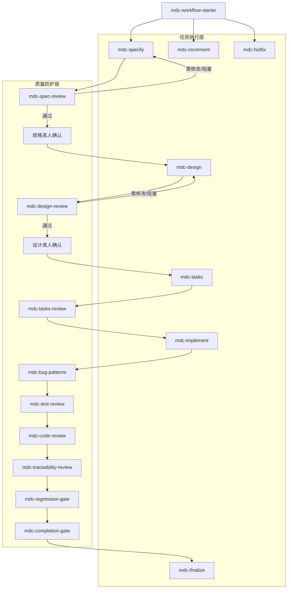
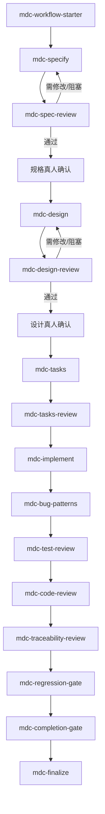
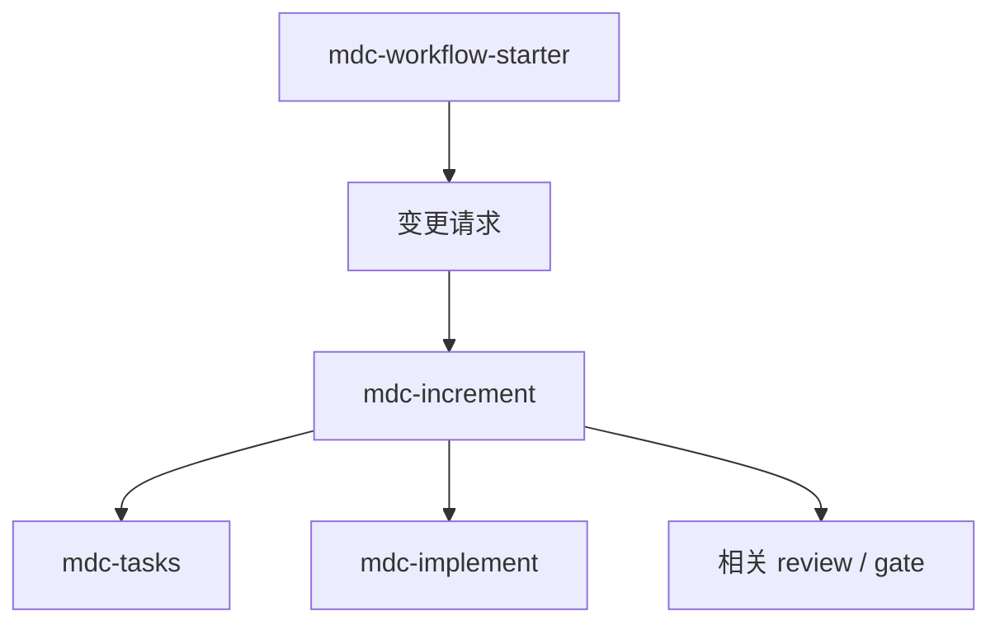
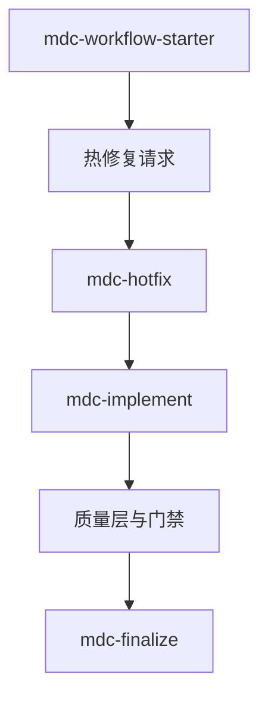

# MDC 系列 Skills

## 简介

`skills/mdc-workflow/` 下的 `mdc-*` 系列是一套面向软件交付流程的 workflow skills。

它同时包含四类不同职责的 skill：

- 路由型 skill：负责判断当前阶段、推荐下一步、维护流程顺序
- 执行型 skill：负责产出当前阶段的主要工件或实现结果
- 执行型 / 阶段编排型 skill：负责在某一阶段内部组织执行顺序、串起下游质量链或支线同步动作
- 能力型 skill：负责完成某一类具体检查或评审，由 `mdc-workflow-starter` 统一编排到合适位置

它的目标不是让 Agent “更自由地写代码”，而是让 Agent 在软件开发任务里先按正确顺序工作：

- 先路由，再行动
- 先规格，再设计，再任务，再实现
- 实现阶段遵守 TDD 与评审顺序
- 没有 fresh verification evidence，不宣称完成

这套体系主要参考了两类方法：

- `superpowers`：借鉴强工作流约束、TDD 铁律、完成前验证门禁
- `longtaskforagent`：借鉴 phase routing、工件驱动、跨会话状态恢复、支线流程

同时，`mdc` 明确保留一个边界：

- **不依赖 subagent 编排**

也就是说，`mdc` 追求的是一套**轻量但强约束**的软件交付 skills，而不是一个重型、多代理工程操作系统。

## 适用场景

当用户请求属于以下任一场景时，应优先进入 `mdc` 流程：

- 开始一个新需求、功能或项目
- 用户说“继续”“推进”“开始做”“先处理这个”
- 需要澄清需求、做设计、拆任务、实现代码
- 需要做规格评审、设计评审、任务评审、测试评审、代码评审、追溯性评审
- 需求发生变更，需要走增量流程
- 出现紧急缺陷，需要走热修复流程

对于这类请求，`mdc-workflow-starter` 是系列统一入口。

即使用户已经明确点名某个能力型 skill，也应由 `mdc-workflow-starter` 统一判断它是否是当前正确的下一步。

## 团队扩展入口

`mdc-workflow` 现在把 `AGENTS.md` 视为团队扩展的唯一入口。

这意味着：

- 阶段顺序、门禁和交接格式仍由 `mdc-*` skills 固定
- 工件路径映射、审批状态别名、真人确认等价证据、模板覆盖和团队规范由 `AGENTS.md` 注入
- 若 `AGENTS.md` 未声明某项配置，才回落到本目录中的默认路径、默认模板和默认状态词
- 不再允许为同一项目维护 `AGENTS.md` 之外的平行映射来源

## 设计目标

`mdc` 的核心目标是：

1. 用流程约束替代“想到哪做到哪”的编码方式。
2. 用工件和记录承接状态，而不是依赖对话记忆。
3. 把质量防护独立成层，而不是在最后“顺手检查一下”。
4. 在不引入 subagent 的前提下，保留评审、回退、验证、收尾闭环。
5. 用自适应 workflow profile 让流程密度匹配任务复杂度，而不是所有任务走同一条重型管线。

## 非目标

当前 `mdc` 不追求：

- 多代理并行编排
- 完整复制 `longtaskforagent` 的 ATS / Feature-ST / System-ST 重流程
- 依赖大量信号文件或中央状态机
- 替代 CI/CD、代码托管平台或正式人工审批制度

## 系列结构

`mdc` 目前可以理解为 4 类角色。



### 1. 路由型

- `mdc-workflow-starter`

职责：

- 读取阶段证据
- 判断当前所处阶段
- 选择 workflow profile（full / standard / lightweight）
- 决定 workflow 中推荐的下一步动作或 skill
- 阻止乱序推进
- 作为主链 / 支线 / review / gate 的统一状态机编排器

### 2. 执行型

- `mdc-specify`
- `mdc-design`
- `mdc-tasks`
- `mdc-test-driven-dev`

职责：

- 产出规格、设计、任务、实现和收尾结果
- 在主链和支线中推进实际工作
- 直接生成当前阶段的主要工件或验证结果

### 3. 执行型 / 阶段编排型

- `mdc-implement`
- `mdc-increment`
- `mdc-hotfix`
- `mdc-finalize`

职责：

- 在已经确认好的阶段内推进实际工作，而不是承担顶层会话路由
- 串起该阶段内部的执行顺序、交接和状态同步
- 把结果受控地交给后续质量层、支线回流点或收尾动作

### 4. 能力型质量层

- `mdc-spec-review`
- `mdc-design-review`
- `mdc-tasks-review`
- `mdc-bug-patterns`
- `mdc-test-review`
- `mdc-code-review`
- `mdc-traceability-review`
- `mdc-regression-gate`
- `mdc-completion-gate`

职责：

- 审查上游产出是否足够好
- 给出 `通过` / `需修改` / `阻塞` 结论
- 输出结构化发现、风险和建议动作
- 在 workflow 场景中为路由型 skill 提供后续判断依据

## Skill 索引

下表用于快速定位每个 `mdc-*` skill 的职责与常见使用时机。

| Skill | 层级 | 主要职责 | 典型触发时机 |
|---|---|---|---|
| `mdc-workflow-starter` | 路由型 | 判断当前阶段并路由到推荐的下一步 skill | 新需求开始、用户说“继续”、阶段不清楚、变更、热修 |
| `mdc-specify` | 执行型 | 产出需求规格草稿 | 没有已批准规格，或规格仍需修订 |
| `mdc-spec-review` | 能力型质量层 | 审查规格是否完整、清晰、可验证 | 规格草稿已完成，准备进入真人确认前 |
| `mdc-design` | 执行型 | 基于已批准规格产出设计草稿 | 规格已批准，但设计尚未批准 |
| `mdc-design-review` | 能力型质量层 | 审查设计是否覆盖规格并具备可实现性 | 设计草稿已完成，准备进入真人确认前 |
| `mdc-tasks` | 执行型 | 将设计翻译为可执行任务计划 | 设计已批准，但任务计划尚未批准 |
| `mdc-tasks-review` | 能力型质量层 | 审查任务计划粒度、依赖、DoD 与验证安排 | 任务计划草稿已完成，准备进入实现前 |
| `mdc-implement` | 执行型 / 阶段编排型 | 按唯一活跃任务执行实现，并把实现结果交给后续质量能力 | 任务计划已批准，且仍有未完成任务 |
| `mdc-test-driven-dev` | 执行型 | 作为统一 TDD 入口，按语言或项目类型路由具体 TDD 实现 | `mdc-implement` 或 `mdc-hotfix` 进入 TDD 时 |
| `mdc-bug-patterns` | 能力型质量层 | 对当前改动做缺陷模式专项排查 | 高风险改动专项排查，或 workflow 中实现后的首个质量检查 |
| `mdc-test-review` | 能力型质量层 | 审查测试是否真正验证行为 | 需要独立评审测试质量，或 workflow 中进入正式评审链时 |
| `mdc-code-review` | 能力型质量层 | 审查实现正确性、可维护性与设计一致性 | 需要独立评审实现质量，或 workflow 中进入后续验证前 |
| `mdc-traceability-review` | 能力型质量层 | 检查规格、设计、任务、实现、测试、验证链路是否一致 | 需要独立核对追溯关系，或 workflow 中回归门禁前 |
| `mdc-regression-gate` | 能力型质量层 | 确认改动没有破坏相关行为或集成面 | 需要独立核对回归信号，或 workflow 中完成门禁前 |
| `mdc-completion-gate` | 能力型质量层 | 用最新验证证据决定是否允许宣称完成 | 准备更新完成状态、切换任务、输出交付说明前 |
| `mdc-increment` | 执行型 / 阶段编排型 | 处理需求追加、范围调整与变更影响同步 | 用户提出新增、删改需求，或现有工件表明范围变化 |
| `mdc-hotfix` | 执行型 / 阶段编排型 | 处理紧急缺陷修复，并要求先复现再修 | 用户提出紧急缺陷修复，或现有证据表明处于热修复场景 |
| `mdc-finalize` | 执行型 / 阶段编排型 | 收尾当前工作周期，更新状态、发布说明和证据索引 | 完成门禁通过后，准备结束当前周期时 |

## 各 Skill 详细说明

这一节补充每个 `mdc-*` skill 的目标、典型输入输出与关键约束。README 不重复 `SKILL.md` 的全部细节，但会说明每个 skill 在 workflow 中的职责，以及与其它 skill 的边界。

### 路由型

#### `mdc-workflow-starter`

目标：

- 先读取阶段证据，再决定当前会话推荐的下一步 skill

典型输入：

- 当前用户请求
- `AGENTS.md` 中与 `mdc-workflow` 相关的工件映射与团队规范
- 规格、设计、任务、review、verification、`task-progress.md`、`RELEASE_NOTES.md`

典型输出：

- 当前阶段判断
- 下游 skill 路由结论
- 本轮 checklist / todo 初始化

关键规则：

- 先路由再回答，不能因为用户说“继续”就直接开始实现
- 若关键工件缺失或审批证据不完整，必须回到更保守的上游阶段
- 当检测到变更请求或热修复信号时，优先路由到支线流程

### 执行型

#### `mdc-specify`

目标：

- 产出可提交评审的需求规格草稿，明确范围、非范围、约束和验收标准

典型输入：

- 用户目标、业务上下文、现有系统情况、约束条件

典型输出：

- 规格草稿
- 供 `mdc-spec-review` 使用的问题清单与待确认点

关键规则：

- 先澄清 WHAT，再谈 HOW
- 不把设计决策混入规格
- 规格未冻结前，不进入实现

#### `mdc-design`

目标：

- 基于已批准规格产出可提交评审的实现设计草稿

典型输入：

- 已批准规格
- 技术约束、接口边界、NFR、现有架构上下文

典型输出：

- 设计草稿
- 方案比较与取舍说明
- 供 `mdc-design-review` 和真人确认使用的风险点

关键规则：

- 至少比较 2 个方案，再说明为何选当前方案
- 设计要覆盖模块、数据流、接口、测试策略和依赖选择
- 设计未批准前，不进入任务拆分或编码

#### `mdc-tasks`

目标：

- 把规格与设计翻译为可执行、可验证、可回退的任务计划

典型输入：

- 已批准规格
- 已批准设计
- 当前里程碑与依赖关系

典型输出：

- 任务计划草稿
- 每个任务的 DoD、验证方式、依赖关系

关键规则：

- 任务粒度以“能独立验证、能独立关闭”为标准，而不是按文件粗拆
- 明确任务优先级、里程碑和前置依赖
- 任务计划完成后，先过 `mdc-tasks-review`，再进入实现

### 执行型 / 阶段编排型

#### `mdc-implement`

目标：

- 在任务计划约束下执行当前唯一活跃任务，并串起 TDD、评审和验证链
- 它不是顶层路由器，而是“已进入实现阶段后的阶段编排器”

典型输入：

- 已批准任务计划
- 当前活动任务
- 代码仓库现状与测试上下文

典型输出：

- 实现代码
- 测试代码与验证结果
- 当前任务进度更新

关键规则：

- 先输出测试用例设计并与真人确认，再进入 TDD
- 没有失败测试，不写生产代码
- 在 workflow 中，当前任务实现完成后，通常按质量层默认顺序进入后续检查与门禁

#### `mdc-increment`

目标：

- 处理需求追加、删改、范围调整，并把影响同步回主链工件

典型输入：

- 现有规格、设计、任务计划
- 新的变更请求或范围变化证据

典型输出：

- 变更影响分析
- 已同步更新的规格、设计、任务计划、验证策略和状态记录

关键规则：

- 先做影响分析，再决定回流到哪个主链节点
- 不能只改任务或代码而不回写上游工件
- 变更流是主链的受控回流，不是绕过门禁的捷径

#### `mdc-hotfix`

目标：

- 处理高优先级线上或交付前缺陷，以最小修复恢复正确行为

典型输入：

- 缺陷描述、复现线索、线上反馈或失败验证证据

典型输出：

- 失败复现测试
- 最小修复实现
- 同步刷新的规格、设计、任务、验证与发布记录

关键规则：

- 先复现再修复
- 优先最小修复，避免借热修之名做范围扩张
- 修复后仍要进入质量层和门禁，不能“修完就算完成”

#### `mdc-finalize`

目标：

- 完成当前工作周期的收尾，而不是继续扩展功能

典型输入：

- 已通过的完成门禁
- 最新 review 记录、verification 证据、任务状态

典型输出：

- 更新后的 `task-progress.md`
- 更新后的 `RELEASE_NOTES.md`
- 完整的交付摘要和下一步建议

关键规则：

- 只在 `mdc-completion-gate` 通过后进入
- 收尾时要补齐状态、证据索引和用户可见变更说明
- finalize 的目标是闭环，不是继续插入新实现

### 能力型质量层

#### `mdc-spec-review`

作用：

- 审查规格是否完整、无歧义、可验证、边界清晰，并为真人确认提供依据

检查重点：

- 范围是否明确
- 是否混入设计决策
- 是否存在验收标准缺口、模糊词和负向场景遗漏

路由结果：

- `通过` 后进入规格真人确认
- `需修改` / `阻塞` 后回到 `mdc-specify`

#### `mdc-design-review`

作用：

- 审查设计是否覆盖规格、考虑约束与 NFR，并具备可实现性

检查重点：

- 是否覆盖规格
- 是否给出方案选择与理由
- 是否明确技术依赖、测试策略和关键风险

路由结果：

- `通过` 后进入设计真人确认
- `需修改` / `阻塞` 后回到 `mdc-design`

#### `mdc-tasks-review`

作用：

- 审查任务计划是否真正可执行，而不是粗粒度待办列表

检查重点：

- 任务粒度是否过大
- 依赖顺序是否合理
- 每个任务是否有明确 DoD 与验证安排

#### `mdc-bug-patterns`

作用：

- 在常规测试评审和代码评审前，对当前改动命中的已知缺陷模式做专项排查
- 由 `mdc-workflow-starter` 在高风险改动、热修复或正式评审链中编排调用

检查重点：

- 是否命中团队历史高频错误模式
- 是否覆盖边界、空值、状态、时序、幂等等典型风险
- 是否通过测试、防护代码或约束手段真正消除同类问题

#### `mdc-test-review`

作用：

- 审查测试是否真的验证行为，而不是装饰性测试
- 由 `mdc-workflow-starter` 在正式评审链中或测试质量需要专项判断时编排调用

检查重点：

- 测试是否先失败过
- 是否只测 happy path
- 是否过度依赖 mock
- 是否覆盖边界与错误路径

#### `mdc-code-review`

作用：

- 审查实现质量，而不是代替规格评审或设计评审
- 由 `mdc-workflow-starter` 在正式评审链中或实现质量需要专项判断时编排调用

检查重点：

- 正确性
- 可读性
- 边界和错误处理
- 是否偏离设计

#### `mdc-traceability-review`

作用：

- 在进入回归前检查规格、设计、任务、实现、测试、验证之间是否仍能互相对齐
- 由 `mdc-workflow-starter` 在正式评审链中或工件链路需要专项核对时编排调用

检查重点：

- 当前实现是否符合已批准规格与设计
- 任务完成项能否回指到需求或设计片段
- 测试和验证证据是否覆盖被宣称完成的行为

#### `mdc-regression-gate`

作用：

- 在任务级实现完成后，确认改动没有破坏已有能力
- 由 `mdc-workflow-starter` 在正式门禁链中或回归面需要专项确认时编排调用

检查重点：

- 相关测试集
- 全量测试或受影响测试
- 构建、类型检查、静态检查等回归信号

#### `mdc-completion-gate`

作用：

- 作为末端硬门禁，决定当前任务或阶段是否允许宣称完成
- 由 `mdc-workflow-starter` 在末端完成门禁中编排调用

关键规则：

- 在宣称“完成”、切换下一个任务、准备 PR 或交付说明前必须执行
- 必须基于 fresh verification evidence，而不是主观判断
- 只根据实际命令输出陈述状态，不能把“应该通过”当作“已经通过”

## Workflow Profiles

`mdc` 支持三档 workflow profile，让流程密度匹配任务复杂度。

| Profile | 适用场景 | 节点链路 |
|---------|---------|---------|
| **full** | 新功能、架构变更、高风险模块、跨模块重构、无已批准规格或设计 | 全部主链节点（18 个） |
| **standard** | 中等功能、已有规格+设计的功能扩展、非高风险 bugfix | `mdc-tasks` → 完整质量层 → `mdc-finalize`（12 个） |
| **lightweight** | 纯文档/配置/样式变更、低风险 bugfix | `mdc-implement` → `mdc-regression-gate` → `mdc-completion-gate` → `mdc-finalize`（4 个） |

Profile 由 `mdc-workflow-starter` 在路由阶段决定，不允许用户自行声称。选择依据包括工件状态、改动范围、`AGENTS.md` 中的团队规则等信号。

关键规则：

- 每个 profile 内的节点仍执行完整检查，profile 控制的是走哪些节点，不是降低门禁强度
- 信号冲突时选择更重的 profile（保守原则）
- 允许从轻 profile 升级到重 profile（lightweight → standard → full），不允许降级
- 升级由 `mdc-workflow-starter` 在检测到实际复杂度超出当前 profile 时触发

详细选择规则参见 `mdc-workflow-starter/references/profile-selection-guide.md`。

团队可在 `AGENTS.md` 中配置：

- 默认 profile
- 强制 full 的规则（如"涉及支付的任何改动"）
- 允许 / 禁止 lightweight 的条件

## 主链工作流

以下是 full profile 的默认主链：



这条链路体现了 `mdc` 最核心的约束：

- 未批准规格前，不进入设计
- 未批准设计前，不进入任务
- 未批准任务前，不进入实现
- 未完成质量链与门禁前，不宣称完成

### standard profile 主链

当已有已批准规格+设计时，可从任务拆分开始：

```text
mdc-workflow-starter → mdc-tasks → mdc-tasks-review → mdc-implement
→ mdc-bug-patterns → mdc-test-review → mdc-code-review
→ mdc-traceability-review → mdc-regression-gate → mdc-completion-gate
→ mdc-finalize
```

### lightweight profile 主链

当改动不涉及功能行为变化或为低风险修复时：

```text
mdc-workflow-starter → mdc-implement
→ mdc-regression-gate → mdc-completion-gate
→ mdc-finalize
```

## 支线工作流

### 增量变更

当已有规格、设计、任务已经存在，但用户提出新增、删改或范围调整时：



### 热修复

当出现紧急缺陷修复场景时：



热修复不是“先改再补流程”，而是走一条压缩但仍受约束的支线。

## 工件与状态

`mdc` 采用轻量工件驱动，而不是完全依赖会话记忆。

推荐的最小工件集合包括：

- 需求规格：`docs/specs/`
- 设计文档：`docs/designs/`
- 任务计划：`docs/tasks/`
- 进度记录：`task-progress.md`
- 评审记录：`docs/reviews/`
- 验证记录：`docs/verification/`
- 发布说明：`RELEASE_NOTES.md`

如果项目已有自己的等价工件，应在 `AGENTS.md` 中声明映射，而不必强行改名。

相关模板与参考资料位于：

- `AGENTS.md`
- `mdc-workflow-starter/references/routing-evidence-guide.md`
- `mdc-workflow-starter/references/profile-selection-guide.md`
- `AGENTS-template.md`
- `templates/task-progress-template.md`
- `templates/review-record-template.md`
- `templates/verification-record-template.md`

## 使用原则

### 1. workflow 场景统一由 starter 编排

在以下场景中，应先通过 `mdc-workflow-starter` 完成阶段判断：

- 用户说“继续”“推进”“开始做”
- 你需要判断当前处于哪个阶段
- 你准备在主链或支线中继续推进交付
- 你需要决定应该进入哪个 review / gate

即使用户已经明确要求某个能力型 skill，也应先由 `mdc-workflow-starter` 判断它是否符合当前阶段、是否缺少前置证据，以及执行后应该衔接到哪里。

### 2. 证据优先于印象

不要只根据聊天上下文判断阶段。

优先依据：

- 工件是否存在
- 是否有批准状态
- 是否有真人确认痕迹
- `task-progress.md`、review 记录、verification 记录是否支持当前阶段

如果证据冲突，按更保守的上游阶段处理。

### 3. TDD 是实现流内部的一部分

`mdc-implement` 不允许把测试放到实现之后“顺手补”。

默认顺序是：

```text
测试用例设计
-> 真人确认测试设计
-> mdc-test-driven-dev
-> bug patterns
-> test review
-> code review
-> traceability review
-> regression gate
-> completion gate
```

### 4. 完成必须可验证

`mdc-completion-gate` 是末端硬门禁。

在以下动作之前必须通过它：

- 宣称完成
- 更新状态为已完成
- 切换到下一个任务
- 输出带完成含义的交付说明

## 快速上手示例

下面给一个最小使用路径，适合第一次在项目里尝试 `mdc`。

### 场景 1：开始一个新功能

用户请求：

```text
给现有系统加一个导出 CSV 的功能
```

建议使用顺序：

1. 先进入 `mdc-workflow-starter`
2. 若没有已批准规格，进入 `mdc-specify`
3. 规格草稿完成后，进入 `mdc-spec-review`
4. 真人确认规格后，进入 `mdc-design`
5. 设计草稿完成后，进入 `mdc-design-review`
6. 真人确认设计后，进入 `mdc-tasks`
7. 任务计划通过 `mdc-tasks-review` 后，进入 `mdc-implement`
8. 实现完成后，按顺序走质量层和门禁
9. 最后进入 `mdc-finalize`

最小建议工件：

- `docs/specs/<topic>.md`
- `docs/designs/<topic>.md`
- `docs/tasks/<topic>.md`
- `task-progress.md`

### 场景 2：用户只说“继续”

用户请求：

```text
继续
```

此时不要默认进入实现。

正确做法：

1. 先进入 `mdc-workflow-starter`
2. 检查规格、设计、任务是否已批准
3. 检查 `task-progress.md`
4. 检查是否还缺 review / gate 证据
5. 根据证据决定下一步是 `mdc-implement`、某个 review skill、某个 gate，还是 `mdc-finalize`

### 场景 3：修一个紧急缺陷

用户请求：

```text
线上导出接口报 500，先修这个
```

建议使用顺序：

1. 先进入 `mdc-workflow-starter`
2. 路由到 `mdc-hotfix`
3. 先复现问题，再做最小修复
4. 修复后仍要经过质量层和门禁
5. 最后进入 `mdc-finalize`

### 场景 4：项目已经有自己的状态文件

如果项目已经有等价状态文件，不一定必须新建 `task-progress.md`。

但应满足同等信息承载能力，至少能表示：

- 当前阶段
- 当前活跃任务
- 下一步动作或推荐 skill
- 已批准工件
- 待处理 review / gate

如果没有这类等价工件，建议直接采用 `templates/task-progress-template.md`。

## 常见误用 / FAQ

### 1. 用户只说“继续”，为什么不能直接进入 `mdc-implement`？

因为“继续”不是阶段证据。

在 `mdc` 体系里，继续实现之前至少要先确认：

- 规格是否已批准
- 设计是否已批准
- 任务计划是否已批准
- 当前任务是否真的还在实现阶段
- 是否还缺 review / gate

所以“继续”默认先进入 `mdc-workflow-starter`，而不是默认进入 `mdc-implement`。

### 2. 什么时候必须有 `task-progress.md`？

如果项目没有自己的等价状态文件，且你准备实际按 `mdc` 主链推进，就应有 `task-progress.md` 或等价工件。

它至少要承载：

- 当前阶段
- 当前活跃任务
- 下一步动作或推荐 skill
- 已批准工件
- 待处理 review / gate

如果项目已有自己的状态页、任务页或等价记录，并且这些信息足够完整，可以不强制新建 `task-progress.md`，而是在 `AGENTS.md` 中声明等价映射。

### 3. review-only 请求为什么也建议先走 `mdc-workflow-starter`？

因为 review / gate 请求本身也属于 workflow 编排问题。

`mdc-workflow-starter` 不只决定“当前做哪个 skill”，还决定：

- 当前是否真的到了适合做这类 review / gate 的时机
- 是否仍缺更上游的批准工件或前置检查
- 当前 review / gate 完成后，应继续进入哪个下游节点，或退回哪个上游节点

### 4. 为什么不能跳过规格或设计，直接拆任务或编码？

因为 `mdc` 的核心就是把软件交付拆成：

- WHAT：规格
- HOW：设计
- EXECUTION：任务与实现

如果跳过上游阶段，会直接损坏后续几个关键能力：

- 任务是否有依据
- 评审是否有标准
- 追溯性是否成立
- 完成是否真的可验证

### 5. 热修复是不是可以只修代码，不走完整质量链？

不是。

`mdc-hotfix` 是压缩支线，不是绕过流程的特权通道。

热修复仍然要求：

- 先复现
- 最小修复
- 经过质量层和门禁
- 回写状态与相关工件

### 6. 所有项目都必须采用 README 里写的默认路径吗？

不是。

README 里给的是推荐默认布局：

- `docs/specs/`
- `docs/designs/`
- `docs/tasks/`
- `docs/reviews/`
- `docs/verification/`
- `task-progress.md`

如果项目已有自己的交付件命名或目录结构，优先通过 `AGENTS.md` 声明映射，而不是强迫项目重命名。

### 7. `mdc-test-driven-dev` 是否已经覆盖所有语言？

还没有。

当前它已经是系列级统一入口，但具体实现目前主要覆盖 C++ / GoogleTest 场景。  
这意味着：

- 入口规则已经统一
- 多语言具体 TDD 实现还需要后续继续补

### 8. 有了 review 通过结论，为什么还不能直接视为已批准？

因为在 `mdc` 体系里，规格和设计存在“评审通过”和“真人确认通过”两个层次。

尤其是：

- 规格评审通过，不等于规格已冻结
- 设计评审通过，不等于设计已批准

只有显式批准证据存在时，`mdc-workflow-starter` 才应把它们当作已批准工件。

### 9. 什么时候可以用 lightweight profile？

当改动满足以下全部条件时：

- 纯文档 / 配置 / 样式变更，或低风险单文件 bugfix
- 不涉及接口、数据模型或功能行为变化
- 不在 `AGENTS.md` 声明的高风险模块中
- 不在 `AGENTS.md` 的 `禁止 lightweight 的条件` 中

lightweight 不是"跳过流程"，而是"用更短的受控链路完成低复杂度工作"。它仍要通过 regression-gate 和 completion-gate。

### 10. profile 是谁决定的？可以手动指定吗？

Profile 由 `mdc-workflow-starter` 根据信号矩阵自动判断，不允许用户自行声称。

如果觉得默认判断不合适，正确做法是在 `AGENTS.md` 中调整 Workflow Profiles 配置（如强制 full 规则、允许 / 禁止 lightweight 条件），而不是在会话中直接要求某个 profile。

### 11. profile 可以降级吗？

不可以。一旦选定或升级到某个 profile，只能保持或继续升级，不能降回更轻的 profile。

## 一句话总结

`mdc` 是一套面向软件交付的轻量 workflow skills：

- 借鉴 `superpowers` 的强流程约束
- 借鉴 `longtaskforagent` 的轻量工件驱动
- 不依赖 subagent
- 用自适应 profile 让流程密度匹配任务复杂度
- 重点解决“先做什么、何时能往下走、什么才算完成”
