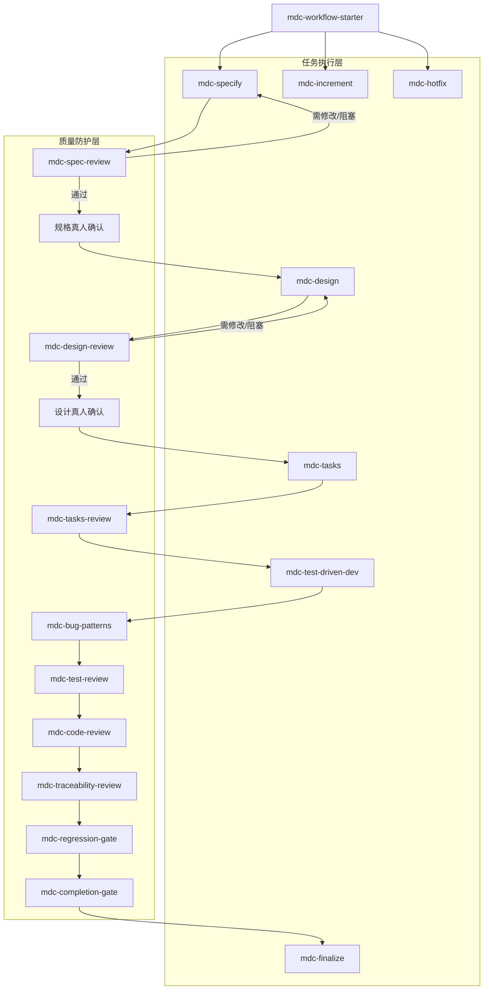
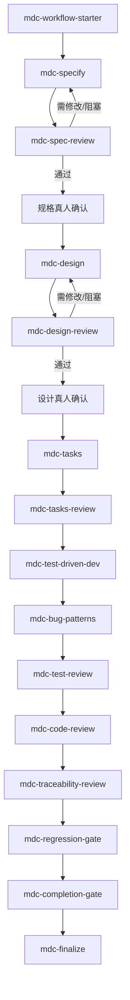
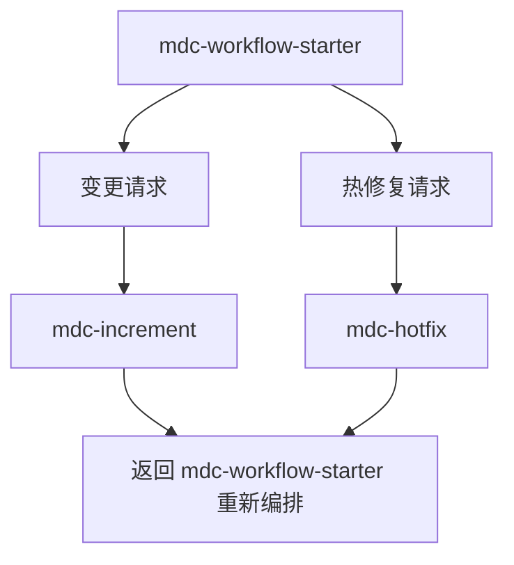

# Skills 作业流设计方案

## 1. 文档目的

本文定义一套以规范驱动开发为基础的 skills 作业体系，用于约束 Agent 在软件开发中的工作顺序、交付件、评审门禁与完成标准。

这套方案吸收两类参考：

- `superpowers`：借鉴它的强流程控制、`brainstorming` 的前置澄清与设计批准机制、`test-driven-development` 与 `verification-before-completion` 的硬门禁思想。
- `longtaskforagent`：借鉴它的 phase routing、交付件驱动、跨会话状态管理、质量门与支线流程设计。

同时明确一个边界：**本方案默认不使用 subagent**。所有步骤均由主代理在同一会话内串行执行，但保留评审、回退、再验证等强约束。

## 2. 设计目标与非目标

### 2.1 目标

这套 skills 作业体系应满足以下目标：

1. 让 Agent 先做规格、再做设计、再做任务分解、最后做实现，避免直接跳进编码。
2. 让每个阶段都有明确输入、输出、准入条件、退出条件与禁止动作。
3. 让流程与交付件绑定，而不是依赖聊天上下文记忆。
4. 让质量防护独立成层，而不是“做完后顺便检查一下”。
5. 让方案兼容既有交付件要求，而不是强迫团队改名或重建文档体系。
6. 在不引入 subagent 的前提下，仍然保留强门禁、审查、验证闭环与进度可恢复性。

### 2.2 非目标

本方案当前不追求：

- 多代理并行编排
- 自动生成脚本/模板/校验器
- 覆盖组织内所有交付流程变体
- 直接替代 CI/CD、代码托管平台或人工审批制度

## 3. 设计依据

### 3.1 借鉴 `superpowers` 的部分

- `using-superpowers`：借鉴“只要某 skill 可能适用，就必须先进入 skill，而不是先行动”的入口控制思想。
- `brainstorming`：借鉴“先探索上下文、逐步澄清、提出 2-3 个方案、逐节批准设计、再进入计划”的流程。
- `test-driven-development`：借鉴“没有失败测试就不写生产代码”的铁律。
- `verification-before-completion`：借鉴“没有新鲜验证证据，就不能宣称完成”的完成门禁。

### 3.2 借鉴 `longtaskforagent` 的部分

- `using-long-task`：借鉴用工件状态做 phase routing，而不是靠用户一句“继续”判断当前阶段。
- `long-task-requirements` / `long-task-design`：借鉴将 WHAT 和 HOW 分离，并给每一层单独批准门。
- `long-task-work`：借鉴“执行不是一个大动作，而是一条包含 Config Gate、TDD、质量门、验收、持久化更新的流水线”。
- `architecture.md`：借鉴“长任务依赖持久化工件而不是聊天记忆”的核心思想。

### 3.3 借鉴业界实践的部分

- Anthropic：优先采用 workflow，而不是上来就做高自由度 agent；强调 routing、prompt chaining、evaluator-optimizer。
- OpenAI `PLANS.md` / long-horizon tasks：强调 living plan、可冷启动、可验证里程碑、文档即状态。
- Cursor long-running agents：强调 planning before execution、长周期任务的结构化 harness、避免无边界自主漂移。
- METR：提示长任务的核心问题是可靠性和时间跨度，不只是单次回答质量。

## 4. 总体设计原则

1. **workflow 推进统一先经 starter 编排**：当你需要判断当前阶段、恢复主链/支线推进、决定下一步 skill，或处理 review / gate 请求时，都先进入 `mdc-workflow-starter`，由它统一决定当前应进入哪个节点以及后续如何衔接。
2. **规格先于设计，设计先于任务，任务先于实现**：任何跳步都必须被视为违规。
3. **工件驱动，不靠记忆**：状态必须落在仓库文件中，而不是停留在对话里。
4. **强门禁而非软建议**：关键阶段用必须、禁止、仅允许下游等表述，减少 Agent 自由发挥空间。
5. **主代理串行执行**：不依赖 subagent；审查也由主代理以“切换检查清单”的方式同步完成。
6. **证据先于结论**：任何“完成”“通过”“修复成功”都必须绑定 fresh verification evidence。
7. **兼容现有交付件**：逻辑工件和实际文件名分离，通过映射层适配团队已有规范。
8. **轻支线，重主线**：变更和热修复可以走支线，但不能破坏主链路的可追溯性。
9. **任务粒度可验证**：任务拆分以“能独立验证、能独立关闭”为标准，而不是按文件随意切。
10. **测试不是尾声，是实现阶段的一部分**：TDD 和测试质量审查前置到实现流内部。
11. **流程密度匹配任务复杂度**：通过自适应 workflow profile 让简单任务走轻量链路、复杂任务走完整链路，而不是所有任务一刀切走同一条重型管线。

## 4.1 自适应 Workflow Profiles

### 动机

主链完整走下来涉及 18 个节点。对改一个配置项或修一个 typo 来说，这条链路过重。但如果为了省事允许随意跳步，又会损坏流程约束力。

业界共识（Anthropic 2025、Propel 2026）：流程密度应匹配任务风险——"Start with the simplest pattern that meets your quality bar" 以及 "Risk must be tiered"。

### Profile 定义

引入三档 workflow profile，每档保留不同密度的门禁：

| Profile | 名称 | 适用场景 | 节点链路 |
|---------|------|---------|---------|
| **full** | 完整流程 | 新功能、架构变更、高风险模块、跨模块重构、无已批准规格或设计 | 全部主链节点 |
| **standard** | 标准流程 | 中等功能、已有规格+设计的功能扩展、非高风险 bugfix | `mdc-tasks` → `mdc-tasks-review` → `mdc-test-driven-dev` → 完整质量层 → `mdc-finalize` |
| **lightweight** | 轻量流程 | 纯文档/配置/样式变更、低风险 bugfix（单文件、无接口变化） | `mdc-tasks` → `mdc-tasks-review` → `mdc-test-driven-dev` → `mdc-regression-gate` → `mdc-completion-gate` → `mdc-finalize` |

### Profile 选择机制

- Profile 由 `mdc-workflow-starter` 在路由阶段决定，不允许用户自行声称。
- 若 `AGENTS.md` 声明了强制 profile 规则，优先执行。
- 信号冲突时，选择更重的 profile（保守原则）。
- 允许升级（lightweight → standard → full），**不允许降级**。

### Profile 升级触发条件

- 实现过程中发现缺少规格或设计依据
- review / gate 返回 `阻塞`，且阻塞原因指向上游工件缺失
- 改动范围超出预期（例如从单文件扩散到多模块）

### `AGENTS.md` 扩展

在 `AGENTS.md` 的 `MDC Workflow` 段新增 `Workflow Profiles` 配置，包括：默认 profile、强制 full 规则、允许/禁止 lightweight 条件。

### 对 `task-progress.md` 的影响

Current State 段新增 `Workflow Profile` 字段和 `Profile Selection Rationale` 字段，Session Log 新增 `Profile Change` 字段。

### 对路由和迁移表的影响

- `mdc-workflow-starter` 路由分两步：先决定 profile，再在 profile 约束下决定阶段。
- 每个 profile 维护独立的结果驱动迁移表。
- 合法状态集合按 profile 缩窄：在当前 profile 不包含的节点上推进，视为无效迁移。

## 5. 三层架构总览



### 5.1 第一层：`mdc-workflow-starter`

职责不是干活，而是：

- 读取当前项目的阶段状态
- 判断当前处于哪个阶段
- 决定进入主链、变更支线或热修复支线
- 阻止 Agent 在错误阶段直接写代码
- 作为 review / gate 完成后的统一恢复编排器

它相当于 `using-superpowers` 和 `using-long-task` 的组合版，但目标更聚焦于这套作业体系的流程约束。

### 5.2 第二层：任务执行与阶段编排流

这是实际产生交付件的主链与支线：

- `mdc-specify`
- `mdc-design`
- `mdc-tasks`
- `mdc-test-driven-dev`
- `mdc-increment`
- `mdc-hotfix`
- `mdc-finalize`

其中：

- `mdc-specify`、`mdc-design`、`mdc-tasks` 以产出阶段主工件为主
- `mdc-test-driven-dev` 属于**执行型 / 节点内闭环型**：它既执行当前活跃任务，也负责把 fresh evidence、风险和推荐下一步写回工件
- `mdc-increment`、`mdc-hotfix`、`mdc-finalize` 负责支线或收尾阶段内的受控推进，而不是承担顶层会话路由

### 5.3 第三层：质量防护层

这是阶段之间的独立检查层：

- `mdc-spec-review`
- `mdc-design-review`
- `mdc-tasks-review`
- `mdc-bug-patterns`
- `mdc-test-review`
- `mdc-code-review`
- `mdc-traceability-review`
- `mdc-regression-gate`
- `mdc-completion-gate`

说明：

- 你原始草案中的 `cod-review` 建议统一更名为 `mdc-code-review`。
- `mdc-spec-review` 是必须补上的，否则 `mdc-specify` 的输出没有正式冻结门。
- `mdc-tasks-review` 也是建议补上的，否则任务分解可能直接把坏设计带进实现。
- `mdc-bug-patterns` 用于把团队历史错误案例和高频编码风险前置到实现评审链中。
- `mdc-traceability-review` 用于在进入回归前确认规格、设计、任务、实现和验证仍然能对齐。

## 6. 交付件契约与兼容层

质量与变更相关的配套模板可统一从以下索引进入：

- `skills/mdc-workflow/README.md`

### 6.1 为什么需要“逻辑工件”和“实际文件路径”分离

团队往往已有既定交付件名称，例如 PRD、SRS、概要设计、详细设计、任务清单、测试报告、发布说明。如果这套 skills 直接写死文件名，会造成与现有规范冲突。

因此建议把映射直接收口到 `AGENTS.md` 中的 `mdc-workflow` 配置段。

它的作用是统一定义：

- 逻辑工件名
- 团队现有交付件名
- 文件路径
- 审批要求
- 是否必须

### 6.2 推荐的逻辑工件集合

| 逻辑工件 | 推荐默认路径 | 作用 |
|---|---|---|
| 需求规格 | `docs/specs/YYYY-MM-DD-<topic>-srs.md` | 说明做什么 |
| 设计文档 | `docs/designs/YYYY-MM-DD-<topic>-design.md` | 说明怎么做 |
| 任务计划 | `docs/tasks/YYYY-MM-DD-<topic>-tasks.md` | 说明怎么拆任务、怎么执行 |
| 进度记录 | `task-progress.md` | 记录当前状态、最近进展、下一步 |
| 评审记录 | `docs/reviews/` | 记录各阶段审查结论 |
| 验证记录 | `docs/verification/` | 记录测试、回归、完成验证证据 |
| 发布说明 | `RELEASE_NOTES.md` | 记录用户可见交付变化 |

### 6.3 推荐的阶段证据工件

借鉴 `longtaskforagent`，建议保留少量、稳定、可读的阶段证据工件，而不是依赖根目录 JSON 信号文件：

| 工件 | 用途 |
|---|---|
| 需求、设计、任务文档中的审批状态 | 判断主链是否已进入下一阶段 |
| `task-progress.md` | 记录当前主阶段、最近进展、活动任务与下一步建议 |
| `docs/reviews/` | 记录各类 review / gate 的结论 |
| `docs/verification/` | 记录测试、回归、完成验证证据 |
| `RELEASE_NOTES.md` | 记录用户可见变化，辅助判断是否已完成收尾 |

如果团队已有自己的项目状态页、变更单、缺陷单或任务系统，也应优先映射这些既有工件，而不是额外引入新的 JSON 触发器。

## 7. 推荐的完整 skill 地图

## 7.1 编排层

### `mdc-workflow-starter`

**触发时机**

- 每次会话开始
- 用户说“继续”“开始做”“处理这个需求”“修这个问题”

**输入**

- `AGENTS.md` 中的 `mdc-workflow` 配置
- 既有交付件路径
- 当前用户请求
- 进度记录、评审记录、验证记录、发布说明等阶段证据工件

**输出**

- 明确当前阶段
- 决定下游 skill
- 初始化本轮 checklist / todo

**关键规则**

- 先路由再回答
- 不允许绕过阶段门禁直接进入实现
- 若工件缺失，必须回到上游阶段

## 7.2 主链执行层

### `mdc-specify`

**目标**

产出可提交评审的需求规格草稿。

**借鉴来源**

- `superpowers/brainstorming`
- `longtaskforagent/long-task-requirements`

**阶段动作**

1. 探索背景、上下文、既有系统与约束
2. 分轮澄清需求，优先用结构化问题
3. 明确范围、非范围、角色、约束、验收标准
4. 输出需求规格草稿
5. 提交 `mdc-spec-review` 进行评审
6. 若评审返回“需修改”或“阻塞”，基于评审结果直接回到 `mdc-specify`，与用户确认必要修订后继续完善规格
7. 若评审返回“通过”，再进入真人确认；若真人提出意见，则继续回改规格
8. 只有在真人确认通过后，才能进入设计

**禁止**

- 未冻结规格前写实现代码
- 用设计决策污染需求规格

### `mdc-design`

**目标**

产出可提交评审的实现设计草稿。

**借鉴来源**

- `longtaskforagent/long-task-design`
- `superpowers/brainstorming` 的“2-3 方案比较”

**阶段动作**

1. 读取已批准规格
2. 提炼设计驱动因素：约束、NFR、接口、技术边界
3. 至少提出 2 个方案并说明取舍
4. 输出架构、模块、数据流、接口、测试策略、依赖选择等设计草稿
5. 提交 `mdc-design-review` 进行评审
6. 若评审返回“需修改”或“阻塞”，基于评审结果直接回到 `mdc-design`，与用户确认必要修订后继续完善设计
7. 若评审返回“通过”，再进入真人确认；若真人提出意见，则继续回改设计
8. 只有在真人确认通过后，才能进入任务规划

**禁止**

- 把实现细节写成任务执行清单
- 未批准设计就进入任务拆分或编码

### `mdc-tasks`

**目标**

将设计翻译为可执行任务计划草稿。

**借鉴来源**

- `superpowers/writing-plans`
- `longtaskforagent` 的 feature decomposition 思路

**阶段动作**

1. 读取规格与设计
2. 定义里程碑、依赖链、任务优先级
3. 任务拆到“可验证、可提交、可回退”的粒度
4. 明确每个任务的 DoD、测试方式、前置依赖
5. 输出任务计划草稿
6. 提交 `mdc-tasks-review` 进行评审

**建议粒度**

不要只写“实现登录模块”，而应细化到：

- 写失败测试
- 运行并确认失败
- 最小实现
- 运行通过
- 更新进度与记录

### `mdc-test-driven-dev`

**角色定位**

执行型 / 节点内闭环型。

它不是顶层路由器，不负责像 `mdc-workflow-starter` 那样判断当前会话处于哪个阶段；它负责在“已经确认进入实现阶段”之后，围绕唯一活跃任务执行实现，并把 fresh evidence、风险和推荐下一步写回工件，供外部调度恢复后续质量链。

**目标**

按任务计划执行代码实现。

**借鉴来源**

- `superpowers/test-driven-development`
- `superpowers/verification-before-completion`
- `longtaskforagent/long-task-work`

**阶段动作**

1. 读取任务计划与当前状态
2. 选择当前唯一活动任务
3. 先输出测试用例设计并与真人对话确认
4. 若真人提出意见，先修改测试设计，再进入 TDD
5. 再按 TDD 执行 Red -> Green -> Refactor
6. 产出或更新 UT/集成测试
7. 写回 fresh evidence、剩余风险和推荐下一步
8. 由 `mdc-workflow-starter` 恢复到正确的质量能力或门禁
9. 不在实现节点内部直接串起下游质量链

**关键规则**

- 没有失败测试，不写生产代码
- 未完成当前任务，不切换到下一个任务
- 没有 fresh verification evidence，不宣称完成

### `mdc-increment`

**目标**

处理需求追加、范围调整、延后项回收。

**建议配套资料**

- `skills/mdc-workflow/mdc-increment/references/change-impact-sync-record-template.md`

**借鉴来源**

- `longtaskforagent/long-task-increment`

**触发条件**

- 用户明确提出“在既有规格上增加/修改要求”
- 现有工件已经表明发生了实质性需求或范围变化

**动作**

1. 读取当前规格、设计、任务计划与变更请求
2. 做影响分析
3. 更新规格、设计、任务计划、验证策略中受影响的部分
4. 明确哪些记录、发布说明、进度状态也需要同步刷新
5. 如有必要，回到 `mdc-tasks`

### `mdc-hotfix`

**目标**

处理高优先级线上或交付前缺陷。

**建议配套资料**

- `skills/mdc-workflow/mdc-hotfix/references/hotfix-repro-and-sync-record-template.md`

**借鉴来源**

- `longtaskforagent/long-task-hotfix`
- `test-driven-development` 的“先复现再修”

**触发条件**

- 用户明确提出紧急缺陷修复
- 现有工件、线上反馈或验证结果已表明当前属于热修复场景

**动作**

1. 先写失败复现测试
2. 收敛最小修复边界，并把唯一实现下一步写回工件
3. 由 `mdc-workflow-starter` 恢复到 `mdc-test-driven-dev` 或后续门禁
4. 稳定后同步回写规格、设计、任务、发布说明和状态记录中受影响的部分

### `mdc-finalize`

**目标**

完成交付整理，而不是继续写功能。

**动作**

1. 更新 `task-progress.md`
2. 更新 `RELEASE_NOTES.md`
3. 整理 review 记录与验证证据
4. 输出本轮完成摘要与下一步建议

## 7.3 质量防护层

### `mdc-spec-review`

**作用**

审查需求规格是否完整、无歧义、可验证、边界清晰，并为真人确认提供依据。

若评审返回“通过”，下一步不是直接进入设计，而是先提交真人确认。

若评审返回“需修改”或“阻塞”，下一步不是等待真人批准，而是直接回到 `mdc-specify`，基于评审结论继续修订规格。

**检查维度**

- 范围是否明确
- 是否混入设计决策
- 是否有验收标准
- 是否存在模糊词
- 是否存在明显遗漏的负向场景
- 是否已经整理出足以供真人确认的修改点与风险提示

### `mdc-design-review`

**作用**

审查设计是否能支撑规格，是否考虑约束、NFR、依赖与可实现性，并为真人确认提供依据。

若评审返回“通过”，下一步不是直接进入任务规划，而是先提交真人确认。

若评审返回“需修改”或“阻塞”，下一步不是等待真人批准，而是直接回到 `mdc-design`，基于评审结论继续修订设计。

**检查维度**

- 设计是否覆盖规格
- 是否给出方案选择与理由
- 技术依赖是否明确
- 测试策略是否存在
- 是否存在过度设计或关键设计缺口
- 是否已经整理出足以供真人确认的关键设计决策与风险提示

### `mdc-tasks-review`

**作用**

审查任务计划是否真正可执行。

**检查维度**

- 任务粒度是否过大
- 依赖顺序是否合理
- 每个任务是否有明确 DoD
- 是否为实现阶段准备了测试和验证动作

### `mdc-bug-patterns`

**作用**

在常规测试评审和代码评审之前，针对当前改动所命中的已知缺陷模式做专项排查。

**建议配套资料**

- `skills/mdc-workflow/mdc-bug-patterns/references/bug-pattern-catalog-template.md`

**检查维度**

- 是否命中团队历史高频错误模式
- 是否存在边界、空值、状态、时序、幂等等典型风险
- 是否已经通过测试、保护性代码或约束手段覆盖这些风险
- 是否只是修掉表象，而未触及同类缺陷机制

### `mdc-test-review`

**作用**

审查 UT/集成测试是否真的在验证行为，而不是装饰性测试。

**借鉴来源**

- `superpowers/test-driven-development`
- `testing-anti-patterns`

**检查维度**

- 测试是否先失败过
- 是否只测 happy path
- 是否过度依赖 mock
- 命名是否清晰
- 是否覆盖边界与错误路径

### `mdc-code-review`

**作用**

审查实现质量，而不是代替规格审查。

**检查维度**

- 正确性
- 可读性
- 边界处理
- 错误处理
- 是否偏离设计

### `mdc-traceability-review`

**作用**

在进入回归前检查需求、设计、任务、实现、测试、验证之间是否仍能互相对得上。

**建议配套资料**

- `skills/mdc-workflow/mdc-traceability-review/references/traceability-review-record-template.md`

**检查维度**

- 当前实现是否仍符合已批准规格与设计
- 当前任务完成项能否回指到相应设计或需求片段
- 测试和验证证据是否覆盖被宣称完成的行为
- 是否出现 undocumented behavior、orphan code 或无记录偏离

### `mdc-regression-gate`

**作用**

在任务级实现完成后，确认没有破坏已有能力。

**检查维度**

- 相关测试集
- 全量测试或受影响测试
- 构建/类型检查/静态检查

### `mdc-completion-gate`

**作用**

这是本体系里必须补上的末端门禁，借鉴 `verification-before-completion`。

**规则**

在以下动作前必须执行：

- 宣称“完成”
- 提交阶段性结果
- 切换到下一个任务
- 准备 PR 或交付说明

**检查流程**

1. 识别什么命令能证明当前结论
2. 运行完整命令
3. 阅读完整输出
4. 只根据证据陈述实际状态

## 8. 推荐的主路径与支线路由

## 8.1 主路径



注：图中的箭头表示 `mdc-workflow-starter` 根据当前结论恢复出的合法下一节点，不表示当前 skill 在内部直接调用下游 skill。

## 8.2 支线路由



变更支线和热修复支线都不在自身节点内部决定下游实现或门禁；它们只负责把影响分析、复现证据、修复边界和唯一下一步写回工件，再由 `mdc-workflow-starter` 重新编排。

## 9. `mdc-workflow-starter` 的推荐路由规则

建议按如下优先级判断当前阶段：

1. 若用户请求或现有工件明确表明当前是热修复场景，优先进入 `mdc-hotfix`
2. 否则若用户请求或现有工件明确表明发生需求变更，进入 `mdc-increment`
3. 若没有已批准规格，进入 `mdc-specify`
4. 若规格已批准但无已批准设计，进入 `mdc-design`
5. 若设计已批准但无已批准任务计划，进入 `mdc-tasks`
6. 若任务计划已批准且仍有未完成任务，进入 `mdc-test-driven-dev`
7. 若当前任务已完成实现并已写回 fresh evidence，但尚未完成缺陷模式排查，进入 `mdc-bug-patterns`
8. 若当前任务缺测试、代码或追溯性评审，依次进入 `mdc-test-review`、`mdc-code-review`、`mdc-traceability-review`
9. 若实现已完成但缺回归验证证据，进入 `mdc-regression-gate`
10. 若实现已完成但缺完成验证证据，进入 `mdc-completion-gate`
11. 若验证已完成但交付记录未整理，进入 `mdc-finalize`

这里的“已批准”建议不要只靠对话表述，至少要在交付件中体现状态，例如：

- `状态: 草稿 / 已批准`
- 兼容旧写法：`Status: Draft / Approved`
- 审查结论记录
- 对规格和设计，还要能看出真人确认已经完成
- 进度记录、任务状态或验证记录中的阶段标记

## 10. 无 subagent 约束下的执行策略

因为本体系不使用 subagent，需要把原本可分发给 reviewer/implementer 的动作改写为**主代理串行模式**。

### 10.1 推荐做法

- 主代理在阶段内执行产出
- 进入审查层时，切换成“只审查不扩展范围”的工作模式
- 审查失败则回到上一步修改
- 审查通过才允许进入下游 skill

### 10.2 实际效果

这不是独立第三方评审，因此客观性弱于多代理方案；但通过固定清单、固定顺序、固定输出格式，仍能显著减少随意跳步。

### 10.3 需要补的约束

为了弥补没有 subagent 的缺点，建议增加三条规则：

1. 同一轮审查只允许指出问题，不允许顺手引入新需求
2. 审查与修复必须分两步陈述
3. 每次回到下游前必须重新跑相关验证

## 11. 推荐的交付与状态更新规则

### 11.1 每个阶段都要更新什么

| 阶段 | 必更工件 |
|---|---|
| `mdc-specify` | 规格文档、规格审查记录 |
| `mdc-design` | 设计文档、设计审查记录 |
| `mdc-tasks` | 任务计划、任务审查记录 |
| `mdc-test-driven-dev` | 代码、测试、进度日志、当前任务上下文 |
| `mdc-bug-patterns` | 缺陷模式命中记录、补充测试或防护说明 |
| `mdc-test-review` / `mdc-code-review` | 审查记录、问题清单 |
| `mdc-traceability-review` | 规格/设计/任务/实现/验证一致性记录 |
| `mdc-regression-gate` / `mdc-completion-gate` | 验证证据、通过/未通过结论 |
| `mdc-increment` / `mdc-hotfix` | 受影响工件清单、同步刷新记录 |
| `mdc-finalize` | `task-progress.md`、`RELEASE_NOTES.md`、交付总结 |

### 11.2 推荐的最小记录格式

建议每个 review / gate 都至少记录：

- 输入范围
- 检查清单
- 发现的问题
- 处理结果
- 当前结论

这样后续实现成实际 skills 时，可以把“记录模板”做成引用文件，而不是写死在主 `SKILL.md` 中。

## 12. 这套方案对原始设想的补全结果

你原始设想是：

- 第一层：`mdc-workflow-starter`
- 第二层：`mdc-specify`、`mdc-design`、`mdc-tasks`、`mdc-test-driven-dev`
- 第三层：`mdc-design-review`、`mdc-code-review`、`mdc-test-review`

补全后的建议版本是：

### 第一层：流程编排

- `mdc-workflow-starter`

### 第二层：任务执行流

- `mdc-specify`
- `mdc-design`
- `mdc-tasks`
- `mdc-test-driven-dev`
- `mdc-increment`
- `mdc-hotfix`
- `mdc-finalize`

### 第三层：质量防护

- `mdc-spec-review`
- `mdc-design-review`
- `mdc-tasks-review`
- `mdc-bug-patterns`
- `mdc-test-review`
- `mdc-code-review`
- `mdc-traceability-review`
- `mdc-regression-gate`
- `mdc-completion-gate`

这是一个比初稿更完整、但仍然可控的体系。它没有引入 subagent，也没有过早引入太多自动化脚本，但已经具备了一条完整的 MDC 主线、两条支线、以及必要的阶段门禁。

## 13. 建议暂不继承的部分

以下内容不建议直接从参考体系搬过来：

1. **`superpowers` 的 subagent-driven-development**：与你“不需要 subagent”的要求冲突。
2. **`longtaskforagent` 的完整 ATS / Feature-ST / System-ST 重流程**：对于你当前要设计的团队 skills 体系来说过重，建议先把测试策略和完成验证吸收到质量层，而不是立即复制完整测试阶段体系。
3. **过多脚本驱动的初始化器**：当前阶段先把逻辑结构设计清楚，后续实现时再决定哪些步骤需要脚本化。

## 14. 后续落地为实际 skills 的建议

如果下一步要把本方案真正实现为项目 skills，建议按下面顺序落地。

### 14.1 推荐目录结构

建议放在项目级 skills 下：

```text
.cursor/skills/
  mdc-workflow-starter/
  mdc-specify/
  mdc-spec-review/
  mdc-design/
  mdc-design-review/
  mdc-tasks/
  mdc-tasks-review/
  mdc-test-driven-dev/
  mdc-bug-patterns/
  mdc-test-review/
  mdc-code-review/
  mdc-traceability-review/
  mdc-regression-gate/
  mdc-completion-gate/
  mdc-increment/
  mdc-hotfix/
  mdc-finalize/
```

### 14.2 推荐实现顺序

1. `mdc-workflow-starter`
2. `mdc-specify` + `mdc-spec-review`
3. `mdc-design` + `mdc-design-review`
4. `mdc-tasks` + `mdc-tasks-review`
5. `mdc-test-driven-dev` + `mdc-bug-patterns` + `mdc-test-review`
6. `mdc-code-review` + `mdc-traceability-review`
7. `mdc-regression-gate` + `mdc-completion-gate`
8. `mdc-increment` + `mdc-hotfix` + `mdc-finalize`

### 14.3 每个 skill 的编写原则

借鉴 `create-skill` 的建议，后续实现时应遵循：

- `SKILL.md` 尽量控制在 500 行以内
- 主文件只保留规则、流程、触发条件和必要模板
- 详细检查表、示例、记录模板放到同目录下的 reference 文件
- 对需要团队持续积累的质量 skill，优先补配 reference 模板，而不是把样例全部堆进主 `SKILL.md`
- 对变更流和热修复流，也建议补结构化记录模板，避免“分析过了但没有留下证据”
- `description` 中写清楚 WHAT + WHEN
- 明确写出何时不该使用本 skill

## 15. 结论

这套 skills 作业体系的核心，不是“让 Agent 更会写代码”，而是“让 Agent 先按团队认可的开发节奏工作”。它继承了 `superpowers` 的强约束意识，也吸收了 `longtaskforagent` 的交付件驱动与阶段路由，但刻意去掉了 subagent，以换取更简单、更可控、更适合团队先落地试用的版本。

通过自适应 workflow profile 机制，它同时解决了"完整流程过重"和"随意跳步损坏约束"之间的矛盾：简单任务走 lightweight，中等任务走 standard，复杂任务走 full，每个 profile 内的门禁仍然完整执行。

如果后续要实现，这份方案已经可以直接作为蓝图使用：你可以按本文的 skill 地图、门禁规则、profile 机制、交付件契约和实现顺序，一步步把它变成项目内的实际 skills 目录与 `SKILL.md` 文件。
