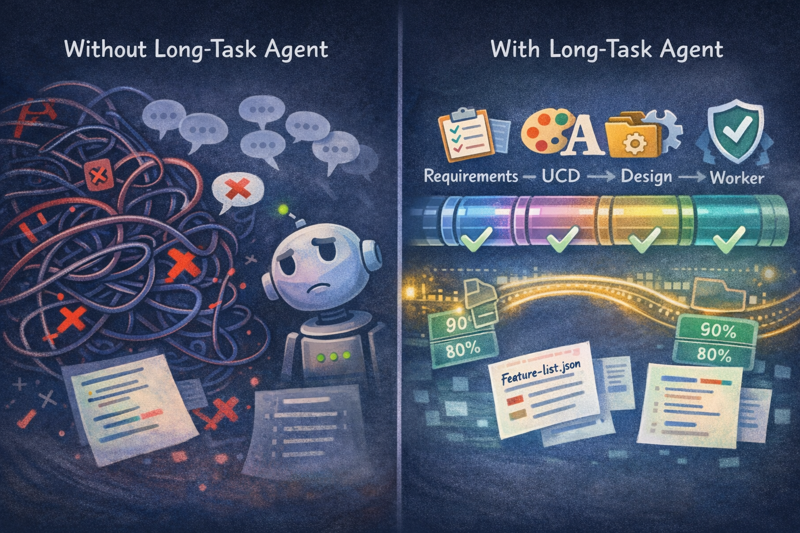
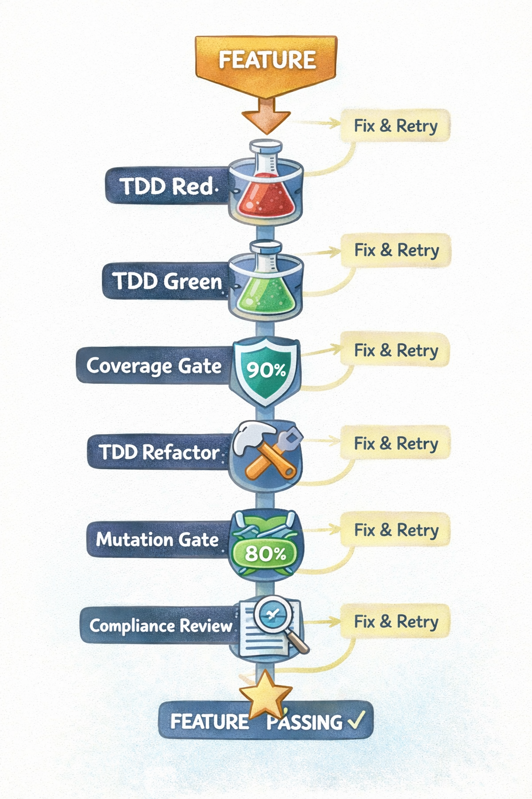
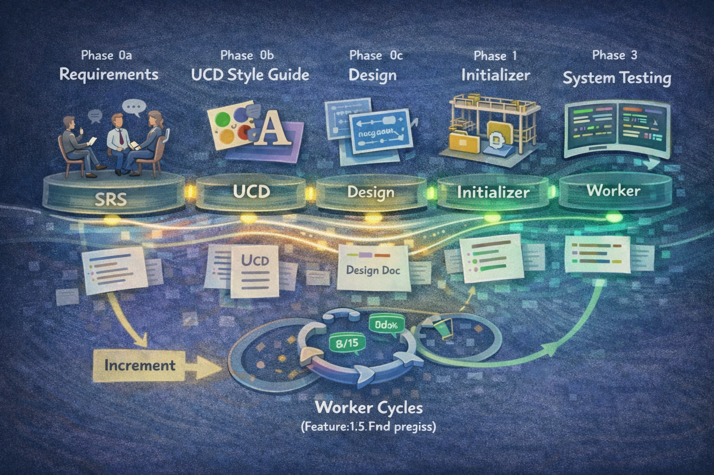
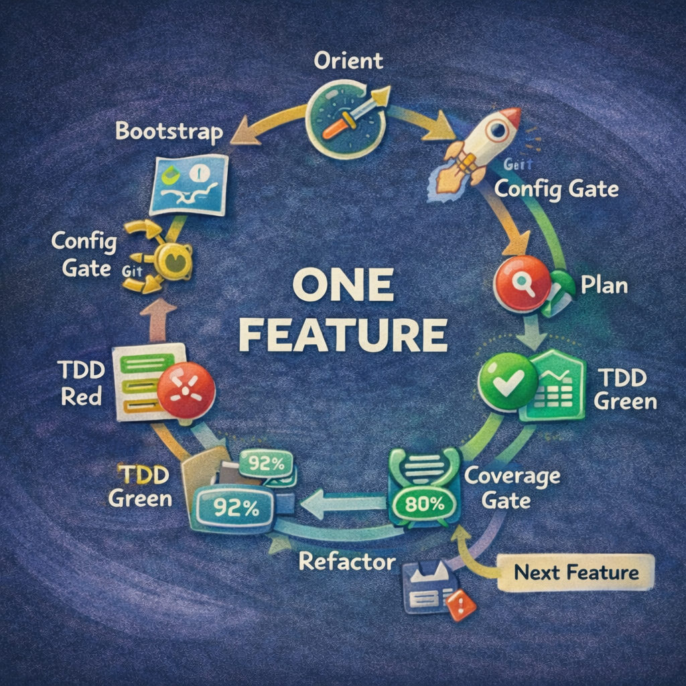
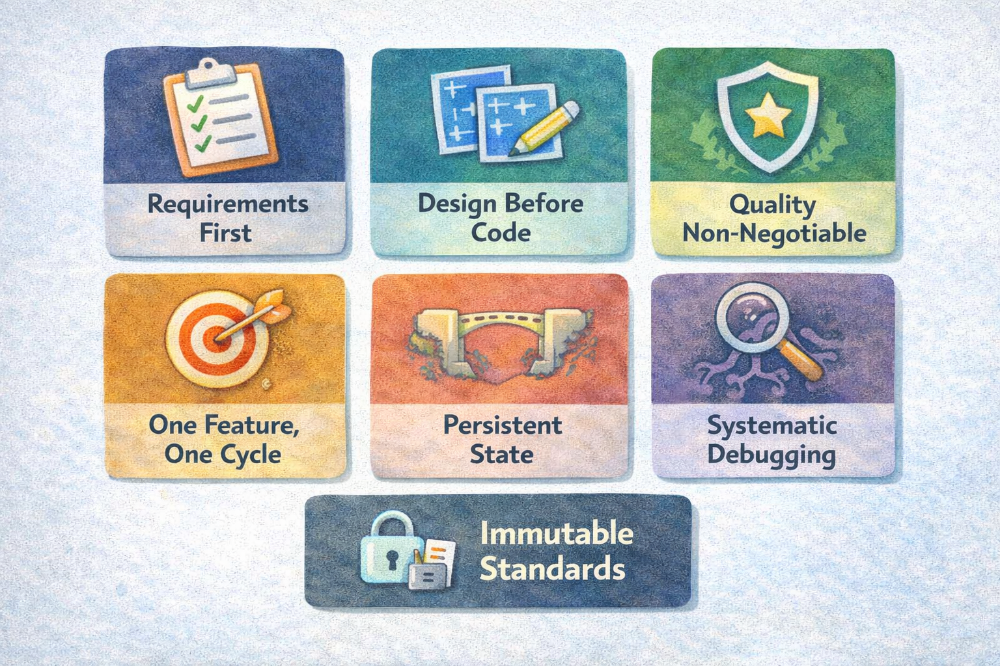

# 语言 / Language

**[中文](README.md)** | **[English](README_EN.md)**

---

# 快速开始

### 1. 安装

#### 方式一：Claude Code 原生命令（推荐）

在 Claude Code 中，首先注册市场：

```bash
/plugin marketplace add suriyel/longtaskforagent
```

然后从该市场安装插件：

```shell
/plugin install long-task@longtaskforagent
```

#### 方式二：一键安装脚本

**macOS / Linux：**

```bash
curl -fsSL https://raw.githubusercontent.com/suriyel/longtaskforagent/main/claude-code/install.sh | bash
```

**Windows（PowerShell）：**

```powershell
irm https://raw.githubusercontent.com/suriyel/longtaskforagent/main/claude-code/install.ps1 | iex
```

脚本会自动：
- Clone 仓库到 `~/.claude/plugins/marketplaces/longtaskforagent/`
- 更新 `known_marketplaces.json` 注册信息

安装完成后，使用 Claude Code 安装插件：

```shell
/plugin install long-task@longtaskforagent
```

#### 方式三：OpenCode 用户

如果您使用 [OpenCode](https://opencode.ai)：

**macOS / Linux：**

```bash
curl -fsSL https://raw.githubusercontent.com/suriyel/longtaskforagent/main/install.sh | bash
```

**Windows（PowerShell，需开发者模式或管理员权限）：**

```powershell
irm https://raw.githubusercontent.com/suriyel/longtaskforagent/main/install.ps1 | iex
```

安装完成后重启 OpenCode 即可激活。完整说明请参阅 [OpenCode 安装指南](docs/README.opencode.md)。

### 2. 快速开始

启动 Claude Code 后，只需告诉它您想构建什么：

```
> 我想构建一个GitHub 热门项目周报系统。使用 long task skill。
```

系统将自动进入**需求阶段**，通过结构化提问帮助您完善需求，最终生成标准化的 SRS 文档。后续工作流程完全自动化：

```
需求 → UCD (如有UI) → 设计 → ATS (验收测试策略) → 初始化 → 工作循环 → 系统测试
```

[点击查看样例项目](https://github.com/suriyel/githubtrends)


---

# Long-Task Agent

**一款 Claude Code 技能插件，将单会话 AI 编码转变为严谨的多会话软件工程工作流。**

大多数 AI 编程助手在一次对话后会丢失上下文。Long-Task Agent 通过实现七阶段架构和持久状态桥接解决了这个问题——使 Claude Code 能够以专业工程团队的纪律，跨无限会话构建复杂项目。


## 为什么选择 Long-Task Agent？

| 问题 | Long-Task Agent 如何解决 |
|---------|-------------------------------|
| AI 在 `/clear` 后忘记所有内容 | 持久化产物（`feature-list.json`、`task-progress.md`、git 历史）自动桥接会话 |
| AI 不理解需求就生成代码 | 符合 ISO/IEC/IEEE 29148 的需求收集在编写任何代码前产生经批准的 SRS |
| AI 跳过测试或编写浅层测试 | 严格的 TDD（红→绿→重构）配合覆盖率门禁（≥90% 行覆盖，≥80% 分支覆盖）和变异测试（≥80% 得分） |
| AI 产生不一致的 UI | 带令牌化设计系统的 UCD 风格指南确保所有功能的视觉一致性 |
| AI 验收测试覆盖不全 | ATS（验收测试策略）在设计后前置规划每个需求的测试类别，独立 subagent 审核确保无覆盖盲区 |
| AI 偏离批准的设计 | 设计接口覆盖门 + 每个功能后内联合规检查 |
| 无法安全地向现有项目添加功能 | 增量技能执行影响分析，就地更新 SRS/设计/UCD，用波次跟踪变更 |
| "在我机器上能跑"综合症 | 系统测试阶段（IEEE 829）包含回归、集成、端到端和 NFR 验证 |



## 核心理念

### 1. 需求驱动，而非代码优先

每个项目都从结构化的需求收集开始——而不是编码。SRS 捕获*做什么*，UCD 捕获*外观*，设计文档捕获*怎么做*。三者全部批准后才会编写代码。

### 2. 持久状态桥接会话

十多个持久化产物确保会话间零知识丢失：

| 产物 | 用途 |
|----------|---------|
| `feature-list.json` | 带状态跟踪的结构化任务清单（JSON 防止模型损坏） |
| `task-progress.md` | 逐会话日志，带当前状态标题 |
| `docs/plans/*-srs.md` | 已批准的软件需求规格说明书 |
| `docs/plans/*-design.md` | 已批准的技术设计文档 |
| `docs/plans/*-ats.md` | 已批准的验收测试策略（需求→场景映射，独立 subagent 审核） |
| `docs/plans/*-ucd.md` | 已批准的 UCD 风格指南（UI 项目） |
| `long-task-guide.md` | 工作会话指南，含环境激活 + 工具命令 |
| `docs/test-cases/feature-*.md` | 每功能的 ST 测试用例文档（ISO/IEC/IEEE 29119） |
| `docs/plans/*-st-plan.md` | 带 RTM 的系统测试计划 |
| `docs/plans/*-st-report.md` | 带 Go/No-Go 结论的系统测试报告 |
| `RELEASE_NOTES.md` | Keep a Changelog 格式的活态变更日志 |
| Git 历史 | 带描述性提交的完整变更历史 |

### 3. 质量不可妥协

每个功能都要通过一系列自动化质量门禁——无例外，无捷径：

- **TDD 红→绿→重构** — 先写测试，总是如此
- **覆盖率门禁** — 行覆盖 ≥90%，分支覆盖 ≥80%
- **变异门禁** — 变异得分 ≥80%（捕获那些通过但实际没测试任何东西的测试）
- **内联合规检查** — 每个功能后机械验证接口契约、测试清单、依赖版本和 UCD 令牌
- **UCD 合规** — UI 功能要验证是否符合风格令牌

### 4. 每个周期一个功能

每个工作会话专注于恰好一个功能。这防止上下文耗尽，确保干净的提交，并使每个功能独立可验证。



## 七阶段架构




### 阶段 0a：需求收集

- 符合 ISO/IEC/IEEE 29148 的结构化提问
- EARS 需求模板（Given/When/Then 验收标准）
- 反模式检测：模糊词、复合需求、设计泄漏
- 产出一份已批准的 **SRS**（`docs/plans/*-srs.md`）

### 阶段 0b：UCD 风格指南

- 定义视觉方向、颜色令牌、排版、间距
- 为组件模型生成文本转图像提示词
- 非UI项目自动跳过
- 产出一份已批准的 **UCD**（`docs/plans/*-ucd.md`）

### 阶段 0c：设计

- 提出带有权衡分析的 2-3 种方案
- 每功能的 Mermaid 图（类图、序列图、流程图）
- 第三方依赖版本及兼容性验证
- 产出一份已批准的 **设计文档**（`docs/plans/*-design.md`）

### 阶段 0d：验收测试策略（ATS）

- 将每个 FR/NFR/IFR 映射到验收场景，标注必须的测试类别（FUNC、BNDRY、SEC、PERF、UI）
- NFR 测试方法矩阵（工具 + 阈值 + 负载参数）
- 跨功能集成场景预规划
- 风险驱动测试优先级排序
- 独立 ATS 审核 subagent（7 维度：覆盖完整性、类别多样性、场景充分性、可验证性、NFR 可测性、集成覆盖、风险一致性），支持自定义审核模板
- 小项目（≤5 FR）自动跳过，Tiny 项目嵌入设计文档
- 产出一份已批准的 **ATS**（`docs/plans/*-ats.md`）
- 约束下游 Init（verification_steps）和 feature-st（用例派生）

### 阶段 1：初始化

- 读取 SRS + 设计 + ATS，脚手架项目骨架
- 将需求分解为 10-200+ 个可验证功能
- 生成环境引导脚本（`init.sh` / `init.ps1`）
- 创建初始 git 提交

### 阶段 2：工作循环

每个循环遵循严格纪律：

```
定位 → 引导 → 配置门禁 → 开发工具门禁 → 计划
  → TDD 红 → TDD 绿 → 覆盖率门禁
    → TDD 重构 → 变异门禁
      → 功能 ST（黑盒） → 内联合规检查
        → 持久化 → 下一个功能
```

### 阶段 3：系统测试

- 每功能 ST（ISO/IEC/IEEE 29119）—— 通过 Chrome DevTools MCP 进行黑盒验收测试
- 符合 IEEE 829 的系统级测试计划，带需求追溯矩阵
- 回归、集成、端到端、NFR 验证、探索性测试
- Go/No-Go 结论——缺陷循环回工作会话进行修复

### 阶段 1.5：增量（发布后变更）

- 放置 `increment-request.json` 信号文件 → 技能自动检测
- 对现有功能的影响分析
- 就地更新 SRS、设计、ATS、UCD（git 跟踪历史）
- 带波次元数据追加新功能以实现可追溯性
  

## 13 技能超能力架构

Long-Task Agent 使用**按需技能加载**模式——只有引导路由器在会话开始时加载；阶段技能按需加载，保持上下文精简。

```
using-long-task (引导路由器 — 始终加载)
   │
   ├─→ long-task-requirements ──→ long-task-ucd ──→ long-task-design ──→ long-task-ats ──→ long-task-init
   │                              (无UI时自动跳过)                   (≤5FR自动跳过)       │
   │                                                                          ↓
   ├─→ long-task-increment (如果 increment-request.json 存在)          long-task-work
   │                                                                     │  │  │  │
   │                                                              ┌───────┘  │  └──────┴─────┐
   │                                                              ↓          ↓                ↓
   │                                                         long-task  long-task       long-task
   │                                                           -tdd     -quality       -feature-st
   │                                                              │           │
   │
   └─→ long-task-st (当所有功能通过时)
```

| 技能 | 角色 |
|-------|------|
| `using-long-task` | 引导路由器——检测项目状态，调用正确阶段 |
| `long-task-requirements` | ISO 29148 需求收集 → SRS |
| `long-task-ucd` | 带设计令牌的 UCD 风格指南 |
| `long-task-design` | 带权衡分析的技术设计 |
| `long-task-ats` | 验收测试策略 — 需求→场景映射 + 独立 subagent 审核 |
| `long-task-init` | 项目脚手架和功能分解 |
| `long-task-work` | 工作编排器（每周期一个功能） |
| `long-task-tdd` | TDD 红→绿→重构纪律 |
| `long-task-quality` | 覆盖率门禁 + 变异门禁 |
| `long-task-feature-st` | 每功能黑盒验收测试（Chrome DevTools MCP + ISO/IEC/IEEE 29119） |
| `long-task-increment` | 带影响分析的发布后功能添加 |
| `long-task-st` | 带 Go/No-Go 结论的 IEEE 829 系统测试 |

---

## 多语言支持

Long-Task Agent 与语言无关。它通过可配置的工具设置支持任何技术栈：

| 语言 | 测试框架 | 覆盖率 | 变异测试 |
|----------|---------------|----------|------------------|
| Python | pytest | pytest-cov | mutmut |
| Java | JUnit | JaCoCo | PIT (pitest) |
| TypeScript | Vitest / Jest | c8 / istanbul | Stryker |
| C/C++ | Google Test | gcov + lcov | Mull |
| *自定义* | *任意* | *任意* | *任意* |

`feature-list.json` 中的 `tech_stack` 字段驱动所有工具命令——使用 `get_tool_commands.py` 消除每种语言的查找：

```bash
python long-task-agent/scripts/get_tool_commands.py feature-list.json
```

---

## 自动化工作流脚本

### auto_loop.py - 不间断执行保障

`auto_loop.py` 是确保长时间任务能**不间断执行**的核心脚本，通过重复调用 Claude Code 自动化多特性开发流程，直到所有活动特性通过或达到终止条件。

**核心价值：**
- 🔄 **自动化迭代** - 无需手动重复执行，脚本自动推进工作流
- ⏸️ **优雅中断** - 支持两级 Ctrl+C 中断，确保当前工作不丢失
- 🛡️ **错误检测** - 自动识别上下文限制、速率限制等不可恢复错误
- 📊 **状态跟踪** - 实时显示特性通过情况

**使用方法：**
```bash
python scripts/auto_loop.py feature-list.json
python scripts/auto_loop.py feature-list.json --max-iterations 30
python scripts/auto_loop.py feature-list.json --cooldown 10
python scripts/auto_loop.py feature-list.json --prompt "继续"
```

**参数说明：**
- `feature_list`: feature-list.json 的路径（必需）
- `--max-iterations`: 最大迭代次数（默认：50）
- `--cooldown`: 迭代之间的等待秒数（默认：5）
- `--prompt`: 每次迭代发送的提示（默认：继续）

**中断处理：**
- **第1次 Ctrl+C**: 优雅停止 - 完成当前迭代，然后停止
- **第2次 Ctrl+C**: 强制终止 - 立即终止子进程

**退出代码：**
- 0: 所有特性通过
- 1: 错误或达到最大迭代次数
- 2: claude 命令失败
- 3: 检测到不可恢复的错误（上下文限制、速率限制等）
- 130: 用户中断（Ctrl+C）

---

## 验证和安全脚本

插件包含一套验证脚本以防止常见故障：

| 脚本 | 用途 |
|------|------|
| `validate_features.py` | 验证 `feature-list.json` 模式和数据完整性 |
| `validate_guide.py` | 验证 `long-task-guide.md` 结构完整性 |
| `check_configs.py` | 在功能工作前验证所需的环境配置 |
| `check_devtools.py` | 验证 UI 功能的 Chrome DevTools MCP 可用性 |
| `check_st_readiness.py` | 在系统测试前确认所有功能通过 |
| `validate_increment_request.py` | 验证增量请求信号文件 |
| `validate_st_cases.py` | 验证 ST 测试用例文档（ISO/IEC/IEEE 29119） |
| `get_tool_commands.py` | 将技术栈映射到 CLI 命令 |
| `check_real_tests.py` | 验证真实测试存在性和 mock 检测 |
| `validate_ats.py` | 验证 ATS 文档结构完整性 + SRS 交叉验证 |
| `check_ats_coverage.py` | ATS↔功能列表↔ST 用例覆盖率检查 |
| `analyze-tokens.py` | 从生成的图像分析 UCD 设计令牌 |

---

## 模板自定义指南

Long-Task Agent 提供五个可自定义的文档模板，用于生成符合行业标准的需求、设计、测试策略和测试文档。

### 内置模板

| 模板 | 路径 | 用途 | 标准 |
|------|------|------|------|
| SRS 模板 | `docs/templates/srs-template.md` | 软件需求规格说明书 | ISO/IEC/IEEE 29148 |
| 设计模板 | `docs/templates/design-template.md` | 技术设计文档 | - |
| ATS 模板 | `docs/templates/ats-template.md` | 验收测试策略文档 | - |
| ATS 审核模板 | `docs/templates/ats-review-template.md` | ATS 审核规范（7 维度） | - |
| ST 测试用例模板 | `docs/templates/st-case-template.md` | 系统测试用例文档 | ISO/IEC/IEEE 29119-3 |

### 自定义方式

#### SRS 模板自定义

在**需求阶段**（`long-task-requirements`），通过对话指定自定义模板路径：

```
请使用我自定义的 SRS 模板：docs/templates/my-srs-template.md
```

**要求**：模板必须是 `.md` 文件，且包含至少一个 `## ` 级别的标题。

#### 设计模板自定义

在**设计阶段**（`long-task-design`），通过对话指定自定义模板路径：

```
请使用我自定义的设计模板：docs/templates/my-design-template.md
```

**要求**：模板必须是 `.md` 文件，且包含至少一个 `## ` 级别的标题。

#### ATS 模板自定义

通过 `feature-list.json` 根级别字段配置（或在 ATS 阶段通过对话指定）：

```json
{
  "ats_template_path": "docs/templates/custom-ats-template.md",
  "ats_review_template_path": "docs/templates/custom-ats-review-template.md",
  "ats_example_path": "docs/templates/ats-example.md"
}
```

| 字段 | 说明 |
|------|------|
| `ats_template_path` | 自定义 ATS 文档模板路径（定义文档结构） |
| `ats_review_template_path` | 自定义审核规范模板路径（定义维度、严重级别、通过条件） |
| `ats_example_path` | 示例文件路径（定义风格、语言、详细程度） |

审核模板可自定义：增删维度（如添加 GDPR 数据测试覆盖）、修改严重级别定义、调整通过条件。

#### ST 测试用例模板自定义

通过 `feature-list.json` 根级别字段配置：

```json
{
  "st_case_template_path": "docs/templates/custom-st-template.md",
  "st_case_example_path": "docs/templates/st-case-example.md"
}
```

| 字段 | 说明 |
|------|------|
| `st_case_template_path` | 自定义模板路径（定义文档结构） |
| `st_case_example_path` | 示例文件路径（定义风格、语言、详细程度） |

**配置组合效果**：

| 配置 | 效果 |
|------|------|
| 两者都提供 | 使用模板的**结构** + 示例的**风格** |
| 仅提供模板 | 使用模板结构 + 默认风格 |
| 仅提供示例 | 从示例推断结构 + 使用示例风格 |
| 都不提供 | 使用内置默认模板（ISO/IEC/IEEE 29119-3） |

### 模板优先级规则

1. **用户指定路径** > **内置默认模板**
2. 模板文件必须存在，否则回退到默认模板
3. 模板必须通过验证（`.md` 文件 + 至少一个 `## ` 标题）

### 最佳实践

1. **复制内置模板作为起点**：保留原有的章节结构，只修改指导文字
2. **保持标准合规性**：SRS 模板建议保留 ISO 29148 核心章节；ST 模板建议保留 29119-3 必需字段
3. **版本控制**：将自定义模板提交到 git，便于团队协作
4. **ST 示例文件**：提供一个已填写的 ST 测试用例文档作为示例，可统一团队的风格和详细程度

---

## 企业级 MCP 工具抽象

Long-Task Agent 的所有技能默认使用 Chrome DevTools MCP 和 CLI 命令进行测试、覆盖率和变异测试。**企业级 MCP 工具抽象**允许您将这些硬编码的工具引用替换为内部 MCP 服务器，无需修改任何技能文件。

### 工作原理

```
tool-bindings.json          →  apply_tool_bindings.py  →  .long-task-bindings/
(企业工具映射)                   (Jinja2 模板渲染)           (渲染后的 SKILL.md)
```

1. 在项目根目录放置 `tool-bindings.json`（从 `docs/templates/tool-bindings-template.json` 复制）
2. 会话启动时 hook 自动检测并渲染模板到 `.long-task-bindings/`
3. 技能加载时优先使用渲染后的文件，回退到原始 SKILL.md

### 能力映射

`tool-bindings.json` 定义了四种能力绑定：

| 能力 | 默认（CLI/Chrome DevTools） | 企业 MCP 替换 |
|------|---------------------------|--------------|
| `test` | `pytest` / `jest` 等 CLI 命令 | 企业 CI MCP 服务器 |
| `coverage` | `pytest-cov` / `c8` 等 CLI 命令 | 企业 CI MCP 服务器 |
| `mutation` | `mutmut` / `stryker` 等 CLI 命令 | 企业 CI MCP 服务器 |
| `ui_tools` | Chrome DevTools MCP 工具名 | 企业浏览器自动化 MCP |

### 配置示例

```json
{
  "version": 1,
  "mcp_servers": {
    "corp_ci": {
      "command": "npx",
      "args": ["-y", "@your-org/ci-mcp@latest"]
    },
    "corp_browser": {
      "command": "npx",
      "args": ["-y", "@your-org/browser-mcp@latest"]
    }
  },
  "capability_bindings": {
    "test": {
      "type": "mcp",
      "tool": "corp_ci__run_tests"
    },
    "coverage": {
      "type": "mcp",
      "tool": "corp_ci__coverage"
    },
    "ui_tools": {
      "type": "mcp",
      "tool_mapping": {
        "navigate_page": "corp_browser__navigate",
        "take_screenshot": "corp_browser__screenshot",
        "click": "corp_browser__click"
      }
    }
  }
}
```

### 相关脚本

| 脚本 | 用途 |
|------|------|
| `apply_tool_bindings.py` | 渲染 SKILL.md.template → .long-task-bindings/（Jinja2） |
| `check_mcp_providers.py` | 检测企业 MCP 服务器注册状态，输出安装指引 |
| `check_jinja2.py` | 检测 Jinja2 可用性（企业 MCP 模板渲染依赖） |

### 设计原则

- **非侵入式检测** — 只读检查 MCP 注册状态，不写入配置文件
- **项目级隔离渲染** — 输出到 `.long-task-bindings/`，避免多会话竞态
- **向后兼容** — 无 `tool-bindings.json` 时使用原始 SKILL.md，零影响
- **仅标准库依赖** — 除 Jinja2 外无额外依赖（Python 3 标准库）

---

## 对比分析

| 能力 | 典型 AI 编程 | Long-Task Agent |
|------------|------------------|-----------------|
| 多会话持久化 | 手动复制粘贴 | 通过 10+ 持久化产物自动完成 |
| 需求流程 | "直接构建" | 符合 ISO 29148 的 SRS，带结构化收集 |
| 设计流程 | 临时性 | 2-3 种方案带权衡，逐节批准 |
| TDD 纪律 | 可选，经常跳过 | 每个功能强制 红→绿→重构 |
| 测试质量验证 | 仅行覆盖（如果有） | 覆盖率 + 变异测试，可配置阈值 |
| 验收测试规划 | 临时性，类别偏向功能测试 | ATS 前置规划每个需求的测试类别，独立 subagent 审核 |
| UI 一致性 | 每个开发者的口味 | 带令牌化设计系统的 UCD 风格指南 |
| 实现后验证 | 无 | 设计接口覆盖门 + 内联合规检查 |
| 系统测试 | 手动 QA | 符合 IEEE 829，带 RTM、Go/No-Go 结论 |
| 发布后添加功能 | 直接编辑代码 | 影响分析、跟踪波次、文档更新 |
| 项目状态可见性 | 读代码 | `task-progress.md` + `feature-list.json` |

---

## 项目结构

```
long-task-agent/
├── skills/                          # 13 个技能（按需加载）
│   ├── using-long-task/             # 引导路由器
│   ├── long-task-requirements/      # 阶段 0a：需求和 SRS
│   ├── long-task-ucd/               # 阶段 0b：UCD 风格指南
│   ├── long-task-design/            # 阶段 0c：设计
│   ├── long-task-ats/               # 阶段 0d：验收测试策略（含独立审核 subagent）
│   ├── long-task-init/              # 阶段 1：初始化
│   ├── long-task-work/              # 阶段 2：工作编排器
│   ├── long-task-tdd/               # TDD 纪律
│   ├── long-task-quality/           # 覆盖率 + 变异门禁
│   ├── long-task-feature-st/        # 每功能黑盒验收测试
│   ├── long-task-increment/         # 增量开发
│   ├── long-task-st/                # 系统测试
│   └── long-task-finalize/          # ST 后文档和示例生成
├── scripts/                         # 验证和实用脚本
├── tests/                           # 所有脚本的测试套件
├── hooks/                           # SessionStart 钩子配置
├── commands/                        # 用户快捷命令
├── docs/templates/                  # 可自定义的 SRS 和设计模板
└── CLAUDE.md                        # 跨会话导航索引
```

---

## 指导原则

> **"三思而后行。"**

1. **无批准需求就不写代码** — SRS 在隐藏假设变成 bug 之前捕获它们
2. **无批准设计就不实现** — 在承诺一种方案前评估 2-3 种方案
3. **质量不走捷径** — TDD、覆盖率、变异测试和内联合规检查是不可协商的门禁
4. **一个功能，一个周期** — 专注工作防止上下文耗尽并确保干净、原子性的提交
5. **持久化产物胜过短暂记忆** — JSON 状态文件和 git 历史在任何上下文丢失后依然存在
6. **系统化调试胜过猜测修复** — 在任何修复尝试前进行根因分析
7. **不可变的验证步骤** — 一旦设定，标准永不降低




## 路线图

- **并行 Agent 调度** — 识别独立功能并并行调度工作子 agent

---

## 鸣谢

- TDD部分借鉴[superpowers](https://github.com/obra/superpowers)
- long task执行参考自 B站up [数字游牧人](https://b23.tv/UUVywob?share_medium=android&share_source=weixin&bbid=XUD7142DB761960E57CD68EE4E71913CF4699&ts=1773413437129)

## 许可证

[MIT](LICENSE)

---

<p align="center">
  <i>为 Claude Code 构建 — 将 AI 辅助开发转变为 AI 工程化开发。</i>
</p>
