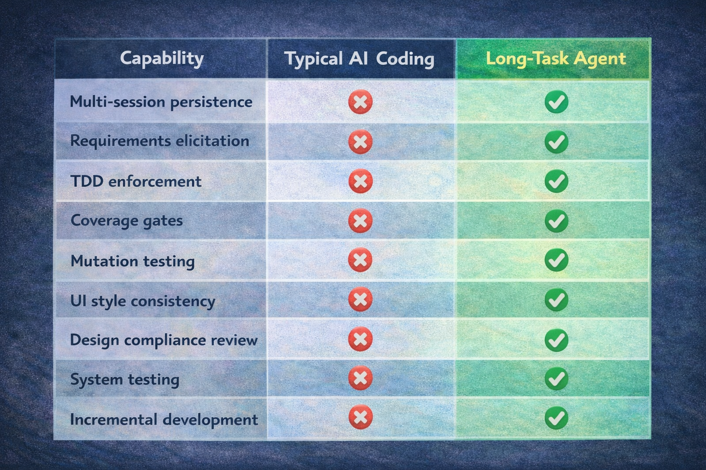

# Language / 语言

**[English](README_EN.md)** | **[中文](README.md)**

---

# Quick Start

### 1. Installation

#### Option 1: Claude Code Native Command (Recommended)

In Claude Code, register the marketplace first:

```bash
/plugin marketplace add suriyel/longtaskforagent
```

Then install the plugin from this marketplace:

```shell
/plugin install long-task@longtaskforagent
```

#### Option 2: One-line Installer Script

**macOS / Linux:**

```bash
curl -fsSL https://raw.githubusercontent.com/suriyel/longtaskforagent/main/claude-code/install.sh | bash
```

**Windows (PowerShell):**

```powershell
irm https://raw.githubusercontent.com/suriyel/longtaskforagent/main/claude-code/install.ps1 | iex
```

The script automatically:
- Clones the repository to `~/.claude/plugins/marketplaces/longtaskforagent/`
- Updates `known_marketplaces.json` registration

After installation, use Claude Code to install plugins:

```shell
/plugin install long-task@longtaskforagent
```

#### Option 3: OpenCode Users

If you use [OpenCode](https://opencode.ai):

**macOS / Linux:**

```bash
curl -fsSL https://raw.githubusercontent.com/suriyel/longtaskforagent/main/install.sh | bash
```

**Windows (PowerShell — requires Developer Mode or Administrator):**

```powershell
irm https://raw.githubusercontent.com/suriyel/longtaskforagent/main/install.ps1 | iex
```

Restart OpenCode after installation. See the [OpenCode Installation Guide](docs/README.opencode.md) for full details.

### 2. Quick Start

After launching Claude Code, simply tell it what you want to build:

```
> I want to build a GitHub trending projects weekly report system. use `long task skill`.
```

The system will automatically enter the **Requirements phase**, helping you refine requirements through structured questioning and ultimately generate a standardized SRS document. The subsequent workflow is fully automated:

```
Requirements → UCD (if UI) → Design → ATS (Acceptance Test Strategy) → Init → Worker cycles → System Testing
```

[View sample project](https://github.com/suriyel/githubtrends)


---

# Long-Task Agent

**A Claude Code skill plugin that turns single-session AI coding into a rigorous, multi-session software engineering workflow.**

Most AI coding assistants lose context after one conversation. Long-Task Agent solves this by implementing a seven-phase architecture with persistent state bridging — enabling Claude Code to build complex projects across unlimited sessions with the discipline of a professional engineering team.


## Why Long-Task Agent?

| Problem | How Long-Task Agent Solves It |
|---------|-------------------------------|
| AI forgets everything after `/clear` | Persistent artifacts (`feature-list.json`, `task-progress.md`, git history) bridge sessions automatically |
| AI generates code without understanding requirements | ISO/IEC/IEEE 29148-aligned requirements elicitation produces an approved SRS before any code is written |
| AI skips testing or writes shallow tests | Strict TDD (Red→Green→Refactor) with coverage gates (≥90% line, ≥80% branch) and mutation testing (≥80% score) |
| AI produces inconsistent UI | UCD style guide with token-based design system ensures visual consistency across all features |
| AI generates thin acceptance tests | ATS (Acceptance Test Strategy) pre-plans test categories per requirement after design, with independent subagent review ensuring no coverage blind spots |
| AI drifts from the approved design | Design interface coverage gate + inline compliance check after every feature |
| No way to add features to an existing project safely | Increment skill performs impact analysis, updates SRS/Design/UCD in place, tracks changes with waves |
| "Works on my machine" syndrome | System Testing phase (IEEE 829) with regression, integration, E2E, and NFR verification |


## Core Philosophy

### 1. Requirements-Driven, Not Code-First

Every project starts with structured requirements elicitation — not coding. The SRS captures the *what*, the UCD captures the *look*, and the design document captures the *how*. No code is written until all three are approved.

### 2. Persistent State Bridges Sessions

Ten+ persistent artifacts ensure zero knowledge loss between sessions:

| Artifact | Purpose |
|----------|---------|
| `feature-list.json` | Structured task inventory with status tracking (JSON prevents model corruption) |
| `task-progress.md` | Session-by-session log with current state header |
| `docs/plans/*-srs.md` | Approved Software Requirements Specification |
| `docs/plans/*-design.md` | Approved technical design document |
| `docs/plans/*-ats.md` | Approved Acceptance Test Strategy (requirement→scenario mapping, independent subagent review) |
| `docs/plans/*-ucd.md` | Approved UCD style guide (UI projects) |
| `long-task-guide.md` | Worker session guide with env activation + tool commands |
| `docs/test-cases/feature-*.md` | Per-feature ST test case documents (ISO/IEC/IEEE 29119) |
| `docs/plans/*-st-plan.md` | System testing plan with RTM |
| `docs/plans/*-st-report.md` | System testing report with Go/No-Go verdict |
| `RELEASE_NOTES.md` | Living changelog in Keep a Changelog format |
| Git history | Full change history with descriptive commits |

### 3. Quality is Non-Negotiable

Every feature passes through a gauntlet of automated quality gates — no exceptions, no shortcuts:

- **TDD Red→Green→Refactor** — tests are written before code, always
- **Coverage Gate** — line ≥90%, branch ≥80%
- **Mutation Gate** — mutation score ≥80% (catches tests that pass without actually testing anything)
- **Inline Compliance Check** — mechanical verification of interface contracts, test inventory, dependency versions, and UCD tokens after every feature
- **UCD Compliance** — UI features are verified against style tokens

### 4. One Feature Per Cycle

Each worker session focuses on exactly one feature. This prevents context exhaustion, ensures clean commits, and keeps every feature independently verifiable.


## Seven-Phase Architecture


### Phase 0a: Requirements Elicitation

- Structured questioning aligned with ISO/IEC/IEEE 29148
- EARS requirement templates (Given/When/Then acceptance criteria)
- Anti-pattern detection: weasel words, compound requirements, design leakage
- Produces an approved **SRS** (`docs/plans/*-srs.md`)

### Phase 0b: UCD Style Guide

- Defines visual direction, color tokens, typography, spacing
- Generates text-to-image prompts for component mockups
- Auto-skips for non-UI projects
- Produces an approved **UCD** (`docs/plans/*-ucd.md`)

### Phase 0c: Design

- Proposes 2-3 approaches with trade-offs
- Per-feature Mermaid diagrams (class, sequence, flow)
- Third-party dependency versions with compatibility verification
- Produces an approved **Design Document** (`docs/plans/*-design.md`)

### Phase 0d: Acceptance Test Strategy (ATS)

- Maps every FR/NFR/IFR to acceptance scenarios with required test categories (FUNC, BNDRY, SEC, PERF, UI)
- NFR test method matrix (tools + thresholds + load parameters)
- Cross-feature integration scenario pre-planning
- Risk-driven test priority ordering
- Independent ATS reviewer subagent (7 dimensions: coverage completeness, category diversity, scenario adequacy, verifiability, NFR testability, integration coverage, risk consistency), with custom review template support
- Auto-skip for tiny projects (≤5 FR), embedded in design doc for tiny projects
- Produces an approved **ATS** (`docs/plans/*-ats.md`)
- Constrains downstream Init (verification_steps) and feature-st (test case derivation)

### Phase 1: Initialization

- Reads SRS + Design + ATS, scaffolds project skeleton
- Decomposes requirements into 10-200+ verifiable features
- Generates environment bootstrap scripts (`init.sh` / `init.ps1`)
- Creates initial git commit

### Phase 2: Worker Cycles

Each cycle follows a strict discipline:

```
Orient → Bootstrap → Config Gate → DevTools Gate → Plan
  → TDD Red → TDD Green → Coverage Gate
    → TDD Refactor → Mutation Gate
      → Feature ST (Black-Box) → Inline Compliance Check
        → Persist → Next Feature
```

### Phase 3: System Testing

- Per-feature ST (ISO/IEC/IEEE 29119) — black-box acceptance testing via Chrome DevTools MCP
- IEEE 829-aligned system-level test planning with Requirements Traceability Matrix
- Regression, integration, E2E, NFR verification, exploratory testing
- Go/No-Go verdict — defects loop back to Worker for fixes

### Phase 1.5: Increment (Post-Launch Changes)

- Place an `increment-request.json` signal file → the skill auto-detects it
- Impact analysis against existing features
- Updates SRS, Design, ATS, UCD in place (git tracks history)
- Appends new features with wave metadata for traceability
  

## 13-Skill Superpowers Architecture

Long-Task Agent uses an **on-demand skill loading** pattern — only the bootstrap router is loaded at session start; phase skills are loaded as needed, keeping context lean.

```
using-long-task (bootstrap router — always loaded)
   │
   ├─→ long-task-requirements ──→ long-task-ucd ──→ long-task-design ──→ long-task-ats ──→ long-task-init
   │                              (auto-skip if no UI)                   (auto-skip ≤5 FR)      │
   │                                                                          ↓
   ├─→ long-task-increment (if increment-request.json exists)          long-task-work
   │                                                                     │  │  │  │
   │                                                              ┌───────┘  │  └──────┴─────┐
   │                                                              ↓          ↓                ↓
   │                                                         long-task  long-task       long-task
   │                                                           -tdd     -quality       -feature-st
   │                                                              │           │
   │
   └─→ long-task-st (when all features pass)
```

| Skill | Role |
|-------|------|
| `using-long-task` | Bootstrap router — detects project state, invokes correct phase |
| `long-task-requirements` | ISO 29148 requirements elicitation → SRS |
| `long-task-ucd` | UCD style guide with design tokens |
| `long-task-design` | Technical design with trade-off analysis |
| `long-task-ats` | Acceptance Test Strategy — requirement→scenario mapping + independent subagent review |
| `long-task-init` | Project scaffolding and feature decomposition |
| `long-task-work` | Worker orchestrator (one feature per cycle) |
| `long-task-tdd` | TDD Red→Green→Refactor discipline |
| `long-task-quality` | Coverage gate + mutation gate |
| `long-task-feature-st` | Per-feature black-box acceptance testing (Chrome DevTools MCP + ISO/IEC/IEEE 29119) |
| `long-task-increment` | Post-launch feature additions with impact analysis |
| `long-task-st` | IEEE 829 system testing with Go/No-Go verdict |

---

## Multi-Language Support

Long-Task Agent is language-agnostic. It supports any tech stack through configurable tool settings:

| Language | Test Framework | Coverage | Mutation Testing |
|----------|---------------|----------|------------------|
| Python | pytest | pytest-cov | mutmut |
| Java | JUnit | JaCoCo | PIT (pitest) |
| TypeScript | Vitest / Jest | c8 / istanbul | Stryker |
| C/C++ | Google Test | gcov + lcov | Mull |
| *Custom* | *Any* | *Any* | *Any* |

The `tech_stack` field in `feature-list.json` drives all tool commands — use `get_tool_commands.py` to eliminate per-language lookup:

```bash
python long-task-agent/scripts/get_tool_commands.py feature-list.json
```

---

## Automated Workflow Scripts

### auto_loop.py - Uninterrupted Execution Guarantee

The `auto_loop.py` script is the core component for **ensuring uninterrupted execution** of long-task workflows. It automates multi-feature development by repeatedly calling Claude Code until all active features pass or a termination condition is met.

**Core Value:**
- 🔄 **Automated Iteration** - No manual repetition needed, the script automatically advances the workflow
- ⏸️ **Graceful Interruption** - Supports two-level Ctrl+C interruption, ensuring current work is not lost
- 🛡️ **Error Detection** - Automatically identifies unrecoverable errors like context limits and rate limits
- 📊 **Status Tracking** - Real-time display of feature pass status

**Usage:**
```bash
python scripts/auto_loop.py feature-list.json
python scripts/auto_loop.py feature-list.json --max-iterations 30
python scripts/auto_loop.py feature-list.json --cooldown 10
python scripts/auto_loop.py feature-list.json --prompt "continue"
```

**Parameters:**
- `feature_list`: Path to feature-list.json (required)
- `--max-iterations`: Maximum number of iterations (default: 50)
- `--cooldown`: Seconds to wait between iterations (default: 5)
- `--prompt`: Prompt to send each iteration (default: 继续)

**Interrupt Handling:**
- **1st Ctrl+C**: Graceful stop - finish current iteration, then stop
- **2nd Ctrl+C**: Force kill - terminate child process immediately

**Exit Codes:**
- 0: All features passing
- 1: Error or max iterations reached
- 2: claude command failed
- 3: Unrecoverable error detected (context limit, rate limit, etc.)
- 130: Interrupted by user (Ctrl+C)

---

## Validation & Safety Scripts

The plugin includes a suite of validation scripts to prevent common failures:

| Script | Purpose |
|--------|---------|
| `validate_features.py` | Validate `feature-list.json` schema and data integrity |
| `validate_guide.py` | Validate `long-task-guide.md` structural integrity |
| `check_configs.py` | Verify required environment configs before feature work |
| `check_devtools.py` | Verify Chrome DevTools MCP availability for UI features |
| `check_st_readiness.py` | Confirm all features passing before system testing |
| `validate_increment_request.py` | Validate increment request signal file |
| `validate_st_cases.py` | Validate ST test case documents (ISO/IEC/IEEE 29119) |
| `get_tool_commands.py` | Map tech stack to CLI commands |
| `check_real_tests.py` | Verify real test existence and mock detection |
| `validate_ats.py` | Validate ATS document structure + SRS cross-validation |
| `check_ats_coverage.py` | ATS↔feature-list↔ST case coverage checking |
| `analyze-tokens.py` | Analyze UCD design tokens from generated images |

---

## Template Customization Guide

Long-Task Agent provides five customizable document templates for generating standards-compliant requirements, design, test strategy, and test documents.

### Built-in Templates

| Template | Path | Purpose | Standard |
|----------|------|---------|----------|
| SRS Template | `docs/templates/srs-template.md` | Software Requirements Specification | ISO/IEC/IEEE 29148 |
| Design Template | `docs/templates/design-template.md` | Technical Design Document | - |
| ATS Template | `docs/templates/ats-template.md` | Acceptance Test Strategy Document | - |
| ATS Review Template | `docs/templates/ats-review-template.md` | ATS Review Specification (7 dimensions) | - |
| ST Test Case Template | `docs/templates/st-case-template.md` | System Test Case Document | ISO/IEC/IEEE 29119-3 |

### Customization Methods

#### SRS Template Customization

During the **Requirements Phase** (`long-task-requirements`), specify a custom template path via conversation:

```
Please use my custom SRS template: docs/templates/my-srs-template.md
```

**Requirements**: Template must be a `.md` file containing at least one `## ` heading.

#### Design Template Customization

During the **Design Phase** (`long-task-design`), specify a custom template path via conversation:

```
Please use my custom design template: docs/templates/my-design-template.md
```

**Requirements**: Template must be a `.md` file containing at least one `## ` heading.

#### ATS Template Customization

Configure via `feature-list.json` root-level fields (or specify during the ATS phase via conversation):

```json
{
  "ats_template_path": "docs/templates/custom-ats-template.md",
  "ats_review_template_path": "docs/templates/custom-ats-review-template.md",
  "ats_example_path": "docs/templates/ats-example.md"
}
```

| Field | Description |
|-------|-------------|
| `ats_template_path` | Custom ATS document template path (defines document structure) |
| `ats_review_template_path` | Custom review spec template path (defines dimensions, severity levels, pass criteria) |
| `ats_example_path` | Example file path (defines style, language, detail level) |

The review template supports: adding/removing dimensions (e.g., GDPR data testing coverage), modifying severity definitions, and customizing pass criteria.

#### ST Test Case Template Customization

Configure via `feature-list.json` root-level fields:

```json
{
  "st_case_template_path": "docs/templates/custom-st-template.md",
  "st_case_example_path": "docs/templates/st-case-example.md"
}
```

| Field | Description |
|-------|-------------|
| `st_case_template_path` | Custom template path (defines document structure) |
| `st_case_example_path` | Example file path (defines style, language, detail level) |

**Configuration Combinations**:

| Configuration | Effect |
|---------------|--------|
| Both provided | Use template's **structure** + example's **style** |
| Only template | Use template structure + default style |
| Only example | Infer structure from example + use example's style |
| Neither | Use built-in default template (ISO/IEC/IEEE 29119-3) |

### Template Priority Rules

1. **User-specified path** > **Built-in default template**
2. Template file must exist, otherwise falls back to default
3. Template must pass validation (`.md` file + at least one `## ` heading)

### Best Practices

1. **Copy built-in templates as a starting point**: Preserve existing section structure, only modify guidance text
2. **Maintain standards compliance**: SRS templates should retain ISO 29148 core sections; ST templates should retain 29119-3 required fields
3. **Version control**: Commit custom templates to git for team collaboration
4. **ST example file**: Provide a filled-out ST test case document as an example to unify team style and detail level

---

## Enterprise MCP Tool Abstraction

All Long-Task Agent skills default to Chrome DevTools MCP and CLI commands for testing, coverage, and mutation testing. The **Enterprise MCP Tool Abstraction** lets you replace these hardcoded tool references with your internal MCP servers — without modifying any skill files.

### How It Works

```
tool-bindings.json          →  apply_tool_bindings.py  →  .long-task-bindings/
(enterprise tool mapping)       (Jinja2 template render)    (rendered SKILL.md)
```

1. Place `tool-bindings.json` in your project root (copy from `docs/templates/tool-bindings-template.json`)
2. The session-start hook auto-detects it and renders templates to `.long-task-bindings/`
3. Skills load the rendered files first, falling back to the original SKILL.md

### Capability Bindings

`tool-bindings.json` defines four capability bindings:

| Capability | Default (CLI / Chrome DevTools) | Enterprise MCP Replacement |
|------------|--------------------------------|---------------------------|
| `test` | `pytest` / `jest` etc. CLI commands | Enterprise CI MCP server |
| `coverage` | `pytest-cov` / `c8` etc. CLI commands | Enterprise CI MCP server |
| `mutation` | `mutmut` / `stryker` etc. CLI commands | Enterprise CI MCP server |
| `ui_tools` | Chrome DevTools MCP tool names | Enterprise browser automation MCP |

### Configuration Example

```json
{
  "version": 1,
  "mcp_servers": {
    "corp_ci": {
      "command": "npx",
      "args": ["-y", "@your-org/ci-mcp@latest"]
    },
    "corp_browser": {
      "command": "npx",
      "args": ["-y", "@your-org/browser-mcp@latest"]
    }
  },
  "capability_bindings": {
    "test": {
      "type": "mcp",
      "tool": "corp_ci__run_tests"
    },
    "coverage": {
      "type": "mcp",
      "tool": "corp_ci__coverage"
    },
    "ui_tools": {
      "type": "mcp",
      "tool_mapping": {
        "navigate_page": "corp_browser__navigate",
        "take_screenshot": "corp_browser__screenshot",
        "click": "corp_browser__click"
      }
    }
  }
}
```

### Related Scripts

| Script | Purpose |
|--------|---------|
| `apply_tool_bindings.py` | Render SKILL.md.template → .long-task-bindings/ (Jinja2) |
| `check_mcp_providers.py` | Detect enterprise MCP server registration, output install guidance |
| `check_jinja2.py` | Detect Jinja2 availability (required for enterprise MCP template rendering) |

### Design Principles

- **Non-invasive detection** — read-only MCP registration checks, no config file writes
- **Project-local rendering** — output to `.long-task-bindings/`, eliminates multi-session race conditions
- **Backward compatible** — works without `tool-bindings.json`, zero impact on default workflow
- **Stdlib only** — no external dependencies beyond Jinja2 (Python 3 stdlib)

---

## How It Compares

<!-- ILLUSTRATION: Comparison Matrix


> **Text-to-image prompt**: A feature comparison matrix rendered as a clean infographic table. Rows represent capabilities: "Multi-session persistence", "Requirements elicitation", "TDD enforcement", "Coverage gates", "Mutation testing", "UI style consistency", "Inline compliance check", "System testing", "Incremental development". Columns compare "Typical AI Coding" (mostly red X marks) vs "Long-Task Agent" (all green checkmarks). The Long-Task Agent column glows with a subtle highlight. Clean table design with alternating row colors, professional fonts. Landscape, 1200×800px.
-->

| Capability | Typical AI Coding | Long-Task Agent |
|------------|------------------|-----------------|
| Multi-session persistence | Manual copy-paste | Automatic via 10+ persistent artifacts |
| Requirements process | "Just build it" | ISO 29148-aligned SRS with structured elicitation |
| Design process | Ad-hoc | 2-3 approaches with trade-offs, section-by-section approval |
| TDD discipline | Optional, often skipped | Mandatory Red→Green→Refactor for every feature |
| Test quality verification | Line coverage only (if any) | Coverage + mutation testing with configurable thresholds |
| Acceptance test planning | Ad-hoc, category-biased toward functional | ATS pre-plans test categories per requirement, with independent subagent review |
| UI consistency | Per-developer taste | UCD style guide with token-based design system |
| Post-implementation verification | None | Design interface coverage gate + inline compliance check |
| System testing | Manual QA | IEEE 829-aligned with RTM, Go/No-Go verdict |
| Adding features post-launch | Edit code directly | Impact analysis, tracked waves, document updates |
| Project state visibility | Read the code | `task-progress.md` + `feature-list.json` |

---

## Project Structure

```
long-task-agent/
├── skills/                          # 13 skills (on-demand loaded)
│   ├── using-long-task/             # Bootstrap router
│   ├── long-task-requirements/      # Phase 0a: Requirements & SRS
│   ├── long-task-ucd/               # Phase 0b: UCD style guide
│   ├── long-task-design/            # Phase 0c: Design
│   ├── long-task-ats/               # Phase 0d: Acceptance Test Strategy (with independent reviewer subagent)
│   ├── long-task-init/              # Phase 1: Initialization
│   ├── long-task-work/              # Phase 2: Worker orchestrator
│   ├── long-task-tdd/               # TDD discipline
│   ├── long-task-quality/           # Coverage + mutation gates
│   ├── long-task-feature-st/        # Per-feature black-box acceptance testing
│   ├── long-task-increment/         # Incremental development
│   ├── long-task-st/                # System testing
│   └── long-task-finalize/          # Post-ST documentation & examples
├── scripts/                         # Validation & utility scripts
├── tests/                           # Test suite for all scripts
├── hooks/                           # SessionStart hook config
├── commands/                        # User shortcut commands
├── docs/templates/                  # Customizable SRS & design templates
└── CLAUDE.md                        # Cross-session navigation index
```

---

## Guiding Principles

> **"Measure twice, cut once."**

1. **No code without approved requirements** — the SRS captures hidden assumptions before they become bugs
2. **No implementation without approved design** — 2-3 approaches are evaluated before committing to one
3. **No shortcuts on quality** — TDD, coverage, mutation testing, and inline compliance check are non-negotiable gates
4. **One feature, one cycle** — focused work prevents context exhaustion and ensures clean, atomic commits
5. **Persistent artifacts over ephemeral memory** — JSON state files and git history survive any context loss
6. **Systematic debugging over guess-and-fix** — root cause analysis before any fix attempt
7. **Immutable verification steps** — once set, the bar never lowers


## Roadmap

- **Parallel Agent Dispatch** — identify independent features and dispatch worker subagents in parallel

---

## Acknowledgments

- TDD approach inspired by [superpowers](https://github.com/obra/superpowers)
- Long task execution reference from Bilibili creator [数字游牧人](https://b23.tv/UUVywob?share_medium=android&share_source=weixin&bbid=XUD7142DB761960E57CD68EE4E71913CF4699&ts=1773413437129)

## License

[MIT](LICENSE)

---

<p align="center">
  <i>Built for Claude Code — turning AI-assisted development into AI-engineered development.</i>
</p>
