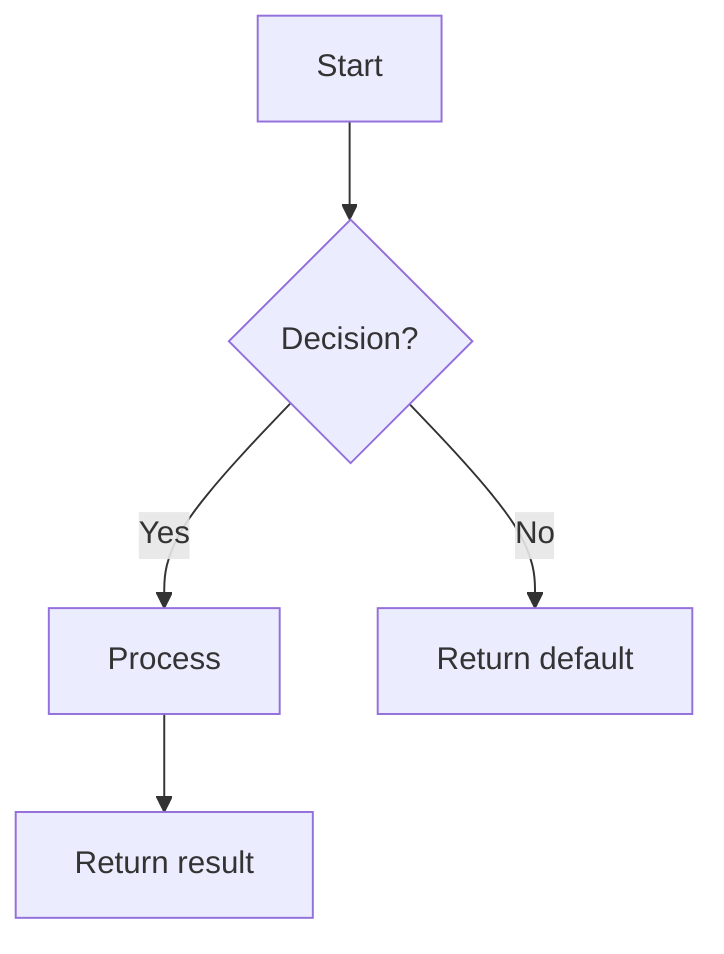

# Feature Detailed Design: [Feature Title] (Feature #ID)

**Date**: YYYY-MM-DD
**Feature**: #ID — [title]
**Priority**: high/medium/low
**Dependencies**: [list or "none"]
**Design Reference**: docs/plans/YYYY-MM-DD-<topic>-design.md § 4.N
**SRS Reference**: FR-xxx

## Context

[1-2 sentences: what this feature does and why it matters]

## Design Alignment

[Copy the FULL design section §4.N content here — including class diagram, sequence diagram, and design decisions. Include Mermaid code blocks verbatim so the design is self-contained for subagent execution.]

- **Key classes**: [from class diagram — classes to create/modify with key methods]
- **Interaction flow**: [from sequence diagram — key call chains]
- **Third-party deps**: [from dependency table — exact library versions]
- **Deviations**: [none, or explain deviation with user approval note]

## SRS Requirement

[Copy the FULL FR-xxx section from SRS — EARS statement, acceptance criteria, Given/When/Then scenarios]

## Component Data-Flow Diagram

[Mermaid `graph` or `flowchart` showing runtime data flow between this feature's internal components. Label edges with data types. Include external dependencies as dashed-border boxes.]

> N/A — [reason, e.g., "single-class feature, see Interface Contract below"]

## Interface Contract

| Method | Signature | Preconditions | Postconditions | Raises |
|--------|-----------|---------------|----------------|--------|
| `method_name` | `method_name(param: Type, ...) -> ReturnType` | [what must be true before call] | [what is guaranteed after call] | [exception + condition] |

**Design rationale** (one line per non-obvious decision):
- [e.g., why threshold defaults to 0.6, why parameter X is optional]

## Internal Sequence Diagram

[Mermaid `sequenceDiagram` showing method-to-method calls WITHIN this feature's implementation. Cover main success path + at least one error path per Raises entry.]

> N/A — [reason, e.g., "single-class implementation, error paths documented in Algorithm error handling table"]

## Algorithm / Core Logic

### [Method Name]

#### Flow Diagram



#### Pseudocode

```
FUNCTION name(param1: Type, param2: Type) -> ReturnType
  // Step 1: [major step]
  // Step 2: [formula or key decision]
  // Step 3: [edge case handling]
  RETURN result
END
```

#### Boundary Decisions

| Parameter | Min | Max | Empty/Null | At boundary |
|-----------|-----|-----|------------|-------------|
| [param]   | [val] | [val] | [behavior] | [behavior] |

#### Error Handling

| Condition | Detection | Response | Recovery |
|-----------|-----------|----------|----------|
| [condition] | [how detected] | [exception or default] | [caller action] |

> N/A — [reason, e.g., "pure CRUD, no algorithm" or "Delegates to [X] — see Feature #N"]

## State Diagram

[Mermaid `stateDiagram-v2` showing all valid states, transitions, triggers, and guard conditions]

> N/A — [reason, e.g., "stateless feature"]

## Test Inventory

| ID | Category | Traces To | Input / Setup | Expected | Kills Which Bug? |
|----|----------|-----------|---------------|----------|-----------------|
| A  | FUNC/happy | FR-xxx AC-1 | [specific values] | [exact result] | [wrong impl this catches] |
| B  | FUNC/error | §Interface Contract Raises | [trigger condition] | [exception type + msg] | [missing branch] |
| C  | BNDRY/edge | §Algorithm boundary table | [edge value] | [exact behavior] | [off-by-one or missing guard] |
| D  | FUNC/state | §State Diagram transition | [pre-state + event] | [post-state] | [missing guard condition] |

## Tasks

### Task 1: Write failing tests
**Files**: [exact paths]
**Steps**:
1. Create test file with imports
2. Write test code for each row in Test Inventory:
   - Test A: [matching table row A]
   - Test B: [matching table row B]
3. Run: `[test command]`
4. **Expected**: All tests FAIL for the right reason

### Task 2: Implement minimal code
**Files**: [exact paths]
**Steps**:
1. [Exact change referencing Algorithm pseudocode]
2. [Exact change referencing Interface Contract]
3. Run: `[test command]`
4. **Expected**: All tests PASS

### Task 3: Coverage Gate
1. Run: `[coverage command]`
2. Check thresholds. If below: return to Task 1.
3. Record coverage output as evidence.

### Task 4: Refactor
1. [Specific refactoring actions]
2. Run full test suite. All tests PASS.

### Task 5: Mutation Gate
1. Run: `[mutation command] --paths-to-mutate=<changed-files>`
2. Check threshold. If below: improve assertions.
3. Record mutation output as evidence.

## Verification Checklist
- [ ] All SRS acceptance criteria (from srs_trace) traced to Interface Contract postconditions
- [ ] All SRS acceptance criteria (from srs_trace) traced to Test Inventory rows
- [ ] Algorithm pseudocode covers all non-trivial methods
- [ ] Boundary table covers all algorithm parameters
- [ ] Error handling table covers all Raises entries
- [ ] Test Inventory negative ratio >= 40%
- [ ] Every skipped section has explicit "N/A — [reason]"
