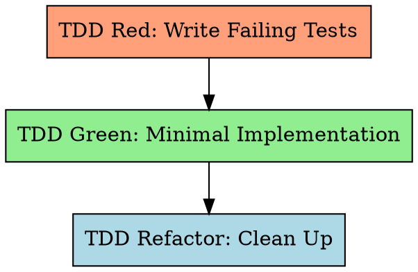

# Test-Driven Development for Long-Task

Write the test first. Watch it fail. Write minimal code to pass. Refactor.

**Violating the letter of the rules is violating the spirit of the rules.**

## The Iron Law

```
NO IMPLEMENTATION CODE WITHOUT A FAILING TEST FIRST
```

Write code before the test? Delete it. Start over. No exceptions.
- Don't keep it as "reference"
- Don't "adapt" it while writing tests
- Don't look at it
- Delete means delete

## Red-Green-Refactor Cycle



## Step 1: TDD Red — Write Failing Tests

Write tests for ALL rows in the Feature Design Test Inventory (§7). Tests MUST fail (feature not yet implemented).

### Specification Input

Tests are driven by three primary sources:
- **Feature Design Test Inventory** (`docs/features/YYYY-MM-DD-<feature-name>.md` §7) — the primary test source; each row maps to one or more test cases
- **SRS requirement section** (`{srs_section}`) — full FR-xxx with Given/When/Then acceptance criteria, boundary conditions, and error paths (located via the feature's `srs_trace` field)
- **Feature detailed design** (`docs/features/YYYY-MM-DD-<feature-name>.md`) — Interface Contract (§3), Algorithm pseudocode and boundary matrix (§5)

The Test Inventory table from feature detailed design is the **primary source** for TDD Red. Each row maps to one or more test cases. TDD rules (Rule 1–6) extend and refine this set. SRS acceptance criteria (from the feature's `srs_trace` requirements) provide supplementary context. ST test case documents are generated *after* TDD as acceptance verification (Worker Step 9).

### Test Scenario Rules (hard requirements)

**Rule 1: Category Coverage** — tests must cover all applicable categories (using the same `MAIN/subtag` format as the Test Inventory):

| Category | What to test | Example |
|----------|-------------|---------|
| **FUNC/happy** | Normal operation, valid inputs | Valid login returns token |
| **FUNC/error** | Known failures, invalid inputs | Invalid password returns 401 |
| **BNDRY/\*** | Limits, empty, max, zero | Empty string; max-length password |
| **SEC/\*** | Injection, authorization (if applicable) | SQL injection in username |

When a category doesn't apply, state it explicitly in a comment:
```python
# SEC: N/A — internal utility with no user-facing input
```

**Rule 2: Negative Test Ratio >= 40%**

```
negative_test_count / total_test_count >= 0.40
```

A test is "negative" if it expects an exception, error, failure state, boundary/extreme input, unauthorized access, or malformed data.

**Rule 3: Assertion Quality — Low-Value <= 20%**

```
low_value_count / total_assertion_count <= 0.20
```

Low-value assertion patterns (avoid):
- `assert x is not None` without checking content
- `assert isinstance(x, SomeType)` without behavior check
- `assert len(x) > 0` without verifying elements
- `assert "key" in dict` without checking value
- `assert bool(x)` / truthiness only
- Import-only tests (`from module import X; assert X is not None`)

**Rule 4: The "Wrong Implementation" Challenge**

For each test, ask: "What wrong implementation would this test catch?"

If "almost any wrong implementation would still pass" → rewrite with more specific assertions.

**Interaction with Feature Detailed Design:** The boundary matrix (§5.3) and error table (§5.4) from the feature detailed design document provide pre-analyzed boundary values and error conditions. Use these as inputs when applying Rule 4 — they identify the "plausible wrong implementations" systematically rather than ad-hoc.

Imagine 2-3 plausible wrong implementations:
- Returns hardcoded value instead of computing
- Swaps two fields
- Off-by-one error
- Skips a validation step
- Returns stale/cached data

Would the test **fail** for each? If NO for most → rewrite.

**Rule 5: Test Layer Rule — Real Test Cases Required**

Each feature's automated tests MUST cover two layers. Both are mandatory:

| Layer | Purpose | Mock policy | Minimum |
|-------|---------|-------------|---------|
| **Unit (UT)** | Individual functions/classes | Mock only at system boundaries (external HTTP, third-party APIs, file system, clock); use real or in-memory implementations for internal logic | ≥ 1 test exercising core logic with real internal dependencies (no mocking internal components) |
| **Integration** | Components working against real infrastructure | NO mock for the primary dependency — use real test DB, real running service, or real file system | ≥ 1 test per feature that touches external systems |

**Integration test exception** — if the feature has absolutely no external dependencies (pure computation, no IO, no DB, no network):
- State explicitly in the test file:
  ```python
  # [no integration test] — pure function, no external I/O
  ```

**Label tests by layer** to enable feature-ST and ST report tracking:
```python
# [unit] — uses in-memory store
def test_user_validation_logic():
    ...

# [integration] — uses real test database
def test_user_persisted_to_db():
    ...
```

Reference: `testing-anti-patterns.md` Anti-Pattern #1 (mock only external services, not internal logic) and Anti-Pattern #3 (mock at system boundaries, not internal layers).

**Mandatory test writing order in TDD Red:**
1. Analyze Feature Design Test Inventory + {srs_section} (via `srs_trace`) + {design_section} to identify external dependencies
2. **Write Real Tests first** (see Rule 5a) — verify external dependency connectivity
3. Then write regular UT tests (happy path / error / boundary / security)
4. Run all tests → confirm all FAIL

**Rule 5a: Real Test Standalone Section (mandatory)**

Every feature with external dependencies MUST have identifiable real tests in its test file(s). The specific marking mechanism is determined by the project language and test framework (documented in `long-task-guide.md` Real Test Convention section), but MUST satisfy these invariants:

| Invariant | Description |
|-----------|-------------|
| **Discoverable** | Real tests MUST be findable by `feature-list.json` `real_test.marker_pattern` via `check_real_tests.py` |
| **Isolatable** | Real tests MUST be runnable independently from regular UTs (via marker filter, folder separation, or naming convention) |
| **No mock on primary dep** | Real test body MUST NOT mock the primary external dependency it verifies; `real_test.mock_patterns` defines detectable mock keywords |
| **High-value assertions** | MUST NOT merely verify "no exception"; MUST assert actual return values, state changes, data persistence |
| **No silent skip** | Real test MUST fail (not skip or return early) when its dependency is unavailable; use `assert env_var, "..."` not `if not env_var: return` |
| **Test infrastructure** | Use project test environment (.env.test, test DB, localhost test server) — never production resources |

**Minimum ≥1 real test per external dependency type:**

| Dependency type | Real test verifies |
|-----------------|-------------------|
| Config / secrets | Can read values from real config file / env vars |
| Database / store | Can connect to real test DB, perform read/write |
| File system | Can read/write real files (beyond trivial tmp_path) |
| HTTP / network | Can send request to real test server and get response |
| Third-party SDK | Can call sandbox / test environment API |

**Pure-function exemption**: If the feature has no external dependencies (pure computation, no I/O), declare explicitly in a test file comment, confirmed by {design_section} during Gate 0.

**Verification**: `python scripts/check_real_tests.py feature-list.json` — mechanical scan + grep, not LLM self-check.

Reference: `testing-anti-patterns.md` Anti-Pattern #15 (all-mock real test / mock label laundering) and Anti-Pattern #16 (silent skip / environment guard bypass).

**Rule 6: UI-Specific Test Rules** (when `"ui": true`)

- **UI Pre-condition (verify before first [devtools] step):**
  Before any Chrome DevTools MCP testing, verify the application is reachable:
  1. Start the dev server if not running — read `env-guide.md` and use the start command for the service with output capture:
     ```bash
     [start command from env-guide.md] > /tmp/svc-<slug>-start.log 2>&1 &
     sleep 3
     head -30 /tmp/svc-<slug>-start.log   # extract PID and port
     ```
     Record PID in `task-progress.md`. If PID is already recorded from this session, run the health check first — skip restart if already running.
  2. Use `navigate_page` to the feature's `ui_entry` URL (or default localhost URL)
  3. If connection refused or page error (ERR_CONNECTION_REFUSED, etc.) → the app is not running. DO NOT proceed with UI tests. Diagnose and fix the startup issue. Never skip UI verification.
- Every `[devtools]` step must use EXPECT/REJECT format:
  ```
  [devtools] <page-path> | EXPECT: <positive criteria> | REJECT: <negative criteria>
  ```
- Execute automated error detection script via `evaluate_script()`
- `list_console_messages(types=["error"])` must return 0 errors (unless `[expect-console-error: <pattern>]`)

See `references/ui-error-detection.md` for the full detection script and integration sequence.

### After Writing Tests

Run the test suite. **All tests must FAIL.** If any test passes → it tests nothing useful, rewrite it.

**Running tests**: Activate environment per `long-task-guide.md` → run test command directly. If tool is missing or environment not activated: diagnose root cause, run `init.sh` if needed, escalate to user if still failing. **Never skip.**

**Real Test Verification (before proceeding to Green):**
Run `python scripts/check_real_tests.py feature-list.json --feature {id}` and confirm:
1. Real test count > 0 (or pure-function exemption declared)
2. No mock warnings (or LLM reviewed and confirmed warnings are not on primary dependency)
If script reports FAIL → STOP, write real tests before proceeding.

## Step 2: TDD Green — Minimal Implementation

Write ONLY enough code to make tests pass.

For subagent mode, dispatch with `skills/long-task-tdd/prompts/implementer-prompt.md` template:
- Provide FULL task text (don't make subagent read files)
- Include tech_stack, test command, coverage command, mutation command
- Exit criteria: all tests pass, no regressions

**Rules:**
- Implement fresh from tests — never reference pre-existing code that was "deleted" in the Iron Law
- One test at a time: make the simplest failing test pass first, then the next
- No premature optimization or extra features

**Startup output requirement** — for any feature that implements a server process or background service:
The implementation MUST log at startup:
- Bound port: e.g., `Starting server on port 8080`
- PID: e.g., `PID: 12345`
- Ready signal: e.g., `Server ready`

Write a TDD Red test that verifies the startup output contains these values before implementing the server binding. This enables reliable port/PID extraction via `head -30` of the startup log.

**env-guide.md sync rule** — after implementing or modifying a server/background service:
1. Compare the actual start command and bound port with `env-guide.md` "Start All Services" and Services table
2. If they differ (port changed, command renamed, new service added): update `env-guide.md` — fix the Services table row and Start/Stop/Verify commands to match
3. If the startup sequence requires >2 shell commands (e.g., DB migration + seed + server): extract to `scripts/svc-<slug>-start.sh` (Unix) / `scripts/svc-<slug>-start.ps1` (Windows); update env-guide.md "Start All Services" to call `bash scripts/svc-<slug>-start.sh`; same pattern for stop sequences
4. Include any `env-guide.md` and `scripts/svc-*` changes in the **same git commit** as the implementation

## Step 3: TDD Refactor

Clean up while keeping tests green:
- Extract duplication, improve naming, simplify
- Run tests after EVERY change (activate environment → run test command directly)
- No new functionality in this step

## Testing Anti-Patterns (Top 5)

1. **Testing mock behavior** — Verify real code, not mock configuration. If you assert on mock return values, you test the mock, not the system.
2. **Implementation detail testing** — Test behavior/output, not internal structure. Don't assert method call counts or internal state.
3. **Tests that can't fail** — Every assertion must be falsifiable. If removing the implementation still passes the test, it's worthless.
4. **Gaming coverage** — Assert-free tests exercise code without verifying correctness. Coverage ≠ quality.
5. **Low-value assertions** — `assertNotNull` / `isinstance` / `len>0` without checking actual values. Max 20% of total.

Full catalog of 15 anti-patterns: Read `skills/long-task-tdd/testing-anti-patterns.md`.

## Integration

**Called by:** long-task-work (Steps 6-8)
**Dispatches:** implementer subagent (`skills/long-task-tdd/prompts/implementer-prompt.md`)
**Requires:** Feature detailed design exists (from Work Step 4, via `long-task:long-task-feature-design`)
**Produces:** Passing tests + implementation code
**Chains to:** long-task-quality (via Work Step 9)
