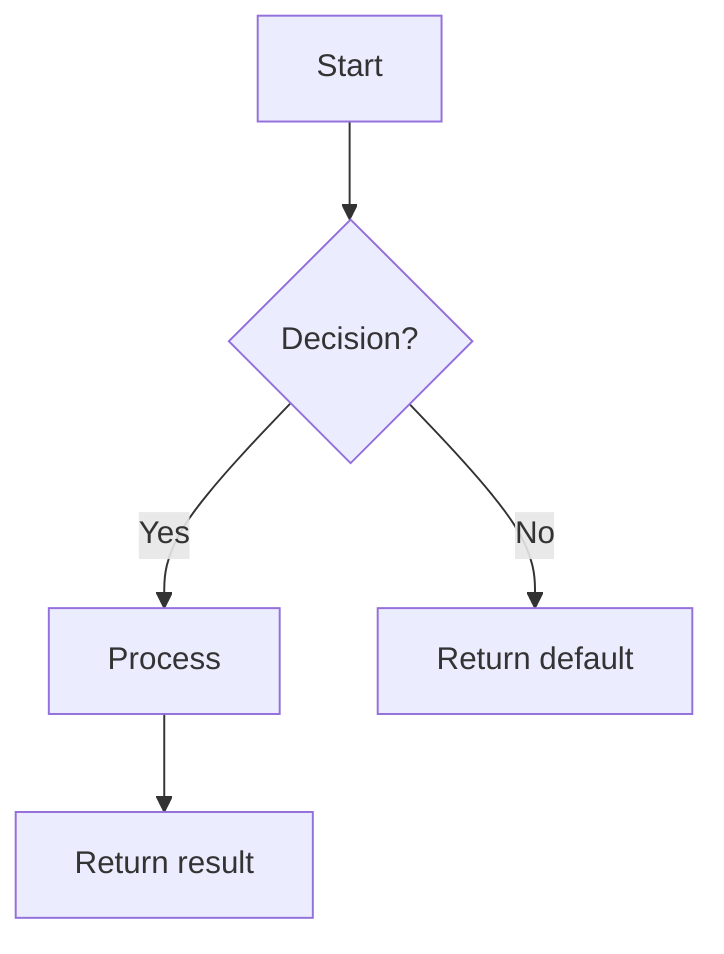

# 特性详细设计：[特性标题]（特性 #ID）

**日期**：YYYY-MM-DD  
**特性**：#ID — [标题]  
**优先级**：high/medium/low  
**依赖**：[列表或 "none"]  
**设计引用**：docs/plans/YYYY-MM-DD-<topic>-design.md § 4.N  
**SRS 引用**：FR-xxx

## 背景

[1–2 句：本特性做什么、为何重要]

## 设计对齐

[在此完整复制系统设计 §4.N 小节 — 含类图、时序图与设计决策。Mermaid 代码块须原样保留，以便子 agent 自包含执行。]

- **关键类**：[来自类图 — 待创建/修改的类及主要方法]
- **交互流程**：[来自时序图 — 关键调用链]
- **第三方依赖**：[来自依赖表 — 精确库版本]
- **偏差**：[无，或说明偏差及用户批准说明]

## SRS 需求

[从 SRS 完整复制 FR-xxx 小节 — EARS 陈述、验收标准、Given/When/Then 场景]

## 组件数据流图

[Mermaid `graph` 或 `flowchart`，展示本特性内部组件间运行时数据流。边标注数据类型。外部依赖用虚线框。]

> N/A — [原因，例如「单类特性，见下文接口契约」]

## 接口契约

| 方法 | 签名 | 前置条件 | 后置条件 | 抛出异常 |
|--------|-----------|---------------|----------------|--------|
| `method_name` | `method_name(param: Type, ...) -> ReturnType` | [调用前必须成立的条件] | [调用后可保证的性质] | [异常 + 触发条件] |

**设计理由**（每条非显而易见决策一行）：
- [例如：阈值为何默认为 0.6，参数 X 为何可选]

## 内部时序图

[Mermaid `sequenceDiagram`，展示**本特性实现内部**方法间调用。覆盖主成功路径 + Interface Contract 中每个 Raises 至少一条错误路径。]

> N/A — [原因，例如「单类实现，错误路径记在算法错误处理表」]

## 算法 / 核心逻辑

### [方法名]

#### 流程图



#### 伪代码

```
FUNCTION name(param1: Type, param2: Type) -> ReturnType
  // 步骤 1：[主要步骤]
  // 步骤 2：[公式或关键决策]
  // 步骤 3：[边界情况处理]
  RETURN result
END
```

#### 边界决策

| 参数 | 最小值 | 最大值 | 空值/Null | 位于边界时 |
|-----------|-----|-----|------------|-------------|
| [param]   | [val] | [val] | [behavior] | [behavior] |

#### 错误处理

| 条件 | 检测方式 | 响应 | 恢复方式 |
|-----------|-----------|----------|----------|
| [condition] | [how detected] | [exception or default] | [caller action] |

> N/A — [原因，例如「纯 CRUD，无算法」或「委托给 [X] — 见特性 #N」]

## 状态图

[Mermaid `stateDiagram-v2`：全部合法状态、转移、触发条件与守卫]

> N/A — [原因，例如「无状态特性」]

## 测试清单（Test Inventory）

| ID | 类别 | 追溯到 | 输入 / 准备 | 预期结果 | 能杀死哪类缺陷？ |
|----|----------|-----------|---------------|----------|-----------------|
| A  | FUNC/happy | FR-xxx AC-1 | [specific values] | [exact result] | [wrong impl this catches] |
| B  | FUNC/error | §Interface Contract Raises | [trigger condition] | [exception type + msg] | [missing branch] |
| C  | BNDRY/edge | §Algorithm boundary table | [edge value] | [exact behavior] | [off-by-one or missing guard] |
| D  | FUNC/state | §State Diagram transition | [pre-state + event] | [post-state] | [missing guard condition] |

## 任务（Tasks）

### 任务 1：编写失败测试
**Files**: [exact paths]
**Steps**:
1. 创建测试文件并写好 import
2. 按 Test Inventory 每一行编写测试代码：
   - Test A: [对应表行 A]
   - Test B: [对应表行 B]
3. 运行：`[test command]`
4. **预期**：所有测试因**正确原因**失败

### 任务 2：最小实现
**Files**: [exact paths]
**Steps**:
1. [对照算法伪代码的具体修改]
2. [对照接口契约的具体修改]
3. 运行：`[test command]`
4. **预期**：所有测试通过

### 任务 3：覆盖率门禁
1. 运行：`[coverage command]`
2. 检查阈值。若未达标：回到任务 1。
3. 将覆盖率输出记为证据。

### 任务 4：重构
1. [具体重构动作]
2. 运行完整测试套件。全部通过。

### 任务 5：变异测试门禁
1. 运行：`[mutation command] --paths-to-mutate=<changed-files>`
2. 检查阈值。若未达标：加强断言。
3. 将变异测试输出记为证据。

## 校验清单（Verification Checklist）
- [ ] 自 `srs_trace` 的全部 SRS 验收标准已追溯到 Interface Contract 的后置条件
- [ ] 自 `srs_trace` 的全部 SRS 验收标准已追溯到 Test Inventory 行
- [ ] 算法伪代码覆盖所有非平凡方法
- [ ] 边界表覆盖算法全部参数
- [ ] 错误处理表覆盖全部 Raises 条目
- [ ] Test Inventory 负例占比 >= 40%
- [ ] 每个跳过的小节均有明确「N/A — [原因]」
