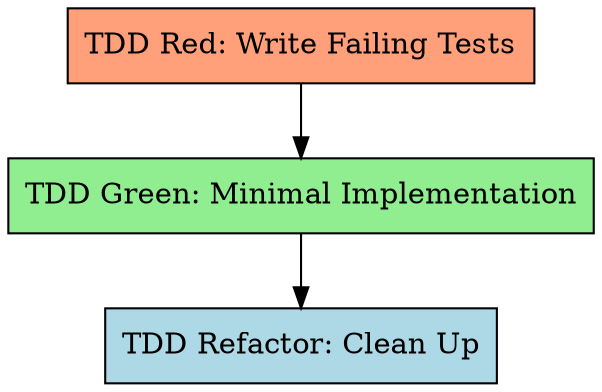

# 长任务场景的测试驱动开发

先写测试，看其失败，再写最少代码通过，最后重构。

**违反规则的字面，就是违反规则的精神。**

## 铁律

```
NO IMPLEMENTATION CODE WITHOUT A FAILING TEST FIRST
```

先写实现再写测试？删掉实现，重来。无例外。
- 不要留作「参考」
- 不要在写测试时「改编」它
- 不要去看它
- 删除就是删除

## 红-绿-重构周期



## 步骤 1：TDD Red —— 编写失败测试

为 Feature Design 测试清单（§7）**每一行**编写测试。测试**必须失败**（特性尚未实现）。

### 规约输入

测试由三个主要来源驱动：
- **Feature Design 测试清单**（`docs/features/YYYY-MM-DD-<feature-name>.md` §7）—— **主**测试来源；每行映射到一个或多个测试用例
- **SRS 需求节**（`{srs_section}`）—— 完整 FR-xxx，含 Given/When/Then 验收、边界与错误路径（经特性 `srs_trace` 定位）
- **特性详细设计**（`docs/features/YYYY-MM-DD-<feature-name>.md`）—— 接口契约（§3）、算法伪代码与边界矩阵（§5）

特性详细设计中的测试清单表是 TDD Red 的**首要来源**。每行映射到一个或多个测试用例。TDD 规则（Rule 1–6）扩展并细化该集合。SRS 验收标准（来自 `srs_trace` 对应需求）提供补充上下文。ST 测试用例文档在 TDD **之后**生成，用于验收验证（Worker 步骤 9）。

### 测试场景规则（硬性要求）

**Rule 1：类别覆盖** —— 测试须覆盖所有适用类别（与测试清单相同的 `MAIN/subtag` 格式）：

| 类别 | 测什么 | 示例 |
|----------|-------------|---------|
| **FUNC/happy** | 正常流程、合法输入 | 合法登录返回 token |
| **FUNC/error** | 已知失败、非法输入 | 错误密码返回 401 |
| **BNDRY/\*** | 上下限、空值、最大值、零值 | 空字符串；最大长度密码 |
| **SEC/\*** | 注入、鉴权（若适用） | 用户名中的 SQL 注入 |

某类别不适用时，在注释中明确说明：
```python
# SEC: N/A — internal utility with no user-facing input
```

**Rule 2：负例比例 ≥ 40%**

```
negative_test_count / total_test_count >= 0.40
```

「负例」指期望异常、错误、失败状态、边界/极端输入、未授权访问或畸形数据的测试。

**Rule 3：断言质量 —— 低价值断言 ≤ 20%**

```
low_value_count / total_assertion_count <= 0.20
```

低价值断言模式（避免）：
- 未检查内容的 `assert x is not None`
- 未检查行为的 `assert isinstance(x, SomeType)`
- 未校验元素的 `assert len(x) > 0`
- 未检查值的 `assert "key" in dict`
- 仅 `assert bool(x)` / 真值判断
- 仅导入测试（`from module import X; assert X is not None`）

**Rule 4：「错误实现」挑战**

对每条测试问：「哪种错误实现会被这条测试抓住？」

若「几乎任何错误实现都能过」→ 用更具体断言重写。

**与特性详细设计的衔接：** 特性详细设计 §5.3 边界矩阵与 §5.4 错误表提供预分析的边界值与错误条件。应用 Rule 4 时以此为输入 —— 系统化识别「貌似合理的错误实现」，而非临时拍脑袋。

设想 2–3 种貌似合理的错误实现：
- 返回硬编码值而非计算结果
- 两个字段对调
- 差一错误
- 跳过某校验步骤
- 返回陈旧/缓存数据

对每种错误实现，测试会**失败**吗？若多数为否 → 重写。

**Rule 5：测试分层规则 —— 必须含真实测试场景**

每个特性的自动化测试**必须**覆盖两层。二者均强制：

| 层级 | 目的 | Mock 策略 | 最低要求 |
|-------|---------|-------------|---------|
| **Unit (UT)** | 单个函数/类 | 仅在系统边界 mock（外部 HTTP、第三方 API、文件系统、时钟）；内部逻辑使用真实或内存实现 | 至少 1 条测试用真实内部依赖覆盖核心逻辑（不 mock 内部组件） |
| **Integration** | 组件与真实基础设施协同工作 | 主依赖**禁止** mock，使用真实测试数据库、真实运行服务或真实文件系统 | 每个触及外部系统的特性至少 1 条测试 |

**集成测试例外** —— 若特性绝对无外部依赖（纯计算、无 IO、无 DB、无网络）：
- 在测试文件中明确声明：
  ```python
  # [no integration test] — pure function, no external I/O
  ```

**按层打标签** 以便 feature-ST 与 ST 报告追踪：
```python
# [unit] — uses in-memory store
def test_user_validation_logic():
    ...

# [integration] — uses real test database
def test_user_persisted_to_db():
    ...
```

参考：`testing-anti-patterns.md` 反模式 #1（仅 mock 外部服务，不 mock 内部逻辑）与 #3（在系统边界 mock，不在内部层）。

**TDD Red 中写测试的强制顺序：**
1. 分析 Feature Design 测试清单 + `{srs_section}`（经 `srs_trace`）+ `{design_section}`，识别外部依赖
2. **先写真实测试**（见 Rule 5a）—— 验证外部依赖连通性
3. 再写常规 UT（主路径 / 错误 / 边界 / 安全）
4. 运行全部测试 → 确认**全部失败**

**Rule 5a：真实测试独立区块（强制）**

凡有外部依赖的特性，**必须**在测试文件中有可识别的真实测试。具体标记机制由项目语言与测试框架决定（见 `long-task-guide.md` Real Test Convention），但须满足：

| 不变量 | 说明 |
|-----------|-------------|
| **Discoverable** | 真实测试必须能被 `check_real_tests.py` 通过 `feature-list.json` 的 `real_test.marker_pattern` 找到 |
| **Isolatable** | 真实测试必须能独立于常规 UT 运行（marker 过滤、目录隔离或命名约定） |
| **No mock on primary dep** | 真实测试主体不得 mock 它要验证的主外部依赖；`real_test.mock_patterns` 定义可检测的 mock 关键词 |
| **High-value assertions** | 不能只验证“未抛异常”；必须断言真实返回值、状态变化或数据持久化 |
| **No silent skip** | 依赖不可用时真实测试必须失败（不能 skip 或提前 return）；用 `assert env_var, "..."`，不要写 `if not env_var: return` |
| **Test infrastructure** | 使用项目测试环境（`.env.test`、测试数据库、localhost 测试服务），绝不能使用生产资源 |

**每类外部依赖至少 1 条真实测试：**

| 依赖类型 | 真实测试需验证 |
|-----------------|-------------------|
| Config / secrets | 能从真实配置文件 / 环境变量读取值 |
| Database / store | 能连接真实测试数据库并执行读写 |
| File system | 能读写真实文件（不只是简单的 `tmp_path`） |
| HTTP / network | 能向真实测试服务发送请求并得到响应 |
| Third-party SDK | 能调用沙箱 / 测试环境 API |

**纯函数豁免**：若无外部依赖（纯计算、无 I/O），在测试文件注释中声明，并由 Gate 0 期间 `{design_section}` 确认。

**验证**：`python scripts/check_real_tests.py feature-list.json` —— 机械扫描 + grep，非 LLM 自检。

参考：`testing-anti-patterns.md` 反模式 #15（全 mock 的「真实测试」/ mock 标签洗钱）与 #16（静默跳过 / 环境守卫绕过）。

**Rule 6：UI 专用规则**（当 `"ui": true`）

- **UI 前置条件（首条 `[devtools]` 步骤前）：**  
  任何 Chrome DevTools MCP 测试前，确认应用可达：
  1. 若开发服务器未运行则启动 —— 读 `env-guide.md`，用对应服务的启动命令并捕获输出：
     ```bash
     [start command from env-guide.md] > /tmp/svc-<slug>-start.log 2>&1 &
     sleep 3
     head -30 /tmp/svc-<slug>-start.log   # extract PID and port
     ```
     在 `task-progress.md` 记录 PID。若本会话已记录 PID，先跑健康检查 —— 已在运行则不必重启。
  2. 用 `navigate_page` 打开特性的 `ui_entry` URL（或默认 localhost URL）
  3. 若连接被拒绝或页面错误（ERR_CONNECTION_REFUSED 等）→ 应用未运行。**不要**继续 UI 测试。诊断并修复启动问题。绝不跳过 UI 验证。
- 每条 `[devtools]` 步骤须使用 EXPECT/REJECT 格式：
  ```
  [devtools] <page-path> | EXPECT: <positive criteria> | REJECT: <negative criteria>
  ```
- 通过 `evaluate_script()` 执行自动化错误检测脚本
- `list_console_messages(types=["error"])` 须返回 0 条错误（除非含 `[expect-console-error: <pattern>]`）

完整检测脚本与集成顺序见 `references/ui-error-detection.md`。

### 写完测试后

运行测试套件。**全部测试必须失败。** 若有测试通过 → 说明测不到有用行为，重写。

**运行测试**：按 `long-task-guide.md` 激活环境 → 直接运行测试命令。若工具缺失或环境未激活：诊断根因，必要时运行 `init.sh`，仍失败则上报用户。**绝不跳过。**

**进入 Green 前的真实测试验证：**  
运行 `python scripts/check_real_tests.py feature-list.json --feature {id}` 并确认：
1. 真实测试数量 > 0（或已声明纯函数豁免）
2. 无 mock 警告（或经 LLM 复核确认警告非针对主依赖）
若脚本报 FAIL → **停**，先补真实测试再继续。

## 步骤 2：TDD Green —— 最少实现

**仅**编写使测试通过所需的最少代码。

子代理模式下，使用 `skills/long-task-tdd/prompts/implementer-prompt.md` 模板派发：
- 提供**完整**任务正文（不要让子代理去读文件）
- 包含 tech_stack、test command、coverage command、mutation command
- 退出条件：全部测试通过、无回归

**规则：**
- 从测试出发全新实现 —— 绝不引用「铁律」下已「删除」的旧代码
- 一次测一条：先让最简单的失败用例通过，再下一条
- 不要过早优化或加额外功能

**启动输出要求** —— 凡实现服务器进程或后台服务的特性，实现**必须**在启动时记录日志：
- 绑定端口：如 `Starting server on port 8080`
- PID：如 `PID: 12345`
- 就绪信号：如 `Server ready`

在实现服务绑定**之前**，先写一条 TDD Red 测试，验证启动输出包含上述值。便于通过启动日志 `head -30` 可靠提取端口/PID。

**env-guide.md 同步规则** —— 实现或修改服务器/后台服务后：
1. 将实际启动命令与绑定端口与 `env-guide.md`「Start All Services」及服务表对照
2. 若不一致（端口变更、命令改名、新增服务）：更新 `env-guide.md` —— 修正服务表行及 Start/Stop/Verify 命令
3. 若启动序列需 >2 条 shell 命令（如 DB 迁移 + seed + 服务器）：抽取为 `scripts/svc-<slug>-start.sh`（Unix）/ `scripts/svc-<slug>-start.ps1`（Windows）；更新 env-guide.md「Start All Services」为调用 `bash scripts/svc-<slug>-start.sh`；停止序列同理
4. 任何 `env-guide.md` 与 `scripts/svc-*` 变更与实现放在**同一 git commit**

## 步骤 3：TDD Refactor

在保持测试绿色的前提下整理：
- 消除重复、改进命名、简化
- **每次**改动后运行测试（激活环境 → 直接运行测试命令）
- 本步骤不增加新功能

## 测试反模式（前五）

1. **测 mock 行为** —— 验证真实代码，而非 mock 配置。若断言 mock 返回值，测的是 mock，不是系统。
2. **测实现细节** —— 测行为/输出，不测内部结构。不要断言调用次数或内部状态。
3. **不可能失败的测试** —— 每条断言必须可证伪。删掉实现仍通过 → 测试无价值。
4. **刷覆盖率** —— 无断言的测试只跑路径不验正确性。覆盖率 ≠ 质量。
5. **低价值断言** —— `assertNotNull` / `isinstance` / `len>0` 未检查实际值。总量最多 20%。

完整 15 条反模式目录：阅读 `skills/long-task-tdd/testing-anti-patterns.md`。

## 集成

**由谁调用：** long-task-work（步骤 6–8）  
**派发：** implementer 子代理（`skills/long-task-tdd/prompts/implementer-prompt.md`）  
**前提：** 已存在特性详细设计（来自 Work 步骤 4，经 `long-task:long-task-feature-design`）  
**产出：** 通过的测试 + 实现代码  
**链接至：** long-task-quality（经 Work 步骤 9）
