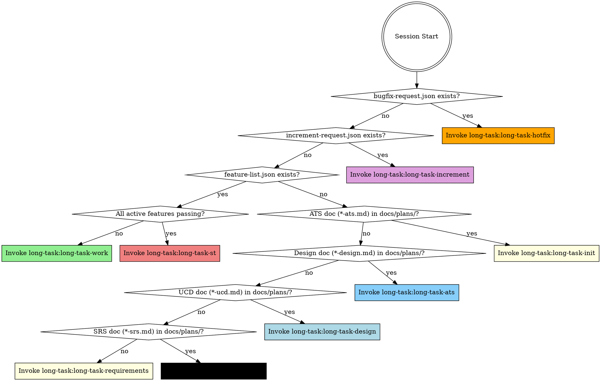

<EXTREMELY-IMPORTANT>
你处于长任务、多会话项目中。在任何回应或行动之前（包括澄清性问题），必须先调用正确的阶段技能。

若适用阶段技能，你没有选择权，必须使用。

不可协商，不可选，不能靠说理绕过。
</EXTREMELY-IMPORTANT>

## 如何访问技能

使用 `Skill` 工具按名称调用技能（例如 `long-task:long-task-work`）。调用后技能内容会加载并呈现给你——直接按其执行。切勿对技能文件使用 Read 工具。

## 阶段检测

检查项目状态并调用对应技能：

**检测规则：**
0. 检查项目根目录 `bugfix-request.json` → 若存在 → `long-task-hotfix` **（最高优先级）**  
   注意：若同时存在 `bugfix-request.json` 与 `increment-request.json`，先执行 hotfix；`increment-request.json` 保留至下一会话处理。
1. 检查项目根目录 `increment-request.json` → 若存在 → `long-task-increment`
2. 检查项目根目录 `feature-list.json` → 若存在：
   - 运行 `python scripts/check_st_readiness.py feature-list.json` — 若退出码为 0（所有活跃特性通过，不含已弃用）→ `long-task-st`
   - 否则（部分活跃特性未通过）→ `long-task-work`
3. 检查 `docs/plans/*-ats.md` → 若有匹配 → `long-task-init`（ATS 已完成，进入 init）
4. 检查 `docs/plans/*-design.md` → 若有匹配 → `long-task-ats`（设计已完成，进入 ATS）
5. 检查 `docs/plans/*-ucd.md` → 若有匹配 → `long-task-design`（UCD 已完成，进入设计）
6. 检查 `docs/plans/*-srs.md` → 若有匹配 → `long-task-ucd`（SRS 已完成，下一步 UCD；若无 UI 特性，UCD 技能会自动跳过至设计）
7. 否则 → `long-task-requirements`

## 技能目录

### 阶段技能（按上文检测仅调用其一）
| 技能 | 阶段 | 时机 |
|-------|-------|------|
| `long-task:long-task-hotfix` | Hotfix | 存在 bugfix-request.json（最高优先级） |
| `long-task:long-task-increment` | Phase 1.5 | 存在 increment-request.json |
| `long-task:long-task-requirements` | Phase 0a | 无 SRS、无设计文档、无 feature-list.json |
| `long-task:long-task-ucd` | Phase 0b | 已有 SRS，无 UCD 文档、无设计文档、无 feature-list.json |
| `long-task:long-task-design` | Phase 0c | 已有 SRS + UCD（或无 UI 特性），无设计文档、无 feature-list.json |
| `long-task:long-task-ats` | Phase 0d | 已有设计文档，无 ATS 文档、无 feature-list.json |
| `long-task:long-task-init` | Phase 1 | 已有 ATS 文档（或极小项目自动跳过 ATS），无 feature-list.json |
| `long-task:long-task-work` | Phase 2 | 存在 feature-list.json，部分活跃特性未通过 |
| `long-task:long-task-st` | Phase 3 | 存在 feature-list.json，**所有**活跃特性已通过 |

### 纪律技能（由 long-task-work 作为子技能调用——不要直接调用）
| 技能 | 用途 |
|-------|---------|
| `long-task:long-task-feature-design` | 特性详细设计——接口契约、算法伪代码、状态图、边界矩阵、测试清单（衔接系统设计 → TDD） |
| `long-task:long-task-feature-st` | 黑盒特性验收测试——自管理启动/清理生命周期、Chrome DevTools MCP 执行、ISO/IEC/IEEE 29119 测试用例文档（每特性，在质量门禁之后） |
| `long-task:long-task-tdd` | TDD 红-绿-重构 |
| `long-task:long-task-quality` | 覆盖率门禁 + 变异测试门禁 |

### 元技能（由阶段技能按条件调用——不要直接调用）
| 技能 | 用途 |
|-------|---------|
| `long-task:long-task-finalize` | ST 后文档——基于场景生成使用示例 + RELEASE_NOTES/task-progress 收尾（在 ST Go 判定之后） |
| `long-task:long-task-retrospective` | 技能自演进——汇总回顾记录并上传 REST API（在 ST Go 判定之后，若已授权） |

## 关键文件（共享契约）

| 文件 | 角色 |
|------|------|
| `docs/plans/*-srs.md` | 已批准 SRS——**做什么（WHAT）** |
| `docs/plans/*-deferred.md` | 延期需求 backlog——下一轮通过 increment 拾取 |
| `docs/plans/*-ucd.md` | 已批准 UCD 风格指南——**长什么样（LOOK）**（仅 UI 项目） |
| `docs/plans/*-design.md` | 已批准设计——**怎么做（HOW）** |
| `docs/plans/*-ats.md` | 已批准 ATS——**测试策略**（需求→场景映射） |
| `feature-list.json` | 任务清单——中央共享状态 |
| `task-progress.md` | `## Current State` 标题（进度）+ 按会话日志 |
| `long-task-guide.md` | 项目专属 Worker 指南 |
| `RELEASE_NOTES.md` | 持续更新的变更日志 |
| `docs/test-cases/feature-*.md` | 每特性 ST 测试用例文档（ISO/IEC/IEEE 29119） |
| `docs/plans/*-st-report.md` | 系统测试报告——Go/No-Go 判定 |
| `bugfix-request.json` | 信号文件——触发 hotfix 会话（处理后删除） |
| `increment-request.json` | 信号文件——触发增量需求（处理后删除） |
| `docs/retrospectives/*.md` | 技能改进记录（Worker 会话期间收集，ST 后上传） |

## 危险信号

出现这些想法意味着**停**——你在自我合理化：

| 想法 | 现实 |
|---------|---------|
| "我先看看代码" | 先调用阶段技能。它会告诉你如何定向。 |
| "我知道该做哪个特性" | Worker 技能有 Orient 步骤，照做。 |
| "这个特性简单，跳过 TDD" | long-task-tdd 不可协商。 |
| "测试过了，可以标完成" | 必须先通过 long-task-quality 门禁。 |
| "我记得工作流" | 技能会演进。用 Skill 工具加载当前版本。 |
| "我需要更多上下文" | 技能检查在探索**之前**。 |
| "我先做这一件小事" | 做任何事**之前**先检查。 |
| "需求很明显，直接设计" | long-task-requirements 会抓住你漏掉的东西。 |
| "测试类别可以 feature-st 再定" | 临时划分会导致 SEC/PERF 缺口。先跑 ATS。 |
| "ATS 对这项目太重" | 查 Scaling Guide——极小项目可自动跳过 ATS。 |
| "SRS 已经隐含了设计" | SRS = WHAT，设计 = HOW，两者都要。 |
| "UI 样式可以边写边定" | 临时样式会导致不一致。先跑 UCD。 |
| "这 UI 太简单不需要风格指南" | 再简单的 UI 也需要 token。UCD 可以轻量。 |
| "所有特性都过了，可以发布" | 特性测试 ≠ 系统测试。先跑 ST 阶段。 |
| "系统测试太重" | 集成缺陷、NFR 失败、流程缺口往往到 ST 才暴露。 |
| "我直接往 JSON 里加特性" | 用 `long-task-increment` 技能做有追踪、可审计的变更。 |
| "需求改动很小，不用影响分析" | Increment 技能能发现隐藏依赖。 |
| "我直接快速修这个 bug" | 调用 `long-task-hotfix`——bug 会在 feature-list.json 中 category=bugfix 追踪，并走完整 Worker 流水线修复。 |
| "Worker 里顺便生成示例" | 示例在 ST 之后由 long-task-finalize 生成。 |

## 技能优先级

1. **阶段技能优先**——决定整段会话工作流  
2. **纪律技能其次**——由 Worker 严格顺序调用（tdd → quality → st-case → review）  
3. **出错时**——在任何修复之前，先遵循 `skills/long-task-work/references/systematic-debugging.md` 中的系统化调试方法
