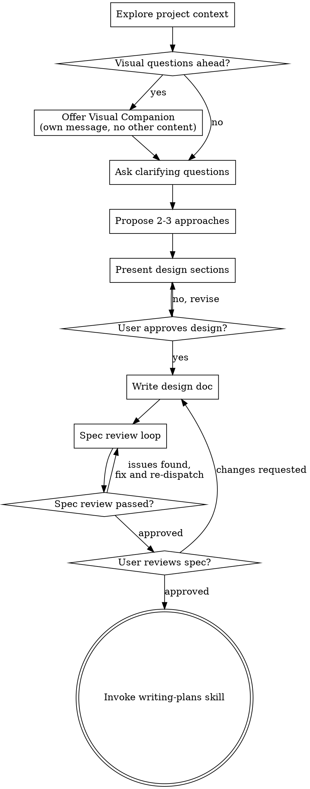

# 将想法头脑风暴为设计

通过自然的协作式对话，帮助把想法落实为完整的设计与规格说明。

先理解当前项目上下文，然后一次只问一个问题以细化想法。一旦清楚要构建什么，就呈现设计并征得用户同意。

<HARD-GATE>
在呈现设计且用户同意之前，不要调用任何实现类技能、不要编写任何代码、不要搭建项目骨架，也不要采取任何实现动作。无论项目看起来多简单，这一条都适用。
</HARD-GATE>

## 反模式：「这太简单了，不需要设计」

每个项目都要走这一流程。待办列表、单函数小工具、改配置——全部如此。「简单」项目最容易带着未审视的假设白干活。设计可以很短（真正简单的项目几句话即可），但你必须呈现设计并取得同意。

## 检查清单

你必须为下列每一项创建任务并按顺序完成：

1. **探索项目上下文** — 查看文件、文档、近期提交
2. **提供可视化伴侣**（若主题会涉及视觉问题）— 单独一条消息，不要和澄清问题混在一起。见下文「可视化伴侣」一节。
3. **提出澄清问题** — 一次一个，弄清目的/约束/成功标准
4. **提出 2–3 种方案** — 含权衡与你的推荐
5. **呈现设计** — 按复杂度分节展开，每一节征得用户同意后再继续
6. **撰写设计文档** — 保存到 `docs/superpowers/specs/YYYY-MM-DD-<topic>-design.md` 并提交
7. **规格评审循环** — 派发 spec-document-reviewer 子代理，并附上精心编写的评审上下文（不要用你的会话历史）；修复问题并再次派发，直至通过（最多 3 轮，之后交给真人）
8. **用户审阅已写规格** — 在继续之前请用户审阅规格文件
9. **转入实现** — 调用 writing-plans 技能以创建实现计划

## 流程概览

**终态是调用 writing-plans。** 不要调用 frontend-design、mcp-builder 或任何其他实现类技能。头脑风暴之后唯一应调用的技能是 writing-plans。

## 流程说明

**理解想法：**

- 先了解当前项目状态（文件、文档、近期提交）
- 在问细节之前评估范围：若请求描述多个彼此独立的子系统（例如「做一个带聊天、文件存储、计费和分析的平台」），要立即标出。不要在一个本该先拆分的项目上花大量问题抠细节。
- 若项目过大、无法放进单一规格，帮助用户拆成子项目：哪些是独立块、如何关联、应按什么顺序构建？然后对第一个子项目按常规设计流程做头脑风暴。每个子项目各自经历 规格 → 计划 → 实现 的循环。
- 对规模合适的项目，一次一个问题地细化想法
- 尽量用选择题，开放式也可以
- 每条消息只问一个问题——若某话题需要更多探讨，拆成多个问题
- 重点弄清：目的、约束、成功标准

**探索方案：**

- 提出 2–3 种不同做法并说明权衡
- 用对话方式呈现选项，给出你的推荐与理由
- 先亮出推荐选项并解释原因

**呈现设计：**

- 一旦你认为已理解要构建什么，就呈现设计
- 每一节的篇幅随复杂度伸缩：简单则几句话，微妙处可到约 200–300 词
- 每节结束后问对方到目前为止是否合理
- 覆盖：架构、组件、数据流、错误处理、测试
- 若有不明之处，准备好回头澄清

**为隔离与清晰而设计：**

- 把系统拆成更小的单元，每个单元职责单一、通过明确定义的接口通信，并可独立理解与测试
- 对每个单元，你应能回答：它做什么、如何使用、依赖什么？
- 能否在不读内部实现的情况下理解单元做什么？能否在不破坏调用方的情况下改内部？若不能，边界需要再打磨。
- 更小、边界清晰的单元也更利于你工作——你能更好把握单文件上下文，修改更可靠。文件变大往往是「做得太多」的信号。

**在现有代码库中工作：**

- 提出改动前先摸清当前结构，遵循既有模式。
- 若现有代码存在影响当前工作的问题（例如文件过大、边界不清、职责纠缠），把有针对性的改进纳入设计——就像优秀开发者在动手时顺带改进周边代码。
- 不要提议无关重构，紧扣当前目标。

## 设计完成之后

**文档：**

- 将已确认的设计（规格）写入 `docs/superpowers/specs/YYYY-MM-DD-<topic>-design.md`
  - （用户对规格位置的偏好优先于该默认路径）
- 若可用，使用 elements-of-style:writing-clearly-and-concisely 技能
- 将设计文档提交到 git

**规格评审循环：**
写完规格文档之后：

1. 派发 spec-document-reviewer 子代理（见 spec-document-reviewer-prompt.md）
2. 若发现问题：修复、再次派发，重复直至通过
3. 若循环超过 3 轮，交给真人定夺

**用户审阅关卡：**
规格评审循环通过后，请用户审阅已写入的规格再继续：

> "规格已写入并提交到 `<path>`。请审阅；若希望在开始写实现计划前做任何修改，请告诉我。"

等待用户回复。若对方要求修改，修改后重新跑规格评审循环。仅在用户同意后再继续。

**实现：**

- 调用 writing-plans 技能以撰写详细实现计划
- 不要调用任何其他技能。下一步只能是 writing-plans。

## 核心原则

- **一次一个问题** — 不要用一堆问题把人淹没
- **尽量用选择题** — 在可行时比开放式更容易回答
- **无情 YAGNI** — 从所有设计中拿掉非必要功能
- **探索替代方案** — 在定案前总要提出 2–3 种做法
- **增量确认** — 先呈现设计、取得同意再往下走
- **保持灵活** — 有不清楚处就回头澄清

## 可视化伴侣

基于浏览器的伴侣工具，用于在头脑风暴中展示线框图、示意图和视觉选项。它是工具而非模式。接受伴侣只表示「在适合视觉呈现的问题里可以用浏览器」；并不代表每个问题都要走浏览器。

**提供伴侣：** 当你预期后续问题会涉及视觉内容（线框、版式、图表）时，征得同意后可提供一次：
> "接下来有些内容如果在网页里展示可能会更好理解。我可以随时帮你做线框、示意图、对比和其他视觉稿。该功能仍较新，且可能消耗较多 token。要试试吗？（需要打开本地 URL）"

**这条邀请必须单独成条消息。** 不要与澄清问题、上下文摘要或其他内容合并。该消息应只包含上述邀请，别无他物。等用户回复后再继续。若对方拒绝，则仅用文字继续头脑风暴。

**按题决策：** 即使用户同意，对**每一个问题**仍要单独判断是否用浏览器或终端。检验标准：**用户是「看到」比「读到」更利于理解吗？**

- **用浏览器** 针对**本身是视觉**的内容 — 线框、线框图、版式对比、架构示意图、并排视觉设计
- **用终端** 针对**文字**内容 — 需求问题、概念选择、权衡列表、A/B/C/D 文字选项、范围决策

关于 UI 的话题并不自动等于视觉问题。「在这种语境下 personality 指什么？」是概念题 — 用终端。「哪种向导版式更好？」是视觉题 — 用浏览器。

若对方同意使用伴侣，在继续之前请先阅读详细说明：
`visual-companion.md`
