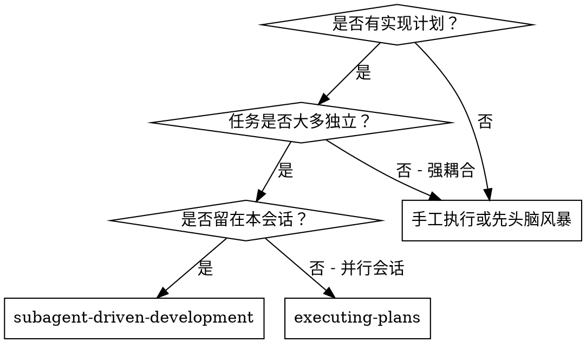
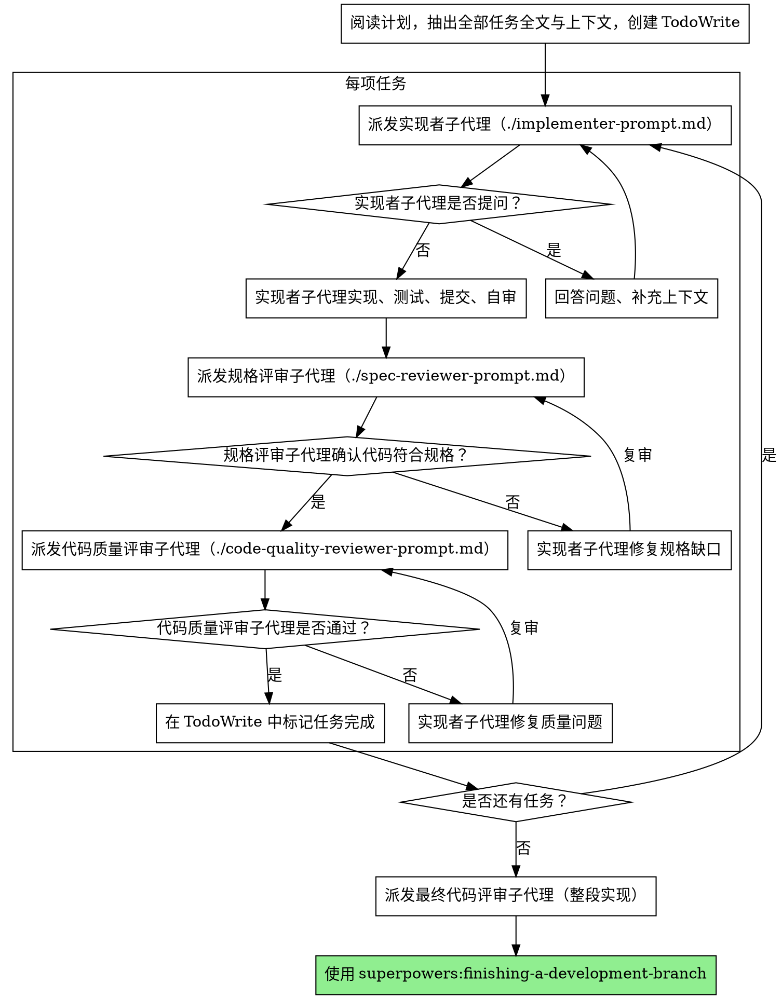

# 子代理驱动开发

通过为每个任务派发全新的子代理来执行计划；每个任务完成后进行两阶段评审：先做规格符合性评审，再做代码质量评审。

**为何用子代理：** 你把任务交给上下文隔离的专业代理。通过精确编写指令与上下文，你能让他们专注并成功完成各自任务。他们不应继承本会话的上下文或历史——由你构造他们所需的一切。这也能为你保留上下文，便于协调。

**核心原则：** 每任务新子代理 + 两阶段评审（先规格、后质量）= 高质量、快迭代

## 何时使用



**与「执行计划」（并行会话）对比：**
- 同一会话（无需切换上下文）
- 每任务全新子代理（避免上下文污染）
- 每任务后两阶段评审：先规格符合性，后代码质量
- 迭代更快（任务之间无需人类介入）

## 流程



## 模型选择

为每个角色选用能胜任的最低能力模型，以节省成本、提高速度。

**机械性实现任务**（独立函数、规格清晰、1–2 个文件）：用快速、廉价模型。计划写得清楚时，多数实现任务都偏机械。

**集成与判断任务**（多文件协调、模式匹配、调试）：用标准模型。

**架构、设计与评审任务**：用当前可用的最强模型。

**任务复杂度信号：**
- 触及 1–2 个文件且规格完整 → 廉价模型
- 触及多文件且有集成顾虑 → 标准模型
- 需要设计判断或广泛理解代码库 → 最强模型

## 处理实现者状态

实现者子代理会回报四种状态之一，需分别应对：

**DONE：** 进入规格符合性评审。

**DONE_WITH_CONCERNS：** 实现者完成工作但标出疑虑。继续前先阅读疑虑。若关乎正确性或范围，评审前先处理；若只是观察（例如「这个文件变大了」），记下来再进入评审。

**NEEDS_CONTEXT：** 实现者缺少未提供的信息。补足缺失上下文后重新派发。

**BLOCKED：** 实现者无法完成任务。评估阻塞原因：
1. 若是上下文问题，提供更多上下文并用同一模型重派
2. 若任务需要更强推理，换更强模型重派
3. 若任务过大，拆成更小任务
4. 若计划本身有误，升级给人类

**绝不**无视升级或在毫无变更时强迫同一模型重试。若实现者表示卡住，必须改变某些条件。

## 提示模板

- `./implementer-prompt.md` — 派发实现者子代理
- `./spec-reviewer-prompt.md` — 派发规格符合性评审子代理
- `./code-quality-reviewer-prompt.md` — 派发代码质量评审子代理

## 示例工作流

```
你：正用子代理驱动开发执行本计划。

[一次性阅读计划：docs/superpowers/plans/feature-plan.md]
[抽出全部 5 个任务的全文与上下文]
[用 TodoWrite 列出全部任务]

任务 1：安装钩子脚本

[取任务 1 全文与上下文（已抽出）]
[派发实现子代理，附任务全文 + 上下文]

实现者：「开工前确认一下——钩子应装在用户级还是系统级？」

你：「用户级（~/.config/superpowers/hooks/）」

实现者：「明白。开始实现……」
[稍后] 实现者：
  - 已实现 install-hook 命令
  - 已加测试，5/5 通过
  - 自审：漏了 --force，已补上
  - 已提交

[派发规格符合性评审]
规格评审者：✅ 符合规格——需求全部满足，无多余内容

[取 git SHA，派发代码质量评审]
代码评审者：优点：测试覆盖好、结构清晰。问题：无。通过。

[标记任务 1 完成]

任务 2：恢复模式

[取任务 2 全文与上下文（已抽出）]
[派发实现子代理，附任务全文 + 上下文]

实现者：[无提问，直接推进]
实现者：
  - 已加 verify/repair 模式
  - 8/8 测试通过
  - 自审：无问题
  - 已提交

[派发规格符合性评审]
规格评审者：❌ 问题：
  - 缺失：进度上报（规格写明「每 100 条上报一次」）
  - 多余：加了 --json（未要求）

[实现者修复]
实现者：已删 --json，已加进度上报

[规格评审者复审]
规格评审者：✅ 现已符合规格

[派发代码质量评审]
代码评审者：优点：扎实。问题（重要）：魔数 100

[实现者修复]
实现者：已抽出 PROGRESS_INTERVAL 常量

[代码评审者复审]
代码评审者：✅ 通过

[标记任务 2 完成]

……

[全部任务完成后]
[派发最终 code-reviewer]
最终评审者：需求均已满足，可合并

完成！
```

## 优势

**相对手工执行：**
- 子代理自然倾向 TDD
- 每任务新上下文（不易混淆）
- 可并行安全（子代理互不干扰）
- 子代理可在开工前与工作中提问

**相对「执行计划」：**
- 同一会话（无交接）
- 持续推进（无需等待）
- 评审检查点自动化

**效率：**
- 无反复读文件开销（控制器提供全文）
- 控制器精确筛选所需上下文
- 子代理事先获得的信息完整
- 问题在开工前暴露（而非事后）

**质量关卡：**
- 自审在交接前发现问题
- 两阶段评审：规格 + 质量
- 评审循环确保修复真正生效
- 规格符合性防止多做/少做
- 代码质量确保实现本身过硬

**成本：**
- 子代理调用更多（每任务实现者 + 2 名评审）
- 控制器前期准备更多（一次性抽出所有任务）
- 评审循环增加迭代次数
- 但能尽早发现问题（比后期调试便宜）

## 危险信号

**绝不：**
- 未经用户明确同意就在 main/master 上开始实现
- 跳过评审（规格符合性或代码质量任一）
- 带着未修复问题继续推进
- 并行派发多个实现子代理（会冲突）
- 让子代理自己去读计划文件（应提供全文）
- 跳过场景设定上下文（子代理需要知道任务在整体中的位置）
- 忽略子代理的问题（先答再问是否继续）
- 在规格符合性上接受「差不多就行」（评审发现问题 = 未完成）
- 跳过评审循环（评审发现问题 = 实现者修复 = 再评审）
- 用实现者自审替代真实评审（两者都需要）
- **在规格符合性未 ✅ 之前就开始代码质量评审**（顺序错误）
- 任一评审仍有未决问题时进入下一任务

**若子代理提问：**
- 清楚、完整地回答
- 必要时补充上下文
- 不要催着他们未经澄清就开工

**若评审发现问题：**
- 由（同一）实现者子代理修复
- 评审者再次评审
- 重复直至通过
- 不要跳过再次评审

**若子代理未能完成任务：**
- 派发修复子代理并给出明确指令
- 不要亲自上手改（会污染上下文）

## 集成

**必备工作流技能：**
- **superpowers:using-git-worktrees** — 必备：开始前建立隔离工作区
- **superpowers:writing-plans** — 生成本技能所执行的计划
- **superpowers:requesting-code-review** — 供评审子代理使用的代码评审模板
- **superpowers:finishing-a-development-branch** — 全部任务完成后收尾

**子代理应使用：**
- **superpowers:test-driven-development** — 子代理对每个任务遵循 TDD

**替代工作流：**
- **superpowers:executing-plans** — 需要并行会话而非同会话执行时使用
