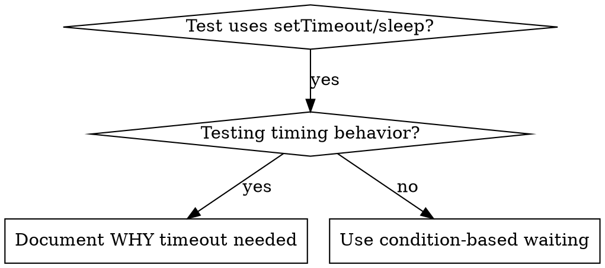

# 基于条件的等待

## 概述

脆弱测试常常用任意延迟去猜时间。这会产生竞态：在快机器上通过，在负载或 CI 下失败。

**核心原则：**等待你真正关心的**条件**达成，而不是猜需要多久。

## 何时使用



**适用于：**
- 测试里有任意延迟（`setTimeout`、`sleep`、`time.sleep()`）
- 测试不稳定（有时过、负载下失败）
- 并行跑时超时
- 等待异步操作完成

**不适用于：**
- 在测真实的计时行为（防抖、节流间隔）
- 若必须使用任意超时，务必说明**原因**

## 核心模式

```typescript
// ❌ BEFORE: Guessing at timing
await new Promise(r => setTimeout(r, 50));
const result = getResult();
expect(result).toBeDefined();

// ✅ AFTER: Waiting for condition
await waitFor(() => getResult() !== undefined);
const result = getResult();
expect(result).toBeDefined();
```

## 速用模式

| 场景 | 模式 |
|----------|---------|
| 等待事件 | `waitFor(() => events.find(e => e.type === 'DONE'))` |
| 等待状态 | `waitFor(() => machine.state === 'ready')` |
| 等待数量 | `waitFor(() => items.length >= 5)` |
| 等待文件 | `waitFor(() => fs.existsSync(path))` |
| 复杂条件 | `waitFor(() => obj.ready && obj.value > 10)` |

## 实现

通用轮询函数：
```typescript
async function waitFor<T>(
  condition: () => T | undefined | null | false,
  description: string,
  timeoutMs = 5000
): Promise<T> {
  const startTime = Date.now();

  while (true) {
    const result = condition();
    if (result) return result;

    if (Date.now() - startTime > timeoutMs) {
      throw new Error(`Timeout waiting for ${description} after ${timeoutMs}ms`);
    }

    await new Promise(r => setTimeout(r, 10)); // Poll every 10ms
  }
}
```

本目录中的 `condition-based-waiting-example.ts` 提供完整实现及领域相关辅助函数（`waitForEvent`、`waitForEventCount`、`waitForEventMatch`），来自真实调试会话。

## 常见错误

**❌ 轮询过快：** `setTimeout(check, 1)` — 浪费 CPU  
**✅ 修正：** 每 10ms 轮询一次

**❌ 无超时：** 条件永不满足时会死循环  
**✅ 修正：** 始终带超时与清晰错误信息

**❌ 数据陈旧：** 在循环外缓存状态  
**✅ 修正：** 在循环内调用 getter 以获取最新数据

## 何时任意超时才是对的

```typescript
// Tool ticks every 100ms - need 2 ticks to verify partial output
await waitForEvent(manager, 'TOOL_STARTED'); // First: wait for condition
await new Promise(r => setTimeout(r, 200));   // Then: wait for timed behavior
// 200ms = 2 ticks at 100ms intervals - documented and justified
```

**要求：**
1. 先等待触发条件
2. 基于已知时序（不是瞎猜）
3. 注释说明**为什么**

## 实际效果

来自调试会话（2025-10-03）：
- 修复 3 个文件中共 15 个脆弱测试
- 通过率：60% → 100%
- 执行时间：快约 40%
- 不再出现竞态
