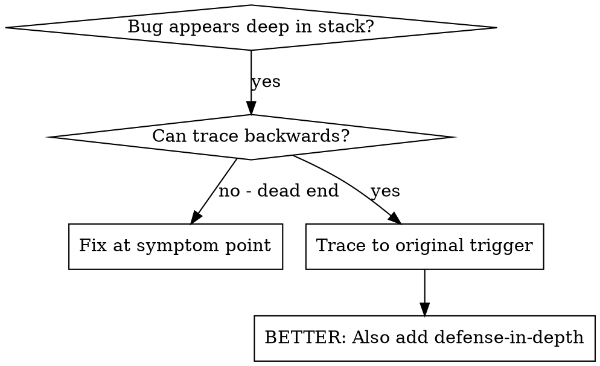
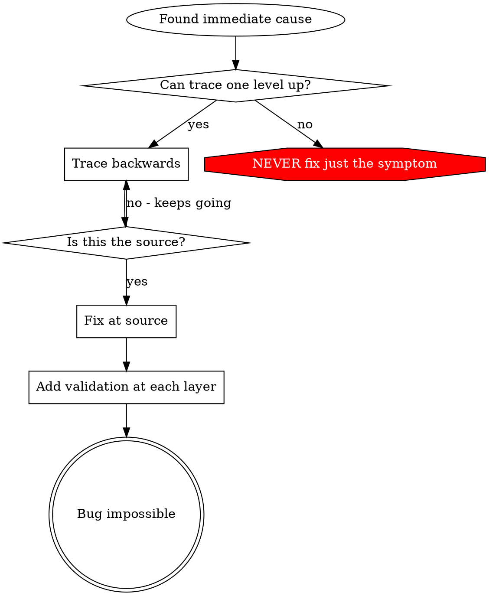

# 根因追踪

## 概述

Bug 常常深埋在调用栈里（在错误目录 `git init`、文件建错位置、数据库用错路径打开）。本能是在报错处修，但那是在治症状。

**核心原则：**沿调用链**反向**追到最初触发点，再在**源头**修复。

## 何时使用



**适用于：**
- 错误发生在执行深处（不在入口）
- 堆栈显示很长的调用链
- 不清楚无效数据从何而来
- 需要找出是哪个测试/代码触发了问题

## 追踪流程

### 1. 观察症状
```
Error: git init failed in /Users/jesse/project/packages/core
```

### 2. 找直接原因
**哪段代码直接导致这个？**
```typescript
await execFileAsync('git', ['init'], { cwd: projectDir });
```

### 3. 问：谁调用了它？
```typescript
WorktreeManager.createSessionWorktree(projectDir, sessionId)
  → called by Session.initializeWorkspace()
  → called by Session.create()
  → called by test at Project.create()
```

### 4. 继续向上追
**传进来的是什么值？**
- `projectDir = ''`（空字符串！）
- 空字符串作为 `cwd` 会解析为 `process.cwd()`
- 那就是源码目录！

### 5. 找最初触发点
**空字符串从哪来？**
```typescript
const context = setupCoreTest(); // Returns { tempDir: '' }
Project.create('name', context.tempDir); // Accessed before beforeEach!
```

## 加堆栈

无法手动追时，加埋点：

```typescript
// Before the problematic operation
async function gitInit(directory: string) {
  const stack = new Error().stack;
  console.error('DEBUG git init:', {
    directory,
    cwd: process.cwd(),
    nodeEnv: process.env.NODE_ENV,
    stack,
  });

  await execFileAsync('git', ['init'], { cwd: directory });
}
```

**关键：**在测试里用 `console.error()`（不要用 logger — 可能不显示）

**运行并捕获：**
```bash
npm test 2>&1 | grep 'DEBUG git init'
```

**分析堆栈：**
- 找测试文件名
- 找触发调用的行号
- 识别模式（同一测试？同一参数？）

## 找出哪个测试造成污染

若测试中出现了某种状态，但不知道哪个测试导致：

使用本目录中的二分脚本 `find-polluter.sh`：

```bash
./find-polluter.sh '.git' 'src/**/*.test.ts'
```

逐个运行测试，在第一个污染者处停止。用法见脚本内说明。

## 真实示例：空的 projectDir

**症状：**在 `packages/core/`（源码）下创建了 `.git`

**追踪链：**
1. `git init` 在 `process.cwd()` 运行 ← 空的 cwd 参数
2. WorktreeManager 收到空的 projectDir
3. `Session.create()` 传入空字符串
4. 测试在 `beforeEach` 之前访问了 `context.tempDir`
5. `setupCoreTest()` 初始返回 `{ tempDir: '' }`

**根因：**顶层变量初始化时访问了尚未就绪的空值

**修复：**将 tempDir 改为 getter，在 `beforeEach` 之前访问则抛错

**同时增加纵深防御：**
- 第 1 层：`Project.create()` 校验目录
- 第 2 层：`WorkspaceManager` 校验非空
- 第 3 层：`NODE_ENV` 守卫拒绝在 tmpdir 外 `git init`
- 第 4 层：`git init` 前记录堆栈

## 核心原则



**绝不在报错处草草了事。** 反向追到最初触发点再修。

## 堆栈技巧

**在测试中：**用 `console.error()`，不用 logger — logger 可能被抑制  
**在操作之前：**在危险操作**前**打日志，而不是等失败后再打  
**带上上下文：**目录、cwd、环境变量、时间戳  
**捕获堆栈：**`new Error().stack` 显示完整调用链

## 实际效果

来自调试会话（2025-10-03）：
- 通过 5 层追踪找到根因
- 在源头修复（getter 校验）
- 增加 4 层防御
- 1847 个测试通过，零污染
