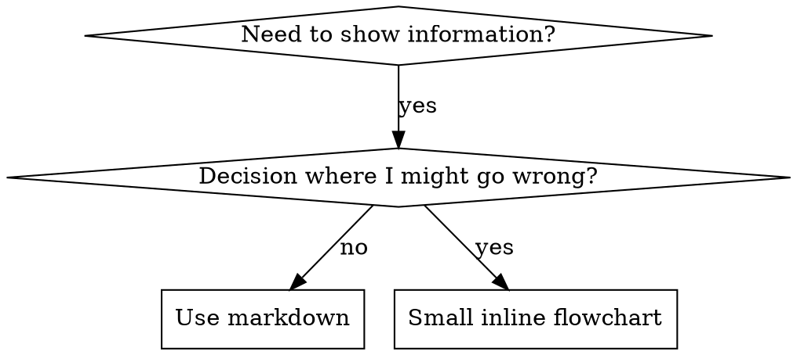

# 撰写技能

## 概述

**撰写技能就是把测试驱动开发（TDD）用在流程文档上。**

**个人技能放在代理专用目录（Claude Code 为 `~/.claude/skills`，Codex 为 `~/.agents/skills/`）**

你编写测试用例（带子代理的压力场景），观察失败（基线行为），编写技能（文档），观察通过（代理遵守），再重构（堵住漏洞）。

**核心原则：** 若你没见过代理在**没有**技能时的失败，你就不知道技能是否教对了东西。

**必读背景：** 使用本技能前**必须**理解 superpowers:test-driven-development。该技能定义根本的 RED-GREEN-REFACTOR 循环。本技能把 TDD 适配到文档。

**官方指引：** Anthropic 官方技能撰写最佳实践见 anthropic-best-practices.md。该文档提供与本技能中 TDD 导向方法互补的模式与准则。

## 什么是技能？

**技能**是经过验证的技术、模式或工具的参考指南。技能帮助未来的 Claude 实例找到并应用有效做法。

**技能是：** 可复用技术、模式、工具、参考指南

**技能不是：** 关于你某次如何解决问题的叙事

## 技能与 TDD 的对应

| TDD 概念 | 技能创建 |
|-------------|----------------|
| **测试用例** | 带子代理的压力场景 |
| **生产代码** | 技能文档（SKILL.md） |
| **测试失败（红）** | 无技能时代理违反规则（基线） |
| **测试通过（绿）** | 有技能时代理遵守 |
| **重构** | 在保持遵守的前提下堵住漏洞 |
| **先写测试** | 在写技能**之前**运行基线场景 |
| **观察失败** | 逐字记录代理的借口 |
| **最少代码** | 只写针对那些违规的技能 |
| **观察通过** | 验证代理现已遵守 |
| **重构循环** | 发现新借口 → 补上 → 再验证 |

整个技能创建过程遵循 RED-GREEN-REFACTOR。

## 何时创建技能

**在以下情况创建：**
- 技巧对你并非一目了然
- 你会在多个项目中再次引用
- 模式适用范围广（非单项目）
- 他人也会受益

**不要为以下情况创建：**
- 一次性解法
- 别处已有充分文档的标准实践
- 项目专属约定（放进 CLAUDE.md）
- 机械约束（若能用正则/校验强制执行——就自动化；文档留给需要判断的情形）

## 技能类型

### 技术（Technique）
有步骤可循的具体方法（condition-based-waiting、root-cause-tracing）

### 模式（Pattern）
思考问题的方式（flatten-with-flags、test-invariants）

### 参考（Reference）
API 文档、语法指南、工具文档（office 文档等）

## 目录结构


```
skills/
  skill-name/
    SKILL.md              # Main reference (required)
    supporting-file.*     # Only if needed
```

**扁平命名空间** — 所有技能处于同一可搜索命名空间

**拆成单独文件适用于：**
1. **厚重参考资料**（100+ 行）— API 文档、完整语法
2. **可复用工具** — 脚本、实用程序、模板

**保留在内联：**
- 原则与概念
- 代码模式（< 50 行）
- 其余内容

## SKILL.md 结构

**页眉（YAML）：**
- 仅支持两个字段：`name` 与 `description`
- 合计最多 1024 字符
- `name`：仅用字母、数字、连字符（无括号等特殊字符）
- `description`：第三人称，**仅**描述何时使用（**不要**写它做什么）
  - 以「Use when...」开头，聚焦触发条件
  - 包含具体症状、情境与上下文
  - **永远不要概括技能的过程或工作流**（原因见 CSO 一节）
  - 可能的话控制在 500 字符以内

```markdown
---
name: Skill-Name-With-Hyphens
description: Use when [specific triggering conditions and symptoms]
---

# Skill Name

## Overview
What is this? Core principle in 1-2 sentences.

## When to Use
[Small inline flowchart IF decision non-obvious]

Bullet list with SYMPTOMS and use cases
When NOT to use

## Core Pattern (for techniques/patterns)
Before/after code comparison

## Quick Reference
Table or bullets for scanning common operations

## Implementation
Inline code for simple patterns
Link to file for heavy reference or reusable tools

## Common Mistakes
What goes wrong + fixes

## Real-World Impact (optional)
Concrete results
```


## Claude 搜索优化（CSO）

**可发现性至关重要：** 未来的 Claude 需要**找到**你的技能

### 1. 丰富的 description 字段

**作用：** Claude 读 description 来决定为当前任务加载哪些技能。要回答：「我现在该不该读这个技能？」

**格式：** 以「Use when...」开头，聚焦触发条件

**关键：description = 何时用，而不是技能做什么**

description **只**应描述触发条件。**不要**在 description 里概括技能流程或工作流。

**原因：** 测试表明，当 description 概括工作流时，Claude 可能跟着 description 走而不读全文。某 description 写「任务间做代码评审」会导致 Claude 只做**一次**评审，尽管技能里的流程图明确是**两次**评审（规格符合性，然后代码质量）。

当 description 改为仅「Use when executing implementation plans with independent tasks」（无工作流摘要）时，Claude 会正确读流程图并遵循两阶段评审。

**陷阱：** 概括工作流的 description 会成为 Claude 抄的近路。技能正文变成会被跳过的文档。

```yaml
# ❌ BAD: Summarizes workflow - Claude may follow this instead of reading skill
description: Use when executing plans - dispatches subagent per task with code review between tasks

# ❌ BAD: Too much process detail
description: Use for TDD - write test first, watch it fail, write minimal code, refactor

# ✅ GOOD: Just triggering conditions, no workflow summary
description: Use when executing implementation plans with independent tasks in the current session

# ✅ GOOD: Triggering conditions only
description: Use when implementing any feature or bugfix, before writing implementation code
```

**内容：**
- 使用具体触发器、症状与情境
- 描述*问题*（竞态、行为不一致），而非*语言专属症状*（setTimeout、sleep）
- 除非技能本身技术相关，否则触发条件与技术无关
- 若技能技术相关，在触发条件中明确写出
- 第三人称撰写（注入系统提示）
- **永远不要概括技能的过程或工作流**

```yaml
# ❌ BAD: Too abstract, vague, doesn't include when to use
description: For async testing

# ❌ BAD: First person
description: I can help you with async tests when they're flaky

# ❌ BAD: Mentions technology but skill isn't specific to it
description: Use when tests use setTimeout/sleep and are flaky

# ✅ GOOD: Starts with "Use when", describes problem, no workflow
description: Use when tests have race conditions, timing dependencies, or pass/fail inconsistently

# ✅ GOOD: Technology-specific skill with explicit trigger
description: Use when using React Router and handling authentication redirects
```

### 2. 关键词覆盖

使用 Claude 会搜索的词：
- 报错信息："Hook timed out"、"ENOTEMPTY"、"race condition"
- 症状："flaky"、"hanging"、"zombie"、"pollution"
- 同义："timeout/hang/freeze"、"cleanup/teardown/afterEach"
- 工具：真实命令、库名、文件类型

### 3. 描述性命名

**主动语态、动词在前：**
- ✅ `creating-skills` 而非 `skill-creation`
- ✅ `condition-based-waiting` 而非 `async-test-helpers`

### 4. Token 效率（关键）

**问题：** getting-started 与高频引用技能会进入**每一次**对话。每个 token 都珍贵。

**目标字数：**
- getting-started 工作流：每条 <150 词
- 频繁加载的技能：总计 <200 词
- 其他技能：<500 词（仍要简洁）

**技巧：**

**细节移到工具帮助：**
```bash
# ❌ BAD: Document all flags in SKILL.md
search-conversations supports --text, --both, --after DATE, --before DATE, --limit N

# ✅ GOOD: Reference --help
search-conversations supports multiple modes and filters. Run --help for details.
```

**使用交叉引用：**
```markdown
# ❌ BAD: Repeat workflow details
When searching, dispatch subagent with template...
[20 lines of repeated instructions]

# ✅ GOOD: Reference other skill
Always use subagents (50-100x context savings). REQUIRED: Use [other-skill-name] for workflow.
```

**压缩示例：**
```markdown
# ❌ BAD: Verbose example (42 words)
your human partner: "How did we handle authentication errors in React Router before?"
You: I'll search past conversations for React Router authentication patterns.
[Dispatch subagent with search query: "React Router authentication error handling 401"]

# ✅ GOOD: Minimal example (20 words)
Partner: "How did we handle auth errors in React Router?"
You: Searching...
[Dispatch subagent → synthesis]
```

**消除冗余：**
- 不要重复交叉引用技能里已有的内容
- 不要解释从命令就能看出的显而易见之事
- 不要堆砌同一模式的多个示例

**验证：**
```bash
wc -w skills/path/SKILL.md
# getting-started workflows: aim for <150 each
# Other frequently-loaded: aim for <200 total
```

**按行为或核心洞见命名：**
- ✅ `condition-based-waiting` > `async-test-helpers`
- ✅ `using-skills` 而非 `skill-usage`
- ✅ `flatten-with-flags` > `data-structure-refactoring`
- ✅ `root-cause-tracing` > `debugging-techniques`

**动名词（-ing）适合流程：**
- `creating-skills`、`testing-skills`、`debugging-with-logs`
- 主动，描述你在做的动作

### 5. 交叉引用其他技能

**在文档中引用其他技能时：**

仅用技能名，并标明是否必选：
- ✅ 好：`**REQUIRED SUB-SKILL:** Use superpowers:test-driven-development`
- ✅ 好：`**REQUIRED BACKGROUND:** You MUST understand superpowers:systematic-debugging`
- ❌ 差：`See skills/testing/test-driven-development`（不清楚是否必选）
- ❌ 差：`@skills/testing/test-driven-development/SKILL.md`（强制加载，消耗上下文）

**为何不用 @ 链接：** `@` 语法会立即强制加载文件，在需要之前就消耗 200k+ 上下文。

## 流程图用法



**仅在以下情况使用流程图：**
- 非显而易见的决策点
- 可能过早停下的流程循环
- 「何时用 A 而非 B」的决策

**永远不要对以下情况用流程图：**
- 参考资料 → 表格、列表
- 代码示例 → Markdown 代码块
- 线性说明 → 编号列表
- 无语义标签（step1、helper2）

详见 @graphviz-conventions.dot 的 graphviz 风格规则。

**为人类合作者可视化：** 用本目录下的 `render-graphs.js` 将技能的流程图渲染为 SVG：
```bash
./render-graphs.js ../some-skill           # Each diagram separately
./render-graphs.js ../some-skill --combine # All diagrams in one SVG
```

## 代码示例

**一个精彩示例胜过许多平庸示例**

选最相关的语言：
- 测试技术 → TypeScript/JavaScript
- 系统调试 → Shell/Python
- 数据处理 → Python

**好示例：**
- 完整可运行
- 注释清楚说明**为何**
- 来自真实场景
- 模式一目了然
- 便于改写（非空洞模板）

**不要：**
- 用 5+ 种语言实现
- 做填空模板
- 写牵强示例

你擅长移植——一个绝佳示例足矣。

## 文件组织

### 自包含技能
```
defense-in-depth/
  SKILL.md    # Everything inline
```
适用：内容都能内联，无需厚重参考

### 带可复用工具的技能
```
condition-based-waiting/
  SKILL.md    # Overview + patterns
  example.ts  # Working helpers to adapt
```
适用：工具是可复用代码，而非仅叙事

### 带厚重参考的技能
```
pptx/
  SKILL.md       # Overview + workflows
  pptxgenjs.md   # 600 lines API reference
  ooxml.md       # 500 lines XML structure
  scripts/       # Executable tools
```
适用：参考资料过大不宜内联

## 铁律（与 TDD 相同）

```
NO SKILL WITHOUT A FAILING TEST FIRST
```

适用于**新技能**与**对现有技能的编辑**。

先写技能再测？删掉。重来。
改技能不测？同样违规。

**没有例外：**
- 不为「简单补充」开脱
- 不为「只加一节」开脱
- 不为「文档更新」开脱
- 不要把未测变更当「参考」留着
- 不要在跑测试时「边测边改」
- 删就是删

**必读背景：** superpowers:test-driven-development 技能解释为何重要。原则同样适用于文档。

## 测试各类技能

不同类型需要不同测法：

### 纪律类技能（规则/要求）

**示例：** TDD、verification-before-completion、designing-before-coding

**用以下方式测：**
- 学术问题：是否理解规则？
- 压力场景：压力下是否遵守？
- 多重压力组合：时间 + 沉没成本 + 疲惫
- 识别借口并加入明确反驳

**成功标准：** 在最大压力下代理仍遵守规则

### 技术类技能（操作指南）

**示例：** condition-based-waiting、root-cause-tracing、defensive-programming

**用以下方式测：**
- 应用场景：能否正确应用技术？
- 变体场景：能否处理边界情况？
- 信息缺失测试：说明是否有缺口？

**成功标准：** 代理在新场景下成功应用技术

### 模式类技能（心智模型）

**示例：** reducing-complexity、information-hiding 等概念

**用以下方式测：**
- 识别场景：是否知道模式何时适用？
- 应用场景：能否使用心智模型？
- 反例：是否知道何时**不应**套用？

**成功标准：** 代理正确判断何时/如何应用模式

### 参考类技能（文档/API）

**示例：** API 文档、命令参考、库指南

**用以下方式测：**
- 检索场景：能否找到正确信息？
- 应用场景：能否正确使用找到的内容？
- 缺口测试：常见用例是否覆盖？

**成功标准：** 代理找到并正确应用参考信息

## 跳过测试的常见借口

| 借口 | 现实 |
|--------|---------|
| 「技能显然很清楚」 | 对你清楚 ≠ 对其他代理清楚。要测。 |
| 「只是参考资料」 | 参考也可能有缺口、含糊段落。要测检索。 |
| 「测试小题大做」 | 未测技能总有毛病。测 15 分钟省几小时。 |
| 「有问题再测」 | 问题 = 代理用不了技能。部署**前**要测。 |
| 「测试太烦」 | 比在生产里调试烂技能省心。 |
| 「我有把握很好」 | 过度自信必有坑。照样要测。 |
| 「学术审阅够了」 | 读 ≠ 用。要测应用场景。 |
| 「没时间测」 | 部署未测技能以后修更费时间。 |

**以上全部意味着：部署前要测。没有例外。**

## 针对借口的技能加固

强调纪律的技能（如 TDD）需要抵抗合理化。代理很聪明，压力下会找漏洞。

**心理学注：** 理解说服技巧**为何**有效，有助于系统运用。见 persuasion-principles.md 的研究基础（Cialdini, 2021；Meincke et al., 2025）关于权威、承诺、稀缺、社会认同与认同（unity）原则。

### 明确堵上每个漏洞

不要只陈述规则——要禁止具体绕过：

<Bad>
```markdown
Write code before test? Delete it.
```
</Bad>

<Good>
```markdown
Write code before test? Delete it. Start over.

**No exceptions:**
- Don't keep it as "reference"
- Don't "adapt" it while writing tests
- Don't look at it
- Delete means delete
```
</Good>

### 应对「精神 vs 字面」论调

尽早加入基础原则：

```markdown
**Violating the letter of the rules is violating the spirit of the rules.**
```

这能砍掉整类「我遵循精神」的借口。

### 建立合理化对照表

从基线测试（见下文测试一节）捕获借口。代理找的每个借口都放进表：

```markdown
| Excuse | Reality |
|--------|---------|
| "Too simple to test" | Simple code breaks. Test takes 30 seconds. |
| "I'll test after" | Tests passing immediately prove nothing. |
| "Tests after achieve same goals" | Tests-after = "what does this do?" Tests-first = "what should this do?" |
```

### 建立红旗列表

让代理容易自检是否在自我合理化：

```markdown
## Red Flags - STOP and Start Over

- Code before test
- "I already manually tested it"
- "Tests after achieve the same purpose"
- "It's about spirit not ritual"
- "This is different because..."

**All of these mean: Delete code. Start over with TDD.**
```

### 为违规征兆更新 CSO

在 description 中加入：你**即将**违反规则时的症状：

```yaml
description: use when implementing any feature or bugfix, before writing implementation code
```

## 技能的 RED-GREEN-REFACTOR

遵循 TDD 循环：

### 红：写失败测试（基线）

**不带**技能运行压力子代理场景。记录确切行为：
- 做了哪些选择？
- 用了哪些借口（原话）？
- 哪些压力触发了违规？

这就是「观察测试失败」——写技能前必须看到代理自然状态下会怎么做。

### 绿：写最少技能

写技能，针对那些具体借口。不要为假想情况堆额外内容。

用**同一批**场景**带**技能再跑。代理应现已遵守。

### 重构：堵漏洞

代理找到新借口？加明确反驳。再测直到够硬。

**测试方法：** 完整方法见 @testing-skills-with-subagents.md：
- 如何写压力场景
- 压力类型（时间、沉没成本、权威、疲惫）
- 系统堵洞
- 元测试技巧

## 反模式

### ❌ 叙事示例
「在 2025-10-03 的会话里，我们发现空 projectDir 导致……」
**为何差：** 过细，不可复用

### ❌ 多语言稀释
example-js.js、example-py.py、example-go.go
**为何差：** 质量平庸，维护负担重

### ❌ 流程图里写代码
```dot
step1 [label="import fs"];
step2 [label="read file"];
```
**为何差：** 无法复制粘贴，难读

### ❌ 泛化标签
helper1、helper2、step3、pattern4
**为何差：** 标签应有语义

## 停：进入下一技能之前

**写完任意技能后，你必须停下并完成部署流程。**

**不要：**
- 未测完就批量连建多个技能
- 当前技能未验证就去做下一个
- 因为「批量更高效」而跳过测试

**下面的部署清单对每一项技能都是强制性的。**

部署未测技能 = 部署未测代码。违背质量标准。

## 技能创建清单（TDD 适配）

**重要：用 TodoWrite 为下面每一项建待办。**

**红阶段 — 写失败测试：**
- [ ] 创建压力场景（纪律类至少 3 种压力组合）
- [ ] **不带**技能跑场景 — 原样记录基线行为
- [ ] 归纳借口/失败模式

**绿阶段 — 写最少技能：**
- [ ] 名称仅用字母、数字、连字符（无括号/特殊字符）
- [ ] YAML 页眉仅 `name` 与 `description`（合计最多 1024 字符）
- [ ] `description` 以「Use when...」开头并含具体触发/症状
- [ ] `description` 第三人称
- [ ] 全文穿插可搜索关键词（错误、症状、工具）
- [ ] 清晰概述与核心原则
- [ ] 针对红阶段识别的具体失败点
- [ ] 代码内联**或**链到单独文件
- [ ] 一个绝佳示例（不要多语言）
- [ ] **带**技能跑场景 — 验证代理现已遵守

**重构阶段 — 堵漏洞：**
- [ ] 从测试中识别**新**借口
- [ ] 添加明确反驳（若是纪律类技能）
- [ ] 用所有测试轮次建合理化对照表
- [ ] 建立红旗列表
- [ ] 再测直到够硬

**质量检查：**
- [ ] 仅当决策不显然时用小型流程图
- [ ] 速查表
- [ ] 常见错误一节
- [ ] 无故事化叙事
- [ ] 支持文件仅用于工具或厚重参考

**部署：**
- [ ] 将技能提交 git 并推送到你的 fork（若已配置）
- [ ] 若普适有用，考虑通过 PR 贡献回去

## 发现工作流

未来 Claude 如何找到你的技能：

1. **遇到问题**（「测试不稳定」）
3. **找到 SKILL**（description 匹配）
4. **扫概述**（是否相关？）
5. **读模式**（速查表）
6. **加载示例**（仅在实现时）

**为该流程优化** — 尽早、尽量多次放入可搜索词。

## 底线

**创建技能就是流程文档的 TDD。**

同一铁律：没有先失败的测试就没有技能。
同一循环：红（基线）→ 绿（写技能）→ 重构（堵漏洞）。
同一收益：质量更好、意外更少、结果更硬。

若你对代码用 TDD，对技能也要用。是同一种纪律用在文档上。
